> 扩展目录：[中文站](https://pigsty.cc/ext/) · [英文站](https://pigsty.io/ext/)

扩展是 PostgreSQL 的灵魂。没有扩展的 PostgreSQL，只是一个普通的关系型数据库；有了扩展的 PostgreSQL，[才是那个能吞噬整个数据库世界的超级平台](/pg/pg-eat-db-world/)。

但长期以来，PG 扩展生态一直面临一个尴尬的问题：**找不到、看不懂、装不上**。你想用一个扩展，得先去 GitHub 翻 README，再去 PGXN 碰运气看有没有包，然后对着不同操作系统的包管理器折腾半天。运气好装上了，运气不好，编译失败、依赖缺失、版本不兼容，一下午就没了。

所以我做了一件事：把 PostgreSQL 生态里收录的 **464 个扩展**，每一个都做成一张完整的“身份证”，整理成一个中英双语的扩展百科全书。当然，它不只是百科全书，还是一套真正可交付的二进制仓库。我们提供 14 个 Linux 平台、最近 5 个 PG 大版本的 RPM / DEB 软件包，做到真正的开箱即用。


## 这不是一个列表，而是一本百科全书

市面上不缺 PostgreSQL 扩展列表。PGXN 有一个，各种 Awesome List 也一大堆。但它们通常只给你一个名字和一句话简介。你想进一步知道这个扩展用什么语言写、用什么许可证、支持哪些 PG 版本、在你的操作系统上有没有预编译包、怎么安装、有没有冲突扩展，往往还是得自己去折腾。

我做的这个目录不一样。点进任意扩展详情页，你能直接看到：

- **基础元数据**：版本号、所属分类、开源许可证、开发语言、GitHub 仓库、源码下载地址。
- **扩展属性**：是否需要预加载、是否包含 DDL、是否支持 `CREATE EXTENSION`、是否 `trusted`、是否可 relocate、默认安装到哪个 schema。
- **版本与构建信息**：当前收录版本、支持的 PG 大版本、RPM 包名、DEB 包名。
- **全平台下载矩阵**：14 个操作系统与架构组合下，对应的包、下载链接和包大小。
- **安装命令**：针对 `pig`、`dnf`、`apt` 三种方式，给出可直接复制粘贴的完整命令。
- **关联关系**：相关扩展、依赖扩展、冲突扩展一目了然。

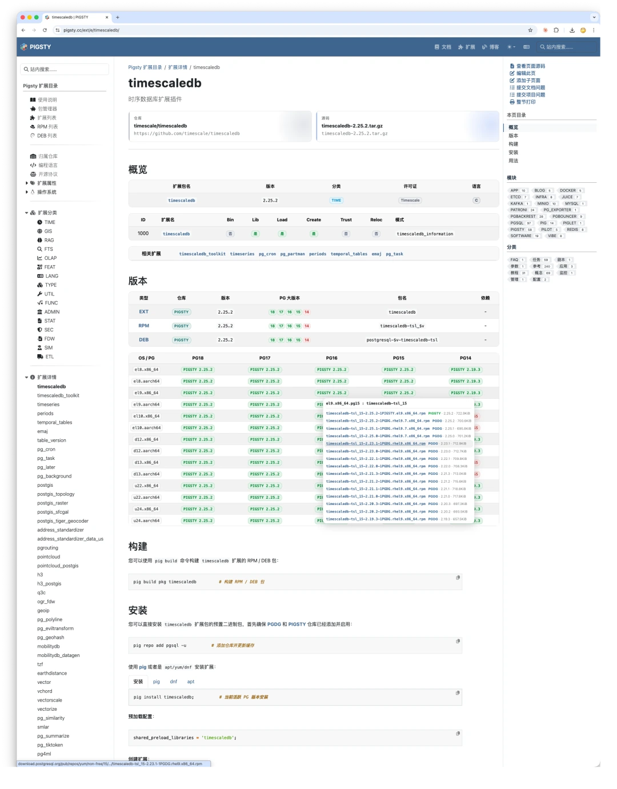

此外，我们还收录了 460+ 扩展文档，让你可以在一个地方直接浏览大量 PG 扩展的双语文档，而不是在分散的页面之间来回跳转。

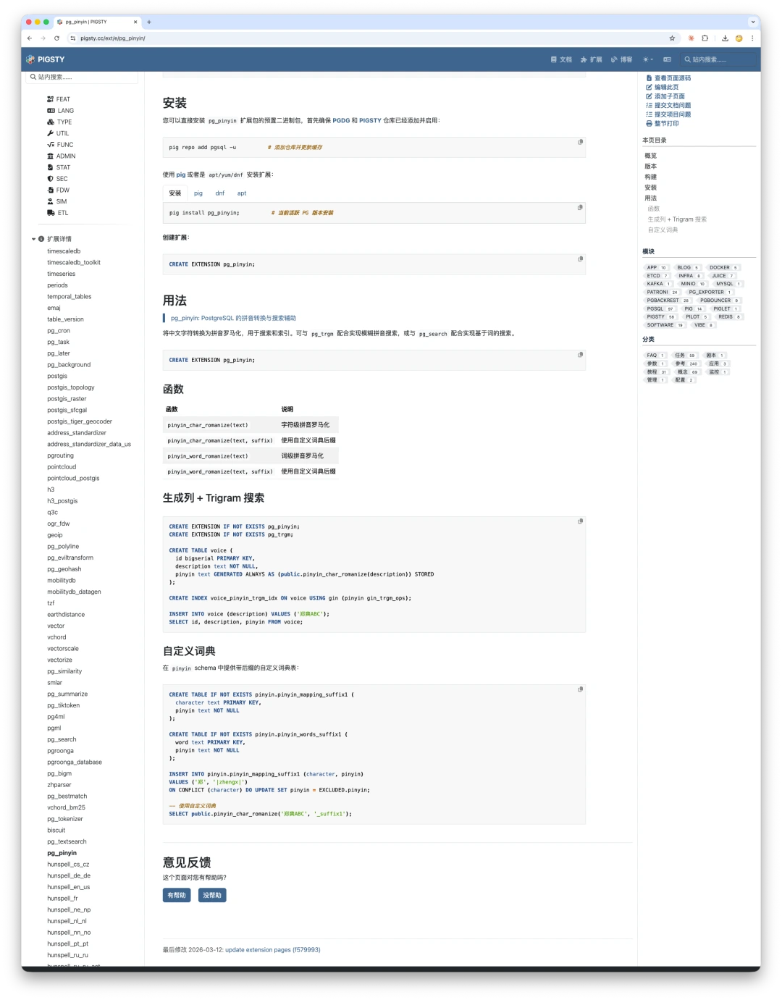

## 464 个扩展，16 个分类

这 464 个扩展按功能被分成了 16 个大类。如果你之前听说过 PostgreSQL 可以做时序数据库、向量数据库、图数据库、文档数据库，甚至兼容 Oracle 和 SQL Server，那么现在你可以在同一个目录里把这些能力背后的扩展全部找出来，看到详细信息，再一行命令装上。

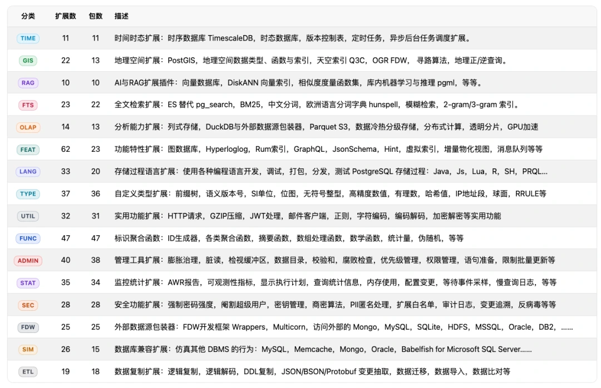

## 多维度浏览

除了按分类浏览，你还可以从不同维度切入这个目录。

### 按归属仓库

每个扩展归属于 PGDG、PIGSTY 或 CONTRIB 三类来源之一。PGDG 是 PostgreSQL 官方社区仓库，CONTRIB 是 PostgreSQL 自带扩展，而 PIGSTY 则是我额外打包收录和维护的部分。


### 按编程语言

你可以看到这些扩展分别是用 C、C++、Rust、Java、Python、SQL 还是纯数据文件实现的。尤其是近两年 Rust 扩展的增长趋势，在这里看得非常直观。

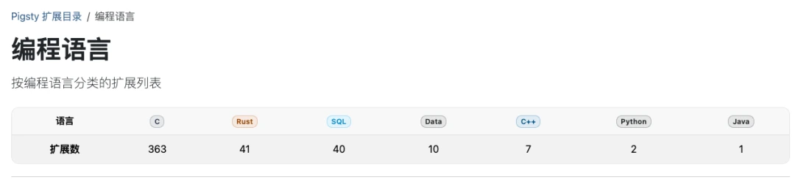

### 按开源协议

MIT、Apache 2.0、PostgreSQL、BSD、GPL、AGPL、Timescale License，不同协议对商业使用的影响各不相同，在技术选型时非常值得关注。

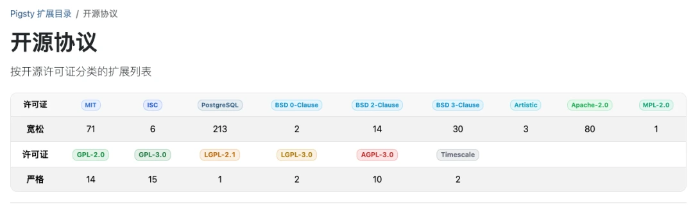

### 按扩展属性

哪些扩展需要修改 `shared_preload_libraries` 重启才能用？哪些是没有 SQL DDL 的“无头扩展”？哪些扩展之间有依赖或冲突？哪些包里包含多个扩展？这些都能在目录中直接看清楚。

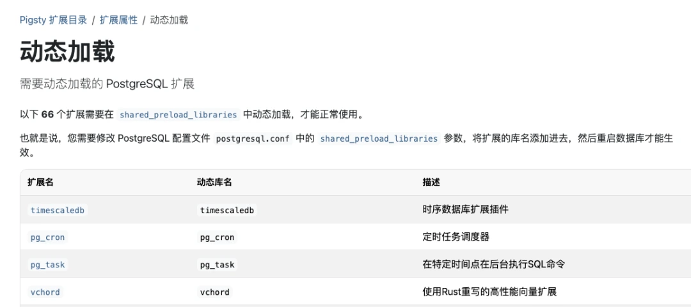

### 按操作系统

在特定操作系统和 CPU 架构组合下，哪些扩展可用、哪些不可用、版本分别是多少，一张表就能说明白。

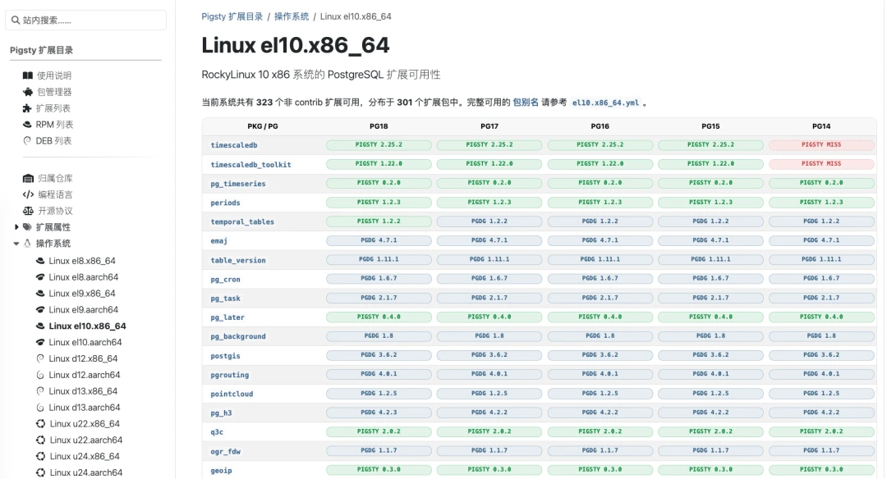

## 三件套：目录 + 仓库 + 包管理器

光有元数据目录还不够，配套基础设施同样重要。这次重做扩展目录，其实是一个系统性工程的一部分，整套体系包含三样东西：

- **扩展目录**：告诉你有什么、能不能用、怎么用。
- **扩展仓库**：提供预编译好的 RPM / DEB 二进制包，通过 CDN 分发，不必自己编译。
- **包管理器 `pig`**：屏蔽不同操作系统和 PG 版本的差异，一行命令完成安装。

这三样东西配合起来，把“找扩展、选扩展、装扩展、用扩展”的完整链路打通了。

## 一些数字

下面是这套扩展百科全书和配套仓库的一些统计数据。

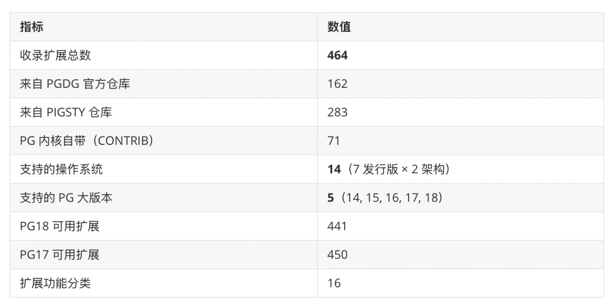

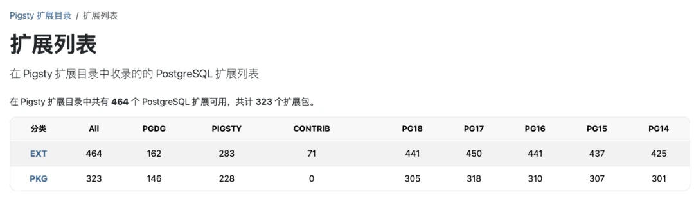

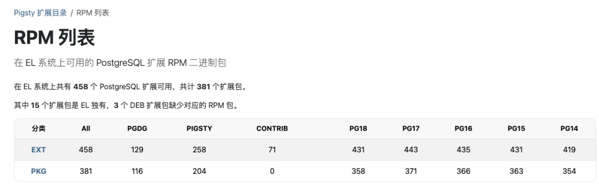

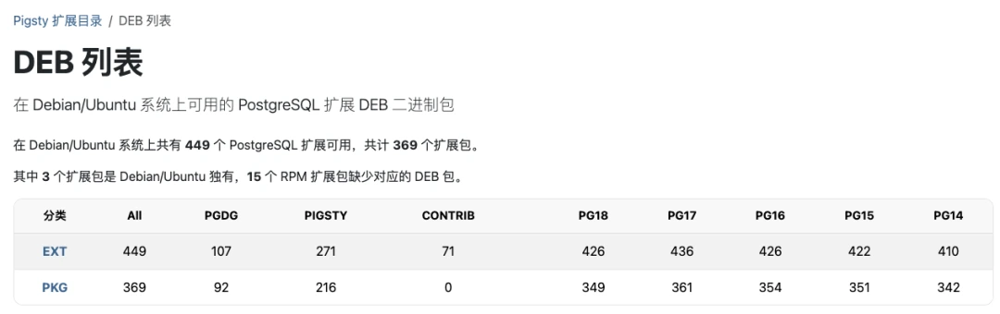

## 为什么要做这件事

做这个扩展目录，表面上是在做一个文档网站，实际上是在做 PostgreSQL 扩展生态的基础设施。

PostgreSQL 扩展生态的现状长期是“有酒无杯”：好东西很多，但发现、安装、使用的门槛太高。一个 DBA 想用 `pgvector` 做向量检索，或者用 `pg_duckdb` 跑 OLAP，他首先得知道这个扩展存在，然后得确认自己的操作系统上有没有包，再去处理各种编译、依赖和版本问题。这个过程中任何一环断掉，他都可能直接转头去用别的方案。

我想做的是把这个门槛降到最低：**来这里看看有什么，挑你要的，复制一行命令，装上就能用。**

每个扩展详情页，都是一个完整的 one-stop shop。你不需要再去 GitHub 翻 README，不需要去 PGXN 找包，也不需要猜操作系统兼容性。所有信息汇聚在一个页面里，中英双语，对国内外用户同样友好。

## 怎么用

如果你本来就会折腾 PostgreSQL，只是想在 PGDG 仓库之外额外安装一些“官方仓库”没有的扩展，那么直接添加 Pigsty 的 APT / DNF 仓库即可。`pig` 包管理器可以把这个过程大幅简化，但它并不是强制依赖。

```bash
curl -fsSL https://repo.pigsty.cc/pig | bash
pig repo add pigsty pgdg -u
pig install <extension>
```

如果你压根不想操心这些细节，也可以直接使用 Pigsty PostgreSQL 发行版。它的 rich 模板已经默认准备好了绝大多数常用扩展，你只需要按需启用即可。

```bash
curl -fsSL https://repo.pigsty.cc/get | bash
cd ~/pigsty
./configure -c rich
./deploy.yml
```

## 完全开源

顺便一提，这个网站和扩展元数据本身也是完全开源的。如果你想自己保存一份副本，或者复用这套数据，直接去 [pgsty/pgext](https://github.com/pgsty/pgext) 仓库就可以了，省得再自己写爬虫解析。如果你发现了扩展信息、元数据或文档中的错误，也欢迎直接提交 Issue 或 Pull Request。


## 附：Extension for Everyone

原稿末尾还附了一张相关主题演讲的海报，这里一并保留下来。


## 小结

**扩展是 PostgreSQL 的灵魂，而这个目录，就是灵魂的索引。**

464 个扩展，16 个分类，14 个操作系统，5 个大版本；中英双语；元数据、下载链接、安装命令、使用说明汇于一处。这件事的目标很简单：让 PostgreSQL 的扩展生态更容易被发现、更容易被安装，也更容易真正用起来。

如果你发现了有趣的扩展，或者对这套目录和仓库有任何建议，欢迎告诉我。
