In production online databases, slow queries not only affect end-user experience but also waste system resources, increase resource saturation, cause deadlocks and transaction conflicts, increase database connection pressure, and lead to master-slave replication delays. Therefore, **query optimization** is one of the core responsibilities of DBAs.

On the path of query optimization, there are two different approaches:

**Macro Optimization**: Analyze the overall workload, dissect and drill down, identifying and improving the worst-performing parts from top to bottom.

**Micro Optimization**: Analyze and improve specific queries, requiring slow query logs, mastering EXPLAIN mysteries, and understanding execution plan intricacies.

Today we'll discuss the former. **Macro optimization** has three main goals and motivations:

**Reduce Resource Consumption**: Lower the risk of resource saturation, optimize CPU/memory/IO, typically using query **total time/total IO** as optimization targets.

**Improve User Experience**: The most common optimization goal, in OLTP systems typically using reduced **average query response time** as the optimization target.

**Balance Workload**: Ensure appropriate proportional relationships in resource usage/performance between different query groups.

The key to achieving these goals lies in **data support**. But where does the data come from?

—— **pg_stat_statements**！

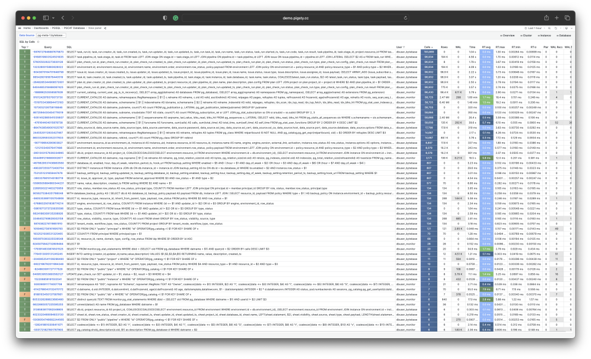


-------------------

## Extension: PGSS

**pg_stat_statements**, hereafter abbreviated as **PGSS**, is the core tool for practicing the macro way.

PGSS comes from the official PostgreSQL Global Development Group, distributed as a first-party extension alongside the database kernel itself, providing methods for tracking SQL statement-level metrics.

The PostgreSQL ecosystem has many extensions, but if there's one that's "**mandatory**", I would answer without hesitation: **PGSS**. This is also one of the two extensions that [**Pigsty**](http://mp.weixin.qq.com/s?__biz=MzU5ODAyNTM5Ng==&mid=2247486135&idx=1&sn=7d9c4920e94efba5d0e0b6af467f596c&chksm=fe4b3f6cc93cb67ac570d5280b37328aed392598b13df88545ff0a06f99630801fc999db8de5&scene=21#wechat_redirect) enables by default and actively loads, even "taking liberties" to do so. (The other is auto_explain for micro optimization)

PGSS needs to be explicitly specified for loading in **shared_preload_library** and explicitly created in the database via **CREATE EXTENSION**. After creating the extension, you can access query statistics through the **pg_stat_statements** view.

In **PGSS**, each type of query in the system (i.e., queries with the same execution plan after variable extraction) is assigned a query ID, followed by call count, total execution time, and various other metrics. Its complete schema definition (PG15+) is as follows:

```sql
CREATE TABLE pg_stat_statements
(
    userid                 OID,     -- (Label) User OID executing this statement
    dbid                   OID,     -- (Label) Database OID containing this statement  
    toplevel               BOOL,    -- (Label) Whether this statement is top-level SQL
    queryid                BIGINT,  -- (Label) Query ID: hash of normalized query
    query                  TEXT,    -- (Label) Normalized query statement text
    plans                  BIGINT,  -- (Counter) Number of times this statement was planned
    total_plan_time        FLOAT,   -- (Counter) Total time spent planning this statement
    min_plan_time          FLOAT,   -- (Gauge) Minimum planning time
    max_plan_time          FLOAT,   -- (Gauge) Maximum planning time
    mean_plan_time         FLOAT,   -- (Gauge) Average planning time
    stddev_plan_time       FLOAT,   -- (Gauge) Standard deviation of planning time
    calls                  BIGINT,  -- (Counter) Number of times this statement was executed
    total_exec_time        FLOAT,   -- (Counter) Total time spent executing this statement
    min_exec_time          FLOAT,   -- (Gauge) Minimum execution time
    max_exec_time          FLOAT,   -- (Gauge) Maximum execution time
    mean_exec_time         FLOAT,   -- (Gauge) Average execution time
    stddev_exec_time       FLOAT,   -- (Gauge) Standard deviation of execution time
    rows                   BIGINT,  -- (Counter) Total rows returned by this statement
    shared_blks_hit        BIGINT,  -- (Counter) Total shared buffer blocks hit
    shared_blks_read       BIGINT,  -- (Counter) Total shared buffer blocks read
    shared_blks_dirtied    BIGINT,  -- (Counter) Total shared buffer blocks dirtied
    shared_blks_written    BIGINT,  -- (Counter) Total shared buffer blocks written to disk
    local_blks_hit         BIGINT,  -- (Counter) Total local buffer blocks hit
    local_blks_read        BIGINT,  -- (Counter) Total local buffer blocks read
    local_blks_dirtied     BIGINT,  -- (Counter) Total local buffer blocks dirtied
    local_blks_written     BIGINT,  -- (Counter) Total local buffer blocks written to disk
    temp_blks_read         BIGINT,  -- (Counter) Total temp buffer blocks read
    temp_blks_written      BIGINT,  -- (Counter) Total temp buffer blocks written to disk
    blk_read_time          FLOAT,   -- (Counter) Total time spent reading blocks
    blk_write_time         FLOAT,   -- (Counter) Total time spent writing blocks
    wal_records            BIGINT,  -- (Counter) Total WAL records generated
    wal_fpi                BIGINT,  -- (Counter) Total WAL full page images generated
    wal_bytes              NUMERIC, -- (Counter) Total WAL bytes generated
    jit_functions          BIGINT,  -- (Counter) Number of functions JIT-compiled
    jit_generation_time    FLOAT,   -- (Counter) Total time spent generating JIT code
    jit_inlining_count     BIGINT,  -- (Counter) Number of times functions were inlined
    jit_inlining_time      FLOAT,   -- (Counter) Total time spent inlining functions
    jit_optimization_count BIGINT,  -- (Counter) Number of times queries were JIT-optimized
    jit_optimization_time  FLOAT,   -- (Counter) Total time spent on JIT optimization
    jit_emission_count     BIGINT,  -- (Counter) Number of times code was JIT-emitted
    jit_emission_time      FLOAT,   -- (Counter) Total time spent on JIT emission
    PRIMARY KEY (userid, dbid, queryid, toplevel)
);
```

PGSS view SQL definition (PG 15+ version)


**PGSS** also has some limitations: First, **currently executing** query statements are not included in these statistics and need to be obtained from **pg_stat_activity**. Second, failed queries (e.g., statements canceled due to statement_timeout) are also not counted in these statistics — this is a problem for **error analysis** to solve, not a concern for **query optimization**.

Finally, the stability of query identifier **queryid** needs special attention: when the database binary version and system data directory are identical, the same type of query will have the same **queryid** (i.e., on physical replication master-slave, same-type queries have the same **queryid** by default), but this doesn't apply to logical replication. However, users should not rely too heavily on this assumption.


-------------------

## Raw Data

Columns in the **PGSS** view can be divided into three categories:

**Descriptive Label Columns**: Query ID (queryid), database ID (dbid), user (userid), a top-level query marker, and normalized query text (query).

**Measurement Metrics (Gauge)**: Eight statistics related to minimum, maximum, mean, and standard deviation, prefixed with min, max, mean, stddev and suffixed with plan_time and exec_time.

**Cumulative Metrics (Counter)**: **Other metrics** besides the above eight columns and label columns, such as calls, rows, etc. The most important and useful metrics are in this category.


First, let's explain queryid: queryid is a hash value generated from the normalized query after parsing the query statement and stripping constants, so it can be used to identify **the same type of query**. Different query statements may have the same queryid (same structure after normalization), and the same query statement may have different queryids (e.g., due to different search_path, resulting in different actual tables being queried).

The same query may be executed by different users in different databases. Therefore, in the PGSS view, the four label columns queryid, dbid, userid, toplevel together form the "primary key" that uniquely identifies a record.

For metric columns, **measurement-type metrics (GAUGE)** are mainly the eight statistics related to execution time and planning time, but users have no good way to control the statistical range of these statistics, so their practical value is limited.


The really important metrics are **cumulative metrics (Counter)**, such as:

**calls**: How many times this query group was invoked.

**total_exec_time** + **total_plan_time**: Total time consumed by the query group.

**rows**: Total rows returned by the query group.

**shared_blks_hit** + **shared_blks_read**: Total buffer pool hits and read operations.

**wal_bytes**: Total WAL bytes generated by queries in this group.

**blk_read_time** and **blk_write_time**: Total time spent on block read/write IO

Here, the most meaningful metrics are **calls** and **total_exec_time**, which can be used to calculate the core metrics **QPS** (throughput) and **RT** (latency/response time) for query groups, though other metrics also have reference value.


Visualizing a query group snapshot from the PGSS view

To interpret cumulative metric data, data from just one moment is insufficient. **We need to compare at least two snapshots from different moments to draw meaningful conclusions**.

As a special case, if the range you're interested in happens to be from the beginning of the statistical period (usually when this extension was enabled) to now, then you indeed don't need to compare "two snapshots." But users' time granularity of interest usually isn't so coarse, and is often in units of minutes, hours, or days.

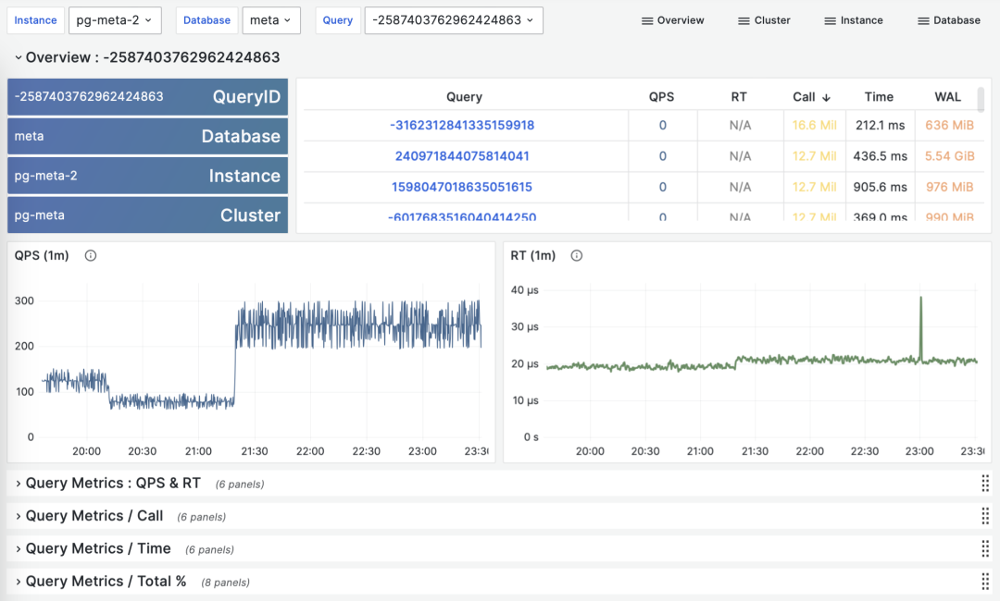

> Calculating historical time-series metrics from multiple PGSS query group snapshots

Fortunately, tools like [Pigsty](https://pigsty.cc) monitoring system periodically (every 10s by default) take snapshots of top queries (top 256 by time consumption). With many snapshots of different types of cumulative metrics M at different times, we can calculate three important derived metrics for any cumulative metric:

**dM/dt**: Derivative of metric M with respect to time, i.e., increment per second.

**dM/dc**: Derivative of metric M with respect to call count, i.e., average increment per call.

**%M**: Percentage of metric M in the overall workload.

These three types of metrics correspond exactly to the three types of macro optimization goals. The time derivative **dM/dt** reveals **resource usage per second**, typically used for resource consumption reduction optimization goals. The call count derivative **dM/dc** reveals **resource usage per call**, typically used for user experience improvement optimization goals. The percentage metric **%M** shows the percentage a query group occupies in the overall workload, typically used for workload balancing optimization goals.


-------------------

## Time Derivatives

Let's first look at the first type of metrics: time derivatives. Here, the metrics M we can use include: calls, total_exec_time, rows, wal_bytes, shared_blks_hit + shared_blks_read, and blk_read_time + blk_write_time. Other metrics also have reference value, but let's start with the most important ones.

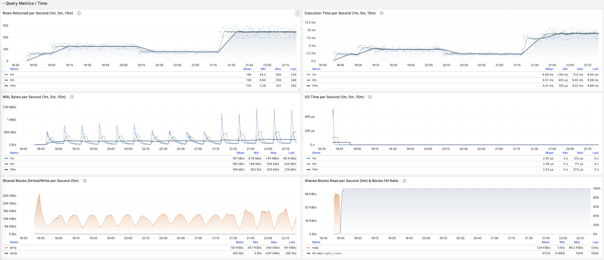

> Visualizing time derivative metrics dM/dt

Calculating these metrics is actually quite simple, we just need to:

- First calculate the difference in metric value M between two snapshots: **M2 - M1**
- Then calculate the time difference between two snapshots: **t2 - t1**
- Finally calculate **(M2 - M1) / (t2 - t1)**


Production environments typically use data sampling intervals like 5s, 10s, 15s, 30s, 60s. For load analysis, we typically use 1m, 5m, 15m as common analysis window sizes.

For example, when we calculate QPS, we would calculate QPS for the last 1 minute, 5 minutes, and 15 minutes respectively. Longer windows provide smoother curves that better reflect long-term trends, but hide short-term fluctuation details and are not conducive to discovering momentary anomalies, so metrics of different granularities need to be viewed together.


> Showing QPS for a specific query group in 1/5/15 minute windows

If you use Pigsty / Prometheus to collect monitoring data, you can use PromQL to easily complete these calculations. For example, to calculate QPS for all queries in the last minute, use: rate(pg_query_calls{}[1m]) 


**QPS**

When M is calls, the result of time differentiation is QPS, with units of queries per second (req/s). This is a very fundamental metric. Query QPS is a throughput metric that directly reflects the load situation imposed by business. If a query's throughput is too high (e.g., 10000+) or too low (e.g., 1-), it may be worth attention.


> QPS: 1/5/15 minute µ/CV, ±1/3σ distribution

If we sum up all query groups' QPS metrics (without exceeding PGSS collection range), we get the so-called "global QPS." Another way to obtain global QPS is through client-side instrumentation, collection at connection pool middleware like Pgbouncer, or using eBPF probes. But none are as convenient as PGSS.

Note that QPS metrics don't have load-wise **horizontal comparability**. Different query groups may have the same QPS but vastly different per-query execution times. Even the same query group may produce dramatically different load levels at different times due to different execution plans. Execution time per second is a better metric for measuring load.


**Execution Time Per Second**

When M is total_exec_time (+ total_plan_time, optional), we get one of the most important metrics in macro optimization: execution time spent on query groups. Interestingly, this derivative has units of seconds/per second, so the numerator and denominator cancel out, making it actually a dimensionless metric.

This metric means: how many seconds per second does the server spend processing queries in this query group, e.g., 2 s/s means the server spends two seconds of execution time on this query group every second; for multi-core CPUs, this is certainly possible: just use the full time of two CPU cores.


> Execution time per second: 1/5/15 minute averages

Therefore, this value can also be understood as a percentage: it can exceed 100%, and in this perspective, it's a metric similar to host load1, load5, load15, revealing the **load level** generated by this query group. If divided by CPU core count, you can even get a normalized query load contribution metric.

However, we need to note that execution time includes time waiting for locks and I/O. So it's possible that query execution time is very long but has no impact on CPU load. For precise slow query analysis, we need to refer to **wait events** for further analysis.


**Rows Per Second**

When M is rows, we get the number of rows returned by this query group per second, with units of rows per second (rows/s). For example, 10000 rows/s means this type of query spits out 10,000 rows of data to clients every second. Returned rows consume client processing resources, making this a very meaningful metric when examining application client data processing pressure.

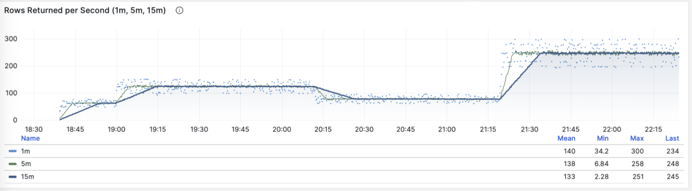

> Rows returned per second: 1/5/15 minute averages


**Shared Buffer Access Bandwidth**

When M is shared_blks_hit + shared_blks_read, we get the number of shared buffer blocks hit/read per second. If we multiply this by the default block size of 8KiB (rarely other sizes like 32KiB), we get the bandwidth of a query type "accessing" memory/disk: bytes per second.

For example, if a certain query type accesses 500,000 shared buffers per second, that's 3.8 GiB/s of internal access data flow: this is significant load and might be a good optimization candidate. Perhaps you should examine this query to see if it deserves this "resource consumption."


> Shared buffer access bandwidth and buffer hit rate

Another valuable derived metric is buffer hit rate: hit / (hit + read). It can be used to analyze possible causes of performance changes — cache misses. Of course, repeatedly accessing the same blocks in the shared buffer pool doesn't actually re-read, and even real reads might be from memory's FS Cache rather than disk. So this is just a reference value, but it's indeed a very important macro query optimization reference metric.


**WAL Volume**

When M is wal_bytes, we get the rate at which this query generates WAL, with units of bytes per second (B/s). This metric was introduced in PostgreSQL 13 and can quantitatively reveal the WAL size generated by queries: the more and faster WAL is written, the greater the pressure on disk flushing, physical/logical replication, and log archiving.

A typical example is: `BEGIN; DELETE FROM xxx; ROLLBACK;`. Such transactions delete lots of data, generate large amounts of WAL but perform no useful work. This metric can identify them.

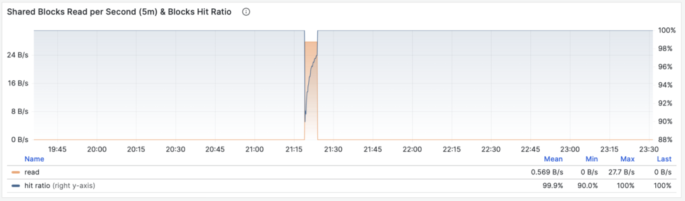

> WAL byte rate: 1/5/15 minute averages

Two notes here: we mentioned earlier that PGSS cannot track failed statements, but here the transaction **ROLLBACK** failed, but the statement was successfully executed, so it will be tracked and recorded by PGSS.

Second: in PostgreSQL, not only INSERT/UPDATE/DELETE generate WAL logs, SELECT operations can also generate WAL logs because SELECT might modify hint bits on tuples, causing page checksum changes and triggering WAL log writes.

There's even this possibility: if read load is very large, it has a high probability of causing FPI image generation, producing considerable WAL volume. You can further check the wal_fpi metric.

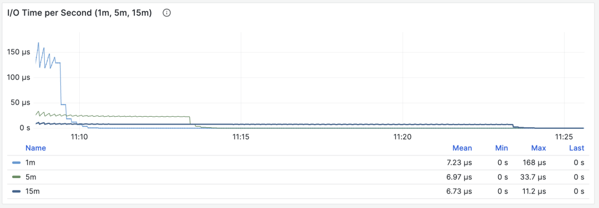

> Shared buffer dirty/writeback bandwidth

For versions below 13, shared buffer dirty/writeback bandwidth metrics can serve as an approximate lower substitute for analyzing query group write load characteristics.


**I/O Time**

When M is blks_read_time + blks_write_time, we get the proportion of time query groups spend on block I/O, with units of "seconds per second", like the execution time per second metric, also reflecting the time proportion occupied by operations.


> I/O time is very helpful for analyzing query spike causes

Because PostgreSQL uses the operating system's FS Cache, even if block reads/writes are executed here, they might still be buffer operations occurring in memory at the filesystem level. So it can only serve as a reference metric and should be used cautiously, needing cross-reference with host node disk I/O monitoring.


**Time derivative metrics** **dM/dt** can show the overall workload inside a database instance/cluster, especially useful for resource usage optimization scenarios. But if your optimization goal is improving user experience, then another group of metrics — **call count derivatives dM/dc** — might be more meaningful.


-------------------

## Call Count Derivatives

Above we calculated six types of important metrics' derivatives with respect to **time**. Another class of derived metrics is calculated by differentiating with respect to "**call count**", i.e., the denominator changes from time difference to QPS.

This class of metrics is even more important than the former because it provides several core metrics directly related to user experience, such as the most important — **query response time (RT, Response Time)**, or **latency**.

Calculating these metrics is also simple, we just need to:

- Calculate the difference in metric value M between two snapshots: **M2 - M1**
- Then calculate the difference in calls between two snapshots: **c2 - c1**
- Then calculate **(M2 - M1) / (c2 - c1)**

For PromQL implementation, **call count derivative metrics dM/dc** can be calculated using "**time derivative metrics dM/dt**". For example, to calculate RT, you can use **execution time per second** **/** **queries per second**, dividing the two metrics:

```
rate(pg_query_exec_time{}[1m]) / rate(pg_query_calls{}[1m])
```

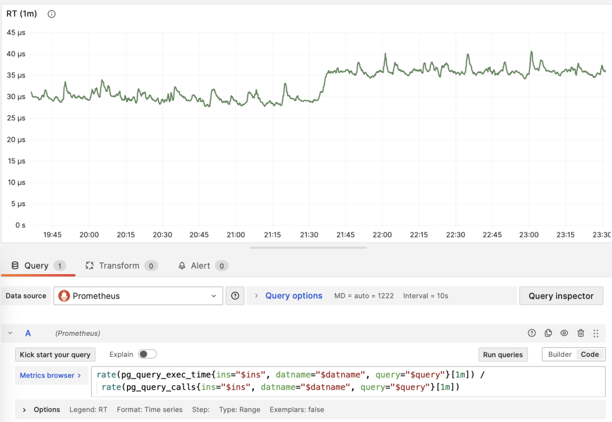

> dM/dt can be used to calculate dM/dc


**Call Count**

When M is calls, differentiating with respect to itself is meaningless (result will always be 1).


**Average Latency/Response Time/RT**

When M is total_exec_time, differentiating with respect to call count gives **RT**, or response time/latency. Its unit is seconds (s). **RT directly reflects user experience and is the most important metric in macro performance analysis**. This metric means: the average query response time for this query group on the server. If conditions allow enabling pg_stat_statements.track_planning, you can add total_plan_time for more accurate and representative results.

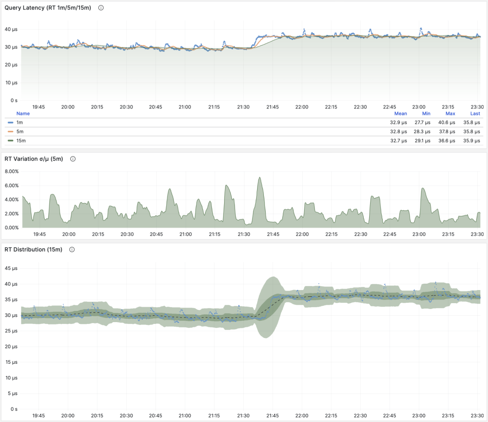

> RT: 1/5/15 minute µ/CV, ±1/3σ distribution

Two special situations need emphasis: First, PGSS doesn't track failed/executing statements; Second, PGSS statistical data is limited by the (pg_stat_statements.max) parameter and may have sampling bias. Despite these limitations, PGSS is undoubtedly the most reliable source for obtaining crucial query statement group latency data. As mentioned above, there are other ways to collect query RT data at other observation points, but they would be much more troublesome.

You can instrument on the client side, collecting statement execution times and reporting through metrics or logs; you can also try using eBPF to probe statement RT, which has high requirements for infrastructure and engineers. Pgbouncer and PostgreSQL (14+) do provide RT metrics, but unfortunately, their granularity is at the database level, none can achieve PGSS's query statement group-level metric collection.

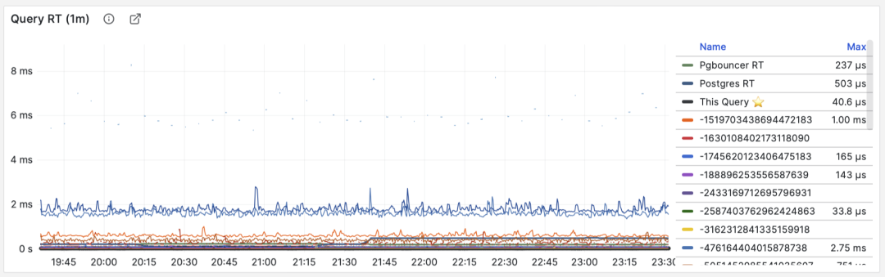

> RT: Statement-level/Connection pool-level/Database-level

Unlike throughput metrics like QPS, **RT has horizontal comparability**: for example, if a query group's RT is usually within 1 millisecond, then events exceeding 10ms should be considered serious deviations for analysis.

When failures occur, RT views are also helpful for pinpointing causes: if all queries' overall RT slows down, it's most likely related to resource insufficiency. If only specific query groups' RT changes, it's more likely caused by slow queries and should be investigated further. If RT changes coincide with application deployments, consider whether to rollback those deployments.

Additionally, in performance analysis, stress testing, and benchmarking, **RT is also the most important metric**. You can evaluate system performance by comparing typical queries' latency performance in different environments (e.g., different PG major versions, different hardware, different configuration parameters) and continuously adjust and improve system performance based on this.

RT is so important that it spawns many downstream metrics: 1/5/15 minute mean µ and standard deviation σ are naturally essential; ±σ and ±3σ over the past 15 minutes can measure RT fluctuation range; 95th and 99th percentiles over the past hour also have reference value.

RT is the core metric for evaluating OLTP workloads. No amount of emphasis on its importance is excessive.


**Average Returned Rows**

When M is rows, we get the **average number of rows returned** per query, with units of rows per query. For OLTP workloads, typical query patterns are point queries, returning a few records per query.

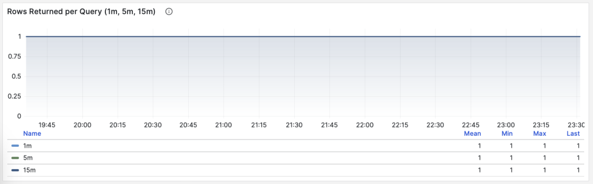

> Point queries by primary key, average returned rows stable at 1

If a query group returns hundreds or even thousands of rows to clients per query, it should be examined. If this is intentional design, such as batch loading tasks/data dumps, then no action is needed. If these are requests initiated by applications/clients, there might be errors, such as statements lacking LIMIT restrictions or queries lacking pagination design. Such queries should be adjusted and fixed.


**Average Shared Buffer Read/Hit**

When M is shared_blks_hit + shared_blks_read, we get the average number of shared buffer "hits" and "reads" per query. If we multiply this by the default block size of 8KiB, we get the "bandwidth" of this query type per execution, with units of B/s: how many MB of data does each query access/read on average?


> Point queries by primary key, average returned rows stable at 1

Query average accessed data volume usually matches average returned rows. If your query only returns a few rows on average but accesses gigabytes of data blocks, you need special attention: such queries are very sensitive to data hot/cold states. If all blocks are in the buffer, performance might be acceptable, but if starting from disk cold, execution time might change dramatically.

Of course, don't forget PostgreSQL's double caching issue — so-called "read" data might have already been cached once at the operating system filesystem level. So you need cross-reference with operating system monitoring metrics, or pg_stat_kcache, pg_stat_io system views for analysis.

Another pattern worth attention is sudden changes in this metric, which usually means this query group's **execution plan might have flipped/degraded**, very worthy of attention and further study.


**Average WAL Volume**

When M is wal_bytes, we get the average WAL size generated per query. This is a field newly introduced in PostgreSQL 13. This metric can measure query change footprint size and calculate read/write ratios and other important evaluation parameters.

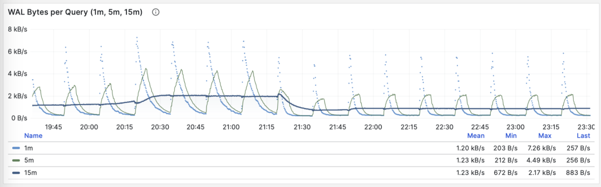

> Stable QPS but periodic WAL fluctuations, inferred to be FPI influence

Another use is checkpoint optimization: if you observe periodic fluctuations in this metric (period approximately equal to checkpoint_timeout), you can optimize the amount of WAL generated by queries by adjusting checkpoint intervals.

**Call count derivative metrics dM/dc** can show the workload characteristics of a query type, very useful for optimizing user experience. Especially RT is the golden metric for performance optimization — no amount of emphasis on its importance is excessive.

**dM/dc** metrics like these provide important absolute value metrics, but to find which queries have the greatest potential optimization benefits, you need **%M percentage metrics**.


-------------------

## Percentage Metrics

Now let's study the third type of metrics: **percentage metrics**. That is, the proportion a certain query group occupies relative to the overall workload.

**Percentage metrics M%** provide us with the proportion of a certain query group relative to the overall workload, helping us identify "major players" in frequency, time, I/O time/count, find query groups with the greatest potential optimization benefits, and serve as important basis for priority assessment.


Common percentage metrics %M overview

For example, if a certain query group has 1000 QPS in absolute value, which seems like a lot; but if it only accounts for 3% of the entire workload, then the benefits and priority of optimizing this query aren't that high; conversely, if it accounts for more than 50% of the entire workload — if you can optimize it away, you can cut half of the entire instance's throughput, making its optimization priority very high.

A common optimization strategy is: first sort all query groups by the important metrics mentioned above: calls, total_exec_time, rows, wal_bytes, shared_blks_hit + shared_blks_read, and blk_read_time + blk_write_time **dM/dt** values over a period of time, take TopN (say N=10 or more), and add them to the optimization candidate list.


> Selecting TopSQL for optimization by specific criteria

Then, for each query group in the optimization candidate list, analyze their **dM/dc** metrics in turn, combined with specific query statements and slow query logs/wait events for analysis, decide whether this is a query worth optimizing. For queries decided (Plan) to optimize, you can use techniques introduced in the subsequent **"micro optimization"** article for tuning (Do), and use monitoring systems to evaluate optimization effects (Check), summarize and analyze before entering the next PDCA Deming cycle, continuing management optimization.

Besides taking TopN on metrics, visualization can also be used. Visualization greatly helps identify "major contributors" from workloads. Complex judgment algorithms might not match human DBAs' intuition for monitoring pattern recognition. To form a sense of proportion, we can use pie charts, tree maps, or stacked time series charts.


Stacking QPS of all query groups

For example, we can use pie charts to identify queries with the highest time consumption/IO usage in the past hour, use 2D tree maps (size represents total time consumption, color represents average RT) to show an additional dimension, and use stacked time series charts to show how proportions change over time.

We can also directly analyze current PGSS snapshots, sort by different concerns, and select queries to be optimized according to your own criteria.


I/O time is very helpful for analyzing query spike causes


-------------------

## Summary

Finally, let's summarize the content above.


PGSS provides rich metrics, among which the most important cumulative metrics can be processed in three ways:

**dM/dt**: Derivative of metric M with respect to time, revealing **resource usage per second**, typically used for resource consumption reduction optimization goals.

**dM/dc**: Derivative of metric M with respect to call count, revealing **resource usage per call**, typically used for user experience improvement optimization goals.

**%M**: Percentage metrics show the percentage a query group occupies in the overall workload, typically used for workload balancing optimization goals.

Usually, we select high-value candidate optimization queries based on **%M**: percentage metric Top queries, and use **dM/dt** and **dM/dc** metrics for further evaluation, confirming whether there's optimization space and feasibility, and evaluating post-optimization effects. This cycles continuously.

After understanding macro optimization methodology, we can use this approach to locate and optimize slow queries. Here's a specific example of [Using Monitoring Systems to Diagnose PG Slow Queries](http://mp.weixin.qq.com/s?__biz=MzU5ODAyNTM5Ng==&mid=2247484478&idx=1&sn=ea44675df79b60a12273e78b358bb557&chksm=fe4b31e5c93cb8f325ba1e4389874112bd5441280492c87e259a32aa67e00c7e0028e7dc51eb&scene=21#wechat_redirect). In the next article, we'll introduce experience and techniques for PostgreSQL query **micro optimization**.


-------------------

## References

`[1]` [PostgreSQL HowTO: pg_stat_statements](https://gitlab.com/postgres-ai/postgresql-consulting/postgres-howtos/) by Nikolay Samokhvalov

`[2]` [pg_stat_statements](https://www.postgresql.org/docs/current/pgstatstatements.html)

`[3]` [Using Monitoring Systems to Diagnose PG Slow Queries](http://mp.weixin.qq.com/s?__biz=MzU5ODAyNTM5Ng==&mid=2247484478&idx=1&sn=ea44675df79b60a12273e78b358bb557&chksm=fe4b31e5c93cb8f325ba1e4389874112bd5441280492c87e259a32aa67e00c7e0028e7dc51eb&scene=21#wechat_redirect)

`[4]` [How to Monitor Existing PostgreSQL (RDS/PolarDB/Self-built) with Pigsty?](http://mp.weixin.qq.com/s?__biz=MzU5ODAyNTM5Ng==&mid=2247486169&idx=1&sn=697ab3c172fe6cc28e12cff7297bb343&chksm=fe4b3f02c93cb614bbd1d5075120e074cebb5214d3a1a516363582bcee294e02bf5fd0e051ee&scene=21#wechat_redirect)

`[5]` [Pigsty v2.5 Released: Ubuntu/Debian Support and Monitoring Redesign/New Extensions](http://mp.weixin.qq.com/s?__biz=MzU5ODAyNTM5Ng==&mid=2247486283&idx=1&sn=4b63f438df33291a3deb1052bea31347&chksm=fe4b3e90c93cb786a54407a4f7e552b2c8b28478b28df852e41f5d9e2c991761dddbc9a5a813&scene=21#wechat_redirect)

`[6]` [PostgreSQL Monitoring System Pigsty Overview](http://mp.weixin.qq.com/s?__biz=MzU5ODAyNTM5Ng==&mid=2247484189&idx=1&sn=19d4381c7ec4bc4498bd56c5ee9f916b&chksm=fe4b36c6c93cbfd06fba1c7a1ad3c5cba8d0060f82acb56e96f0e64694f79c2df9299f0b1115&scene=21#wechat_redirect)