在线业务数据库中，慢查询不仅影响终端用户体验，还会浪费系统资源、拉高资源饱和度、导致死锁和事务冲突，增加数据库连接压力，导致主从复制延迟等问题。因此，**查询优化**是 DBA 的核心工作内容之一。

在查询优化这条路上，有两种不同的方法：

**宏观优化**：整体分析工作负载，对其进行剖分下钻，自上而下地识别并改进其中表现最糟糕的部分。

**微观优化**：分析并改进一条特定的查询，这便需要记录慢查询日志，掌握 EXPLAIN 的玄机，领悟执行计划的奥妙。

今天我们先来说说前者，**宏观优化**有三个主要目标与动机：

**减少资源消耗**：降低资源饱和的风险，优化CPU/内存/IO，通常以查询**总耗时/总IO**作为优化目标。

**改善用户体验**：最常见的优化目标，在OLTP系统中通常以降低**查询平均响应时间**作为优化目标。

**平衡工作负载**：确保不同查询组之间的资源使用/性能表现的比例关系得当。


实现这些目标的关键在于**数据支撑**，但是数据从哪里来？

—— **pg_stat_statements**！

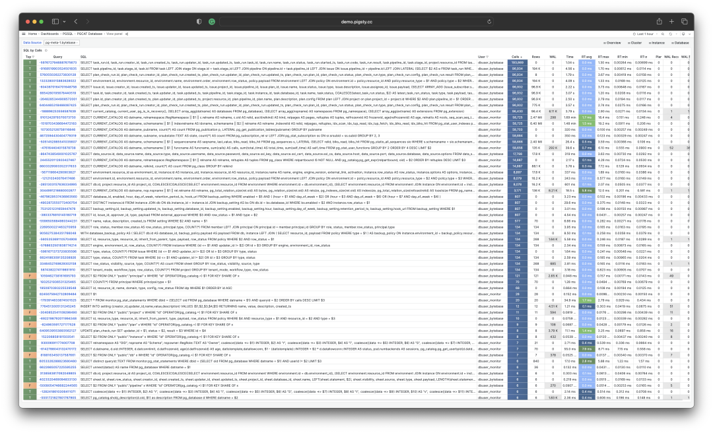


-------------------

## 扩展插件：PGSS

**pg_stat_statements**，以下简称 **PGSS** ，是践行观宏之道的核心工具。

PGSS 出自 PostgreSQL 全球开发组官方之手，以第一方扩展插件的形式，随数据库内核本体一并发行，提供了跟踪 SQL 查询语句级别指标的方法。

PostgreSQL 生态中有许许多多的扩展，但如果说有哪一个是“**必选**”的，我必定会毫不犹豫的回答：**PGSS**。这也是在 [**Pigsty**](http://mp.weixin.qq.com/s?__biz=MzU5ODAyNTM5Ng==&mid=2247486135&idx=1&sn=7d9c4920e94efba5d0e0b6af467f596c&chksm=fe4b3f6cc93cb67ac570d5280b37328aed392598b13df88545ff0a06f99630801fc999db8de5&scene=21#wechat_redirect) 中，我们宁愿“自作主张”，也要默认启用并主动加载的两个扩展之一。（另一个是用于微观优化的 auto_explain）

PGSS 需要在 **shared_preload_library** 中显式指定加载，并在数据库中通过 **CREATE EXTENSION** 显式创建。创建扩展后即可通过视图 **pg_stat_statements** 访问查询的统计信息。

在 **PGSS** 中，系统中的每一类查询（即抽取变量后，执行计划相同的查询）都会被分配一个查询ID，紧接着是调用次数，执行总耗时，以及各种其他指标，其完整模式定义如下（PG15+）：

```sql
CREATE TABLE pg_stat_statements
(
    userid                 OID,     -- （标签值）执行此语句的用户 OID（标签值）
    dbid                   OID,     -- （标签值）此语句所在的数据库 OID（标签值）
    toplevel               BOOL,    -- （标签值）此语句是否是顶层 SQL 语句（标签值）
    queryid                BIGINT,  -- （标签值）查询ID：标准化查询的哈希值（标签值）
    query                  TEXT,    -- （标签值）标准化查询语句的文本内容
    plans                  BIGINT,  -- （累积量）此语句被 PLAN 的次数
    total_plan_time        FLOAT,   -- （累积量）此语句花费在 PLAN 上的总时长
    min_plan_time          FLOAT,   -- （测量值）PLAN 的最小时长
    max_plan_time          FLOAT,   -- （测量值）PLAN 的最大时长
    mean_plan_time         FLOAT,   -- （测量值）PLAN 的平均时长
    stddev_plan_time       FLOAT,   -- （测量值）PLAN 时间的标准差
    calls                  BIGINT,  -- （累积量）此语句被调用执行的次数
    total_exec_time        FLOAT,   -- （累积量）此语句花费在执行上的总时长
    min_exec_time          FLOAT,   -- （测量值）执行的最小时长
    max_exec_time          FLOAT,   -- （测量值）执行的最大时长
    mean_exec_time         FLOAT,   -- （测量值）执行的平均时长
    stddev_exec_time       FLOAT,   -- （测量值）执行时间的标准差
    rows                   BIGINT,  -- （累积量）执行此语句返回的总行数
    shared_blks_hit        BIGINT,  -- （累积量）命中的共享缓冲区总块数
    shared_blks_read       BIGINT,  -- （累积量）读取的共享缓冲区总块数
    shared_blks_dirtied    BIGINT,  -- （累积量）写脏的共享缓冲区总块数
    shared_blks_written    BIGINT,  -- （累积量）写入磁盘的共享缓冲区总块数
    local_blks_hit         BIGINT,  -- （累积量）命中的本地缓冲区总块数
    local_blks_read        BIGINT,  -- （累积量）读取的本地缓冲区总块数
    local_blks_dirtied     BIGINT,  -- （累积量）写脏的本地缓冲区总块数
    local_blks_written     BIGINT,  -- （累积量）写入磁盘的本地缓冲区总块数
    temp_blks_read         BIGINT,  -- （累积量）读取的临时缓冲区总块数
    temp_blks_written      BIGINT,  -- （累积量）写入磁盘的临时缓冲区总块数
    blk_read_time          FLOAT,   -- （累积量）读取块花费的总时长
    blk_write_time         FLOAT,   -- （累积量）写入块花费的总时长
    wal_records            BIGINT,  -- （累积量）生成 WAL 的记录总数
    wal_fpi                BIGINT,  -- （累积量）生成的 WAL全页镜像总数
    wal_bytes              NUMERIC, -- （累积量）生成的 WAL 字节总数
    jit_functions          BIGINT,  -- （累积量）JIT 编译的函数数量
    jit_generation_time    FLOAT,   -- （累积量）生成 JIT 字节码的总时长
    jit_inlining_count     BIGINT,  -- （累积量）函数被内联的次数
    jit_inlining_time      FLOAT,   -- （累积量）花费在内联函数上的总时长
    jit_optimization_count BIGINT,  -- （累积量）查询被 JIT优化的次数
    jit_optimization_time  FLOAT,   -- （累积量）花费在JIT优化上的总时长
    jit_emission_count     BIGINT,  -- （累积量）代码被 JIT Emit的次数
    jit_emission_time      FLOAT,   -- （累积量）花费在 JIT Emit上的总时长
    PRIMARY KEY (userid, dbid, queryid, toplevel)
);
```

PGSS 视图的 SQL 定义（PG 15+版本）


**PGSS** 也有一些局限性：首先，**正在执行中**的查询语句并不会纳入这里的统计，而需要从 **pg_stat_activity** 中查看获取。其次，执行失败的查询（例如，因为 statement_timeout 超时被取消的语句）也不会被计入这里的统计 —— 这是**错误分析**要解决的问题，而不是**查询优化**所关心的目标。

最后，查询标识符 **queryid** 的稳定性需要特别注意：当数据库二进制版本和系统数据目录完全相同时，同一类查询会具有相同的 **queryid** （即在物理复制的主从上，同类查询的 **queryid** 默认是相同的），然而对于逻辑复制则不然。但用户不应当对这一性质抱有过度的依赖与假设。


-------------------

## 原始数据

**PGSS** 视图中的列可以分为三类：

**描述性的标签列（Label）**：查询ID（queryid）、数据库 ID（dbid）、用户（userid），一个顶层查询标记，和标准化的查询文本（query）。

**测量性的指标（Gauge）**：与最小、最大、均值标准差有关的八列统计量，以 min，max，mean，stddev 作为前缀，以 plan_time 与 exec_time 作为后缀。

**累积性的指标（Counter）**：除了上面八列与标签列的**其他指标**，例如 calls、rows 等，最重要、最有用的指标都在这一类里。


首先解释一下 queryid：queryid 是查询语句被解析后，剥离常量后生成规范化查询的哈希值，因此可以用来标识**同一类查询**。不同的查询语句可能有着同样的 queryid （规范化后结构一样），同样的查询语句也可能有着不同的 queryid （例如因为 search_path 不同，导致实际查询的表不懂）。

同样的查询可能会在不同的数据库中被不同的用户所执行。因此在 PGSS 视图中，queryid，dbid，userid，toplevel 四个标签列，共同组成了唯一标识一条记录的“主键”。

对于指标列而言，**测量性质的指标（GAUGE）** 主要是执行时间与计划时间相关的八个统计量，然而用户没有办法很好地控制这些统计量的统计范围，所以实用价值并不大。


真正重要的指标是**累积性的指标（Counter）**，例如：

**calls** ：此查询组发生了多少次调用。

**total_exec_time** + **total_plan_time**：查询组累计耗费时间。

**rows**：查询组累计返回了多少行。

**shared_blks_hit** + **shared_blks_read**：缓冲池累计命中和读取操作次数。

**wal_bytes**：此组中的查询累计生成的 WAL 字节数。

**blk_read_time** 和 **blk_write_time**：累计花费在块读写IO上的时间

这里，最有意义的指标是 **calls** 与 **total_exec_time**，可以用于计算查询组的核心指标 **QPS** （吞吐量）与 **RT**（延迟/响应时间），但其他的指标也很有参考价值。

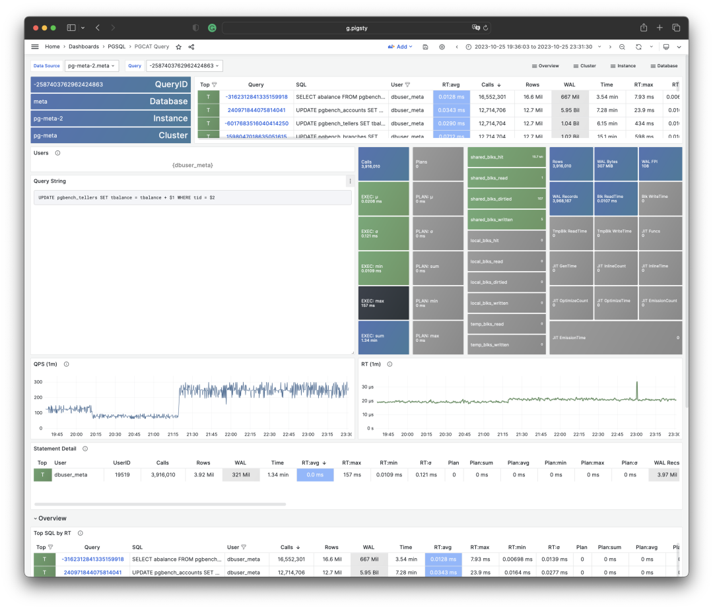

可视化展现 PGSS 视图的某个查询组快照

要解读累积性指标数据，只有某一个时刻的数据是不够的。**我们需要对比至少两个时刻的****快照****，才能得到有意义的结论**。

作为特例，如果您感兴趣的范围正好是从统计周期伊始（通常是启用此扩展时）至今，那么确实不需要对比“两个快照”。但用户感兴趣的时间粒度通常并不会这么粗放，而往往是以分钟、小时、天为单位。

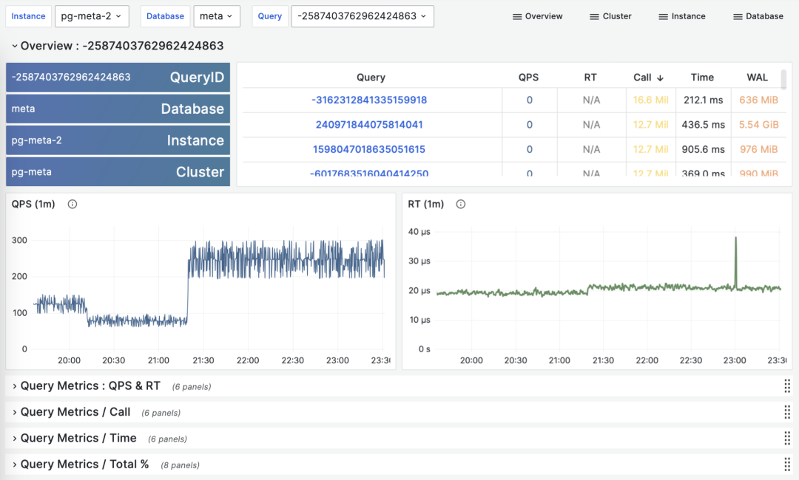

> 根据多个 PGSS 查询组快照计算历史时序指标

好在类似 [Pigsty](https://pigsty.cc) 监控系统这样的工具会定期（默认每隔10s）截取头部查询（耗时Top256）的快照。有了许多不同类型的累积指标 M（etrics）在不同时刻的快照之后，我们就能计算出某个累积性指标的三种重要派生指标：

**dM/dt** ：指标 M 基于时间的微分，即每秒的增量。

**dM/dc**：指标 M 基于调用次数的微分，即每次调用的平均增量。

**%M**：指标 M 在整个工作负载中所占的百分比。

这三类指标正好与宏观优化的三类目标相对应，对时间的微分 **dM/dt** 揭示了**每秒资源使用量**，通常用于减少资源消耗的优化目标。对调用次数的微分 **dM/dc** 揭示了**每次调用的资源使用量**，通常用于改善用户体验的优化目标。而百分比指标 **%M** 展示了查询组在整个工作负载中所占的百分比，通常用于平衡工作负载的优化目标。


-------------------

## 对时间微分

让我们首先来看第一类指标：对时间的微分。在这里，我们可以使用的指标 M 包括：calls，total_exec_time，rows，wal_bytes，shared_blks_hit + shared_blks_read，以及 blk_read_time + blk_write_time。其他的指标也有参考意义，但让我们从最重要的开始。

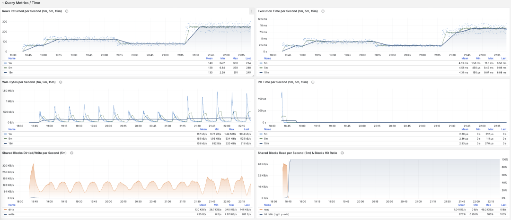

> 可视化展现对时间的微分指标 dM/dt

计算这些指标的方式其实很简单，我们只需要：

- 首先计算两个快照之间的指标值 M 的差值：**M2 - M1**
- 然后计算两个快照之间的时间差值：**t2 - t1**
- 最终计算 **(M2 - M1) / (t2 - t1)** 即可


生产环境通常会使用 5s，10s，15s，30s，60s 这样的数据采样间隔。对于负载分析通常会使用 1m， 5m，15m 作为常用的分析窗口大小。

例如，当我们计算 QPS 时，就会分别计算最近 1分钟，5分钟，15分钟的 QPS。窗口越长曲线就越平稳，更能反映长期变化趋势；但是会隐藏短期波动细节，不利于发现瞬时异常波动，所以不同粒度的指标需要结合来看。

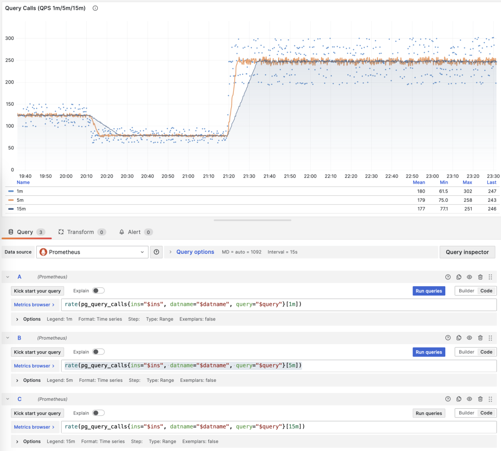

> 展示特定查询组 1/5/15 分钟窗口下的 QPS

如果您使用 Pigsty / Prometheus 来采集监控数据，那么可以使用 PromQL 简单地完成这些计算工作。例如，计算所有查询最近1分钟的 QPS 指标，使用以下语句就可以了： rate(pg_query_calls{}[1m]) 


**QPS**

当 M 是 calls 时，对时间求导的结果是 QPS，它的单位是每秒查询数（req/s），这是一个非常基础的指标。查询 QPS 属于吞吐量指标，直接反应了业务施加的负载状况，如果一个查询的吞吐量过高（例如，10000+）或者过低（例如，1-），有可能是值得关注的。

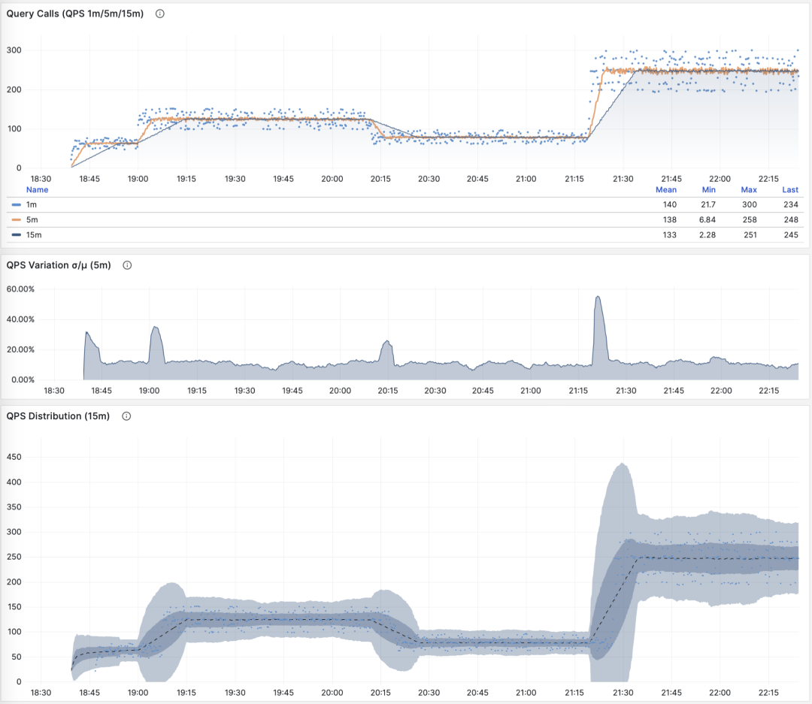

> QPS：1/5/15 分钟 µ/CV， ±1/3σ分布

如果我们把所有查询组的 QPS 指标累加起来（且没超过PGSS的收集范围），就会得到所谓的 “全局QPS”。另一种获得全局 QPS 的方式是在客户端打点，在类似 Pgbouncer 的连接池中间件上采集，或者使用 ebpf 探测。但都不如 PGSS 方便。

请注意，QPS 指标并不具备负载意义上的**横向可比性**。不同查询组可能有着同样的 QPS，而单个查询的耗时却天差地别。甚至同一个查询组在不同时间点上产生的负载水平，也可能因为执行计划不同而发生巨大变化。每秒执行时长是一个更好的衡量负载的指标。


**每秒执行时长**

当 M 是 total_exec_time （+ total_plan_time，可选 ）时，我们就会得到宏观优化中最重要的指标之一：在查询组上耗费的的执行时间，有意思的是，这个导数的单位是 秒/每秒，所以分子分母相互约掉了，使得它实际上是一个无量纲的指标。

这个指标的涵义是：服务器每秒钟花费多少秒来处理这个查询组中的查询，例如 2 s/s 意味着服务器每秒花费两秒执行时间在这组查询上；对于多核CPU，这当然是有可能的：把两个CPU核的全部时间都拿来就行了。

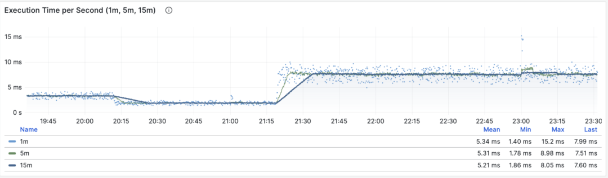

> 每秒执行时长：1/5/15 分钟均值

因此这里的值也可以理解为一个百分比：可以超过 100%，在这种视角下，它是一个类似于主机 load1, load5, load15 的指标，揭示了该查询组产生的**负载水平**。如果除以 CPU 核数，甚至可以得到归一化的查询负载贡献度指标。

但是我们需要注意的是，执行时间中包括了等待锁，等待I/O的时间。所以确实可能出现这样的情况：查询执行时间很长，但却没有对 CPU 负载产生影响。所以如果要精细分析慢查询，我们还要参考**等待事件**来进一步分析才行。


**每秒行数**

当 M 是 rows 时，我们会得到每秒该查询组返回的行数，单位是行/每秒（rows/s）。例如 10000 rows/s 意味着该类查询每秒向客户端吐出1万行数据。返回的行需要耗费客户端的处理资源，当我们需要检视应用客户端的数据处理压力时，这是一个非常有参考意义的指标。

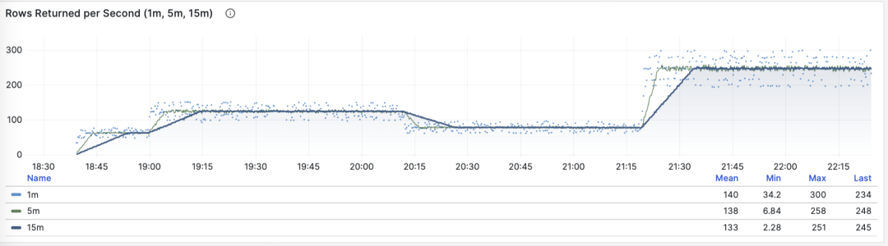

> 每秒返回的行数：1/5/15 分钟均值


**共享缓冲区访问带宽**

当 M 是 shared_blks_hit + shared_blks_read 时，我们会得到每秒命中/读取的共享缓冲区块数，如果将其乘以默认块大小 8KiB（极少情况下有可能会是其他的大小，例如32KiB），我们就会得到一类查询“访问”内存磁盘的带宽：单位是字节/秒。

举个例子，如果某一类查询每秒访问50万次共享缓冲区，折合 3.8 GiB/s 的内部访问数据流：那么这就是一个显著负载，也许会是一个很好的优化候选项。也许你应该检查一下这个查询，看看它是否配得上这些“资源消耗”。

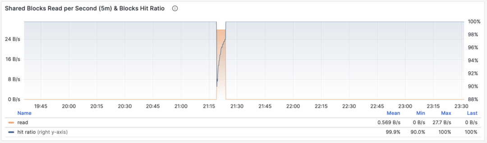

> 共享缓冲区访问带宽与缓冲区命中率

另一个值得参考的衍生指标是缓冲区命中率：即 hit / (hit + read) ，它可以用于分析性能变化的可能原因 —— 缓存未命中。当然，重复访问同一个共享缓冲池里的块，并不会真的重新读取，即使真的去读取，也不一定是读取磁盘，有可能是读内存中的FS Cache。所以这里只是一个参考值，但它确实是一个非常重要的宏观查询优化参考指标。


**WAL日志量**

当 M 是 wal_bytes 时，我们得到了该查询生成 WAL 的速率，单位是字节/每秒（B/s）。这个指标是在 PostgreSQL 13 新引入的，可以用来定量揭示查询产生的 WAL 大小：写入的 WAL 越多越快，刷写磁盘、物理复制/逻辑复制、日志归档的压力就会越大。

一个典型的例子是：`BEGIN; DELETE FROM xxx; ROLLBACK;` 。这样的事务删了很多数据，产生了大量 WAL 却没有执行任何有用的工作，通过这个指标可以将其揪出来。


> WAL字节率：1/5/15 分钟均值

这里有两个注意事项：上面我们说过，PGSS 无法跟踪执行失败的语句，但这里事务虽然 **ROLLBACK** 失败了，但是语句却是成功执行了的，所以会被 PGSS 跟踪记录。

第二件事是：在 PostgreSQL 中并非仅仅是 INSERT/UPDATE/DELETE 会产生 WAL 日志，SELECT 操作也有可能产生 WAL 日志，因为 SELECT 可能会修改元组上的标记（Hint Bit）让页面校验和出现变化，触发 WAL 日志写入。

甚至存在这种可能，如果读取负载非常大，它会有较大概率导致 FPI 镜像生成，产生可观的 WAL 日志量。你可以通过进一步检查 wal_fpi 指标。


> 共享缓冲区写脏/写回带宽

对于 13 以下的版本，共享缓冲区写脏/写回带宽指标可以作为一个近似下位替代，用于分析查询组的写入负载特征。


**I/O耗时**

当 M 是 blks_read_time + blks_write_time ，我们会得到查询组花费在块 I/O 上的耗时比例，单位是 “秒/每秒”，与每秒执行时长指标一样，它也反映出一样操作占用的时间比例。


> I/O 耗时对于分析查询毛刺原因很有帮助

因为 PostgreSQL 会使用操作系统提供的 FS Cache，所以即使这里执行了块读取/写入，可能在文件系统层面上仍然是发生在内存中的缓冲操作。所以它只能作为一个参考指标，使用时需要谨慎，需要与主机节点上的磁盘 I/O 监控相互对照。


**对时间微分的指标** **dM/dt**，可以展现出一个数据库实例/集群内部工作负载的全貌，对于优化资源使用的场景来说尤其有用。但是如果您的优化目标是改善用户体验，那么可能另一组指标 —— **对调用次数的微分 dM/dc**，会更有参考意义。


-------------------

## 对调用次数微分

上面我们已经计算了六类重要指标对于**时间**的微分，另一类衍生指标计算方式是对 “**调用次数**” 进行微分，也就是分母从时间差变成了 QPS。

这类指标重要性相比前者甚至更高，因为它提供了直接关乎用户体验的几个核心指标，比如最重要的 —— **查询响应时间** **（RT，Response Time）**，或曰 **延迟（Latency）**。

计算这些指标的方式也很简单，我们只需要：

- 计算两个快照之间的指标值 M 的差值：**M2 - M1**
- 然后计算两个快照之间的 calls 差值：**c2 - c1**
- 然后计算 **(M2 - M1) / (c2 - c1)** 即可

对于 PromQL 实现来说，对于**调用次数的微分指标 dM/dc**，可以用“**对时间的微分指标 dM/dt**” 计算得到。例如要计算 RT，就可以使用 **每秒执行时长** **/** **每秒查询数** ，两指标相除即可：

```
rate(pg_query_exec_time{}[1m]) / rate(pg_query_calls{}[1m])
```

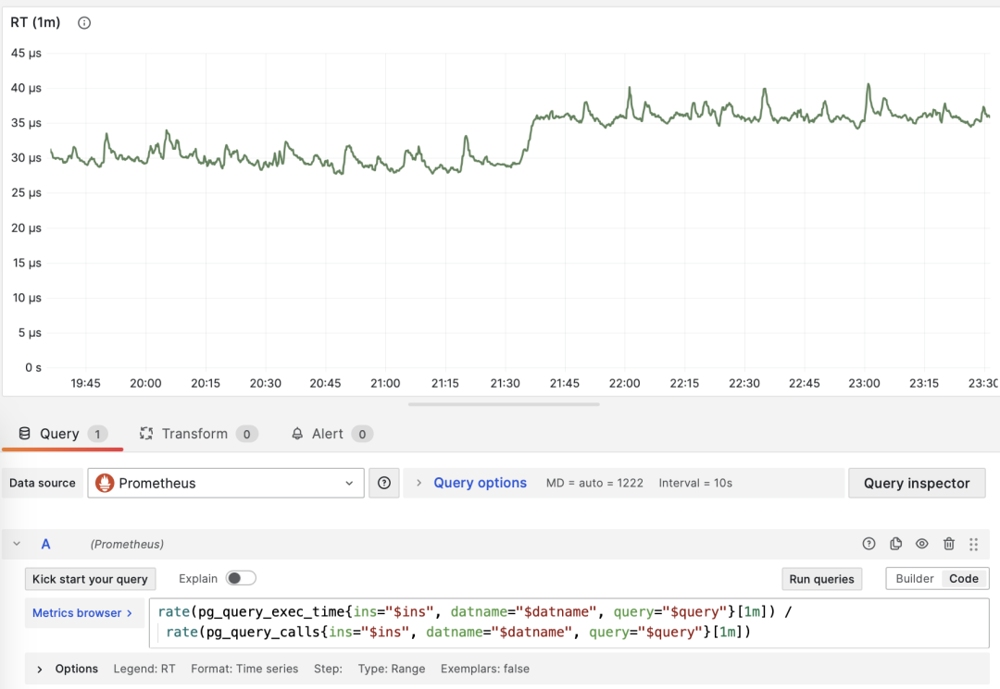

> dM/dt 可以用于计算 dM/dc


**调用次数**

当 M 是 calls 时，对自己微分没有任何意义（结果会恒为 1）。


**平均延迟/响应时间/RT**

当 M 是 total_exec_time 时，对调用次数求导的结果是 **RT**，或响应时间/延迟。它的单位是秒（s）。**RT 直接反映了用户体验，是宏观性能分析中最重要的指标**。这个指标的含义是：此查询组在服务器上的平均查询响应时间。如果条件允许启用 pg_stat_statements.track_planning，还可以加上 total_plan_time 一起计算，结果会更精确更具有代表性。

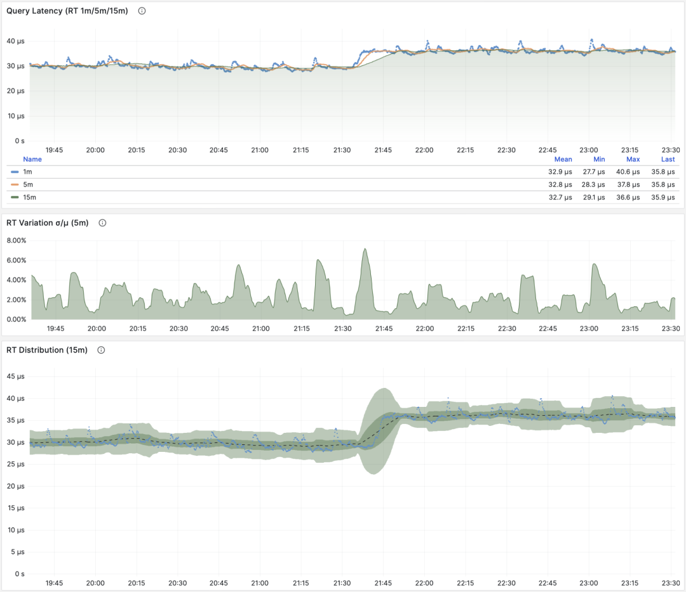

> RT：1/5/15 分钟 µ/CV， ±1/3σ分布

这里要特别强调两种特殊情况：第一：PGSS不跟踪失败/执行中的语句；第二：PGSS的统计数据受（pg_stat_statements.max）参数限制，可能出现部分采样偏差。尽管有这些局限性，但想要获取至关重要的查询语句组延迟数据，PGSS 毫无疑问是最为稳妥可靠的来源。正如上面所述，在其他观测点位也有办法采集查询 RT 数据，但会麻烦得多。

你可以在客户端侧打点，采集语句执行时间，通过指标或者日志上报；你也可以尝试使用 ebpf 来探测语句 RT，这对基础设施和工程师要求会比较高。Pgbouncer 和 PostgreSQL （14+） 倒是也提供了 RT 指标，只可惜粒度都是数据库级别，没有一个能做到 PGSS 查询语句组级别的指标收集。

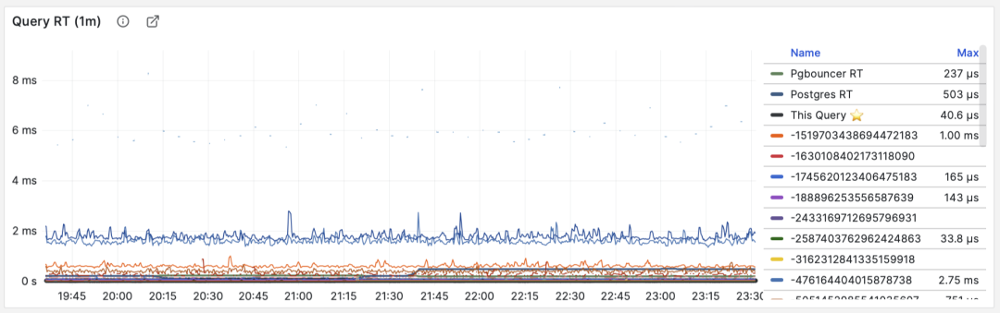

> RT：语句级/连接池级/数据库级

不同于 QPS 这样的吞吐量指标，**RT 是具有横向可比性的**：例如某个查询组平时的 RT 都在1毫秒内，那么超过 10ms 的事件应当被视作严重的偏差进行分析。

当出现故障时， RT 视图对于定位原因也很有帮助：如果所有查询整体 RT 变慢，那么最有可能与资源不足有关。如果只是特定查询组的 RT 发生变化，那就更有可能是某些慢查询导致了问题，应当进一步调查分析。如果 RT 变化的时间点与应用发布部署吻合，则应当考虑是否要回滚这些部署。

此外，在性能分析，压力测试，基准测试时，**RT 也是最重要的指标**。你可以通过对比典型查询在不同环境（例如不同PG大版本、不同硬件、不同配置参数）下的延迟表现来评估系统的性能，并以此为依据不断对系统性能进行调整与改进。

RT 是如此重要，以至于 RT 本身又会衍生出许多下游指标来：1分钟/5分钟/15分钟的均值µ与标准差σ自然必不可少；过去15分钟的 ±σ，±3σ 可以用来衡量 RT 的波动范围，过去1小时的 95，99 分位点也很有参考价值。

RT 是评估 OLTP工作负载的核心指标，怎么强调它的重要性都不为过。


**平均返回行数**

当 M 是 rows 时，我们会得到每次查询**平均返回的行数**，单位是行/每查询。对于 OLTP 工作负载来说，典型查询模式为点查，即每次查询返回几条数据。

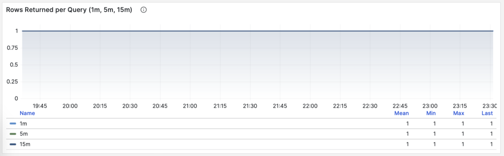

> 按照主键查询单条记录，平均返回行数稳定为1

如果一个查询组每次查询向客户端吐出几百甚至成千上万行记录，那么应当对其进行审视。如果这是有意而为之的设计，比如批量加载任务/数据转储，那么不需要做什么。如果这是由应用/客户端发起的请求，那么可能存在错误，比如语句缺少 LIMIT 限制，查询缺少分页设计，这样的查询应该进行调整修复。


**平均共享缓冲区读取/命中**

当 M 是 shared_blks_hit + shared_blks_read 时，我们会得到每条查询“命中”与“读取”共享缓冲区的平均次数，如果将其乘以默认块大小 8KiB，我们就会得到这类查询每次执行的“带宽”，单位是 B/s：每次查询平均会访问/读取多少 MB 数据 ？

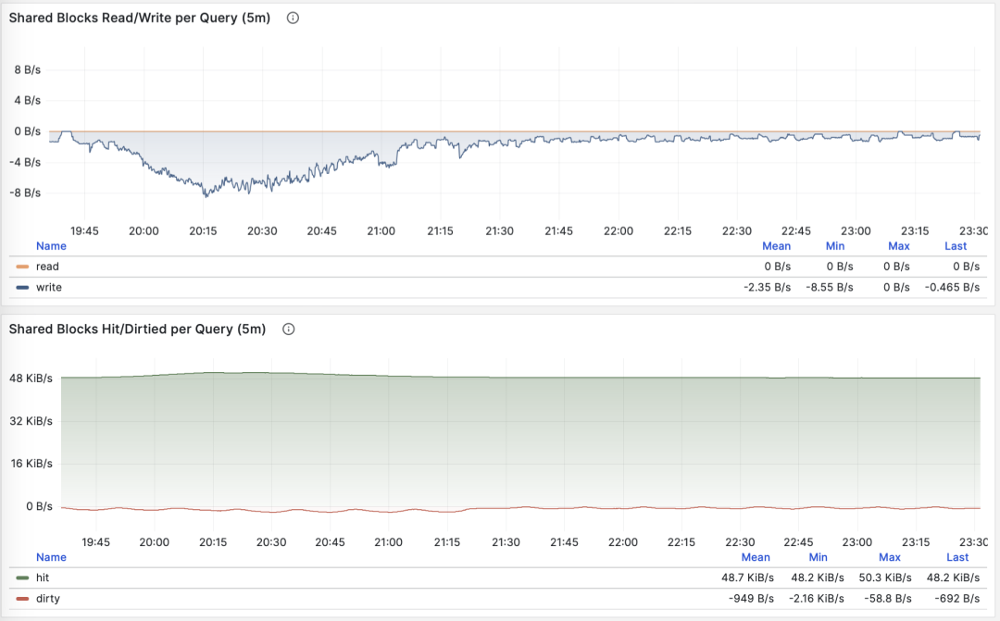

> 按照主键查询单条记录，平均返回行数稳定为1

查询平均访问的数据量通常与平均返回的行数相匹配，如果你的查询平均只返回了几行，却访问了成M上G的数据块，那你就需要特别注意了：这样的查询对于数据冷热状态非常敏感，如果所有的块都在缓冲区中，它的性能可能还说的过去，但如果从磁盘冷启动，执行时间可能会出现戏剧性的变化。

当然，不要忘记 PostgreSQL 双缓存问题，所谓“读取”的数据可能已经在操作系统文件系统层面被缓存过一次了。所以你需要与操作系统监控指标，或者 pg_stat_kcache ，pg_stat_io 这些系统视图相互参照进行分析。

另一种值得关注的模式是此指标的突变，这通常意味着该查询组的**执行计划可能出现了翻转/劣化**，非常值得关注与进一步研究。


**平均WAL日志量**

当 M 是 wal_bytes 时，我们得到了每条查询平均生成 WAL 的大小，这是 PostgreSQL 13 新引入的字段。这个指标可以衡量查询的变更足迹大小，并计算读写比例等重要评估参数。

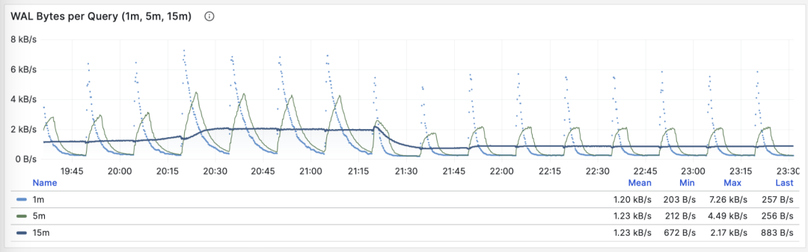

> 稳定的QPS却有着周期性WAL波动，可推断是 FPI 的影响

另一个用途是优化检查点/Checkpoint：如果你观察到此指标周期性的起伏（周期约等于 checkpoint_timeout），那么可以通过调整检查点间距，来优化查询产生 WAL 的数量。

**对调用次数进行微分的指标 dM/dc**，可以展现出一类查询的工作负载特性，对于优化用户体验来说非常有用。特别是 RT 乃是性能优化的黄金指标，怎样强调其重要性都不为过。

**dM/dc** 这样的指标为我们提供类似重要的绝对值指标，但如果想要找出哪些查询的优化潜在收益最大，还需要用到 **%M 百分比指标**。


-------------------

## 百分比指标

现在我们来研究第三类指标，**百分比指标**。即某个查询组相对于整体工作负载所占的比例。

**百分比指标 M%** 为我们提供了某个查询组相对于整体工作负载的比例，帮助我们在频次、时间、I/O时间/次数上时识别出“主要参与者”，找出潜在优化收益最大的候选查询组，作为优先级评定的重要依据。

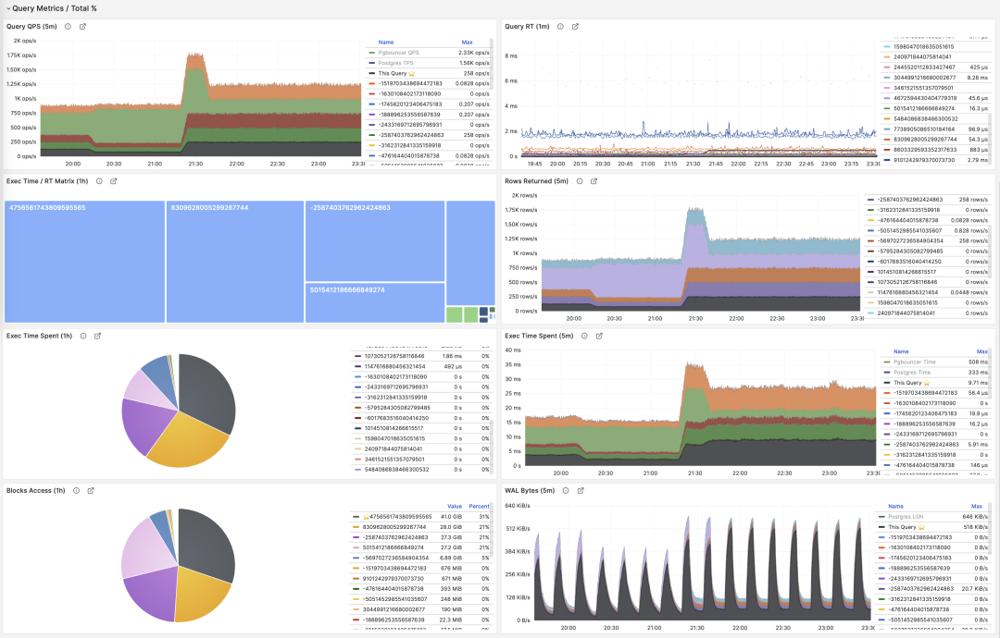

常用百分比指标 %M 一览

举个例子，如果某个查询组有 1000 QPS  的绝对值，看上去不少；但如果它只占整个工作负载的 3%，那么优化此查询的收益与优先级就没那么高了；反之，如果它占据了整个工作负载的 50% 还要多 —— 如果你有办法把它优化掉就可以砍掉整个实例吞吐量的半壁江山，优化它的优先级就会非常之高。

常见的优化策略是这样的：首先把所有查询组分别按照上面提到的重要指标：calls，total_exec_time，rows，wal_bytes，shared_blks_hit + shared_blks_read，以及 blk_read_time + blk_write_time 在一段时间内的 **dM/dt** 值进行排序取 TopN （比如 N=10 或者更多），加入优化候选列表中。

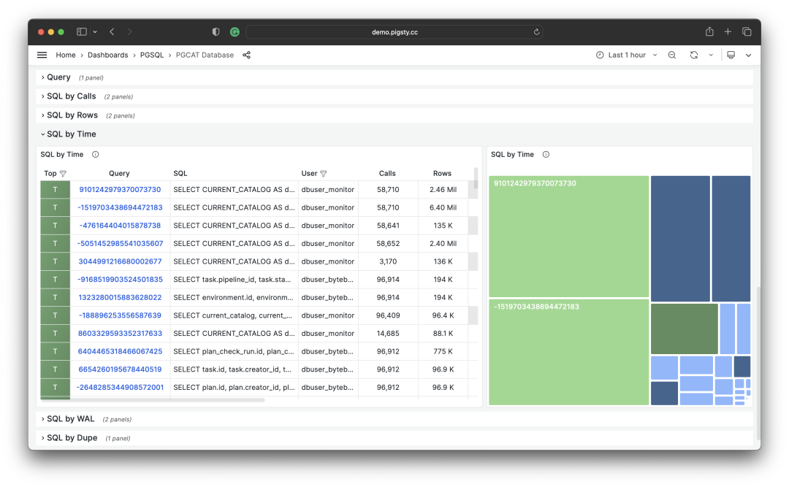

> 按照特定标准，选取待优化的 TopSQL

然后，对于优化候选列表中的每个查询组，依次分析其 **dM/dc** 指标，结合具体的查询语句与慢查询日志/等待事件进行分析，决定这是不是一个值得优化的查询。对于决定（Plan）进行优化的查询，就可以使用后续篇 **“微观优化”** 将要介绍的技巧进行调优（Do），并使用监控系统评估优化的效果（Check），总结分析后进入下一个 PDCA 戴明循环，持续进行管理优化。

除了对指标取 TopN 之外，还可以使用可视化的方式。可视化非常有助于从工作负载中识别 “主要贡献者”，复杂的判断算法可能还远比不上人类DBA对监控图形模式的直觉。想要形成比例感，我们可以借助饼图，树图或者堆叠的时序图。

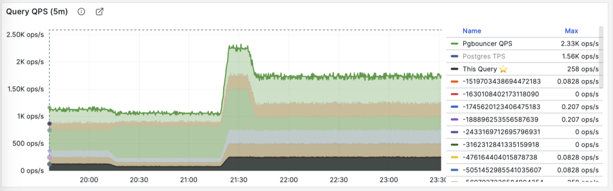

将所有查询组的 QPS 进行堆叠

例如，我们可以使用饼图来标识过去1小时内耗时/IO使用最大的查询，使用二维树图（大小代表总耗时，颜色代表平均RT）来展示一个额外的维度。并用堆叠时序图来展示比例随时间的变化关系。

我们也可以直接分析当下的 PGSS 快照，按照不同的关注点进行排序，按照您自己的标准选择有待优化的查询即可。


I/O 耗时对于分析查询毛刺原因很有帮助


-------------------

## 总结

最后，让我们对上面的内容做一个总结。


PGSS提供了丰富的指标，其中最重要的累积指标可以使用三种方式进行加工处理：

**dM/dt** ：指标 M 基于时间的微分，揭示了**每秒资源使用量**，通常用于减少资源消耗的优化目标。

**dM/dc**：指标 M 基于调用次数的微分，揭示了**每次调用的资源使用量**，通常用于改善用户体验的优化目标。

 **%M** ：百分比指标展示了查询组在整个工作负载中所占的百分比，通常用于平衡工作负载的优化目标。

通常，我们会根据 **%M** ：百分比指标 Top 查询选择高价值的备选优化查询，并使用 **dM/dt \**dM/dc\**** 指标进行进一步的评估，确认是否有优化空间和可行性，并评估优化后的效果。如此往复，不断循环。

理解了宏观优化的方法论后，我们就可以用这样的方法去定位优化慢查询了。这里给出了一个具体的 《 [利用监控系统诊断PG慢查询](http://mp.weixin.qq.com/s?__biz=MzU5ODAyNTM5Ng==&mid=2247484478&idx=1&sn=ea44675df79b60a12273e78b358bb557&chksm=fe4b31e5c93cb8f325ba1e4389874112bd5441280492c87e259a32aa67e00c7e0028e7dc51eb&scene=21#wechat_redirect)》的例子。在下一篇中，我们将介绍关于 PostgreSQL查询 **微观优化** 的经验技巧。


-------------------

## 参考

`[1]` [PostgreSQL HowTO: pg_stat_statements](https://gitlab.com/postgres-ai/postgresql-consulting/postgres-howtos/) by Nikolay Samokhvalov

`[2]` [pg_stat_statements](https://www.postgresql.org/docs/current/pgstatstatements.html)

`[3]` [利用监控系统诊断PG慢查询](http://mp.weixin.qq.com/s?__biz=MzU5ODAyNTM5Ng==&mid=2247484478&idx=1&sn=ea44675df79b60a12273e78b358bb557&chksm=fe4b31e5c93cb8f325ba1e4389874112bd5441280492c87e259a32aa67e00c7e0028e7dc51eb&scene=21#wechat_redirect)

`[4]` [如何用Pigsty监控现有PostgreSQL (RDS/PolarDB/自建)？](http://mp.weixin.qq.com/s?__biz=MzU5ODAyNTM5Ng==&mid=2247486169&idx=1&sn=697ab3c172fe6cc28e12cff7297bb343&chksm=fe4b3f02c93cb614bbd1d5075120e074cebb5214d3a1a516363582bcee294e02bf5fd0e051ee&scene=21#wechat_redirect)

`[5]` [Pigsty v2.5 发布：Ubuntu/Debian支持与监控改版/新扩展](http://mp.weixin.qq.com/s?__biz=MzU5ODAyNTM5Ng==&mid=2247486283&idx=1&sn=4b63f438df33291a3deb1052bea31347&chksm=fe4b3e90c93cb786a54407a4f7e552b2c8b28478b28df852e41f5d9e2c991761dddbc9a5a813&scene=21#wechat_redirect)

`[6]` [PostgreSQL监控系统Pigsty概述](http://mp.weixin.qq.com/s?__biz=MzU5ODAyNTM5Ng==&mid=2247484189&idx=1&sn=19d4381c7ec4bc4498bd56c5ee9f916b&chksm=fe4b36c6c93cbfd06fba1c7a1ad3c5cba8d0060f82acb56e96f0e64694f79c2df9299f0b1115&scene=21#wechat_redirect)