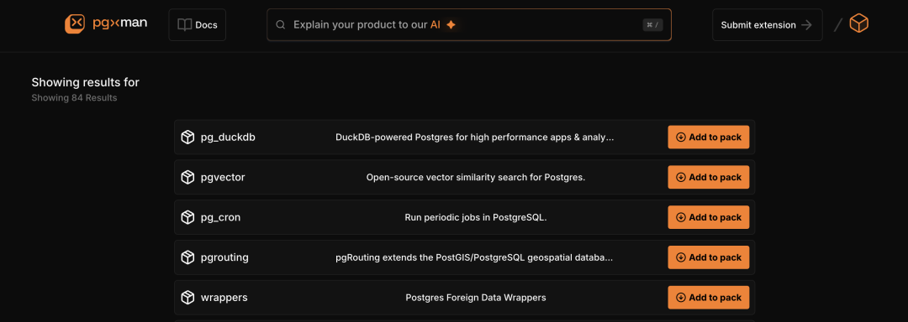

> [微信公众号](https://mp.weixin.qq.com/s/8zxeDQ7p5tPNGYED_1Bugg)

最近我在忙一个非常有趣的新项目，这两天总算弄完了。各位朋友们，给大家介绍一下这个有趣的小东西，PostgreSQL 与 Pigsty 中久久缺失的一个命令行工具，我称之为 “[**pig**](https://github.com/pgsty/pig)”。

那么 pig 是干什么的？简单来说，这是一个 PostgreSQL 的包管理器，也是 PostgreSQL 与 Pigsty 中久久缺失的一个命令行工具，它可以在主流 Linux 操作系统上提供跨发行版的丝滑无缝的 PostgreSQL 安装部署体验。而且还通过国内镜像解决了下载速度慢和部分仓库被墙的问题。


当然，安装 PG 这种事算不上有什么技术挑战，真正有难度的是 PostgreSQL 生态中的扩展插件。PostgreSQL 有着数据库世界中独一无二的繁荣扩展生态，提供各种强大而惊人的能力。而 pig 则能够在（Debian / Ubuntu / EL ）三大 Linux 主流发行版（五个大版本 x AMD/ARM 两大架构）上，提供 **340** 个 PG 插件开箱即用的能力。


为什么插件对 PG 至关重要？请参阅《[PostgreSQL正在吞噬数据库世界](/pg/pg-eat-db-world)》

------

## 快速上手

pig 本身是一个 Go 编写的二进制程序，您可以直接从 Release 页面下载，或者使用 Pigsty 现成提供的 YUM / APT 仓库，使用操作系统的包管理器安装。

```bash
curl -fsSL https://repo.pigsty.io/pig | bash     # cloudflare 全球仓库（默认） 
curl -fsSL https://repo.pigsty.cc/pig | bash     # 中国大陆墙内镜像仓库
```

使用 pig 分两个步骤，首先，使用 `repo` 子命令添加上游仓库

```bash
$ pig repo add pigsty pgdg -u  # 添加 pgdg & pigsty 仓库并更新缓存（比较礼貌的做法）
$ pig repo set -u              # 你也可以用这个命令直接移除所有现有Repo，并覆盖添加所有必须的Repo，粗暴但有效

$ pig ext install pg17         # 如果您没有安装 PostgreSQL 内核，可以使用这种方式安装 PGDG 内核包
$ pig ext install pg_duckdb    # 默认针对当前活跃的 PG 安装扩展，例如安装：pg_duckdb 扩展（针对活跃的 PG17）
```

然后，您就可以使用 `ext` 子命令搜索，查阅，安装，卸载，更新扩展了。是的，如果你就是安装个扩展，也就是一行命令这么简单。

你可以用命令行完成各种操作，文档里会详细介绍各种高级用法。此外，`pig` 还提供了一个 `sty` 子命令，用于安装 Pigsty 本身：

```bash
pig sty init     # 默认安装嵌入的最新 Pigsty 版本
pig sty boot     # 执行 Bootstrap，安装 Ansible
pig sty conf     # 执行 Configure，生成配置文件
pig sty install  # 执行 install.yml 剧本完成部署
```


------

## 为什么需要包管理器？

那么在包管理器出现之前，用户想要安装 PostgreSQL 及其扩展，是怎么样的体验呢？当然你可以直接从源代码编译。PG 内核本身编译安装还是“很简单”的，几条命令就可以，不过 PG 生态的核心扩展 —— 地理空间事实标准 PostGIS 的编译安装基本上就立刻跳到地狱难度了。

尽管如此，编译安装对 **绝大多数用户** 来说基本属于早已失传的古代技能了。根据我对社区的观察，你能对用户做出的最大期待就是会用 `yum/apt install`，然后会照着文档敲为数不多的 Linux 命令。再高的工作假设就显得不切实际了。

[](https://www.postgresql.org/download/)

> https://www.postgresql.org/download/


------

## PGDG官方仓库有什么问题？

尽管 PostgreSQL 官方提供了官方的 PGDG YUM / APT 仓库，但是这里依然有不少的问题：首先扩展数量只有一百个左右，其次，这里只有一半扩展是同时在 YUM / APT 仓库中提供的。最后，针对不同的 PG 大版本，芯片架构，操作系统发行版版本，经常性的会出现某个组合下的扩展缺失与错漏。


为了解决这个问题，我们提供了一个 PGDG [补充仓库](https://pgext.cloud/zh)，这有点类似于 EL Linux 上的 EPEL 源，补齐了大量缺失的扩展插件，并实现了 Debian / Ubuntu / EL 三大主流 Linux 的扩展功能集对齐，补齐了一块行业空白。我们的扩展仓库完全遵循 PGDG 的打包规范与命名惯例，使用相同的环境构建，确保与官方内核包无缝衔接对齐。


------

## 为什么用操作系统包管理器？

pig 被设计为原生使用 Linux 操作系统发行版现有的包管理器（yum / dnf / apt ），而非自己造一个全新的轮子。这是因为操作系统在解决依赖管理，升级降级这些问题上已经有了非常成熟且标准的实践了。并且毫无疑问最广大 PostgreSQL 用户群体早已接受并习惯于这一标准，因此我们认为打破这一标准的做法是远远弊大于利的。

因此，pig 仓库使用的软件包全部使用操作系统标准的 RPM / DEB 格式进行封装，确保它可以在主流的 Linux 发行版上丝滑安装与运行。Pigsty 在不同操作系统发行版上提供了一层统一的抽象，你只需要知道扩展名就可以安装，你不需要操心 PG 版本号，OS 大小版本，芯片架构，pig 会为你处理好所有细节。

```
$ pig ext scan

Installed:
* PostgreSQL 17.2  74  Extensions

Active:
PG Version      :  PostgreSQL 17.2
Config Path     :  /usr/pgsql-17/bin/pg_config
Binary Path     :  /usr/pgsql-17/bin
Library Path    :  /usr/pgsql-17/lib
Extension Path  :  /usr/pgsql-17/share/extension
Name                 Version  SharedLibs                                                           Description            Meta
----                 -------  ----------                                                           ---------------------  ------
amcheck              1.4      functions for verifying relation integrity                           module_pathname=$libdir/amcheck relocatable=true lib=amcheck.so
anon                 1.3.2    Data anonymization tools                                             directory=extension/anon relocatable=false superuser=false module_pathname=$libdir/anon lib=anon.so
auth_delay           -        pause briefly before reporting authentication failure                lib=auth_delay.so
...
wal2json             2.5.3    Changing data capture in JSON format                                 lib=wal2json.so
xml2                 1.1      XPath querying and XSLT                                              module_pathname=$libdir/pgxml relocatable=false lib=pgxml.so

Encoding Libs: cyrillic_and_mic, euc2004_sjis2004, euc_cn_and_mic, euc_jp_and_sjis, euc_kr_and_mic, euc_tw_and_big5, latin2_and_win1250, latin_and_mic, utf8_and_big5, utf8_and_cyrillic, utf8_and_euc2004, utf8_and_euc_cn, utf8_and_euc_jp, utf8_and_euc_kr, utf8_and_euc_tw, utf8_and_gb18030, utf8_and_gbk, utf8_and_iso8859, utf8_and_iso8859_1, utf8_and_johab, utf8_and_sjis, utf8_and_sjis2004, utf8_and_uhc, utf8_and_win

Built-in Libs: dict_snowball, libecpg, libecpg_compat, libpgtypes, libpq, libpqwalreceiver, llvmjit

Unmatched Shared Libraries: psqlodbc, psqlodbca, psqlodbcw
psqlodbc
psqlodbca
psqlodbcw
```

> 使用 pig 工具扫描已安装的 PG 扩展


------


## 这个项目的价值在哪里？

抽象是软件能提供的核心价值。而 Pig 提供了一个相当优雅的抽象，解决好了 PostgreSQL 内核与扩展安装的问题。其实 Pigsty 在之前已经非常好的解决了这个问题 —— 你可以一键从裸操作系统上拉起装好所有 PG 扩展的插件，自带监控系统，高可用，PITR，还不要钱！

但我能理解，这样一个一揽子一条龙全家桶解决方案并非适用于所有用户 —— 特别是许多外国人更喜欢：每个工具做好一件事做到极致的方式。pig 其实是用 Go 重写了 Pigsty 的包管理部分。只不过之前 Pigsty 是用 Ansible Playbook 实现的，有个 Python 依赖。而 Pig 是一个干干净净没有依赖的 Go 二进制程序，开箱即用。

> pig 除了可以一键安装 PG 扩展，当然也可以一键安装各种版本的 PG 内核。


------

## 这个项目的核心壁垒是什么？

pig 只是一个小工具，真正重要的是这个工具背后的 Pigsty 扩展仓库。这个仓库里维护了 140 个 PG 扩展，以及各种针对 PGDG 仓库补漏的构件。要构建这个扩展仓库，你需要有丰富的 PostgreSQL 经验与 Linux 操作系统经验，你需要同时熟悉 RHEL 与 Debian/Ubuntu 的打包方法，而老实说这是一项相当稀缺的技能。

我曾经跟 Pivotal （Greenplum）的团队聊天，老板说他们亟缺构建打包的专家。其实很容易就能看出来，他们发布的时候就一个可怜的 CentOS RPM 包。当然，说他们一句国内 PostgreSQL 综合实力第一的团队应该不为过，而这样的团队却依然没有懂这个的，这确实给我了一些启发。


------

## 现在这个仓库是什么状态

目前这个仓库里面提供了 150 个独特的 PG 扩展，包括二十来个 Rust 编写的强力扩展。独特的意思就是没有被收录到 PGDG 官方仓库里。PGDG 官方仓库有 100 个左右扩展，PIGSTY 仓库提供了 150 个，再加上 PG 自带的 70 个，总数 320 个，不过有些扩展只在 EL 有，有的只在 DEB 上有，所以总可用扩展数量目前是 340 个。

> Provide 340 available extensions as RPM / DEB for PostgreSQL **13** - **17** in addition to the official PGDG repo.
> 
> Available on Linux: Debian 12 / Ubuntu 24.04 / 22.04 / EL8 / EL9 compatible OS distros, and `x86_64` & `ARM64` architectures.
> 
> | Entry / Filter | All | PGDG | PIGSTY | CONTRIB | MISC | MISS | PG17 | PG16 | PG15 | PG14 | PG13 |
> |:--------------:|:---:|:----:|:------:|:-------:|:----:|:----:|:----:|:----:|:----:|:----:|:----:|
> | RPM Extension  | 334 | 114  |  147   |   69    |  4   |  6   | 303  | 330  | 333  | 321  | 303  |
> | DEB Extension  | 327 | 104  |  150   |   69    |  4   |  13  | 304  | 323  | 326  | 319  | 300  |


这 340 个扩展的质量很高，是已经经过我严格筛选后的结果。一些没鸡毛用的扩展，缺乏维护，年久失修的扩展，代码质量差的扩展，无法跨平台兼容的扩展，已经被我无情淘汰了大概二三十个了。我们有一个网站 https://pgext.cloud/zh ，详细收录了这 340 个扩展的元数据详情。在 pig 命令行工具里面也提供了检索与查阅详情的能力。


目前这个仓库托管在 Cloudflare 上，国内镜像放在腾讯云 CDN 上。每个月的下载量算上镜像大概 500 GB 左右，考虑到一个扩展也就几百KB，这个下载量还是相当可观的。


------

## Pig 使用什么开源协议，如何考虑？

这个仓库本身的代码，以及 `pig` 工具没有使用 Pigsty 的严格 AGPLv3 协议，而是宽松的 `Apache-2.0` 开源许可证，这样做的目的也是为了让更多的用户与厂商参与进来。目前，这个仓库已经成为了两家友商 AutoBase （原 postgresql_cluster）和 Omnigres 默认使用的上游扩展仓库。

目前，我也在游说 CloudNativePG，Neon 和 Supabase 使用这个扩展仓库，我觉得问题不大，因为这属于互惠共赢的事情 —— 这些 PostgreSQL 发行版马上也可以宣称自己和 Pigsty 一样，340 个扩展开箱即用，哈哈。[Omnigres 的创始人 Yurii 下下周来上海（PostgreSQL生态大会）跟我勾兑](https://mp.weixin.qq.com/s?__biz=MzU5ODAyNTM5Ng==&mid=2247488803&idx=1&sn=cce2ed9bfeee9ca23b64b564ac2d2220&scene=21#wechat_redirect)，我们准备搞个大新闻，尽可能把它做成 PG 世界的一个新事实标准。


------

## 为什么是你来做，而不是别人？

在年初，我提出了 可扩展性（Extensibility） 是 PostgreSQL 的核心属性，得到了社区的广泛认可与响应。我其实是期待生态里面有其他的人能够站出来，解决 PG 扩展分发的问题的。我曾经比较看好 Tembo 的愿景 —— 他们做了个 Trunk （宝箱），其实就是一个 PG 包管理器。我希望他们能做的足够好，这样我就不用操心扩展打包这些活了，直接拿过来就能用，整合到我的 PostgreSQL 发行版 Pigsty 里。


但是这半年观察下来，我发现包括 Trunk 也好，PGXMAN 也好，都是雷声大雨点小，不干实事的家伙，折腾来折腾去就那么些老扩展。而且愿景也比较扯蛋 ：放着现有的 YUM / APT 实事标准不弄，一会弄个 OCI 镜像分发，一会弄个新 Catalog，唯独就是不解决用户的核心痛点 —— ”我他喵的现在就是想用这个扩展怎么办？“



五年前，我在 PostgreSQL 生态寻找足够好的监控系统，也遇到过这个问题。社区不给力怎么办，当然是我行我上了。所以我也懒得等了，直接自己上了。老实说这里有许多难题要解决，但技术问题都是可以解决的。在这半年里，我在这个领域积累了独一无二的经验 —— 一个人就维护了超过整个 PGDG 仓库，占总数近 60% 的扩展包。


------

## 谁还用包管理器，Docker不香吗？

我在 《**把 PostgreSQL 放入 Docker 是一个好主意****吗**》这篇文章中深入聊过这个问题，其中特别提到过扩展的问题。总的来说，会遇到：扩展持久化的问题，安装扩展需要重新构建镜像，推送并重启的问题，难以同时组合使用扩展的问题。

> 一个简单的例子是插件与包管理，PostgreSQL提供了很多实用的插件，譬如PostGIS。假如想为数据库安装该插件，在裸机上只要`yum install`然后`create extension postgis`两条命令就可以。但如果是在Docker里，按照Docker的实践原则，用户需要在镜像层次进行这个变更，否则下次容器重启时这个扩展就没了。因而需要修改Dockerfile，重新构建新镜像并推送到服务器上，最后**重启数据库容器**，毫无疑问，要麻烦的多。
>
> 包管理是操作系统发行版的核心问题。然而 Docker 搅乱了这一切，例如，许多 PostgreSQL 不再以 RPM/DEB 包的形式发布二进制，而是以加装扩展的 Postgres Docker 镜像分发。这就会立即产生一个显著的问题，如果我想同时使用两种，三种，或者PG生态的一百多种扩展，那么应该如何把这些散碎的镜像整合到一起呢？相比可靠的操作系统包管理，构建Docker镜像总是需要耗费更多时间与精力才能正常起效。

而且最重要的是你如果去看各种 PostgreSQL Docker 镜像的 Dockerfile 就会发现，它们几乎全都是使用操作系统的软件包来安装扩展的。说到底，这些活是省不了的。用 Docker 也改变不了这一点。


------

## 为什么叫 pig 这个名字？

我有一个开源的 PostgreSQL 发行版叫 Pigsty （猪圈），那么 pig 是作为 Pigsty 的管理命令行工具而存在的。猪圈里的动物是什么，自然是猪（pig）。当然，即使你不使用 Pigsty 这个 PG 发行版，你也可以独立使用 pig 这个命令行工具来安装，管理 PostgreSQL 与 扩展。


有一个比较有名项目叫 Apache Pig ，在 Hadoop 上提供 SQL-Like 的查询语言支持（Pig Latin），已经占用了 Pig 这个名字，我也思考了很久要不要使用其他名字比如 pk （pigsty keeper，猪圈管理员），或者就叫 pg 。但最后还是决定叫 `pig`，反正 Apache Pig 已经过气了，使用这套工具的环境和 Apache Hadoop 的用户也尿不到一个壶里去，基本没有命名冲突的风险，所以就这么办了。


------

## 下一步 pig 会如何发展？

如你所见，Pig 目前是作为 PostgreSQL 扩展管理器发布的，但它本质上是 Pigsty 的管控命令行工具。后续我会添加更多的功能，尽可能多地把 Pigsty 的一些功能移植进 pig 里来。

在另一个方面，既然我已经成为了构建打包编译大师，那么就应该把这个技能发挥到极致。目前 Pigsty 除了支持原生的 PG 内核之外，还支持 IvorySQL，PolarDB，Babelfish 这样的 PG 分叉内核（分别提供 Oracle 兼容，RAC，MSSQL 兼容能力），但有一个问题就是这些数据库内核目前是没有扩展支持的。比如，如果你想在兼容 Oracle 语法（使用 PolarDB-O 或 IvorySQL）的同时使用 pgvector，那你只能自己去编译。

> PostgreSQL 生态的各种内核分叉 —— Kernels

我的计划是针对主流的 PG Fork，统一提供主流 Linux 系统上的 RPM/DEB 内核包 + 扩展包。让这些分叉也可以做到 340 个 PG 扩展开箱即用。目前我已经基本跑通了 OrieloDB 的流程，可能会在下个版本有一个草案与初步实现。


------

## 最后

希望 pig 这个工具，可以帮助你享受 PostgreSQL 和扩展插件的乐趣～。

