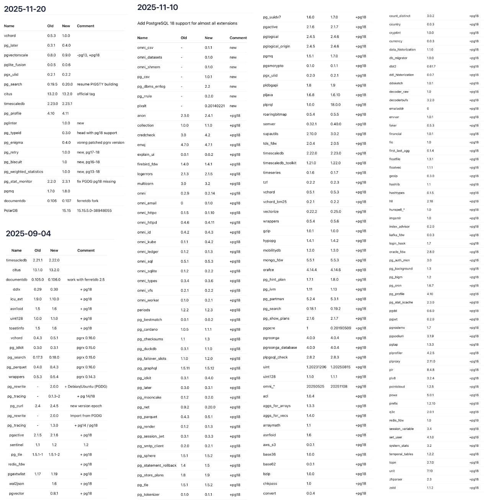
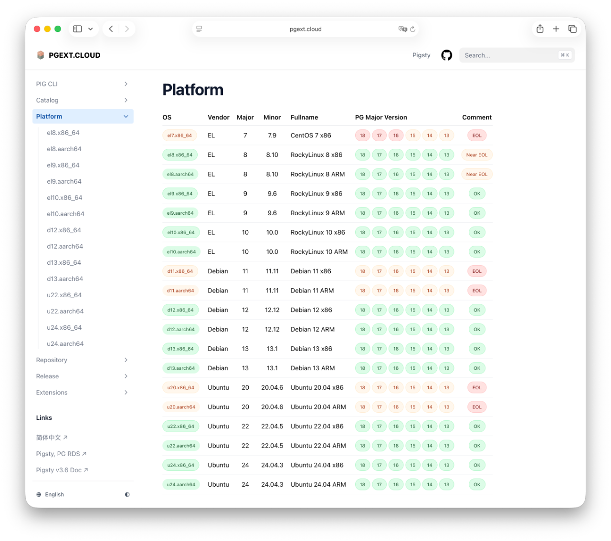
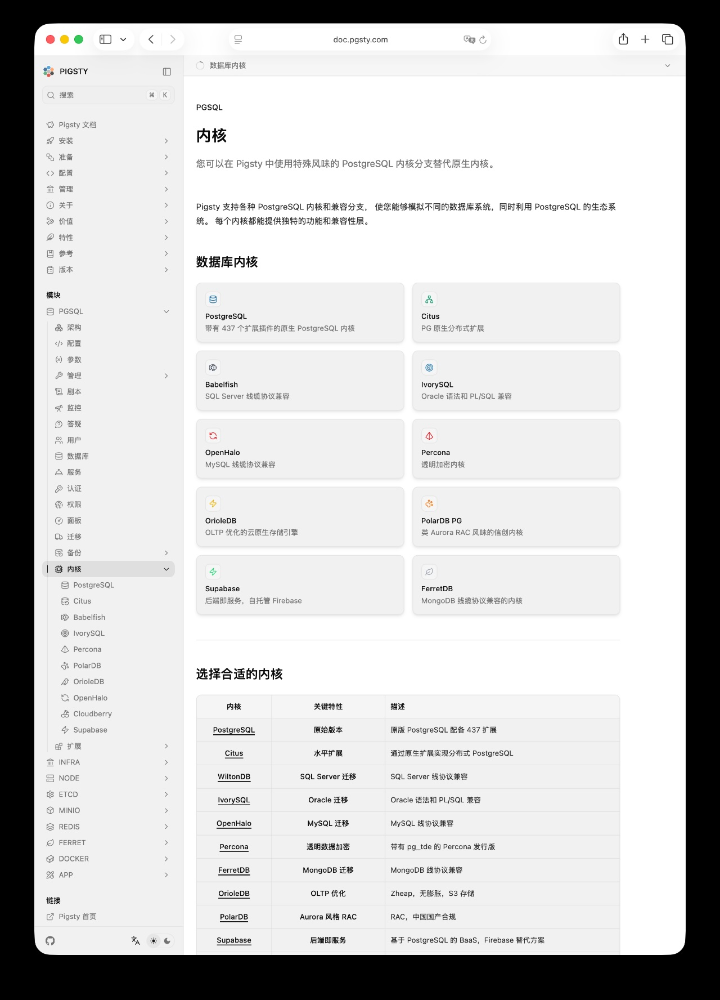
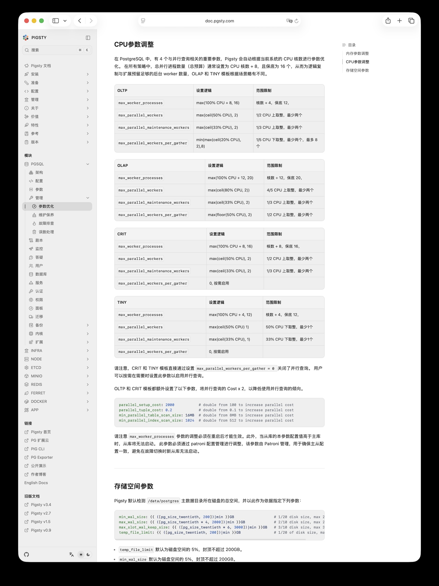

Pigsty v3.7.0 正式发布了，这次更新带来了完整的 PostgreSQL 18 支持，以及四个新的操作系统支持：Debian 13 / EL 10 与 x86/ARM 架构的四种排列组合。与此同时，Pigsty 支持的扩展插件数量也从之前的 423 个达到了 437 个，大量扩展版本都批量更新至最新版本。

此外，Supabase，IvorySQL，PolarDB，Percona TDE 内核也都升级到了最新的版本。Prometheus，Grafana，DuckDB，Etcd 等基础组件也都进行了一次集中式的批量更新。

本来，按照过往的习惯，当 PostgreSQL 默认大版本更新时，应该同样更新 Pigsty 的大版本号，从 v3 跳到 v4 ，不过考虑到还有一些命令行工具，日志系统的未竟事宜，v4.0 版本号就留给下一个版本吧。

> [微信公众号](https://mp.weixin.qq.com/s/Sui0kzOD9M_XYlNR-BZ1Ng) | [GitHub Release](https://github.com/pgsty/pigsty/releases/tag/v3.7.0)

顺带一提，Pigsty 最近凭借在 PostgreSQL 扩展生态的突出贡献，获得了 “PostgreSQL 万磁王” 奖。

## PostgreSQL 18 上位

在 《[PostgreSQL 18 可以上生产用了吗？](https://mp.weixin.qq.com/s/immOsWr2lkqWADx_6yOGCQ)》中，老冯说过 PG 18.1 发布之后，可以开始在新的业务中生产使用了。这不，Pigsty v3.7 就将 PG18 正式作为了默认的版本。

PG 18 有一些给力的新特性，时态主键，UUIDv7 内置，索引跳跃扫描，异步 AIO，虚拟生成列，Explain 增强，OAuth 2.0 支持，如果你用到了这些特性，那么确实应该考虑升级到 PG 18 了。

与此同时，11 月发布的 PG 13.23 将会是 PG 13 的最后一个版本，PG 13 将会退出历史舞台，停止支持。
老冯倒是没有着急把 PG 13 给剔除出去，但 Pigsty v3.7 会是最后一个支持 PG 13 的版本了。
为了告别 PG 13， 老冯特意把所有的扩展都重新编译了一遍，以后仓库里的 PG 13 扩展就不会再更新了。

## 扩展更新

要支持 PG 18 可不是一件容易的事情，实际上老冯在 PG 18beta 刚发布的时候就提供了部署支持，但能用内核，和能上生产是两回事，要想作为默认主力版本使用， 还有很多工作，比如扩展支持。目前主要的扩展除了 Citus 之外，都已经支持了 PG 18，老冯自己也修了几十个扩展，以及拉齐 40 个 Rust 扩展的 pgrx 版本。

这次更新可以说是一次史诗级更新。背后有许多的苦力活儿，但总算是搞定了。目前 PG18 上的可用扩展数量大概在 390 ~ 405，不同发行版会有细微差别。你可以在老冯的新项目《[PG扩展云，免翻免费解锁PG完全体](https://mp.weixin.qq.com/s/oHHzhbbt5suSxnJhyxTwQQ)》上找到完整的扩展可用信息。最近三个月以来的扩展更新情况如下表所示：

有一些扩展出现了里程碑式的更新，例如 pg_duckdb 1.1, pg_mooncake 0.2, vchord 1.0, pg_search 0.20。最让老冯欣慰的就是 DuckDB 全家桶的两个扩展，pg_mooncake 现在用 Rust 重写了，成为了 pg_duckdb 的子扩展，也就是说两个扩展现在可以并存了。而且 pg_duckdb 1.0 发布之后，代码质量改善了不少，之前在 EL8 上不可用，现在也可以正常使用了。

扩展打包是一件很辛苦的事情，支持 PG18，Debian 13，EL10，看上去轻飘飘一句话，实际上这意味着排列组合从原来的（PGSQL 5 x Linux 10）变为 (PGSQL 6 x LINUX 14)，扩展的编译测试矩阵从 50 个变成了 84 个，增加了 68%，结果是老冯仓库里的 RPM/DEB 包的数量从四万多个变为六万多个。
为了避免重复劳动，老冯特意花了两周时间，把整个扩展构建流程给自动化掉了。现在只要拉起一个容器，然后 `pig build pkg <xxx>` 立即就可以完成扩展的构建，比以前要轻松太多了。

最棒的是，这个扩展仓库和构建基础设施也是可以独立使用的。即使你不使用 Pigsty，也可以单纯使用 YUM / APT 安装这些扩展扩展。所有代码使用 Apache-2.0 宽松许可证开源，也欢迎同行使用。
凭借这一贡献， Pigsty 在第八届 PostgreSQL 数据库生态大会上获得 “PostgreSQL 万磁王” 奖。

## 操作系统：EL10，D13

在 Pigsty 3.7 中，支持了四个新的操作系统，Debian 13 ，EL 10，以及 x86 / Arm64 的四种排列组合。主线系统支持达到了 14 个。这里面其实也有一些挑战，新的系统有时候就是缺这缺那的。

举个例子，之前 EL10 刚发布的时候，老冯就想去支持了，但是蛋疼的是 EL10 的 ansible 包还是不全的。等了几个月还是这个鸟样子，老冯决定不等了，自己把 Ansible 的包给移植过来。所以在 Pigsty 的仓库里，el10 现在提供了一个 ansible 虚拟包，老冯把 EL9 的 ansible-collection-community-crypto 拉下来给 el10 打了包，总算是解决了 EL10 上的 ansible 问题。

说起 Ansible ，最近有一些用户遇到了另一个扯淡的问题，Ansible 2.19 版本进行了大量的不兼容重构，很多原来的语法都开始报错了。结果老冯为了找出让新老版本都能工作的写法，进行了大量的适配 —— 还好有 Claude Code。在 Pigsty v3.7 中，新老版本的 Ansible 现在都可以正常工作了。

当然，其实还有许多非常扯淡的问题需要解决，比如 el9/el10 上 PGDG 仓库把原来的 LLVM19 升级到 LLVM20，这就引入了一些不兼容的地方，想要在这几个系统上安装最新的 PG，你还要卸载掉系统自带的 bpftools 和 python-perf 才行。然后 el10.aarch64 的PGDG 仓库也调整了好几轮。PGDG extras 仓库也换了位置。这里的细节实在是太多了。包括阿里云 Docker 镜像仓库 Break，还有其他一些乱七八糟的细节。

这也是老冯不建议普通用户自己去折腾 PG 部署的一个原因，很多时候乃翻车并不是做错了什么，而是上游在瞎搞。有时候一更新，依赖就 Break 了。需要有人来擦屁股，避免这个问题的最好方式，就是使用 Pigsty 提供的离线安装包，把正常时刻下的所有包和依赖都拉下来，确保始终可以 Work。

另一个变化是，这个版本将是 EL8/Debian11/Ubuntu20 最后一个活跃维护的 Pigsty 版本。老冯的策略是对 EL，Debian，Ubuntu 都只维护最近两个大版本，既然 EL10 和 Debian 13 上位了，那么 EL8 和 Debian 11 就自然也要退休了。
支持不会移除，只是不会再更新了，新的扩展包，测试流程都不会再包含 EL8，Debian11，Ubuntu20。当然，有需要的企业用户，老冯也可以对这些老系统提供长期支持服务。

## Supabase，IvorySQL，PolarDB，Percona

当然，除了原生的 PG 内核之外，Pigsty v3.7 还更新了 Supabase，IvorySQL ，PolarDB，Percona 内核的版本。

Pigsty 自建 Supabase 模板里，所有的 Docker 镜像已经更新到了最新版本，而且底层使用的 PG 版本也升级到了 PG18。IvorySQL 从 4.5 升级到了 5.0，兼容 PG 18.0 。 Percona 的 TDE 透明加密内核也从 PG 17.5 兼容升级到了 18.1 兼容。此外 PolarDB 发布了 15.15.5.0 版本，并在老冯的 push 下提供了 Debian 13 / EL10 的 RPM/DEB 包。

此外，提供 MongoDB 兼容性的 FerretDB 也更新到了 2.7 版本，底层使用的 DocumentDB 升级到 0.107 。这里遗憾的是虽然老冯已经提给微软上游  0.107 PG 18 支持的 Issue 修复了，但 FerretDB 还没有合并，所以目前还不支持 PG 18 。OpenHalo，OrioleDB 内核没有更新，但也新支持了 Debian 13 与 EL 10。

令人高兴的是，这些内核都可以丝滑的在新的操作系统上使用（Babelfish 除外）。
这更进一步奠定了 Pigsty “元发行版”  —— Meta Distribution 的生态位。你可以在这里开箱即用地尝鲜各种不同风味的 PG 发行版 —— Supabase，Percona，等等……。

## 参数改进

此外，Pigsty 默认的参数模板也针对 PG 18 和一些新的场景进行了优化。例如，我们优化了 CPU，进程，线程，并行查询的相关参数，确保各种扩展都有足够的 worker 可用，并且放宽了 OLTP 模板对并行查询的限制。

相关的参数优化说明，现在都在文档中进行了详细说明，我们还提供了一些关于 维护保养，故障排查，误删处理等问题的 SOP 。

## 愿景：PG 生态的 Ubuntu

以上，就是 Pigsty v3.7 带来的改进。v3.7 已经解决了 PostgreSQL 数据库内核/扩展的硬骨头问题，在接下来的 4.0 版本中，我们将视情况引入日志系统的升级，提供更好的命令行管理工具，vllm 部署本地 Embedding / Rerank 模型的能力。

目前在 PostgreSQL 生态的中国开源项目中（内核，扩展，发行版），Pigsty 已经成为 Star 数最高最大的开源项目，在国际上也有了不少知名度与影响力了。老冯的愿景是，将 Pigsty 做成 PostgreSQL 世界中的一个主流发行版。《[打造一个立足中国，面向世界的PG数据库发行版](https://mp.weixin.qq.com/s/kYl31hRXDvE65i_eewJ68A)》占据 Debian，Ubuntu，RedHat 这样的生态位。

实际上，我觉得通过精准定位，错位竞争，完全可以做到这一点。老冯的基本策略就是：

* 做最硬的场景 —— 原生 Linux 上的大规模生产 PostgreSQL 管理
* 独一无二的东西：监控系统与扩展生态
* 整合其他的 PostgreSQL 发行版能力：融合了 Supabase 和 Percona 两个发行版。
* 兼顾易用性，开发者体验为先

**Claude 4 Opus：PostgreSQL 发行版生态分析**

**Gemini 3 Pro：PostgreSQL 发行版生态分析**

