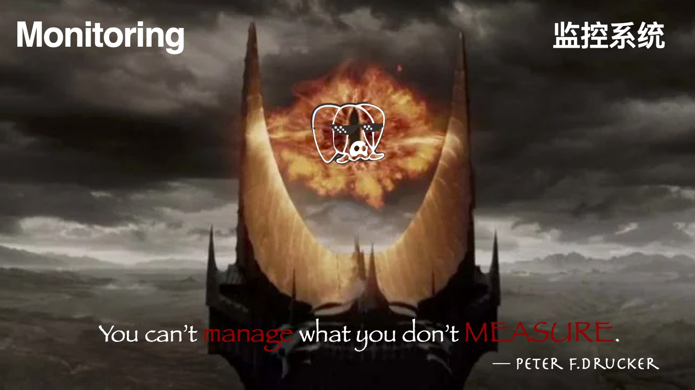
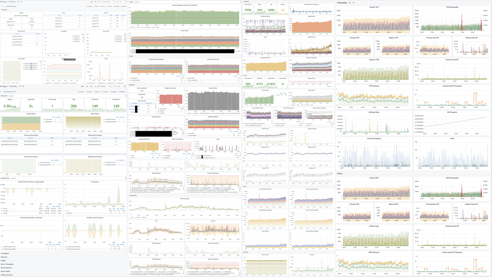
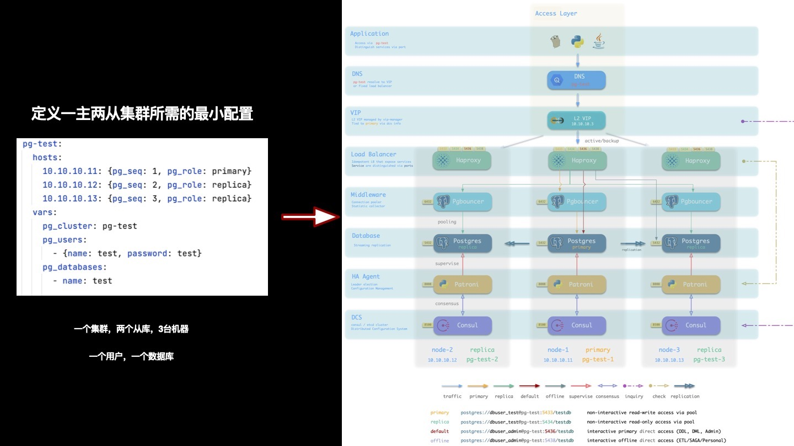
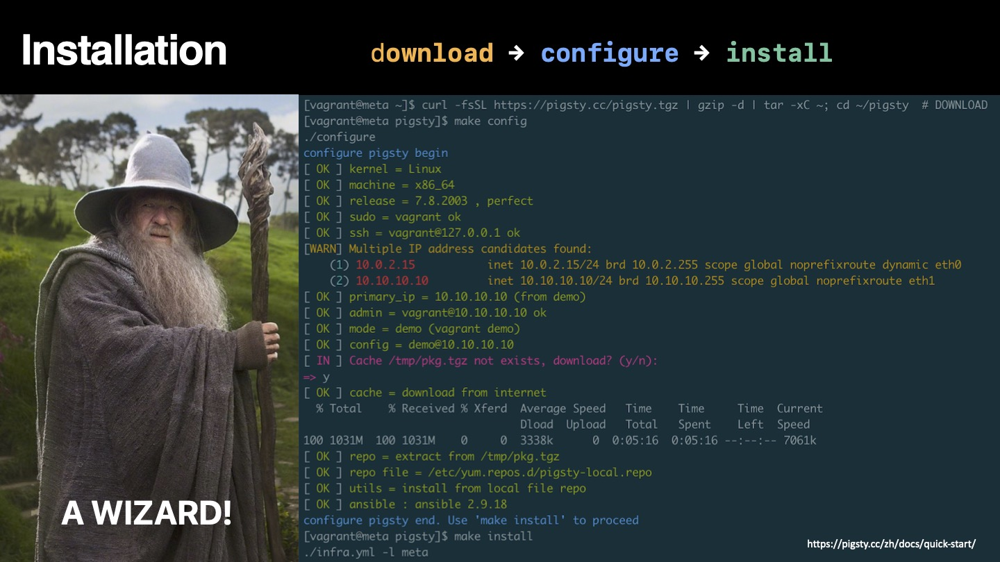
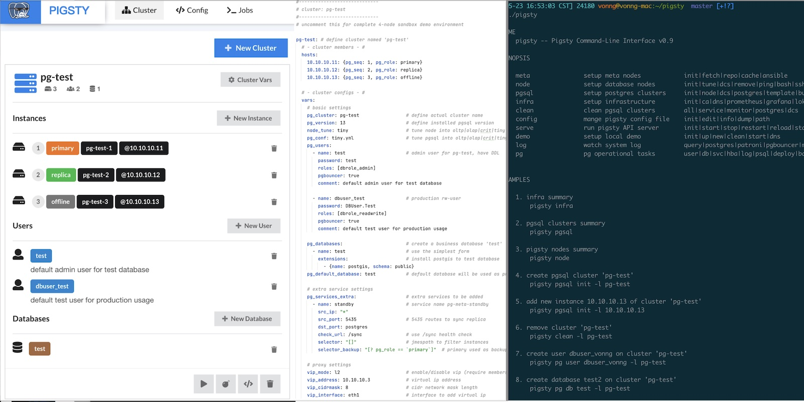
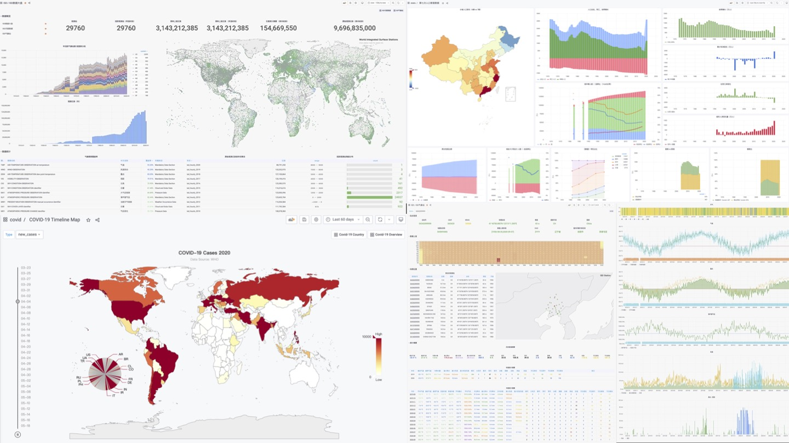
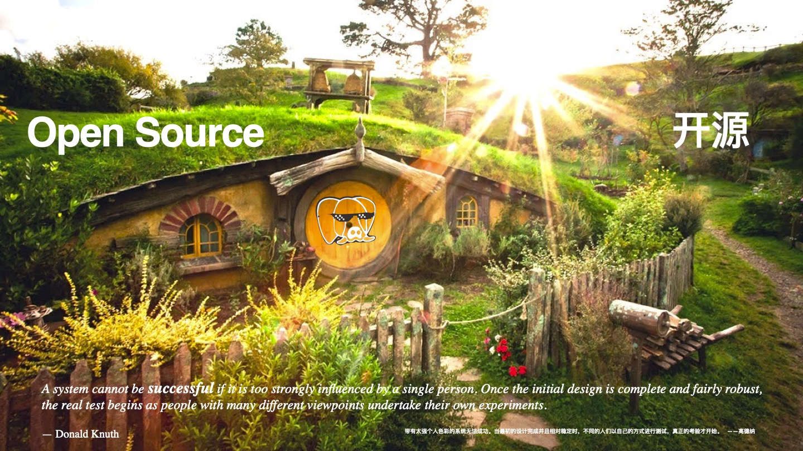

## What is Pigsty

**Pigsty is a ready-to-use production-grade open-source PostgreSQL distribution**.

A **distribution** refers to a complete database solution consisting of a database kernel and its suite of software packages. For example, Linux is an **operating system kernel**, while RedHat, Debian, and SUSE are **operating system distributions** based on this kernel. PostgreSQL is a **database kernel**, while **Pigsty**, BigSQL, Percona, various cloud RDS services, and rebranded databases are **database distributions** based on this kernel.

Pigsty differs from other database distributions with five core features:

* **Comprehensive and professional** **monitoring system** 
* **Stable and reliable** **deployment solution**  
* **Simple and worry-free user interface**
* **Flexible and open** **extension mechanism** 
* **Free and friendly** **open-source license**

These five characteristics make Pigsty truly a **ready-to-use** PostgreSQL distribution.

### Who Would Be Interested?

Pigsty's target user groups include: DBAs, architects, OPS personnel, software vendors, cloud vendors, business developers, kernel developers, data developers; people interested in data analysis and data visualization; students, novice programmers, and users interested in trying databases.

For professional users like DBAs and architects, Pigsty provides a unique **professional-grade** PostgreSQL monitoring system, offering irreplaceable value for database management. Additionally, Pigsty comes with a **stable and reliable**, battle-tested production-grade PostgreSQL deployment solution that can automatically deploy PostgreSQL database clusters with monitoring and alerting, log collection, service discovery, connection pooling, load balancing, VIP, and high availability in production environments.

For developers (business developers, kernel developers, data developers), students, novice programmers, and users interested in trying databases, Pigsty provides an extremely low-barrier, **one-click startup, one-click installation** **local sandbox**. The local sandbox is identical to production environments except for machine specifications, including complete functionality: ready-to-use database instances and monitoring systems. It can be used for learning, development, testing, data analysis, and other scenarios.

Additionally, Pigsty provides a flexible extension mechanism called "Datalet." People interested in data analysis and data visualization might be surprised to find that Pigsty can also serve as an integrated development environment for data analysis and visualization. Pigsty integrates PostgreSQL with common data analysis plugins and comes with Grafana and embedded Echarts support, allowing users to write, test, and distribute data mini-applications (Datalets). Such as: "Additional extension panel packages for Pigsty monitoring system," "Redis monitoring system," "PG log analysis system," "application monitoring," "data directory browser," etc.

Finally, Pigsty adopts the free and friendly Apache License 2.0, which can be used commercially for free. **As long as you comply with Apache 2 License's attribution clauses, cloud vendors and software vendors are welcome to integrate and commercially develop secondary products**.

---------------

## Comprehensive Professional Monitoring System

> You can't manage what you don't measure.
>
> — Peter F.Drucker

Pigsty provides a **professional-grade** monitoring system, offering irreplaceable value to professional users.

Using medical equipment as an analogy, **ordinary monitoring systems** are like heart rate monitors and pulse oximeters that ordinary people can use without training. They can provide core vital sign indicators for patients: at least users can know if someone is about to die, but they're powerless for diagnosis and treatment. For example, monitoring systems provided by various cloud and software vendors generally fall into this category: a dozen core indicators that tell you whether the database is still alive, giving people a rough idea, and that's all.

**Professional-grade** monitoring systems are like CT scanners and MRI machines that can detect all internal details of objects. Professional physicians can quickly locate diseases and hidden dangers based on CT/MRI reports: treat diseases when present, maintain health when absent. Pigsty can deeply examine every table, every index, every query in every database, providing comprehensive metrics (1155 types) and converting them into **insights** through thousands of dashboards: nipping failures in the bud and providing **real-time feedback** for performance optimization.

Pigsty's monitoring system is based on industry best practices, using Prometheus and Grafana as monitoring infrastructure. It's open-source, highly customizable, reusable, portable, with no vendor lock-in. It can integrate with various existing database instances.

---------------

## Stable Reliable Deployment Solution

> *A complex system that works is invariably found to have evolved from a simple system that works.* 
>
> —John Gall, *Systemantics* (1975) 

Databases are software for managing data; management systems are software for managing databases.

Pigsty has a built-in database management solution centered on Ansible. Based on this, it encapsulates command-line tools and graphical interfaces. It integrates core functions in database management: including database cluster creation, destruction, scaling; user, database, and service creation, etc. Pigsty adopts the "Infra as Code" design philosophy, using declarative configuration to describe and customize databases and runtime environments through numerous optional configuration options, and automatically creates required database clusters through idempotent preset playbooks, providing a near-private-cloud user experience.

Database clusters created by Pigsty are **distributed** and **highly available**. Pigsty-created databases achieve high availability based on DCS, Patroni, and Haproxy. Each database instance in a database cluster is **idempotent** in **usage** - any instance can provide complete read-write services through built-in load balancing components, offering a distributed database user experience. Database clusters can automatically perform failure detection and master-slave switching. Ordinary failures can self-heal in seconds to tens of seconds, with read-only traffic unaffected during this period. During failures, as long as any instance in the cluster survives, it can provide complete services externally.

Pigsty's architectural solution has been carefully designed and evaluated, focusing on achieving required functionality with minimal complexity. This solution has been validated in production environments for long periods and large scales, and has been adopted by organizations in multiple industries including internet/B/G/M/F.

---------------

## Simple Worry-Free User Interface

Pigsty aims to lower PostgreSQL's usage barrier, so extensive work has been done on usability.

### Installation Deployment

> *Someone told me that each equation I included in the book would halve the sales.*
>
> — Stephen Hawking

Pigsty deployment consists of three steps: download source code, configure environment, execute installation, all can be completed with one command. It follows the classic software installation pattern and provides a configuration wizard. All you need to prepare is a CentOS7.8 machine and root privileges. When managing new nodes, Pigsty uses Ansible to initiate management via ssh without requiring agent installation, making it easy even for novices to complete deployment.

Pigsty can manage hundreds of high-spec production nodes in production environments, and can also run independently on local 1-core 1GB virtual machines as ready-to-use database instances. When used on local computers, Pigsty provides a **sandbox** based on Vagrant and Virtualbox. It can spin up database environments identical to production with one command, for learning, development, testing, data analysis, data visualization, and other scenarios.

### User Interface

> *Clearly, we must break away from the sequential and not limit the computers. We must state definitions and provide for priorities and descriptions of data. We must state relation‐ ships, not procedures.*                        
>
> —Grace Murray Hopper, *Management and the Computer of the Future* (1962) 

Pigsty incorporates the essence of Kubernetes architectural design, adopting declarative configuration and idempotent operation playbooks. Users only need to describe "what kind of database they want" without caring how Pigsty creates or modifies it. Pigsty will create the required database cluster from bare metal nodes in minutes according to user configuration file manifests.

For management and usage, Pigsty provides different levels of user interfaces to meet different user needs. Novice users can use one-click local sandboxes and graphical user interfaces, while developers can choose to use `pigsty-cli` command-line tools and configuration files for management. Experienced DBAs, operations staff, and architects can directly use Ansible primitives for fine control over executed tasks.

## Flexible Open Extension Mechanism

PostgreSQL's **extensibility** has always been praised, with various extension plugins making PostgreSQL the most advanced open-source relational database. Pigsty also respects this value, providing an extension mechanism called "Datalet" that allows users and developers to further customize Pigsty for "unexpected" use cases, such as: data analysis and visualization.

When we have monitoring systems and management solutions, we also have the ready-to-use visualization platform Grafana and the powerful database PostgreSQL. This combination has tremendous power — especially for data-intensive applications. Users can perform data analysis and data visualization without writing frontend or backend code, creating richly interactive data application prototypes, or even the applications themselves.

Pigsty integrates Echarts and common map base layers, making it easy to implement advanced visualization needs. Compared to traditional scientific computing languages/plotting libraries like Julia, Matlab, and R, the PG + Grafana + Echarts combination allows you to create **shareable**, **deliverable**, **standardized** data applications or visualization works at extremely low cost.

Pigsty's monitoring system itself is an exemplar of Datalet: all Pigsty advanced topic monitoring panels are released as Datalets. Pigsty also comes with some interesting Datalet examples: Redis monitoring system, COVID-19 data analysis, 7th population census data analysis, PG log mining, etc. More ready-to-use Datalets will be added later, continuously expanding Pigsty's functionality and application scenarios.

---------------

## Free Friendly Open Source License

> *Once open source gets good enough, competing with it would be insane.*
>
> Larry Ellison —— Oracle CEO

In the software industry, open source is a major trend. The history of the internet is the history of open-source software. One core reason the IT industry has today's prosperity and people can enjoy so many free information services is open-source software. Open source is a truly successful form of communism by developers (translating as **community-ism** would be more appropriate): software, the core means of production in the IT industry, becomes publicly owned by developers worldwide — everyone for me, me for everyone.

When an open-source programmer works, their labor might actually contain the crystallized wisdom of tens of thousands of top developers. Through open source, all community developers form a united force, greatly reducing the internal friction of reinventing wheels and allowing the entire industry's technical level to advance at an unimaginable speed. Open source's momentum is like a snowball that has become unstoppable today. Except for some special scenarios and path dependencies, doing closed-door development for self-reliance in software development has become a big joke.

Relying on open source, giving back to open source. Pigsty adopts the friendly Apache License 2.0, which **can be used commercially for free**. **As long as you comply with Apache 2 License's attribution clauses, cloud vendors and software vendors are welcome to integrate and develop secondary commercial products**.

---------------

## About Pigsty

> *A system cannot be successful if it is too strongly influenced by a single person. Once the initial design is complete and fairly robust, the real test begins as people with many different viewpoints undertake their own experiments*. 
> — Donald Knuth 

Pigsty is built around the open-source database PostgreSQL. PostgreSQL is the world's **most advanced open-source relational database**, and Pigsty's goal is to be the **best open-source PostgreSQL distribution**.

Initially, Pigsty didn't have such grand goals. Because I couldn't find any monitoring system on the market that met my needs, I had to roll up my sleeves and make one myself. Unexpectedly, it worked exceptionally well, and quite a few external organizations and PG users hoped to use it. Subsequently, deployment and delivery of the monitoring system became a problem, so the database deployment management part was added; after production environment application, developers wanted local sandbox environments for testing, so local sandboxes were added; users complained that ansible wasn't user-friendly, so the `pigsty-cli` command-line tool wrapper was created; users wanted to edit configuration files through UI, so Pigsty GUI was born. Like this, needs grew and features became richer, Pigsty became more complete through long-term polishing, far exceeding initial expectations.

Doing this is itself a challenge — making a distribution is somewhat like making a RedHat, making a SUSE, making an "RDS product." Usually only professional companies and teams of a certain scale would attempt this. But I just wanted to try: is it possible for one person? Actually, besides being slower, there's nothing impossible. Switching between product manager, developer, and end-user roles is a very interesting experience, and the biggest benefit of "eating dog food" is that you're both developer and user — you know what you need and won't slack off on your own requirements.

However, as Knuth said: "A system with too strong a personal touch cannot succeed." To make Pigsty a project with vigorous vitality, it must be open-sourced and used by more people. "When the initial design is complete and stable enough, the real challenge begins when various users use it in their own ways."

Pigsty has solved my own problems and needs very well. Now I hope it can help more people and make PostgreSQL's ecosystem more prosperous and colorful.
