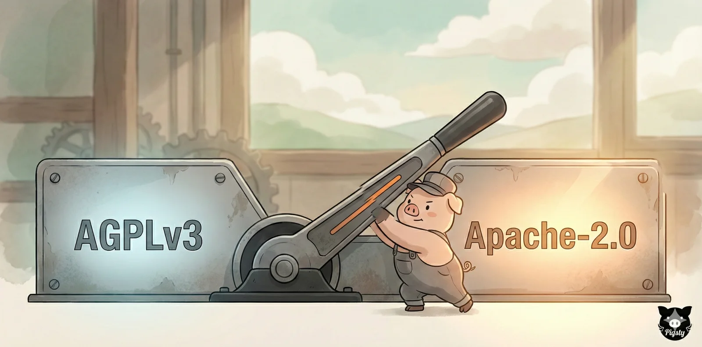
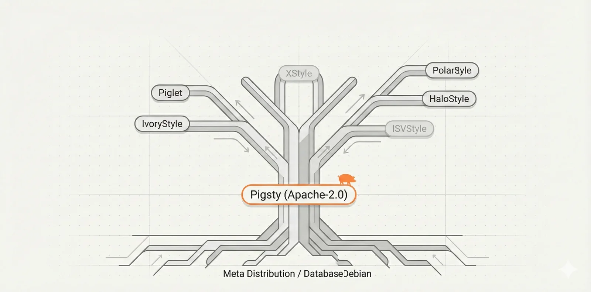

[Pigsty](https://pigsty.io) is a batteries-included, local-first PostgreSQL distribution. With the v4.0 release, I finally did something I'd been considering for a while: switching from AGPLv3 back to Apache 2.0.

Here's why I changed it, what it means, and my take on open source, ecosystems, and commercialization.

--------

## The Origin Story

Pigsty started with Apache 2.0.

The reasoning was simple: I built something useful, open-sourced it so others could benefit, and hoped to push PostgreSQL practices forward. Apache felt natural — permissive, no strings attached.

Then came v2.0, and I switched to AGPLv3. The surface reason: some well-known projects had moved to AGPL, and I thought Pigsty might have "caught" their license through dependency. After more research, I realized that wasn't actually true — I wasn't linking to them as libraries.

The real reason: I'd started a company. Commercial responsibility meant thinking about protecting commercial interests. So I picked one of the most restrictive open-source licenses available.

We added explicit disclaimers: we wouldn't pursue regular users; enforcement would effectively match Apache 2.0; AGPL was just "keeping our options open against extreme cloud vendor freeloading."

In practice? That option delivered none of the protection I wanted — only adoption friction.

Fast forward to today: the company has been wound down, and I'm back to being a solo developer again.
Ironically, with steady consulting revenue, I can now afford to treat Pigsty as what it started as — a public good.

--------

## AGPL in Practice

The first problem is straightforward: AGPL triggers immediate legal red flags at most companies. Default policy is "don't touch" — unclear risk, slow approvals, high compliance cost.

You can explain "we won't pursue regular users" or "it doesn't propagate in this case." Often doesn't matter. Policy is policy.

I've had this conversation with engineers at multiple large tech companies. The pattern is consistent: I'd suggest self-hosting Postgres with Pigsty. Response? "We'd love to evaluate it, but AGPL is a non-starter. Legal won't even look at it."

After enough of these conversations, you realize: AGPL creates adoption barriers — not technical ones, but *process* barriers. And process barriers are often harder to break through than technical ones.

The second problem: AGPL may not actually prevent the freeloading you're worried about.

Real example: a solutions architect at a major cloud vendor deploys Pigsty on cloud infrastructure for their customer. Issues come up, they pay me for support. The vendor delivered successfully using Pigsty.

Legally? AGPL has limited teeth here. This consulting/professional-services model doesn't trigger AGPL's network clause — the code isn't offered as SaaS. It's not the scenario AGPL was designed for.

In practice, AGPL often scares away legitimate users without blocking the scenarios you actually worried about. The data backs this up: after switching to AGPL, Pigsty's adoption growth visibly slowed — exponential became linear.

Martin Kleppmann (author of *DDIA*) [made a similar point](https://martin.kleppmann.com/2021/04/14/goodbye-gpl.html) years ago: GPL/AGPL don't solve cloud-era value distribution. If you want to restrict cloud vendors, you need source-available licenses (ELv2, SSPL, BSL) or product strategy (local-first, ecosystem lock-in) — not GPL hoping to deliver justice.

**AGPL ended up being neither open-source-friendly enough nor effective against cloud. Worst of both worlds.**

--------

## Why Not ELv2 / SSPL / BSL?

Natural follow-up: if AGPL doesn't work, why not ELv2? It's basically Apache for normal users but explicitly restricts cloud vendors.

I considered it seriously. Pigsty is approaching "finished software" status — I don't need PRs, and with tools like Claude, I can ship features fast. Community value for me isn't code contributions; it's:

- Real-world feedback and edge case discovery
- Reusable templates and best practices
- Case studies, word-of-mouth, ecosystem connections

So: do I actually need an OSI-approved license?

In the end, I didn't go with ELv2. One reason: **that's not what I want to build.**

I want Pigsty to become the Debian of databases.

Debian didn't win by restricting users. It won through openness, reusability, distributability — eventually becoming the default upstream, the standard, the infrastructure.

-------

## The Debian of Databases

As I discussed in "[Forging a PostgreSQL Distribution](/en/pg/forge-a-pg-distro)": Pigsty's goal is to become the Debian of the PostgreSQL world — globally useful, freely distributable, endlessly customizable.

My read: the next two years are a window of significant change. AI, agents, infrastructure shifts — these will reshuffle who becomes the default choice.

PostgreSQL is already the Linux kernel of databases. The distribution wars are just beginning. These windows don't open often. Pigsty has a seat at the table, and I'm not sitting this one out.

To win this, you don't wield licenses as weapons. You win by:

- Keeping users happy and productive
- Letting vendors integrate and redistribute
- Giving ISVs paths to profit
- Creating value for DEV, OPS, and DBA

For this to work, **a permissive license is almost mandatory.** It signals intent: welcome to use, integrate, distribute, fork.

Put bluntly: **freeloaders welcome.**

One line I do draw: **ship it, sell it, build on it — all fine. Just don't claim you wrote it from scratch.**

-------

## On Freeloading

People ask: everyone's moving toward source-available and restrictive licenses. Why go back to Apache? Aren't you worried about freeloading?

My view is simple: if you're worried about freeloading and want to monetize via licensing, don't open-source — sell commercial software. If you choose true open source, accept the reality: it will be used, integrated, redistributed. Treat it as a gift. As Linus put it — *Just for Fun*.

Sure, I'm not thrilled when cloud vendors rebrand open-source projects to upsell compute. But that playbook doesn't work well on Pigsty — it's not a library they can wrap. It *is* the database platform, competing directly with their managed offerings.

Major cloud vendors already have their own managed Postgres, deeply integrated with their infrastructure. Rebranding Pigsty as their RDS would mean competing with themselves.

When I say "get off the cloud," I mean managed database PaaS. Self-hosting on cloud VMs is fine. IaaS works — the main issue is EBS-style network storage being mediocre for databases. NVMe instance storage exists; use it if it fits.

For vendors who want to offer self-hosted Postgres deployment as a service: you're welcome here. Growing the ecosystem beats playing license cop.

-------

## From Distribution to Meta-Distribution

A permissive license also enables Pigsty's evolution from "a PG distribution" to a **meta-distribution**.

From day one, Pigsty was designed to be fully customizable. It provides a complete toolbox plus the largest binary extension repository in the PostgreSQL ecosystem. You can build your own distribution on top — like how countless Linux variants grew from Debian and Red Hat.

Example: [PIGLET.RUN](https://piglet.run), a project I'm working on, adds a vibe-coding toolbox to Pigsty's single-node template — spin up Claude Code, VS Code, and full-stack services with one click. That's a first-party Pigsty sub-distribution.

You can swap kernels — use your own Postgres fork. If you've built extensions or tools, package them in. For PG kernel vendors, this is compelling: a bare RPM becomes "HA, backup, monitoring, IaC, offline delivery" out of the box. Order-of-magnitude value increase.

We've supported custom kernels since v3. Spin up Supabase, OrioleDB, PolarDB, IvorySQL, or others with one click. Each could be its own sub-distribution.

For meta-distribution to work, the license must be permissive. Otherwise you're saying "welcome to distribute" while writing "distribution triggers obligations." Ecosystems don't grow that way.

Long-term, I'd like Pigsty to develop proper governance — maybe even a committee structure like Debian. Ambitious, but that's what makes it interesting.

-------

## Timing: Finished Software

Why switch at v4.0? Because v4.0 is a milestone — it's reached "finished software" status.

I ran comparative evaluations against major cloud database offerings. Short version: we're playing in the same league. Except we're free.

> RDS PG Evaluation: [Claude](https://claude.ai/public/artifacts/9535eaad-817d-4749-91c5-1b21b2534b3e) | [ChatGPT](https://chatgpt.com/s/dr_697b2d26bffc819182ffff844f2d42d91b21b2534b3e)

That's roughly where I want it to stay. Push too far past parity and you cannibalize your own consulting business — I'm selling the delta from "works great" to "bulletproof in production."

ISVs and independent DBAs building commercial services on Pigsty: welcome. The market is massive. You serve your customers, I provide upstream support. Handle what you can, escalate when you can't. That's how ecosystems work.

--------

## Business Model

People often ask, How do you make money with it?

The model I admire: VictoriaMetrics. One developer built a monitoring system that dominates on performance in the observability area.
Started a company for enterprise support, kept some modules enterprise-only. No fundraising, no pressure, sustainable. Pigsty follows a similar path.

Pigsty has a commercial edition — same codebase, but supports more operating systems and legacy PG versions. Includes CLI tooling, DBA agent, SOPs, and a non-open-source test suite with failure scenarios — similar to SQLite's approach.

But the commercial edition isn't the point. Enterprises don't pay for what you've open-sourced — they pay for delivered value: 
taking production from "works well" to "bulletproof" That includes warranties, SLAs, troubleshooting, and operational know-how from running Postgres at scale 
— things that won't appear in AI training dataset. So I'm not selling the product — that's free. **Pigsty is free; while the consulting isn't.**

AI Agent has been a force multiplier. Most of my time now goes to asking the right questions and validating outputs. Scales quiet well.

If you're using Pigsty and find value in what I'm building, subscriptions are welcome. You get commercial guarantees; I get to keep building.

--------

## On Relicensing: Doing It Right

Relicensing deserves its own discussion.

My view: permissive-to-restrictive is ethically problematic — textbook bait-and-switch. Contributors signed up under one set of expectations; you're retroactively changing the deal.

Restrictive-to-permissive is fundamentally different. You're giving *more* freedom to everyone, including past contributors.

That said, I wanted to do this cleanly. I reached out to contributors for explicit consent. Not everyone responded — and I won't assume consent.
So I rewrote all code from non-responding contributors. In a ~150k lines codebase, this was roughly 500 lines, not much.

Was this strictly necessary? Legally, probably not — going permissive doesn't require unanimous consent like going restrictive would.
But I'd rather over-comply than leave gray areas. Practice what you preach.

--------

## Conclusion

Going from AGPL to Apache 2.0 isn't going soft. It's not naive.

It's strategic: **Pigsty aims to be the Debian of databases.** Openness and inclusivity aren't slogans — they're engineering requirements. Reduce friction, expand distribution, build ecosystem.

Pigsty v4.0 is out. I hope it helps more people to enjoy PostgreSQL
