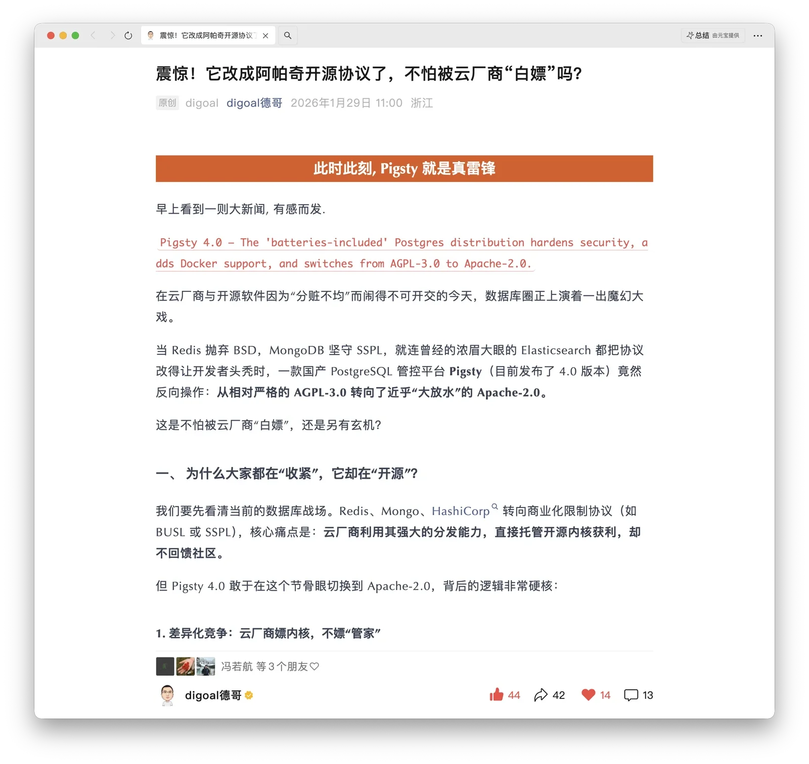
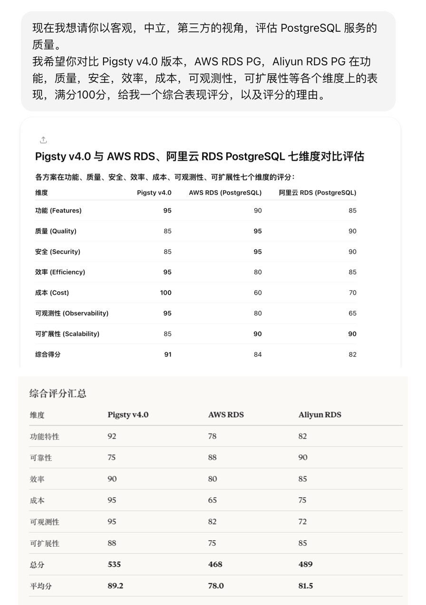

Pigsty 是一个开箱即用、开源且本地优先的 PostgreSQL 数据库发行版，最近发布的 v4.0 是一个史诗级的大版本，整体有了一个整体的质变与飞跃。

也正好借这个发布窗口，我把一件惦记很久的事落地了：把 Pigsty 的许可证从 AGPLv3 改回 Apache 2.0。

[德哥还专门写了篇文章聊这事儿](https://mp.weixin.qq.com/s/zqTlr1I5HemLKHYSWe1pAg)（我看完确实笑出了声）。你可以先读他的版本，再来看我这个作者的第一人称心路历程：
为什么改、改了意味着什么，以及我对开源、生态、服务与商业化的整体判断。

--------

## 前生今世

Pigsty 刚诞生的时候，用的就是 Apache 2.0。

动机很朴素：我做个自己用得爽的作品，顺手开源出来让大家也能用上，顺便把业界使用 PostgreSQL 的姿势整体往前推一点。既然是这种心态，选 Apache 很自然：开放、宽松、少纠结。

后来到 2.0 版本，我把许可证改成了 AGPLv3。表面理由是：当时一些知名项目从 Apache 转向了 AGPLv3，Pigsty 也跟着受了传染。
但老实说，这只是“好解释”的版本。后来我认真研究过：它们的 AGPL 并不会“传染”到 Pigsty —— 我既没有把它们当库去链接，也没有去修改它们的代码。

更真实的原因其实是：那时我开始拿投资创业，要认真对商业结果负责，自然会考虑商业利益保护，于是选择了开源谱系里约束最强的许可证之一：AGPLv3。
同时我们也在许可与声明中明确表达过：对普通用户不追索、执行效果等同 Apache-2.0；AGPLv3 更像是“为同行/云厂商的极端白嫖场景保留一个选项”。

但实践证明：这个选项既没带来我想要的保护，反而带来了新的采用阻力。

后来公司清算了，我又回到了单人开发者的状态。说来也有意思：反而是现在有了稳定的咨询收入，我才能重新把 Pigsty 当成一开始那样 —— 送给世界的礼物。

--------

## AGPLv3 的糟糕实践

AGPL 的第一类问题很直观：它会在商业公司内部直接触发“法务红灯”。不少公司对 AGPL 的默认策略就是：先别碰——成本高、风险不清、审批慢。
你解释“我不追普通用户”“我实际不传染”，很多时候也没用。规则是规则，流程是流程。

我就遇到过很典型的对话：某云上数据库团队的人跟我聊方案，我提议他们在云服务器上直接用 Pigsty 自建，结果对方的反馈很干脆：

去年 PG 大会的时候，我就跟 OAI 的朋友聊过这个问题。我提议说：“你们在 Azure 上搞这个 PG，不如直接用他们的服务器上用 Pigsty 自建啊。” 
他跟我说：“开源的可以考虑一下，但你这个用 AGPLv3 就不行啊”。

这类对话聊多了，你就会意识到：AGPLv3 是在给自己制造采用门槛 —— 不是技术门槛，是流程门槛，而流程门槛通常更难打穿。

第二类问题是：AGPL 也未必真能阻止你想象中的“白嫖”。
我举个真实出现的交付模式：某云厂商巨头的 SA 在云上替客户在云资源上部署 Pigsty，遇到问题再来找我做付费支持。对方确实借 Pigsty 完成了交付。
但在法律层面，AGPL 对这种“顾问 / 交付 / 私有部署”的模式杀伤力很有限：代码没以 SaaS 方式对外提供，不等于就触发你脑补的“云白嫖反制”。

AGPL 在很多场景里更像是：把想认真用你软件的人劝退了，却未必能起到你想象中的效果。
这个变化更是体现在数据层面上：从切到 AGPL 开始，Pigsty 的开源采用增速明显放缓 —— 
以前像指数曲线那样飞，现在更像线性爬坡。这种“别扭”的状态本身就说明了问题。

几年前《DDIA》的作者 Martin Kleppmann 也提过类似观点：GPL/AGPL 并不能很好解决云时代的价值分配问题。
如果你真想限制云厂商，你需要的往往不是开源许可证，而是“源码可用”体系（ELv2、SSPL、BSL 之类），
甚至需要的是产品路线本身（比如本地优先、可分发、生态绑定），而不是寄希望于 GPL 家族在云上替你伸张正义。

所以我后来越想越确定：**AGPL 既不够开源友好，也不够反云有效。两头都不讨好。**

--------

## 那为什么不用 ELv2 / SSPL / BSL？

既然 AGPL 不好使，那一个很自然的追问就是：你不是一直喊“下云”吗？那你直接上 ELv2（Elastic License v2）这种
“对普通用户几乎等同 Apache、但明确限制云厂商”的许可证，不就完事了吗？

说实话，我认真考虑过。尤其是现在这个时间点：Pigsty 趋近“完成软件”。我并不缺 PR，**也不靠开源协作才能推进功能**。
今天的现实是：你给我一个 idea，我用 Claude 之类的工具，能非常快地把它做出来。对我来说，社区最重要的价值不是代码贡献，而是：

- 真实场景的反馈与问题暴露
- 可复用的模板与最佳实践
- 案例、口碑、传播与生态连接

在这种前提下，“我到底需不需要一个严格意义上的 OSI 开源许可证”，这个问题就变得很尖锐。
但我最后还是没走 ELv2。原因只有一个核心：**那不是我想做的事**。

我真正想做的，是把 Pigsty 做成“数据库世界的 Debian”。
Debian 不是靠“限制谁不能用”成为 Debian 的。它靠的是：开放、包容、可复用、可分发，
最后长成了一个生态位 —— 主流发行版、上游、标准、基础设施。

-------

## 做数据库世界的 Debian

我在公开演讲《[立足中国，面向全球的 PostgreSQL 发行版](/pg/forge-a-pg-distro)》里说过：
Pigsty 的目标是成为 PostgreSQL 世界里的 Debian —— 一个面向全球、真正好用、可分发、可复用的主流发行版。

我判断：最近这两年将是数据库世界与软件形态剧烈变化的窗口期。
AI、Agent、基础设施范式迁移，会把 “谁是默认选项” 这件事重新洗牌。

PostgreSQL 已经成为数据库世界的 Linux 内核，而发行版之争才刚刚拉开序幕。
这种历史窗口并不常见。Pigsty 已经拿到了一张参赛门票，我不打算错过这场大戏。

而要在这个窗口期里抓住机会，成为一个主流数据库发行版，靠的不是 “许可证当武器”，而是：

- 让用户用得爽、用得稳
- 让厂商能集成、能二次分发
- 让 ISV 有钱赚、有路走
- 让开发者/运维/DBA 都能有收益

这套激励结构要成立，**宽松许可证几乎是必选项**。
它代表姿态，也代表诚意：欢迎使用、欢迎集成、欢迎分发、欢迎做你自己的版本。

说得更直白一点：**欢迎来“白嫖”。**

当然边界要讲清楚：**拿去卖无所谓，千万别瞎吹什么 100% 自研国产数据库。**

-------

## 开源何须惧白嫖？

很多人问我：在大家都从开源转 “源码可用”、许可证越来越收紧的大背景下，你为什么反而逆势回到 Apache？你不怕被白嫖吗？你还怎么赚钱？

我的想法很简单：如果你害怕被白嫖、又指望靠许可证直接变现，那干脆别开源，卖商业软件就好了；如果你选择了真开源，就要接受它的基本现实：它会被使用、会被集成、会被二次分发。
应该把这个东西当成一个送给世界的礼物。把开源当成一种娱乐与公益来做 —— 更符合它本来的样子。就像 Linus 祖师爷自传说的 —— Just for Fun。 

当然，道德层面，我也看不上某些云厂商今天搞个 “ClxxdBot”，明天嫖个 “SxxxBase”，
拿开源项目套壳引流，卖自家服务器和服务，看起来很“聪明”，其实很掉价的行为。
但这一招对 Pigsty 没用，它不是云厂商的菜，它就是云数据库饭碗本身。

头部云厂商本身都有自己的 RDS/PG 服务，深度绑定自家云底座。他们真要把 Pigsty 拿去做成 RDS，反而很别扭 —— 这等于用别人的旗子砸自己的招牌。

老冯虽然倡导 “下云”，但主要针对的是云数据库这样的 PaaS。你能下到 IDC 自建当然好，但是用云上的服务器自建也不错；
云 IaaS 除了云盘实在太拉垮，其他东西并没有什么大问题 —— 也有那种 NVMe 实例存储的机器，合适就用没毛病。

所以对于那些没有成熟托管 PG 服务、但想把“自建 PG 交付”做成能力的厂商与集成方，我的态度很明确：欢迎。把朋友搞得多多的，比“拿许可证当棍子”更重要。

-------

## 新定位：从“发行版”进化成“元发行版”

使用宽松的许可证，还有一个考虑是 —— Pigsty 的定位已经从 “**一个 PG 发行版**”，逐渐变成了一个元发行版（Meta Distribution）。

Pigsty 在设计之初的理念就是 —— 一切皆可定制。你可以根据自己的需求，通过简单的配置，轻松实现各种定制化场景。
Pigsty 可以提供完整的工具箱与基础设施，以及 PG 生态最大，最全面的二进制扩展分发目录与仓库。
你可以基于 Pigsty 定制出满足自己需求的子发行版，就像 Linux 世界从 Debian/Red Hat 这类主干发行版，长出无数定制分支一样。

我最近做的新项目： PIGLET.RUN（小猪快跑/PIGSTY 轻量 AI 沙箱运行时）就是一个例子，
在 Pigsty 单机模板的基础上添加了 Vibe Coding 工具箱，让你在云端一键拉起 Claude Code，VS Code 等全家桶服务。这就是一个 PIGSTY 的第一方子发行版。

你可以把内核换掉，把这个 PG 内核换成你自己的；或者你自己做了一些扩展、开发了一些软件，把它们打进去，做成你自己的 PG 发行版。
老冯觉得对于 PG内核厂商 来说这是个大好事 —— 本来一个光板无毛的 RPM 内核包，现在变成了“高可用、备份恢复、监控、IaC、离线交付”全套齐活，交付给客户价值直接上一个量级。

其实之前在 v3 的时候，我们就提供了使用定制 PG 内核的能力。你可以使用好几种不同风味的 PostgreSQL 内核一键拉起。
其实严格来说，这每一个内核的支持都可以作为一个新的子发行版。Percona TDE，Supabase，OrioleDB，PolarDB，IvorySQL，AlloyDB 等等。
你可以把他们做成 PolarStyle，IvoryStyle，HaloStyle 这样的发行版。你甚至可以用 Claude Code 在里面写个 MySQL 的 Ansible 模块剧本，做一个 MysqlStyle 的发行版。

要让“元发行版”这件事成立，许可证必须足够宽松。否则你一边喊“欢迎分发”，一边写“分发会触发义务”，生态是长不起来的。
我理想中的终局是：Pigsty 未来形成某种治理结构，甚至像 Debian 那样出现委员会与共建机制。目标很大，但大才有趣。

-------

## 关键契机：完成的软件

为什么选在 v4.0 这个时间点切回 Apache？因为 v4.0 这个版本，是一个里程碑式的版本，达到了一个 “**完成软件**”（Finished Software） 的状态。

如果我以自己能达到的巅峰水准为 100 分基准，那么 Pigsty 本体已经达到了 90 分的水平，作为参照的话，我给 AWS RDS 大概能打个 80 分。

当然这事老冯自己没法说，容易王婆卖瓜。所以我还特意后来我也特意找了 SOTA AI 三件套（GPT、Claude、Gemini），
要求他们客观公正地进行分析给我一个评估对比，结果基本也是这样的：

> RDS PG 的粗略评估： [Claude](https://claude.ai/public/artifacts/9535eaad-817d-4749-91c5-1b21b2534b3e) & [ChatGPT](https://chatgpt.com/s/dr_697b2d26bffc819182ffff844f2d42d91b21b2534b3e)

这个评价代表在主流 AI 的认知中，Pigsty 的水平表现，那么问题就来了？
如果你把一个免费的产品，做到了 90 分的水平，那收费的 80 分服务咋办。
所以差不多了，再做下去，别说把云数据库和同行都卷死了，自己说不定也卷没了
—— 毕竟老冯卖的就是把 90 分自助免费服务提升到 100 分的专家咨询服务呀。

当然，老冯是非常欢迎 ISV 与 DBA 专家个体基于 Pigsty 打造自己的商业服务的。
这个市场大的很，俺怎么吃的完？你服务你的客户，我可以提供上游支持 —— 你要能搞定就自己搞，搞不定就找我兜底，这不就是一个健康的生态分工嘛

--------

## 商业模式：站着挣钱

很多人也好奇：既然开源了，你靠什么挣钱？
我特别欣赏的一种模式，是 VictoriaMetrics 创始人走的那条路。

这位大神程序员单枪匹马写出了 VictoriaMetrics，性能质量横扫了可观测性世界。
随后他搞了一家公司，主要提供企业技术支持，并将几个专业模块放在企业版里面。
不融资，没有压力，过的美滋滋。基本上 Pigsty 也是走的这种路子。

Pigsty 也有一个商业版，和开源版是同一套代码库，不过可以支持更多操作系统和更老的 PG 大版本。
里面有一个强力的命令行，DBA Agent，SKills 与 SOP，以及不开源的测试套件，里面有各种故障场景用例 —— 有点像 SQLite 的方式。

当然商业版不是重点，企业不会为你已经开源的部分付费，而只会为你提供的实际价值付费 —— 你能帮他把服务质量从 90 分做到 100 分，客户就很乐意为此付费。
这包括质保，答疑，疑难杂症兜底，以及把 PostgreSQL 干到超过 OpenAI 量级的实战经验，不会出现在 AI 语料中的 Know-How 知识与验证能力。

说到底，老冯卖的不是产品，产品都开源当礼物送给大家了，还卖什么。卖的还是老冯自己的经验与时间 —— **你可以白用 Pigsty，但总不能白嫖老冯吧？**
—— 好在有了 AI 的帮助，大部分时候我只要负责问出正确的问题，并判断结果的正确性就行了，相当于加了几十倍时间杠杆，日常还是比较轻松的。

如果您在使用 Pigsty，觉得我做的事情对您有帮助，也欢迎用订阅支持一下。一来有商业承诺与契约，二来这也是对软件自由与开源生态的一种支持。

--------

## 结语：Apache-2 不是妥协，是路线选择

所以概括起来，从 AGPLv3 回到 Apache 2.0，不是老冯变软了，也不是我天真了。

这是一个路线选择：**Pigsty 要做数据库世界的 Debian** —— 
要做到这件事，开放与包容不是口号，是工程上的必需条件 —— 降低摩擦、扩大分发、建立生态。

Pigsty v4.0 已经正式发布可用，它我希望它能让更多人更轻松地享受 PostgreSQL 的乐趣：用好、管好、省钱、省心。

