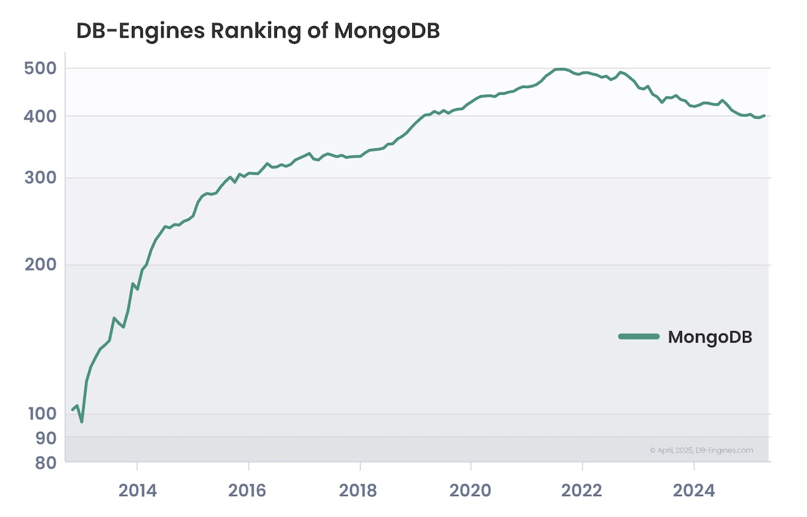
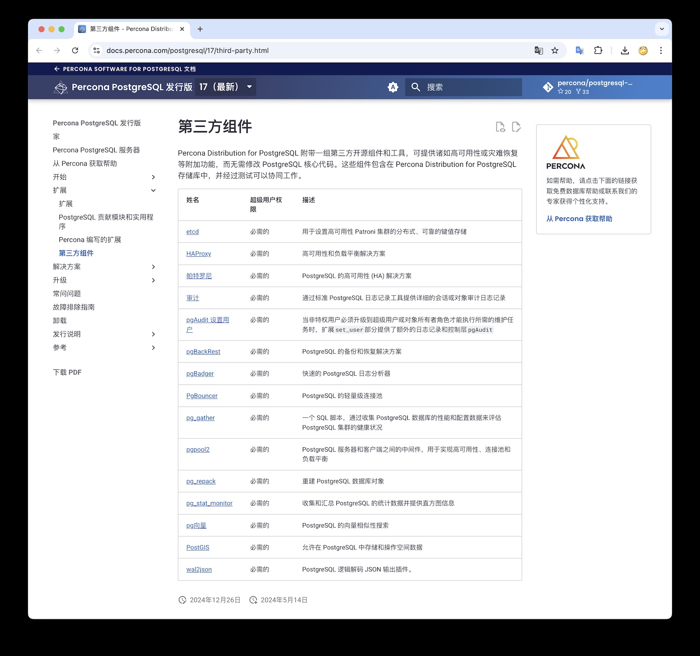
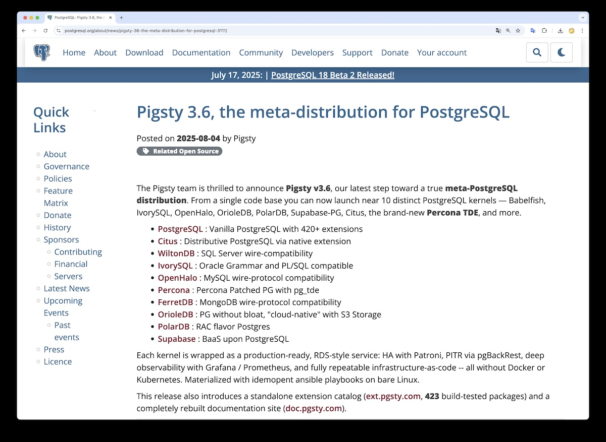

Percona is a banner-bearer and major third-party vendor in the MySQL ecosystem, and has been advancing into the PostgreSQL space in recent years. The English original of this article was published on the Percona blog this morning.
Of course, Percona is mainly trying to advertise itself, but that's fine - this issue genuinely exists. So I'm translating and commenting on this article to discuss this problem with everyone.

> [The growing dominance of PostgreSQL and the emergence of propriety solutions](https://experience.percona.com/postgresql/postgresql-market-in-2025/the-growing-dominance-of-postgresql-and-the-emergence-of-proprietary-solutions)


## PostgreSQL's Growing Dominance and the Emergence of Proprietary Solutions

As of 2025, PostgreSQL holds a 16.85% market share in the relational database market, making it the second-largest open-source database after MySQL. It has become the database of choice for major data-intensive institutions like Instagram, Reddit, Spotify, and even NASA. Currently, approximately 11.9% of companies with annual revenues exceeding $200 million use PostgreSQL in production.

Under this new trend, both new and established database vendors naturally want to benefit. While the specific growth in proprietary PostgreSQL products compared to five years ago is difficult to quantify precisely, several indicators suggest a significant increase in PostgreSQL-based proprietary solutions from both established vendors and startups:

1. **Cloud Provider Adoption**: Major cloud providers like AWS, Google Cloud, and Azure now offer PostgreSQL managed services with proprietary features and integrations, which were uncommon five years ago.
2. **Enterprise Solutions**: The number of commercial PostgreSQL products has grown significantly in recent years, with multiple vendors (including EDB) reporting strong demand for enterprise-grade support, tools, and managed services.
3. **Startup Innovation**: New companies like Neon, Supabase, ParadeDB, PostgresML, and Tembo have emerged, offering innovative proprietary solutions built on PostgreSQL.
4. **Microsoft DocumentDB**: Microsoft is launching DocumentDB — an open-source NoSQL database built on PostgreSQL with MongoDB protocol compatibility.

More importantly, this trend shows no signs of slowing. PostgreSQL provides excellent support for various advanced data types popular today — such as vectors for AI/ML workloads, JSONB for semi-structured data, time-series functionality through Timescale, and PostGIS extensions for geospatial data.
These capabilities make PostgreSQL an ideal choice for organizations building next-generation analytics, AI, and big data solutions. Increasingly, enterprises use PostgreSQL not only as their primary operational database (OLTP) but also as the cornerstone of complex analytics and AI systems.


From an industry distribution perspective, PostgreSQL users span almost all sectors — information technology services, computer software, internet, financial services, marketing & advertising, telecommunications, human resources, healthcare, retail, and higher education all widely adopt PostgreSQL (data source: [Enlyft](https://enlyft.com/tech/products/postgresql)).

## Proprietary Isn't Necessarily Bad... At Least for Now

As of 2025, various proprietary PostgreSQL products strive to provide more powerful features, enterprise-grade characteristics, and commercial support on top of the open-source core, making them more attractive for mission-critical workloads.
For organizations lacking internal expertise to manage and scale open-source PostgreSQL, adopting proprietary solutions can be a reasonable and understandable choice.

However, IT executives shouldn't focus only on immediate convenience but should consider where this trend is heading. More and more companies that started as open-source are seeking to transition to closed-source models for further monetization.
For example, Redis recently changed its license to Redis Source Available License (RSALv2) and Server Side Public License (SSPLv1), restricting code usage. In 2023, HashiCorp took similar action, changing most of its projects from Mozilla Public License 2.0 to the more restrictive Business Source License (BSL).

> Author's note: And the fresh case of [KubeSphere Supply Cut Rugpull](/cloud/kubesphere-rugpull/)


## Can MongoDB Tell Us Where PostgreSQL Is Heading?

Looking at MongoDB might provide some insights. MongoDB was once hailed as an open-source alternative to relational databases, just like PostgreSQL today, but its development trajectory clearly turned toward proprietary solutions.
MongoDB Inc. fully invested in Database-as-a-Service (DBaaS), building a highly closed ecosystem around its Atlas cloud database service.
This affected community contributions and third-party services, while licensing changes — such as adopting the SSPL license — effectively made MongoDB closed-source in many scenarios.

MongoDB's path toward stricter licensing models and vendor-controlled cloud platforms mirrors Oracle's trajectory. Investor demands for sustained revenue growth led MongoDB to adopt strategies that further strengthened customer lock-in, increased licensing fees, and forced enterprises to sign costly long-term contracts.
MongoDB, once an open-source champion, now resembles Oracle more than open source. Undoubtedly, the shift to closed-source models is a key reason for MongoDB's declining enterprise user adoption.



> Author's note: [In the StackOverflow 2025 Survey, MongoDB became the year's biggest loser](/pg/so2025-pg/)

Today, discussions about MongoDB mostly focus on how to migrate away from this enterprise platform rather than continuing to adopt it.
One of the most telling examples is a blog post published by Infisical in December 2024 (Infisical is a "one-stop platform for securely managing application secrets, certificates, SSH keys, and configurations") titled "[The Great Migration from MongoDB to PostgreSQL](https://infisical.com/blog/postgresql-migration-technical)."
The post explains that while MongoDB performed well during their startup phase, as they grew, they and their customers **"encountered MongoDB's limitations in functionality and usability."** 
The article also mentions that switching the database to open-source PostgreSQL reduced database costs by 50%.

This is undoubtedly a cautionary tale for organizations adopting proprietary PostgreSQL solutions.
While PostgreSQL itself remains fully open-source and isn't controlled by a single vendor, its surrounding ecosystem is steadily moving toward vendor-controlled models with increasing lock-in effects.
Major cloud providers' PostgreSQL managed services come with proprietary enhancements that bind users to their respective platforms.
Enterprise-focused PostgreSQL vendors are also introducing proprietary extensions and value-added services that, while convenient, create barriers to true database portability.
**The same forces that led MongoDB (and earlier Oracle) toward closure are now at work in the PostgreSQL ecosystem.**


## Business Risks of Relying on Proprietary PostgreSQL

For IT decision-makers, the risks brought by PostgreSQL commercialization extend far beyond the database architecture itself — they can even affect the entire technology landscape.
Proprietary PostgreSQL services might provide temporary convenience but often at the cost of long-term agility.
When cloud costs rise and licensing models evolve, today's decisions can become costly traps tomorrow.
Limited portability can disrupt cloud migration plans, complicate multi-cloud strategies, and hinder disaster recovery.
As vendors continue introducing proprietary add-ons or aggressive product strategies (like MongoDB's heavy promotion of Atlas), no one can predict what new restrictions might emerge.


### Vendor Lock-in

Vendor lock-in is one of the primary concerns arising from PostgreSQL commercialization. Many proprietary or managed PostgreSQL products bundle vendor-specific enhancements, creating user dependency on that vendor.
Once this dependency becomes entrenched, migration becomes both difficult and expensive — leaving you subject to vendor terms that can change at any time.

This means potential unexpected licensing changes, support fee increases, or even redefinition of resource units like CPU.
For example, Oracle has long been criticized for arbitrary pricing, aggressive renewal strategies, and inflexible contract terms.

The deeper the investment, the harder the escape. If you've deeply embedded a vendor's proprietary PostgreSQL solution into your infrastructure and invested significant time and money in it, migration can evolve into a massive multi-year, million-dollar project just to break free from that vendor's control.

Notably, as one of the largest proprietary PostgreSQL vendors, EDB even published a blog post defending vendor lock-in, claiming it's "not necessarily a bad thing."
The author used the specialized skills required to build and maintain internal PostgreSQL as justification for choosing proprietary solutions (we'll address this point later). But ask yourself, who benefits from this argument?


### Slow Response to Market Changes

Being locked into existing technology also has broader implications. Enterprises constrained by outdated or niche technology often stagnate. When your team is trapped in obsolete systems, they stop learning new skills and can't keep up with new technology developments.
Over time, this erodes the company's technical foundation — your team will struggle to attract top talent who want to work with cutting-edge technology due to lack of modern tech stacks. This creates a vicious cycle that limits innovation capability, reduces agility, and weakens adaptability.

### Unpredictable Cost Fluctuations

Costs are also changing. Many proprietary PostgreSQL vendors now adopt resource usage-based billing models, where fees can escalate rapidly as usage scales grow. Initially cost-effective solutions can quickly become heavy financial burdens.

- For example, Google Cloud's AlloyDB for PostgreSQL charges based on vCPU and memory usage, with prices varying by region and configuration. While flexible, costs can surge dramatically as workload scales expand.
- Similarly, AWS's Aurora PostgreSQL charges for I/O operations, and total cost of ownership can inflate significantly without monitoring.

Here's a real case: Percona recently helped a platform client engaged in membership and monetization services migrate away from expensive DBaaS managed database solutions. Even including Percona's management and support fees, the client's monthly infrastructure spending was reduced by over 50%.

### Potential Security and Compliance Risks

Security and compliance are also major concerns. Using proprietary or fully managed PostgreSQL services reduces organizational visibility into underlying infrastructure, security measures, and compliance configurations. For companies in highly regulated industries, this loss of environmental control can pose serious risks.

### Erosion of PostgreSQL Community Ecosystem

Finally, if PostgreSQL continues moving toward commercialization, its active open-source community — the innovation engine for decades — might gradually lose momentum.
Vendor-dominated development models could mean fewer community-driven improvements and slower adoption of open standards, gradually eroding PostgreSQL's long-standing openness DNA.

## What Are the Alternatives?

As mentioned above, proprietary PostgreSQL products limit flexibility, increase long-term costs, and deviate from the open-source principles that originally attracted users to PostgreSQL.
But the reality is: even if you want to avoid these risks, building and operating production-grade PostgreSQL environments entirely with internal teams may not be feasible — this is exactly EDB's point.

Perhaps your team lacks sufficient time, deep expertise, or manpower to design high-availability architectures, tune performance at scale, keep up with version upgrades, and manage compliance in complex infrastructure. But this doesn't mean you must submit to proprietary or cloud-managed solutions.

Percona for PostgreSQL points to a clear path forward for organizations wanting to avoid proprietary solution risks while lacking the capability to fully self-build PostgreSQL operations.
Percona provides a fully open-source, enterprise-grade PostgreSQL solution — including comprehensive high availability, security, observability, and performance optimization tool support — 
without any proprietary constraints or unexpected licensing fees. You still maintain full control over where and how your database runs, with flexible deployment in on-premise, cloud, hybrid cloud, or Kubernetes environments.


## Author's Commentary

Percona raises a very important question. PostgreSQL increasingly dominates the database world — this has become industry consensus. But what kind of PostgreSQL will become the future remains a highly contentious question.
Regarding this issue, I've repeatedly criticized cloud vendors' RDS / cloud database services in my Cloud Computing Mudslide column — [Are Cloud Databases an IQ Tax](/cloud/rds) / [Is Public Cloud a Pig-Slaughtering Scam](/cloud/ebs).

### Percona Distribution

Percona is among the early vendors to explicitly propose the ["PostgreSQL distribution"](https://docs.percona.com/postgresql/17/third-party.html) concept. They have two very good extensions — 
[`pg_stat_monitor`](https://pgext.cloud/e/pg_stat_monitor) and [`pg_tde`](https://pgext.cloud/e/pg_tde), the former providing advanced observability metrics in PostgreSQL, the latter providing transparent encryption functionality.
Percona also has a PMM monitoring tool, an excellent monitoring platform built for the MySQL ecosystem that recently added some PostgreSQL support.
Of course, because the patches required by pg_tde haven't been merged into the PG mainline, Percona had to create their own patched PostgreSQL kernel packages to work with their pg_tde transparent encryption extension.

However, as a peer, I feel that if you just package patched kernels and the software needed to run high-availability/PITR PG and put them in Percona's software repository, this distribution's value proposition is somewhat thin to support the "fight back against proprietary solutions" mission and banner mentioned above.
After all, the PostgreSQL Global Development Group (PGDG) has already done this and done it quite well — at least you need to handle deployment and delivery of entire services. Throwing some RPM/DEB packages at customers is clearly insufficient for competing with RDS.

[](https://docs.percona.com/percona-for-postgresql/)

So the parts he hasn't done, I can help Percona complete.
This is why in Pigsty 3.6, we provided [support for Percona PostgreSQL distribution](https://doc.pgsty.com/zh/pgsql/kernel/percona/) — you can now use foolproof one-line commands to enable Percona's TDE-encrypted kernel.
And fully integrate etcd / haproxy / patroni high availability, pgbackrest / minio backup recovery, grafana / prometheus monitoring, and ansible IAC.
Of course, if you use native PG kernels, there are 423 extension plugins available for choice. I'll consider building these extension packages for PG kernel branches like Percona's in the future.

```bash
curl -fsSL https://repo.pigsty.io/get | bash; cd ~/pigsty;
./configure -c pgtde     # Use percona postgres kernel
./install.yml            # Use pigsty to set up everything
```

**I believe that to avoid "vendor" lock-in, achieve true autonomy and control, and realize software freedom, just open-sourcing kernel and extension code is far from enough — users should be able to continue operating without internet access or even expert support.**

Therefore, I provide mirrors of Percona repositories and ensure that when users install 10 types of PG kernels including Percona PG distribution using Pigsty, they have complete installation packages and system dependencies locally, automatically generating a YUM/APT software repository.
This allows users to easily deploy identical environments and nodes in offline environments, achieving independent operation until the end of time. Even the complete instructions and tools for building these RPM/DEB packages are fully open-sourced on GitHub.
More importantly, compared to giving you RPM/DEB packages, the experience of assembling these packages into enterprise-grade services is more crucial. This experience is crystallized into Ansible Playbooks and SOPs, delivered in one-click deployment, ready-to-use format, making it easy even for novices to get started.


### Pigsty Meta-Distribution

I believe the PostgreSQL database world needs a distribution representing "software freedom" values — this is why I created Pigsty — to provide a local-first, open-source, free superior alternative with RDS-level functionality coverage.
A few days ago, Pigsty just released version v3.6, which I called a "meta-distribution" on the PG community official website news — a distribution of distributions.

[](https://www.postgresql.org/about/news/pigsty-36-the-meta-distribution-for-postgresql-3111/)

> PostgreSQL Community News: [Pigsty v3.6, PG Meta-Distribution](https://www.postgresql.org/about/news/pigsty-36-the-meta-distribution-for-postgresql-3111/)

It can seamlessly run various PG kernel distributions like "Percona" distribution, IvorySQL distribution, PolarDB distribution, WiltonDB distribution, OrioleDB, OpenHalo, etc., and transform them into ready-to-use RDS services.
With Percona's TDE kernel, we currently support several flavors of PG kernels. If we count giant extensions like Citus, TimescaleDB, Omnigres, or projects like Supabase and Gel that wrap PG kernels as distributions, the number would be even higher — already dozens.

[](https://doc.pgsty.com/zh/pgsql/kernel/)

|                             Kernel                             |            Key Features            | Description                                                    |
|:--------------------------------------------------------------:|:----------------------------------:|----------------------------------------------------------------|
|  [PostgreSQL](https://doc.pgsty.com/zh/pgsql/kernel/postgres)  |            **Original**            | Vanilla PostgreSQL with 420+ extensions                        |
|      [Citus](https://doc.pgsty.com/zh/pgsql/kernel/citus)      |        **Horizontal Scale**        | Distributed Postgres via native extension                      |
|  [WiltonDB](https://doc.pgsty.com/zh/pgsql/kernel/babelfish)   |      **SQL Server Migration**      | SQL Server wire protocol compatibility                         |
|   [IvorySQL](https://doc.pgsty.com/zh/pgsql/kernel/ivorysql)   |        **Oracle Migration**        | Oracle syntax and PL/SQL compatibility                         |
|   [OpenHalo](https://doc.pgsty.com/zh/pgsql/kernel/openhalo)   |        **MySQL Migration**         | MySQL wire protocol compatibility                              |
|    [Percona](https://doc.pgsty.com/zh/pgsql/kernel/percona)    |  **Transparent Data Encryption**   | Percona distribution with pg_tde                               |
|   [FerretDB](https://doc.pgsty.com/zh/pgsql/kernel/ferretdb)   |       **MongoDB Migration**        | MongoDB wire protocol compatibility                            |
|   [OrioleDB](https://doc.pgsty.com/zh/pgsql/kernel/orioledb)   |         **OLTP Optimized**         | Zheap, no bloat, S3 storage                                    |
|    [PolarDB](https://doc.pgsty.com/zh/pgsql/kernel/polardb)    |        **Aurora-style RAC**        | RAC, Chinese domestic compliance                               |
|   [Supabase](https://doc.pgsty.com/zh/pgsql/kernel/supabase)   |      **Backend as a Service**      | PostgreSQL-based BaaS, Firebase alternative                    |
| [Cloudberry](https://doc.pgsty.com/zh/pgsql/kernel#cloudberry) | **MPP Data Warehouse & Analytics** | Massively parallel processing data warehouse (awaiting 2.0 GA) |


Previously, you needed to spend big money on AWS or various DBaaS platforms for such services, and you'd still be constrained with various feature limitations and performance humiliation from budget cloud disks (PlanetScale just mocked this too).
If you wanted to self-build, experienced PostgreSQL DBAs are so scarce that even [top unicorns like OpenAI pay high failure costs to train their own people](/db/openai-pg/).

Freedom is the most expensive luxury — I deeply understand the beauty of software freedom and its costly price.
But I hope more people can have the opportunity to enjoy it — letting everyone easily afford reliable, stable, worry-free enterprise-grade PostgreSQL services and enjoy the fun of the PostgreSQL ecosystem.
This is what Pigsty does — a truly open-source PostgreSQL distribution representing "software freedom" values, freeing you from vendor, license, internet, software repository, and even technical expert "lock-in," achieving ultimate autonomy, control, and software freedom.


## Further Reading

- [PZ: Can MySQL Still Catch Up with PostgreSQL?](/db/can-mysql-catchup)
- [Oracle Finally Killed MySQL](/db/oracle-kill-mysql/)
- [Can Oracle Still Save MySQL?](/db/can-oracle-save-mysql/)
- [MySQL Performance Getting Worse, Where Is Sakila Going?](/db/sakila-where-are-you-going/)
- [Will PostgreSQL Change Its Open-Source License?](/pg/pg-license/)
- [Amateur Hour Opera: Alibaba-Cloud PostgreSQL Disaster Chronicle](/cloud/rds-failure/)
- [KubeSphere: Trust Crisis Behind Open-Source Supply Cut](/cloud/kubesphere-rugpull/)
- [WordPress Community Civil War: On Community Boundary Demarcation](/cloud/wordpress-drama/)
- [MongoDB Has No Future: Good Marketing Can't Save a Rotten Mango](/db/bad-mongo/)
- [Redis Going Non-Open-Source is a Disgrace to 'Open-Source' and Public Cloud](/db/redis-oss/)
- [Paradigm Shift: From Cloud to Local-First](/cloud/paradigm/)