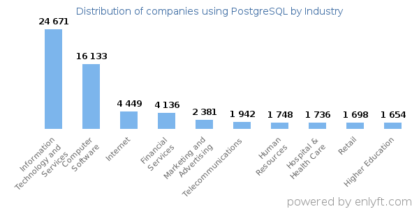
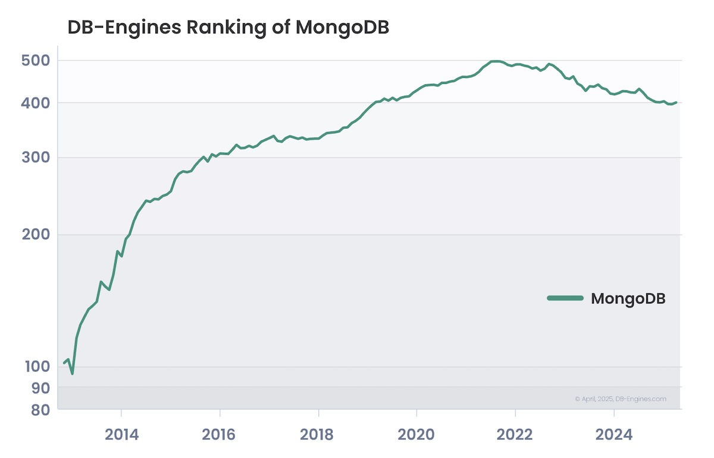
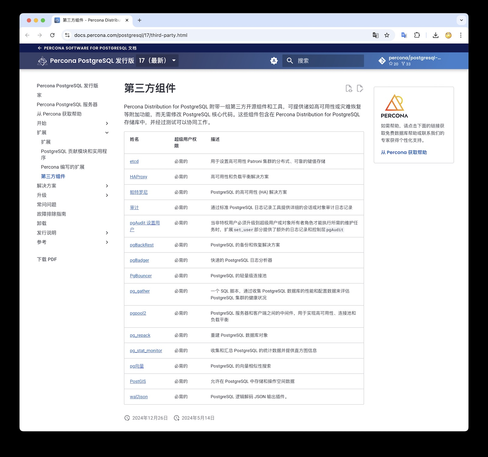
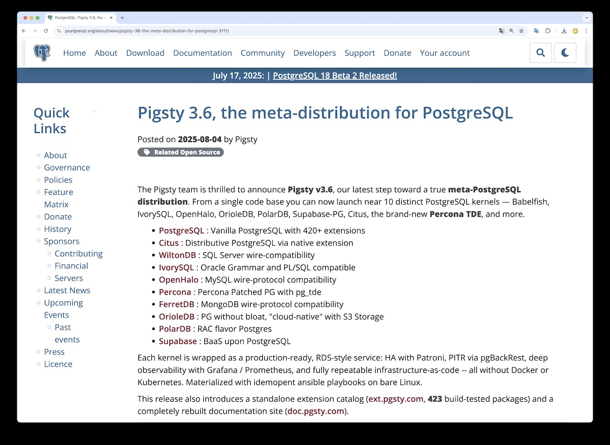
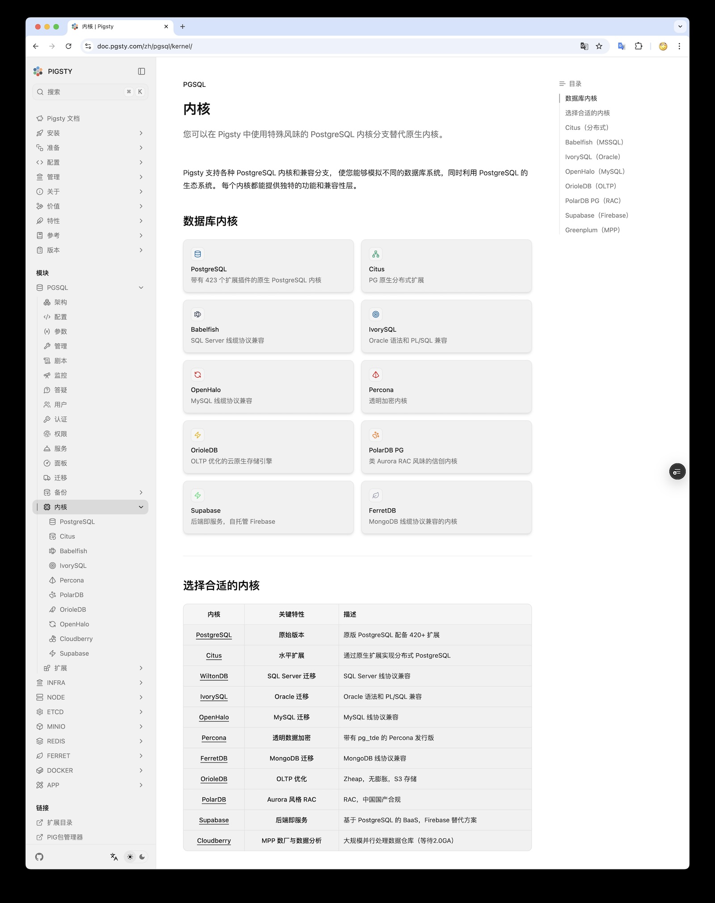

Percona 是 MySQL 生态的扛旗者与主要三方厂商，最近几年也在进军 PostgreSQL 赛道。本文英文原文今天早上发布在 Percona 博客上。
当然 Percona 主要是想给自己打个广告，但这没毛病，这个问题也确实是存在的。所以老冯将这篇文章翻译点评一下，并与大家聊一聊这个问题。

> [The growing dominance of PostgreSQL and the emergence of propriety solutions](https://experience.percona.com/postgresql/postgresql-market-in-2025/the-growing-dominance-of-postgresql )


## PostgreSQL主导地位不断提升，专有解决方案纷纷涌现

截至 2025 年，PostgreSQL 在关系型数据库市场的份额达到 16.85%，是仅次于 MySQL 的第二大开源数据库。它已成为 Instagram、Reddit、Spotify，甚至 NASA 等大型数据密集型机构的首选数据库。截至目前，大约 11.9% 年营收超过 2 亿美元的公司在生产环境中使用 PostgreSQL。

新趋势之下，新老数据库厂商自然都想从中受益。虽然目前市面上专有 PostgreSQL 产品的数量相比五年前的具体增幅难以精确量化，但有几个迹象表明：无论是知名厂商还是新创企业，基于 PostgreSQL 的专有解决方案都在大幅增加：

1. **云提供商的采用**：AWS、Google Cloud、Azure 等主要云厂商现在都提供附带专有特性和集成功能的 PostgreSQL 托管服务，而在五年前这类服务还不多见。
2. **企业级方案**：近年来商业版 PostgreSQL 产品数量显著增长，多家供应商（包括 EDB）反馈企业对企业级支持、工具和托管服务的需求非常旺盛。
3. **初创公司的创新**：Neon、Supabase、ParadeDB、PostgresML、Tembo 等新创公司纷纷涌现，提供基于 PostgreSQL 打造的创新型专有解决方案。
4. **微软 DocumentDB**：微软正推出 DocumentDB——一个建立在 PostgreSQL 之上的开源 NoSQL 数据库，兼容 MongoDB 协议。

更重要的是，这一趋势丝毫没有放缓迹象。PostgreSQL 对当下热门的多种高级数据类型提供了良好支持——例如用于 AI/ML 工作负载的向量、用于半结构化数据的 JSONB、通过 Timescale 实现的时间序列功能，以及用于地理空间数据的 PostGIS 扩展。
这些能力使 PostgreSQL 成为各组织构建下一代分析、人工智能和大数据解决方案的理想选择。越来越多的企业不仅将 PostgreSQL 作为主要的运营数据库（OLTP），还将其作为复杂分析和 AI 系统的基石。



从行业分布来看，PostgreSQL 的用户几乎遍及各行各业——信息技术服务、计算机软件、互联网、金融服务、市场营销与广告、电信、人力资源、医疗健康、
零售和高等教育等行业均在广泛采用 PostgreSQL（数据来源：[Enlyft](https://enlyft.com/tech/products/postgresql)）。

## 专有未必是坏事……至少目前如此

截至 2025 年，各类专有的 PostgreSQL 产品致力于在开源核心的基础上提供更强大的功能、企业级特性和商业支持，使其对关键业务工作负载更具吸引力。
对于缺乏内部专业能力来管理和扩展开源 PostgreSQL 的组织来说，采用专有方案可以说是一个合理且无可厚非的选择。

然而，IT 主管们不应只顾眼前的便利，还要考虑这一趋势未来的发展方向。越来越多以开源起家的公司正在寻求转向闭源模式，以进一步实现商业变现。
比如，Redis 最近将其许可协议变更为 Redis Source Available License（RSALv2）和 Server Side Public License（SSPLv1），限制了代码的使用方式。2023 年，HashiCorp 也采取了类似做法，将其大部分项目从 Mozilla 公共许可证 2.0 改为限制更严格的商业源许可证（BSL）。

> 老冯注：还有刚刚新鲜出炉的《[KubeSphere 断供跑路](/cloud/kubesphere-rugpull/)》


## MongoDB 能告诉我们 PostgreSQL 将走向何方吗？

再看看 MongoDB 或许能带来一些启示。MongoDB 曾一度被誉为关系型数据库的开源替代方案，就如同如今的 PostgreSQL 一样，但其发展轨迹后来却明显转向了专有化。
MongoDB 公司全力投入数据库即服务（Database-as-a-Service，DBaaS）领域，围绕其 Atlas 云数据库服务构建了一个高度封闭的生态系统。
受此影响，社区贡献和第三方服务都受到了冲击，而许可模式的变化——例如改用 SSPL 许可证——实际上让 MongoDB 在许多场景下变成了闭源产品。

MongoDB 转向更严格的许可证模式及厂商主导的云平台之路，与另一家巨头 Oracle 的轨迹如出一辙。投资者要求持续的收入增长，导致 MongoDB 采取的策略进一步强化了对客户的锁定、提高了授权费用，并迫使企业签订代价高昂的长期合同。
曾经作为开源旗手的 MongoDB，如今与其说像开源，不如说更像 Oracle。毫无疑问，转向闭源模式是 MongoDB 企业用户采用率下降的关键原因之一。



> 老冯按：[《StackOverflow 2025 调研》中，MongoDB 成为年度最大输家](/pg/so2025-pg)

时至今日，有关 MongoDB 的讨论大多集中在如何迁移离开这个企业平台，而非继续采用它。
最能体现这一趋势的例子之一，是 Infisical 于 2024 年 12 月发布的一篇博文（Infisical 是一个“一站式平台，用于安全地管理应用程序密钥、证书、SSH 密钥和配置”），
标题为《[从 MongoDB 迁移到 PostgreSQL 的大迁徙](https://infisical.com/blog/postgresql-migration-technical)》。
文中解释道，MongoDB 虽然在他们初创时期表现出色，但随着发展，他们和客户 **“遇到了 MongoDB 在功能和易用性方面的局限”** 。
文章还提到，将数据库切换到开源的 PostgreSQL 后，数据库成本降低了 50%。

对于那些采用专有 PostgreSQL 方案的组织来说，这无疑是一个值得警醒的案例。
虽然 PostgreSQL 本身仍然完全开源，也并非由某个单一厂商掌控，但其周边生态正稳步朝着厂商受控的模式转变，锁定效应日益增强。
大型云提供商的 PostgreSQL 托管服务带有专有的增强功能，将用户绑定在各自的平台上。
面向企业的 PostgreSQL 厂商也在推出专有扩展和增值服务，这些举措虽然提供了便利，却对数据库的真正可移植性构成了障碍。
**那些曾经让 MongoDB（以及更早的 Oracle）走向封闭的力量，如今也同样在 PostgreSQL 的生态中发挥作用。**


## 依赖专有 PostgreSQL 的业务风险

对于 IT 决策者而言，PostgreSQL 商业化所带来的风险远不止数据库架构本身 —— 它甚至会影响整个技术版图。
专有的 PostgreSQL 服务或许能提供一时的便利，但往往是以牺牲长期敏捷性为代价的。
当云成本上涨、授权模式演变时，今天的决定明天就可能变成代价高昂的陷阱。
有限的可移植性可能扰乱上云计划，使多云战略复杂化，并阻碍灾难恢复。
而随着厂商不断推出专有附加组件或激进的产品策略（比如 MongoDB 大力推广 Atlas），谁也无法预料接下来还会出现哪些新的限制。


### 供应商锁定

供应商锁定是 PostgreSQL 商业化引发的首要担忧之一。许多专有或托管的 PostgreSQL 产品都捆绑了特定供应商的增强功能，使用户对该供应商产生依赖。
一旦这种依赖根深蒂固，想要迁移就变得既困难又昂贵——此时您将不得不受制于厂商的各种条款，而这些条款可能随时改变。

这意味着可能会出现意外的许可变更、支持费用上涨，甚至对 CPU 等资源单位的重新定义。
例如，Oracle 长期以来就因随意调价、强硬的续约策略和不灵活的合同条款而饱受诟病。

投入越深，脱身越难。如果您在基础架构中深度嵌入了某家供应商的专有 PostgreSQL 方案，
并在其上投入了大量时间和金钱，那么迁移将演变成一项耗时数年、耗资上百万美元的庞大工程，只为脱离该供应商的束缚。

更值得注意的是，作为最大的专有 PostgreSQL 供应商之一，EDB 甚至发表过一篇博文为供应商锁定现象辩护，声称这“未必是件坏事”。
文中作者以构建和维护内部 PostgreSQL 所需的专门技术为理由，为选择专有方案进行开脱（这一点我们稍后还会提到）。但试问，这种论调究竟对谁有利？


### 对市场变化反应迟缓

被锁定在既有技术上还会带来更广泛的影响。受制于过时或小众技术的企业往往会停滞不前。当您的团队被束缚在陈旧的系统中时，他们不再学习新技能，赶不上新技术的发展。
长此以往，这将侵蚀公司的技术基础——您的团队也会因为缺乏现代技术栈而难以招揽希望从事前沿工作的优秀人才。由此形成的恶性循环将限制创新能力、降低敏捷性，并削弱适应变化的能力。

### 成本波动难以预测

成本同样在发生变化。许多专有 PostgreSQL 厂商现在采用基于资源使用量的计费模式，随着使用规模增长，费用可能会迅速攀升。一开始看似经济高效的方案，很快就可能演变为沉重的财务负担。

- 例如，Google Cloud 的 AlloyDB for PostgreSQL 按 vCPU 和内存用量计费，价格因区域和配置不同而异。这种模式虽然灵活，但随着工作负载规模扩大，成本也会大幅攀升。
- 又如，AWS 的 Aurora PostgreSQL 需要为 I/O 操作付费，如果不加以监控，整体拥有成本可能会显著膨胀。

再举一个实际案例：Percona 最近帮助一家从事会员制和变现服务的平台客户完成迁移，替他们摆脱了昂贵的 DBaaS 托管数据库方案。即便将 Percona 的托管和支持费用计算在内，该客户每月的基础设施支出仍然削减了 50% 以上。

### 潜在的安全和合规风险

安全与合规也是一大隐忧。使用专有或全托管的 PostgreSQL 服务会降低组织对底层基础设施、安全措施和合规配置的可见性。对于高度受监管行业的公司而言，这种对环境失去控制的情况可能带来严重风险。

### PostgreSQL 社区生态的侵蚀

最后，如果 PostgreSQL 持续朝商业化方向发展，其活跃的开源社区——这个数十年来创新的引擎——可能会逐渐失去动力。
由厂商主导的开发模式可能意味着社区驱动的改进减少、对开放标准的采用放缓，从而逐步侵蚀 PostgreSQL 长期以来引以为傲的开放性基因。

## 有何替代方案？

如前所述，专有的 PostgreSQL 产品会限制灵活性、推高长期成本，并背离 PostgreSQL 最初吸引大家的开源原则。
但现实情况是：即便您想避免上述风险，完全依靠内部团队构建并运维生产级 PostgreSQL 环境也未必可行——这正是 EDB 所强调的观点。

也许您的团队没有足够的时间、深厚的专业技能或人手来设计高可用架构、在大规模下调优性能、及时跟进每次版本升级，以及在复杂基础设施中管理合规。但这并不意味着您只能屈从于专有或云托管方案。

Percona for PostgreSQL 为希望规避专有方案风险、又无力完全自建 PostgreSQL 运维的组织指明了一条清晰的前进道路。
Percona 提供的是一个完全开源、具备企业级水准的 PostgreSQL 解决方案——包含完善的高可用、安全、可观测性和性能优化等工具支持 —— 
且没有任何专有束缚或意外的许可费用。您依然可以自主掌控数据库运行的地点和方式，并灵活地将其部署在本地、云、混合云或 Kubernetes 环境中。


## 老冯评论

Percona 抛出了一个非常重要的问题。PostgreSQL 日益主宰数据库世界，这个已经基本成为业界共识。但什么样的 PostgreSQL 会成为未来，仍然是一个高度争议性的问题。
对于这个问题，老冯在《云计算泥石流》专栏里曾多次抨击过云厂商提供的 RDS / 云数据库服务 —— 《[云数据库是不是智商税](/cloud/rds)》 / 《[公有云是不是杀猪盘](/cloud/ebs)》。

### Percona 发行版

Percona 算是比较早一批明确提出 [“PostgreSQL 发行版”](https://docs.percona.com/postgresql/17/third-party.html) 概念的开源厂商，他们有两个非常不错的扩展 —— 
[`pg_stat_monitor`](https://pgext.cloud/e/pg_stat_monitor) 与 [`pg_tde`](https://pgext.cloud/e/pg_tde)，前者提供了 PostgreSQL 中的高级可观测性指标，后者则提供透明加密的功能。
Percona 也有一个 PMM 监控工具，算是 MySQL 生态做的非常好的监控平台，最近也做了一些 PostgreSQL 的支持。
当然，因为 pg_tde 所需的补丁一直没有合入 PG 主干，因此 Percona 不得不自己制作了打补丁的 PostgreSQL 内核包，以配合他们的 pg_tde 透明加密扩展使用

不过作为同行，老冯觉得如果只是把补丁内核，运行高可用/PITR PG 所需的软件打个包放到 Percona 软件仓库里，这个发行版的价值主张确实有些过于单薄，难以支撑起上面提到的 “反击专有方案” 的使命与大旗。
毕竟这样的事情，PostgreSQL 全球开发组（PGDG）已经做了，而且做得还相当不错 —— 至少你得把如何部署，交付整个服务的部分给做了吧，丢给客户一些 RPM/DEB 包，显然想跟 RDS 掰手腕是远远不够的。

[](https://docs.percona.com/percona-for-postgresql/)

当然，我跟 Percona 的创始人 Peter Zaitsev 也有过交流，惺惺相惜，肯定算是同道中人。所以他没做的部分，我可以帮 Percona 补上。
这也是为什么在 Pigsty 3.6 中，我们提供了 [对 Percona PostgreSQL 发行版的支持](https://doc.pgsty.com/zh/pgsql/kernel/percona/) —— 你现在可以用傻瓜式的一行命令，启用 Percona 带有 TDE 加密的内核。
并完整的集成了 etcd / haproxy / patroni 高可用， pgbackrest / minio 备份恢复，grafana / prometheus 监控，以及 ansible IAC。
当然，如果你使用原生 PG 内核，还有整整 423 个扩展插件可供选择，我会在未来考虑为 Percona 这样的 PG 内核分支也构建这些扩展包。

```bash
curl -fsSL https://repo.pigsty.io/get | bash; cd ~/pigsty;
./configure -c pgtde     # 使用 percona postgres 内核
./install.yml            # 使用 pigsty 设置一切
```

**我认为想要避免 “供应商” 锁定，正在做到自主可控，实现软件自由，仅仅开源内核和扩展的代码是远远不够的，而应该让用户能够在脱离网络，甚至脱离专家支持的情况下，仍然能够持续运营下去。**

因此，我提供了 Percona 仓库的镜像，并且确保用户在使用 Pigsty 安装包括 Percona PG 发行版在内的10种 PG 内核时，本地都会有完整的安装包与系统依赖，自动生成一个 YUM/APT 软件仓库，
可以供用户在断网环境中，轻松部署复制出一模一样的环境与节点，实现独立运营到地老天荒的效果。甚至，就连构建这些 RPM/DEB 包的完整说明，工具，我也都完全放在 GitHub 上开源了。
而更重要的是，比起给你 RPM/DEB 包，更重要的是如何把这些包攒成企业级服务的经验，这些经验沉淀为 Ansible Playbook 与 SOP，以一键部署，开箱即用的方式，让即使是新手也能轻松上手。


### Pigsty 元发行版

老冯认为 PostgreSQL 数据库世界需要有一个代表 “软件自由” 价值观的开源发行版，这也是我做 Pigsty 的原因 —— 提供一个功能覆盖 RDS 的本地优先，开源免费的上位替代。
前几天， Pigsty 刚刚发布了 v3.6 版本，我在 PG 社区官网新闻上将其称为一个 “元发行版”，也就是发行版的发行版。

[](https://www.postgresql.org/about/news/pigsty-36-the-meta-distribution-for-postgresql-3111/)

> PostgreSQL 社区新闻：[Pigsty v3.6， PG元发行版](https://www.postgresql.org/about/news/pigsty-36-the-meta-distribution-for-postgresql-3111/)

它可以丝滑运行像 “Percona” 发行版，IvorySQL 发行版，PolarDB 发行版，WiltonDB 发行版，OrioleDB，OpenHalo 等各种各样的 PG 内核发行版，并将其转换为一套开箱即用的 RDS 服务。
加上 Percona 的 TDE 内核，目前我们已经支持了好几种种风味的 PG 内核，如果 Citus，TimescaleDB，Omnigres 这样的巨型扩展，或者把 Supabase，Gel 这类封装 PG 内核的项目也算做发行版，数量还要更多，已经有十几种了。

[](https://doc.pgsty.com/zh/pgsql/kernel/)

|                               内核                               |       关键特性        | 描述                                 |
|:--------------------------------------------------------------:|:-----------------:|------------------------------------|
|  [PostgreSQL](https://doc.pgsty.com/zh/pgsql/kernel/postgres)  |     **原始版本**      | 原版 PostgreSQL 配备 420+ 扩展           |
|      [Citus](https://doc.pgsty.com/zh/pgsql/kernel/citus)      |     **水平扩展**      | 通过原生扩展实现分布式 PostgreSQL             |
|  [WiltonDB](https://doc.pgsty.com/zh/pgsql/kernel/babelfish)   | **SQL Server 迁移** | SQL Server 线协议兼容                   |
|   [IvorySQL](https://doc.pgsty.com/zh/pgsql/kernel/ivorysql)   |   **Oracle 迁移**   | Oracle 语法和 PL/SQL 兼容               |
|   [OpenHalo](https://doc.pgsty.com/zh/pgsql/kernel/openhalo)   |   **MySQL 迁移**    | MySQL 线协议兼容                        |
|    [Percona](https://doc.pgsty.com/zh/pgsql/kernel/percona)    |    **透明数据加密**     | 带有 pg_tde 的 Percona 发行版            |
|   [FerretDB](https://doc.pgsty.com/zh/pgsql/kernel/ferretdb)   |  **MongoDB 迁移**   | MongoDB 线协议兼容                      |
|   [OrioleDB](https://doc.pgsty.com/zh/pgsql/kernel/orioledb)   |    **OLTP 优化**    | Zheap，无膨胀，S3 存储                    |
|    [PolarDB](https://doc.pgsty.com/zh/pgsql/kernel/polardb)    | **Aurora 风格 RAC** | RAC，中国国产合规                         |
|   [Supabase](https://doc.pgsty.com/zh/pgsql/kernel/supabase)   |     **后端即服务**     | 基于 PostgreSQL 的 BaaS，Firebase 替代方案 |
| [Cloudberry](https://doc.pgsty.com/zh/pgsql/kernel#cloudberry) |  **MPP 数厂与数据分析**  | 大规模并行处理数据仓库（等待2.0GA）               |


在以前，这种服务你需要在 AWS 或者各家 DBaaS 上花大钱去购买，而且还会被束手束脚，忍受各种功能阉割，以及乞丐云盘带来的性能羞辱（PlanetScale 刚刚也群嘲过了）。
而如果想要自建，经验丰富足的 PostgreSQL DBA 是如此稀缺，即使是 [像 OpenAI 这样的顶级独角兽也要付出高昂的故障代价自己砸人培养](/db/openai-pg/)。

自由是最昂贵的顶级奢侈品 —— 老冯深知软件自由的美好，以及它背后的高昂代价。
但老冯希望有更多人有机会享受到它 —— 让每个人都能轻松负担的起可靠，稳定，省心的企业级 PostgreSQL 服务，享受 PostgreSQL 生态的乐趣。
这就是 Pigsty 所做的事情 —— 一个真正代表 “软件自由” 价值观的开源 PostgreSQL 发行版，让你脱离供应商，许可证，互联网，软件仓库，甚至是技术专家的 “锁定”，实现终极意义上的自主可控与软件自由。


## 参考阅读

- [PZ：MySQL还有机会赶上PostgreSQL吗？](/db/can-mysql-catchup)
- [Oracle最终还是杀死了MySQL](/db/oracle-kill-mysql/)
- [Oracle 还能挽救 MySQL 吗？](/db/can-oracle-save-mysql/)
- [MySQL性能越来越差，Sakila将何去何从？](/db/sakila-where-are-you-going/)
- [PostgreSQL会修改开源许可证吗？](/pg/pg-license/)
- [草台班子唱大戏，阿里云PG翻车记](/cloud/rds-failure/)
- [KubeSphere：开源断供背后的信任危机](/cloud/kubesphere-rugpull/)
- [WordPress社区内战：论共同体划界问题](/cloud/wordpress-drama/)
- [MongoDB没有未来：好营销救不了烂芒果](/db/bad-mongo/)
- [Redis不开源是“开源”之耻，更是公有云之耻](/db/redis-oss/)
- [范式转移：从云到本地优先](/cloud/paradigm/)

