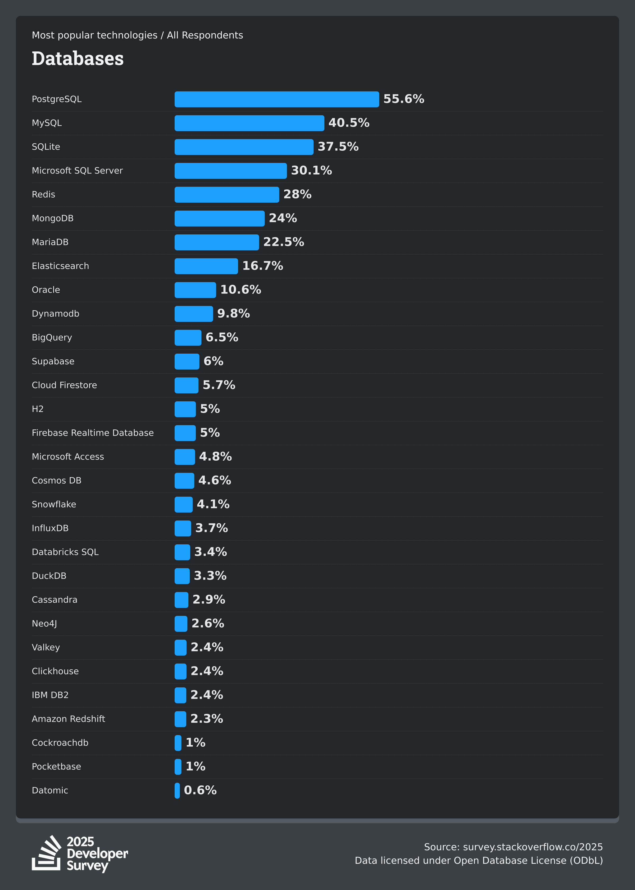
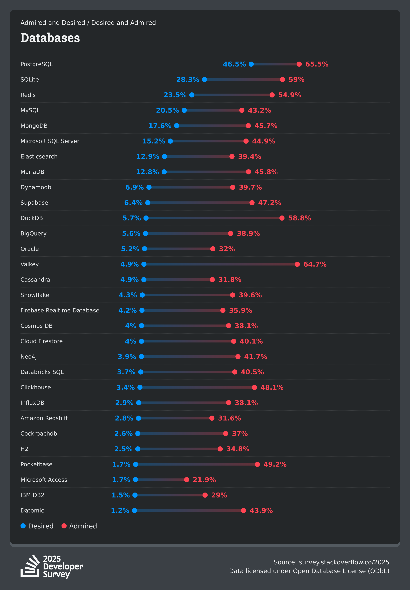
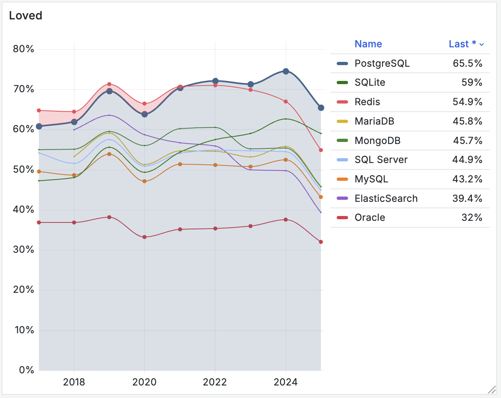
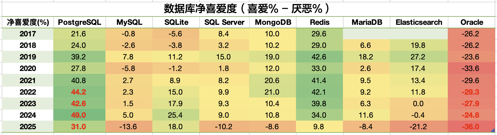
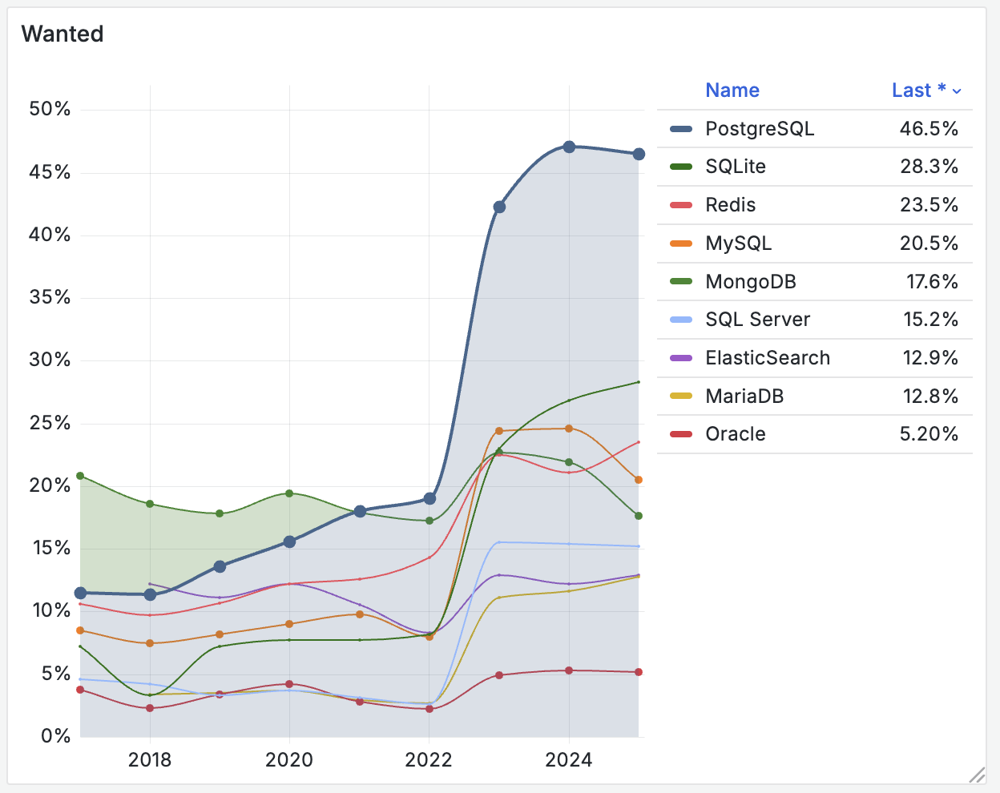
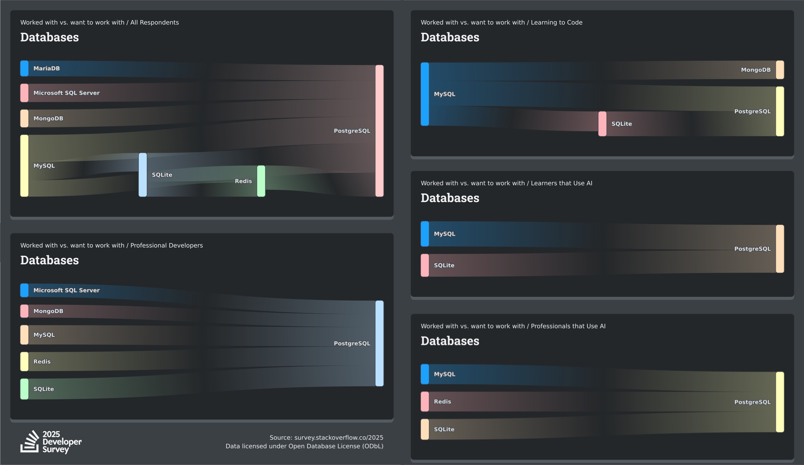

The [2025 StackOverflow Global Developer Survey results](https://survey.stackoverflow.co/2025/technology#2-databases) are fresh out, with high-quality questionnaire feedback from 50,000 developers across 177 countries and regions. As a database veteran, I'm most interested in the "Database" section of this survey. Today, let's decode this data and examine the latest trends in the database field.

Simply put, PostgreSQL has achieved a three-peat as the undisputed champion across all three database metrics for the third consecutive year, and it continues to maintain its high-speed momentum. If we said "[PostgreSQL is Eating the Database World](/pg/pg-eat-db-world)" two years ago, then from this year's data, PostgreSQL has undoubtedly dominated the database world.

## Popularity

First is database popularity: [Database usage rates among developers](https://survey.stackoverflow.co/2025/technology#1-databases)

The proportion of users of a technology relative to the total represents **popularity**. Its meaning is: what percentage of users have used this technology in the past year. Popularity represents accumulated usage over the past year, is a stock indicator, and is also the most core factual indicator.

In terms of usage rate, **PostgreSQL accelerated its rise**: 48.7% of developers were already using PostgreSQL in 2024, and this proportion soared to **55.6%** in 2025. The annual increase of nearly 7 percentage points is the largest expansion in history. This allows PostgreSQL to open up a 15 percentage point gap with second-place MySQL, establishing a clear leading position.

Looking at the "professional developers" group, which better reflects "enterprise scenarios", PG's usage rate further increases to **58.2%**, opening up an 18.6 percentage point gap with second-place MySQL. The gap between the two has increased from last year's 12.5 percentage point advantage to nearly 50%! PostgreSQL has become the undisputed database king with its overwhelmingly leading usage rate.

Combining the past nine years of survey data and plotting popularity on a scatter chart, it's clear that PostgreSQL has maintained almost constant high-speed growth, and growth is even accelerating.

> [Professional developer usage trend chart](https://g.pgsty.com/d/sf-survey/stackoverflow-survey?orgId=1&from=2016-12-31T00:00:00.000Z&to=2025-01-31T00:00:00.000Z&timezone=browser&viewPanel=panel-10)

Additionally, it's worth noting that Supabase and DuckDB have become the "dark horses" on this list. The embedded analytics newcomer DuckDB achieved explosive exponential growth of 0.59%, 1.3%, 3.3% in the past three years, with a YoY growth rate as high as 146%. DuckDB broadly belongs to the PostgreSQL ecosystem — it uses PostgreSQL's syntax parser and can be used as a PG plugin extension. I've always been very optimistic about DuckDB's development prospects, believing it will complete the top-tier analytics engine missing from the PostgreSQL ecosystem. (See: [Whoever Integrates DuckDB Best Wins the OLAP World](/pg/pg-duckdb))

Supabase benefited from the AI wave boom, achieving exponential usage rate growth of 2.6%, 3.8%, 6% in the past three years. Supabase is an open-source Firebase alternative built on top of Postgres, providing a one-stop backend BaaS service. As an open-source alternative to Firebase, Supabase's rise corresponds to Firebase's sharp decline (-16.1%).

The most significant decline occurred with MongoDB. I've harshly criticized MongoDB before ([MongoDB Has No Future: Good Marketing Can't Save a Rotten Mango](/db/bad-mongo)). In this wave of database increment growth driven by AI, MongoDB is the only major database showing negative usage growth (-0.7%). It has become bosom buddies with Firebase in misery.

Oracle and MySQL still had 0.1% ~ 0.2% usage growth this year, but against the backdrop of general database usage growth, they're still getting crushed.

Unfortunately, TiDB, once the most representative domestic database leader, fell out of all three rankings this time. TiDB and Oceanbase chose the distributed + MySQL compatibility route (double wrong bet) (see: [Are Distributed Databases a False Requirement?](/db/distributive-bullshit)). This is quite inappropriate in the current context of [hardware development](/cloud/bonus/) and PG ecosystem prosperity. CockroachDB, which also bet on the distributed route but chose PostgreSQL ecosystem compatibility, achieved 10% relative growth this year and successfully stayed on the list.

------

## Admiration

The other two important metrics are database admiration (red) and desire (blue): [Most loved and most wanted databases among all developers in the past year](https://survey.stackoverflow.co/2025/technology#2-databases), sorted by desire.

So-called "**reputation**" (red dots), admiration (Loved) or appreciation (Admired), refers to what percentage of users are willing to continue using this technology. This is an annual "retention rate" indicator that can reflect users' views and evaluations of a technology, representing future growth potential.

In terms of reputation, PostgreSQL won the championship for the fourth consecutive year with **65.5%** admiration, though it's worth noting that all databases showed significant declines in admiration this year. Referring to last year's admiration data, PostgreSQL, DuckDB, Redis, and SQLite's admiration successfully converted into high usage rates this year. TiDB's dramatic decline in admiration last year (from 64.33% to 48.8%) was also reflected in this year's popularity decline and complete fall from all three rankings.

We can refer to NPS reputation and use 50% admiration as a threshold (more people like it than dislike it). Databases reaching this threshold include: PostgreSQL (65.5), ValKey (64.7), SQLite (59%), DuckDB (58.8%), Redis (54.9%).

Interestingly, Redis showed a collapse in admiration, while Valkey replaced Redis's ecological niche, which can be attributed to Redis's recent license change controversies.

Supabase's admiration was already realized last year, dropping to **47.2%** this year and beginning to decline, which aligns with trends I've observed — some Supabase users who have grown beyond the comfort zone of cloud services now need to self-host Supabase. The official Docker Compose toy self-hosting template provided by Supabase has many pain points compared to their cloud service.

------

## Desire

The proportion of those who desire it relative to the total is **desire rate** (Wanted), or **aspiration** (Desired), represented by blue dots in the above chart. Its meaning is: what percentage of users will actually choose to use this technology in the next year, representing actual growth momentum for the next year.

In this category, PostgreSQL has won the championship for the fourth consecutive year, still with a cliff-like overwhelming lead, opening up amazing gaps with followers. In the past two years, driven by the AI wave and vector database demand, PostgreSQL's demand showed amazing surges: from 19% in 2022 to **47%** in 2024, and maintained at **46.5%** this year.

MySQL's desire was overtaken by SQLite last year, falling from second place in 2023 to third in 2024, and was overtaken by Redis this year, dropping to fourth place. Fellow sufferer MongoDB fell from the most wanted database by developers (first place) from 2017-2020 all the way to fifth place. Its reputation collapsed like a cliff — how tragic!

------

## Migration Chart

The most interesting aspect of the 2025 survey is this database migration chart — summarized in one sentence: all databases are migrating to PostgreSQL. Unlike other technology fields that have give and take (like languages, tools), the database world's ecosystem shows a clear trend toward unification.

------

## Summary

It's clear that PostgreSQL has achieved a third consecutive year of undisputed crushing dominance, **becoming the world's most popular, most loved, and most wanted database**, while rapidly squeezing the ecological niches of other databases. The database world is in the process of unification and convergence. Based on the past nine years of trends and next year's demand rate data, nothing can shake this anymore.

Ecologically, PostgreSQL has become the hegemon of the database world. Its former biggest competitors Oracle and MySQL have lost the ability to compete and match it. Databases that can continue to grow either avoid PostgreSQL's ecological niche (analytics, APM, ETL), have intricate relationships with PostgreSQL (DuckDB), or are simply rebranded or protocol-compatible PostgreSQL (Supabase).

PostgreSQL has become the Linux kernel of the database world and the default choice for databases. The kernel disputes in the database world have settled. Next, the real contradiction will focus on database distributions. People will no longer struggle with what database kernel to use, but will start asking — what database distribution are you using?

PostgreSQL distributions like Amazon RDS, Supabase, EDB, Pigsty, Percona, Crunchy, StackGres will compete for the RedHat, Ubuntu, Debian, SUSE ecological positions in the database world. I'm proud that Pigsty, as an open-source PostgreSQL distribution, has already secured a ticket to this distribution battle royale.

--------

## Advertisement Time

As usual, writing articles without ads is like not writing at all.

My [Pigsty](https://pgsty.com/zh) is an open-source and ready-to-use PostgreSQL distribution, providing the best monitoring system in the PG world (3000+ metrics) and the most comprehensive extension support (423 extensions ready to use). It comes with high availability, PITR backup recovery, IaC automated one-click deployment, and supports using 10 different flavors of PG kernels: PG, Citus, IvorySQL, PolarDB, Babelfish, FerretDB, OpenHalo, OrioleDB, Percona TDE.

Pigsty enables users to build enterprise-grade PostgreSQL database services without database experts. Additionally, Pigsty is one of only two open-source projects providing production-grade self-hosted Supabase. If you need to use PostgreSQL, rather than manual setup or expensive RDS, why not try this?