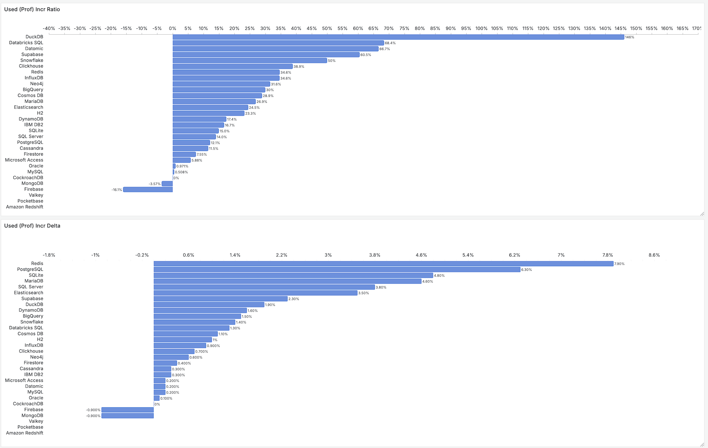
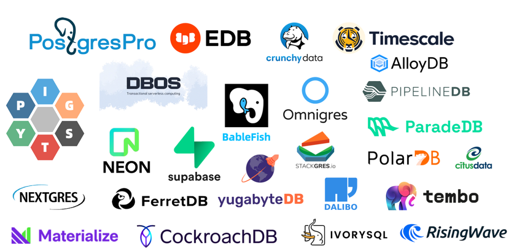

[2025 年 StackOverflow 全球开发者调研结果](https://survey.stackoverflow.co/2025/technology#2-databases)已经新鲜出炉
，来自 177 个国家与地区的 5 万名开发者给出了高质量的问卷反馈。
作为数据库老司机，我最关注的还是 “数据库” 这一项调研结果，今天就来带大家解读一下这份数据，看看数据库领域的最新趋势。

简单来说，PostgreSQL 已经是连续第三年在数据库全部三项指标上获得三冠王了，并且依然保持着高歌猛进的势头。
如果说两年前我们说 “[PostgreSQL 正在吞噬数据库世界](/pg/pg-eat-db-world)”，那么从今年的数据上来看，PostgreSQL 已经毫无疑问的主宰了数据库世界。

## 流行度

首先是数据库流行度：[开发者中的数据库使用率](https://survey.stackoverflow.co/2025/technology#1-databases)

一项技术使用者占总体的比例，就是**流行度**。它的含义是：过去一年有多少比例的用户使用了这项技术。流行度代表过去一年的积累使用，是存量指标，也是最核心的事实指标。

在使用率上，**PostgreSQL 加速上升**：在 2024 年已有 48.7% 的开发者使用 PostgreSQL，2025 年这一比例飙升至 **55.6%**。
一年增幅接近 7 个百分点，扩张幅度为历年之最。这使得PostgreSQL与第二名 MySQL 拉开了15个百分点的差距，确立了断层式领先的地位。

让我们考虑更能体现“企业场景”的“专业开发者”群体，那么PG的使用率数值进一步提升至 **58.2%** ，拉开第二名 MYSQL 18.6 个百分点，
而两者差距从去年的 12.5 个百分点的优势，提高了将近 50%！PostgreSQL 凭借遥遥领先的使用率，成为了毫无争议的数据库之王。

综合过去九年的问卷数据调查结果，将流行度画在散点图上，不难看出 PostgreSQL 几乎一直保持着高速增长，甚至增长还在加速。

> [专业开发者使用率趋势图](https://g.pgsty.com/d/sf-survey/stackoverflow-survey?orgId=1&from=2016-12-31T00:00:00.000Z&to=2025-01-31T00:00:00.000Z&timezone=browser&viewPanel=panel-10)

此外，值得一提的是 Supabase 与 DuckDB 成为这一榜单上的 “黑马”。
嵌入式分析新秀 DuckDB 则在最近三年实现了 0.59%, 1.3%, 3.3% 的狂暴指数增长。YoY 增长率高达 146%。
DuckDB 广义上属于 PostgreSQL 生态 —— 它使用 PostgreSQL 的语法解析器，并且可以作为 PG 的插件扩展使用。
老冯一直非常看好 DuckDB 的发展前景，我认为他会补完 PostgreSQL 生态缺失的顶级分析引擎。（参见：[谁整合好DuckDB，谁赢得OLAP世界](/pg/pg-duckdb)）

Supabase 则吃到了 AI 浪潮的红利，在最近三年实现了 2.6%, 3.8%, 6% 的使用率指数增长。
Supabase 是在 Postgres 之上构建的开源 Firebase 替代品，提供了后端 BaaS 一条龙服务。
而作为 Firebase 的开源替代，Supabase 的崛起也对应着 Firebase 的大幅滑落（-16.1%）。

最显著的衰落发生在 MongoDB 上，老冯狠狠吐槽过 MongoDB。（[MongoDB没有未来：好营销救不了烂芒果](/db/bad-mongo)）
在 AI 带动的这一波数据库增量普涨中，MongoDB 是主要数据库中唯一出现使用率负增长（-0.7%）的数据库。和 Firebase 成了难兄难弟。

Oracle 和 MySQL 今年的使用率还有 0.1% ~ 0.2% 的增长，不过在数据库使用率普涨的大背景下，依然是输麻了。

很遗憾的是，曾经最具代表性的国产数据库头部玩家 TiDB 在这一次跌出了三个榜单。TiDB 以及 Oceanbase 选择了分布式 + MYSQL 兼容的路线（双重押错宝）（参见：[分布式数据库是伪需求吗？](/db/distributive-bullshit)）。
在当下 [硬件发展](/cloud/bonus) 与 PG生态繁荣的大背景下相当不合时宜。同样押宝分布式路线，但选择兼容 PostgreSQL 生态的 CockroachDB 就在今年取得了10%相对增长，成功留在了榜单里。

------

## 喜爱度

另外两项重要的数据是数据库的喜爱度（红色）与需求度（蓝色）：[全体开发者在过去一年最喜爱与最想要使用的数据库](https://survey.stackoverflow.co/2025/technology#2-databases)，按需求度排序。

所谓“**口碑**”（红点），喜爱度（Loved）或欣赏度（Admired），指的是有多少比例的用户愿意继续使用此项技术，
这是一个年度的“留存率”指标，可以反映用户对一项技术的看法与评价，代表了未来的增长空间。

在口碑上，PostgreSQL 以 **65.5%** 的喜爱比例第四年蝉联榜首，不过值得注意的是，今年所有数据库的喜爱度都出现了明显下滑。
参照去年的喜爱度数据，不难发现 PostgreSQL ，DuckDB， Redis 以及 SQLite 的喜爱度都成功兑现成为今年的高使用率。
而 TiDB 去年喜爱度的惊人下滑（64.33% 到 48.8%）也反映为今年流行度的衰落，与全面跌出三榜的结果。

我们可以参考 NPS 口碑，将 50% 的喜爱度作为一个门槛（喜爱的人多于讨厌的人），那么达到这一门槛的数据库有：
PostgreSQL（65.5），ValKey （64.7），SQLite （59%），DuckDB（58.8%），Redis 54.9%）。

比较有意思的是，Redis 喜爱度出现塌方，而 Valkey 则顶替了 Redis 的生态位，可以想见这是由于 Redis 最近一年的许可证变化风波导致的。

Supabase 的喜爱度已经在去年兑现，今年掉落到 **47.2%** 开始出现下滑，而这与老冯观察到的趋势一致 —— 
一些成长起来的 Supabase 用户规模已经超出了云服务的舒适区，已经到了需要自建 Supabase 的阶段了。
而 Supabase 官方提供的 Docker Compose 玩具自建模版相比他们的云服务来说槽点确实很多。

------

## 需求度

需求者占总体的比例，就是 **需求率**（Wanted），或**渴望度**（Desired），在上图中用蓝点表示。
它的含义是：接下来一年有多少比例的用户会实际选择使用此项技术，代表了未来一年的实际增长动能。

在这一项上，PostgreSQL 已经是第四年蝉联榜首了，而且依然是断崖式的遥遥领先，以惊人的差距与后来者拉开距离。
在最近两年，因为受到 AI 浪潮与向量数据库需求的拉动，PostgreSQL 的需求量出现了惊人的激增：
从 2022 年的 19% 飙升至 2024 年的 **47%**，并在今年继续维持在了 **46.5%** 的高位。

而 MySQL 的需求度在去年被 SQLite 反超，从2023年的第二名跌落至 2024 年的第三，又在今年被 Redis 干掉，掉落到第四名， 
难兄难弟 MongoDB 则是从 2017-2020 开发者最想使用的数据库（第一名）一路掉到第五名。口碑断崖式塌方，怎一个惨字了得？

------

## 迁移图

在 2025 年的调研中，最有趣的莫过于这个数据库迁移图 —— 用一句概括的话就是，所有数据库都在往 PostgreSQL 跑 —— 
不同于其他领域的技术有来有往（比如语言，工具），数据库世界的生态出现了明显的大一统的趋势。

------

## 小结

不难看出，PostgreSQL 已经连续第三年以无可争议的碾压性优势，**成为了全世界最流行，最受喜爱，需求量最高的数据库**，而且正在高速挤压其他数据库的生态位。
数据库世界正在统一与收敛的进程中，根据过去九年的趋势，以及未来一年的需求率数据来看，已经没有什么力量能够撼动这一点了。

在生态上，PostgreSQL 已经成为数据库世界的霸主，曾经最大的竞争对手 Oracle 与 MySQL 已经已经失去了与之抗衡与匹敌的能力。
能继续保持增长的数据库要么与 PostgreSQL 错开了生态位（分析，APM，ETL），要么有着千丝万缕的关系（DuckDB），要么干脆就是改头换面或者协议兼容的 PostgreSQL（Supabase）。

PostgreSQL 已经成为数据库世界的 Linux 内核，与数据库世界的默认选项。数据库内核的纷争已经尘埃落定。
而接下来，真正的矛盾将聚焦在数据库发行版上。大家不会再纠结你用什么数据库内核这种问题，而会开始问的是 —— 你用的是什么数据库发行版？

像 Amazon RDS，Supabase，EDB，Pigsty，Percona，Crunchy，StackGres 这样的 PostgreSQL 发行版，将会竞争数据库世界的 RetHat，Ubuntu，Debian，SUSE 生态位。
值得老冯自豪的是，Pigsty 作为一个开源的 PostgreSQL 发行版，已经在这场发行版大乱斗中取得了一张入场券。

--------

## 广告时间

老规矩，写文章不打广告，约等于没写。

老冯的 [Pigsty](https://pgsty.com/zh) 是一个开源且开箱即用的 PostgreSQL 发行版，提供了 PG 世界中最好的监控系统（3000+类指标）与最全面的扩展支持（423个扩展开箱即用）。
自带高可用，PITR 备份恢复，IaC 自动化一键部署，而且支持使用 10 种不同风味的 PG 内核：PG, Citus, IvorySQL, PolarDB, Babelfish, FerretDB, OpenHalo, OrioleDB, Percona TDE。

Pigsty 能够让用户在缺少数据库专家的情况下，自建企业级的 PostgreSQL 数据库服务。同时，Pigsty 还是唯二两个提供自建生产级 Supabase 的开源项目。
如果你需要用到 PostgreSQL，比起土法手搓或者使用天价 RDS，不妨试一试这个。

