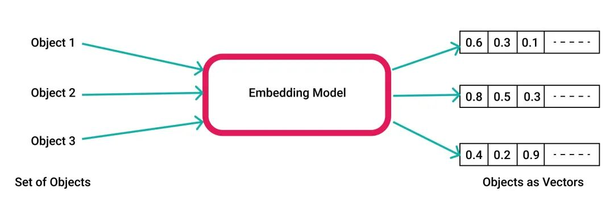
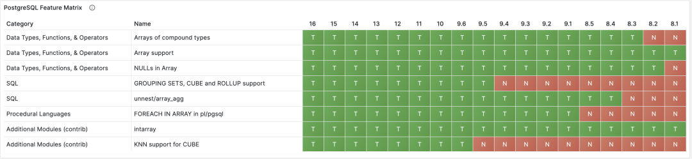
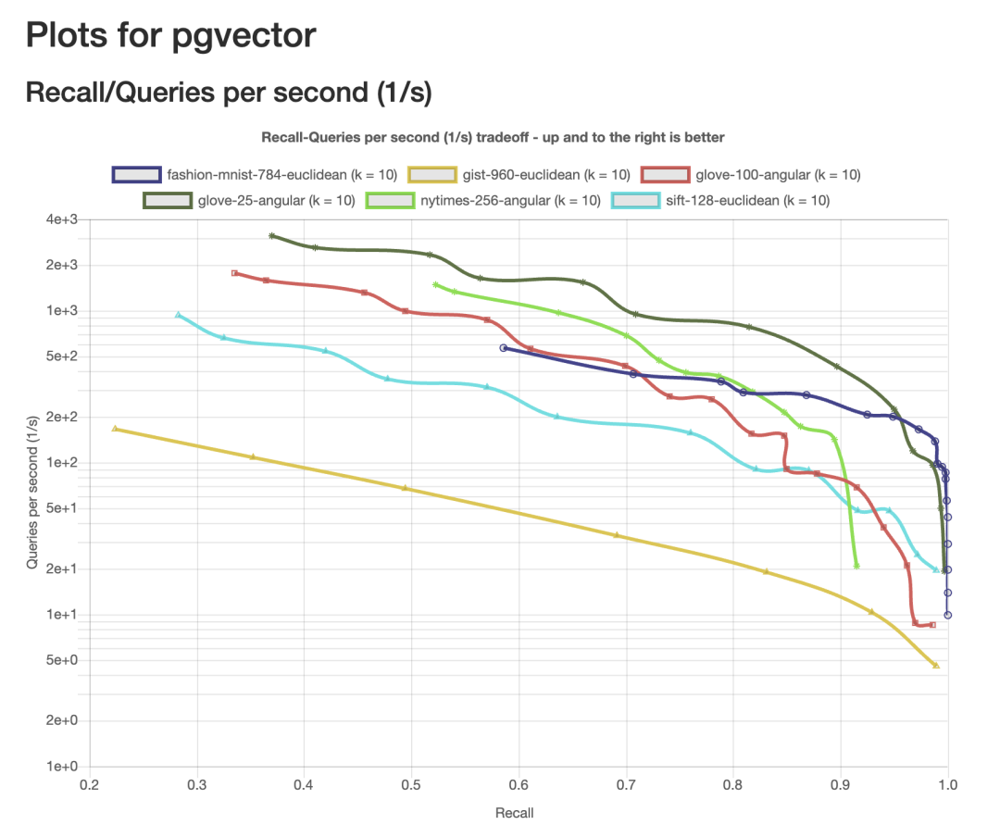
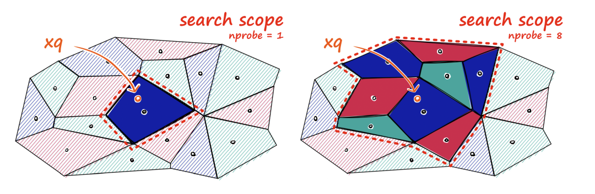
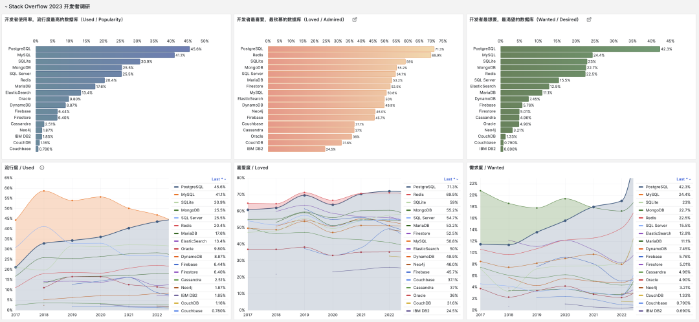
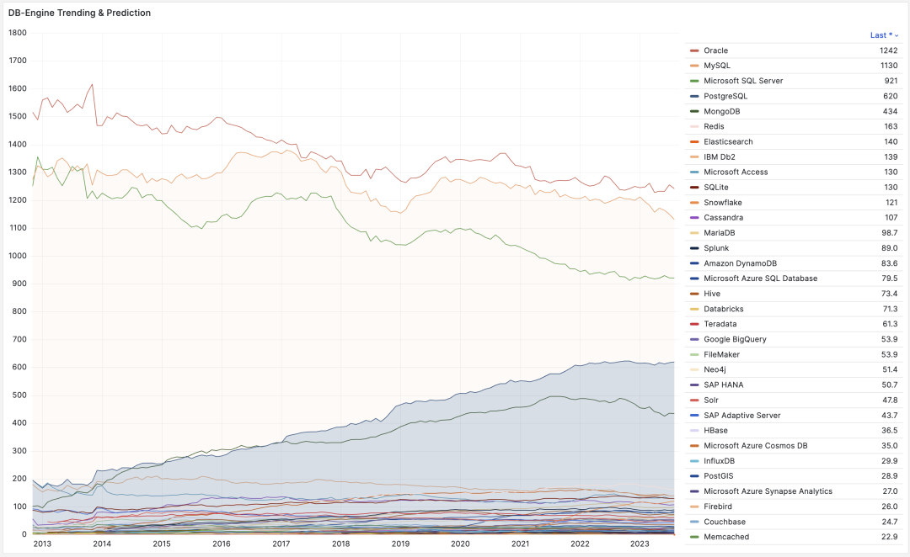
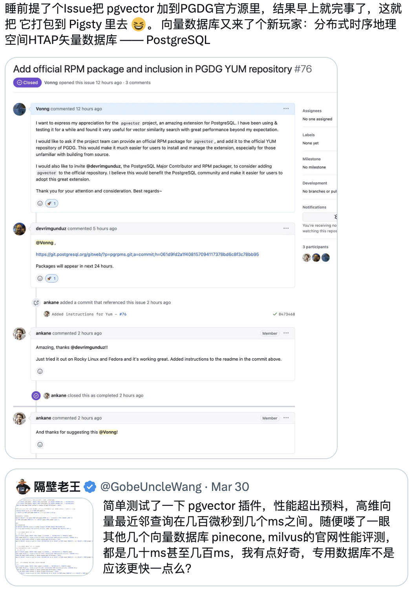
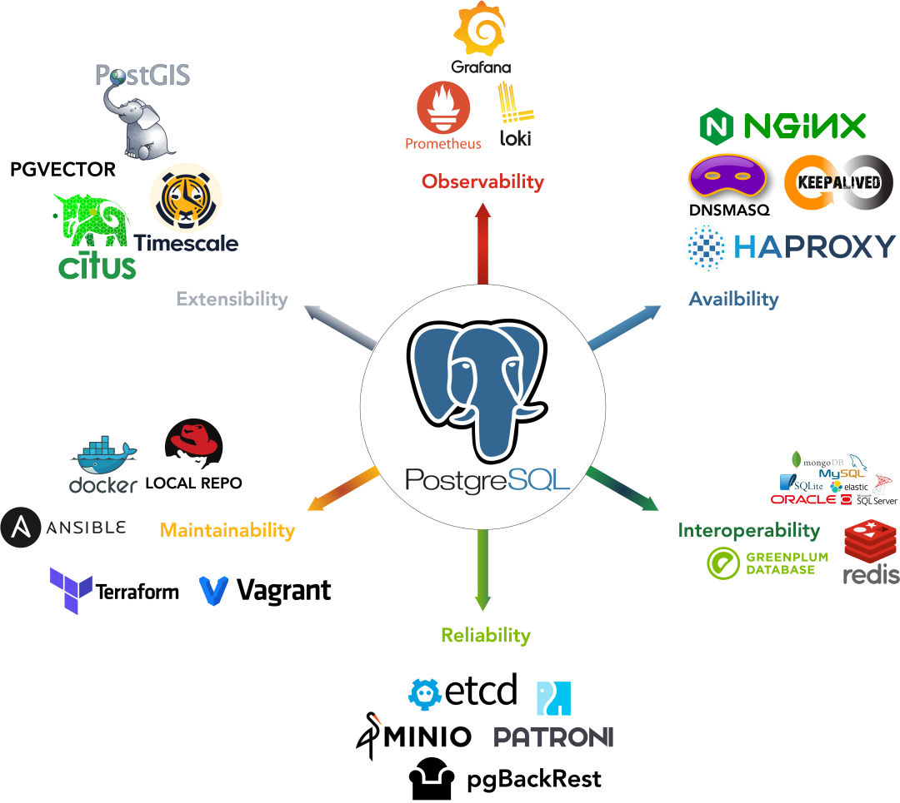

"**Vectors are the new JSON**" is an interesting statement in itself. Because **vectors** are a deeply studied **mathematical structure**, while **JSON** is a **data exchange format**. However, in the world of data storage and retrieval, both of these data representations have become the lingua franca of their respective domains, becoming (or about to become) essential elements in modern application development. If current trends continue, **vectors will become key elements in building applications, just like JSON**.

The generative AI boom has prompted developers to seek a simple way to store and query the **outputs** of these systems. For many reasons, PostgreSQL has become the most natural choice. But even the AI hype cannot change this fact: vectors are not a new data model — they have existed as a mathematical concept for hundreds of years, and the machine learning field has studied them for over half a century. The basic data structure of vectors — **arrays** — is taught in almost all introductory computer science courses. Even PostgreSQL's support for vector operations has a history of over 20 years!

> High school math knowledge: vector cosine distance and similarity

So what's new? It's the **accessibility** of AI/ML algorithms, and how to represent some "real-world" structures (text, images, audio, video) in vector form and store them for applications to implement useful functionality. Some might say that putting outputs from these AI systems (so-called "**embeddings**") into data storage systems isn't a new trick. So here we must emphasize again that the real new paradigm is **accessibility**: almost all applications can query and return this data (vector representations of text, images, audio, and video) in near real-time.

But what does this have to do with PostgreSQL? The relationship is huge! **Efficiently storing and retrieving vectors — this universal data type — can greatly simplify application development, keep related data in the same place, and let people continue using existing toolchains**. We saw this with JSON over a decade ago, and now we see it with vectors.

To understand why vectors are the new JSON, let's review what happened when JSON — the de facto standard for internet communication — emerged.

  

---------------

## A Brief History of JSON: PostgreSQL Implementation

During the "JSON rise" period, I was primarily an application developer. The systems I was building either sent JSON data to the frontend so it could perform some operation (like rendering an updatable component), or interacted with "modern" APIs that returned JSON-formatted data. The beauty of JSON lies in its simplicity (easy to read and manipulate) and strong expressiveness as a data exchange format. JSON indeed simplified communication between systems, from both development and operational perspectives. But I hoped to see something I liked in JSON — on the database side, I was a firm supporter of using **schemas**.

While JSON initially existed as an **exchange format**, people indeed asked "why can't I just store and query this stuff directly?" This question led to specialized data storage systems — that could be used to store and query JSON documents. I did try several different **specialized JSON storage systems** to solve problems in specific scenarios, but I wasn't sure if I wanted to introduce them into my application tech stack — for performance and maintainability reasons (I won't say which ones specifically, because over a decade has passed, times have changed). This raised a question — could JSON data be stored in PostgreSQL?

> PostgreSQL JSON feature matrix

I remember the eagerness I felt when attending PostgreSQL events — waiting for updates on PostgreSQL's native JSON storage and retrieval support. I remember how excited and happy I was when PostgreSQL 9.2 added text-based JSON type support. PostgreSQL's initial JSON support included validity checking for stored JSON content and some functions and operators for extracting data from JSON documents. There was no native index support then, but if you needed frequent queries based on a specific key in the document, you could still use the **expression index** feature to add indexes for keys you were interested in.

PostgreSQL's initial JSON support helped me solve some problems, specifically: taking snapshots of the state of several tables in the database, and recording outputs from APIs I interacted with. The initial text-based JSON data type had limited retrieval capabilities: you could indeed build expression indexes to use indexes based on specific keys in JSON documents, but in practice, I would still extract that key separately and put it in a separate column adjacent to the JSON.

The key point here is: PG's initial JSON support was still quite limited by "JSON database" standards. Yes, we could now store JSON and had some limited query capabilities, but to compete with specialized JSON databases on features, more work was clearly needed. However, for many such use cases, PostgreSQL was still **good enough**: **as long as it could work with existing application infrastructure, developers were willing to accept these limitations to some extent**. PostgreSQL was also the **first** relational database to provide JSON support, setting a trend that ultimately led to JSON entering the SQL standard.

> Russian PostgreSQL and Oleg contributed greatly to PG JSON features

The viability of PostgreSQL as a "JSON database" then underwent a qualitative change after PostgreSQL 9.4's release: this version added the **JSONB** type, a binary representation of the JSON data type, and could use GIN indexes to index arbitrary data in JSON documents. This allowed PostgreSQL to compete performance-wise with specialized JSON databases while retaining all the benefits of relational databases — though it took PostgreSQL several years to adapt to and support this type of application workload.

PostgreSQL's JSON support has continued to evolve over the past few years, and will certainly continue this development momentum as PostgreSQL continues to implement and adopt the SQL/JSON standard. I've talked with some PostgreSQL users who store dozens of TBs of JSON documents in PostgreSQL databases — users report excellent experiences!

The key to this story is that developers were willing to bet that PostgreSQL would have a competitive JSON storage system and were willing to accept the limitations of its initial implementation until more powerful and robust support emerged. This brings us to what we want to discuss — **vectors**.

---------------

## The Rise of Vectors: A New JSON

Vectors aren't new, but their popularity has recently skyrocketed. As mentioned earlier, this is thanks to the newly emerged **accessibility** of AI/ML systems, whose output results are **vectors**. A typical use case is building models on stored data (text, audio, video) and using models to convert them to vector format, then using them for "**semantic search**".

Semantic search works as follows: you convert input using a model to corresponding vectors and search the database for results most similar to this vector. **Similarity** is measured using **distance functions**: such as Euclidean distance or cosine distance. Results are usually sorted by distance and take the top K, i.e., the K most similar objects (K-NN, k nearest neighbors).

> Vector cosine distance is widely used to measure similarity between two entities

Encoding a "training set" into vectors using models takes a long time, so it makes sense to "cache" these encoding results in persistent data storage — such as databases — then you can run K-NN queries in the database. Having a set of prepared vectors in the database usually provides a better user experience for semantic search, which is where the idea of "vector databases" comes from.

> AI models uniformly encode various objects as vectors (floating-point arrays)

Storing vectors in PostgreSQL isn't new. PostgreSQL has had **array types** since it was first open-sourced in 1996! And has made countless improvements over the years. Actually, the **array** type name in PostgreSQL might be somewhat of a misnomer, because it can actually store **multidimensional** data (like matrices/tensors). PostgreSQL natively supports some array functions, though some common vector operations aren't among them, like calculating distances between two arrays. You could indeed write a stored procedure to do this, but that pushes the work to developers.

> PostgreSQL feature matrix: Array and Cube

Fortunately, the `cube` data type overcomes these limitations. cube has been in the PostgreSQL codebase for over 20 years and is designed to perform operations on high-dimensional vectors. cube includes most common distance functions used in vector similarity search, including Euclidean distance, and can use GiST indexes to perform efficient K-NN queries! But cube can only store vectors up to 100 dimensions, while many modern AI/ML systems have dimensions far exceeding this.

> ChatGPT Embedding API uses 1536-dimensional vectors

So, if **array** can handle vector **dimensionality** problems but doesn't solve vector **operation** problems; while **cube** can handle operations but can't handle dimensionality, what should we do?

---------------

## PGVECTOR: Open Source PG Vector Extension

**Extensibility** is one of PostgreSQL's cornerstone features: PostgreSQL provides interfaces for creating new data types and new index methods. This makes **pgvector** possible: an open-source PostgreSQL extension that provides an indexable `vector` data type. In short, pgvector allows you to store vectors in PostgreSQL and perform K-NN queries using various distance metrics: Euclidean distance, cosine, and inner product. So far, pgvector comes with a new index type `ivfflat`, implementing the IVF FLAT vector index.

When you use indexes to query vector data, things might be slightly different from the PostgreSQL data queries you're used to. Due to the high computational cost of performing nearest neighbor searches on high-dimensional vectors, many vector index methods choose to find "**approximate**" answers that are "close enough" to the correct result, bringing us into the realm of "approximate nearest neighbor search" (ANN). The focus of ANN queries is on **performance vs. recall trade-offs**, where "**recall**" refers to the percentage of relevant results returned.

> pgvector's recall/performance curves under various ANN Benchmark test sets

Let's take the ivfflat method as an example. When building an ivfflat index, you need to decide how many **lists** to have. Each **list** represents a "center," and these centers are determined using k-means clustering algorithms. After determining all centers, ivfflat calculates which center each vector is closest to and adds it to the index. When querying vector data, you also need to decide how many centers to check, determined by the `ivfflat.probes` parameter. This is the ANN performance/recall trade-off you see: the more centers you check, the more accurate the results will be, but the greater the performance overhead.

> The recall rate of the IVF FLAT index algorithm depends on the number of centers checked

Storing AI/ML outputs in "vector databases" has become popular, and pgvector already has plenty of usage examples. So here we'll focus on future development directions.

---------------

## Toward Tomorrow: Better Vector Support

Similar to the JSON situation in PostgreSQL 9.2, we're in the early stages of how to store vector data in PostgreSQL — while most of what we see in PostgreSQL and pgvector is quite good, it's about to get much better!

pgvector can already handle many common AI/ML data use cases — I've seen many users successfully use it to develop and deploy applications! — so the next step is to help it conquer the world. This isn't too different from the situation with JSON and JSONB in PostgreSQL, but pgvector being an extension will help it iterate faster.

> pgvector's Github Star growth accelerated in April 2023

At PGCon 2023, a PostgreSQL conference that gathered many internal developers, I gave a quick talk called "Vectors are the New JSON[1]," sharing use cases and challenges faced in improving PostgreSQL and pgvector vector data retrieval performance. Here are some problems that need solving (some are already being worked on!): including adding more parallelism mechanisms to pgvector, index support for vectors over 2000 dimensions, and using hardware to accelerate computation whenever possible. The good news is that adding these features isn't difficult — it just needs open source contributions!

Many people are interested in using PostgreSQL as a vector database (the key point is that PG is still a full-featured database!). I expect that just like JSON historically, the PostgreSQL community will find a way to support this emerging workload more safely and with easier scaling.

I look forward to your feedback — whether about PostgreSQL itself or pgvector, or about how you handle vector data in PostgreSQL, or how you'd like to handle data in PostgreSQL, because this will help the community provide the best support for vector queries.

> This article is translated from "VECTORS ARE THE NEW JSON IN POSTGRESQL[2]".
>
> Author: JONATHAN KATZ, Translator: Feng Ruohang

---------------

## Translator's Commentary

PostgreSQL has had sustained and stable high-speed growth over the past decade, evolving from a "relatively niche" database to the most popular, most loved, and most wanted database among developers worldwide today — quite a success story. PG's success has many factors: open source, stability, extensibility, etc. But I believe the **key move** here was **JSON** support. I personally was won over by PostgreSQL 9.4's powerful JSON functionality and decisively jumped ship from MySQL to embrace the light.

> PostgreSQL achieves database triple crown, with unstoppable momentum

Having JSON features made PostgreSQL equivalent to **MongoDB** and **MySQL** combined, perfectly catching the tailwind of the internet's second half. From DB-Engine popularity trends, you can also see that PostgreSQL began taking off right after releasing PostgreSQL 9.4 in 2014. The decade from 2013 to 2023 can be called PG's golden decade, with countless powerful new features and various extension plugins emerging, establishing PG's unshakeable position today.

> DB-Engine popularity trends, comprehensive index from search engines and websites

Looking ahead to the next decade, where will the database's next station be? This article provides the answer — **vectors**. Just like JSON, PostgreSQL always stands at the pinnacle of the times leading trends — becoming the **first** relational database to provide comprehensive vector support. I have full confidence in asserting: vector-based features will continue to drive PostgreSQL's high-speed growth over the next decade.

pgvector certainly won't be the endpoint for PostgreSQL's vector data processing, but it has set a benchmark for SQL vector processing. The PGVector project was created by Andrew Kane in April 2021, had a slow start for two years, then gained 4K stars in less than half a year starting from March-April this year. I can also proudly say that as a member of the PG community, I've contributed to this momentum and done some work.

We submitted pgvector to the PostgreSQL PGDG official repository, officially making it the de facto standard for PG vector extensions; we conducted performance evaluations, sparking major discussions about PGVector on Twitter; and the ready-to-use open-source RDS PG alternative Pigsty that we maintain was among the first **PostgreSQL distributions** to integrate and provide pgvector services.

> Pigsty consolidates PG ecosystem strength, providing users with open-source, free, ready-to-use local PostgreSQL RDS services

Currently, we're also working hard to improve pgvector's implementation, having implemented another mainstream vector index algorithm **hnsw**, which offers 20x performance improvements over IVFFLAT in some ANN scenarios while being fully compatible with the pgvector interface. It will be available as a preview in the upcoming Pigsty release.

Initial performance of the improved pgvector implementation under ANN-Benchmark

Most importantly, we believe in the power of the PostgreSQL community. We're willing to consolidate our efforts, work together toward the same goal, and jointly make PostgreSQL go faster and further, allowing PostgreSQL to achieve new glory in the AI era!

---------------

## References

[1] Vectors are the New JSON

[2] VECTORS ARE THE NEW JSON IN POSTGRESQL

[3] AI Large Models and Vector Database PGVECTOR

[4] PostgreSQL: The World's Most Successful Database

[5] Better Open Source RDS Alternative: Pigsty

[6] Pigsty v2.1 Release: Vector Extensions / PG12-16 Support