“**向量是新的JSON**”，这本身就是一种很有趣的说法。因为**向量**（Vector）是一种已经被深入研究过的**数学结构**，而 **JSON** 是一种**数据交换格式**。然而，在数据存储和检索的世界中，这两种数据表示方式都已经成为了各自领域的通用语言，成为（或即将成为）现代应用开发中必不可少的要素。如果按当下的趋势发展，**向量将会像 JSON 一样，成为构建应用时的关键要素**。

生成型AI 引发的热潮促使开发者寻找一种简便的方法来存储与查询这些系统的**输出**。出于很多因素，PostgreSQL 成为了最自然的选择。但即使是生成型AI 炒翻天也无法改变这一事实：向量并不是一种新的数据模式，它作为一种数学概念已经存在数百年了，而机器学习领域也对其已有半个世纪多的研究。向量的基础数据结构 —— **数组**，几乎在所有初级导论性质的计算机科学课程中都会讲授。连 PostgreSQL 对向量运算的支持也已经有20多年的历史了！

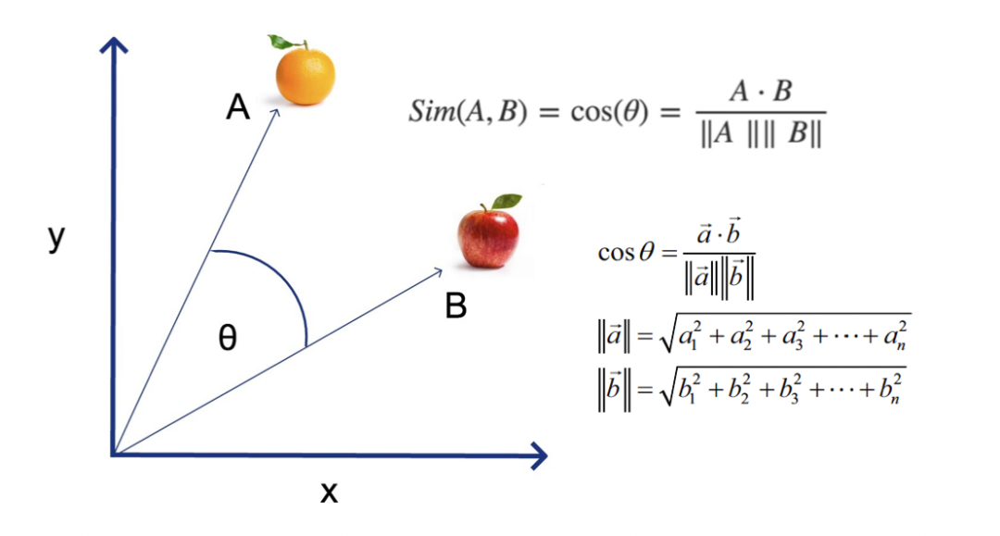

> 高中数学知识：向量的余弦距离与相似度

那有什么东西是新的呢？其实是 AI/ML 算法的 **易用性（Accessibility）**，以及如何将一些“真实世界”的结构（文本、图像、音频、视频）用向量的形式表示，并将其存储起来，以供应用实现一些有用的功能。有些人可能会说，把这些AI系统的输出（也就是所谓的“**嵌入 Embedding**”）放进数据存储系统中并不是什么新把戏。所以这里我们得再次强调，真正的新模式是 **易用性**：几乎所有应用都可以用这种近乎实时的方式查询并返回这些数据（文字图片音视频的向量表示）。

不过，这些与 PostgreSQL 有什么关系？那关系可大了！**高效存储检索向量 —— 这种普适泛用数据类型，可以极大地简化应用程序开发，让相关联的数据都存放在同一个地方，并让人们继续使用现有的工具链**。我们在十多年前的 JSON 上看到了这一点，现在我们在向量上也看到了这一点。

要理解为什么向量是新的 JSON，让我们回顾一下 JSON —— 互联网通信的事实标准，当 JSON 崭露头角时发生了什么？
  

---------------

## JSON 简史：PostgreSQL 实现

在 “JSON崛起” 期间，我主要还是一名应用开发者。我正在构建的系统，要么是将 JSON 数据发送到前端，使其可以完成某种操作（例如渲染一个可更新的组件），要么是与返回 JSON 格式数据的“现代”API交互。JSON 的好处在于其简单性（很容易阅读和操作），作为一种数据交换格式具有很强的表达力。JSON 确实简化了系统间的通信，无论是从开发还是运维的角度。但我是希望在JSON中看到一些我喜欢的东西 —— 在数据库这一侧，我是使用**模式**（Schemas）的坚定支持者。

虽然 JSON 最初是作为一种**交换格式**而存在的，但人们确实会问 “为什么我不能直接存储和查询这玩意？” 这个问题引出了一种专门的数据存储系统 —— 可以用来存储和查询 JSON 文档。我确实试过好几种不同的 **专用 JSON 存储系统**，来解决一个特定场景下的问题，但我并不确定我是否想把他们引入到自己的应用技术栈中 —— 出于性能与可维护性的原因 （我不会说具体是哪些，因为十多年过去，时过境迁了）。这就引出了一个问题 —— 能否在PostgreSQL中存储 JSON 数据？

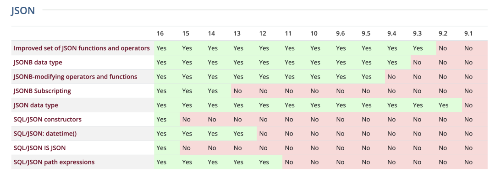

> PostgreSQL JSON 特性矩阵

我记得当年去参加 PostgreSQL 活动时的急切心情 —— 等待 PostgreSQL 对原生 JSON 存储检索支持的更新。我记得当 PostgreSQL 9.2 增加了基于文本的 JSON 类型支持时自己是多么的激动开心。PostgreSQL 对 JSON 最开始的支持是对所存储 JSON 内容的合法性校验，以及一些用于提取 JSON 文档数据的函数与运算符。那时候并没有原生的索引支持，但如果你需要根据文档中的某个 Key 进行频繁查询，还是可以使用 **表达式索引** 功能来为你感兴趣的 Key 添加索引。

PostgreSQL 对 JSON 的初步支持帮助我解决了一些问题，具体来说有：对数据库中几个表的状态做快照，以及记录我与之交互的 API 的输出。最初的基于文本的 JSON 数据类型在检索能力上乏善可陈：你确实可以构建表达式索引来根据 JSON 文档中的特定 Key 来走索引，但实践上我还是会把那个 Key 单独抽取出来放在与 JSON 相邻的单独列中。

这里的关键在于：PG 对 JSON 的初步支持以 “JSON数据库”的标准来看还是很有限的。没错，我们现在可以存储 JSON，也拥有了一些有限的查询能力，但要和专用 JSON 数据库拼功能，显然还需要更多的工作。不过对于许多这样的用例，PostgreSQL仍然已经是**足够好**了：**只要能和现有的应用基础设施一起使用，开发者还是愿意在某种程度上接受这些局限性的**。PostgreSQL 也是**第一个**提供 JSON 支持的关系型数据库，带了一波节奏，最终直接导致 JSON 进入到 SQL 标准中。

> 俄罗斯的 PostgreSQL 与 Oleg 对 PG JSON 特性居功至伟

紧接着 PostgreSQL 作为 “JSON数据库” 的可行性，在 PostgreSQL 9.4 发布后出现质变：这个版本新增了 **JSONB** 类型，这是 JSON 数据类型的二进制表示，而且可以使用 GIN 索引来索引 JSON 文档中的任意数据。这让 PostgreSQL 能在性能上与专用 JSON数据库旗鼓相当，同时还能保留有关系数据库的所有好处 —— 尽管适应并支持这类应用负载花费了 PostgreSQL 好几年的时间。

PostgreSQL 对 JSON 的支持在过去的几年中持续发展演进，随着PostgreSQL不断实现和采纳 SQL/JSON 标准，未来也一定会继续保持这种发展势头。我曾与一些 PostgreSQL 用户聊过，他们在 PostgreSQL 数据库中存了几十TB的 JSON 文档 —— 用户表示体验甚好！

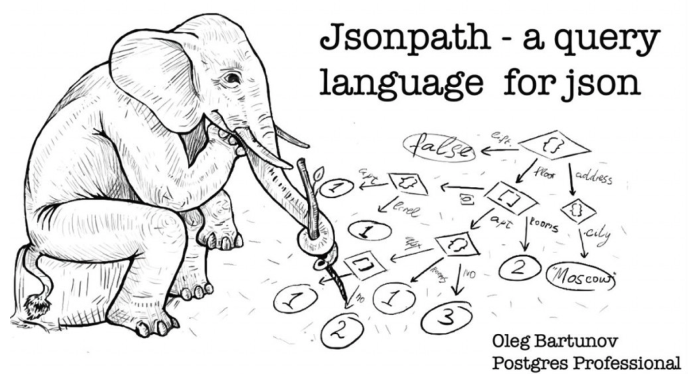

这个故事的关键是，开发者愿意押注 PostgreSQL 会拥有一个具有竞争力的 JSON存储系统，并愿意接受其最初实现的局限性，直到更为强大稳健的支持出现。这就引出了我们要讨论的 **向量**。

---------------

## 向量崛起：一种新 JSON

向量并不是新东西，但近来它们的流行度飙升。如前所述，这归功于AI/ML系统新涌现出的**易用性**，而这些系统的输出结果是**向量**。典型用例是在存储的数据（文本、声音、视频）上建立模型，并用模型将其转换为向量格式，然后用于“**语义搜索**”。

语义搜索工作原理如下：你把输入用模型转换为对应的向量，并在数据库中查找与此向量最为相似的结果。**相似度**使用**距离函数**进行衡量：比如欧式距离，或余弦距离，结果通常会按距离排序取 TOP K，即 K 个最为相似的对象（K-NN, k nearest neighbors）。

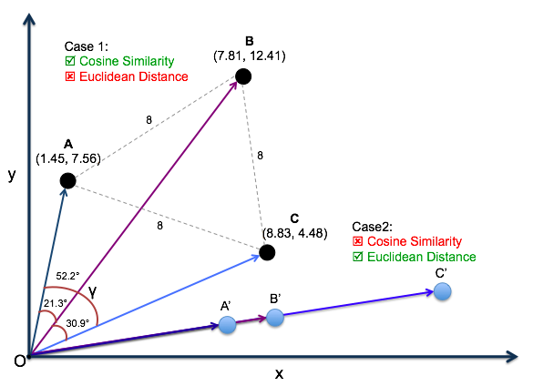

> 向量的余弦距离被广泛用于衡量两者的相似度

用模型将“训练集”编码为向量需要耗费很长的时间，所以把这些编码结果 “缓存” 在持久化数据存储 —— 比如说数据库中是有意义的，然后你就可以在数据库中运行 K-NN 查询了。事先在数据库里准备好一组备查的向量，通常会为语义搜索带来更好的用户体验，需要“向量数据库”的想法就是这么来的。

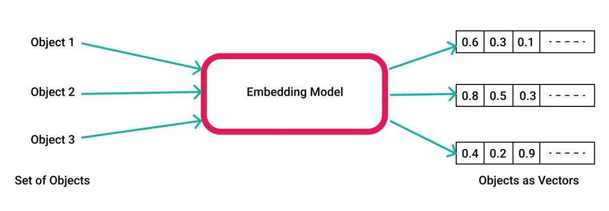

> AI模型将各种对象统一编码为向量（浮点数组）

在PostgreSQL中存储向量不是一件新鲜事儿。1996 年 PostgreSQL 首次开源时就已经带有**数组类型**（Array）了！而且多年来又进行了无数的改进。实际上，PostgreSQL 中 **数组** 类型名称可能有些用词不当，因为它其实可以存储**多维**数据（例如矩阵/张量）。PostgreSQL 原生支持了一些数组函数，不过有一些常见的向量运算不在其中，比如计算两个数组间的距离。你确实可以写个存储过程来干这个事，但这就是把活儿推给开发者了。

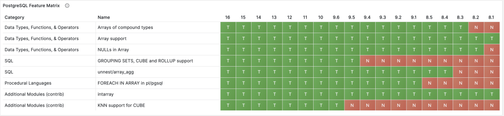

> PostgreSQL特性矩阵：数组与Cube

幸运的是，`cube` 数据类型克服了这些局限。cube 在PostgreSQL代码库中也已经有20多年了，并且是为在高维向量上执行运算而设计的。cube 包含了在向量相似性搜索中使用的大多数常见距离函数，包括欧几里得距离，而且可以使用 GiST索引来执行高效的 K-NN 查询！但是 cube 最多只能存储100维的向量，而许多现代AI/ML系统的维度远超这个数。

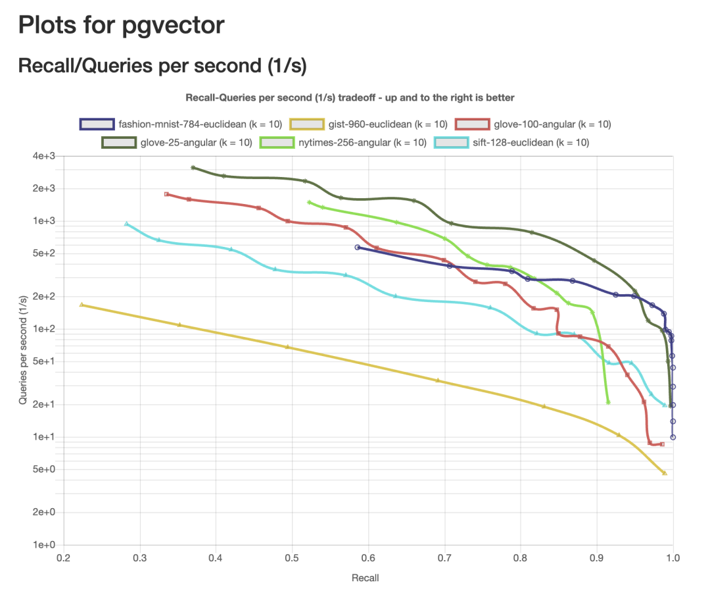

> ChatGPT Embedding API 使用 1536 维向量

那么，如果 **array** 可以搞定向量**维度**的问题但没有解决向量**运算**的问题；而 **cube** 可以搞定运算但搞不定维度，我们该怎么办？

---------------

## PGVECTOR: 开源PG向量扩展

**可扩展性** 是 PostgreSQL 的基石特性之一：PostgreSQL 提供创建新数据类型和新索引方法的接口。这让 **pgvector** 成为可能：一个开源 PostgreSQL 扩展，提供了一种可索引的 `vector` 数据类型。简而言之，pgvector 允许您在 PostgreSQL 中存储向量，并使用各种距离度量执行K-NN查询：欧式距离、余弦和内积。到目前为止，pgvector 带有一种新索引类型 `ivfflat`，实现了 IVF FLAT 向量索引。

当您使用索引来查询向量数据时，事情可能和您所习惯的 PostgreSQL 数据查询略有不同。由于在高维向量上执行最近邻搜索的计算成本很高，许多向量索引方法选择寻找与正确结果 “足够接近” 的 “**近似**” 答案，这将我们带入 “近似最近邻搜索”（ANN）的领域。ANN 查询的关注焦点是，**性能与召回率两个维度上的利弊权衡**，这里“**召回率（Recall）**”指的是返回相关的结果所占百分比。

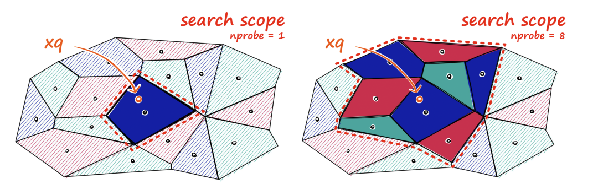

> pgvector 在 ANN Benchmark 各测试集下的召回率/性能曲线

让我们以 ivfflat 方法为例。构建 ivfflat 索引时，您需要决定有多少个 **list** 。每个 **list** 代表一个“中心”，这些中心会使用 k-means 聚类算法确定。确定所有中心后，ivfflat 会计算每一个向量最接近哪个中心点，并将其添加到索引中。当查询向量数据时，你还需要决定需要检查多少个中心，这由 `ivfflat.probes` 参数确定。这就是您所看到的 ANN性能/召回率权衡：你检查的中心越多，结果就会越精确，但性能开销就越大。

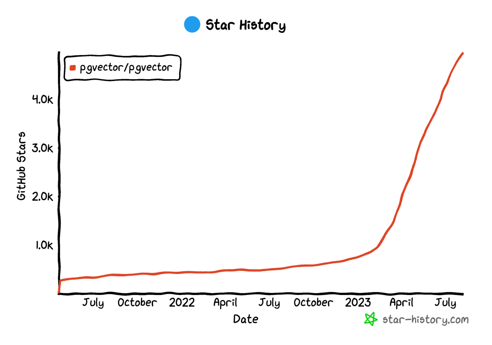

> IVF FLAT 索引算法的的召回率取决于检查的中心数量

把 AI/ML 的输出存入 “向量数据库” 已经很流行了，至于 pgvector 也已经有大把的使用样例。所以这里我们将关注重点放在未来的发展方向上。

---------------

## 迈向明天：更好的向量支持

与 PostgreSQL 9.2 版本中的 JSON 情况类似，我们正处于如何在 PostgreSQL 中存储向量数据的初级阶段 —— 虽然我们在PostgreSQL和 pgvector 中看到的大部分内容都很不错，但它即将要好得多！

pgvector 已经可以处理许多常见的 AI/ML 数据用例 —— 我已经看到许多用户成功地使用它开发部署应用！—— 因此下一步是帮助它打江山。这与 PostgreSQL 中的 JSON 和 JSONB 的情况没有太大区别，但 pgvector 作为一个扩展，将有助于它更快地迭代。

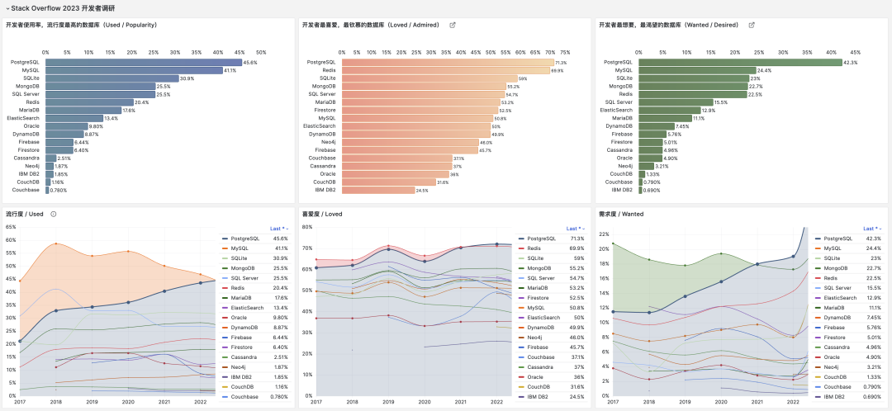

> pgvector 的 Github Star 增长在2023年4月出现加速

在 2023 年的 PGCon 上，这是一个聚集了许多内部开发者的 PostgreSQL 会议，我做了一个名为《向量是新的JSON[1]》的快速演讲，其中分享了使用案例，以及改进 PostgreSQL 和 pgvector 向量数据检索性能所面临的挑战。这是一些需要解决的问题（有些已经在做了！）：包括给 pgvector 添加更多并行机制，对超过 2000 维向量的索引支持，以及尽可能使用硬件来加速计算。好消息是添加这些功能并不难，只需要开源贡献！

许多人对于把 PostgreSQL 当成向量数据库这件事充满兴趣（重点是 PG 还是一个全能数据库！）。我预计正如历史上的 JSON 一样，PostgreSQL 社区会找到一种支持这种新兴工作负载的方法，更为安全，更容易伸缩扩展。

我期待您能提供各种反馈 —— 无论是关于PostgreSQL 本身还是 pgvector ，还是关于您如何在 PostgreSQL 中处理向量数据，或者您希望如何在 PostgreSQL 中处理数据，因为这将帮助社区为向量查询提供最佳的支持。

> 本文译自《VECTORS ARE THE NEW JSON IN POSTGRESQL[2]》一文。
>
> 作者 JONATHAN KATZ ，译者 Vonng

---------------

## 译者评论

PostgreSQL 在过去十年间有着持续稳定的高速增长，从一个"相对来说小众"的数据库，成为如今全世界开发者中最流行，最受喜爱，需求量最大的数据库，不可谓不成功。PG 成功的因素有很多，开源，稳定，可扩展，等等等等。但我认为这里的**关键一招**还是 **JSON** 支持。笔者本人就是在 PostgreSQL 9.4 为其强大 JSON 功能折服，果断从 MySQL 跳车弃暗投明。

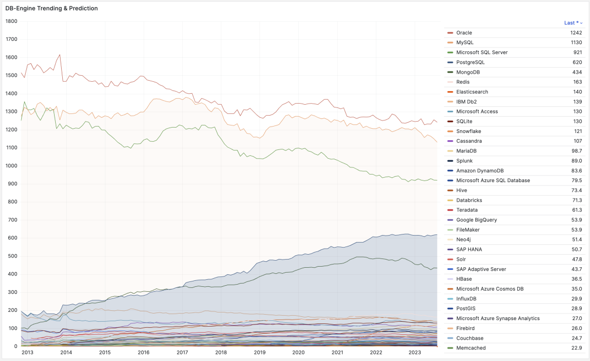

> PostgreSQL 获得数据库三项大满贯冠军，且势头一往无前

拥有了 JSON 特性的 PostgreSQL 等于 **MongoDB** 与 **MySQL** 合二为一，恰到好处地赶上了互联网下半场的风口。从 DB-Engine 热度趋势上也能看出，PostgreSQL 开始起飞的时间正是在 2014 年 发布 PostgreSQL 9.4 之后。2013 ～ 2023 这十年可以说是 PG 的黄金十年，无数强大的新功能与各式扩展插件喷涌而出，奠定了 PG 现今不可撼动的地位。

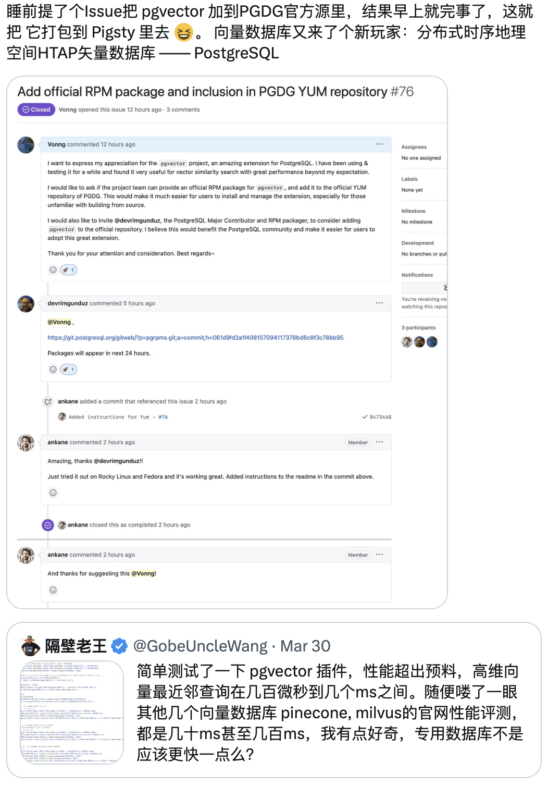

> DB-Engine 热度走势，来自搜索引擎与网站的综合指数

而放眼未来十年，数据库的下一站会是哪里？本文给出了答案 —— **向量**。正如同 JSON 一样，PostgreSQL 永远站在时代浪潮的巅峰引领潮流 —— 成为**第一个**提供全方位向量支持的关系型数据库。我有充足的把握断言：以向量为代表的功能将在接下来的十年中继续驱动 PostgreSQL 的高速增长。

pgvector 一定不会是 PostgreSQL 处理向量数据的终点，但它为 SQL 向量处理设定了一个标杆。PGVector 项目由 Andrew Kane 于 2021年4月创建，慢热了两年，而从今年三四月开始半年不到暴涨 4K star。而我也可以骄傲的说，作为 PG 社区的一员，我也在这里推波助澜，做了一些工作。

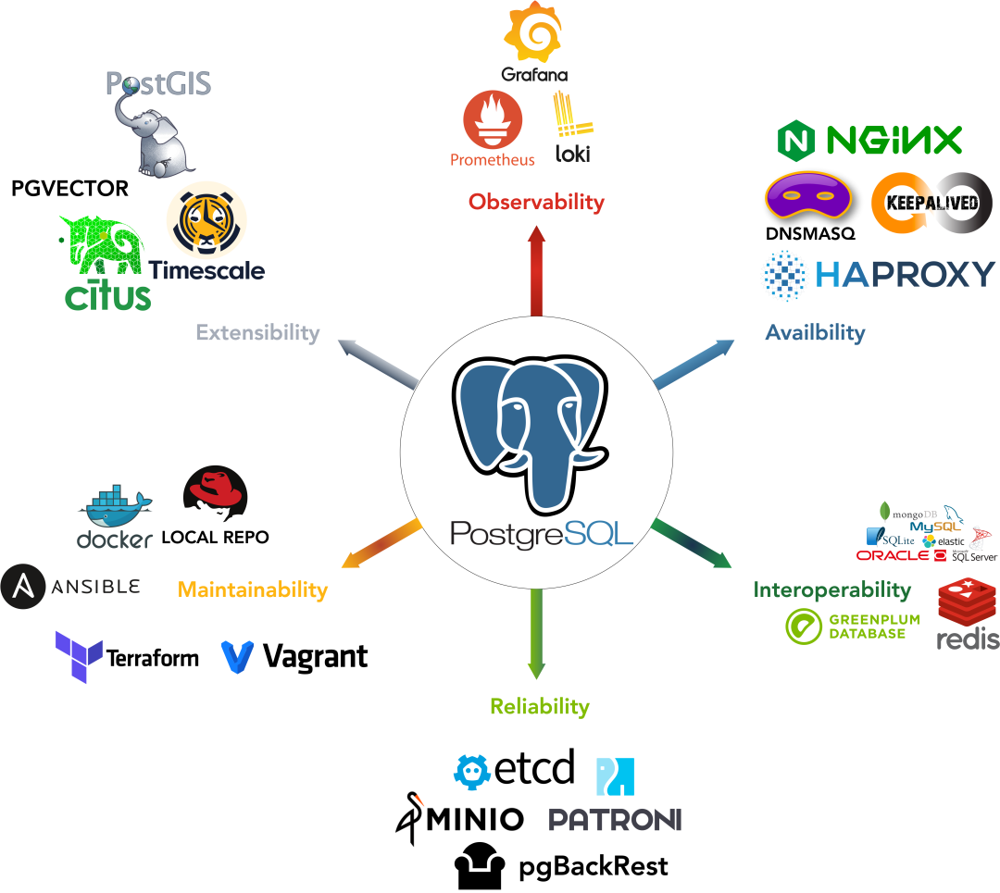

我们将 pgvector 提入 PostgreSQL PGDG 官方源，正式成为 PG向量扩展的事实标准；我们进行性能评测，引发了推上关于 PGVector 的大讨论；而我们所维护的开箱即用的开源 RDS PG 替代 Pigsty，则是第一波将 pgvector 集成整合提供服务的 **PostgreSQL 发行版**。

> Pigsty 凝聚 PG 生态合力，为用户提供开源免费开箱即用的本地 PostgreSQL RDS 服务

目前我们也在着力于改进 pgvector 的实现，实现了另一种主流向量索引算法 **hnsw**，在一些 ANN 场景下相比 IVFFLAT 有20倍的性能提升，而且完全兼容 pgvector 接口，并将于近期 Pigsty Release 提供预览。

pgvector 改进实现在 ANN-Benchmark 下的初步表现

最重要的是，我们相信 PostgreSQL 社区的力量，我们愿意凝聚合力，劲往一处使，共同让 PostgreSQL 走得更快、更远，让 PostgreSQL 在 AI 时代再创辉煌！

---------------

## References

[1] 向量是新的JSON

[2] VECTORS ARE THE NEW JSON IN POSTGRESQL

[3] AI大模型与向量数据库 PGVECTOR

[4] PostgreSQL：世界上最成功的数据库

[5] 更好的开源RDS替代：Pigsty

[6] Pigsty v2.1 发布：向量扩展 / PG12-16 支持