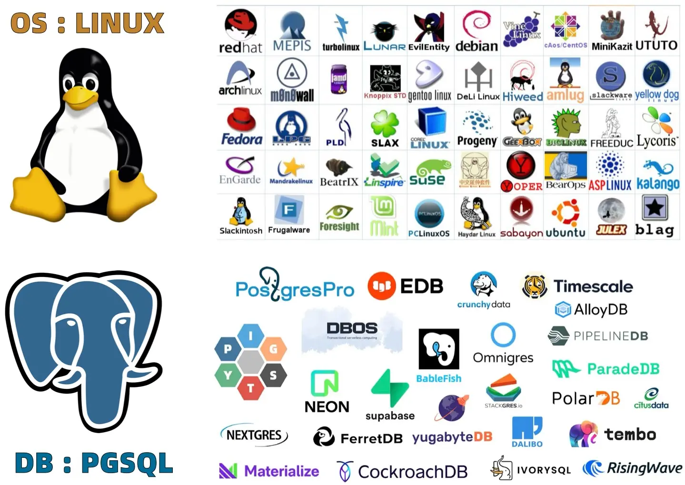
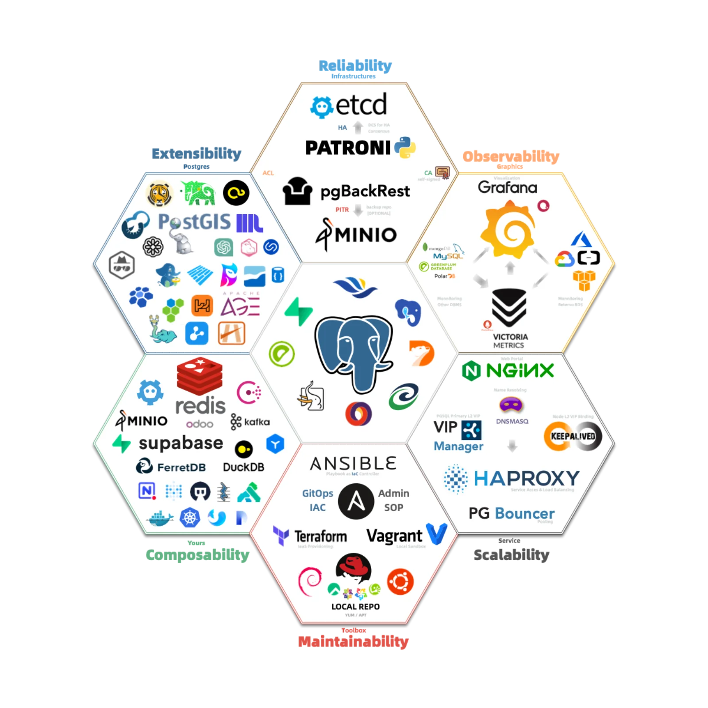
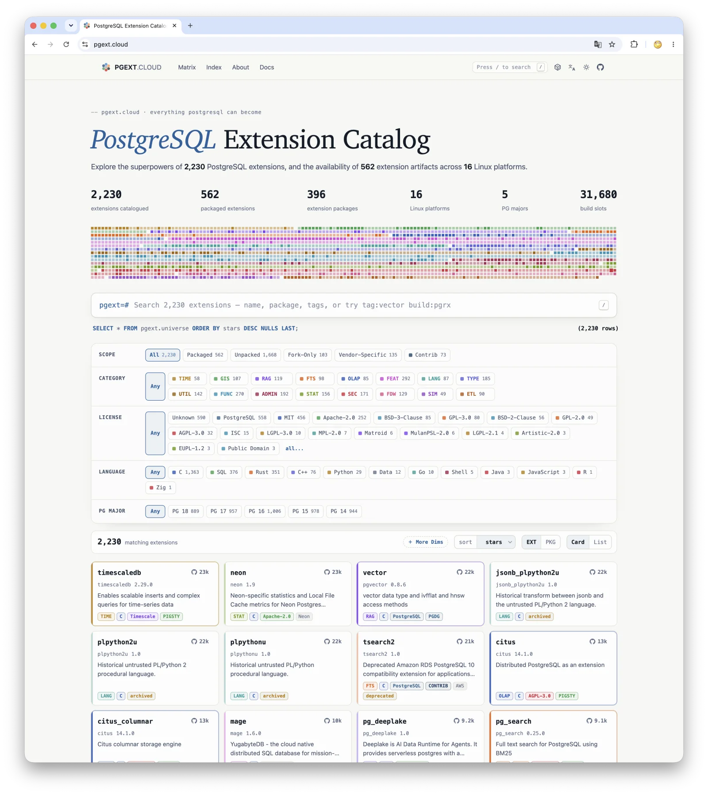
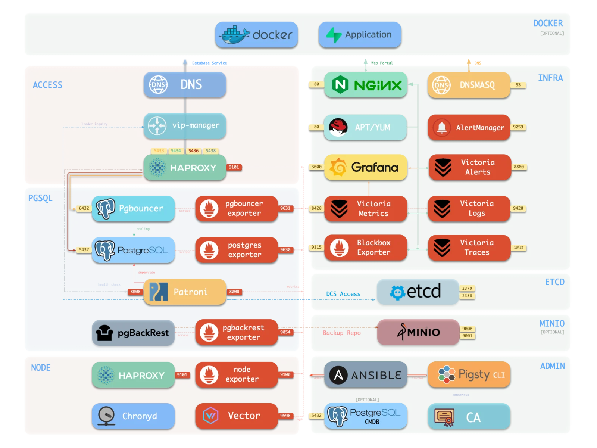
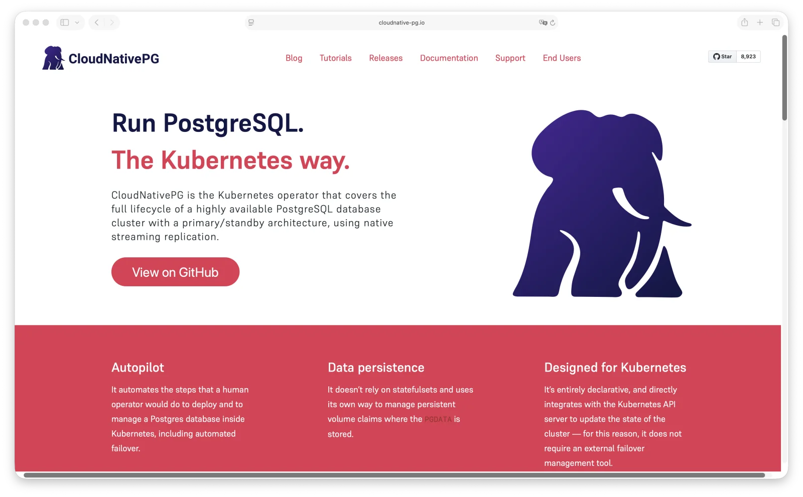
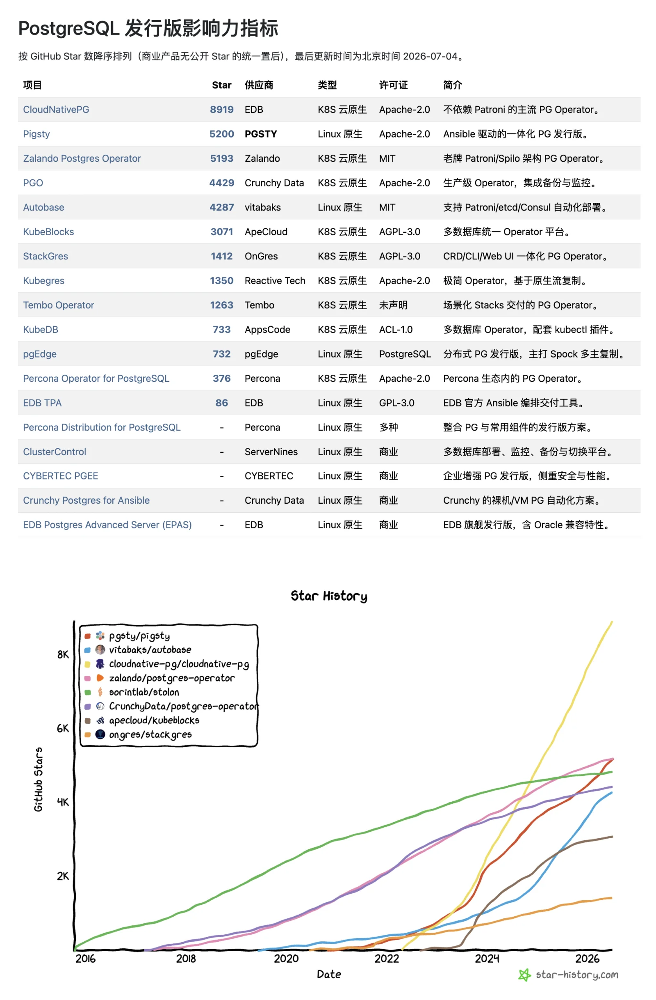
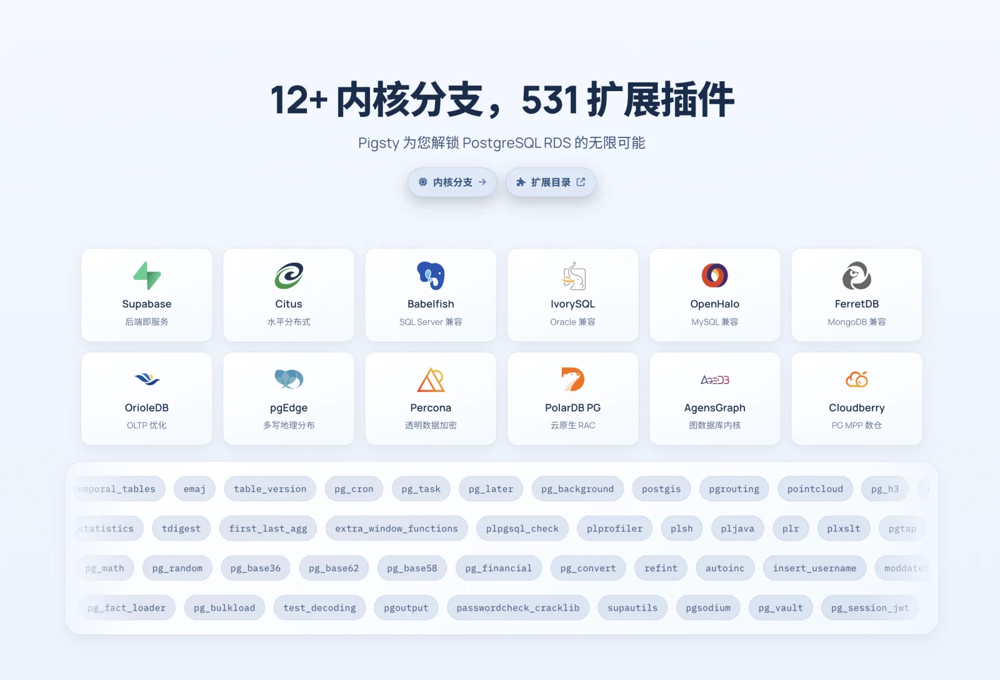

People often ask me: what exactly is [**Pigsty**](https://pigsty.io)?

My usual answer is: a PostgreSQL distribution.

The next question is usually: what, then, is a “PostgreSQL distribution”?

That is a good question. And the best place to begin is not databases, but operating systems.

--------

## I. Start with Linux Distributions

When most people hear “distribution,” they think of Linux distributions: Red Hat, Debian, Ubuntu, SUSE, Arch, and so on. But if Linux already exists, why do we need Linux distributions? What exactly is the relationship between the two?

The answer is simple: **Linus Torvalds only writes the kernel.**

Compile the Linux kernel and you still do not have a usable machine. There is no shell, init system, C standard library, coreutils, package manager, networking toolkit, user space, or security-update policy. The kernel schedules hardware and exposes system calls, but an industrial-scale gulf separates that from “a usable operating system.”

**Someone has to bridge that gulf, and there are countless ways to do it.** glibc or musl? systemd or OpenRC? apt, dnf, or pacman? A release every six months, or rolling releases? What should the default security policy be? How are packages signed? How are vulnerabilities patched? How long are versions maintained? Which services are enabled by default? The accumulated answers to those questions are what make a distribution.

A distribution, then, does not merely deliver a kernel. It delivers an integrated set of decisions—and the credibility of an organization willing to stand behind those decisions over time.

Nobody says Debian, Red Hat, and Ubuntu are competing with Linus over who writes the better kernel. They compete at a different task: turning a shared kernel into a system that is more reliable, consistent, and easier to ship.

The kernel is a commons; the distribution is industrialized delivery. The real value and competition sit not in the kernel, but in the distribution layer. Nobody competes with Linus to write a “better kernel,” yet Red Hat, Debian, and Ubuntu have spent three decades competing over how best to integrate that kernel into a usable system.

That is the key to understanding PostgreSQL distributions.

--------

## II. Apply the Analogy to PostgreSQL—Carefully

PostgreSQL is often described as the Linux kernel of the database world. But if you map the Linux analogy directly onto PostgreSQL, it breaks almost immediately.

PostgreSQL is not the Linux kernel. Compile PostgreSQL from source, run `initdb`, and it works. The SQL engine, transactions, MVCC, WAL, replication protocol, `psql`, and client libraries are all there.
The official PGDG repositories also ship prebuilt binaries that users can install and start directly.

The Linux kernel is not useful on its own, but the PostgreSQL kernel can run independently. That raises an obvious question: if PostgreSQL already works by itself, what problem is a PG distribution supposed to solve?



A standalone PostgreSQL instance is an excellent database kernel. A production system, however, needs more than “it starts.” If the primary fails, what takes over? Who notices when a backup is corrupt? Can you recover an accidentally deleted row to a specific point in time?
How does the connection pool redirect traffic? How are certificates rotated? How are metrics collected and alerts evaluated? How are extension versions managed? How is configuration drift corrected? How do upgrades work? How is a new replica provisioned? After recovery, what closes the loop and returns the system to a healthy steady state?

Neither `initdb` nor `yum install postgresql` answers those questions.

That is where a PG distribution earns its keep. It does not turn PostgreSQL into a usable database—PostgreSQL already is one. It integrates the PostgreSQL kernel into a production-ready data service.

--------

## III. The Three Layers of a PG Distribution

A serious PG distribution has at least three jobs: selection and integration, build and distribution, and orchestration and control.

All three matter, but their marginal value is not equal. The further down the list you go, the closer you get to the real battleground.

### 1. Selection and Integration: Make Decisions for the User

Production PostgreSQL is not a bare `postgres` process. You need backups, high availability, connection pooling, monitoring, logging, alerting, object storage, extensions, an access-control model, and sensible defaults. Every category offers a long list of choices.

For backups, you might use pgBackRest, Barman, WAL-G, `pg_basebackup`, or a hand-rolled script built on PostgreSQL's backup primitives.
For high availability, there is Patroni, repmgr, Pacemaker, or even Pgpool-II pressed into service for primary/standby failover. Monitoring might mean Prometheus, VictoriaMetrics, Grafana, Zabbix, or any number of combinations.



This layer tests a distribution author's judgment, experience, and sense of responsibility.
Being *opinionated* does not mean making arbitrary choices for users. It means having learned from enough failures to know which paths are sound—and which are better.

To be fair, differentiation at this layer is narrowing. Good tools used for long enough tend to produce community consensus: Patroni is increasingly hard to avoid for HA, pgBackRest for backups, and combinations such as Prometheus and Grafana for monitoring.
Selection still matters, but “I chose the right components” is no longer much of a moat by itself.

Choosing well is not enough. You also have to deliver those choices reliably.

### 2. Build and Distribution: A Supply Chain Is Trust, Not a Gimmick

The second layer is build and distribution. It is often underestimated because users see a package name, not the unglamorous work behind it: multiple operating systems, architectures, versions, and extensions; dependency resolution; ABI compatibility; GPG signing; CVE response; repository availability; and version lifecycle management.

PGDG already provides a formidable piece of public infrastructure. Its YUM and APT repositories deliver prebuilt PostgreSQL binaries, more than a hundred extensions, and several critical ecosystem components. It is an excellent commons.

Precisely because that commons is so good, differentiation at the build-and-distribution layer requires something more. Pigsty's own repository, for example, fills in a large part of the missing extension catalog—another 300 extensions—along with infrastructure packages. It ships native RPM and DEB packages across 16 Linux distributions and has been maintained continuously for almost four years.



Long-term credibility in packaging, fast patching, a stable supply chain, and a sustained track record of reliable maintenance do form a barrier—and that barrier compounds over time. But this is a defensive capability. It can make users comfortable basing production systems on your repository, yet by itself it rarely explains why they must choose you.

What truly separates a distribution from an “install some packages” script is the next layer: orchestration and control.

### 3. Orchestration and Control: Turn Static Packages into a Living System

The hardest part of a distribution is orchestration and control. Judgment about component selection is converging, while build and distribution are largely defensive. Orchestration and control are where implementations are tested against one another in the real world. The challenge fits into one sentence: **How do you turn all these static packages into a dynamically running service?**

Think of a software repository as a supplier of flour, eggs, and butter. It does not bake them into a cake. Even if every package comes with a detailed recipe—that is, documentation—you are still a long way from a finished cake. And some production systems do not merely need a cake; they need an automated cake factory.

**The gap between many established open-source distributions and cloud RDS offerings lies precisely in this last mile.** One gives you a collection of installed packages. The other sells a ready-to-use service with automated operations and self-healing. The indispensable step between them is orchestration.

Orchestration is the act of “cooking”: turning something static, like software on a DVD, into a live, dynamic system. It must handle everything the PostgreSQL kernel leaves behind after `initdb`, and everything a package repository never attempts to manage: which components start in what order and what depends on what; how a failed primary is detected, a new leader elected, traffic redirected, pooler connections reestablished, and a replacement replica provisioned—the entire closed loop of failure recovery; and, most importantly, how the whole system remains at its declared desired state and automatically corrects any drift.



Orchestration and control form a moat precisely because **there is no commons at this layer**. Nobody turns the flour and eggs into a cake for you. Every distribution has to do that work itself, and the difference in results is immediately obvious.

--------

## IV. Two Paths to Orchestration: Kubernetes-Native and Linux-Native

Once orchestration becomes the central problem, the question is: at what layer should the control plane live?

There are two mainstream answers, and they define the two principal tracks for PG distributions today. The essential distinction is **where orchestration and control are implemented**: one path builds on Kubernetes as a common substrate; the other returns to the Linux operating system and builds upward from there. Neither is universally better. They make different tradeoffs.

### Path One: Kubernetes-Native

This path treats the database as a first-class citizen on Kubernetes and uses the Operator pattern for orchestration. You submit a declarative custom resource defined by a CRD, and the Operator's reconciliation loop continuously drives actual cluster state toward the desired state. Provisioning, monitoring, failover, and scaling all happen at the Kubernetes layer.

This is currently **the busiest and most crowded** track. Its players include CloudNativePG, led by EDB, with roughly 8,900 stars and currently the leading PG Operator; the Zalando Postgres Operator, with about 5,200; Crunchy PGO, with about 4,400; KubeBlocks, with about 3,100; and a longer list including StackGres, Kubegres, Tembo, KubeDB, and the Percona Operator.

The advantages are clear: a unified control plane, a declarative API, smooth GitOps integration, and an easy interface for platform teams. For organizations that already treat Kubernetes as their operating system, putting databases on Kubernetes is a natural extension.

The cost is equally clear. You are not merely adding a PG Operator. You are adopting the entire Kubernetes control plane, storage and network abstractions, scheduling model, authorization model, failure model, and cognitive load. The real entry cost is not the Operator itself, but whether your organization has already paid the Kubernetes tuition.



### Path Two: Linux-Native

This path does not put the database inside Kubernetes. It returns to the operating system: run directly on Linux, on physical or virtual machines; install RPM or DEB packages; manage services with systemd; and drive administration with Ansible or a similar infrastructure-as-code tool.

There are fewer open-source players on this track: Pigsty, with roughly 5,200 stars; Autobase, with about 4,300; pgEdge, with about 700; and EDB TPA, with about 90. Alongside them is a full roster of **commercial distributions** without public star counts but with substantial enterprise weight: EDB Postgres Advanced Server—EDB's flagship and arguably the Red Hat of the PostgreSQL world—Percona Distribution, CYBERTEC PGEE, ClusterControl, and others.

The advantages are a shorter path, fewer dependencies, and closer proximity to the database itself. There is no extra abstraction layer, the failure domain is smaller, behavior is more predictable, and DBAs can understand and take over the system directly. The cost is that Kubernetes is no longer providing desired-state reconciliation, idempotent execution, failure recovery, or upgrade orchestration. You have to implement those capabilities yourself while also confronting the differences across more than a dozen major versions of mainstream Linux distributions. It is continuous, unglamorous work.

### Pigsty's Choice

Both paths are reasonable. The right one depends on where your team already stands and where it makes sense to place the complexity. Pigsty chose the Linux-native path. I have explained the reasoning at length in [Should Databases Be Deployed in Kubernetes?](/en/db/db-in-k8s/) and [Is Containerizing Databases a Good Idea?](/en/db/pg-in-docker/). My view is that this path better fits the nature of databases. It is difficult, but correct.

And on that difficult path, Pigsty has moved to the front of the pack. Measured by GitHub stars, it is now the leading Linux-native project, with 5,200 versus roughly 4,300 for Autobase. Across the entire PostgreSQL distribution landscape, including Kubernetes-native projects, it ranks second only to EDB's CloudNativePG.



Ask a mainstream AI model today, “How should I self-host an enterprise-grade PostgreSQL service on Linux?” and Pigsty is generally its first recommendation. For a project led by an independent developer and unaffiliated with any cloud vendor, reaching that point has not been easy.

--------

## V. One Step Further: A Meta-Distribution

The story could end there. But Pigsty does something else that pushes at the boundary of the term “PG distribution.”

The industry usually assumes that **a distribution is built around one fixed kernel**. Debian and Red Hat are built around Linux. Traditional PG distributions are built around the vanilla PostgreSQL kernel. A distribution and its kernel are almost inseparable.

The PostgreSQL world, however, contains some unusual variants. OrioleDB replaces the storage engine. Babelfish adds SQL Server protocol compatibility. PolarDB for PostgreSQL implements a RAC-style architecture. IvorySQL supports Oracle syntax. openHalo is MySQL-compatible, while Percona TDE adds transparent encryption. These projects modify the PG kernel. Strictly speaking, they are no longer “pure PostgreSQL,” but distinct species and subspecies within the PG-compatible family. Traditionally, every variant would need to build its own operational stack.

Pigsty takes another approach: **extract the orchestration and control foundation, and make the kernel itself a replaceable layer.** This is the natural consequence of taking the third layer far enough. Once the control plane is sufficiently flexible and no longer hard-wired to a specific kernel, replacing that kernel becomes a matter of swapping a build artifact and a configuration template. We build binary packages and provide configuration templates for these different PG forks, allowing users to run different kernels on the same foundation. Pigsty currently supports more than 12 kernels.

In that sense, Pigsty is no longer merely a “PostgreSQL distribution.” You can use it to derive a distribution of your own: an IvorySQL distribution, a PolarDB distribution, or a TDE distribution. By combining modules, you can even turn it into a distribution for Redis, Etcd, or MinIO; for Prometheus or VictoriaMetrics; or even for Claude Code and Codex.



More precisely, it is a **meta-distribution**: a distribution for building distributions. A foundation that can be repeatedly tailored, reused, and redistributed is itself a transferable capability. It no longer belongs to one kernel, or to one person.

```bash
./configure                     # Use the meta.yml configuration template by default
./configure -c meta             # Explicitly use the single-node meta.yml template
./configure -c rich             # Use the full-featured template with all extensions and MinIO
./configure -c slim             # Use the minimal single-node template with only a PG HA cluster

# Use different database kernels
./configure -c pgsql            # Vanilla PostgreSQL, with 531 optional extensions (14–18)
./configure -c mssql            # Babelfish kernel, compatible with the SQL Server protocol (17)
./configure -c polar            # PolarDB PG kernel, Aurora/RAC-style (17)
./configure -c ivory            # IvorySQL kernel, compatible with Oracle syntax (18)
./configure -c mysql            # openHalo kernel, compatible with MySQL (14)
./configure -c pgtde            # Percona PostgreSQL Server with transparent encryption (18)
./configure -c oriole           # OrioleDB kernel with OLTP enhancements (16–18)
./configure -c agens            # AgensGraph graph-database kernel (16)
./configure -c pgedge           # pgEdge distributed-database kernel (18)
./configure -c ha/citus         # Distributed, highly available PostgreSQL with Citus (14–18)
./configure -c supabase         # Self-hosted Supabase configuration (15–18)

# Use multi-node high-availability templates
./configure -c ha/dual          # Use the two-node HA template
./configure -c ha/trio          # Use the three-node HA template
./configure -c ha/full          # Use the four-node HA template
./configure -c infra            # Install only monitoring infrastructure and Nginx, for observability and web hosting
./configure -c vibe             # Configure a Claude/Codex + PGFS/Code development environment
```

--------

## Epilogue: A Distribution Is a Supply Chain of Trust

Return to the original question: what is a PostgreSQL distribution?

At the technical level, it has three core jobs. Selection and integration make the right decisions on your behalf. Build and distribution deliver the artifacts created by those decisions. Orchestration and control turn those static packages into a living, self-healing system.

But the real soul of a distribution lies beneath those three technical layers.

Technology can be copied. Component choices can be imitated, packages can be rebuilt, and anyone willing to invest enough time can reproduce 70 or 80 percent of the orchestration. Two things cannot be copied—and determine whether a distribution can be trusted for the long term: **a community that continues to use and maintain it, and the trust that grows from that work over time.**

Users do not merely need an answer to “Which package should I install?” They need answers to harder questions. Whose packages do I trust? Whose defaults? Whose extension builds? Whose HA decisions and backup-recovery process? Who patches a CVE promptly? Who will still maintain this path five years from now? When configuration drifts, a failover occurs, a version is upgraded, or data must be restored—at the moments that matter most—who can bring the entire system back under control?

The answers point not to a piece of code, but to **the person and community that continue to take responsibility for it**. The essence of a distribution is to gather responsibilities scattered across source code, builds, signatures, repositories, extensions, configuration, orchestration, monitoring, upgrades, and disaster recovery into a supply chain of trust that can be verified, reproduced, audited, and relied upon over the long term. Trust accumulates as promises made along that chain are honored again and again. It cannot be bought or copied. Only a community can grow it over time.


Cloud services provide trust too, but they hide the chain inside a black box. You buy managed trust, while surrendering transparency, portability, and ultimate control. You trust the cloud vendor to choose the right components, apply patches, maintain backups, handle failures, and plan upgrades. You also trust it not to box you in on pricing, access, ecosystem control, compliance, or availability. That is still trust. Its price is that you can no longer inspect or take over the chain yourself.

Pigsty takes another path. It does not mystify complexity or outsource responsibility to an invisible control plane. It makes the chain visible, codifies it, signs it, orchestrates it, and returns as much control as possible to the user. Pigsty is therefore not a “tool for installing PostgreSQL,” nor merely a “script for building your own RDS.” It aims to deliver an **open PostgreSQL supply chain of trust**: from the upstream kernel to extension artifacts, from RPM and DEB repositories to HA orchestration, from monitoring and alerting to backup and recovery, and from a single PG kernel to the entire family of PG-compatible kernels. Every link can be verified, and every link can be brought under the user's control. Behind it stands a community willing to maintain it for the long term.

What Linux distributions ultimately accumulated was never just the technical ability to integrate a kernel into a system. It was the credibility earned by names such as Debian and Red Hat through decades of simply continuing to be there. Pigsty aims to grow that same kind of trust in the PostgreSQL world—and to keep it open, auditable, and under the user's control.

A real distribution ultimately delivers not software, but a supply chain of trust that can be audited, reproduced, migrated, and relied upon for the long term—together with a community willing to stand behind it.

No rented cloud. No vendor worship. No putting complexity—or trust—inside anyone else's black box.

Instead, put the ability to run a first-rate production database service back in the hands of users willing to run it themselves—along with a community willing to support it for the long haul.
