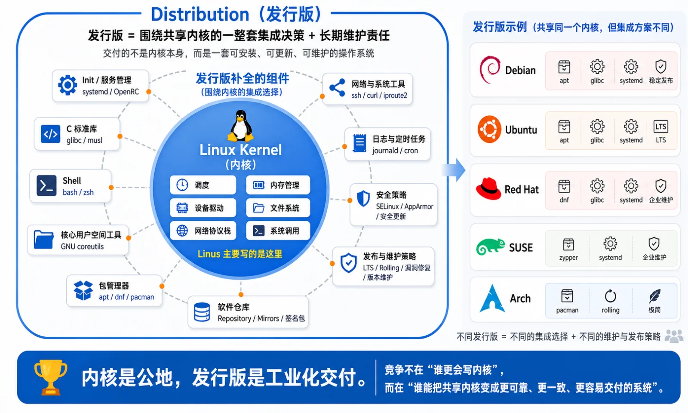
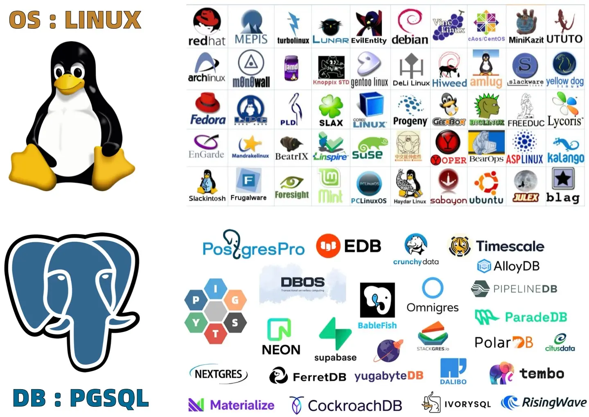
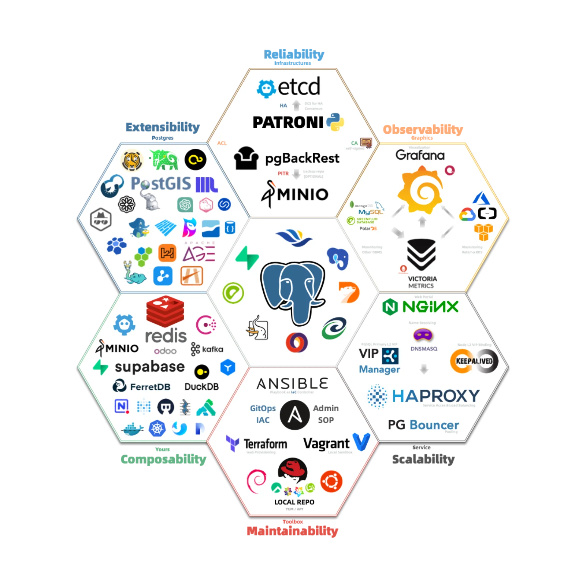
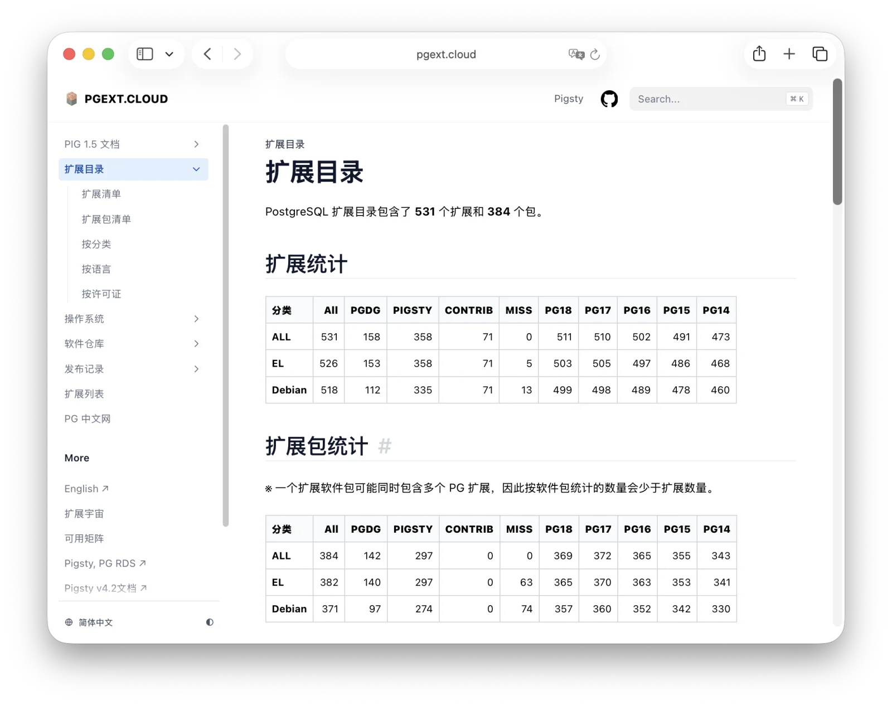
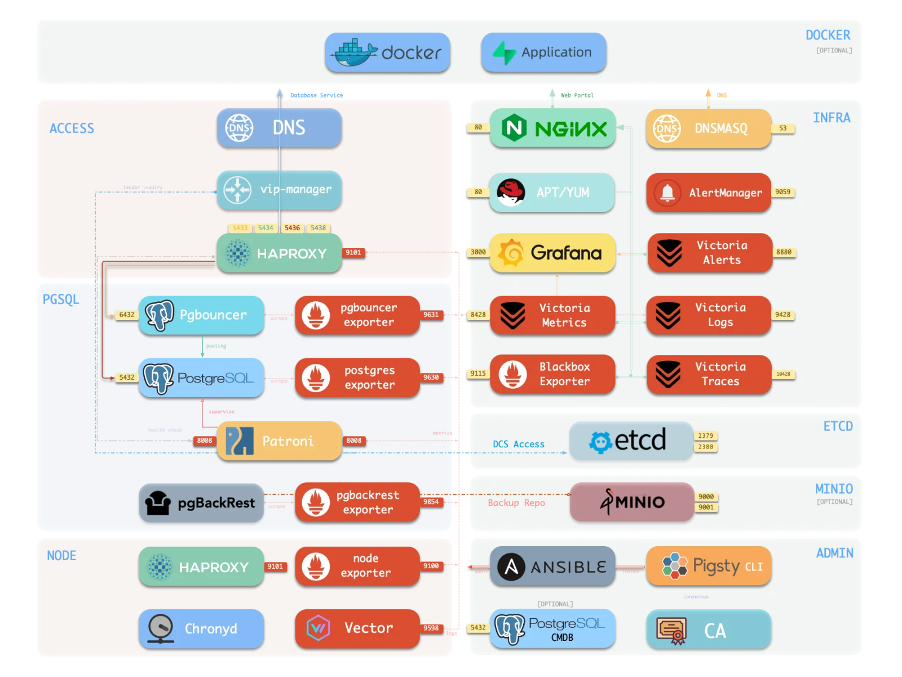
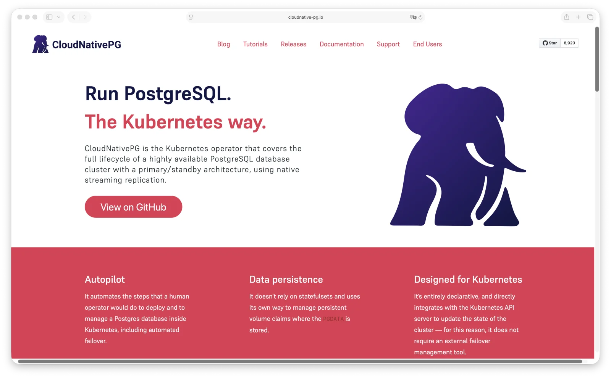
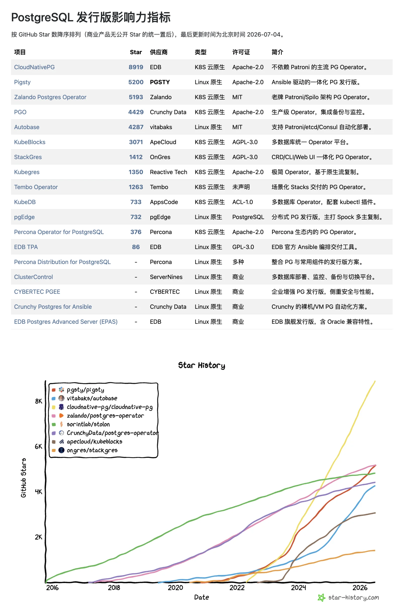
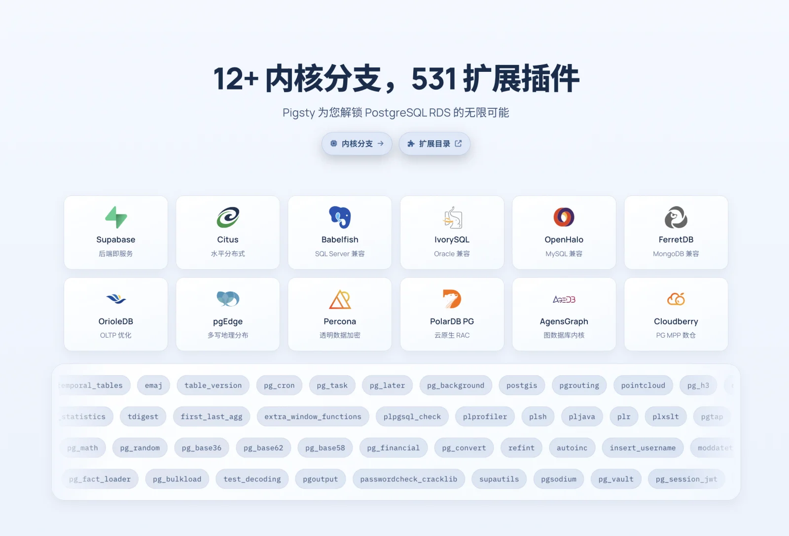

经常有人问我：[**Pigsty**](https://pigsty.cc) 到底是什么？我通常回答：PostgreSQL 发行版。

通常下一个问题就是：那 “PostgreSQL 发行版” 又是什么？

这是个好问题。而要把它讲清楚，最好的切入点不是数据库，而是操作系统。


--------

## 一、从 Linux 与操作系统发行版说起

说起 Distribution（发行版），绝大多数人第一反应都是 Linux 发行版 —— Red Hat、Debian、Ubuntu、SUSE、Arch…… 但问题是：既然已经有 Linux，为什么还需要 Linux 发行版？两者到底是什么关系？

答案很简单：**Linus Torvalds 只写内核。**

你把 Linux Kernel 编译出来，得到的不是一台能用的机器。你没有 Shell，没有 init 系统，没有 C 标准库，没有 coreutils，没有包管理器，没有网络工具，没有用户空间，也没有安全更新策略。内核负责调度硬件和提供系统调用，但它和 “一台能用的操作系统” 之间，隔着一整条工业化鸿沟。

**这条鸿沟必须有人来填，而填的方式有无数种**。用 glibc 还是 musl？用 systemd 还是 OpenRC？用 apt、dnf 还是 pacman？半年一版还是滚动更新？默认安全策略是什么？包怎么签名？漏洞怎么修？版本怎么维护？哪些服务默认启用 —— 这些选择叠在一起，才构成一个发行版。



所以，发行版交付的不是内核。发行版交付的是一整套集成决策，以及对这套决策长期负责的信用。

没有人会说 Debian、Red Hat、Ubuntu 是在和 Linus 竞争谁更会写内核。它们竞争的是另一件事：谁能把共享内核变成更可靠、更一致、更容易交付的系统。

内核是公地，发行版是工业化交付。真正的价值与竞争不在内核，而在发行版上。没有人去和 Linus 竞争 “谁写的内核更好”，但 Red Hat、Debian、Ubuntu 在 “如何把内核集成为一套可用系统” 这件事上，打了整整三十年。

这正是理解 PostgreSQL 发行版的钥匙。


--------

## 二、搬到 PostgreSQL：相似，但不相同

PostgreSQL 可以说是数据库世界的 Linux 内核，但如果直接把 Linux 这套逻辑搬到 PostgreSQL 上，第一步就会撞墙。

PostgreSQL 不是 Linux Kernel。PostgreSQL 源码编译出来之后 `initdb` 一下就能跑。SQL 引擎、事务、MVCC、WAL、复制协议、`psql`、客户端库，核心能力都在。
PGDG 官方仓库也直接交付构建好的二进制制成品，用户直接安装拉起来就能用。

Linux 内核不能直接用，但 PostgreSQL 的内核是可以独立运行的。这就带来一个尖锐问题：既然 PostgreSQL 自己已经能跑，PG 发行版到底还要解决什么问题？



单机 PostgreSQL 是一个优秀的数据库内核。但生产系统要的不只是 “它能跑起来”，而是：主库挂了谁接管？备份坏了谁发现？误删数据能不能恢复到某个时间点？
连接池怎么切流量？证书怎么轮换？监控指标怎么采？告警怎么判定？扩展版本怎么管？参数漂移怎么拉回来？升级怎么做？新副本怎么补？故障恢复之后谁把系统收口？
这些都不是 `initdb` 和 `yum install postgresql` 能解决的问题。

PG 发行版的价值，就在这里。它不是把 PostgreSQL 变成可用的数据库系统（它本来就能用），而是把 PostgreSQL 内核集成为一套可生产运行的数据服务。


--------

## 三、PG 发行版的三层工作

一个像样的 PG 发行版，至少要做好三件事：选择与集成、构建与分发、编排与管控。

这三层都重要，但它们的边际价值并不一样。越往后，越接近真正的战场。

### 1. 选择与集成：替用户做决定

生产 PostgreSQL 不是一个裸 `postgres` 进程。你要备份，要高可用，要连接池，要监控，要日志，要告警，要对象存储，要扩展，要权限模型，要默认参数 —— 每一个位置都有一堆选项。

备份可以用 pgBackRest、Barman、WAL-G，也可以用 `pg_basebackup`，甚至用 PG 备份原语手搓脚本。
高可用可以用 Patroni、repmgr、Pacemaker，甚至有人拿 PgPool 做主从切换。监控可以是 Prometheus、VictoriaMetrics、Grafana、Zabbix，随便排列组合都能拼出一套东西。



所以这里考验的是发行版作者的品味、经验和责任感。
所谓 opinionated，不是拍脑袋替用户做主，而是你踩过足够多的坑，知道哪些路是正确的、更优的。

不过平心而论，这一层的价值正在收敛。好东西用久了，社区会形成共识：高可用越来越绕不开 Patroni，备份越来越绕不开 pgBackRest，监控越来越绕不开 Prometheus / Grafana 这类组合。
选型仍然重要，但单靠 “我选了正确组件” 已经很难形成护城河。

光会选型还不够，还要能可靠地交付。

### 2. 构建与分发：供应链是信任，不是噱头

第二层是构建与分发。这层经常被低估，因为用户只看到一个包名，很少看见后面那堆脏活：多系统、多架构、多版本、多扩展、依赖解析、ABI 兼容、GPG 签名、CVE 响应、仓库可用性、版本生命周期。

PGDG 已经做了一块很强的公共基础设施。PGDG 提供了 YUM 和 APT 仓库，提供预制的 PostgreSQL 内核、一百多个扩展，和一些关键的生态组件 —— 这是一块极好的公地。

也正因为这块公地已经很好，你要在构建分发层做出差异，就必须提供额外增量。比如 Pigsty 自己的仓库补齐了大量 PostgreSQL 扩展（额外的 300 个）和基础设施软件包，在 16 个 Linux 操作系统上提供原生的 RPM / DEB 包，已经持续维护了快四年。



打包背后的长期可信、快速修补、稳定供应链，以及长时间维护积累的可靠性战绩与历史信用，确实是一种壁垒，而且随时间沉淀累积。但这是一种守成能力：它能让用户放心把生产系统放在你的仓库上，却很难单独解释为什么用户非你不可。

真正把发行版和 “装包脚本” 拉开差距的，是下一层 —— 编排与管控。

### 3. 编排与管控：把静态包变成活系统

发行版中真正的硬骨头，其实是编排与管控。选型品味在收敛，构建分发只能守成，而编排与管控，是所有玩家真刀真枪见高下的地方。它的难点，一句话就能说清：**如何让这些 “静态的包”，变成 “动态运行的服务”？**

打个比方：软件仓库只负责给你面粉、鸡蛋和黄油，但如何把它们烹饪成一个蛋糕，仓库是不管的。哪怕再随包附赠一份详尽的食谱（也就是文档），离一个真正出炉的成品蛋糕，也还差着十万八千里 —— 更别提有的生产系统其实要的甚至是自动生产蛋糕的流水线了。

**许多老牌开源发行版和云上 RDS 之间的差距，恰恰就落在这最后一步。** 前者给你一堆装好的包，后者卖给你一个开箱即用、自动运维、故障自愈的服务。中间隔着的，正是 “编排” 这道谁都替代不了的工序。

这个 “烹饪” 的动作，就是编排（Orchestrating）—— 把一个静态的、类似 DVD 光盘介质的东西，变成一个运行时的、动态的、活的系统。它要操心的，全是 `initdb` 之后 PG 内核撒手不管、仓库也从不负责的那些事：一堆组件按什么顺序拉起、谁依赖谁；主库挂了怎么自动检测、选主、切流量、让连接池重连、把新副本补齐 —— 这一整条故障自愈的闭环；以及最关键的，如何让整个系统始终维持在你声明的那个目标状态，一旦漂移就自动拉回来。



编排与管控这一维之所以是护城河，恰恰因为它 **没有公地**。没人替你把 “面粉鸡蛋” 变成 “蛋糕”，这活儿只能各家自己干，干得好坏，差距高下立判。


--------

## 四、编排的两条路：K8s 原生与 Linux 原生

既然关键是编排，那么问题就变成：你把这套控制平面放在哪一层？

主流的答案有两条，它们构成了今天 PG 发行版最主要的两条赛道。分野的实质是 **你选择在哪一层实现编排与管控**：一条基于 Kubernetes 提供的公共底座，一条回到 Linux 操作系统本身从头构建。这两条路没有绝对的优劣，只有不同的利弊权衡。

### 赛道一：Kubernetes（云原生）

这条路把数据库当作 Kubernetes 上的一等公民，用 Operator 模式来编排。你写一份声明式的 CRD，Operator 通过它的控制器循环（reconcile loop），持续地把集群的现实状态收敛到你声明的目标状态 —— 拉起、监控、故障切换、扩缩容，都在 K8s 这一层完成。

这是目前 **最拥挤、也最热闹** 的赛道，玩家云集：CloudNativePG（EDB 主导，约 8900 Star，如今最主流的 PG Operator）、Zalando Postgres Operator（约 5200 Star）、Crunchy PGO（约 4400 Star）、KubeBlocks（约 3100 Star），以及 StackGres、Kubegres、Tembo、KubeDB、Percona Operator 等一长串。

这条路的优点很清楚：统一控制平面，声明式 API，GitOps 友好，平台团队容易接入。对那些已经把 Kubernetes 作为组织级操作系统的团队来说，数据库上 K8s 是自然延伸。

但代价也同样清楚：你不只是引入一个 PG Operator，你是在引入 Kubernetes 这整套控制平面、存储抽象、网络抽象、调度模型、权限模型、故障模型和心智负担。这条路真正的门槛，不在 Operator 本身，而在你是否已经为 Kubernetes 付过了那笔学费。



### 赛道二：Linux 原生（原生操作系统）

这条路不把数据库塞进 Kubernetes，而是回到操作系统本身：直接跑在 Linux 上，运行于物理机或虚拟机环境，安装 RPM / DEB 包，通过 systemd 管理服务，使用 Ansible 或者类似的 IaC 工具发起管理。

这条赛道的开源玩家要少一些：Pigsty（约 5200 Star）、Autobase（约 4300 Star）、pgEdge（约 700 Star）、EDB TPA（约 90 Star）。此外还站着一整排没有公开 Star、但在企业市场分量十足的 **商业发行版**：EDB Postgres Advanced Server（EDB 旗舰，堪称 PG 世界的 Red Hat）、Percona Distribution、CYBERTEC PGEE、ClusterControl 等等。

这条路的优点是路径短，依赖少，离数据库本体更近，中间没有额外的抽象层，故障域更小，行为更可预测，也更容易被 DBA 直接理解和接管。它的代价则是：没有 K8s 替你处理状态收敛、幂等执行、故障恢复、升级编排，你得自己想办法实现，还要直面十几种主流发行版大版本之间的差异 —— 这是一份持续的、并不性感的苦役。

### Pigsty 的选择

两条路各有其合理性，选择哪条取决于你的团队已经站在哪里、把复杂度放在哪里更划算。Pigsty 选择了 Linux 原生这条道路，理由我在《[数据库是否应该放入 K8S 中](/db/db-in-k8s/)》和《[容器化数据库是个好主意吗？](/db/pg-in-docker)》里已经充分阐述过了 —— 我认为对于数据库来说，这是一条更贴合本质、艰难但正确的道路。

也正是在这条艰难的路上 —— Pigsty 跑在了前沿。如果看开源影响力，它已经是 Linux 原生这一侧的第一名（5200 Star，领先于同赛道的 Autobase ~4300）；放到包含 K8s 赛道在内的整个 PG 发行版版图里，它是第二名，仅次于 EDB 发起的 CloudNativePG。



今天你若问主流 AI 模型 “我要在 Linux 上自建企业级 PostgreSQL 服务”，Pigsty 基本已是首选推荐。对一个由独立开发者主导、不依附任何云厂商的项目来说，能走到这一步，确实不容易。


--------

## 五、再往前一步：Meta Distribution

到这里，故事本可以收尾了。但 Pigsty 还做了一件更有意思的事，触及了 “PG 发行版” 这个词的边界。

业界有一个默认假设：**一个发行版围绕某一个固定内核来构建。** Debian / RedHat 围绕 Linux，传统 PG 发行版围绕原生 PostgreSQL 内核构建，发行版和它的内核几乎是绑定的。

但 PostgreSQL 世界里有一批特殊存在：OrioleDB 换了存储引擎，Babelfish 做 SQL Server 协议兼容，PolarDB PG 做了 RAC，IvorySQL 兼容 Oracle 语法，还有兼容 MySQL 的 openHalo、提供透明加密的 Percona TDE 等等。它们改了 PG 内核，严格说已不再是 “纯 PostgreSQL”，而是 PG 兼容家族里的不同物种与亚种。按传统做法，每一个亚种都得各自造一套运维体系。

Pigsty 选择的是另一条路：**把编排与管控的底盘抽出来，让内核本身成为可替换层。** 这其实是前面第三层工作做到一定程度后的自然结果 —— 一旦你的控制平面足够灵活，不再和某个具体内核绑死，给它换一颗内核，就只是换一份构建产物和配置模板的事。我们为这些不同风味的 PG Fork 构建了二进制包并提供配置模板，让用户在同一套底座上运行不同内核，目前支持的内核已达 12+。

在这个意义上，它已不只是一个 “PostgreSQL 发行版”。你可以用它裁剪出自己的发行版 —— IvorySQL 发行版、PolarDB 发行版、TDE 发行版；甚至通过组合模块，让它摇身变成 Redis、Etcd、MinIO 的发行版，或是 Prometheus / VictoriaMetrics 乃至 Claude Code 与 Codex 的发行版。



所以，更准确地说，它是一个 **Meta Distribution**，发行版的发行版。而一套能被这样反复裁剪、复用、再分发的底盘，本身就是一种可以被传递出去的能力 —— 它不再属于某一个内核，也不再只属于某一个人。

```bash
./configure                     # 默认使用 meta.yml 配置模板
./configure -c meta             # 显式指定使用 meta.yml 单节点模板
./configure -c rich             # 使用包含全部扩展与 MinIO 的富功能模板
./configure -c slim             # 使用最小化的单节点模板，只有 PG 高可用集群

# 使用不同的数据库内核
./configure -c pgsql            # 原生 PostgreSQL 内核，可选 531 扩展 (14~18)
./configure -c mssql            # Babelfish 内核，兼容 SQL Server 协议 (17)
./configure -c polar            # PolarDB PG 内核，Aurora/RAC 风格 (17)
./configure -c ivory            # IvorySQL 内核，兼容 Oracle 语法 (18)
./configure -c mysql            # OpenHalo 内核，兼容 MySQL (14)
./configure -c pgtde            # Percona PostgreSQL Server 透明加密 (18)
./configure -c oriole           # OrioleDB 内核，OLTP 增强 (16~18)
./configure -c agens            # AgensGraph 图数据库内核 (16)
./configure -c pgedge           # pgEdge 分布式数据库内核 (18)
./configure -c ha/citus         # Citus 分布式高可用 PostgreSQL (14~18)
./configure -c supabase         # Supabase 自托管配置 (15~18)

# 使用多节点高可用模板
./configure -c ha/dual          # 使用 2 节点高可用模板
./configure -c ha/trio          # 使用 3 节点高可用模板
./configure -c ha/full          # 使用 4 节点高可用模板
./configure -c infra            # 只安装监控基础设施与 Nginx，用于监控 & 建站
./configure -c vibe             # 配置 Claude/Codex + PGFS/Code 开发环境
```


--------

## 尾声：发行版是一条信任的供应链

绕回最初的问题：什么是 PostgreSQL 发行版？

如果只从技术上拆，它有三项核心工作：选型与集成替你做对了决定，构建与分发把这些决定的产物送到你面前，编排与管控再把静态的包变成一个活的、自愈的系统。

但一个发行版真正的灵魂，其实在这三层技术之下。

因为技术是可以被复制的。选型可以抄，包可以照着打，编排的思路，只要有人肯花时间，也总能复刻个七八分。真正无法被复制、也决定了一个发行版能否被长期托付的，是两样东西：**一个持续使用它、维护它的社区，和由此一点点长出来的信任。**

因为用户真正需要的，从来不只是 “我该装哪个包”，而是：我信谁的包？信谁的默认参数？信谁的扩展构建？信谁的高可用判断？信谁的备份恢复流程？信谁在 CVE 出来后第一时间修补？信谁在五年之后仍然维护这条路线？信谁在系统漂移、故障切换、版本升级、数据恢复这些最要命的时刻，仍然能把整个系统收回来？

这一连串问句的答案，指向的都不是某段代码，而是 **代码背后那个持续负责的人和社区**。所谓发行版的本质，就是把散落在源码、构建、签名、仓库、扩展、配置、编排、监控、升级、故障恢复之间的责任，收束成一条可验证、可复现、可审计、可长期托付的信任供应链 —— 而信任，正是从这条链上一次次兑现的承诺里，一点点沉淀出来的。它买不来，也抄不走，只能靠一个社区用时间去长。


云服务当然也提供信任，只不过它把整条链条藏进了黑盒。你买到的是托管信任，但同时也交出了透明度、可迁移性和最终控制权。你相信云厂商会替你选对组件、打好补丁、做好备份、处理故障、规划升级，也相信它不会反过来在价格、权限、生态、合规、可用性上卡住你。这是一种信任，只是它的代价，是你不再看得见、也不再能自己接管这条链。

Pigsty 选择的是另一条路：不把复杂度神秘化，不把责任外包给不可见的控制平面，而是把这条链摊开、固化、签名、编排，并尽可能交还给用户自己掌控。所以它不是一个 “装 PostgreSQL 的工具”，也不只是一个 “自建 RDS 脚本”。它想交付的，是一套 **开放的 PostgreSQL 信任供应链**：从上游内核到扩展制品，从 RPM / DEB 仓库到高可用编排，从监控告警到备份恢复，从单一 PG 内核到整个 PG 兼容内核家族 —— 每一环都可核验，每一环都可接管，背后都有一个愿意长期维护它的社区。

Linux 发行版当年真正沉淀下来的，从来不只是把内核集成成系统的技术，而是 Debian、Red Hat 这些名字背后，几十年如一日 “一直有人在” 所积累起来的信用。Pigsty 想在 PostgreSQL 世界里长出的，正是这样一份信任 —— 并且让它是开放的、可审计的、可以自己接管的。

真正的发行版，最后交付的从来不是软件，而是一条可以被审计、被复现、被迁移、被长期托付的信任供应链，以及背后那个为它负责的社区。

不租云，不拜神，不把复杂度 —— 也不把信任 —— 放进任何人的黑盒子里。

而是把运行顶级生产数据库服务的能力，连同那个愿意为它长期负责的社区，一起交还给愿意自己运行它的用户。
