> [**GitHub Release**](https://github.com/pgsty/pigsty/releases/tag/v1.0.0) | [**发布注记**](https://pigsty.cc/docs/releasenote/#v100) | [微信公众号](https://mp.weixin.qq.com/s?__biz=MzU5ODAyNTM5Ng==&mid=2247484729&idx=1&sn=179c470fe4a80b22a8c2e96a3e191e6e&chksm=fe4b30e2c93cb9f4db6bb5e379b6fd5a489539e8e5db1e0080a1e7946d6f4eb83ad7647ce11d&scene=21#wechat_redirect)

经过一年多的迭代与打磨，Pigsty 正式发布 **v1.0.0 GA** 版本。

**Pigsty** (/ˈpɪɡˌstaɪ/) 是 **P**ostgre**S**QL **I**n **G**raphic **STY**le 的缩写，即"图形化 Postgres"。

----------------

## Pigsty 是什么？

Pigsty 是一个**开箱即用的 PostgreSQL 数据库发行版**，将生产级的集群部署、扩容缩容、主从复制、故障切换、流量代理、连接池、服务发现、访问控制、监控系统、告警系统、日志采集解决方案集成封装为发行版。一次性解决在生产环境与各类场景下使用**世界上最先进的开源关系型数据库 —— PostgreSQL** 时会遇到的问题。

| 定位 | 说明 |
|------|------|
| 发行版 | 开箱即用的 PostgreSQL 发行版 |
| 监控系统 | 全面专业的 PostgreSQL 监控系统 |
| 部署方案 | 简单易用的 PostgreSQL 高可用部署方案 |
| 沙箱环境 | 便捷全能的本地沙箱与数据分析可视化环境 |
| 开源软件 | 自由免费，基于 Apache 2.0 协议开源 |

### 核心特性

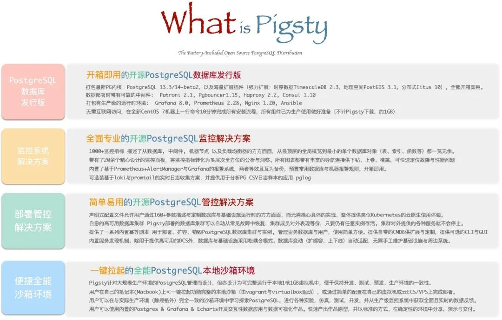

----------------

## 发行版

所谓发行版，是指由数据库内核及其一组软件包组成的数据库**整体解决方案**。例如，Linux 是一个操作系统内核，而 RedHat、Debian、SUSE 则是基于此内核的操作系统发行版。PostgreSQL 是一个数据库内核，而 Pigsty、BigSQL、Percona、各种云 RDS 则是基于此内核的数据库发行版。

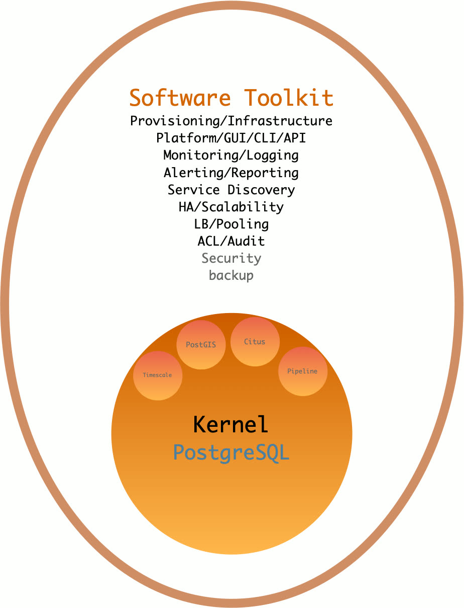

作为数据库发行版，Pigsty 的核心特性：

- **全面专业**的监控系统
- **简单易用**的部署方案
- **稳定可靠**的高可用架构
- **便捷全能**的沙箱环境
- **免费友好**的开源协议

----------------

## 开箱即用

所谓**开箱即用（Battery-Included）**：用户只需一台刚装完系统的虚拟机，一行命令，10 分钟内即可完成基础设施、数据库、监控系统、管控平台的安装，进入可用状态。

Pigsty 将**部署**与**监控**做到极致，让大规模数据库集群的部署实施、管理运维、设计使用这些门槛颇高的工作，成为普通研发人员即可轻松搞定的事情。

**面向专业用户，Pigsty 提供最全面专业的监控系统；面向大众用户，Pigsty 提供最简单易用的部署方案。**此外，针对数据研发人员，Pigsty 还集成了 JupyterLab、Echarts 等实用工具，可作为数据研发与可视化的集成开发环境。

----------------

## 监控系统

Pigsty 带有一个针对大规模数据库集群管理而设计的专业级 PostgreSQL 监控系统。包括约 1200 类指标、20+ 监控面板、上千个监控仪表盘，覆盖从全局大盘到单个对象的详细信息。与同类产品相比，在指标覆盖率与监控面板丰富程度上一骑绝尘，为专业用户提供无可替代的价值。

一个典型的 Pigsty 部署可以管理几百套数据库集群，采集上千类指标，管理百万级时间序列，并将其精心组织为上千个监控仪表盘，交织于几十个监控面板中实时呈现。从全局大盘概览，到单个对象（表、查询、索引、函数）的细节指标，如同实时的核磁共振/CT 机一般，将整个数据库剖析得清清楚楚，明明白白。

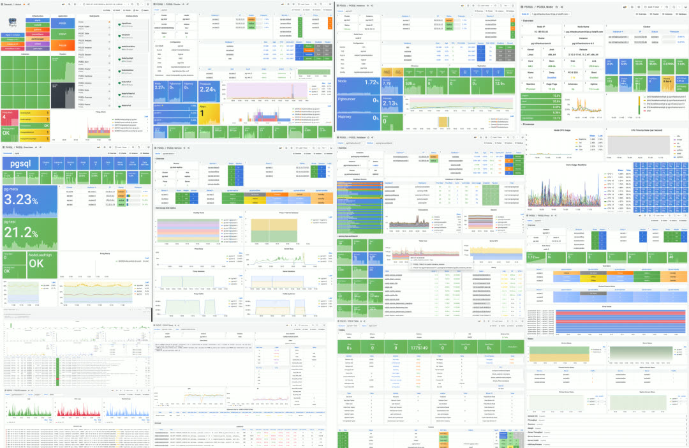

监控面板什锦

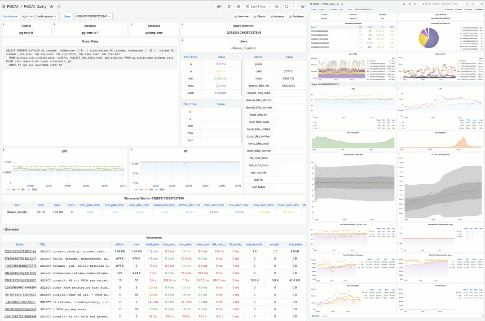

单查询监控

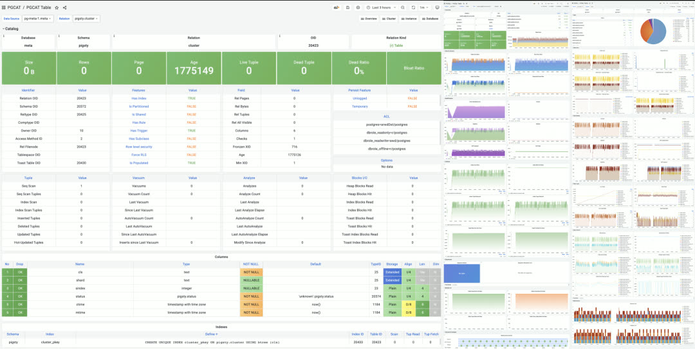

单表监控

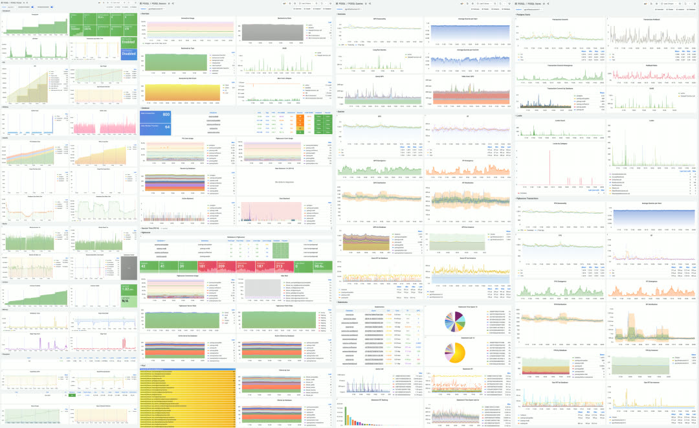

单实例主题监控面板

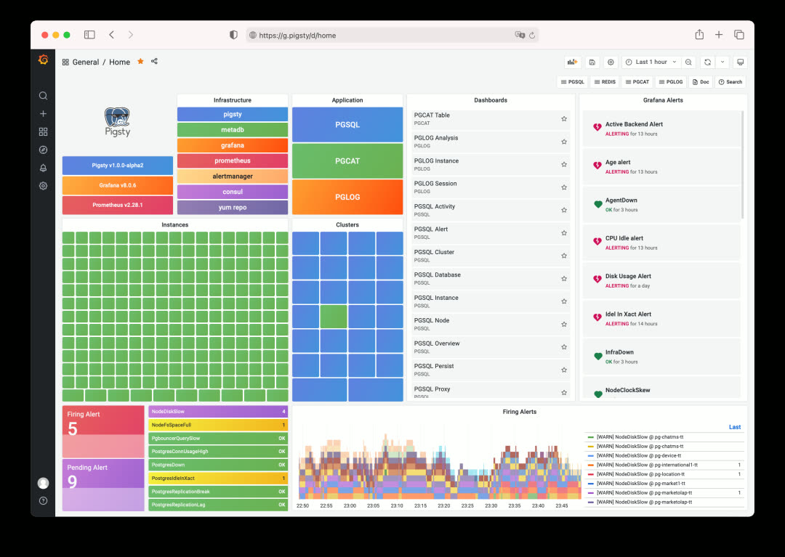

### 三大核心应用

Pigsty 监控系统由三个紧密联系的核心**应用**共同组成：

**PGSQL** - 收集并呈现监控指标数据

**PGCAT** - 直接浏览数据库系统目录

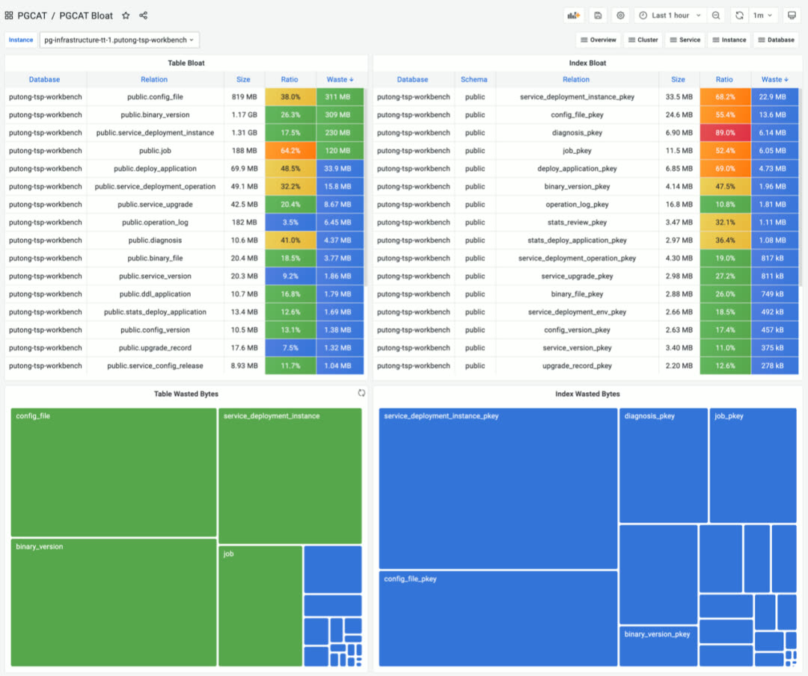

**PGLOG** - 实时查询搜索分析数据库日志

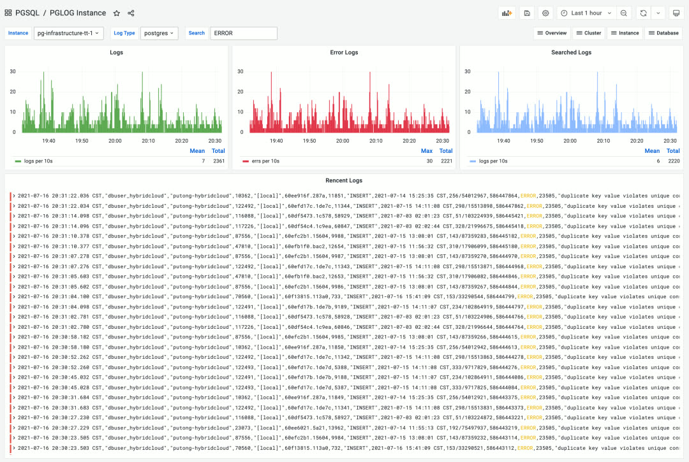

Pigsty 监控系统基于业内最佳实践，采用 Prometheus、Grafana 作为监控基础设施。开源开放，定制便利，可复用，可移植，没有厂商锁定。可与已有 PostgreSQL 数据库实例集成，亦可用于其他数据库或应用的监控与管理（例如 Redis）。

----------------

## 部署方案

数据库是管理数据的软件，管控系统是管理数据库的软件。

Pigsty 内置了一套以 Ansible 为核心的数据库管控方案，并基于此封装了命令行工具与图形界面。它集成了数据库管理中的核心功能：包括数据库集群的创建、销毁、扩缩容；用户、数据库、服务的创建等。

Pigsty 采纳 **Infra as Code** 的设计哲学，使用类似 Kubernetes 的声明式配置，通过大量可选的配置选项对数据库与运行环境进行描述，并通过幂等的预置剧本自动创建所需的数据库集群，提供私有云般的使用体验。

用户只需通过配置文件或图形界面描述"自己想要什么样的数据库"，而无需关心 Pigsty 如何去创建或修改它。Pigsty 会根据用户的配置文件清单，在几分钟内从裸机节点上创造出所需的数据库集群。

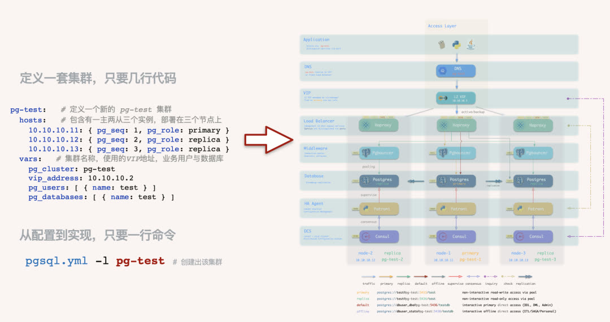

对于不习惯配置文件与 Ansible 剧本的用户，Pigsty 亦提供了可选的 CMDB 模式与 CLI/GUI 工具封装常用操作。

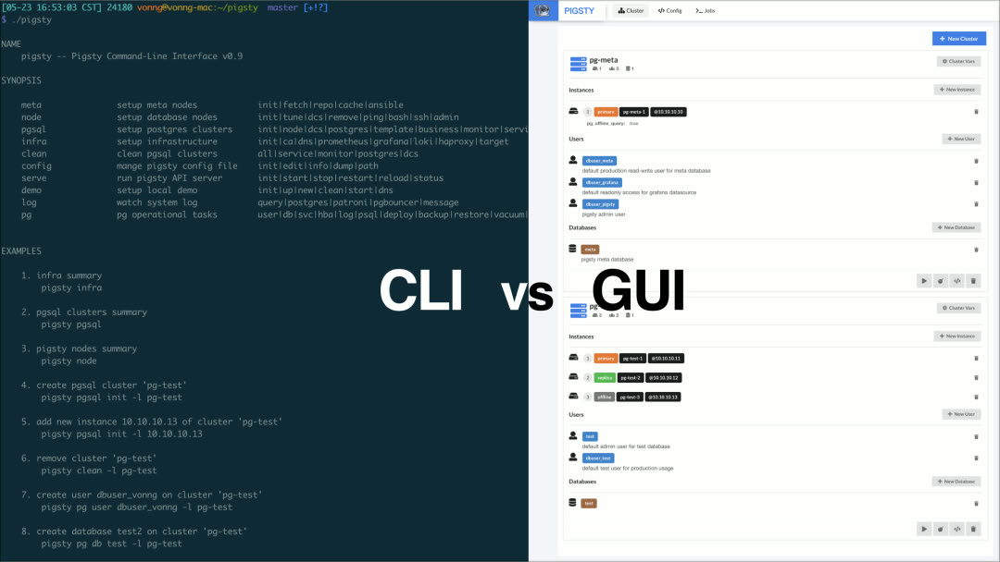

对于专业用户，Pigsty 提供了 160+ 可配置参数，允许对数据集群、基础设施运行时的方方面面进行配置与定制。而新手亦可在完全不修改配置的前提下，创建出相当可靠的数据库集群。

----------------

## 高可用集群

Pigsty 创建的数据库集群是分布式、高可用的数据库集群。从效果上讲，只要集群中有任意实例存活，集群就可以对外提供完整的读写服务与只读服务。

数据库集群中的每个数据库实例在使用上都是幂等的，任意实例都可以通过内建负载均衡组件提供完整的读写服务。**数据库集群可以自动进行故障检测与主从切换，普通故障能在几秒到几十秒内自愈，且期间只读流量不受影响**。

Pigsty 的高可用架构久经生产环境考验，以极小的复杂度实现了完整的高可用方案，让传统主从架构的数据库用出分布式数据库的感觉。

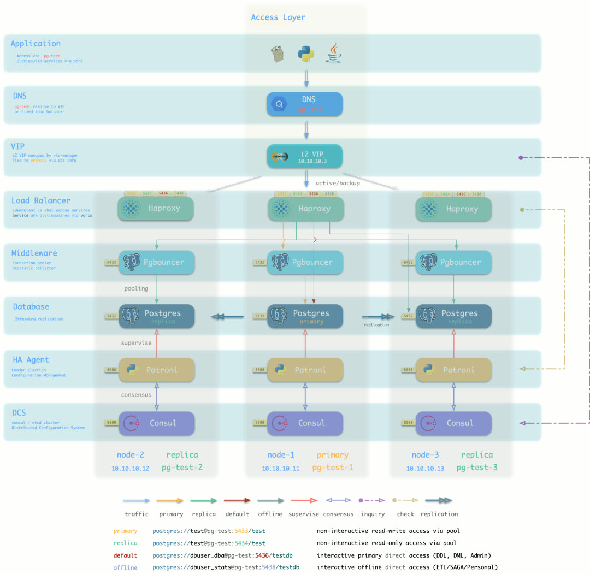

默认接入方式架构（DNS+L2VIP+HAProxy，共 7 种）

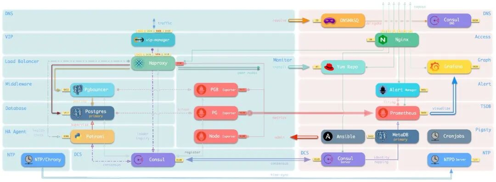

----------------

## 沙箱环境

使用 PostgreSQL 不仅仅是企业，还有许许多多个人用户：用于软件的开发、测试、实验、演示；或者是数据的清洗、分析、可视化、存储。然而如何搭建环境往往成为用户面前的第一道拦路虎。

Pigsty 沙箱旨在解决这一问题，**可以一键在笔记本或 PC 机上拉起完整的生产级 PostgreSQL 服务**（通过 Vagrant 调用 VirtualBox 自动创建所需的虚拟机）。默认沙箱为单节点（2 核 4G），带有各类实用工具，可服务于各种用途。此外，还有四节点版本的完整版沙箱，可用于搭建生产仿真环境，充分探索 Pigsty 高可用架构与监控系统的能力。

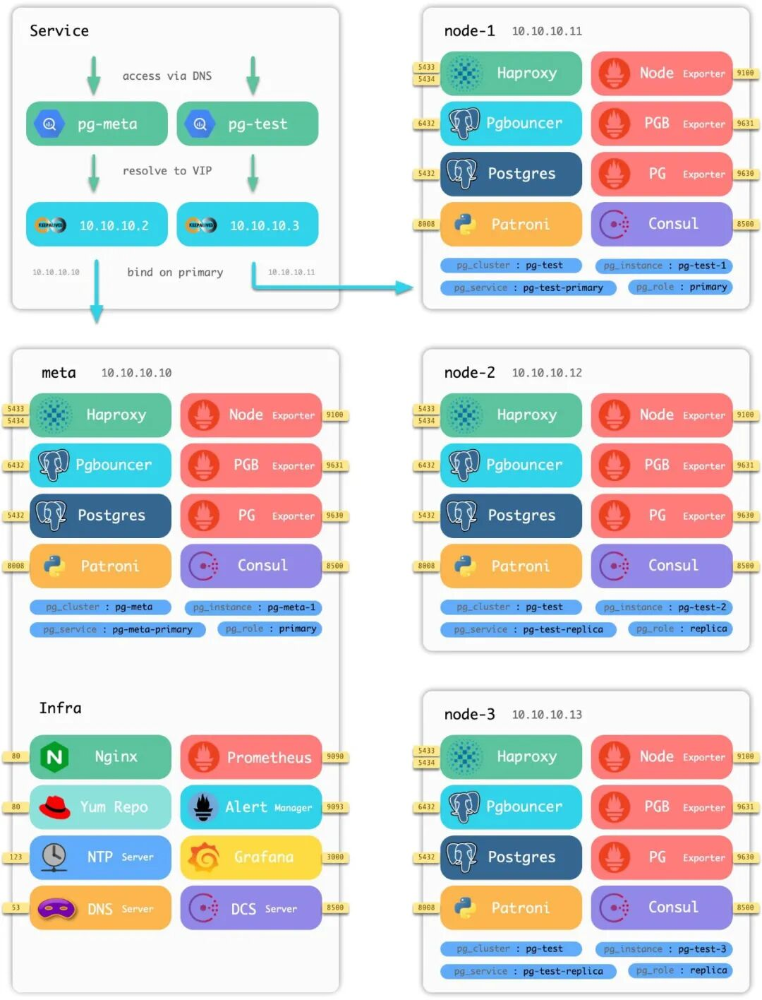

四节点沙箱环境架构示意图

----------------

## 数据分析

Pigsty 提供了 PostgreSQL 作为后端数据库，JupyterLab Python 集成开发环境，Grafana 前后端运行时，以及 Grafana Echarts Panel 用于进行高级可视化。这些工具构成了数据处理、分析、开发数据应用的一整套完整工具组合。

可基于 Pigsty 环境进行数据分析，快速产出数据应用 POC Demo，并通过标准化的方式进行打包、分发、部署、发布。Pigsty 项目中自带两个数据应用样例：

**COVID** - 疫情数据可视化应用

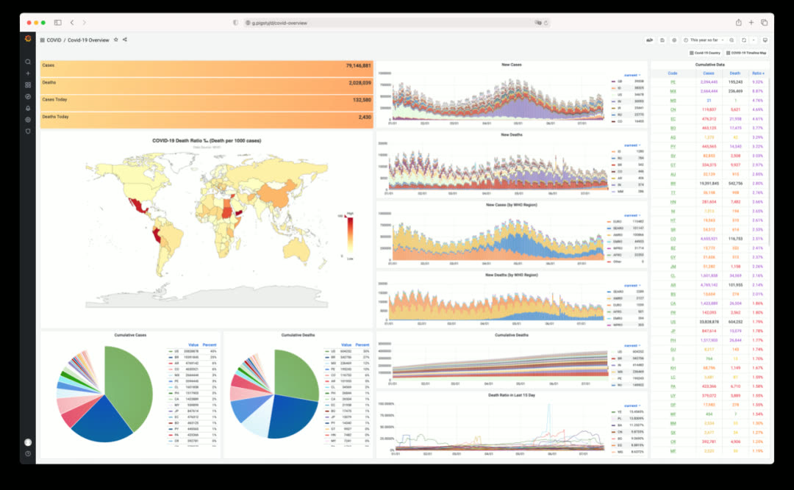

点击查看单个国家详情与时间线地图

**ISD** - 全球地表气象站历史数据查询应用

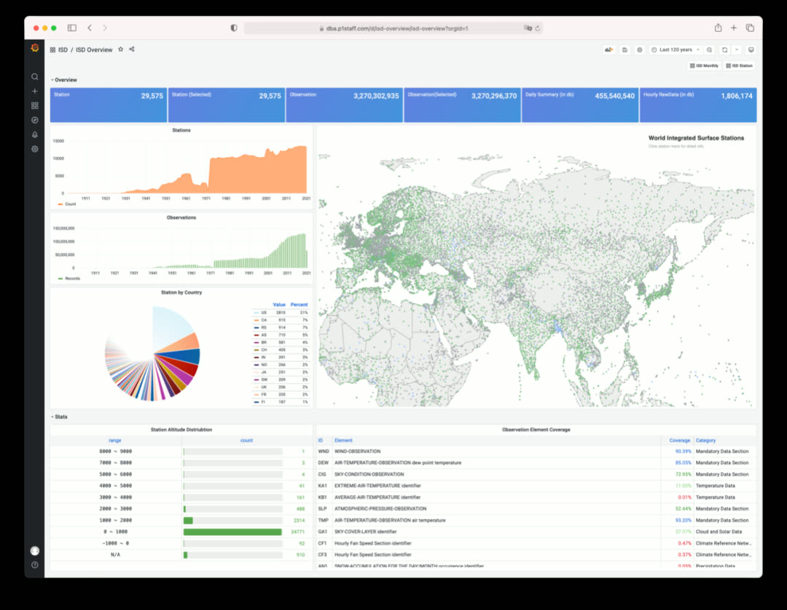

点击查看单个气象站详情与历史气象要素数据

----------------

## 路线图

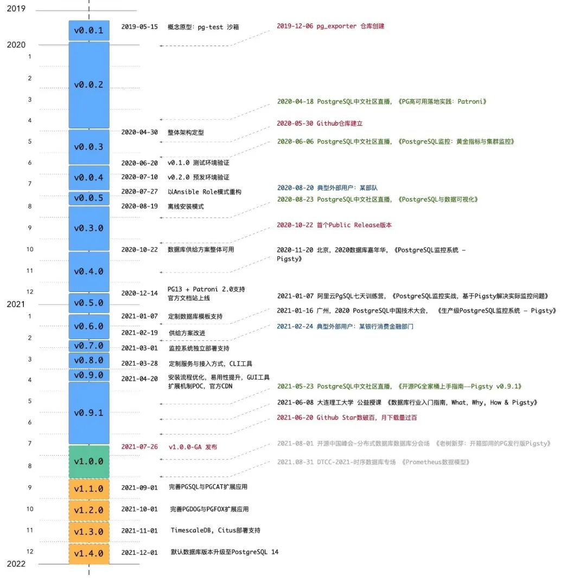

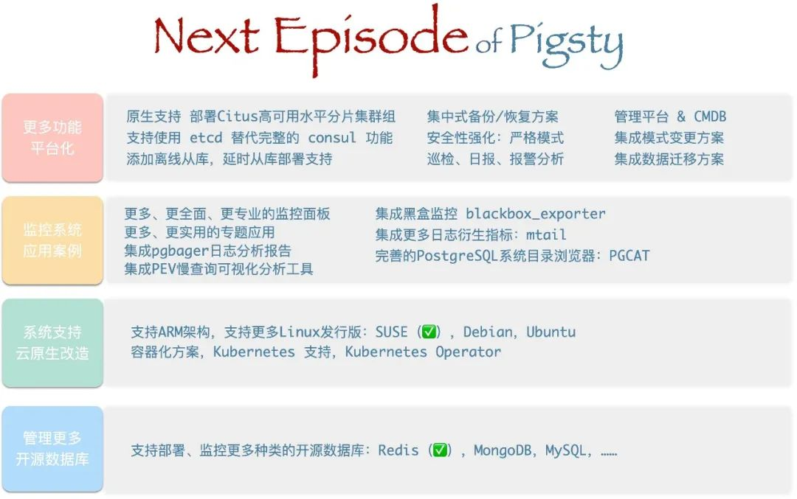

----------------

## 开源

Pigsty 基于 Apache 2.0 协议开源，可免费用于商业目的，但改装与衍生需遵守 Apache License 2.0 的显著声明条款。

Pigsty 的宗旨是：**用好**数据库，用**好数据库**。

让中小企业用户真正拥有"自主可控"的选择，让所有人都能轻松享受 PostgreSQL 的乐趣。

----------------

## v1.0.0 更新日志

**监控系统全面改进**

- 在 Grafana 8.0 上新增仪表盘
- 新的度量定义，增加 PG14 支持
- 简化的标签系统：静态标签集（job, cls, ins）
- 新的警报规则与衍生度量
- 同时监控多个数据库
- 实时日志搜索 & csvlog 分析
- 链接丰富的仪表盘，点击图形元素进行深入/汇总

**架构变更**

- 将 Citus 和 TimescaleDB 加入默认安装部分
- 增加对 PostgreSQL 14beta2 的支持
- 简化 HAProxy 管理页面索引
- 通过添加新角色 `register` 来解耦基础设施和 PGSQL
- 添加新角色 `loki` 和 `promtail` 用于日志记录
- 为管理节点上的管理员用户添加新角色 `environ` 以设置环境
- 默认使用 `static` 服务发现用于 Prometheus（而非 `consul`）
- 添加新角色 `remove` 以优雅地移除集群和实例
- 升级 Prometheus 和 Grafana 的配置逻辑
- 升级到 vip-manager 1.0、node_exporter 1.2、pg_exporter 0.4、Grafana 8.0
- 每个实例上的每个数据库都可自动注册为 Grafana 数据源
- 将 Consul 注册任务移到 `register` 角色，更改 Consul 服务标签
- 添加 cmdb.sql 作为 pg-meta 基线定义（CMDB & PGLOG）

**应用框架**

- 可扩展框架用于新功能
- 核心应用：PostgreSQL 监控系统 `pgsql`
- 核心应用：PostgreSQL 目录浏览器 `pgcat`
- 核心应用：PostgreSQL Csvlog 分析器 `pglog`
- 添加示例应用 `covid` 用于可视化 COVID-19 数据
- 添加示例应用 `isd` 用于可视化 ISD 数据

**其他**

- 添加 JupyterLab，为数据科学提供完整的 Python 环境
- 添加 `vonng-echarts-panel` 以恢复对 Echarts 的支持
- 添加 wrap 脚本 `createpg`、`createdb`、`createuser`
- 添加 CMDB 动态库存脚本：`load_conf.py`、`inventory_cmdb`、`inventory_conf`
- 移除过时的剧本：`pgsql-monitor`、`pgsql-service`、`node-remove` 等

**API 变更**

- 新变量：`node_meta_pip_install`
- 新变量：`grafana_admin_username`
- 新变量：`grafana_database`
- 新变量：`grafana_pgurl`
- 新变量：`pg_shared_libraries`
- 新变量：`pg_exporter_auto_discovery`
- 新变量：`pg_exporter_exclude_database`
- 新变量：`pg_exporter_include_database`
- 变量重命名：`grafana_url` 改为 `grafana_endpoint`

**Bug 修复**

- 修复默认时区 Asia/Shanghai (CST) 问题
- 修复 pgbouncer & patroni 的 nofile 限制
- 当执行标签 `pgbouncer` 时，pgbouncer 的用户列表和数据库列表将被生成

----------------

## v1.0.1 更新日志

2021-09-14

**文档更新**

- 现已支持中文文档
- 现已支持机器翻译的英文文档

**错误修复**

- `pgsql-remove` 不会移除主实例
- 用 pg_cluster + pg_seq 替换 pg_instance（Start-At-Task 可能因 pg_instance 未定义而失败）
- 从默认共享预加载库中移除 Citus（Citus 会强制 max_prepared_transaction 的值为非零）
- 在 `configure` 中进行 ssh sudo 检查（现在使用 `ssh -t sudo -n ls` 进行权限检查）
- `pg-backup` 脚本笔误修复

**调整优化**

- 移除 NTP 合理性检查警报（与 ClockSkew 重复）
- 移除 collector.systemd 以减少开销
