> [**GitHub Release**](https://github.com/pgsty/pigsty/releases/tag/v1.1.0) | [**Release Note**](https://pigsty.io/docs/releasenote/#v110)

[](https://github.com/pgsty/pigsty/releases/tag/v1.1.0)

Pigsty v1.1 is officially released, featuring a brand-new homepage design, plus support for JupyterLab, PGWeb, PEV2, PgBadger, and other useful tools.


----------------

## Brand New Homepage

The Home Dashboard in Grafana has long served as Pigsty's de facto "homepage." Now Pigsty finally has a standalone, well-designed homepage of its own.

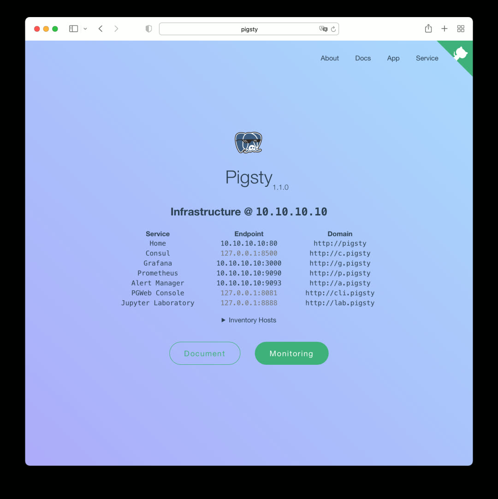

This homepage is a local version of the documentation site, served by the default Nginx.


### Service Navigation

The homepage provides navigation to all Pigsty service components, including Consul, Grafana, Prometheus, AlertManager, and the newly introduced **PGWeb** and **JupyterLab** in v1.1. Click the component name/URL in the center, or use the `Service` dropdown menu in the top-right navigation bar.


### Monitoring Navigation

The homepage can display clusters and instances in your Pigsty deployment (optional), with direct links to specific cluster/instance monitoring pages and admin interfaces.

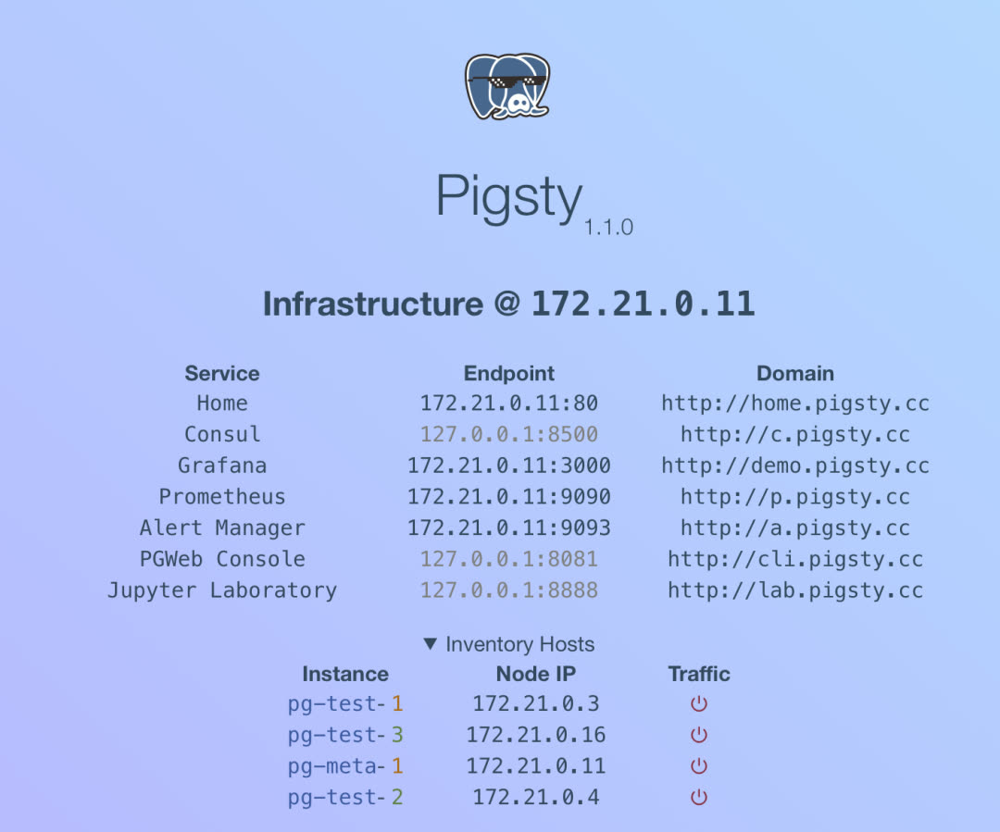


### App Navigation

The App dropdown in the top-right corner is the entry point for Pigsty's extended features. In v1.1, Pigsty ships with several useful and interesting apps, all configurable via options.

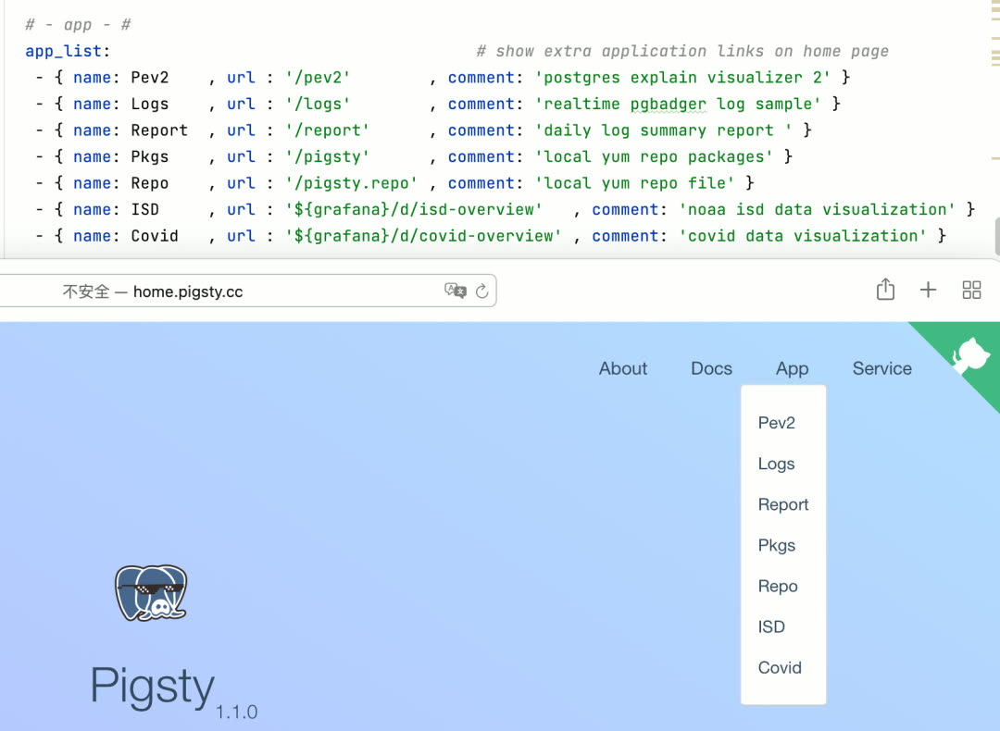


### Local Documentation

In Pigsty v1.1, you can access local offline documentation directly from the homepage, available in both English and Chinese.

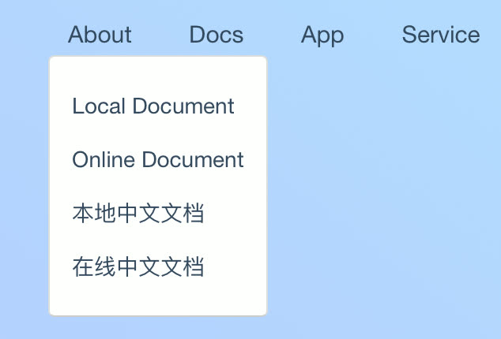


----------------

## JupyterLab

If you use Python for data analysis, you're probably familiar with Jupyter. Pigsty v1.0 bundled the JupyterLab package; v1.1 takes it further with native integration. JupyterLab is enabled by default in demo and personal configuration templates, but disabled by default in production deployments.

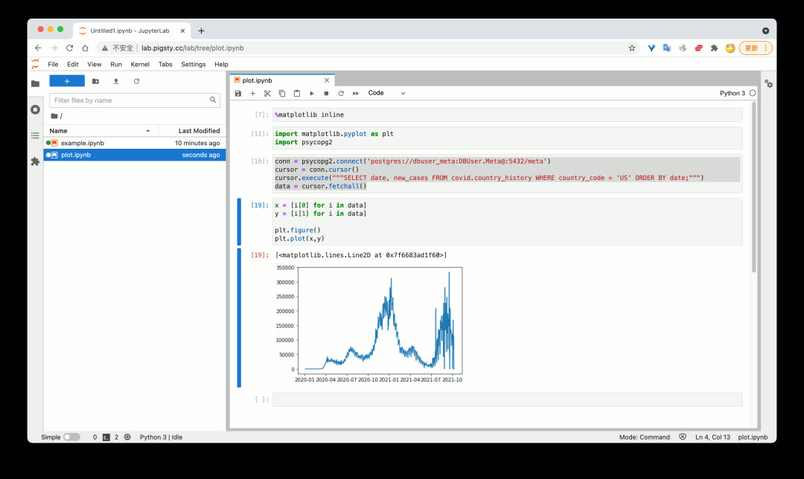

With Jupyter Notebook, you can efficiently and agilely extract, process, analyze, transform, and visualize data — combining the power of Python and SQL.

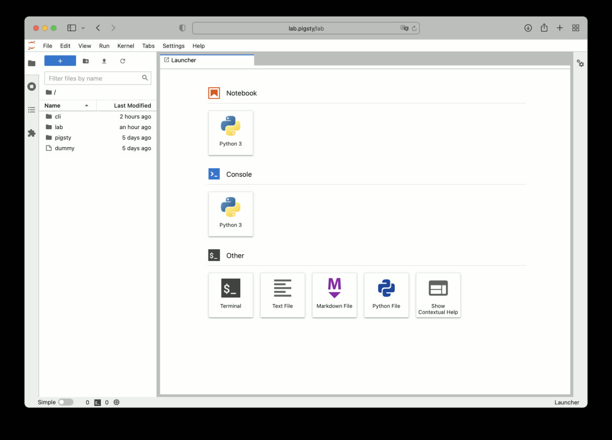

With great power comes great risk. Jupyter's ability to execute arbitrary code is too risky for production environments, so it's disabled by default in production configuration templates.


----------------

## PGWeb

As a batteries-included database distribution, providing batteries-included GUI client tools is also important. PGWeb is a lightweight, browser-based PostgreSQL GUI client written in Go.

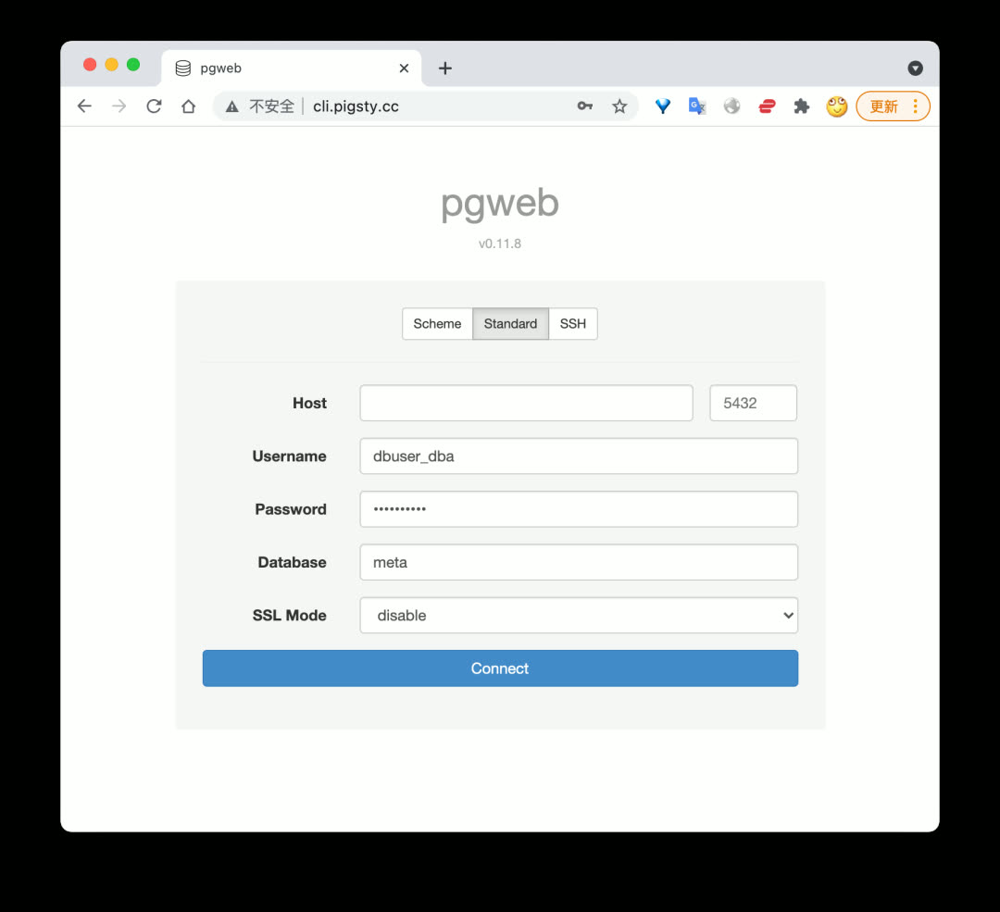

Like Jupyter, PGWeb is enabled by default in demo and personal configuration templates, but disabled in production deployments. However, PGWeb requires a connection string to access the database, making it relatively safe for scenarios where individual users need to query small amounts of data in production.

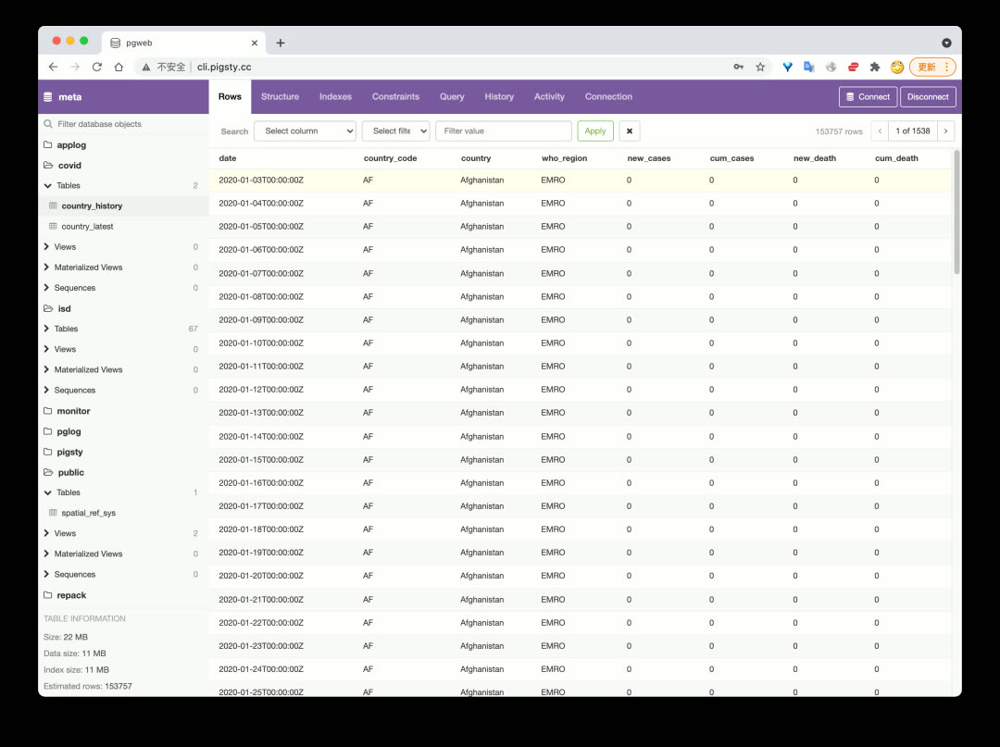

Users can browse schemas and objects in the database, quickly view table data, execute queries, and more.


----------------

## PEV2

PEV2 is a handy execution plan visualizer that converts PostgreSQL EXPLAIN output into an intuitive execution plan tree.

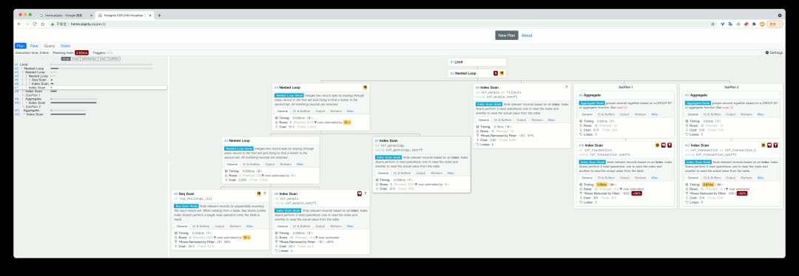

This tool is extremely useful for optimizing slow queries and analyzing auto_explain results.


----------------

## PgBadger

PgBadger is an excellent PostgreSQL log analysis tool that quickly generates beautiful, comprehensive analysis reports from CSV logs.

Use `bin/pglog-summary [ip] [date]` to pull logs from a specific node on a specific date and create a log analysis report.

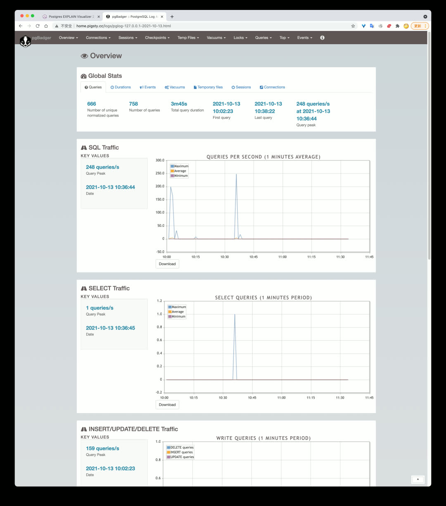

Add this command to crontab to automatically generate database operation reports daily or near-real-time.


----------------

## Software Updates

PostgreSQL 14 is officially released, and Pigsty v1.1 immediately added support. The `pigsty-pg14` template can now create PostgreSQL databases with version 14 as default in production. However, since TimescaleDB doesn't officially support PG14 yet (expected around 10/30), PG14 won't be the default database version in Pigsty for now.

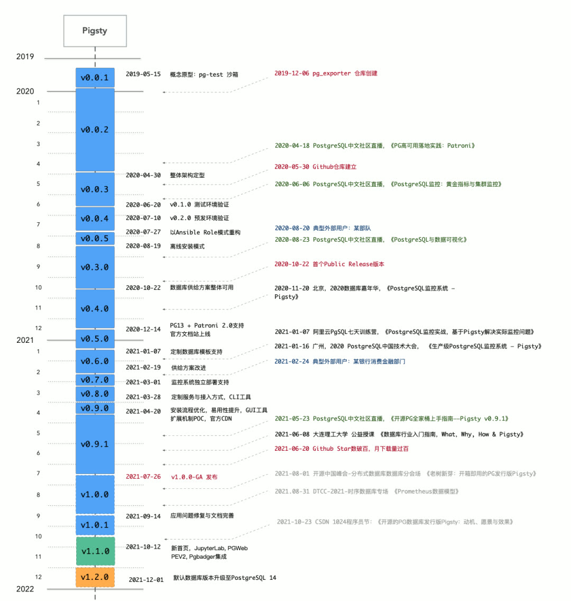

Pigsty will upgrade the default PG version to PG14 in **v1.2**.

Software upgrade list:

| Component | Version |
|-----------|---------|
| PostgreSQL | v13.4 |
| pgbouncer | v1.16 |
| Grafana | v8.1.4 |
| Prometheus | v2.29 |
| node_exporter | v1.2.2 |
| HAProxy | v2.1.1 |
| Consul | v1.10.2 |
| vip-manager | v1.0.1 |


----------------

## Database Migration Playbook

Pigsty includes a built-in database online migration helper script: `pgsql-migration.yml`, providing an out-of-the-box zero-downtime database migration solution based on logical replication.

Fill in the source and target cluster information, and the playbook will automatically generate the scripts needed for migration — just execute them in sequence.

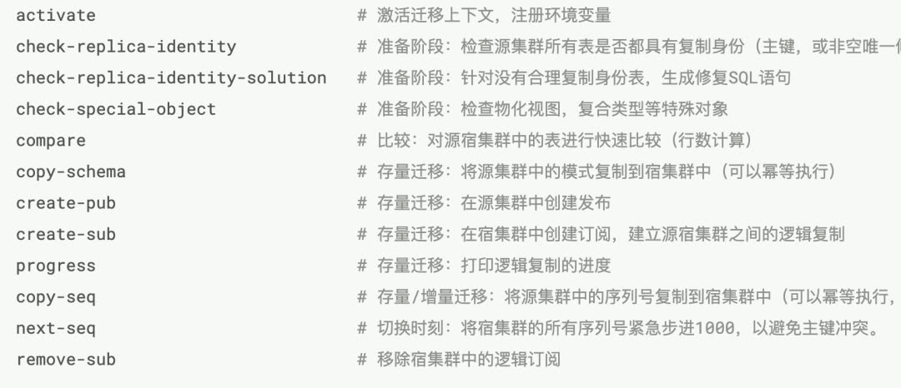

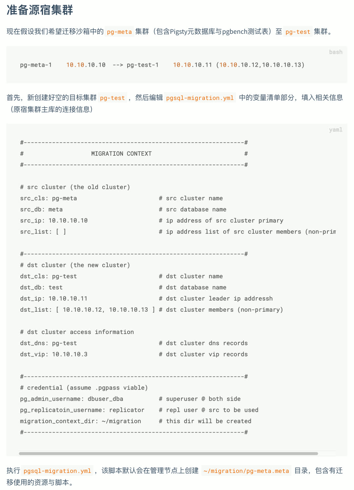


----------------

## Sample App: Privacy Log Visualization

Pigsty's default demo apps now include a new one: Apple App Privacy Log Visualization (AppLog). Export privacy access records from iOS 15 and visualize them in this app.

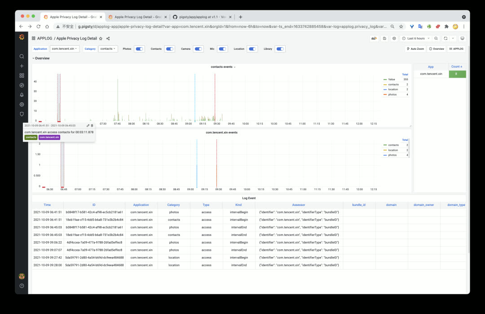

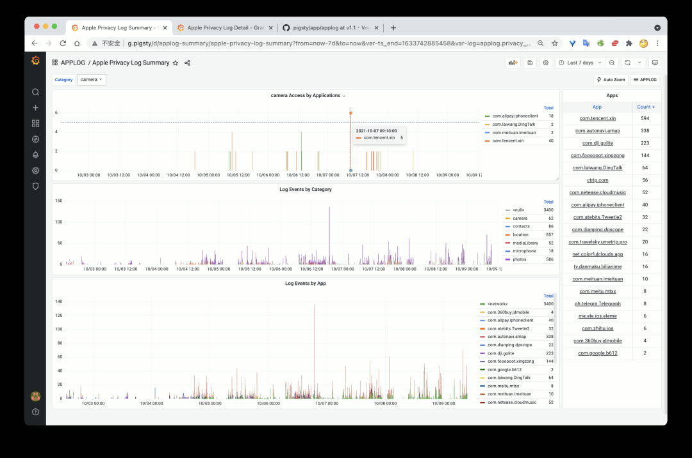


----------------

## Handy Features

**Dummy File Placeholder**

v1.1 adds a new feature for database instances: Dummy File. The concept is simple — create a file of a certain size (e.g., 1–4GB) at `/pg/dummy`. When disk-full failures occur (when many operations can't complete normally), just delete it to free up emergency space.

**Promscale Support**

v1.1 adds the Promscale package. This interesting component lets you replace Prometheus's time-series storage with TimescaleDB (PostgreSQL).


----------------

## v1.1.0 Release Notes

**Feature Enhancements**

- Added `pg_dummy_filesize` to create filesystem space placeholder
- Major homepage redesign
- Added JupyterLab integration
- Added PGWeb console integration
- Added PgBadger support
- Added PEV2 support, execution plan visualization tool
- Added pglog tooling

**Software Upgrades**

- PostgreSQL upgraded to v13.4 (with official PG14 support)
- pgbouncer upgraded to v1.16 (metric definitions updated)
- Grafana upgraded to v8.1.4
- Prometheus upgraded to v2.29
- node_exporter upgraded to v1.2.2
- HAProxy upgraded to v2.1.1
- Consul upgraded to v1.10.2
- vip-manager upgraded to v1.0.1

**API Changes**

- `nginx_upstream` now has different structure (incompatible)
- New config entry: `app_list`, navigation entries rendered to homepage
- New config entry: `docs_enabled`, setup local docs on default server
- New config entry: `pev2_enabled`, setup local PEV2 tool
- New config entry: `pgbadger_enabled`, create log summary/report directory
- New config entry: `jupyter_enabled`, enable JupyterLab server on meta node
- New config entry: `jupyter_username`, specify user to run JupyterLab
- New config entry: `jupyter_password`, specify default password for JupyterLab
- New config entry: `pgweb_enabled`, enable PGWeb server on meta node
- New config entry: `pgweb_username`, specify user to run PGWeb
- Renamed internal flag `repo_exist` to `repo_exists`
- `repo_address` default value changed to `pigsty` instead of `yum.pigsty`
- HAProxy access point changed to `http://pigsty` instead of `http://h.pigsty`


----------------

## v1.1.1 Release Notes

- Replaced TimescaleDB `apache` version with `timescale` version
- Upgraded Prometheus to 2.30
- Fixed pg_exporter config directory owner issue (changed to `{{ pg_dbsu }}`)

**Upgrade Notes**

The main change in this version is TimescaleDB — using the official TimescaleDB License (TSL) version to replace the Apache License v2 version from the PGDG repository.

```bash
# Stop postgres instances with timescaledb
yum remove -y timescaledb_13

# Add TimescaleDB official repo
[timescale_timescaledb]
name=timescale_timescaledb
baseurl=https://packagecloud.io/timescale/timescaledb/el/7/$basearch
repo_gpgcheck=0
gpgcheck=0
enabled=1

yum install timescaledb-2-postgresql13
```
