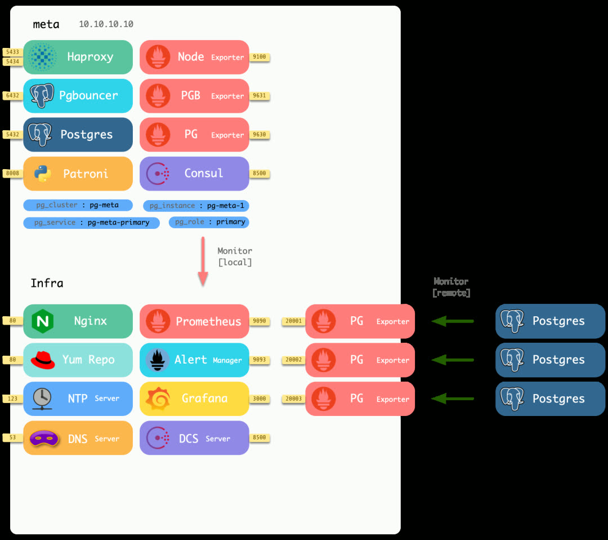
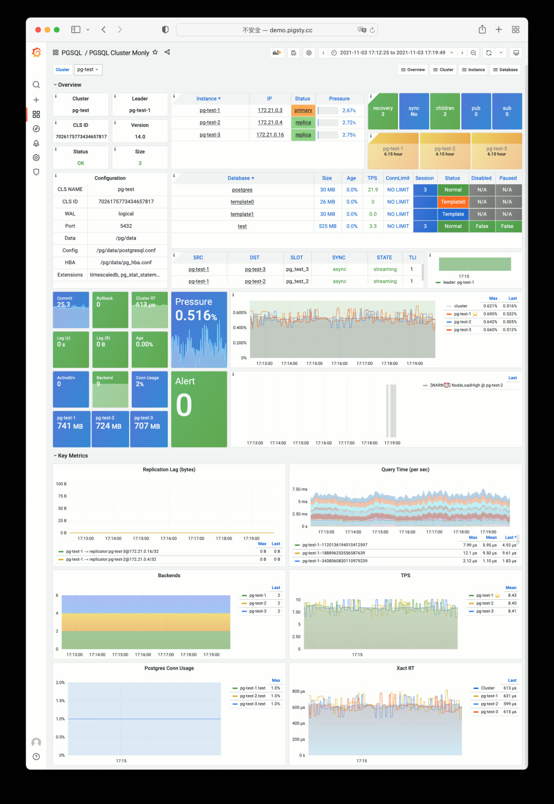
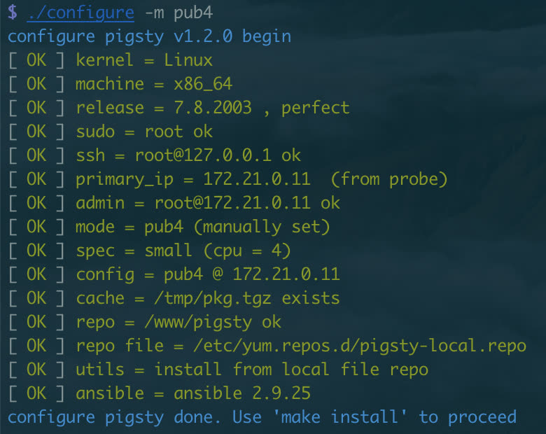
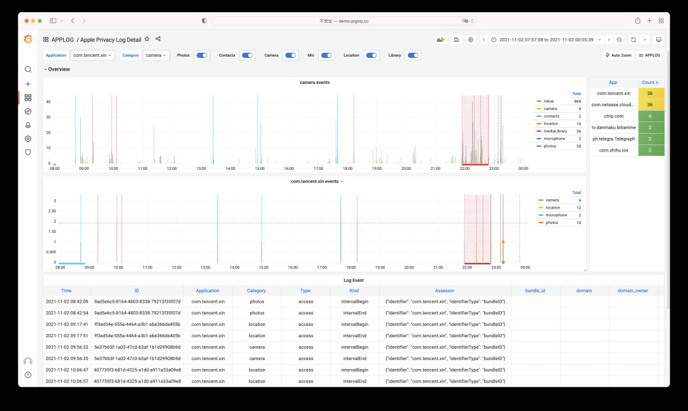
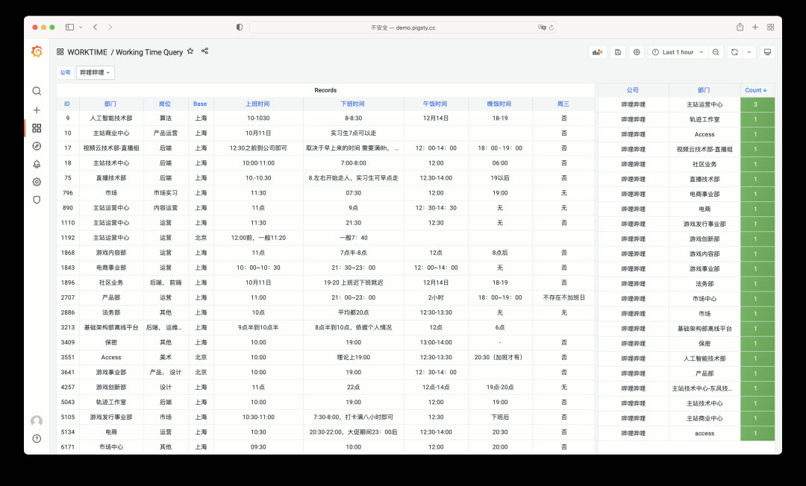
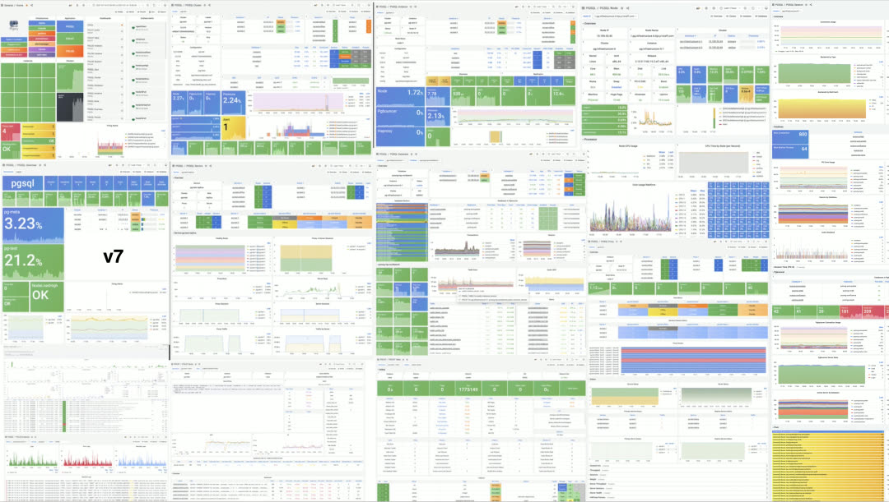
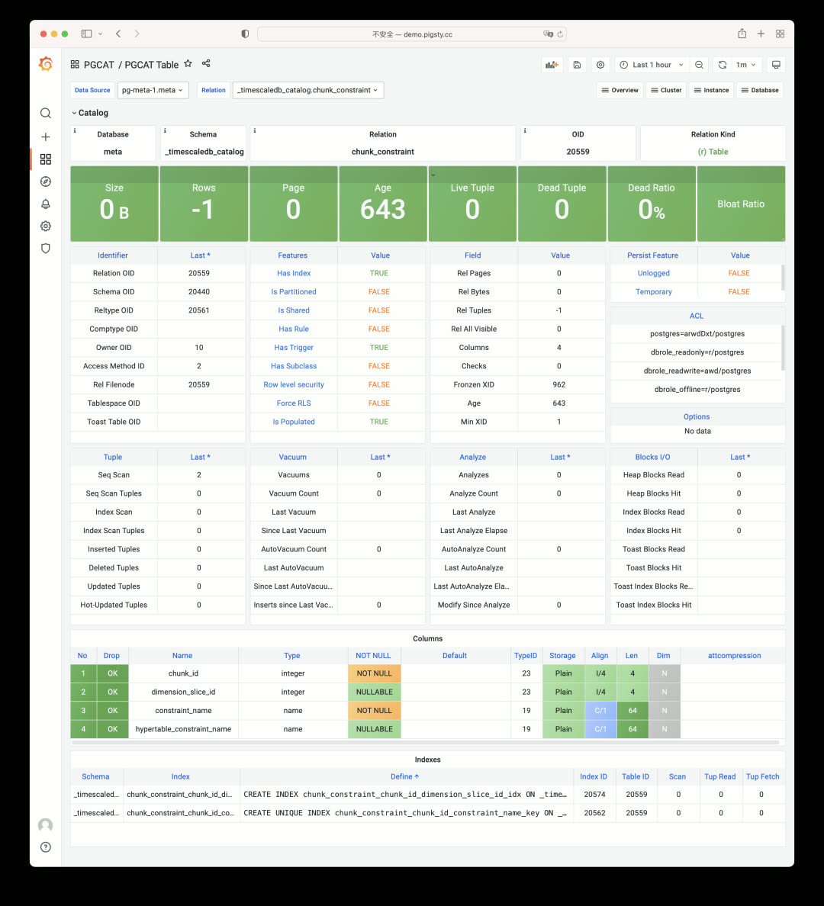
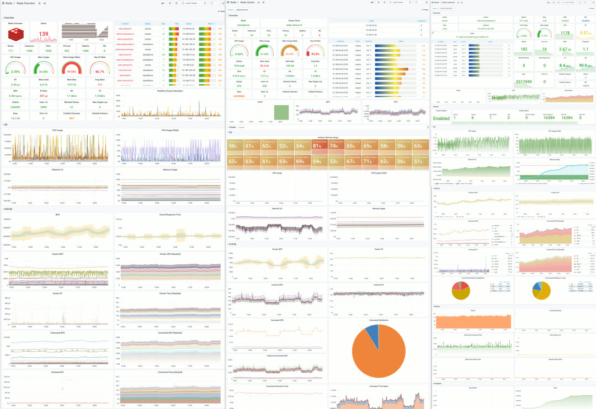

> [**GitHub Release**](https://github.com/pgsty/pigsty/releases/tag/v1.2.0) | [**发布注记**](https://pigsty.cc/docs/releasenote/#v120) | [微信公众号](https://mp.weixin.qq.com/s?__biz=MzU5ODAyNTM5Ng==&mid=2247484799&idx=1&sn=bb4a87eba481c6851582899ae9955f10&chksm=fe4b30a4c93cb9b2ad9d68d837763bb1dd547c81d6ec04684ef98072ead8271695b9abba78d1&scene=21#wechat_redirect)

Pigsty v1.2 正式发布，将 PostgreSQL 14 作为默认版本，并支持独立监控现有数据库实例。

----------------

## PostgreSQL 14 成为默认版本

PostgreSQL 14 于上月发布，在各方面特别是可观测性上有显著改进。经过多个组织生产环境的部署与充分测试后，**PostgreSQL 14 已成为 Pigsty 的默认数据库版本**。

同时，适配 PG14 的时序数据扩展 TimescaleDB 2.5、地理空间扩展 PostGIS 3.1 已默认安装启用，配合分布式数据库插件 Citus 10，真正实现**开箱即用的时空超融合开源 PostgreSQL 数据库发行版**。

三者相互兼容，可组合使用。

----------------

## 仅监控部署模式

第二个重要特性是**仅监控部署模式**。此前 Pigsty 作为发行版，监控系统与部署方案浑然一体。但很多用户希望只使用 Pigsty 的监控系统来监控已有的数据库实例、云数据库、以及其他 RDS 产品与各类衍生版本。

最小部署模式在本地不同端口启动 `pg_exporter` 以监控外部 PostgreSQL 实例。

在 v1.2 中，Pigsty 提供三种可选的监控部署模式：

| 模式 | 说明 |
|------|------|
| 完整部署 | 完整的 Pigsty 部署，包含监控与管控 |
| 精简部署 | 仅部署监控相关组件 |
| 最小部署 | 仅需数据库连接串，无需远程机器权限 |

新增的最小部署模式不再需要远程机器的登录与管理权限，只要有一个连接串可以只读访问远程数据库，即可将其纳入监控管理。所有监控功能浓缩在一台机器上，管理简单方便。

尽管只有 PostgreSQL 本身的指标，但 Pigsty 监控系统的大部分功能仍可正常工作。经测试，Pigsty 也可直接用于监控 MatrixDB、GreenPlum 等 PostgreSQL 衍生/兼容数据库产品。

----------------

## 配置模板精简

配置模板被进一步精简：现在只有两种模板：**生产环境**（默认）与**沙箱环境**。

规格参数模板更加丰富，提供平滑过渡的规格选项：

| 规格 | 配置 | 说明 |
|------|------|------|
| tiny | 1C1G | 最小测试规格 |
| mini | 2C4G | 开发环境规格 |
| small | 4C8G | 小型生产规格 |
| medium | 8C16G | 中型生产规格 |
| large | 16C32G | 大型生产规格 |
| oltp/olap/crit | 64C400G | 专业生产规格 |

在配置过程中，安装向导会自动根据机器规格选择对应的参数模板。

Pigsty 始终保持 `./configure && make install` 一行命令完成安装的优良传统。

----------------

## 实用工具剧本

新增 `pgsql-migration` 剧本可自动生成数据库迁移所需的命令、脚本与手册，使基于逻辑复制的在线不停机数据库迁移变得简单（已在生产环境迁移数十套数据库）。

`pgsql-audit` 剧本可根据审计需求生成对应数据库实例的审计报告。

----------------

## 示例应用

v1.2 提供两个新的 Pigsty App 示例：

**AppLog** - 用于可视化 Apple iOS15 新隐私日志的应用，可以展示哪些应用访问了哪些权限。

**WorkTime** - 查询中国各大公司工作休息时间的应用。

两个应用功能简单但实用，开发只用了不到一小时。Pigsty 在产出具有基本功能的应用原型时是一个非常趁手的工具。

----------------

## 后续规划

**PGSQL v8** - 提供更加层次分明的监控面板组织，面向不同用户群体提供不同的主题视图。

**PGCAT v2** - 提供更为丰富的系统目录导航浏览功能。

**REDIS v1beta** - Redis 经常与 PostgreSQL 搭配使用，后续版本会将 Redis 部署与监控整合为完整的解决方案。

----------------

## v1.2.0 更新日志

**核心功能**

- 默认使用 PostgreSQL 14 版本
- 默认使用 TimescaleDB 2.5 扩展
- TimescaleDB 和 PostGIS 默认在 CMDB 中启用

**仅监控模式**

- 仅通过可连接的 URL 即可监控现有 PostgreSQL 实例
- pg_exporter 将在本地 Meta 节点上部署
- 新增 PGSQL Cluster Monly 仪表盘用于远程集群

**软件升级**

- Grafana 升级到 8.2.2
- pev2 升级到 v0.11.9
- Promscale 升级到 0.6.2
- PgWeb 升级到 0.11.9
- 新增扩展：pglogical、pg_stat_monitor、orafce

**改进增强**

- 自动检测机器规格并使用适当的 `node_tune` 和 `pg_conf` 模板
- 重做膨胀相关视图，公开更多信息
- 删除 TimescaleDB 和 Citus 的内部监控
- 新增 `pgsql-audit.yml` 剧本用于创建审计报告
- 所有配置模板简化为两种：auto 和 demo

**错误修复**

- pgbouncer_exporter 资源所有者改为 `{{ pg_dbsu }}` 而不是 postgres
- 修复执行 `REINDEX TABLE CONCURRENTLY` 时 pg_exporter 在 pg_table/pg_index 上的重复指标问题

----------------

## 升级说明

v1.2.0 中没有 API 变更，仍可使用旧的 `pigsty.yml` 配置文件（PG13）。对于基础设施部分，重新执行 `repo` 将完成大部分工作。

对于数据库，可继续使用现有的 PG13 实例。涉及 PostGIS 和 TimescaleDB 等扩展时，就地升级较为复杂，推荐使用逻辑复制进行数据库迁移。新增的 `pgsql-migration.yml` 剧本将生成一系列脚本，帮助实现近乎零停机时间的集群迁移。
