> [**GitHub Release**](https://github.com/pgsty/pigsty/releases/tag/v1.3.0) | [**Release Note**](https://pigsty.io/docs/releasenote/#v130)

Pigsty v1.3 is officially released, featuring Redis support, a rebuilt PGCAT application, and enhanced PGSQL monitoring.

----------------

## Redis Support

While PostgreSQL is **the world's most advanced open-source relational database**, every hero needs a sidekick. Pigsty v1.3 introduces a powerful caching companion for PostgreSQL: **the world's fastest database** — Redis.

Redis delivers incredible performance, easily hitting 200-300k QPS on a single core.

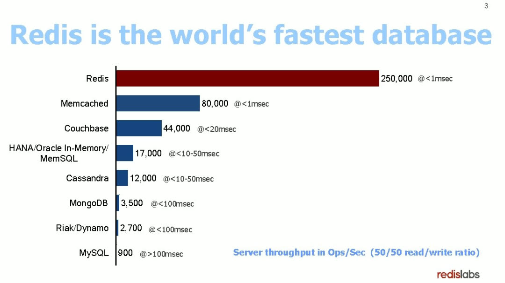

The Pigsty demo now includes Redis cluster examples:

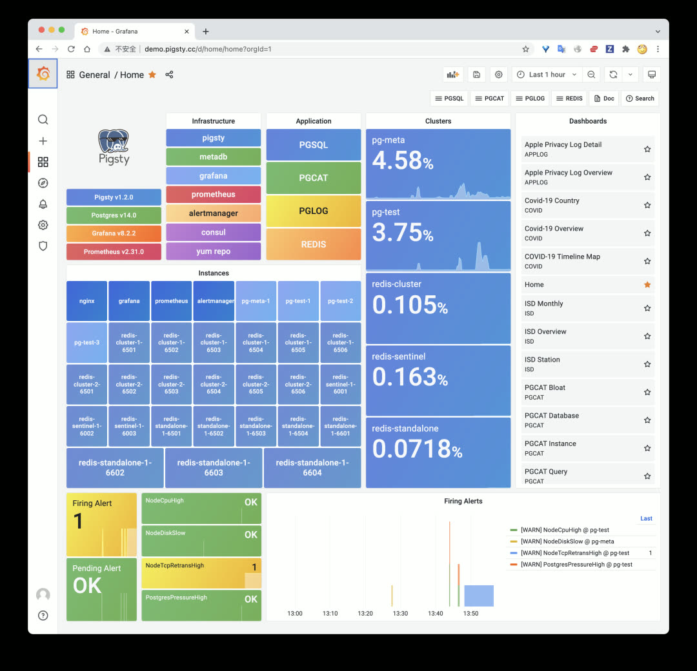

### Three Deployment Modes

Redis has three classic deployment patterns: primary-replica (Standalone), native cluster (Cluster), and high-availability sentinel (Sentinel). Pigsty v1.3 supports all three.

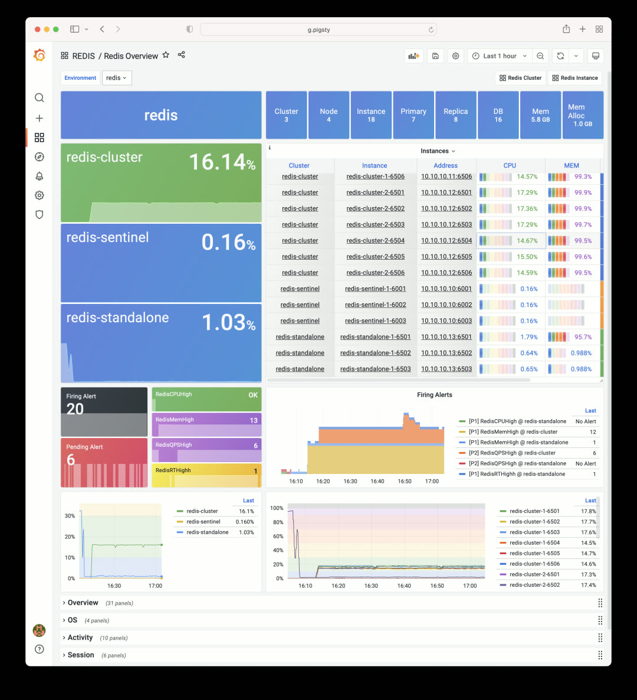

The Redis Overview dashboard shows three sample clusters, each demonstrating a different deployment mode.

### Declarative Configuration

Defining a Redis cluster works the same way as PostgreSQL. After declaring your config, just run `redis.yml -l <cluster>` to create the cluster:

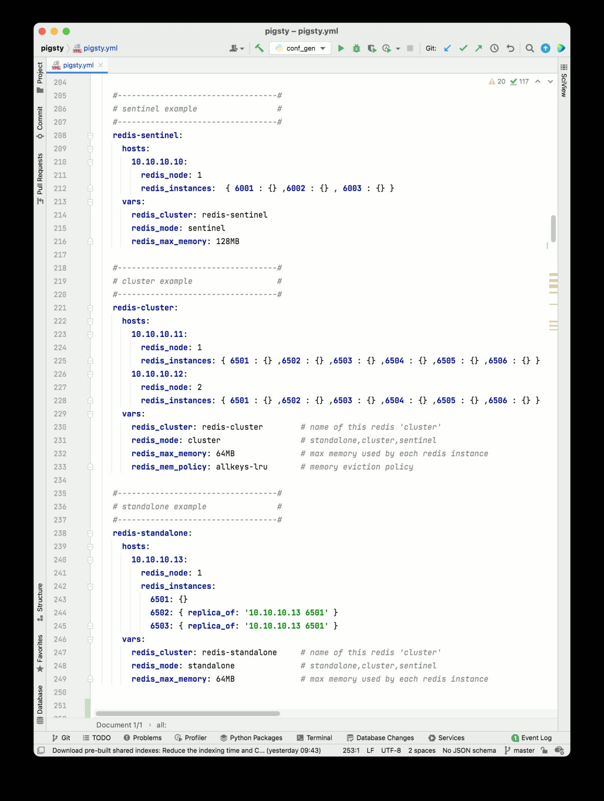

A Redis cluster only needs a few required identity parameters. Of course, you can use additional parameters for fine-grained configuration:

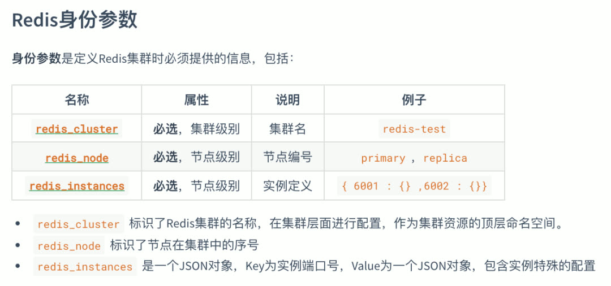

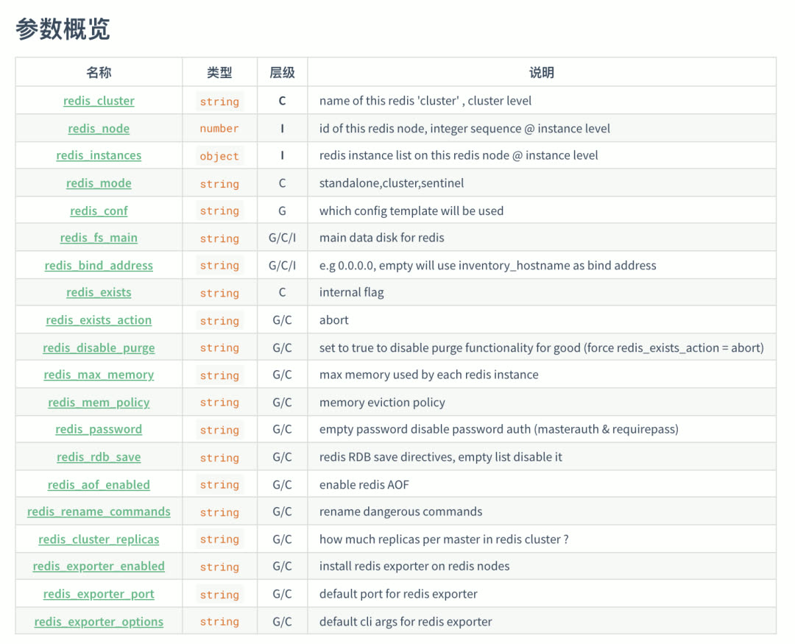

### Auto-Monitoring

Redis clusters and instances created with Pigsty are automatically integrated into the monitoring system.

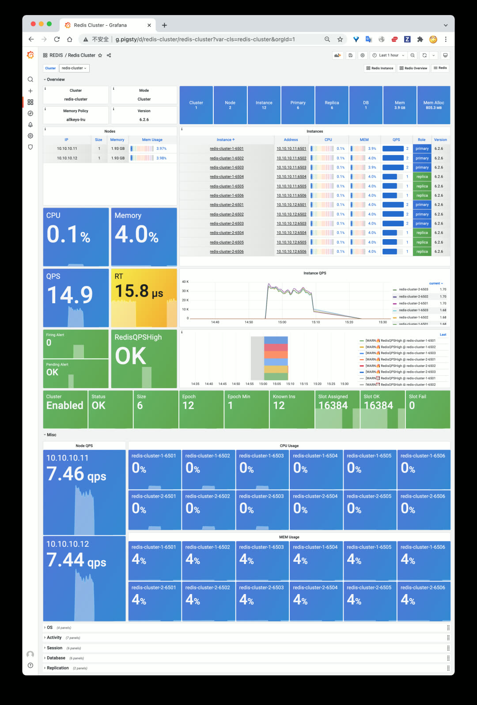

The Redis cluster dashboard homepage — click on a specific instance to jump to instance-level monitoring:

----------------

## PGCAT Overhaul

v1.3 rebuilds the PGCAT application — a tool for browsing and visualizing PostgreSQL system catalogs directly from Grafana.

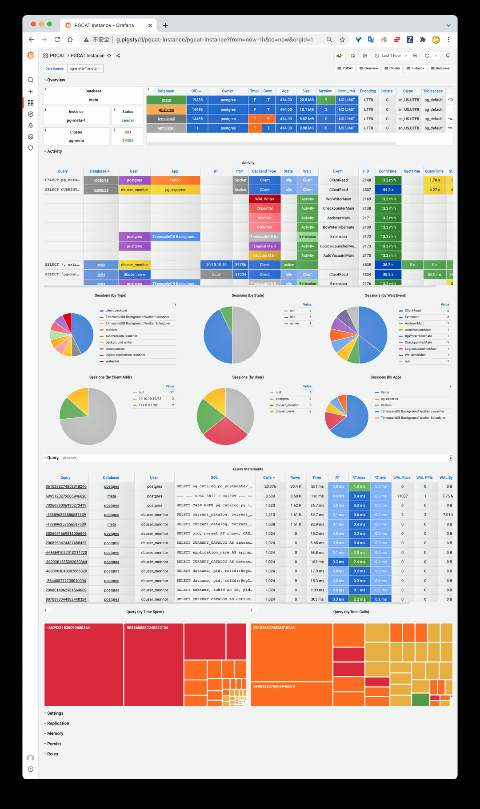

Single PostgreSQL instance catalog info: databases, active sessions, running queries.

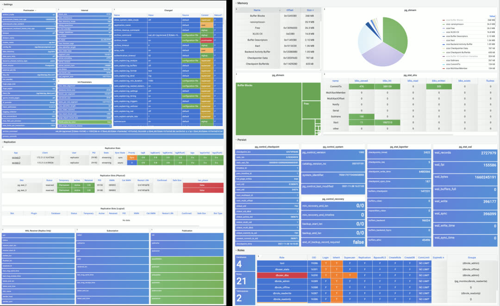

More instance-level catalog info: configuration, replication, memory usage, persistence, roles.

Single PostgreSQL database catalog info, including schemas, tables, indexes, sequences, and other objects.

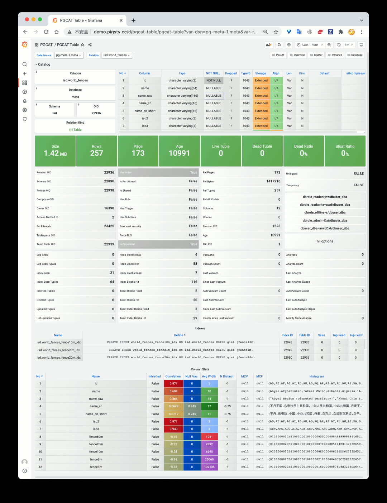

Redesigned PGCAT TABLE dashboard with detailed per-column statistics.

### Agentless Design

PGCAT only needs a target database URL — no agent installation required. Even monitor-only deployments of existing instances get full PGCAT functionality.

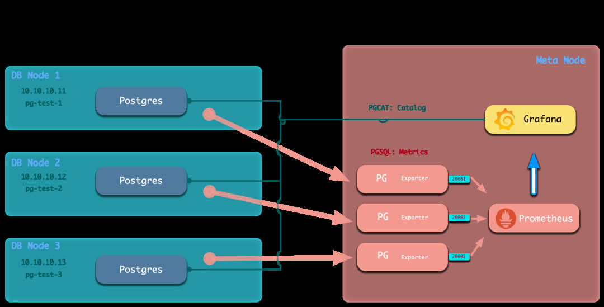

In Pigsty v1.3's monitor-only deployment mode, external PostgreSQL instances are also registered in Grafana with PGCAT enabled by default.

----------------

## PGSQL Enhancements

The core PGSQL monitoring application also received significant improvements.

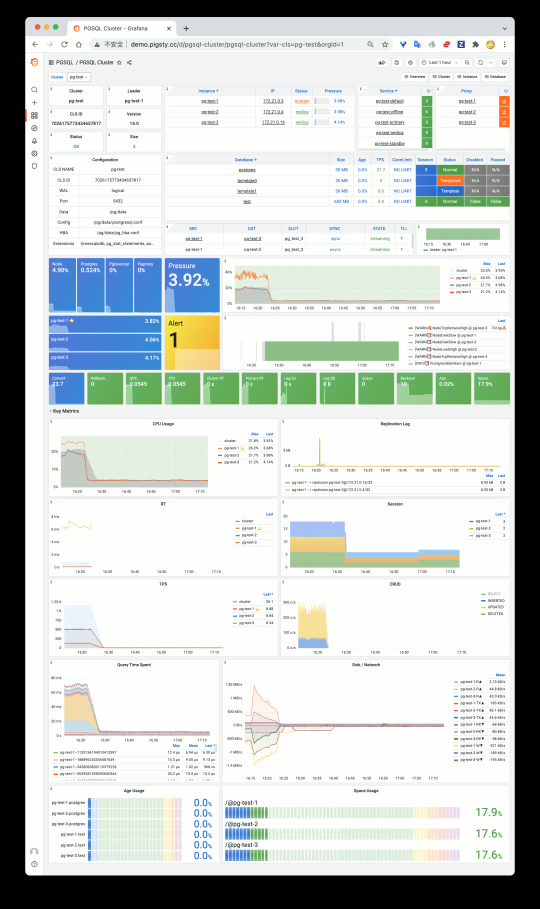

In Pigsty v1.3, the PGSQL Cluster dashboard adds quick-navigation panels for 10 key metrics.

Both PGSQL Instance and PGSQL Cluster now include quick-navigation panels for rapid problem identification. PGSQL Service was completely redesigned — simpler and more intuitive for quickly understanding cluster topology. Other dashboards also received optimizations and improvements.

Additionally, v1.3 includes improvements to the semi-automated database migration playbook and profiling tool support.

----------------

## v1.3.0 Release Notes

**Redis Support**

| Feature | Description |
|---------|-------------|
| Redis Deployment | Standalone, Sentinel, and Cluster modes |
| Redis Monitoring | Overview, Cluster, and Instance dashboards |

**PGCAT Overhaul**

| Dashboard | Description |
|-----------|-------------|
| PGCAT Instance | New instance-level catalog dashboard |
| PGCAT Database | New database-level catalog dashboard |
| PGCAT Table | Redesigned table-level dashboard |

**PGSQL Enhancements**

| Dashboard | Improvements |
|-----------|--------------|
| PGSQL Cluster | Added 10 key metric panels |
| PGSQL Instance | Added 10 key metric panels |
| PGSQL Service | Simplified and redesigned |
| Cross-references | Navigation links between PGCAT and PGSQL dashboards |

**Monitor Deployment**

- Grafana datasources auto-register during monitor-only deployment

**Software Upgrades**

- PostgreSQL 13 added to default package list
- PostgreSQL upgraded to 14.1 as default
- Added Greenplum RPM packages and dependencies
- Added Redis RPM and source packages
- Added `perf` as default package

----------------

## v1.3.1 Release Notes

**Monitoring**

- PGSQL & PGCAT dashboard improvements
- Optimized PGCAT Instance & PGCAT Database layout
- Added key metric panels to PGSQL Instance dashboard (consistent with PGSQL Cluster)
- Added table/index bloat panels to PGCAT Database, removed PGCAT Bloat dashboard
- Added index information to PGCAT Database dashboard
- Fixed broken panels in Grafana 8.3
- Added Redis index to Nginx homepage

**Deployment**

- New `infra-demo.yml` playbook for one-click bootstrap
- New `infra-jupyter.yml` playbook for optional JupyterLab server
- New `infra-pgweb.yml` playbook for optional PGWeb server
- Added `pg` alias on meta node for starting PostgreSQL cluster from admin user
- Adjusted `max_locks_per_transactions` in all Patroni config templates per `timescaledb-tune` recommendations
- Added `citus.node_conninfo: 'sslmode=prefer'` to config templates for SSL-free Citus usage
- Added all extensions (except pgrouting) from PGDG14 to package list
- Upgraded node_exporter to v1.3.1
- Added PostgREST v9.0.0 for generating REST APIs from PostgreSQL schemas

**Bug Fixes**

- Grafana security vulnerability fix (upgraded to v8.3.1, [details](https://grafana.com/blog/2021/12/07/grafana-8.3.1-8.2.7-8.1.8-and-8.0.7-released-with-high-severity-security-fix/))
- Fixed `pg_instance` & `pg_service` issues in `register` role when starting playbook mid-run
- Fixed Nginx homepage rendering on hosts without `pg_cluster` variable
- Fixed style issues when upgrading to Grafana 8.3.1
