Pigsty v1.4 正式发布！全新的模块化架构：四大内置模块 **INFRA**、**NODES**、**PGSQL**、**REDIS** 可以独立使用并自由组合；新增时序数据仓库 MatrixDB 部署与监控支持；新建设了全球 CDN 加速下载。


Github Star 增长势头正式开始！


--------

## 模块化架构

Pigsty v1.4 最核心的特性是对底层架构的重大重构。在 v1.4 中，整个系统解耦成 4 个独立的模块，可以独立维护，自由排列组合使用：

| 模块 | 功能 |
|-----|------|
| **INFRA** | 基础设施：监控/告警/可视化/日志/DNS/NTP 等公共组件 |
| **NODES** | 主机节点管理模块 |
| **PGSQL** | PostgreSQL 数据库部署管控模块 |
| **REDIS** | Redis 数据库部署管控模块 |

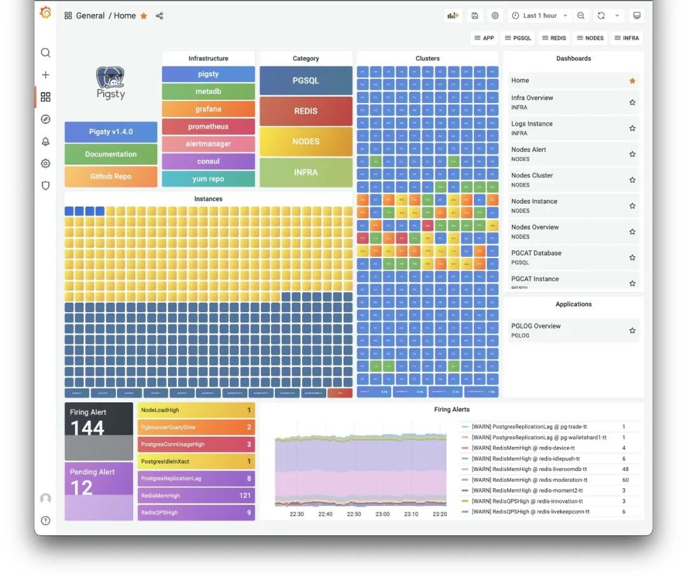

> 全新的 Pigsty v1.4 监控首页

**典型部署场景**：

- **单机 PostgreSQL 发行版**：在一台机器上依次安装 INFRA + NODES + PGSQL 三个模块，即可获得一个立即可用的、自我监控管理的数据库实例。

- **生产级主机监控系统**：在一台机器上安装 INFRA 模块，在所有被监控的机器节点上安装 NODES 模块即可。所有主机节点会配置软件源、软件包、DNS、NTP、节点监控、日志收集、DCS Agent 这些生产环境所需的组件。

- **大量 PostgreSQL 集群**：在纳入 Pigsty 管理的节点上加装 PGSQL 模块即可。可以一键部署各种 PostgreSQL 集群：单实例、一主 N 从的高可用集群、同步集群、法定人数提交的同步集群、带有离线 ETL 角色的集群、异地容灾的备集群、延迟复制集群、Citus 分布式集群、TimescaleDB 集群、MatrixDB 数据仓库集群。

- **Redis 集群**：在 Pigsty 托管的节点上加装 REDIS 模块即可。后续添加新类型的数据库模块（如 KAFKA、MINIO、MYSQL）都可以用类似的方式加入到 Pigsty 中。

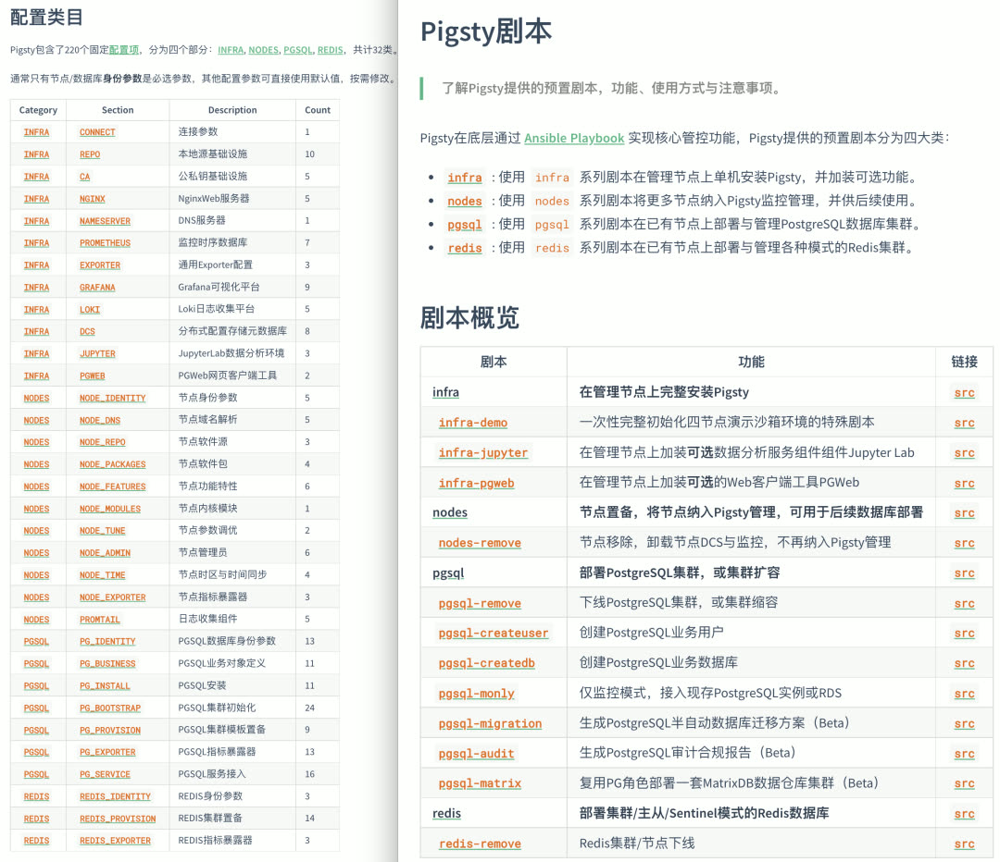

> 模块化后的剧本与配置参数


--------

## 全新数据库支持

PostgreSQL 是一个全能的数据库内核，但当组织与数据成长到一定规模后，使用专有数据组件的需求也会随之出现。最典型的两类是：以 Redis 为代表的**缓存**，以及以 Greenplum 为代表的**数据仓库**。

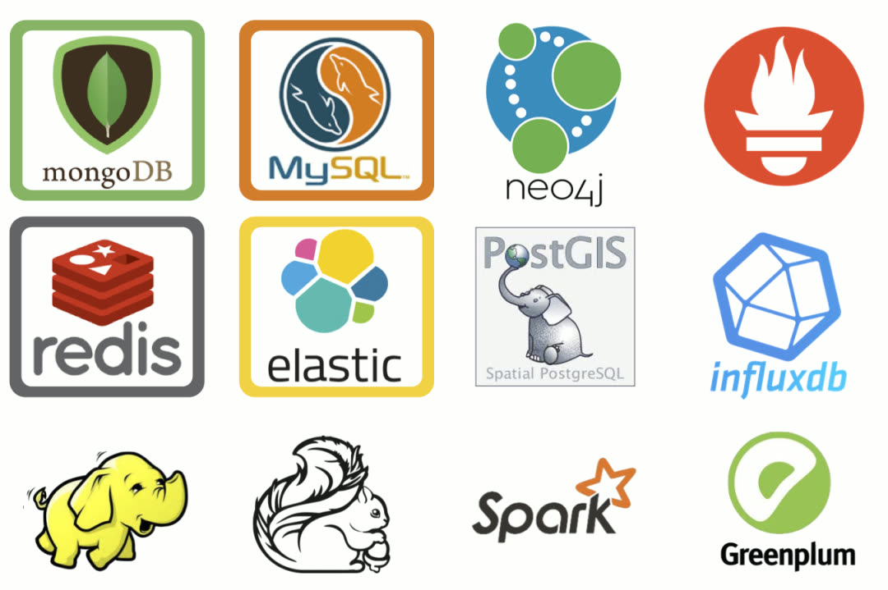

Redis 可以进一步强化业务系统的 OLTP 处理能力，分担数据库压力，模型简单易用，广受开发者喜爱。而 Greenplum 则可以显著强化业务系统的 OLAP 能力，采用与 PostgreSQL 一致的语言、驱动与接口，将数据分析的量级从几十 TB 提升到 PB 乃至 ZB 级别。

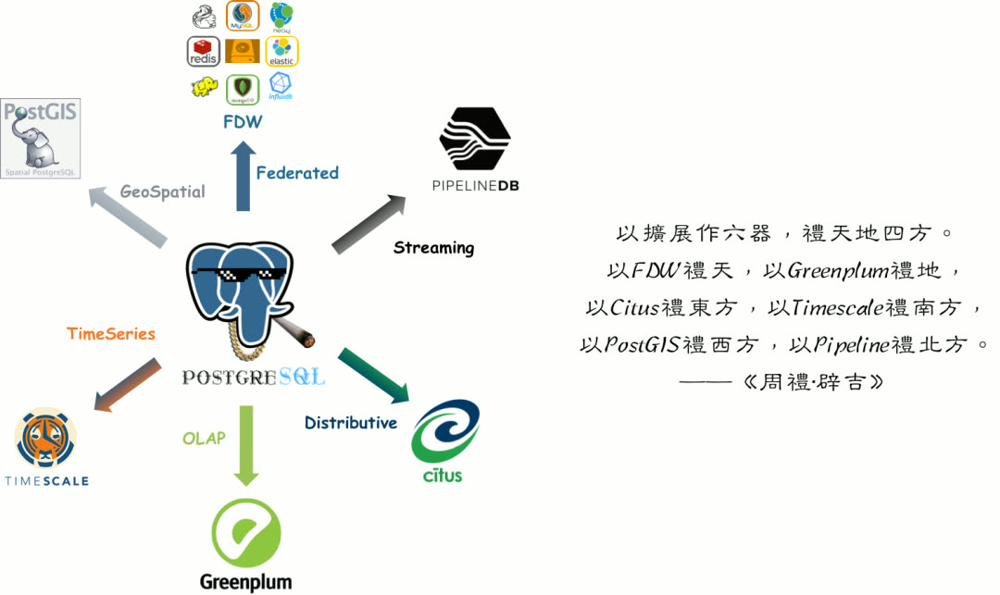

Redis 与 Greenplum 在两个方向上扩展了 PostgreSQL 的能力边界，这两者都是 PostgreSQL 的拍档，经常组合使用。因此，Pigsty 在 v1.4 中提供了对 Redis 与 Greenplum 的初步支持。

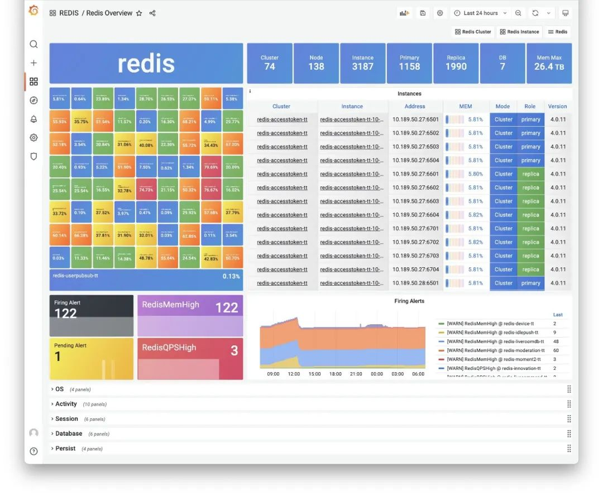

> Redis Overview 面版

需要说明的是，Pigsty 支持的并不是原生的 Greenplum，而是它的一个分支：**MatrixDB**。Greenplum 的正式版本目前仍然是 6.x，基于 PostgreSQL 9.6 内核。而 MatrixDB 则基于 Greenplum 7 和 PostgreSQL 12 内核，还有额外的时序功能支持。因此 Pigsty 使用 MatrixDB 作为 Greenplum 的替代实现。

Pigsty v1.4 中，并没有专门的 **MATRIXDB** 模块，MatrixDB 的部署完全复用了 **PGSQL** 模块。可以用熟悉的配置参数来配置 MatrixDB。在 Pigsty 看来，一套 MatrixDB 数据仓库在逻辑上就是 N 对标准的一主一从 PGSQL 集群：一个标准的 Master 集群（Master & Standby），以及很多组散布在多个节点上的 Segment 集群（Primary & Mirror）。所有 PGSQL 的面板都可以直接用在 MatrixDB 上。

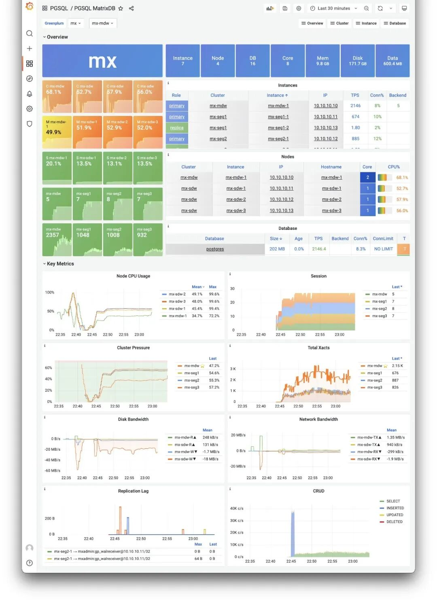

> PGSQL MatrixDB 面版

专用的 Dashboard：PGSQL Matrix 用于展示一套 MatrixDB 的核心监控指标，其他监控面板均复用已有的 PGSQL 面板。

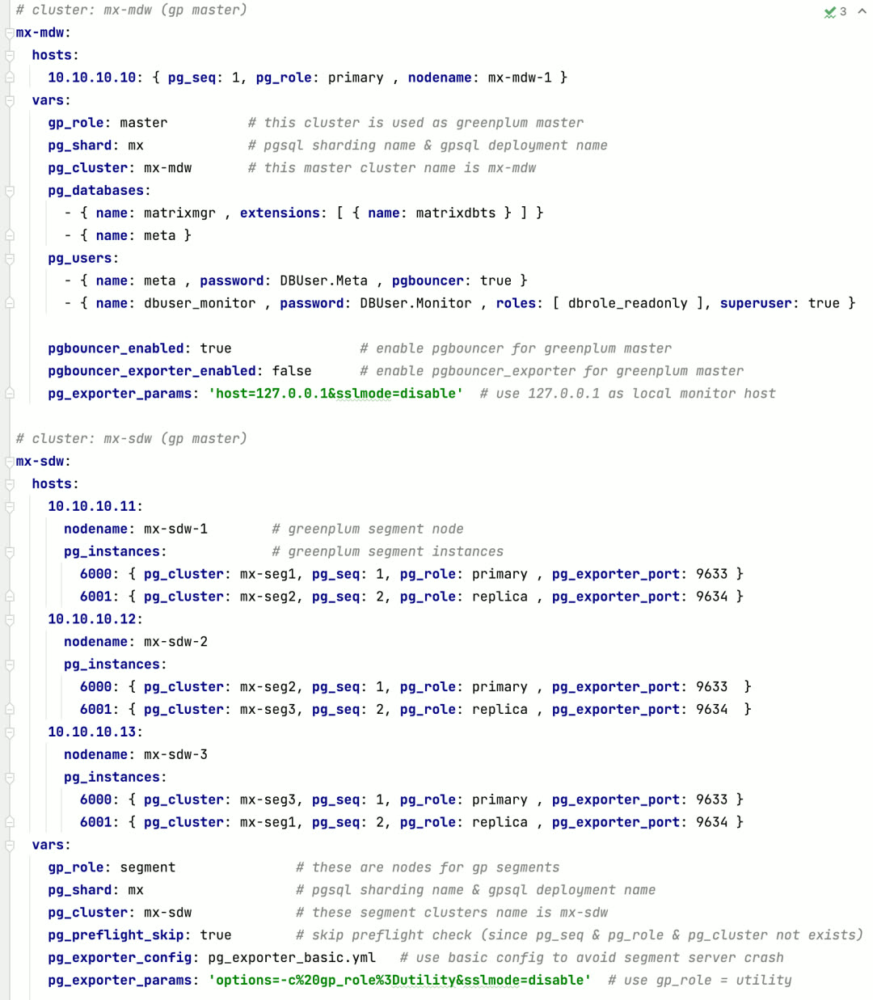

> 定义 4 节点 MatrixDB 只需要这些配置


--------

## 监控系统演进

监控系统一直以来在 Pigsty 中扮演着核心角色。在 v1.4 中，Pigsty 的监控系统有着显著的改进。


### 主机监控

Pigsty v1.4 引入了全新的节点监控功能，这也是模块化改造的一个直接成果。在以前，机器的监控指标是 1:1 与 PostgreSQL 实例绑定的。对于 PostgreSQL 发行版来说，这样的设计没有问题。但随着 Pigsty 的发展，这样的设计开始显得不合时宜。

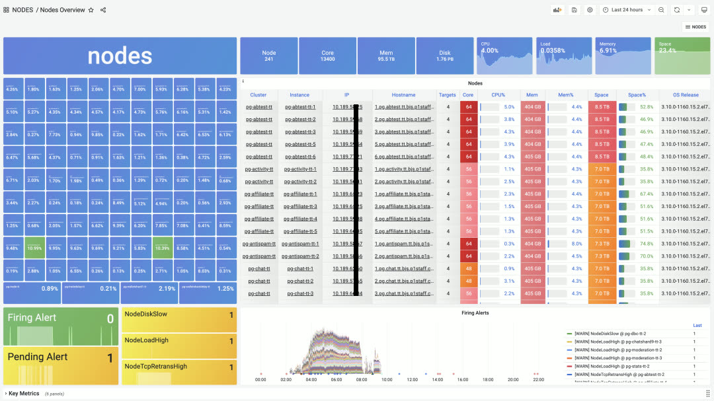

> NODES Overview 面板，提供所有节点的导航

用户可能有各种各样的使用方式与部署策略，例如在一个节点上部署多个数据库实例，甚至部署多种不同类型的数据库。在这种情况下，合适的做法是把节点的管理与监控单独抽离出来，不与具体的数据库类型绑定。

这样做有两个显著的好处：一是如果用户不需要数据库监控与管理，只需要节点的监控与管理，那么会比以前简单很多；第二是一个节点上可以部署多个甚至多种数据库，并复用同样的节点监控指标数据。任何时候，只要点击 IP 地址，就可以跳转到具体的 NODES Instance，查看该节点的详情。

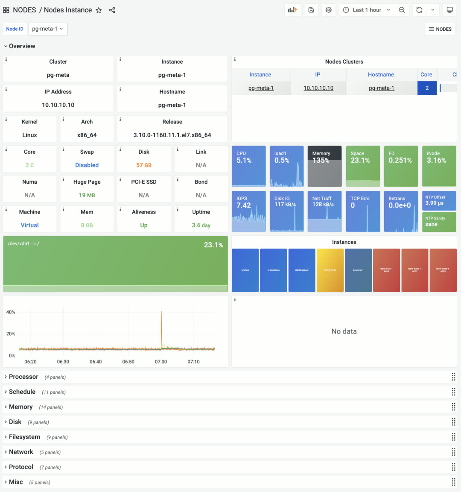

> 曾经的 PGSQL Node 现在变为 NODES Instance

节点监控提供了全局概览、集群以及单个节点三种不同的层次。节点的**集群**可以配置为默认与 PostgreSQL 数据库集群保持一致，也可以有独立的身份配置，方便从不同的角度透视集群资源。

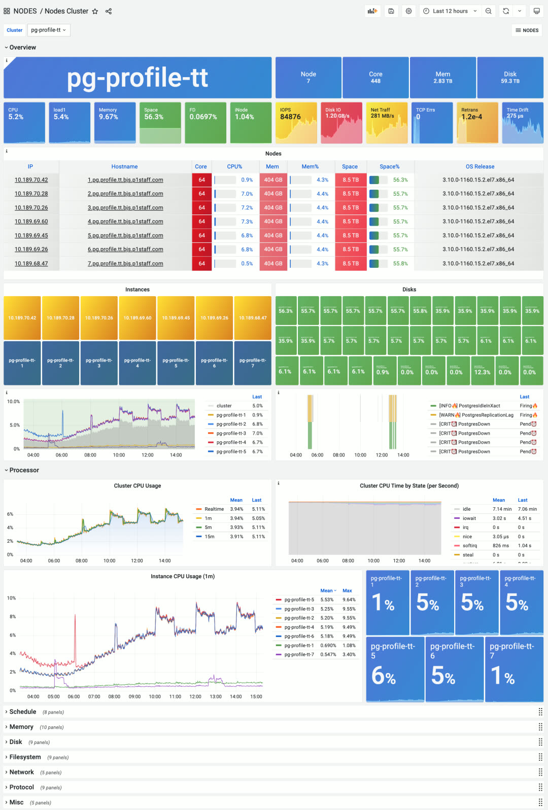

> 新增的 Nodes Cluster 面板，关注一组节点的聚合指标与集群内的水平对比

虽然 Pigsty 的定位是开箱即用的 PostgreSQL 发行版，但其中也包含着主机监控的最佳实践。有些用户根本不需要数据库功能，只是拿 Pigsty 做主机监控。


### 日志收集

在 Pigsty v1.4 中，Loki 与 Promtail 日志收集组件升级为整个系统的默认组件。Loki 是 Grafana 出品的日志收集方案，采用与 Prometheus 类似的标签体系，与 PromQL 类似的 LogQL。是一个轻量化、优雅简洁的日志收集、处理、分析解决方案。

经过一年时间的测试与打磨，Loki 现在已经成为 Pigsty 的默认组成部分，会实时收集各式各样的日志：节点的 syslog、dmesg、cron 日志，数据库 postgres/pgbouncer/patroni 的日志，以及 Redis 日志。


> INFRA 板块的 LOGS Instance 监控面板，可以实时浏览搜索所有日志

ELK 对于 SRE 的日志需求过重，其实大家想要的就是一个高效快速的大规模并行 GREP，Loki 在这件事上表现出色。

此外，除了节点日志，也可以从新的 INFRA Overview 面板，查阅基础设施产生的实时日志数据。


> INFRA 板块的 Overview 面板，可以看到基础设施的各项日志


### PGSQL 监控

Pigsty v1.4 提供了对新数据库种类的监控支持，但对于经典的 PostgreSQL 监控也没有落下。在 v1.4 中，大量 PGSQL 的监控面板进行了调整与重制，最具有代表性的就是 PGSQL Cluster 面板。

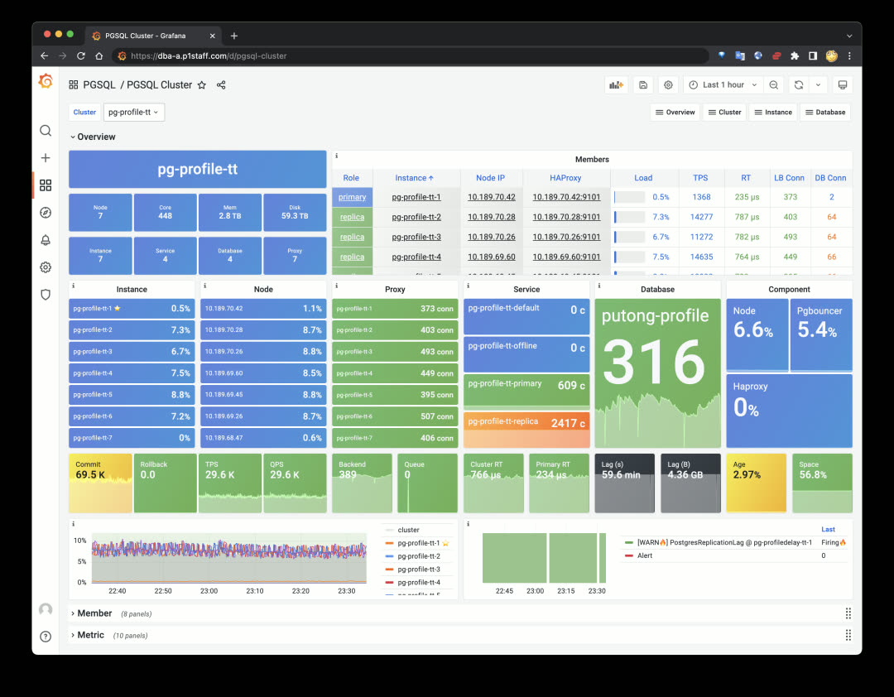

> 全新的 PGSQL Cluster 监控面板首屏

PGSQL Cluster 是 Pigsty 数据库监控中最核心的监控面板之一，承上启下，用于呈现一个自治数据库集群的关键状态。新的设计隐藏了不必要的信息，聚焦于集群资源。可以从首屏快速点击集群内的资源对象，前往细分的监控面板：包括节点、实例、负载均衡器、服务、数据库、服务组件。

除了集群资源对象，PGSQL Cluster 的首屏只呈现最关键的监控指标、报警事件、集群/实例压力水位。其他细节都隐藏在下面的专题栏中。

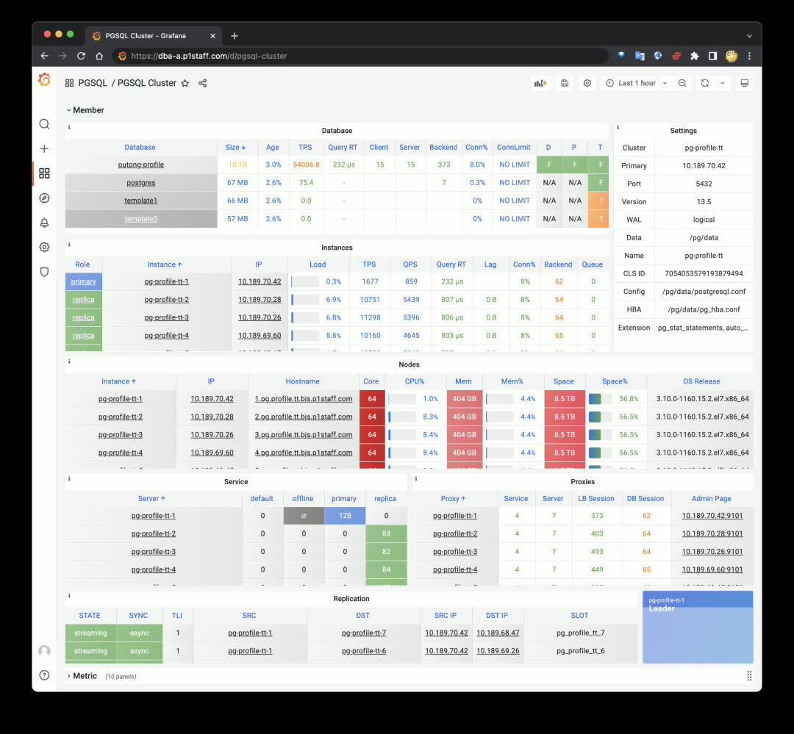

> 成员详情表在默认隐藏的第二栏中

第二个显著改进是新增的 PGSQL Databases 面板。在过去，数据库内监控只关注单个实例内的单个对象。但对于表、索引这样的业务对象，更关注的是它们在整个集群内的整体指标。PGSQL Databases 面板为此而生。可以查询某一个数据库在整个集群内的表现，水平对比集群间不同实例的差异：

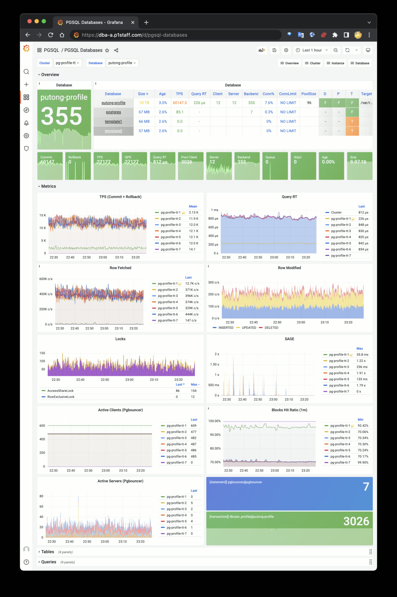

> PGSQL Databases 面板：`agg(metrics{datname=*}) by (ins)`

更重要的是，可以看到每一张表、每一类查询在集群范围内的汇总视图。例如，查阅一张表或一类查询在集群主库与从库实例上的 QPS，或者确认某一个索引在集群不同实例上的使用情况，从而对业务与应用进行有针对性的优化。

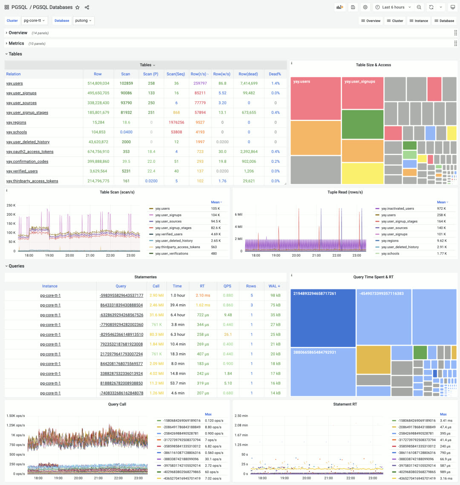

> 库内对象在集群层面的汇总展示：Tables & Queries，点击下钻

带颜色的 TreeMap 可以快速反映出两个维度的属性：对于表而言，大小代表表占用的空间，颜色代表表被访问的频次。对于查询而言，大小代表在此查询上耗费的总时长，颜色代表该类查询的平均响应时间。


### 应用面版

除了 **INFRA**、**NODES**、**PGSQL**、**REDIS** 四个核心模块外，Pigsty Grafana 的首页还有一个板块：**APP**。这是留给用户自己应用的。任何带有 `APP` 和 `Overview` 标签的监控面版会被列入 Pigsty 的面版导航中。Pigsty 自带了一个开箱即用的小应用 PGLOG，用来分析 PostgreSQL 自身的 CSV 日志，可以快速从日志中定位异常，并快速定位跳转到具体连接的详情页。

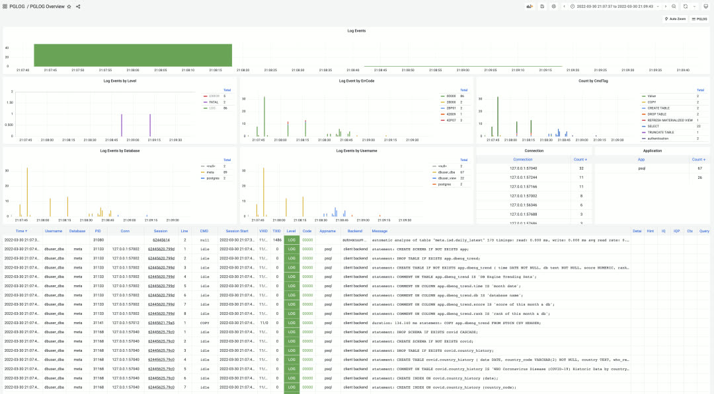

> PGLOG Overview，使用快捷方式快速将日志灌入应用表中分析

此外，Pigsty 还建立了专用的代码仓库 `pigsty-app`，用于盛放 Pigsty 样例应用。目前的应用包括：

| 应用 | 说明 |
|-----|------|
| ISD | NOAA 全球地表气象站历史天气数据查询 |
| COVID | WHO 新冠疫情数据查询 |
| DBENG | DB-Engine 数据库流行度趋势与预测 |
| APPLOG | Apple 应用隐私日志可视化 |
| WORKTIME | 国内大公司上下班时间查询 |

后续将不断添加更多数据应用的样例。

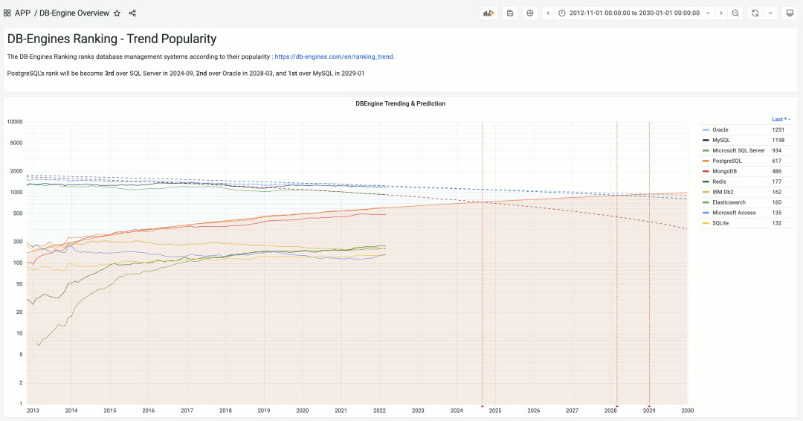

> DBEng Trend：使用权威网站 DBEngine 流行度趋势数据，预测 PostgreSQL 什么时候会成为世界上最流行的关系型数据库


--------

## 安装体验优化 / CDN

此前 Pigsty 使用 Github 作为发布平台，中国大陆访问起来比较吃力。因此启用了全球 CDN 加速域名 `http://download.pigsty.cc`。例如最新的软件源码包与离线软件包的下载地址分别为：

```
http://download.pigsty.cc/v1.4.0/pigsty.tgz  (2MB)
http://download.pigsty.cc/v1.4.0/pkg.tgz     (940MB)
```

Pigsty 的软件包进行了一次重新梳理与瘦身，从原本的 1.3GB 压缩至 v1.4 的 940MB。需要安装 Greenplum 与 MatrixDB 的用户，单独下载另一个离线软件包 `matrix.tgz`（338MB）即可。

在 Pigsty v1.4 中提供了专用的下载脚本 `download`，可用于自动下载并解压可选的软件包 `pkg.tgz`、`matrix.tgz`、`app.tgz`。这个脚本会自动检测网络环境，如果在墙外使用默认的 Github Releases，在墙内则使用腾讯云 CDN 下载。

现在安装 Pigsty 的流程如下：

```bash
bash -c "$(curl -fsSL http://download.pigsty.cc/get)" # 下载
./download pkg matrix app   # 下载并解压可选的扩展软件包（可选步骤）
cd ~/pigsty && ./configure  # 配置
make install                # 安装
```


--------

## 典型用户案例

探探是 Pigsty 最大的用户案例。2022 年 3 月份，探探下线了最后一套遗留的旧 PostgreSQL 数据库 `pg.meta.tt`，生产环境所有数据库均已迁移至 Pigsty，一百套集群全部由 Pigsty v1.3.1 所托管（监控系统版本为 v1.4）。所有集群的高可用自动切换也已经启用，历时近两年的**数据库飞升项目**正式宣告完工。

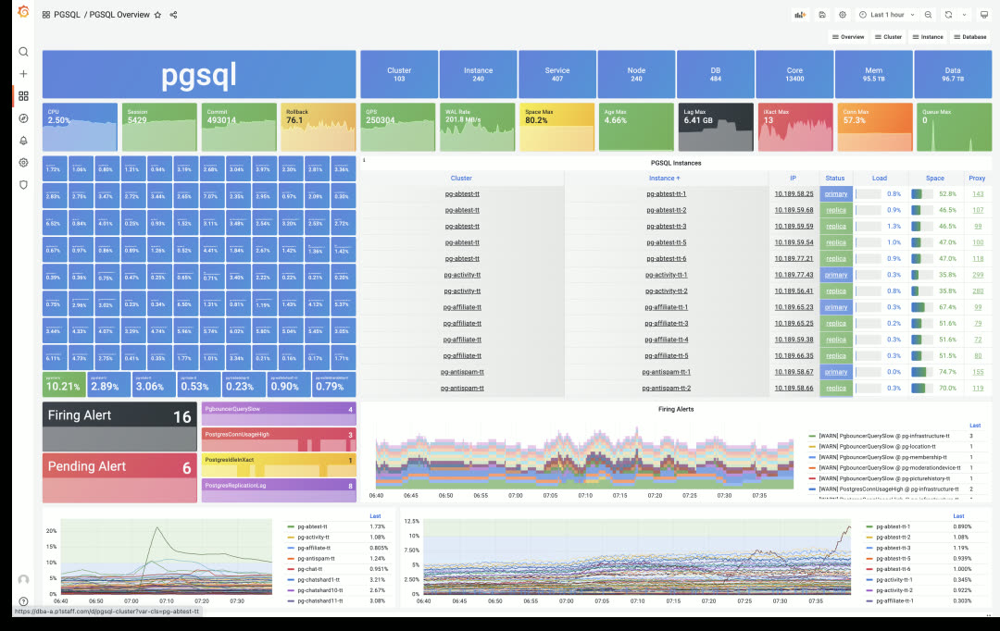

> 探探主生产环境的 Pigsty 部署：240 实例 13400 核的 PostgreSQL OLTP 集群

在探探，Pigsty 经过了长时间、大规模、严苛的实际生产环境测试。在两年的时间里不断打磨完善，最终演变为今天的样子。在近期的混沌工程演练中，运维随机挑选数据库机器进行多次宕机演练，Pigsty 在无人值守的情况下可以自动进行高可用主从/流量切换。从库宕机无业务影响，主库宕机对业务写入影响不超过 1 分钟。

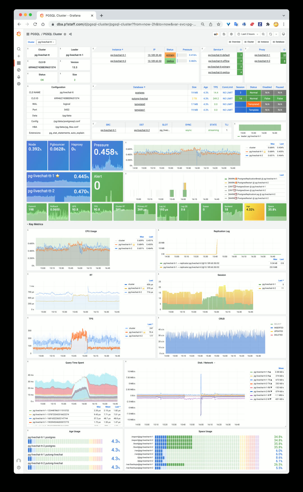

> 一次典型从库宕机现场，读流量迅速由主库承担，业务只有极个别现场查询中断报错，而后立即恢复

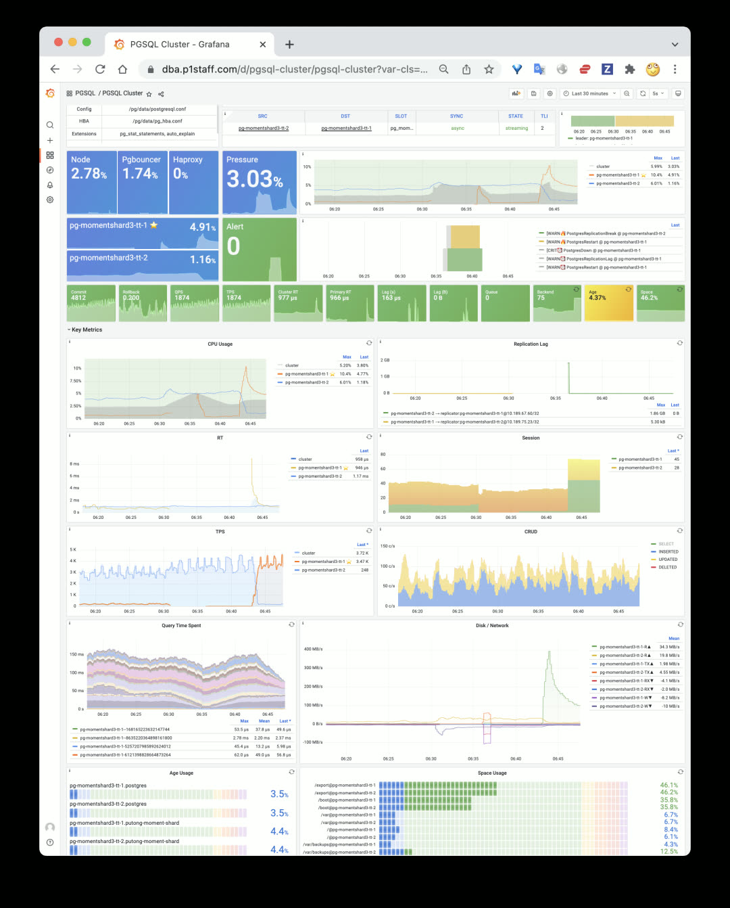

> 一次典型主库宕机现场。主库宕机 30s 后，从库被提升新主库，影响 30s 业务写入请求后自愈


--------
--------

## v1.4.0 发行注记

### 架构

- 将系统解耦为 4 大类别：`INFRA`、`NODES`、`PGSQL`、`REDIS`，这使得 Pigsty 更加清晰、更易于扩展。
- 单节点部署 = `INFRA` + `NODES` + `PGSQL`
- 部署 PGSQL 集群 = `NODES` + `PGSQL`
- 部署 Redis 集群 = `NODES` + `REDIS`
- 部署其他数据库 = `NODES` + xxx（例如 `MONGO`、`KAFKA`...）

### 可访问性

- 为中国大陆提供 CDN。
- 使用 `bash -c "$(curl -fsSL http://get.pigsty.cc/latest)"` 获取最新源代码。
- 使用新的 `download` 脚本下载并提取包。

### 监控增强

- 将监控系统分为 5 大类别：`INFRA`、`NODES`、`REDIS`、`PGSQL`、`APP`
- 默认启用日志记录
  - 现在默认启用 `loki` 和 `promtail`，带有预构建的 [loki-rpm](https://github.com/Vonng/loki-rpm)。
- 模型和标签
  - 为所有仪表板添加了一个隐藏的 `ds` prometheus 数据源变量
  - 为所有指标添加了一个 `ip` 标签，并将其用作数据库指标和节点指标之间的连接键
- INFRA 监控
  - Infra 主仪表板：INFRA 概览
  - 添加日志仪表板：日志实例
  - PGLOG 分析和 PGLOG 会话现在被视为示例 Pigsty APP
- NODES 监控应用
  - 可以单独使用 Pigsty 作为主机监控软件
  - 包括 4 个核心仪表板：节点概览 & 节点集群 & 节点实例 & 节点警报
  - 为节点引入新的身份变量：`node_cluster` 和 `nodename`
- PGSQL 监控增强
  - 全新 PGSQL Cluster，简化并专注于集群中的重要内容
  - 新仪表板 PGSQL Databases 是集群级对象监控
  - PGSQL Alert 仪表板现在只关注 PGSQL 警报
  - PGSQL Shard 已添加到 PGSQL 中
- Redis 监控增强
  - 为所有 Redis 仪表板添加节点监控

### MatrixDB 支持

- 通过 `pigsty-matrix.yml` playbook 可以部署 MatrixDB（Greenplum 7）
- MatrixDB 监控仪表板：PGSQL MatrixDB
- 添加示例配置：`pigsty-mxdb.yml`

### 软件升级

- PostgreSQL 14.2
- PostGIS 3.2
- TimescaleDB 2.6
- Patroni 2.1.3（Prometheus 指标 + 故障转移插槽）
- HAProxy 2.5.5（修复统计错误，更多指标）
- PG Exporter 0.4.1（超时参数等）
- Grafana 8.4.4
- Prometheus 2.33.4
- Greenplum 6.19.4 / MatrixDB 4.4.0
- Loki 现在作为 RPM 包提供，而不是 ZIP 存档

### 错误修复

- 删除 Patroni 的 Consul 依赖，这使其更容易迁移到新的 Consul 集群
- 修复 Prometheus bin/new 脚本的默认数据目录路径
- 在 vip-manager systemd 服务中添加重新启动秒数
- 修复错别字和任务

### API 变更

**新增变量**

- `node_cluster`：节点集群的身份变量
- `nodename_overwrite`：如果设置，则 nodename 将设置为节点的主机名
- `nodename_exchange`：交换 play 主机之间的节点主机名（在 `/etc/hosts` 中）
- `node_dns_hosts_extra`：可以通过单个实例/集群轻松覆盖的额外静态 DNS 记录
- `patroni_enabled`：如果禁用，postgres & patroni 的引导过程不会在 `postgres` 角色期间执行
- `pgbouncer_enabled`：如果禁用，pgbouncer 在 `postgres` 角色期间不会启动
- `pg_exporter_params`：生成监控目标 URL 时为 pg_exporter 提供的额外 URL 参数
- `pg_provision`：布尔值变量，表示是否执行 `postgres` 角色的资源配置部分
- `no_cmdb`：用于 `infra.yml` 和 `infra-demo.yml` 播放书，不会在元节点上创建 CMDB


--------

## v1.4.1 发行注记

日常错误修复 / Docker 支持 / 英文文档

现在默认在元节点上启用 Docker，可以用它启动大量各类软件。

**Bug 修复**

- 修复 Promtail & Loki 配置变量问题
- 修复 Grafana 旧版警报
- 默认禁用 nameserver
- 为 Patroni 快捷方式重命名 pg-alias.sh
- 为所有仪表板禁用 exemplars 查询
- 修复 Loki 数据目录问题
- 将 `autovacuum_freeze_max_age` 从 100000000 更改为 1000000000
