> [**GitHub Release**](https://github.com/pgsty/pigsty/releases/tag/v1.5.0) | [**发布注记**](https://pigsty.cc/docs/releasenote/#v150) | [微信公众号](https://mp.weixin.qq.com/s?__biz=MzU5ODAyNTM5Ng==&mid=2247485125&idx=1&sn=d06a14013aa02ecd1da307b4b3038054&chksm=fe4b331ec93cba08624adb70e626e4b45ede9ea5d8ae01fad779e82687ff0064c56bf9b42187&scene=21#wechat_redirect)

[](https://github.com/pgsty/pigsty/releases/tag/v1.5.0)

Pigsty v1.5 正式发布！完整的 Docker 支持带来了丰富的应用生态，无数使用数据库的软件均可**开箱即用**！

其他改进包括：基础设施自我监控、更好的冷备份支持、兼容 Redis 与 Greenplum 的新 CMDB、ETCD 作为高可用 DCS、更好的日志收集与呈现。Github Star 突破 500！


--------

## 亮点特性

| 特性 | 说明 |
|-----|------|
| Docker 支持 | 管理节点默认启用，提供丰富的开箱即用软件模板 |
| 基础设施自监控 | Nginx、ETCD、Consul、Prometheus、Grafana、Loki |
| CMDB 升级 | 支持 Redis/Greenplum 集群元数据，配置可视化 |
| 服务发现改进 | Consul 自动发现监控对象，纳入 Prometheus |
| 冷备份增强 | 默认定时备份任务，pg_probackup，一键延迟从库 |
| ETCD 作为 DCS | PostgreSQL/Patroni 的 Consul 备选方案 |
| Redis 改进 | 支持单实例级别的初始化与移除操作 |


--------

## Docker 支持

Pigsty v1.5 中最重要的特性莫过于 Docker 支持。无数软件与工具都可以通过 Docker 方式开箱即用：**开箱即用的数据库 + 开箱即用的应用 = 开箱即用的软件解决方案**。

很多软件都需要用到数据库，但数据库放入容器中仍然是一个充满争议的话题。基于 Docker 镜像的玩具数据库与生产级数据库之间存在巨大差距。Pigsty 可以将两者的优势融合：有状态的数据库使用 Pigsty 管理，运行于标准的物理机或虚拟机上（如 PostgreSQL 与 Redis）；而无状态的应用使用 Docker 运行，这些应用的状态存储在 Pigsty 托管的外部数据库中。

在 Pigsty v1.4.1 中，Docker 作为实验特性被加入；在 v1.5 中，Docker 将作为 Pigsty 的默认组件，在管理节点上默认启用。普通节点默认关闭，但可以通过配置项在所有节点上启用 Docker。


--------

## 应用生态

Docker 本身只是工具，重要的是 Docker 所代表的巨大**应用生态**！

Pigsty 挑选了一些常用软件，特别是那些使用 PostgreSQL 与 Redis 的软件，制作了一键拉起的教程与快捷方式，并提供可以离线使用自动加载的镜像软件包 `docker.tgz`。

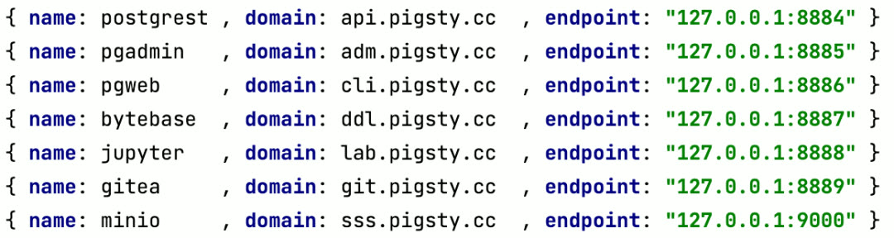


### 代码托管平台 Gitea

如果需要启动一个私有的代码托管服务，可以使用以下命令一键拉起 Gitea：

```bash
cd ~/pigsty/app/gitea; make up
```

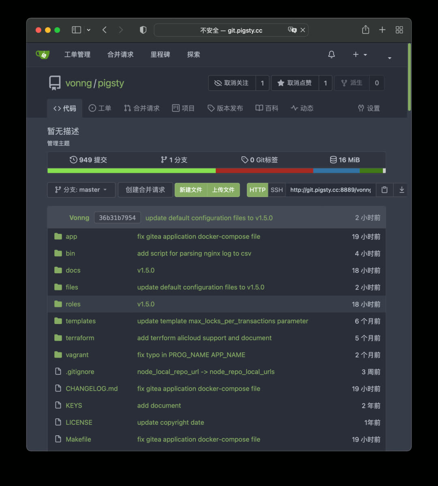

该命令将使用 Docker Compose 配置文件拉起 Gitea 镜像，并使用外部 Pigsty 默认的 CMDB `pg-meta.gitea` 作为元数据存储。访问配置文件指定的域名或端口，即可访问自己的代码托管服务。


### 数据库管控平台 PgAdmin

PgAdmin4 是老牌的 PostgreSQL 管控工具，提供了很多实用功能。Pigsty 提供了最新的 6.9 版本 PgAdmin4 支持，只需一行命令即可启动镜像，并自动加载 Pigsty 中所有托管数据库实例列表。

```bash
cd ~/pigsty/app/pgadmin; make up; make conf
```

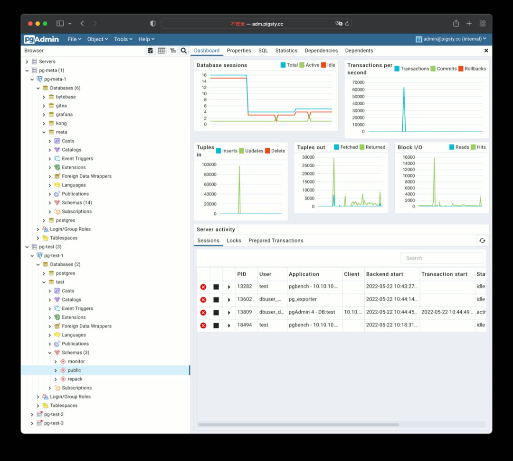


### 模式变更工具 Bytebase

Bytebase 是一款为 PostgreSQL 设计的模式变更管理工具，采用 Git 工作流、工单审批的方式来对数据库模式进行版本控制。Bytebase 本身的元数据也使用 PostgreSQL 存储。

```bash
cd ~/pigsty/app/bytebase; make up
```

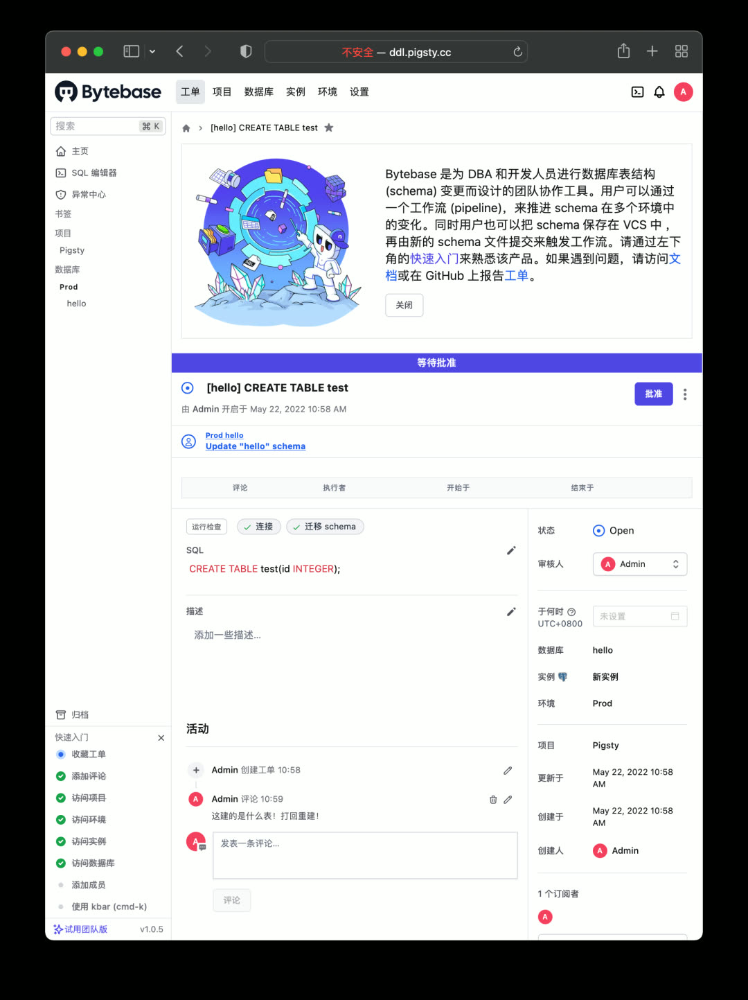


### 网页客户端 PGWEB

有时用户想使用个人账号从生产数据库中小批量查询数据，这时基于浏览器的 PostgreSQL 客户端会很好用。PGWEB 可以部署在管理节点或专用堡垒机上，设置特定的 HBA 规则来允许个人用户查询生产只读实例。

```bash
cd ~/pigsty/app/pgweb; make up
```

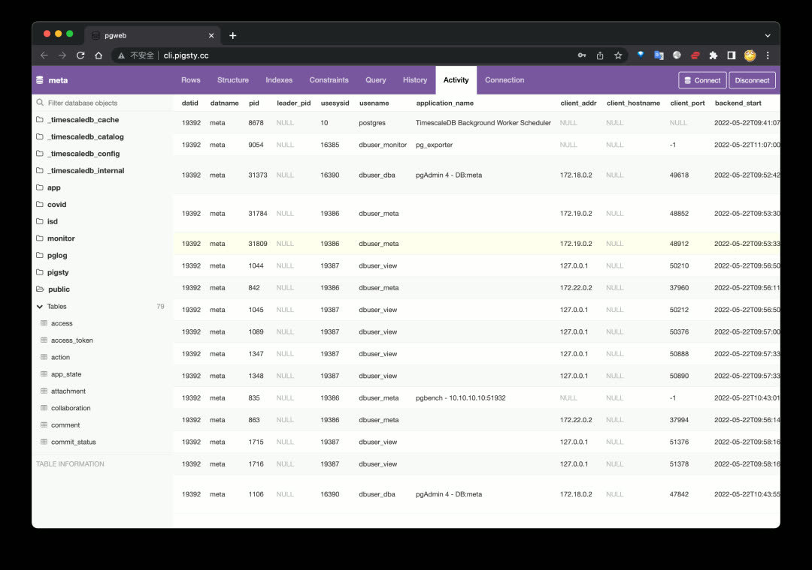


### 对象存储 MinIO

对象存储是云厂商提供的基础服务，在私有部署条件下，可以使用 MinIO 快速搭建自己的对象存储。它可以用于存储文档、图像、视频、备份，自动进行冗余备份与容灾，并对外提供标准的 S3 兼容 API。

```bash
cd ~/pigsty/app/minio; make up
```

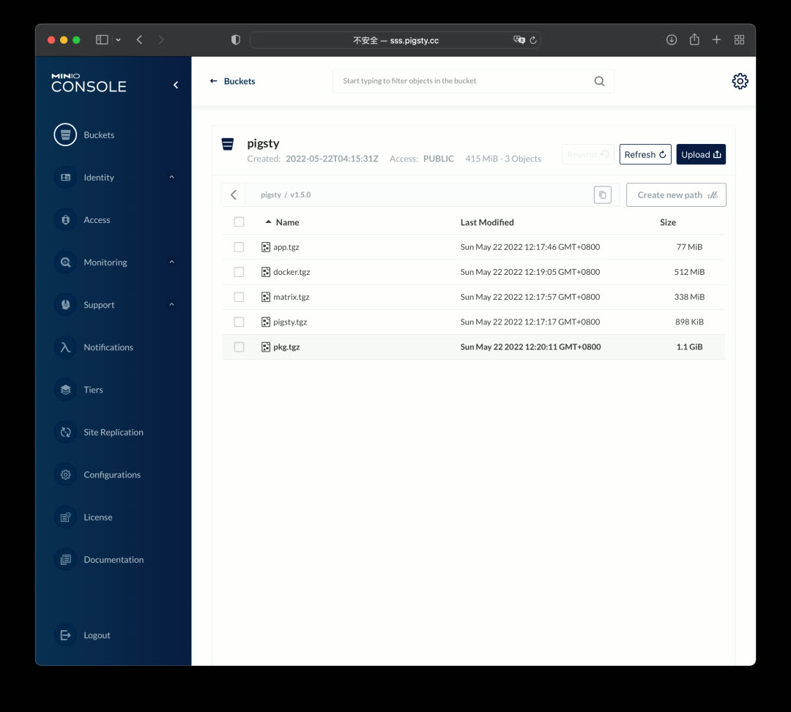

在 MinIO 的基础上，可以进一步使用 JuiceFS，将对象存储提供的大规模分布式存储转换为文件系统，供其他服务使用。


--------

## 数据分析环境 Jupyter

Pigsty 提供了趁手的数据分析工具：Jupyter Lab，可以使用 Python 与 SQL 进行组合数据处理与分析。Jupyter Lab 默认并不是通过 Docker 启动，而是由管理节点受限的操作系统用户直接运行，以便于与数据库交互。

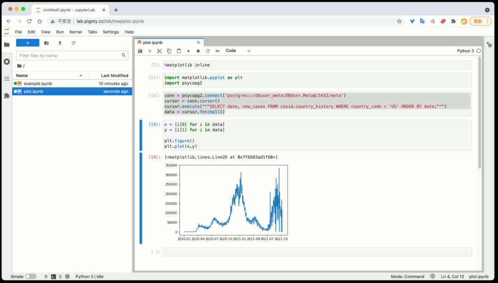


### 数据库模式报表 SchemaSPY

当需要生成某个数据库模式的详情报表时，可以使用 SchemaSPY：

```bash
bin/schemaspy 10.10.10.10 meta pigsty
```

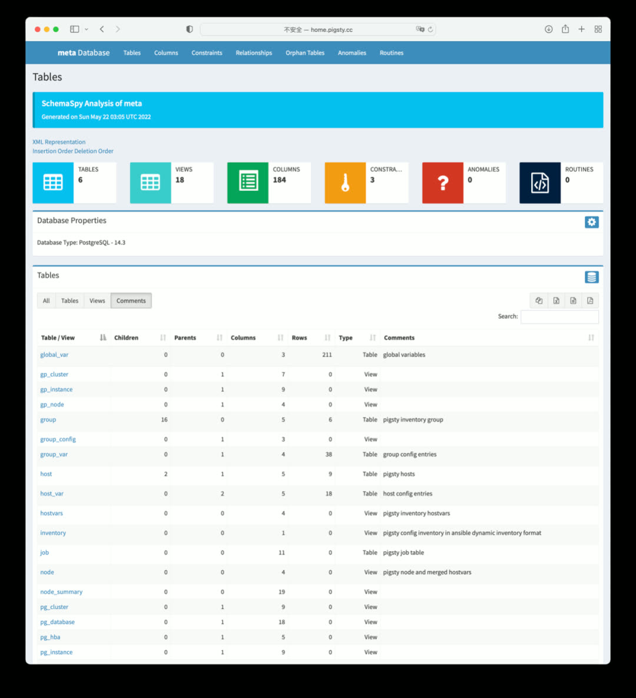


### 数据库日志分析报表

当需要查阅数据库日志的汇总摘要信息时，可以使用 Pgbadger：

```bash
bin/pglog-summary 10.10.10.10
```

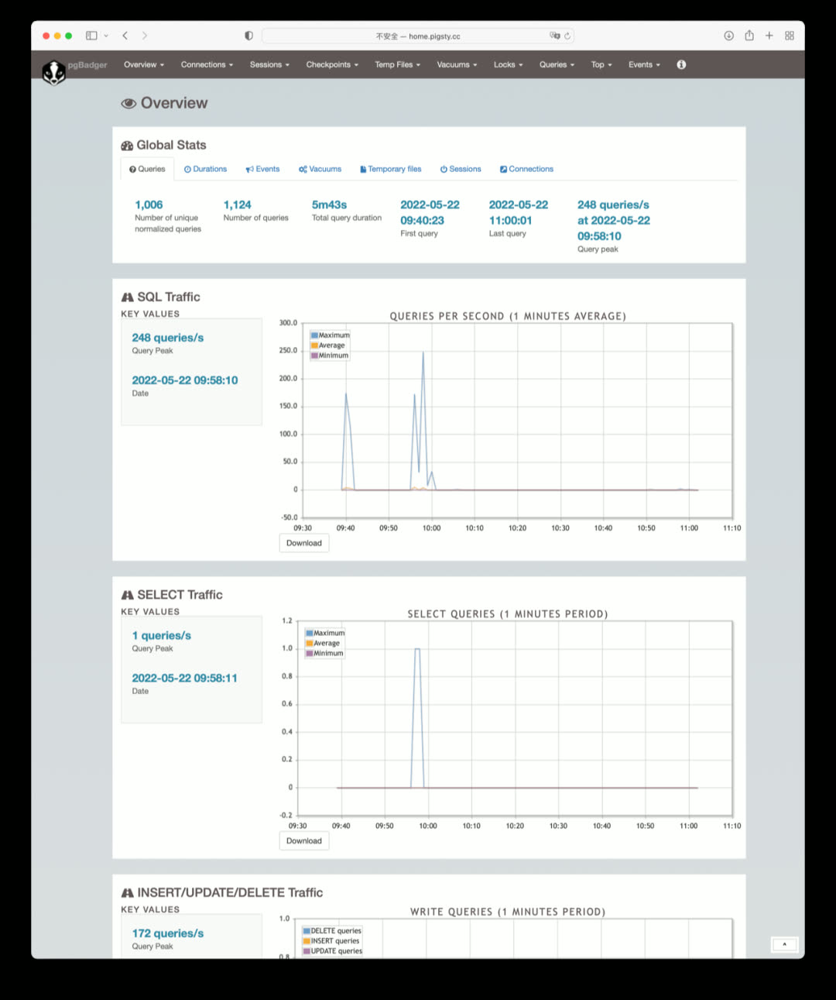


### 更多应用

此外，还有很多知名的软件应用都可以使用 Pigsty + Docker 一键拉起：

| 应用 | 说明 |
|-----|------|
| Gitlab | 使用 PG 的开源代码托管平台 |
| Habour | 使用 PG 的开源镜像仓库 |
| Jira | 使用 PG 的开源项目管理平台 |
| Confluence | 使用 PG 的开源知识托管平台 |
| Odoo | 使用 PG 的开源 ERP |
| Mastodon | 基于 PG 的社交网络 |
| Discourse | 基于 PG 与 Redis 的开源论坛 |
| KeyCloak | 开源 SSO 单点登录解决方案 |


--------

## 更好的冷备份

数据故障大体可以分为两类：**硬件故障/资源不足**（坏盘/宕机）和**软件缺陷/人为错误**（删库/删表）。**基于主从复制的物理复制用于应对前者，延迟从库与冷备份通常用于应对后者**。因为误删数据的操作会立刻被复制到从库上执行，所以热备份与温备份都无法解决诸如 `DROP DATABASE`、`DROP TABLE` 这样的错误，需要使用**冷备份**或**延迟从库**。

在 Pigsty v1.5 中，对冷备份机制进行了改善：

- 添加了定时任务机制，每天制作全量冷备份
- 改善了延迟从库的创建机制，只需声明即可自动创建
- 对于专家用户，提供了 `pg_probackup` 作为备份解决方案
- 内置的 MinIO Docker 镜像将为后续的开箱即用异地灾备中心奠定基础


### 定时任务

Pigsty v1.5 支持为节点配置定时任务，包括追加与覆盖 `/etc/crontab` 两种模式。可以将制作基础物理冷备份、日志分析、模式转储、垃圾回收、分析统计任务以统一的、声明式的方式管理起来。

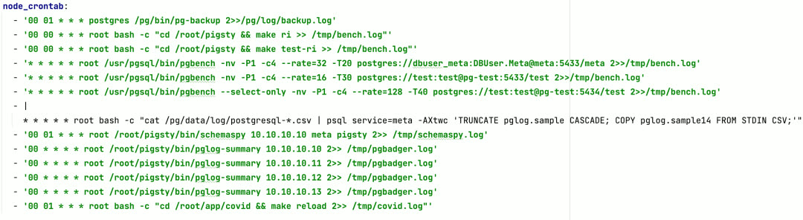

其中最重要的是默认在每天凌晨 1 点制作一个全量备份。加上 Pigsty 默认自带的最近一天 WAL 日志归档，可以将数据库恢复至 1 天内的任意状态，为软件缺陷、人为故障导致的删库删表提供了有力的兜底。


### 延迟从库

在 Pigsty v1.5 中，创建延迟从库不再需要手工执行 `patronictl edit-config` 调整集群配置，只需像下面这样声明，即可为集群创建一个延迟从库（集群）。

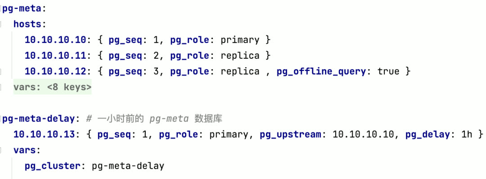


--------

## CMDB 兼容性改进

Pigsty 有一个可选的 CMDB，允许用元节点上的默认 PostgreSQL 数据库存储配置，而不是默认的配置文件 `pigsty.yml`。

Pigsty CMDB 最早于 0.8 版本引入，当时只是为了支持 PostgreSQL 而设计。当 Pigsty 开始支持 Redis、Greenplum 以及更多种类的数据库时，原有设计开始显得不合时宜。因此在 Pigsty v1.5 中，对 CMDB 进行了重新设计。

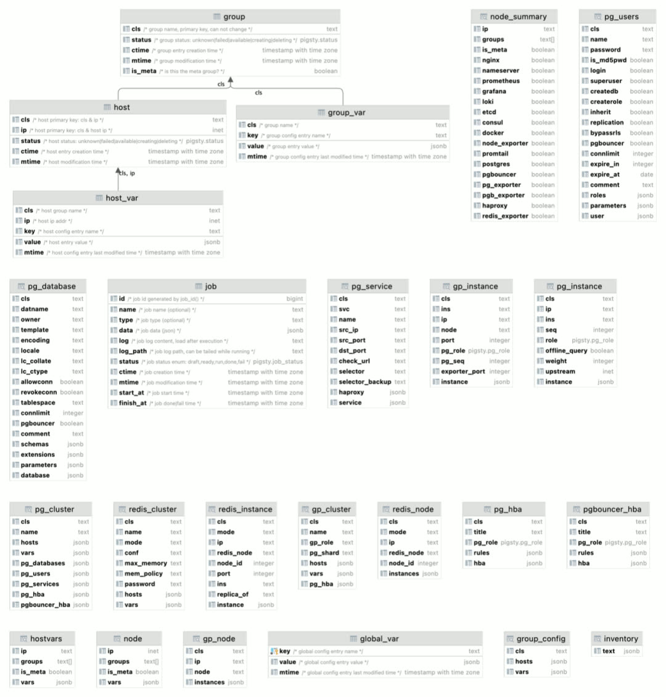

只要使用 `bin/inventory_load` 即可将当前使用的配置文件加载入 CMDB 中，使用 `bin/inventory_cmdb` 切换为 CMDB 模式。使用 CMDB 时，可以直接通过 Grafana 的 CMDB Overview 面板查阅可视化的配置清单：

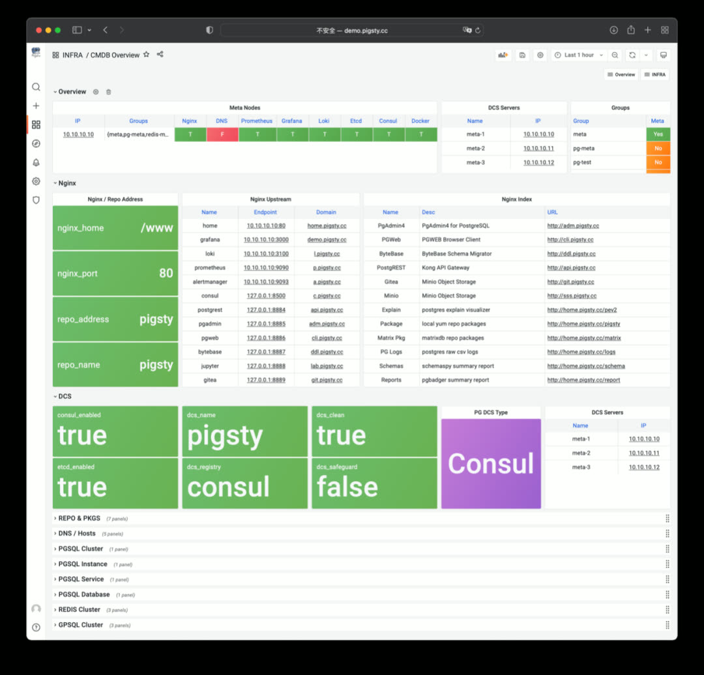

可以从 CMDB Overview 中看到 PostgreSQL、Redis 以及 Greenplum/MatrixDB 集群的成员信息。

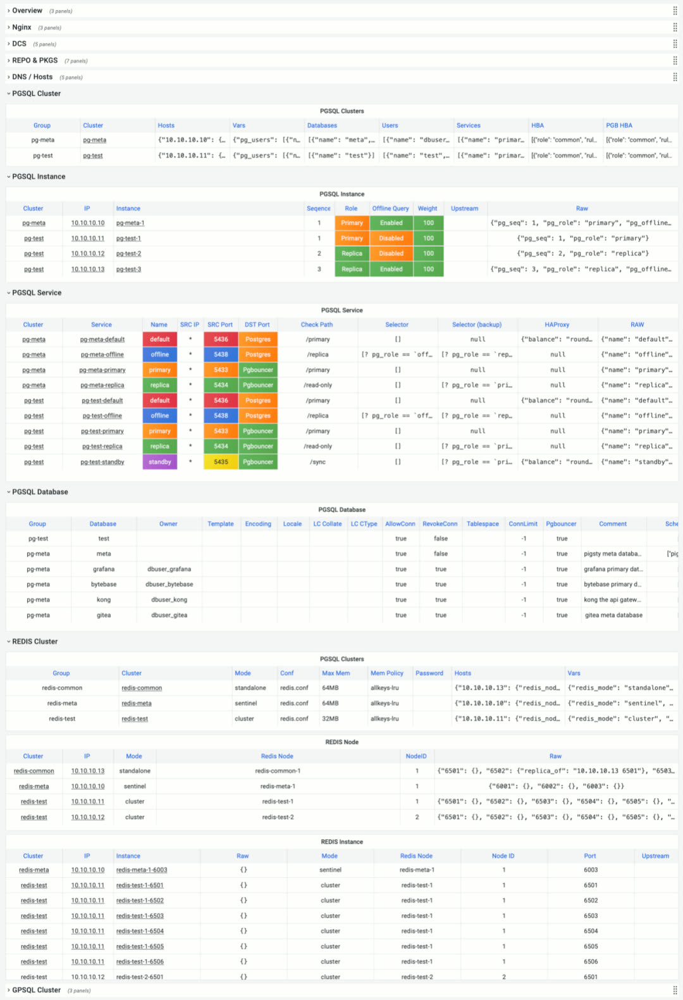

可以直接通过 SQL 来调整配置，也可以通过 PostgREST 暴露的 API 来调整配置，例如创建新的集群、扩容缩容等。

PostgREST 是一个自动根据 PostgreSQL 数据库模式生成 REST API 的二进制组件，打包在 Pigsty v1.5 自带的 Docker 镜像包中。

```bash
cd ~/pigsty/app/postgrest; make up
```

它还可以通过 Swagger OpenAPI Spec 自动生成 API 的定义，并使用 Swagger Editor 暴露 API 文档，生成不同编程语言的客户端存根。

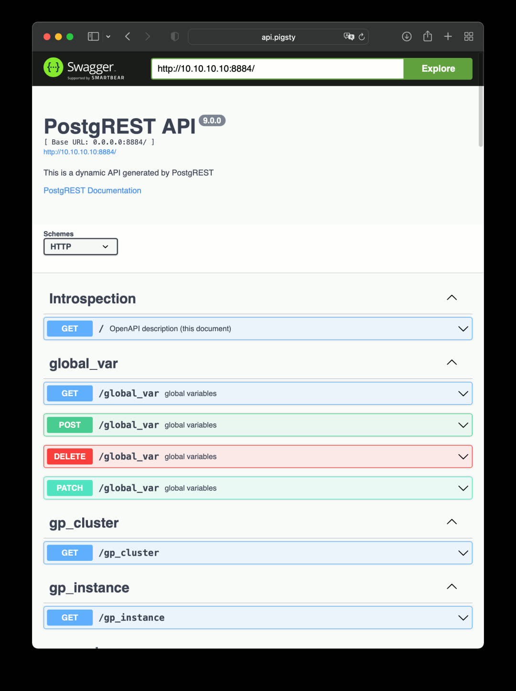

PostgREST 不仅仅可以用来暴露 CMDB 的增删改查接口。如果已经有了一个设计得当的数据库模式，那么使用 PostgREST 可以立即构建出一个后端 REST API 服务，无需手工编写繁琐重复的增删改查逻辑，复杂的逻辑可以通过存储过程对外暴露。

如果需要更强大的 API 支持，可以考虑 API 网关 Kong。它可以让任何已有 API 变成功能完备的接口服务，为 API 启用多种认证签名机制，自动记录日志，设置 Trace，进行限流与容灾。Kong 基于 Nginx + Lua（OpenResty）实现，使用 PostgreSQL 与 Redis 存储元数据：

```bash
cd ~/pigsty/app/kong; make up
```

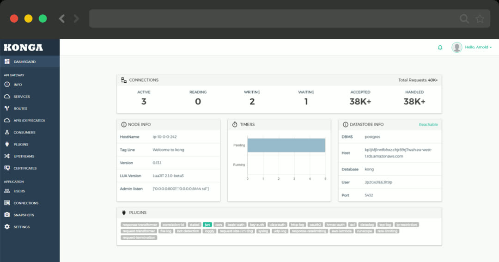


--------

## 基础设施监控

在 Pigsty v1.5 中，基础设施本身的监控进行了重大改进：INFRA 和 NODES、PGSQL、REDIS 现在采用一样的管理模式。基础设施通过 `infra_register` 角色完成自身的服务注册，将自己添加到 Prometheus 的监控对象中。Grafana 中相应添加了监控面板。

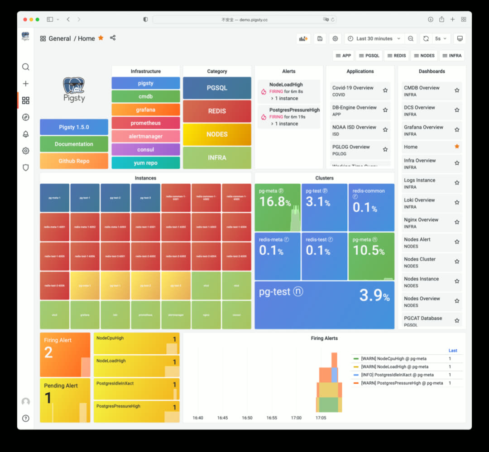

Pigsty v1.5 的 Home 监控中，基础设施作为嫩绿色的组件，与 NODES、REDIS、PGSQL 采用同种方式列入 Instance 中。此外，Infra 服务也会注册至 Service Registry（Consul），并可通过服务发现自动管理。

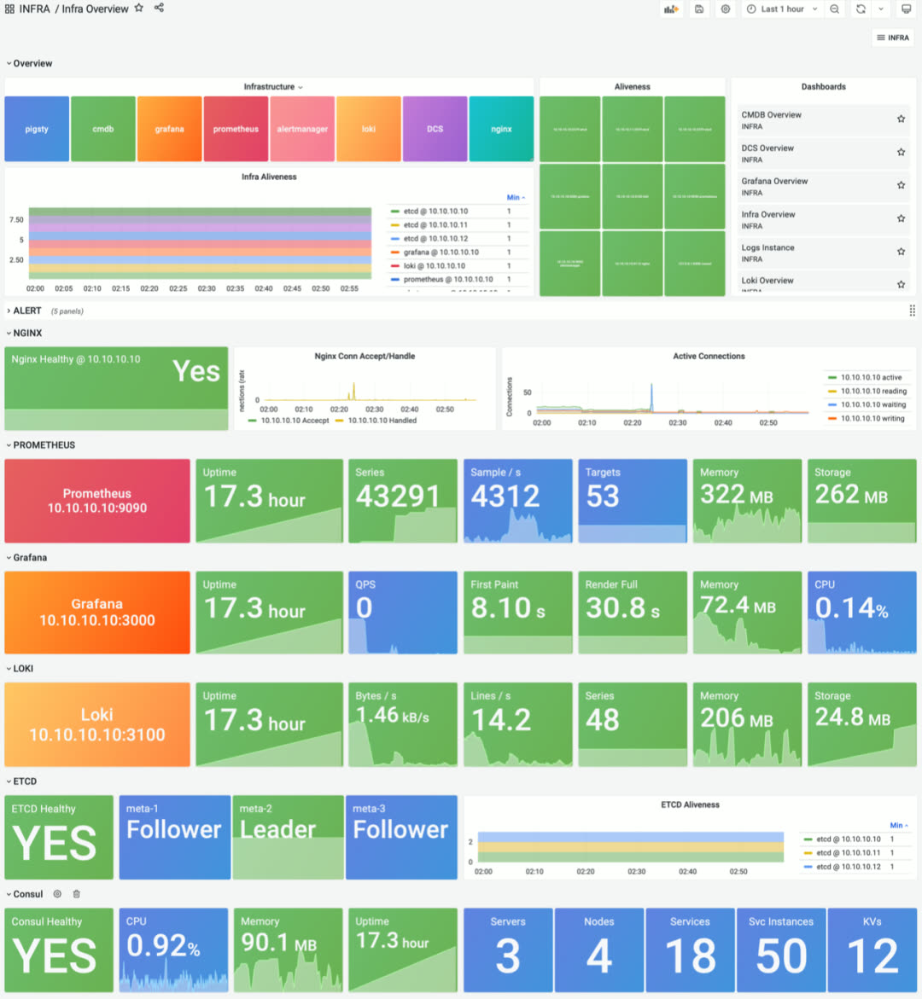

> INFRA Overview 提供了所有基础设施组件基本状态与快速导航

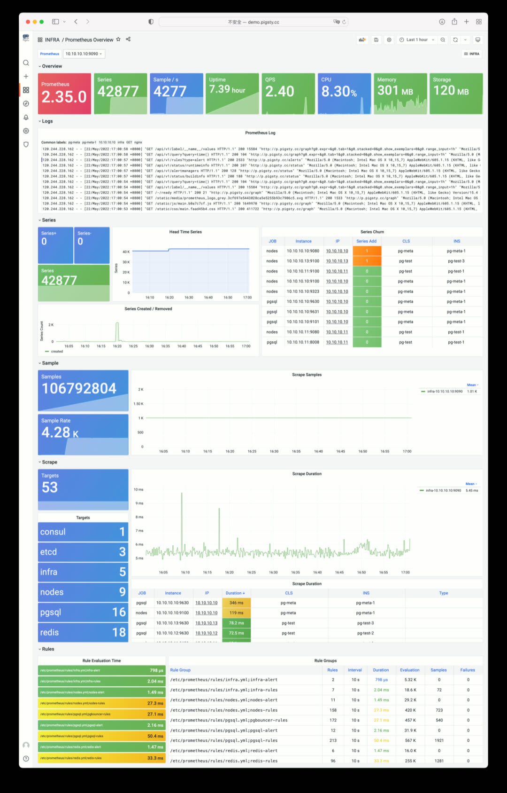

> Prometheus Overview：时序数据库自监控

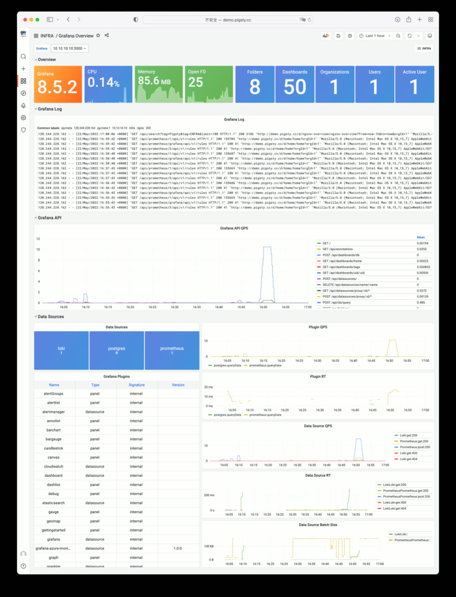

> Grafana Overview：监控面板自监控

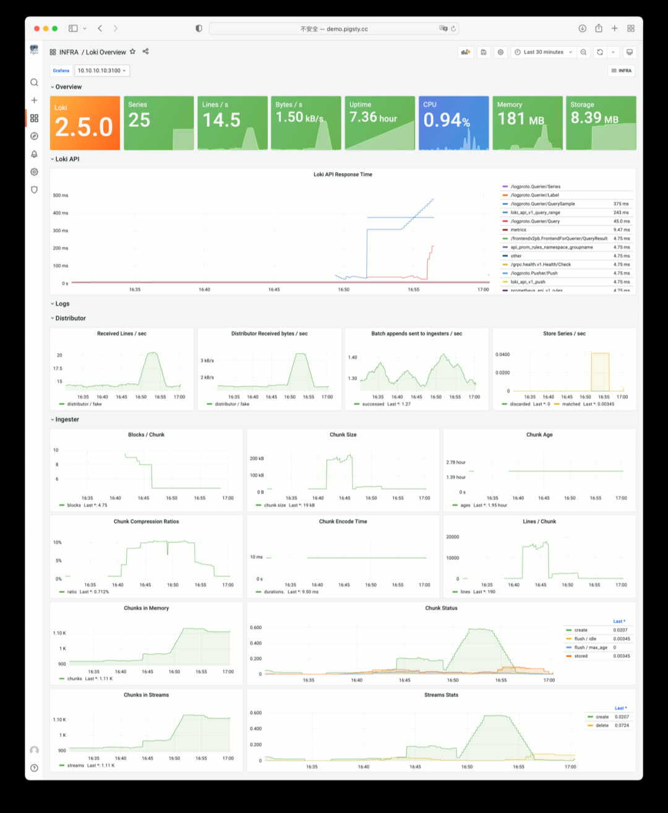

> Loki Overview：日志收集组件自监控


--------

## ETCD 作为 DCS

在 Pigsty v1.5 中，可以使用 ETCD 作为 Consul 的替代，用于 PostgreSQL 数据库高可用所需的 DCS。

与 Consul 相比，ETCD 少了服务发现、内建 DNS、健康检查以及开箱即用的 UI，但是 ETCD 无需 Agent 部署简单，依托 Kubernetes 生态的流行度更高，比 Consul 少一个失效点，更好的指标可观测性。

只需指定 `pg_dcs_type: etcd`，即可使用 ETCD 作为 DCS。此外，可以同时使用 Consul 与 ETCD，两者并行不悖：例如使用 ETCD 作为 DCS，而使用 Consul 进行服务发现。

Pigsty v1.5 针对 ETCD 与 Consul 进行了开箱即用的监控面板：DCS Overview

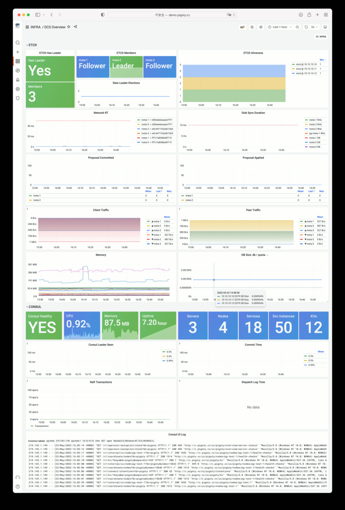

目前 ETCD 作为 DCS 属于最小可用功能实现，并没有添加 CA 证书与 TLS 支持，将在后续版本安全性加固专项中补充。


--------

## 更好的日志收集与呈现

在 Pigsty v1.5 中，默认为每一个上游服务启用单独的访问日志，所有字段均由 Loki 解析，可以直接进行分析。如果有网站挂在 Pigsty 上，可以立刻进行交互式日志流量分析与统计。

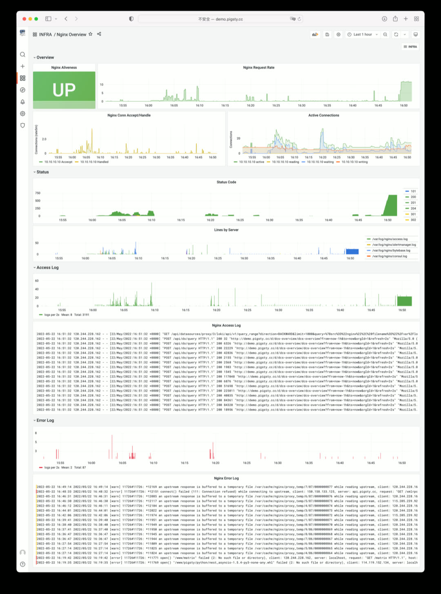

> NGINX Overview：展示 Nginx 指标与日志


--------
--------

## v1.5.0 发行注记

### 亮点概述

* 完善的 Docker 支持：在管理节点上默认启用并提供诸多开箱即用的软件模板：bytebase, pgadmin, pgweb, postgrest, minio 等。
* 基础设施自我监控：Nginx，ETCD，Consul，Prometheus，Grafana，Loki 自我监控
* CMDB 升级：兼容性改善，支持 Redis 集群/Greenplum 集群元数据，配置文件可视化。
* 服务发现改进：可以使用 Consul 自动发现所有待监控对象，并纳入 Prometheus 中。
* 更好的冷备份支持：默认定时备份任务，添加 `pg_probackup` 备份工具，一键创建延时从库。
* ETCD 现在可以用作 PostgreSQL/Patroni 的 DCS 服务，作为 Consul 的备选项。
* Redis 剧本/角色改善：现在允许对单个 Redis 实例，而非整个 Redis 节点进行初始化与移除。


### 监控系统

**监控面板**

* CMDB Overview：可视化 Pigsty CMDB Inventory。
* DCS Overview：查阅 Consul 与 ETCD 集群的监控指标。
* Nginx Overview：查阅 Pigsty Web 访问指标与访问日志。
* Grafana Overview：Grafana 自我监控
* Prometheus Overview：Prometheus 自我监控
* INFRA Dashboard 进行重制，反映基础设施整体状态

**监控架构**

* 现在允许使用 Consul 进行服务发现（当所有服务注册至 Consul 时）
* 现在所有的 Infra 组件会启用自我监控，并通过 `infra_register` 角色注册至 Prometheus 与 Consul 中。
* 指标收集器 pg_exporter 更新至 v0.5.0，添加新功能，`scale` 与 `default`，允许为指标指定一个倍乘因子，以及指定默认值。
* `pg_bgwriter`, `pg_wal`, `pg_query`, `pg_db`, `pgbouncer_stat` 关于时间的指标，单位由默认的毫秒或微秒统一缩放至秒。
* `pg_table` 中的相关计数器指标，现在配置有默认值 `0`，替代原有的 `NaN`。
* `pg_class` 指标收集器默认移除，相关指标添加至 `pg_table` 与 `pg_index` 收集器中。
* `pg_table_size` 指标收集器现在默认启用，默认设置有 300 秒的缓存时间。


### 部署方案

* 新增可选软件包 `docker.tgz`，带有常用应用镜像：Pgadmin, Pgweb, Postgrest, ByteBase, Kong, Minio 等。
* 新增角色 ETCD，可以在 DCS Servers 指定的节点上自动部署 ETCD 服务，并自动纳入监控。
* 允许通过 `pg_dcs_type` 指定 PG 高可用使用的 DCS 服务，Consul（默认），ETCD（备选）
* 允许通过 `node_crontab` 参数，为节点配置定时任务，例如数据库备份、VACUUM，统计收集等。
* 新增了 `pg_checksum` 选项，启用时，数据库集群将启用数据校验和（此前只有 `crit` 模板默认启用）
* 新增了 `pg_delay` 选项，当实例为 Standby Cluster Leader 时，此参数可以用于配置一个**延迟从库**
* 新增了软件包 `pg_probackup`，默认角色 `replicator` 现在默认赋予了备份相关函数所需的权限。
* Redis 部署现在拆分为两个部分：Redis 节点与 Redis 实例，通过 `redis_port` 参数可以精确控制一个具体实例。
* Loki 与 Promtail 现在使用 `frpm` 制作的 RPM 软件包进行安装。
* DCS3 配置模板现在使用一个 3 节点的 `pg-meta` 集群，与一个单节点的延迟从库。


### 软件升级

* 升级 PostgreSQL 至 14.3
* 升级 Redis 至 6.2.7
* 升级 PG Exporter 至 0.5.0
* 升级 Consul 至 1.12.0
* 升级 vip-manager 至 v1.0.2
* 升级 Grafana 至 v8.5.2
* 升级 Loki & Promtail 至 v2.5.0，使用 frpm 打包。


### 问题修复

* 修复了 Loki 与 Promtail 默认配置文件名的问题
* 修复了 Loki 与 Promtail 环境变量无法正确展开的问题
* 对英文文档进行了一次完整的翻译与修缮，文档依赖的 JS 资源现在直接从本地获取，无需互联网访问。


### API 变化

**新参数**

- `node_data_dir` : 主要的数据挂载路径，如果不存在会被创建。
- `node_crontab_overwrite` : 覆盖 `/etc/crontab` 而非追加内容。
- `node_crontab`: 要被追加或覆盖的 node crontab 内容。
- `nameserver_enabled`: 在这个基础设施节点上启用 nameserver 吗？
- `prometheus_enabled`: 在这个基础设施节点上启用 prometheus 吗？
- `grafana_enabled`: 在这个基础设施节点上启用 grafana 吗？
- `loki_enabled`: 在这个基础设施节点上启用 loki 吗？
- `docker_enable`: 在这个基础设施节点上启用 docker 吗？
- `consul_enable`: 启用 consul 服务器/代理吗？
- `etcd_enable`: 启用 etcd 服务器/客户端吗？
- `pg_checksum`: 启用 pg 集群数据校验和吗？
- `pg_delay`: 备份集群主库复制重放时的应用延迟。

**参数重制**

现在 `*_clean` 是布尔类型的参数，用于在初始化期间清除现有实例。

`*_safeguard` 也是布尔类型的参数，用于在执行任何剧本时，避免清除正在运行的实例。

- `pg_exists_action` -> `pg_clean`
- `pg_disable_purge` -> `pg_safeguard`
- `dcs_exists_action` -> `dcs_clean`
- `dcs_disable_purge` -> `dcs_safeguard`

**参数重命名**

- `node_ntp_config` -> `node_ntp_enabled`
- `node_admin_setup` -> `node_admin_enabled`
- `node_admin_pks` -> `node_admin_pk_list`
- `node_dns_hosts` -> `node_etc_hosts_default`
- `node_dns_hosts_extra` -> `node_etc_hosts`
- `node_dns_server` -> `node_dns_method`
- `node_local_repo_url` -> `node_repo_local_urls`
- `node_packages` -> `node_packages_default`
- `node_extra_packages` -> `node_packages`
- `node_packages_meta` -> `node_packages_meta`
- `node_meta_pip_install` -> `node_packages_meta_pip`
- `node_sysctl_params` -> `node_tune_params`
- `app_list` -> `nginx_indexes`
- `grafana_plugin` -> `grafana_plugin_method`
- `grafana_cache` -> `grafana_plugin_cache`
- `grafana_plugins` -> `grafana_plugin_list`
- `grafana_git_plugin_git` -> `grafana_plugin_git`
- `haproxy_admin_auth_enabled` -> `haproxy_auth_enabled`
- `pg_shared_libraries` -> `pg_libs`
- `dcs_type` -> `pg_dcs_type`


--------

## v1.5.1 发行注记

### 亮点

**重要**：修复了 PG14.0-14.3 中 `CREATE INDEX|REINDEX CONCURRENTLY` 可能导致索引数据损坏的问题。

Pigsty v1.5.1 升级默认 PostgreSQL 版本至 14.4，强烈建议尽快更新。

### 软件升级

* postgres 升级至 14.4
* haproxy 升级至 2.6.0
* grafana 升级至 9.0.0
* prometheus 升级至 2.36.0
* patroni 升级至 2.1.4

### 问题修复

* 修复了 `pgsql-migration.yml` 中的 TYPO
* 移除了 HAProxy 配置文件中的 PID 配置项
* 移除了默认软件包中的 i686 软件包
* 默认启用所有 Systemd Redis Service
* 默认启用所有 Systemd Patroni Service

### API 变更

* `grafana_database` 与 `grafana_pgurl` 被标记为过时 API，将从后续版本移除

### 新增应用

* wiki.js：使用 Postgres 搭建本地维基百科
* FerretDB：使用 Postgres 提供 MongoDB API
