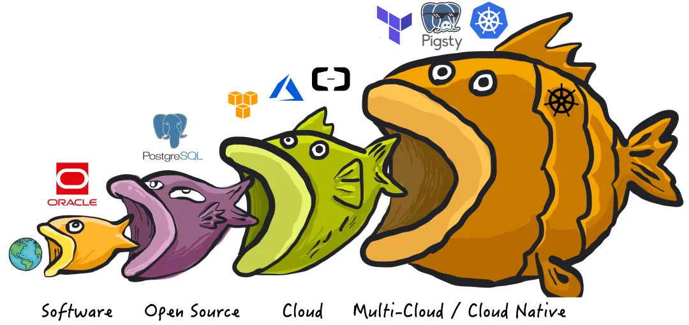
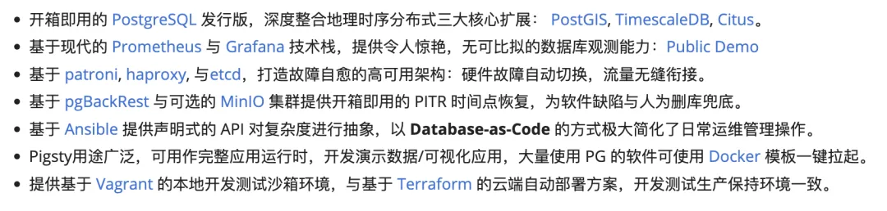
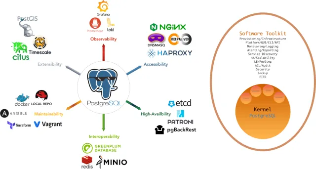
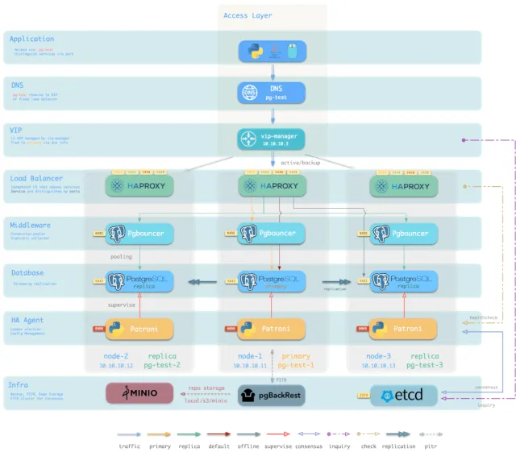
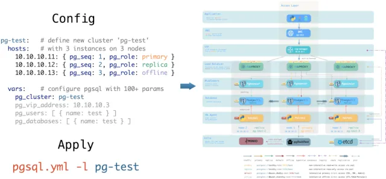
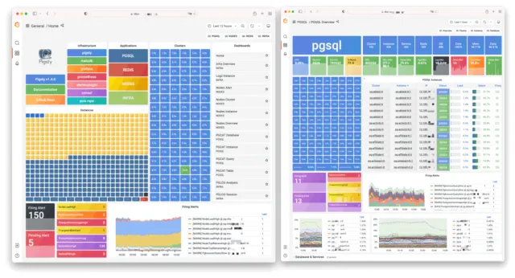
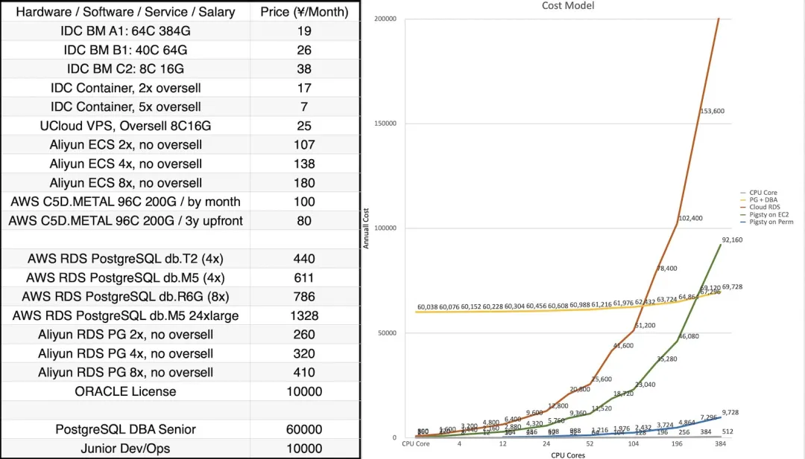
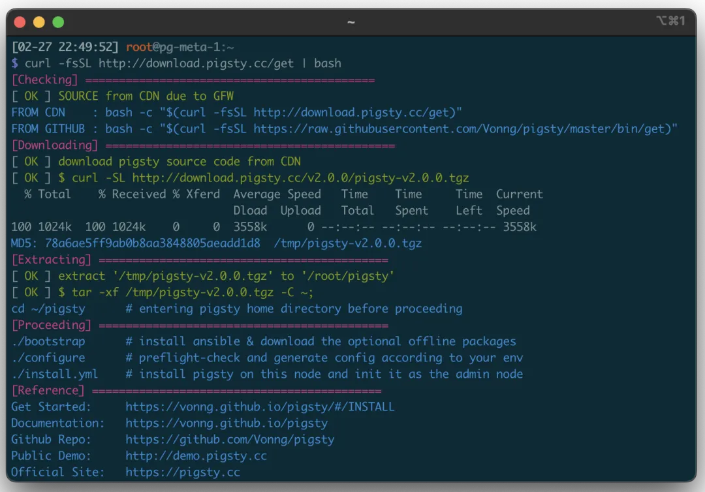
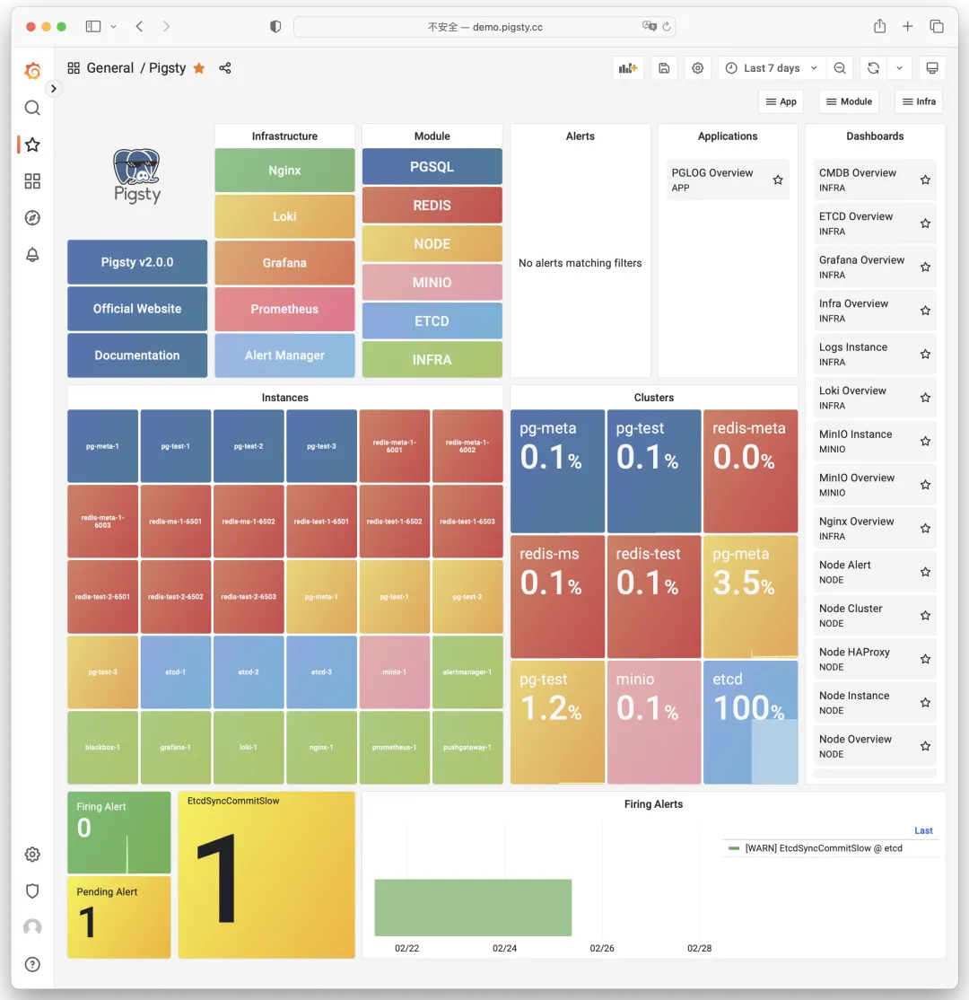

**2023/02/28**，**Pigsty  v2.0.0 正式发布**，带来了一系列重大的功能更新。

现在 **PIGSTY** 是 "**P**ostgreSQL **I**n **G**reat **STY**le"的首字母缩写，即"**全盛状态的 PostgreSQL**"。而 Pigsty 的定位也不再是 “**开箱即用的PostgreSQL数据库发行版**”，变成了 “**Me Better** **开源 RDS PG 替代**”。

明人不说暗话，这是一个很有野心的目标：**推翻云数据库垄断，砸烂****RDS的饭碗！****详见：《****[云数据库是不是智商税？](http://mp.weixin.qq.com/s?__biz=MzU5ODAyNTM5Ng==&mid=2247485269&idx=1&sn=a46b8b218331ece956c336b5c2a8df79&chksm=fe4b328ec93cbb98434b258ed1bfa6c63aecd0f3675002db75520edd21456eb39e97455fe995&scene=21#wechat_redirect)》**





# 2.0 新特性

Pigsty 是一个**更好的、****本地优先**的，**开源** **RDS for PostgreSQL** **替代。**



## 强力的发行版 

**彻底释放世界上最先进的关系型数据库的力量!**

PostgreSQL 是一个足够完美的数据库内核，但它需要更多工具与系统的配合，才能成为一个足够好的数据库服务（RDS），而 Pigsty 帮助 PostgreSQL 完成这一步飞跃。

Pigsty 深度整合了 PostgreSQL 生态的三大核心扩展插件 **PostGIS**，**TimescaleDB**，**Citus**，并确保它们可以协同工作，提供分布式的时序地理空间数据库能力。Pigsty 还提供了运行企业级 RDS 服务的所需软件，打包所有依赖为离线软件包，所有组件均可在无需互联网访问的情况下一键完成安装部署，进入生产可用状态。

在 Pigsty 中功能组件被抽象 **模块**，可以自由组合以应对多变的需求场景。**`INFRA`** 模块带有完整的现代监控技术栈，而 `NODE` 模块则将节点调谐至指定状态并纳入监控。在多个节点上安装 **`PGSQL`** 模块会自动组建出一个基于主从复制的高可用数据库集群，而同样的 **`ETCD`** 模块则为数据库高可用提供共识与元数据存储。可选的 **`MINIO`**模块可以用作图像视频等大文件存储并可选用为数据库备份仓库。与 PG 有着极佳相性的 **`REDIS`** 亦为 Pigsty 所支持，更多的模块（如**`GPSQL`**, **`MYSQL`**, **`KAFKA`**）将会在后续加入，你也可以开发自己的模块并自行扩展 Pigsty 的能力。




## 惊艳的观测能力

**使用现代开源可观测性技术栈，提供无与伦比的监控最佳实践！**

Pigsty 提供了基于开源的 Grafana / Prometheus 可观测性技术栈做监控的最佳实践：Prometheus 用于收集监控指标，Grafana 负责可视化呈现，Loki 用于日志收集与查询，Alertmanager 用于告警通知。PushGateway 用于批处理任务监控，Blackbox Exporter 负责检查服务可用性。整套系统同样被设计为一键拉起，开箱即用的 INFRA 模块。

Pigsty 所管理的任何组件都会被自动纳入监控之中，包括主机节点，负载均衡 HAProxy，数据库 Postgres，连接池 Pgbouncer，元数据库 ETCD，KV缓存 Redis，对象存储 MinIO，……，以及整套监控基础设施本身。大量的 Grafana 监控面板与预置告警规则会让你的系统观测能力有质的提升，当然，这套系统也可以被复用于您的应用监控基础设施，或者监控已有的数据库实例或 RDS。

无论是故障分析还是慢查询优化、无论是水位评估还是资源规划，Pigsty 为您提供全面的数据支撑，真正做到数据驱动。在 Pigsty 中，超过三千类监控指标被用于描述整个系统的方方面面，并被进一步加工、聚合、处理、分析、提炼并以符合直觉的可视化模式呈现在您的面前。从全局大盘总揽，到某个数据库实例中单个对象（表，索引，函数）的增删改查详情都能一览无余。您可以随意上卷下钻横向跳转，浏览系统现状与历史趋势，并预测未来的演变。详见公开演示：**http://demo.pigsty.cc**。


## 久经考验的可靠性

**开箱即用的高可用与时间点恢复能力，确保你的数据库坚如磐石！**

对于软件缺陷或人为误操作造成的删表删库，Pigsty 提供了开箱即用的 PITR 时间点恢复能力，无需额外配置即默认启用。只要存储空间管够，基于 `pgBackRest` 的基础备份与 WAL 归档让您拥有快速回到过去任意时间点的能力。您可以使用本地目录/磁盘，亦或专用的 **MinIO** 集群或 **S3** 对象存储服务保留更长的回溯期限，丰俭由人。

更重要的是，Pigsty 让高可用与故障自愈成为 PostgreSQL 集群的标配，基于 `patroni`, `etcd`, 与 `haproxy` 打造的故障自愈架构，让您在面对硬件故障时游刃有余：主库故障自动切换的 **RTO < 30s**，一致性优先模式下确保数据零损失 **RPO = 0**。只要集群中有任意实例存活，集群就可以对外提供完整的服务，而客户端只要连接至集群中的任意节点，即可获得完整的服务。

Pigsty 内置了 HAProxy 负载均衡器用于自动流量切换，提供 DNS/VIP/LVS 等多种接入方式供客户端选用。故障切换与主动切换对业务侧除零星闪断外几乎无感知，应用不需要修改连接串重启。极小的维护窗口需求带来了极大的灵活便利：您完全可以在无需应用配合的情况下滚动维护升级整个集群。硬件故障可以等到第二天再抽空善后处置的特性，让研发，运维与 DBA 都能安心睡个好觉。许多大型组织与核心机构已经在生产环境中长时间使用 Pigsty ，最大的部署有 **25K CPU** 核心与 200+ PostgreSQL 实例，在这一部署案例中， Pigsty 在三年内经历了数十次硬件故障与各类事故，但依然可以保持 **99.999%** 以上的整体可用性。



## 简单易用可维护

**Infra as Code, 数据库即代码，声明式的API将数据库管理的复杂度来封装。**

Pigsty 使用声明式的接口对外提供服务，将系统的可控制性拔高到一个全新水平：用户通过配置清单告诉 Pigsty “我想要什么样的数据库集群”，而不用去操心到底需要怎样去做。从效果上讲，这类似于 K8S 中的 CRD 与 Operator，但 Pigsty 可用于任何节点上的数据库与基础设施：不论是容器，虚拟机，还是物理机。

无论是创建/销毁集群，添加/移除从库，还是新增数据库/用户/服务/扩展/黑白名单规则，您只需要修改配置清单并运行 Pigsty 提供的幂等剧本，而 Pigsty 负责将系统调整到您期望的状态。用户无需操心配置的细节，Pigsty将自动根据机器的硬件配置进行调优，您只需要关心诸如集群叫什么名字，有几个实例放在哪几台机器上，使用什么配置模版：事务/分析/核心/微型，这些基础信息，研发也可以自助服务。但如果您愿意跳入兔子洞中，Pigsty 也提供了丰富且精细的控制参数，满足最龟毛 DBA 的苛刻定制需求。

除此之外，Pigsty 本身的安装部署也是一键傻瓜式的，所有依赖被预先打包，在安装时可以无需互联网访问。而安装所需的机器资源，也可以通过 Vagrant 或 Terraform 模板自动获取，让您在十几分钟内就可以从零在本地笔记本或云端虚拟机上拉起一套完整的 Pigsty 部署。本地沙箱环境可以跑在1核2G的微型虚拟机中，提供与生产环境完全一致的功能模拟，可以用于开发、测试、演示与学习。



## 扎实的安全性

**加密备份一应俱全，只要硬件与密钥安全，您无需操心数据库的安全性。**

每套 Pigsty 部署都会创建一套自签名的 CA 用于证书签发，所有的网络通信都可以使用 SSL 加密。数据库密码使用合规的 `scram-sha-256` 算法加密存储，远端备份会使用 `AES-256` 算法加密。此外还针对 PGSQL 提供了一套开箱即用的的访问控制体系，足以应对绝大多数应用场景下的安全需求。

Pigsty 针对 PostgreSQL 提供了一套开箱即用，简单易用，精炼灵活的，便于扩展的访问控制体系，包括职能分离的四类默认角色：读(DQL) / 写(DML) / 管理(DDL) / 离线(ETL) ，与四个默认用户：dbsu / replicator / monitor / admin。所有数据库模板都针对这些角色与用户配置有合理的默认权限，而任何新建的数据库对象也会自动遵循这套权限体系，而客户端的访问则受到一套基于最小权限原则的设计的 HBA 规则组限制，任何敏感操作都会记入日志审计。

任何网络通信都可以使用 SSL 加密，需要保护的敏感管理页面与API端点都受到多重保护：使用用户名与密码进行认证，限制从管理节点/基础设施节点IP地址/网段访问，要求使用 HTTPS 加密网络流量。Patroni API 与 Pgbouncer 因为性能因素默认不启用 SSL ，但亦提供安全开关便于您在需要时开启。合理配置的系统通过等保三级毫无问题，只要您遵循安全性最佳实践，内网部署并合理配置安全组与防火墙，数据库安全性将不再是您的痛点。



## 广泛的应用场景

**使用预置的Docker模板，一键拉起使用PostgreSQL的海量软件！**

在各类数据密集型应用中，数据库往往是最为棘手的部分。例如 Gitlab 企业版与社区版的核心区别就是底层 PostgreSQL 数据库的监控与高可用，如果您已经有了足够好的本地 **PG RDS**，又为什么要为软件自带的土法手造数据库掏钱？

Pigsty 提供了 Docker 模块与大量开箱即用的 Compose 模板。您可以使用 Pigsty 管理的高可用 PostgreSQL （以及 Redis 与 MinIO ）作为后端存储，以无状态的模式一键拉起这些软件：Gitlab、Gitea、Wiki.js、Odoo、Jira、Confluence、Habour、Mastodon、Discourse、KeyCloak 等等。如果您的应用需要一个靠谱的 PostgreSQL 数据库， Pigsty 也许是最简单的获取方案。

Pigsty 也提供了与 PostgreSQL 紧密联系的应用开发工具集：PGAdmin4、PGWeb、ByteBase、PostgREST、Kong、以及 EdgeDB、FerretDB、Supabase 这些使用 PostgreSQL 作为存储的"上层数据库"。更奇妙的是，您完全可以基于 Pigsty 内置了的 Grafana 与 Postgres ，以低代码的方式快速搭建起一个交互式的数据应用来，甚至还可以使用 Pigsty 内置的 ECharts 面板创造更有表现力的交互可视化作品。


## 开源免费的自由软件

**Pigsty是基于 AGPLv3 开源的自由软件，由热爱 PostgreSQL 的社区成员用热情浇灌**

Pigsty 是完全开源免费的自由软件，它允许您在缺乏数据库专家的情况下，用几乎接近纯硬件的成本来运行企业级的 PostgreSQL 数据库服务。作为对比，公有云厂商提供的 RDS 会收取底层硬件资源几倍到十几倍不等的溢价作为 “服务费”。

（ 参考阅读：[为什么说云数据库是杀猪盘](http://mp.weixin.qq.com/s?__biz=MzU5ODAyNTM5Ng==&mid=2247485292&idx=1&sn=4f650c3f5c3fb5207c55ff67e44d7d8a&chksm=fe4b32b7c93cbba190e60d477061d19a165e1f9b074beb00b132ae1369a9fd2c7d10ed77a013&scene=21#wechat_redirect) ）

很多用户选择上云，正是因为自己搞不定数据库；很多用户使用 RDS，是因为别无他选。我们将打破云厂商的垄断，为用户提供一个云中立的，更好的 RDS 开源替代：Pigsty 紧跟 PostgreSQL 上游主干，不会有供应商锁定，不会有恼人的 “授权费”，不会有节点数量限制，不会收集您的任何数据。您的所有的核心资产 —— 数据，都能"自主可控"，掌握在自己手中。

Pigsty 本身旨在用数据库自动驾驶软件，替代大量无趣的人肉数据库运维工作，但再好的软件也没法解决所有的问题。总会有一些的冷门低频疑难杂症需要专家介入处理。这也是为什么我们也提供专业的订阅服务，来为有需要的企业级用户使用 PostgreSQL 提供兜底。几万块的订阅咨询费不到顶尖 DBA 每年工资的几十分之一，让您彻底免除后顾之忧，把成本真正花在刀刃上。当然对于社区用户，我们亦用爱发电，提供免费的支持与日常答疑。




##  


# 2.0 快速上手

Pigsty 2.0 的安装依然是一条命令搞定所有：

curl -fsSL http://download.pigsty.cc/get) | bash



如果互联网访问受限，您可以提前从 Github 或 CDN 下载对应操作系统的离线软件包进行离线安装。监控系统部分提供公开的 Demo：**http://demo.pigsty.cc 。**




----------------

## v2.0.0

相关文章：

- [更好的开源RDS替代：Pigsty](https://mp.weixin.qq.com/s/-E_-HZ7LvOze5lmzy3QbQA)
- [炮打 RDS，Pigsty v2.0 发布](https://mp.weixin.qq.com/s/WsR-c64OJfkMql7zX7XmDA)
- [Pigsty v2 正式发布：更好的RDS PG开源替代](https://mp.weixin.qq.com/s/9lceZdyUZU9AzsqlAcpjTA)
- [Pigsty 2.0 展望](https://mp.weixin.qq.com/s/g-ZPWqBwjzaxZKxyjVmFig)

Pigsty [v2.0.0](https://github.com/Vonng/pigsty/releases/tag/v2.0.0) 正式发布！

从v2.0.0开始，PIGSTY 现在是 "PostgreSQL In Great STYle"的首字母缩写，即"全盛状态的PostgreSQL"。

```bash
curl -fsSL http://download.pigsty.cc/get | bash
```

<details><summary>Download directly from GitHub Release</summary>

```bash
bash -c "$(curl -fsSL https://raw.githubusercontent.com/Vonng/pigsty/master/bin/get)"

# or download tarball directly with curl (EL9)
curl -L https://github.com/Vonng/pigsty/releases/download/v2.0.0/pigsty-v2.0.0.tgz -o ~/pigsty.tgz
curl -L https://github.com/Vonng/pigsty/releases/download/v2.0.0/pigsty-pkg-v2.0.0.el9.x86_64.tgz  -o /tmp/pkg.tgz
# EL7: https://github.com/Vonng/pigsty/releases/download/v2.0.0/pigsty-pkg-v2.0.0.el7.x86_64.tgz
# EL8: https://github.com/Vonng/pigsty/releases/download/v2.0.0/pigsty-pkg-v2.0.0.el8.x86_64.tgz
```

</details>


## 亮点

* 完美整合 PostgreSQL 15, PostGIS 3.3, Citus 11.2, TimescaleDB 2.10，分布式地理时序超融合数据库。
* OS兼容性大幅增强：支持 EL7，8，9，以及 RHEL, CentOS, Rocky, OracleLinux, AlmaLinux等兼容发行版。
* 安全性改进：自签名CA，全局网络流量SSL加密，密码scram-sha-256认证，备份采用AES加密，重制的HBA规则系统。
* Patroni升级至3.0，提供原生的高可用 Citus 分布式集群支持，默认启用FailSafe模式，无惧DCS故障致全局主库瘫痪。
* 提供基于 pgBackRest 的开箱即用的时间点恢复 PITR 支持，默认支持本地文件系统与专用MinIO/S3集群备份。 
* 新模块 `ETCD`，可独立部署，简易扩缩容，自带监控高可用，彻底取代 Consul 作为高可用 PG 的 DCS。
* 新模块 `MINIO`，可独立部署，支持多盘多节点部署，用作S3本地替代，亦用于集中式 PostgreSQL 备份仓库。
* 大幅精简配置文件参数，无需默认值即可使用；模板自动根据机器规格调整主机与PG参数，HBA/服务的定义更简洁泛用。
* 受 Grafana 与 MinIO 影响，软件协议由 Apache License 2.0 变更为 AGPL 3.0


## 兼容性

* 支持 EL7, EL8, EL9 三个大版本，并提供三个版本对应的离线软件包，默认开发测试环境由EL7升级至EL9。
* 支持更多EL兼容Linux发行版：RHEL, CentOS, RockyLinux, AlmaLinux, OracleLinux等…
* 源码包与离线软件包的命名规则发生改变，现在版本号，操作系统版本号，架构都会体现在包名中。
* `PGSQL`: PostgreSQL 15.2, PostGIS 3.3, Citus 11.2, TimescaleDB 2.10 现可同时使用，协同工作。
* `PGSQL`: Patroni 升级至 3.0 版本，作为 PGSQL 的高可用组件。
  * 默认使用 ETCD 作为 DCS，取代 Consul，减少一个 Consul Agent 失效点。
  * 因为 vip-manager 升级至 2.1 并使用 ETCDv3 API，彻底弃用 ETCDv2 API，Patroni同理
  * 提供原生的高可用 Citus 分布式集群支持。使用完全开源所有功能的 Citus 11.2。
  * 默认启用FailSafe模式，无惧DCS故障致全局主库瘫痪。
* `PGSQL`: 引入 pgBackrest v2.44 提供开箱即用的 PostgreSQL 时间点恢复 PITR 功能
  * 默认使用主库上的备份目录创建备份仓库，滚动保留两天的恢复窗口。 
  * 默认备选备份仓库为专用 MinIO/S3 集群，滚动保留两周的恢复窗口，本地使用需要启用 MinIO 模块。
* `ETCD` 现在作为一个独立部署的模块，带有完整的扩容/缩容方案与监控。
* `MINIO` 现在成为一个独立部署的模块，支持多盘多节点部署，用作S3本地替代，亦可用作集中式备份仓库。
* `NODE` 模块现在包含 `haproxy`, `docker`, `node_exporter`, `promtail` 功能组件
  * `chronyd` 现在取代 `ntpd` 成为所有节点默认的 NTP 服务。
  * HAPROXY 现从属于 `NODE` 的一部分，而不再是 `PGSQL` 专属，可以 NodePort 的方式对外暴露服务。
  * 现在 `PGSQL` 模块可以使用专用的集中式 HAPROXY 集群统一对外提供服务。
* `INFRA` 模块现在包含 `dnsmasq`, `nginx`, `prometheus`, `grafana`, `loki` 等组件
  * Infra 模块中的 DNSMASQ 服务器默认启用，并添加为所有节点的默认 DNS 服务器之一。
  * 添加了 `blackbox_exporter` 用于主机 PING 探测，`pushgateway` 用于批处理任务指标。
  * `loki` 与 `promtail` 现在使用 Grafana 默认的软件包，使用官方的 Grafana Echarts 面板插件
  * 提供针对 PostgreSQL 15 的新增可观测性位点的监控支持，添加 Patroni 监控
* 软件版本升级
  * PostgreSQL 15.2 / PostGIS 3.3 / TimescaleDB 2.10 / Citus 11.2
  * Patroni 3.0 / Pgbouncer 1.18 / pgBackRest 2.44 / vip-manager 2.1
  * HAProxy 2.7 / Etcd 3.5 / MinIO 20230131022419 / mcli 20230128202938
  * Prometheus 2.42 / Grafana 9.3 / Loki & Promtail 2.7 / Node Exporter 1.5


## 安全性

* 启用了一个完整的本地自签名CA：`pigsty-ca`，用于签发内网组件所使用的证书。
* 创建用户/修改密码的操作将不再会在日志文件中留下痕迹。
* Nginx 默认启用 SSL 支持（如需HTTPS，您需要在系统中信任`pigsty-ca`，或使用Chrome `thisisunsafe`）
* ETCD 全面启用 SSL 加密客户端与服务端对等通信
* PostgreSQL 添加并默认启用了 SSL 支持，管理链接默认都使用SSL访问。
* Pgbouncer 添加了 SSL 支持，出于性能考虑默认不启用。 
* Patroni 添加了 SSL 支持，并默认限制了管理 API 只能从本机与管理节点使用密码认证方可访问。
* PostgreSQL 的默认密码认证方式由 `md5` 改为 `scram-sha-256`。
* Pgbouncer添加了认证查询支持，可以动态管理连接池用户。
* pgBackRest 使用远端集中备份存储仓库时，默认使用 `AES-256-CBC` 加密备份数据。
* 提供高安全等级配置模板：强制使用全局 SSL，并要求使用管理员证书登陆。
* 所有默认HBA规则现在全部在配置文件中显式定义。


## 可维护性

* 现有的配置模板可根据机器规格（CPU/内存/存储）自动调整优化。
* 现在可以动态配置 Postgres/Pgbouncer/Patroni/pgBackRest 的日志目录：默认为：`/pg/log/<type>/` 
* 原有的 IP 地址占位符 `10.10.10.10` 被替换为一个专用变量：`${admin_ip}`，可在多处引用，便于切换备用管理节点。
* 您可以指定 `region` 来使用不同地区的上游镜像源，以加快软件包的下载速度。
* 现在允许用户定义更细粒度的上游源地址，您可以根据不同的EL版本、架构，以及地区，使用不同的上游源。
* 提供了阿里云与AWS中国地区的 Terraform 模板，可用于一键拉起所需的 EC2 虚拟机。
* 提供了多种不同规格的 Vagrant 沙箱模板：`meta`, `full`, `el7/8/9`, `minio`, `build`, `citus`
* 添加了新的专用剧本：`pgsql-monitor.yml` 用于监控现有的 Postgres 实例或 RDS。
* 添加了新的专用剧本：`pgsql-migration.yml` ，使用逻辑复制无缝迁移现有实例至 Pigsty管理的集群。
* 添加了一系列专用 Shell 实用命令，封装常见运维操作，方便用户使用。
* 优化了所有 Ansible Role 的实现，使其更加简洁、易读、易维护，无需默认参数即可使用。
* 允许在业务数据库/用户的层次上定义额外的 Pgbouncer 参数。


## API变更

Pigsty v2.0 进行了大量变更，新增64个参数，移除13个参数，重命名17个参数。

**新增的参数**

- `INFRA`.`META`.`admin_ip` : 主元节点 IP 地址
- `INFRA`.`META`.`region` : 上游镜像区域：default|china|europe
- `INFRA`.`META`.`os_version` : 企业版 Linux 发行版本：7,8,9
- `INFRA`.`CA`.`ca_cn` : CA 通用名称，默认为 pigsty-ca
- `INFRA`.`CA`.`cert_validity` : 证书有效期，默认为 20 年
- `INFRA`.`REPO`.`repo_enabled` : 在 infra 节点上构建本地 yum 仓库吗？
- `INFRA`.`REPO`.`repo_upstream` : 上游 yum 仓库定义列表
- `INFRA`.`REPO`.`repo_home` : 本地 yum 仓库的主目录，通常与 nginx_home '/www' 相同
- `INFRA`.`NGINX`.`nginx_ssl_port` : https 监听端口
- `INFRA`.`NGINX`.`nginx_ssl_enabled` : 启用 nginx https 吗？
- `INFRA`.`PROMTETHEUS`.`alertmanager_endpoint` : altermanager 端点（ip|domain）：端口格式
- `NODE`.`NODE_TUNE`.`node_hugepage_ratio` : 内存 hugepage 比率，默认禁用，值为 0
- `NODE`.`HAPROXY`.`haproxy_service` : 要公开的 haproxy 服务列表
- `PGSQL`.`PG_ID`.`pg_mode` : pgsql 集群模式：pgsql,citus,gpsql
- `PGSQL`.`PG_BUSINESS`.`pg_dbsu_password` : dbsu 密码，默认为空字符串表示没有 dbsu 密码
- `PGSQL`.`PG_INSTALL`.`pg_log_dir` : postgres 日志目录，默认为 `/pg/data/log`
- `PGSQL`.`PG_BOOTSTRAP`.`pg_storage_type` : SSD|HDD，默认为 SSD
- `PGSQL`.`PG_BOOTSTRAP`.`patroni_log_dir` : patroni 日志目录，默认为 `/pg/log`
- `PGSQL`.`PG_BOOTSTRAP`.`patroni_ssl_enabled` : 使用 SSL 保护 patroni RestAPI 通信？
- `PGSQL`.`PG_BOOTSTRAP`.`patroni_username` : patroni rest api 用户名
- `PGSQL`.`PG_BOOTSTRAP`.`patroni_password` : patroni rest api 密码（重要：请更改此密码）
- `PGSQL`.`PG_BOOTSTRAP`.`patroni_citus_db` : 由 patroni 管理的 citus 数据库，默认为 postgres
- `PGSQL`.`PG_BOOTSTRAP`.`pg_max_conn` : postgres 最大连接数，`auto` 将使用推荐值
- `PGSQL`.`PG_BOOTSTRAP`.`pg_shmem_ratio` : postgres 共享内存比率，默认为 0.25，范围 0.1~0.4
- `PGSQL`.`PG_BOOTSTRAP`.`pg_rto` : 恢复时间目标，故障转移的 ttl，默认为 30s
- `PGSQL`.`PG_BOOTSTRAP`.`pg_rpo` : 恢复点目标，默认最多丢失 1MB 数据
- `PGSQL`.`PG_BOOTSTRAP`.`pg_pwd_enc` : 密码加密算法：md5|scram-sha-256
- `PGSQL`.`PG_BOOTSTRAP`.`pgbouncer_log_dir` : pgbouncer 日志目录，默认为 `/var/log/pgbouncer`
- `PGSQL`.`PG_BOOTSTRAP`.`pgbouncer_auth_query` : 如果启用，查询 pg_authid 表以检索 biz 用户，而不是填充用户列表
- `PGSQL`.`PG_BOOTSTRAP`.`pgbouncer_sslmode` : pgbouncer 客户端的 SSL：disable|allow|prefer|require|verify-ca|verify-full
- `PGSQL`.`PG_BOOTSTRAP`.`pg_service_provider` : 专用的 haproxy 节点组名称，或者默认为本地节点的空字符串
- `PGSQL`.`PG_BOOTSTRAP`.`pg_default_service_dest` : 如果 svc.dest='default'，则为默认服务目标
- `PGSQL`.`PG_BACKUP`.`pgbackrest_enabled` : 启用 pgbackrest 吗？
- `PGSQL`.`PG_BACKUP`.`pgbackrest_clean` : 初始化期间删除 pgbackrest 数据吗？
- `PGSQL`.`PG_BACKUP`.`pgbackrest_log_dir` : pgbackrest 日志目录，默认为 `/pg/log`
- `PGSQL`.`PG_BACKUP`.`pgbackrest_method` : pgbackrest 备份仓库方法，local 或 minio
- `PGSQL`.`PG_BACKUP`.`pgbackrest_repo` : pgbackrest 备份仓库配置
- `PGSQL`.`PG_DNS`.`pg_dns_suffix` : pgsql dns 后缀，默认为空字符串
- `PGSQL`.`PG_DNS`.`pg_dns_target` : auto, primary, vip, none 或 ad hoc ip
- `ETCD`.`etcd_seq` : etcd 实例标识符，必需
- `ETCD`.`etcd_cluster` : etcd 集群和组名称，默认为 etcd
- `ETCD`.`etcd_safeguard` : 防止清除正在运行的 etcd 实例吗？
- `ETCD`.`etcd_clean` : 在初始化期间清除现有的 etcd 吗？
- `ETCD`.`etcd_data` : etcd 数据目录，默认为 /data/etcd
- `ETCD`.`etcd_port` : etcd 客户端端口，默认为 2379
- `ETCD`.`etcd_peer_port` : etcd 对等端口，默认为 2380
- `ETCD`.`etcd_init` : etcd 初始集群状态，新建或已存在
- `ETCD`.`etcd_election_timeout` : etcd 选举超时，默认为 1000ms
- `ETCD`.`etcd_heartbeat_interval` : etcd 心跳间隔，默认为 100ms
- `MINIO`.`minio_seq` : minio 实例标识符，必须参数
- `MINIO`.`minio_cluster` : minio 集群名称，默认为 minio
- `MINIO`.`minio_clean` : 初始化时清理 minio 吗？默认为 false
- `MINIO`.`minio_user` : minio 操作系统用户，默认为 `minio`
- `MINIO`.`minio_node` : minio 节点名模式
- `MINIO`.`minio_data` : minio 数据目录，使用 {x...y} 来指定多个驱动器
- `MINIO`.`minio_domain` : minio 外部域名，默认为 `sss.pigsty`
- `MINIO`.`minio_port` : minio 服务端口，默认为 9000
- `MINIO`.`minio_admin_port` : minio 控制台端口，默认为 9001
- `MINIO`.`minio_access_key` : 根访问密钥，默认为 `minioadmin`
- `MINIO`.`minio_secret_key` : 根秘密密钥，默认为 `minioadmin`
- `MINIO`.`minio_extra_vars` : minio 服务器的额外环境变量
- `MINIO`.`minio_alias` : 本地 minio 部署的别名
- `MINIO`.`minio_buckets` : 待创建的 minio 存储桶列表
- `MINIO`.`minio_users` : 待创建的 minio 用户列表

**移除的参数**

- `INFRA`.`CA`.`ca_homedir` : CA 主目录，现在固定为 `/etc/pki/`
- `INFRA`.`CA`.`ca_cert` : CA 证书文件名，现在固定为 `ca.key`
- `INFRA`.`CA`.`ca_key` : CA 密钥文件名，现在固定为 `ca.key`
- `INFRA`.`REPO`.`repo_upstreams` : 已被 `repo_upstream` 替代
- `PGSQL`.`PG_INSTALL`.`pgdg_repo` : 现在由节点 playbooks 负责
- `PGSQL`.`PG_INSTALL`.`pg_add_repo` : 现在由节点 playbooks 负责
- `PGSQL`.`PG_IDENTITY`.`pg_backup` : 未使用且与部分名称冲突
- `PGSQL`.`PG_IDENTITY`.`pg_preflight_skip` : 不再使用，由 `pg_id` 替代
- `DCS`.`dcs_name` : 由于使用 etcd 而被移除
- `DCS`.`dcs_servers` : 被 ad hoc 组 `etcd` 替代
- `DCS`.`dcs_registry` : 由于使用 etcd 而被移除
- `DCS`.`dcs_safeguard` : 被 `etcd_safeguard` 替代
- `DCS`.`dcs_clean` : 被 `etcd_clean` 替代

**重命名的参数**

- `nginx_upstream`            -> `infra_portal`
- `repo_address`              -> `repo_endpoint`
- `pg_hostname`               -> `node_id_from_pg`
- `pg_sindex`                 -> `pg_group`
- `pg_services`               -> `pg_default_services`
- `pg_services_extra`         -> `pg_services`
- `pg_hba_rules_extra`        -> `pg_hba_rules`
- `pg_hba_rules`              -> `pg_default_hba_rules`
- `pgbouncer_hba_rules_extra` -> `pgb_hba_rules`
- `pgbouncer_hba_rules`       -> `pgb_default_hba_rules`
- `vip_mode`                  -> `pg_vip_enabled`
- `vip_address`               -> `pg_vip_address`
- `vip_interface`             -> `pg_vip_interface`
- `node_packages_default`     -> `node_default_packages`
- `node_packages_meta`        -> `infra_packages`
- `node_packages_meta_pip`    -> `infra_packages_pip`
- `node_data_dir`             -> `node_data`


**Checksums**

```
MD5 (pigsty-pkg-v2.0.0-rc1.el7.x86_64.tgz) = af4b5db9dc38c860de609956a8f1f0d3
MD5 (pigsty-pkg-v2.0.0-rc1.el8.x86_64.tgz) = 5b7152e142df3e3cbc06de30bd70e433
MD5 (pigsty-pkg-v2.0.0-rc1.el9.x86_64.tgz) = 1362e2a5680fc1a3a014cc4f304100bd
```

特别感谢意大利用户 @alemacci 在 SSL加密，备份，多操作系统发行版适配与自适应参数模版上的贡献！


----------------

## v2.0.1

https://github.com/Vonng/pigsty/releases/tag/v2.0.1

安全性改进，与对 [v2.0.0](https://github.com/Vonng/pigsty/releases/tag/v2.0.0) 的 BUG 修复。

**改进**

- 更换猪头 logo 以符合 PostgreSQL 商标政策。
- 将 grafana 版本升级至 v9.4，界面更佳且修复了 bug。
- 将 patroni 版本升级至 v3.0.1，其中包含了一些 bug 修复。
- 修改：将 grafana systemd 服务文件回滚到 rpm 默认的版本。
- 使用缓慢的 `copy` 代替 `rsync` 来复制 grafana 仪表板，更加可靠。
- 增强：bootstrap 执行后会添加回默认 repo 文件。
- 添加 asciinema 视频，用于各种管理任务。
- 安全增强模式：限制监控用户权限。
- 新的配置模板：`dual.yml`，用于双节点部署。
- 在 `crit.yml` 模板中启用 `log_connections` 和 `log_disconnections`。
- 在 `crit.yml` 模板中的 `pg_libs` 中启用 `$lib/passwordcheck`。
- 明确授予 `pg_monitor` 角色监视视图权限。
- 从 `dbuser_monitor` 中移除默认的 `dbrole_readonly` 以限制监控用户的权限
- 现在 patroni 监听在 `{{ inventory_hostname }}` 而不是 `0.0.0.0`
- 现在你可以使用 `pg_listen` 控制 postgres/pgbouncer 监听的地址
- 现在你可以在 `pg_listen` 中使用 `${ip}`, `${lo}`, `${vip}` 占位符
- 将 Aliyun terraform 镜像从 centos 7.9 提升到 rocky Linux 9
- 将 bytebase 版本升级到 v1.14.0


**BUG修复**

* 为 alertmanager 添加缺失的 advertise 地址。
* 解决使用 `bin/pgsql-user` 创建数据库用户时，`pg_mode` 变量缺失问题。 
* 在 `redis.yml` 中为 Redis 集群加入任务添加 `-a password` 选项。
* 在 `infra-rm.yml`.`remove infra data` 任务中补充缺失的默认值。
* 修复 prometheus 监控对象定义文件的属主为 `prometheus` 用户。
* 使用 管理员用户 而不是 root 去删除 DCS 中的元数据。
* 修复了由 grafana 9.4 bug 导致的问题：Meta数据源缺失。


**注意事项**

EL8 pgdg 上游官方源处于依赖破损状态，请小心使用。涉及到的软件包: `postgis33_15, pgloader, postgresql_anonymizer_15*, postgresql_faker_15`

**如何升级？**

```bash
cd ~/pigsty; tar -zcf /tmp/files.tgz files; rm -rf ~/pigsty    # backup files dir and remove
cd ~; bash -c "$(curl -fsSL https://get.pigsty.cc/latest)"      # get latest pigsty source
cd ~/pigsty; rm -rf files; tar -xf /tmp/files.tgz -C ~/pigsty  # restore files dir
```

**Checksums**

```bash
MD5 (pigsty-pkg-v2.0.1.el7.x86_64.tgz) = 5cfbe98fd9706b9e0f15c1065971b3f6
MD5 (pigsty-pkg-v2.0.1.el8.x86_64.tgz) = c34aa460925ae7548866bf51b8b8759c
MD5 (pigsty-pkg-v2.0.1.el9.x86_64.tgz) = 055057cebd93c473a67fb63bcde22d33
```

特别感谢 [@cocoonkid](https://github.com/cocoonkid) 提供的反馈。


----------------

## v2.0.2

https://github.com/Vonng/pigsty/releases/tag/v2.0.2

**亮点**

使用开箱即用的 [`pgvector`](https://github.com/pgvector/pgvector) 存储 AI Embedding、索引、检索向量。

* 新扩展 [`pgvector`](https://github.com/Vonng/pigsty/issues/267)
* [MinIO CVE-2023-28432](https://github.com/Vonng/pigsty/issues/265) 问题修复

**变更**

* 新扩展插件 [`pgvector`](https://github.com/Vonng/pigsty/issues/267) 用于存储 AI 嵌入，并执行向量相似度搜索。
* 修复 [MinIO CVE-2023-28432](https://github.com/Vonng/pigsty/issues/265) ，使用 20230324 新提供的 policy API.
* 为 DNSMASQ systemd 服务添加动态重载命令
* 更新 PEV 版本至 v1.8
* 更新 grafana 版本至 v9.4.7
* 更新 MinIO 与 MCLI 版本至 20230324
* 更新 bytebase 版本至 v1.15.0
* 更新监控面板并修复死链接
* 更新了阿里云 Terraform 模板，默认使用 RockyLinux 9
* 使用 Grafana v9.4 的 Provisioning API 
* 为众多管理任务添加了 asciinema 视频
* 修复了 EL8 PostgreSQL 的破损依赖：移除 anonymizer_15 faker_15 pgloader

```bash
MD5 (pigsty-pkg-v2.0.2.el7.x86_64.tgz) = d46440a115d741386d29d6de646acfe2
MD5 (pigsty-pkg-v2.0.2.el8.x86_64.tgz) = 5fa268b5545ac96b40c444210157e1e1
MD5 (pigsty-pkg-v2.0.2.el9.x86_64.tgz) = c8b113d57c769ee86a22579fc98e8345
```
