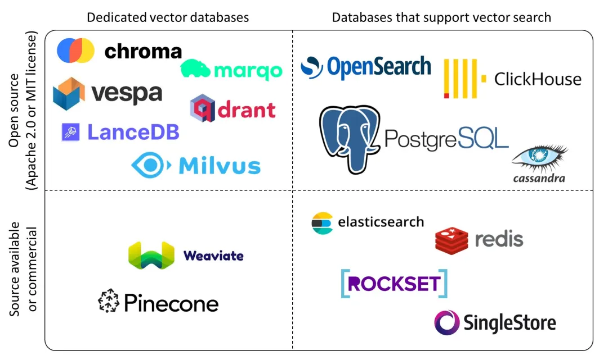
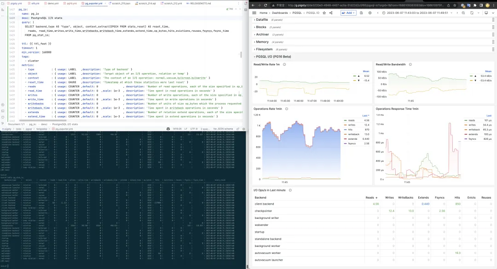
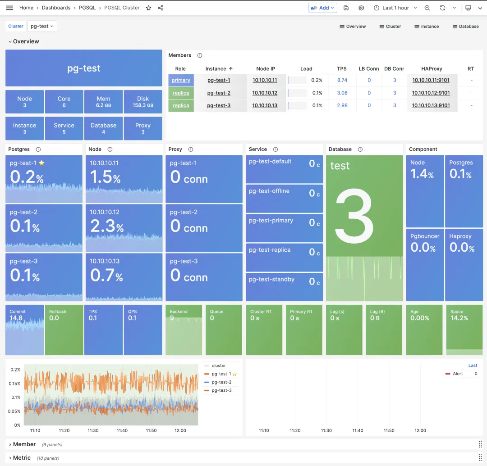
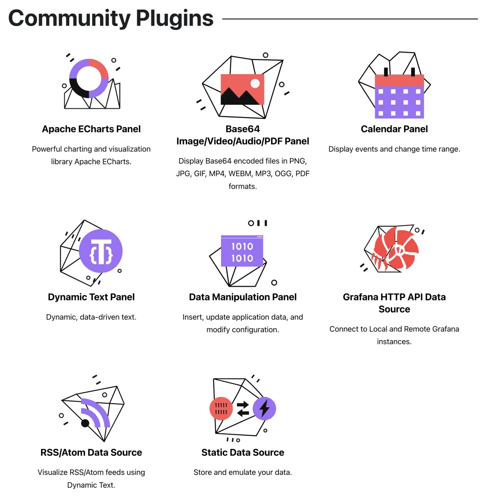

> [**GitHub Release**](https://github.com/pgsty/pigsty/releases/tag/v2.1.0) | [**发布注记**](https://pigsty.cc/docs/releasenote/#v210) | [微信公众号](https://mp.weixin.qq.com/s?__biz=MzU5ODAyNTM5Ng==&mid=2247485612&idx=1&sn=ce76d9439ed4f2ed10ee28c7aceb19cd&chksm=fe4b3d77c93cb46196eb97f7e04cbab1b2f2dee51324050ffc17583c22415f41a3656834fdcb&scene=21#wechat_redirect)

随着 PostgreSQL 夏季小版本例行更新，与 16 Beta 的发布，Pigsty 也紧随PG社区发布了 **v2.1** 版本，这次更新支持了 16 Beta1 的高可用与新监控指标，也提供了 PG 12 - 15 版本的支持。同时，AI 向量扩展插件 PGVector 也于 2.0.2 正式进入 Pigsty 中并默认启用。

https://github.com/Vonng/pigsty/releases/tag/v2.1.0

### 向量数据库扩展 PGVector

最近向量数据库非常火爆，市面上有许多专用向量数据库产品，商业的有 Pinecone，Zilliz，开源的有 Milvus，Qdrant 等。在所有现有向量数据库中，**pgvector** 是一个独特的存在 —— 它选择了在现有的世界上最强大的开源关系型数据库 PostgreSQL 上以插件的形式添砖加瓦，而不是另起炉灶做成另一个专用的“数据库”。毕竟从零开始做好一个TP数据库还是非常难的。

**pgvector** 有着优雅简单易用的接口，不俗的性能表现，更是继承了PG生态的超能力集合。在以前，PGVECTOR 需要自行下载编译安装，所以我提了一个 Issue 把它加入到 PostgreSQL 全球开发组的官方仓库中。你只需要正常使用 PGDG 源即可直接 `yum install pgvector_15` 完成安装。在安装了 `pgvector` 的数据库实例中使用 `CREATE EXTENSION vector` 即可启用此扩展。

但是使用 Pigsty，你甚至都不需要这个过程。在3月底发布的 Pigsty v2.0.2 中，就已经默认集成并安装了 PGVector 扩展。你只需要 `CREATE EXTENSION vector` 即可开箱即用。PGVector 的使用方式，应用场景案例，工作原理，请参考本号前一篇文章：《[AI大模型与向量数据库 PGVECTOR](http://mp.weixin.qq.com/s?__biz=MzU5ODAyNTM5Ng==&mid=2247485589&idx=1&sn=931f2d794e9b8486f623f746db9f00cd&chksm=fe4b3d4ec93cb4584c9bb44b1f347189868b6c8367d8c3f8dd8703d1a906786a55c900c23761&scene=21#wechat_redirect)》。

同时透露一下，我们正在制作一个功能、性能、易用性更好的 PGVector 实现，将于后续版本纳入 Pigsty 中，敬请期待。

### PG16支持与可观测性

Pigsty 也许是最快提供 PostgreSQL 16 支持的发行版 —— 尽管目前仍然处于 Beta 状态，一些功能扩展仍然没有跟进，但你已经可以拉起 PostgreSQL 16 的高可用集群体验测试起来。PostgreSQL 16 有一些比较实用的新功能：从库逻辑解码与逻辑复制，针对I/O的新统计视图，全连接的并行执行，更好的冻结性能，符合 SQL/JSON 标准的新函数集，以及在HBA认证中使用正则表达式。

Pigsty 特别关注 PostgreSQL 16 中的可观测性改进，新的 `pg_stat_io` 视图，让用户可以直接从数据库内访问到重要的 I/O 统计指标，对于性能优化，故障分析具有非常重要的意义。在以前，用户只能在数据库/BGWriter上看到有限的统计指标，想要更精细的统计数据，只能关联操作系统层面的I/O指标进行分析。现在，你可以从后端进程类型/关系类型/操作类型三个维度，对读/写/追加/回刷/Fsync/命中/逐出等行为进行深入的洞察。

另外一个非常有价值的可观测性改进点是，`pg_stat_all_tables` 与 `pg_stat_all_indexes` 会记录最后一次顺序扫描 / 索引扫描的时间。尽管这个功能在 Pigsty 的监控系统中可以通过扫描统计图表实现，但官方提供直接的支持肯定更好：用户可以直观地得出一些结论：比如某一个索引是不是没用上可以考虑移除。此外，`n_tup_newpage_upd` 指标可以告诉我们表上有多少行在更新时不是在页内原地更新，而是移动到了一个新的页面上，这个指标对于优化 UPDATE 性能，调整表填充因子具有重要的参考价值。

### PGSQL 12 - 15 支持

Pigsty 从 PostgreSQL 10 开始提供支持，但一直紧跟社区主干的最新版本。但用户确实会有使用旧版本的需求 —— 有的是外部组件最高就支持某个版本，有的是对最新的大版本有所顾虑希望谨慎升级，有的是因为想要从现有的低版本集群创建一个由 Pigsty 托管的 Standby Cluster 完成迁移。不管怎么样，对于较低版本的 PostgreSQL 支持是一个来自用户侧的真实需求。因此我们在 2.1 中，加入了 PG 12 -14 三个大版本的支持，并默认纳入离线软件包中。

每个大版本除了核心的软件包，也包括了相应版本的重要扩展插件：地理空间插件 PostGIS，时序数据库插件 **TimescaleDB**，分布式数据库插件 **citus**，向量数据库插件 **PGVector**，在线垃圾清理插件 **pg_repack**，CDC逻辑解码插件 **wal2json** 与 **pglogical**，定时任务插件 **pg_cron**，以及强制检查密码强度的插件 **passwordcheck_cracklib** ，确保每个大版本都可以享受到 PostgreSQL 生态的核心能力。

PostgreSQL 11 其实也可以支持，但因为有一些扩展缺失，加之即将进入 EOL，所以就排除在本次更新中。对于新尝试 PostgreSQL 的用户，我们始终建议从最新的稳定大版本（目前为15）开始使用。如果您真的希望使用 10 或 11，也可以参照教程调整仓库中的软件包版本自行构建。

### Grafana监控系统改进

随着 Grafana 版本升级至 v9.5.3 ， 全新的导航栏，面板布局让 Pigsty 的监控系统 UI 也随之焕然一新。所有监控面板都根据新 UI 的特性进行了微调与适配，一些不和谐的样式问题也得到了修正。

在 Pigsty 2.1 中引入了4个来自 `volkovlabs` 的 Grafana 扩展插件。使用 Grafana + Echarts 进行数据可视化与分析一直是 Pigsty 所倡导和支持的一个功能亮点，奈何作者精力有限，难以在这个方向投入资源。

在 v2.1 发布前，我很高兴看到一个由专人维护的 Apache Echarts 面板插件 —— 终于可以松一口气，让自己维护的 echarts panel 退休了。有一个专业的创业团队选择这个方向进行拓展，并开发出一系列实用的扩展插件。可以使用后端数据渲染 SVG 与文本的动态文本插件，提供表单提交功能的 Form 插件，动态数据日历插件，等等等等。

此外，Pigsty 还专门添加了 `echarts-gl` 的扩展资源，放置于 Grafana `public/chart` 目录下，允许用户使用 Pigsty 自带的 Grafana，无需互联网访问即可实现出 Apache Echarts 官方文档库中炫酷的三维地球等面板。

### 其他便利工具的改进

在 Pigsty 2.1 中，添加了 3 个便利命令，`profile`，`validate`，`repo-add`。

`bin/validate` 命令接受一个配置文件路径作为输入，它用来检查验证 Pigsty 配置文件的正确性。常见的问题，例如在不同集群里错误写入了同一个 IP，一些配置项的名称，类型错误，都可以自动检查抛出，更不用说最常见的YAML缩进格式错误了。用户修改配置之后，可以使用 `bin/validate` 确保自己的修改是有效合法的。

`bin/repo-add` 命令用于手工调整节点上的 YUM 仓库。当用户想要往本地软件仓库添加一些新的软件包时，经常需要使用 Ansible 剧本的子任务来进行管理，较为不便，现在您可以使用包装的命令行工具来完成这一点：比如，`bin/repo-add infra node,pgsql` 就会向 `infra` 分组的节点上添加分类为 `node` 与 `pgsql` 的软件源。

`bin/profile` 命令可以便捷地针对某个 IP 地址上特定 PID 的进程进行 `perf` 采样1分钟，并在 Pigsty Web服务器目录生成火焰图，用户可以直接从网页界面打开浏览，这个功能对于分析数据库内部的故障与性能瓶颈尤为有用。

----------------

## v2.1.0

相关文章：[Pigsty v2.1 发布：向量扩展 / PG12-16 支持](https://mp.weixin.qq.com/s/Wu9kWEFSI3oGUr8t3hrz_w)

发布注记：https://github.com/Vonng/pigsty/releases/tag/v2.1.0

**Highlight**

* PostgreSQL 16 beta 支持, 以及 12 ~ 15 的支持.
* 为 PG 12 - 15 新增了 PGVector 扩展支持，用于存储 AI 嵌入。
* 为 Grafana 添加了额外6个默认的扩展面板/数据源插件。
* 添加 `bin/profile` 脚本用于执行远程 Profiling ，生成火焰图。
* 添加 `bin/validate` 用于校验 `pigsty.yml` 配置文件合法性。
* 添加 `bin/repo-add` 用于快速向节点添加 Yum 源定义。
* PostgreSQL 16 可观测性：添加了 `pg_stat_io` 支持与相关监控面板

**软件升级**

* PostgreSQL 15.3 , 14.8, 13.11, 12.15, 11.20, and 16 beta1
* pgBackRest 2.46 / pgbouncer 1.19 
* Redis 7.0.11
* Grafana v9.5.3
* Loki / Promtail / Logcli 2.8.2
* Prometheus 2.44
* TimescaleDB 2.11.0
* minio-20230518000536 / mcli-20230518165900
* Bytebase v2.2.0

**改进增强**

* 当添加本地用户的公钥时，所有的 `id*.pub` 都会被添加到远程机器上（例如椭圆曲线算法生成的密钥文件）
