> [**GitHub Release**](https://github.com/pgsty/pigsty/releases/tag/v2.4.0) | [**Release Note**](https://pigsty.io/docs/releasenote/#v240)

[](https://github.com/pgsty/pigsty/releases/tag/v2.4.0)

PostgreSQL released its new major version 16 today, bringing a series of improvements. Pigsty followed up within 1 hour of release with Pigsty v2.4, providing complete support for PostgreSQL 16 GA. Additionally, v2.4 adds enhanced support for monitoring existing PG instances, especially RDS for PostgreSQL and PolarDB. Redis monitoring has been improved based on 7.x, with automated Sentinel-based high availability configuration.

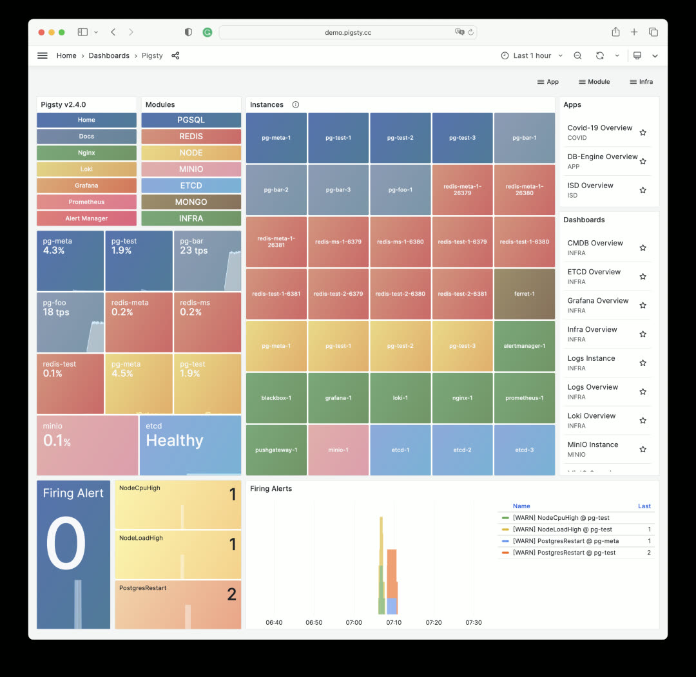


-------

## Highlights

* **PostgreSQL 16 GA** released, Pigsty provides support within 1 hour of release
* **Monitor cloud databases**: RDS for PostgreSQL and PolarDB, with brand-new PGRDS dashboards
* **Commercial support and consulting services** officially launched. First LTS version released, providing up to 5 years of support for subscribers
* **New extension: Apache AGE** — graph database query capability on PostgreSQL
* **New extension: zhparser** — Chinese word segmentation for full-text search
* **New extension: pg_roaringbitmap** — efficient RoaringBitmap implementation
* **New extension: pg_embedding** — another HNSW-based vector database plugin, alternative to pgvector
* **New extension: pg_tle** — AWS's trusted language stored procedure management/publishing/packaging extension
* **New extension: pgsql-http** — send HTTP requests and handle responses using SQL interface
* **Other new extensions**: pg_auth_mon, pg_checksums, pg_failover_slots, pg_readonly, postgresql-unit, pg_store_plans, pg_uuidv7, set_user
* **Redis improvements**: Sentinel monitoring support, automatic HA configuration for primary-replica clusters

**API Changes**

* New parameter: `REDIS`.`redis_sentinel_monitor` — specify list of primaries monitored by Sentinel cluster


-------

## PostgreSQL 16 Support

Pigsty is probably the first distribution to provide PostgreSQL 16 support — we've been tracking it since 16 beta1. So when PostgreSQL 16 was released, Pigsty completed GA support within an hour. You can already spin up PostgreSQL 16 high-availability clusters, though some important extensions aren't yet available in the official PGDG repository, such as Citus and TimescaleDB. But other extensions are ready: including PostGIS 3.4, pgvector, pg_squeeze, wal2json, pg_cron, and extensions maintained and packaged by Pigsty: zhparser, roaringbitmap, pg_embedding, pgsql-http, and more.

PostgreSQL 16 brings practical new features: logical decoding and logical replication from standbys, new I/O statistics views, parallel execution of full joins, better freezing performance, new SQL/JSON standard function set, and regular expressions in HBA authentication.

Note that the official PGDG repository has decided to drop EL7 support for PostgreSQL 16, so PG16 is only available on EL8 and EL9 and compatible OS distributions.


-------

## Monitoring RDS and PolarDB

Pigsty v2.4 provides RDS monitoring support, with particular emphasis on PolarDB cloud database monitoring. When you only have a remote PostgreSQL connection string, you can use this method to integrate it into Pigsty monitoring.

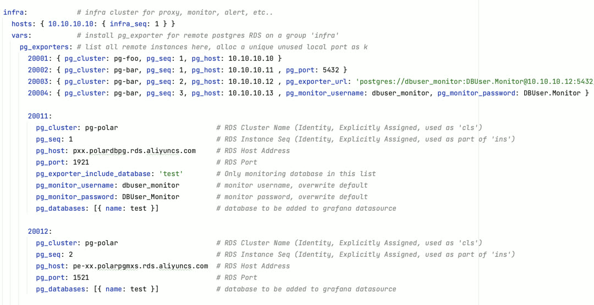

Example: Monitoring a primary-replica PolarDB RDS cluster

Pigsty v2.4 provides RDS monitoring support with special attention to PolarDB cloud database monitoring. When you only have a remote PostgreSQL connection string, you can bring it into Pigsty monitoring. Pigsty provides two brand-new dashboards: PGRDS Cluster and PGRDS Instance, for presenting complete RDS PG metrics.

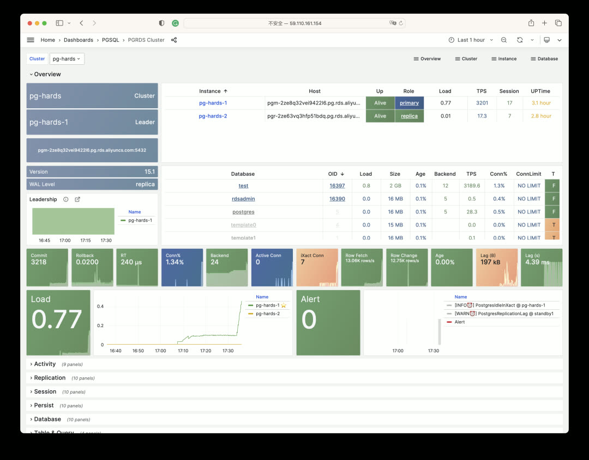

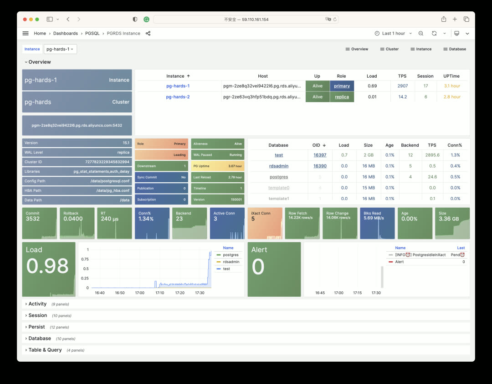

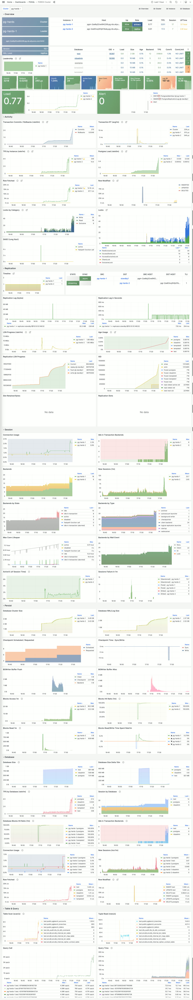


-------

## Commercial Support

Pigsty v2.4 is the first LTS version, providing 3 years of long-term support for enterprise subscribers. We're also officially launching subscription and support services — contact us if interested.

**https://pigsty.io/docs/support/**

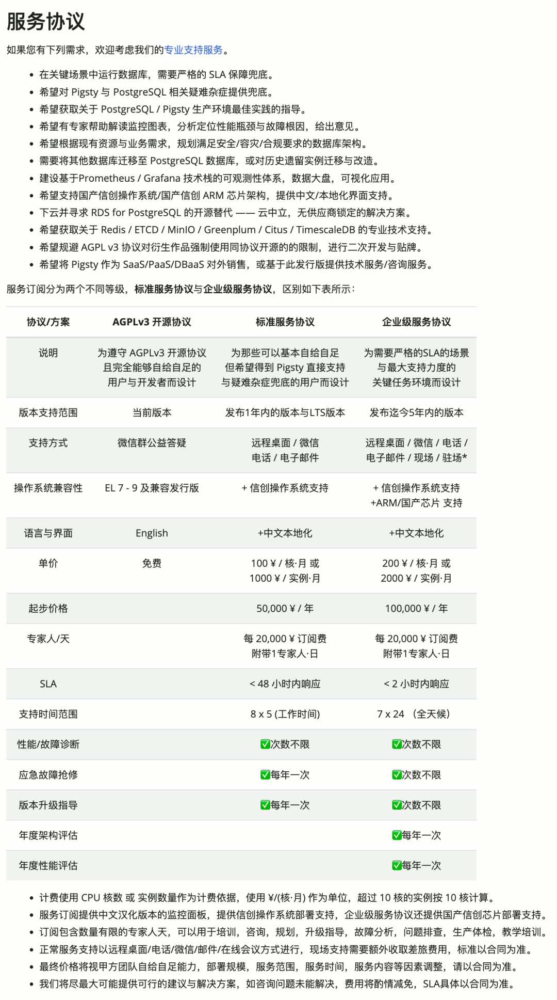


-------

## Redis High Availability

In Pigsty v2.4, we provide a new parameter `redis_sentinel_monitor` for automatically configuring high availability for classic Redis primary-replica clusters. This parameter can only be defined on Sentinel clusters, and primaries defined in it will be automatically managed by the Sentinel cluster.

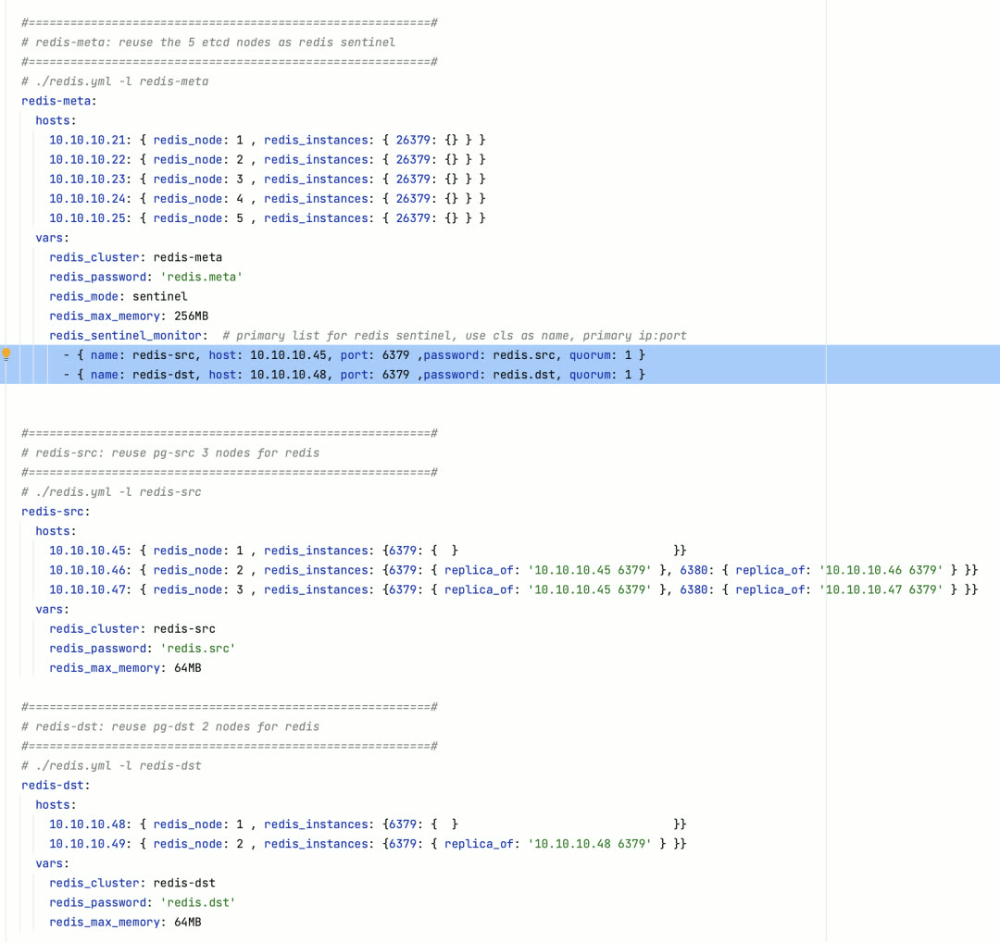

Meanwhile, we've added Sentinel-related metrics and panels to Redis monitoring, adapted for Redis 7.x's new features.


-------

## New Extensions

Pigsty v2.4 provides a series of new extensions, including important ones not yet in the official PGDG repository. For example: graph database plugin Apache AGE, Chinese full-text search plugin zhparser, HTTP plugin pgsql-http, trusted extension packaging plugin pg_tle, bitmap plugin pg_roaringbitmap, and pg_embedding as an alternative vector database implementation to PGVector, and more.

All extensions are compiled and packaged for PostgreSQL 12 through PostgreSQL 16 on EL7 through EL9, though EL7 doesn't yet support pg_tle and pg_embedding due to compiler version issues. These RPM packages are maintained by Pigsty and hosted in Pigsty's own Yum repository.

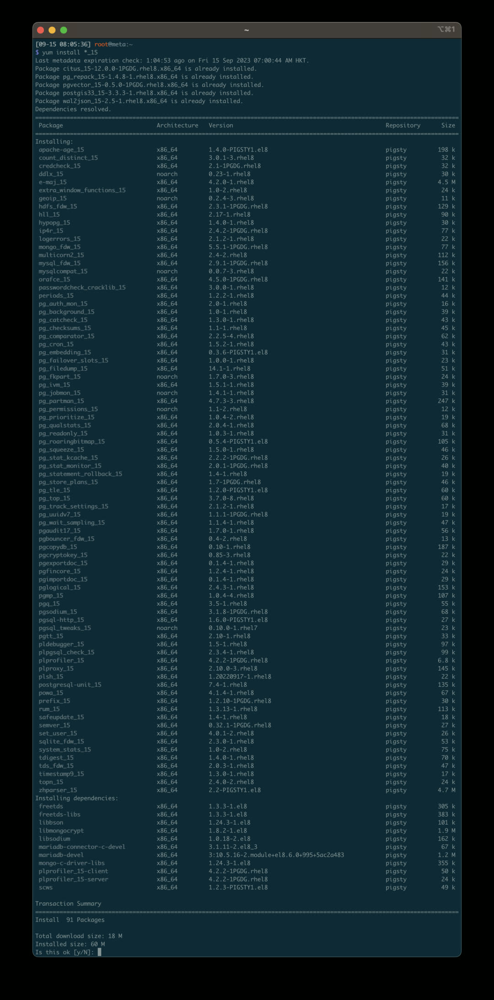

For example, you can use AGE to add graph database capabilities to PostgreSQL, create Graphs, and explore graph data using Cypher query language alongside SQL — achieving Neo4j-like functionality.

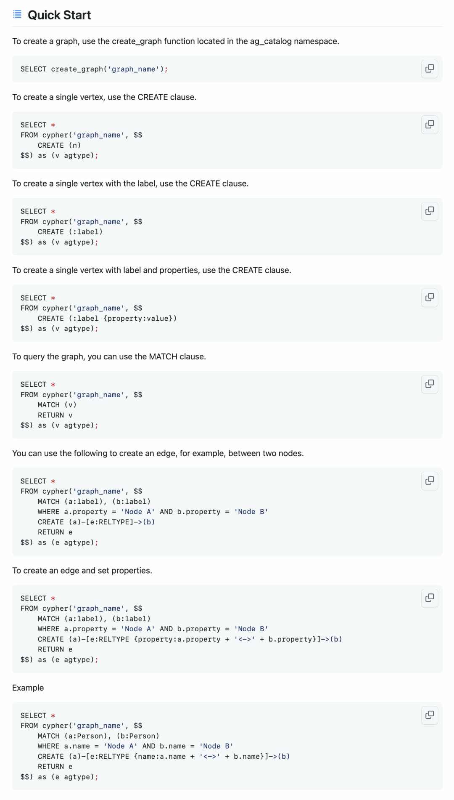

Or you can use the zhparser Chinese word segmentation plugin to split Chinese text and queries into keywords, using PostgreSQL's classic full-text search capability to achieve search engine and ElasticSearch-like functionality.

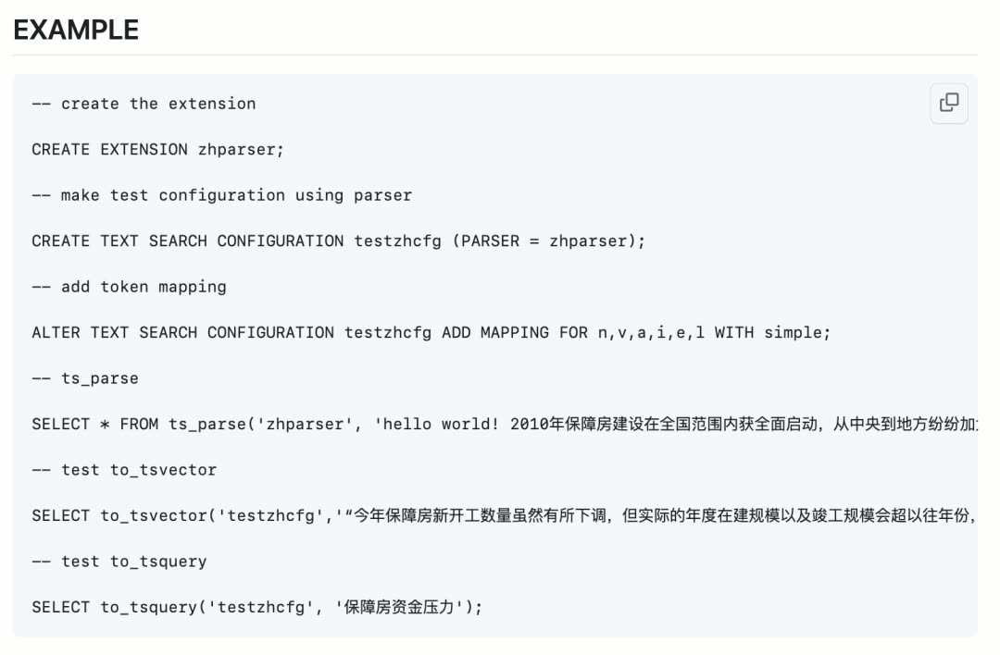

Even more impressively, you can use the pgsql-http plugin to send HTTP requests and process HTTP responses using a SQL interface. This enables deep integration and interaction between the database and external systems, opening up endless possibilities:

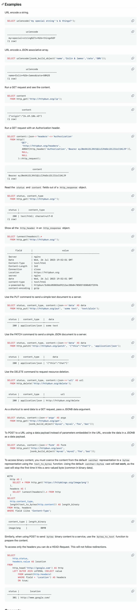

You can also use roaringbitmap to efficiently perform counting statistics with minimal resources:

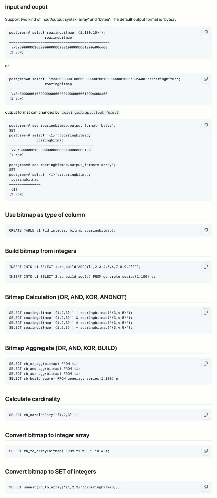

We won't go into all the details here — we'll publish dedicated articles introducing how to use these powerful extensions.


----------------

## v2.4.0 Release Notes

**Highlights**

- PostgreSQL 16 GA released, Pigsty provides support
- Monitor cloud databases: RDS for PostgreSQL and PolarDB with brand-new PGRDS dashboards
- Commercial support and consulting services officially launched. First LTS version released, providing up to 5 years of support for subscribers
- New extension: Apache AGE, openCypher graph query engine on PostgreSQL
- New extension: zhparser, full text search for Chinese language
- New extension: pg_roaringbitmap, roaring bitmap for PostgreSQL
- New extension: pg_embedding, HNSW alternative to pgvector
- New extension: pg_tle, admin/manage stored procedure extensions
- New extension: pgsql-http, issue HTTP requests with SQL interface
- Additional extensions: pg_auth_mon, pg_checksums, pg_failover_slots, pg_readonly, postgresql-unit, pg_store_plans, pg_uuidv7, set_user
- Redis improvements: Sentinel monitoring support, automatic HA configuration for primary-replica clusters

**API Changes**

- New parameter: `REDIS`.`redis_sentinel_monitor` — specify list of primaries monitored by Sentinel cluster

**Bug Fixes**

- Fixed missing `uid` when registering datasources in Grafana 10.1

```bash
MD5 (pigsty-pkg-v2.4.0.el7.x86_64.tgz) = 257443e3c171439914cbfad8e9f72b17
MD5 (pigsty-pkg-v2.4.0.el8.x86_64.tgz) = 41ad8007ffbfe7d5e8ba5c4b51ff2adc
MD5 (pigsty-pkg-v2.4.0.el9.x86_64.tgz) = 9a950aed77a6df90b0265a6fa6029250
```
