> [**GitHub Release**](https://github.com/pgsty/pigsty/releases/tag/v2.5.0) | [**Release Note**](https://pigsty.io/docs/releasenote/#v250)

[](https://github.com/pgsty/pigsty/releases/tag/v2.5.0)

On Programmer's Day (10/24), Pigsty v2.5.0 is released! This version adds support for **Ubuntu** and **Debian** operating systems. Combined with existing **EL7/8/9** support, we've achieved a grand slam of mainstream Linux distributions.

Additionally, Pigsty now officially supports self-hosted Supabase and PostgresML, plus columnar storage extension `hydra`, LiDAR point cloud extension `pointcloud`, image similarity extension `imgsmlr`, extended distance function package `pg_similarity`, and multilingual fuzzy search extension `pg_bigm`.

For monitoring, Pigsty has optimized the PostgreSQL dashboard experience, added new Patroni & Exporter dashboards, and redesigned the PGSQL Query dashboard based on query macro-optimization methodology.


------

### About Pigsty

[**Pigsty**](https://pigsty.io) is an out-of-the-box [**PostgreSQL**](https://www.postgresql.org/) distribution providing a local-first open-source alternative to RDS PostgreSQL. It enables users to run better enterprise-grade PostgreSQL database services at a fraction of cloud RDS costs using pure hardware. For more information, visit **https://pigsty.io**.

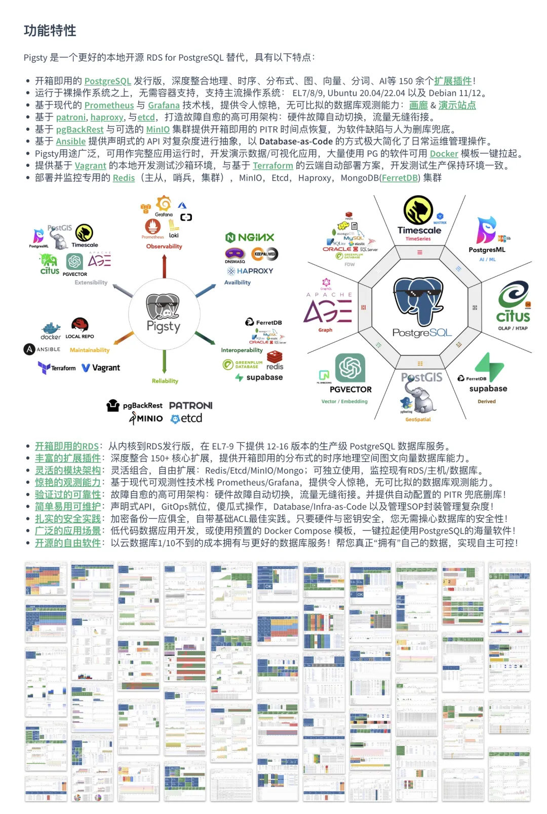


------

## Ubuntu/Debian Support

Pigsty now supports Ubuntu and Debian operating systems (referred to as Deb support). Users have been requesting Ubuntu and Debian support since the 0.x era two years ago, so this is something that felt both important and right to do.

As a database distribution that builds **on bare operating systems**, supporting a new OS isn't as simple as containerized databases just packaging an image. There's substantial adaptation work required. The first challenge is package availability — Prometheus, for example, doesn't have an official DEB repository, so we had to maintain our own packaging and provide a repository.

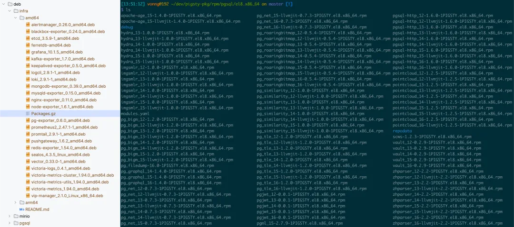

> Pigsty-maintained APT/YUM repositories

The massive differences in package management require rewriting the entire bootstrap / local repository build logic for Deb systems. Distro FHS and convention differences need case-by-case handling. You're not just dealing with PostgreSQL kernel and 100+ extensions — there's also etcd, minio, redis, grafana, prometheus, haproxy, and various other components. Fortunately, Pigsty has overcome these issues, giving Ubuntu/Debian the same smooth experience as EL 7-9.

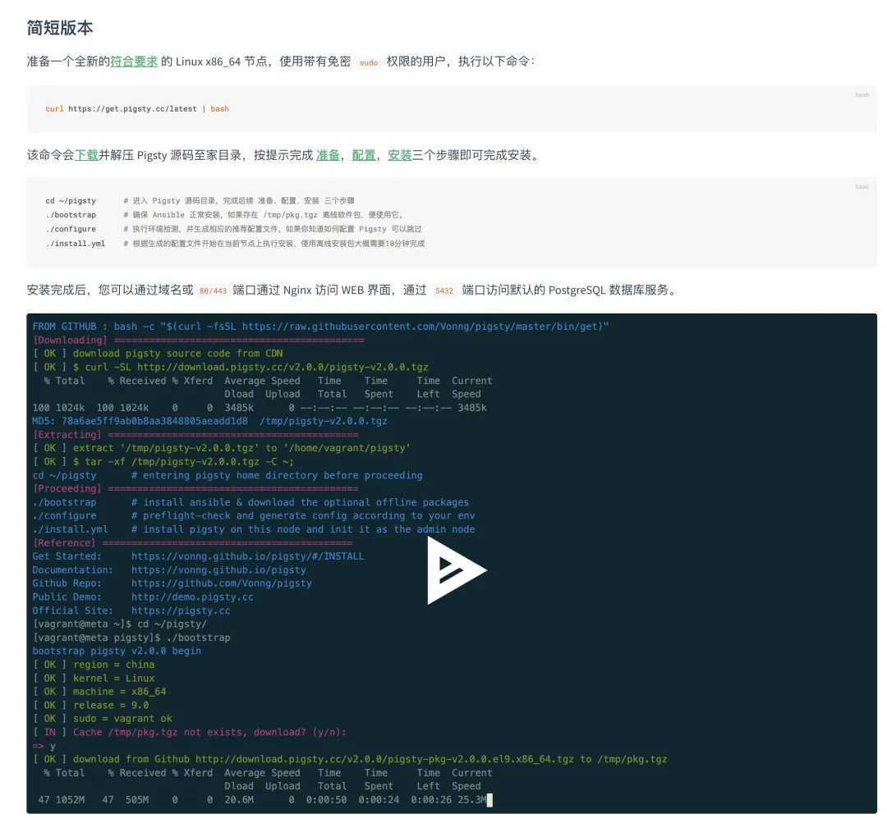

> One-click Pigsty installation

In terms of user experience, Deb support has an almost identical feature set to EL. The only exception is that Supabase and its specialized extensions haven't been fully ported yet. Beyond that, Deb has some unique extensions like the chemical formula extension `RDKit`, LiDAR point cloud extension `pointcloud`, and extended distance function package `pg_similarity` (the latter two have been backported to EL). To fully leverage PostgresML + CUDA capabilities, Ubuntu is essential.

Pigsty's auto-configuration now detects Debian/Ubuntu systems, automatically using the corresponding config template for single-node installations. Deb templates differ from EL in only 8 parameter defaults — package names differ between distributions, so parameters like `xx_packages` need adjustment. The only other changes are upstream repos `repo_upstream`, local repo URLs `node_repo_local_urls`, and default `pg_dbsu_uid` (DEB packages don't assign fixed UIDs).

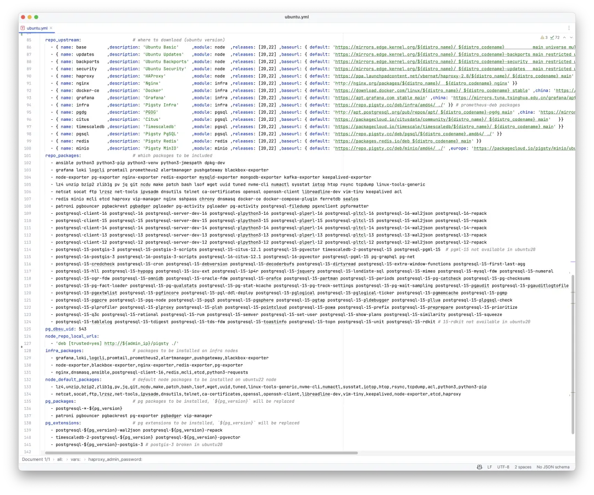

> Declarative config file for Ubuntu systems

Users typically don't need to adjust these parameters, so the Pigsty workflow on Deb systems is virtually identical. In fact, Pigsty's offline package build template works exactly this way: completing full Pigsty installations on seven different operating systems at once, without any special handling.


------

## New Extensions

Pigsty v2.5 includes several user-requested extensions. First up is **PostgresML**. While the previous version already supported PostgresML on EL8/EL9, AI work is almost universally done on Ubuntu — at minimum, CUDA driver installation is much easier.

So in Pigsty v2.5, you can run native PostgresML clusters on Ubuntu. No fiddling with **NVIDIA Docker** or anything like that — just pip install the Python dependencies and you're ready to go. Train models with SQL, invoke models, and complete your entire AI workflow within the database!

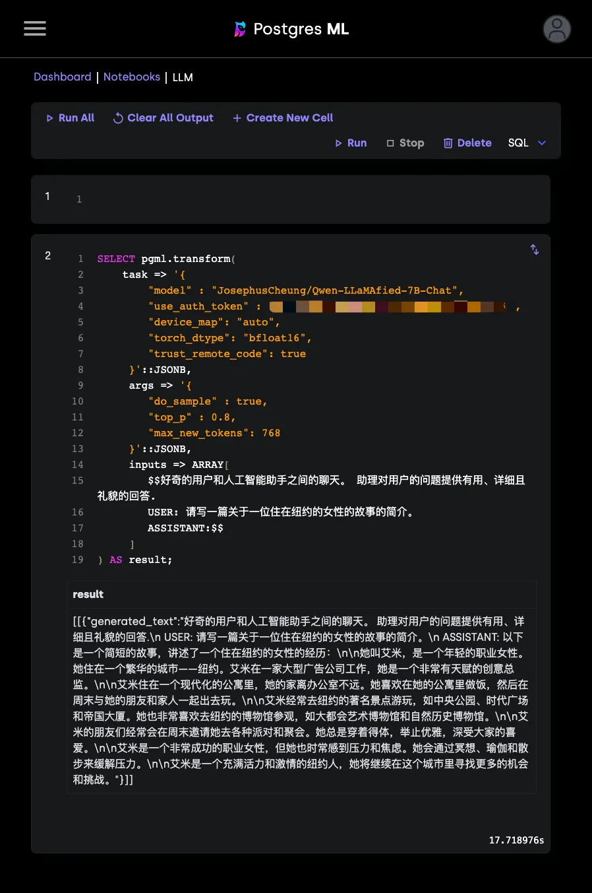

The second noteworthy extension is `pointcloud`. Thanks to PostGIS, PostgreSQL has always been a favorite of autonomous driving/EV companies. PointCloud extends PostgreSQL and PostGIS's power to a new frontier. LiDAR continuously scans surroundings and generates "point cloud" data. The `pointcloud` extension provides PcPoint & PcPatch data types and forty functions, allowing efficient storage, retrieval, and computation on ultra-high-dimensional point sets. This extension is natively available in the PGDG APT repository, and Pigsty has ported it to EL systems so all users can benefit.


`imgsmlr` is a reverse image search extension. While many AI models can now encode images into high-dimensional vectors for semantic search using `pgvector`, what makes `imgsmlr` interesting is that it requires no external dependencies and can complete all functionality within the database. In the author's words: "My goal isn't to provide the most advanced image search method, but to show you how to write a PostgreSQL extension for even non-typical database tasks like image processing."

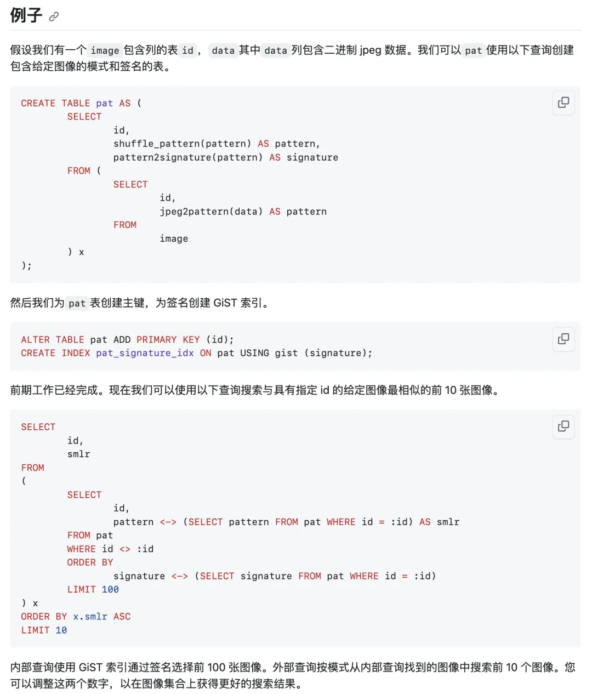

It first processes PNG/JPG images using Haar wavelet transform into 16K patterns and 64-byte signature digests, then uses GiST index retrieval on digests for efficient reverse image search. Using `imgsmlr` to retrieve the 10 most similar images from 400 million random images takes about 600ms.

Another interesting extension, `pg_similarity`, is available by default in Ubuntu/Debian APT repos, and Pigsty has ported it to EL. It provides efficient C implementations of 17 text distance metric functions, greatly enriching search and ranking capabilities. A related plugin is `pg_bigm`, similar to PostgreSQL's built-in `pg_trgm`, except it uses bigrams instead of trigrams for fuzzy search, providing better full-text search support for CJK languages.

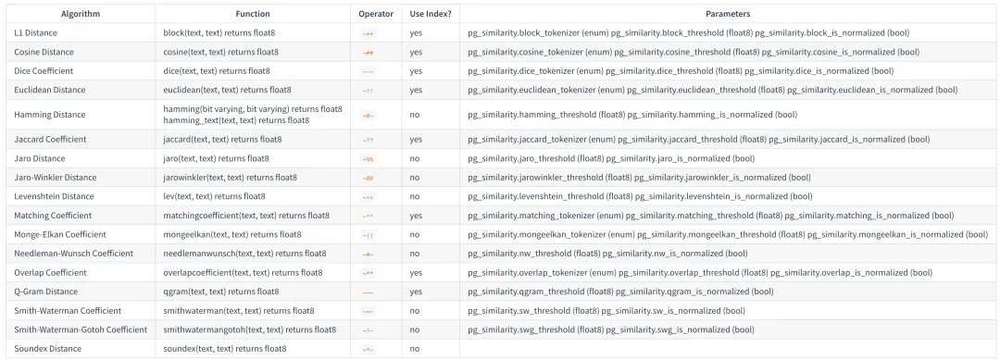

Additionally, we've updated Supabase support to the latest version: `20231013070755`. You can self-host Supabase on EL8/EL9 systems using Pigsty's PostgreSQL database.

Including PostgreSQL's built-in extensions, Pigsty 2.5 supports 150+ extensions. Despite this abundance, note that they're all **optional**. Pigsty provides `pg_repack`, `wal2json`, and `passwordcheck_cracklib` (EL) for all PostgreSQL major versions, with only the online bloat management extension `pg_repack` installed by default. Other extensions, if not installed, impose no extra burden on the system.


------

## Monitoring System Updates

Pigsty v2.5 brings monitoring system adjustments, updating the long-standing `pg_exporter` to `v0.6.0` with TLS support, fixing two dependency security issues, building ARM64 packages, and using the latest metrics definition files. Additionally, four shared buffer I/O related metrics were added to the `pg_query` collector, enriching the information in PGSQL Query.

First, the new PGSQL Patroni dashboard provides a complete view of cluster HA status. Very helpful for analyzing historical service health and failover causes.

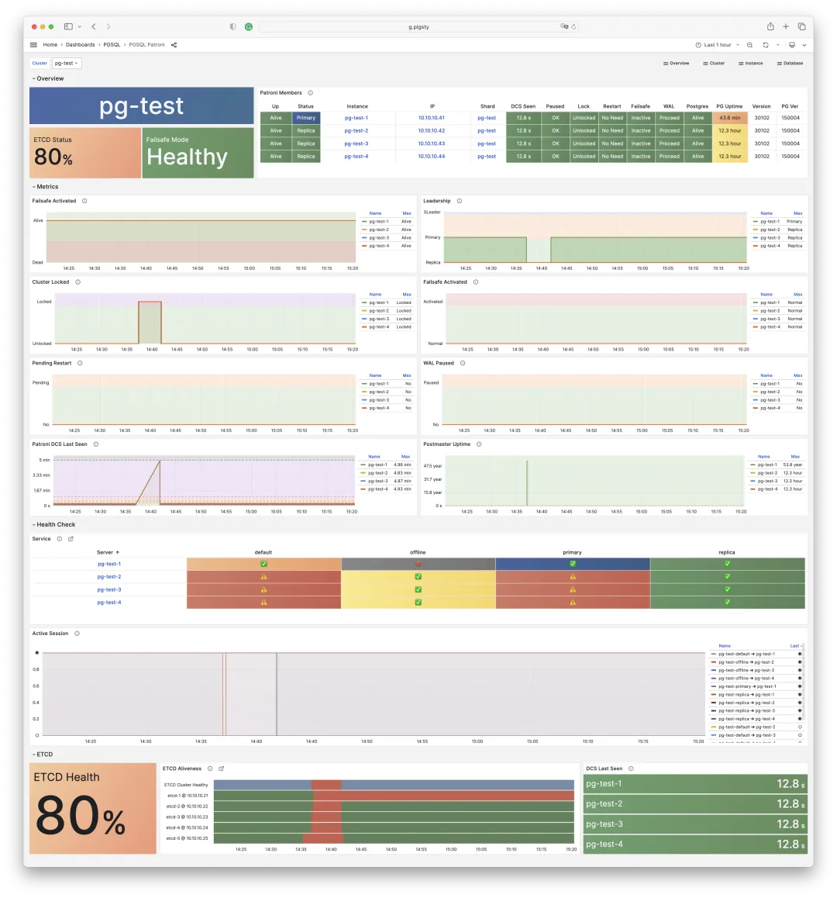

Then there's PGSQL Exporter, providing detailed self-monitoring metrics and logs for PG Exporter and Pgbouncer Exporter. Useful for optimizing the monitoring system itself.

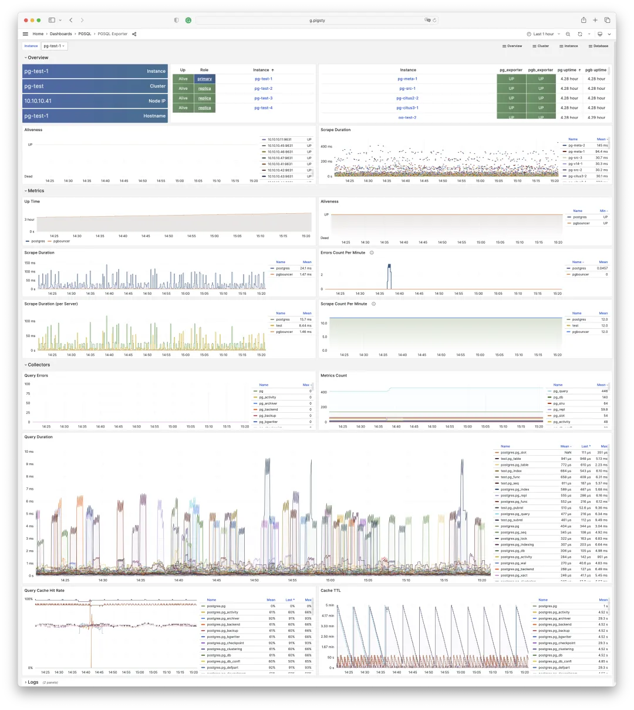

In component navigation panels across various dashboards, you can click Patroni/Exporter indicator tiles to jump directly to component details:

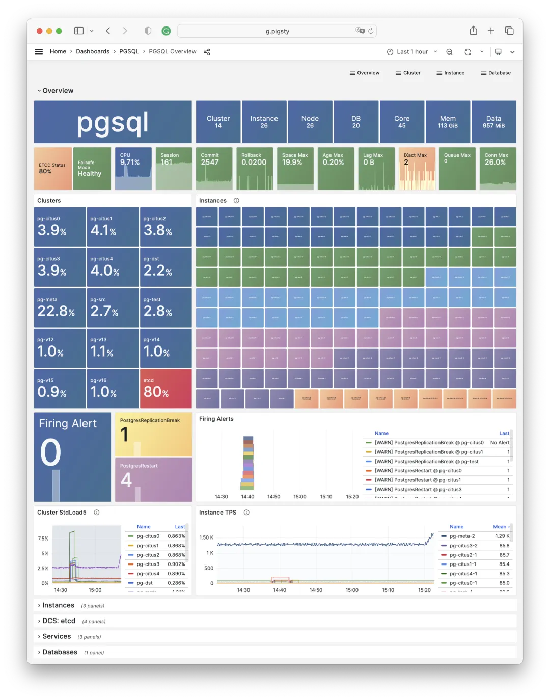

The PGSQL Query dashboard now has five sections: Overview, core QPS/RT metrics, time-differential metrics, call-differential metrics, and percentage metrics. Following macro-optimization methodology:

**Reduce Resource Consumption**: Lower saturation risk, optimize CPU/memory/IO, typically targeting total query time/IO. Uses `dM/dt`: metric `M` differentiated over time (per-second increments).

**Improve User Experience**: Most common optimization goal. In OLTP, typically targets reduced average query response time. Uses `dM/dc`: metric `M` differentiated over call count (per-call increments).

**Balance Workload**: Ensure proper proportions of resource usage/performance across query groups. Uses `M%`: percentage of a query class's metric relative to totals.

The PGSQL first screen shows the most critical query performance metrics: QPS and RT — plus their 1/5/15-minute averages, jitter, and distribution ranges.

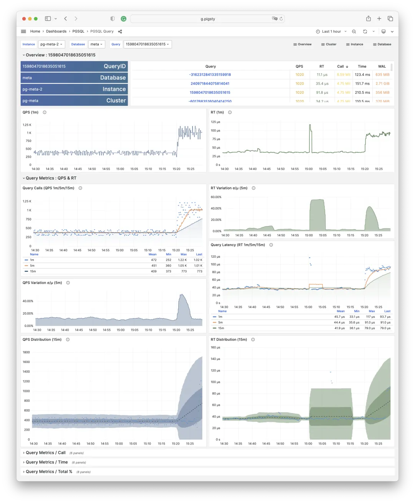

Next are `dM/dc` metrics for user experience optimization, where M includes:
- Average rows returned per query
- Average execution time per query
- Average WAL size per query
- Average I/O time per query
- Average buffer blocks read/written per query
- Average buffer blocks accessed/dirtied per query

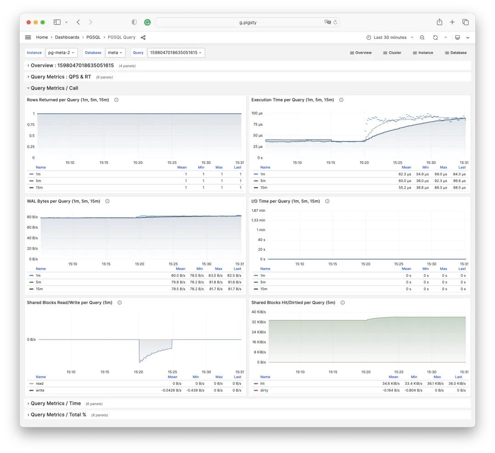

Then `dM/dt` metrics for **resource consumption reduction**, with similar M metrics but differentiated over time instead of call count:

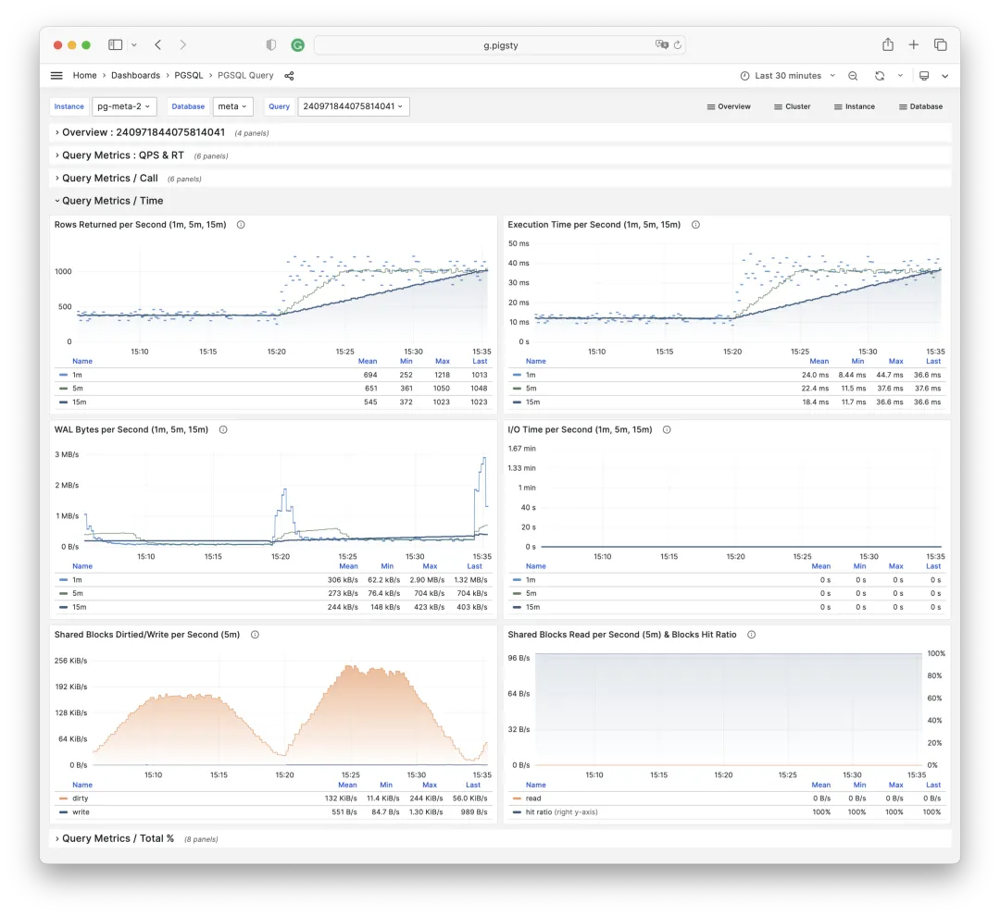

The final section shows `%M` metrics for workload balancing. Reveals a specific query group's proportion and relative position in the overall workload, shown in bold. Click specific queries to navigate in-place — very convenient.

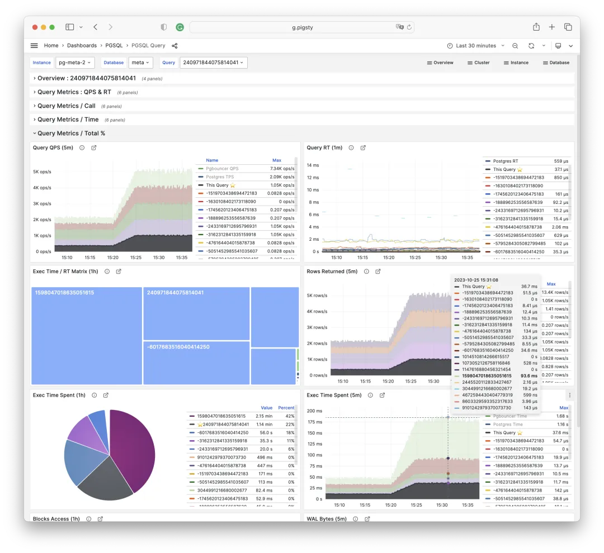

Beyond these three dashboards, Pigsty has optimized and fixed many other panels. Many panel info sections now provide more detail: what metrics the panel shows, what problems it solves, etc. We've also introduced three new Grafana plugins for CSV/JSON datasources and variable panels.


------

## Release Notes

### v2.5.0

```bash
curl https://get.pigsty.cc/latest | bash
```

**Highlights**

- [Ubuntu](https://github.com/Vonng/pigsty/blob/master/files/pigsty/ubuntu.yml) / [Debian](https://github.com/Vonng/pigsty/blob/master/files/pigsty/debian.yml) support: bullseye, bookworm, jammy, focal
- CDN `repo.pigsty.cc` software repository providing RPM/DEB package downloads
- Anolis OS support (compatible with EL 8.8)
- PostgreSQL 16 replaces PostgreSQL 14 as the alternative primary supported version
- New PGSQL Exporter / PGSQL Patroni dashboards, redesigned PGSQL Query dashboard
- Extension updates:
    - PostGIS upgraded to 3.4 (EL8/EL9), EL7 remains on PostGIS 3.3
    - Removed `pg_embedding` as developer discontinued maintenance, recommend `pgvector` instead
    - New extension (EL): Point cloud plugin `pointcloud` support, natively available on Ubuntu
    - New extensions (EL): `imgsmlr`, `pg_similarity`, `pg_bigm` for search
    - Recompiled `pg_filedump` as PG version-independent package
    - Added `hydra` columnar storage extension, `citus` no longer installed by default
- Software updates:
    - Grafana to v10.1.5
    - Prometheus to v2.47
    - Promtail/Loki to v2.9.1
    - Node Exporter to v1.6.1
    - Bytebase to v2.10.0
    - Patroni to v3.1.2
    - pgbouncer to v1.21.0
    - pg_exporter to v0.6.0
    - pgbackrest to v2.48.0
    - pgbadger to v12.2
    - pg_graphql to v1.4.0
    - pg_net to v0.7.3
    - FerretDB to v0.12.1
    - SealOS to 4.3.5
    - Supabase support to `20231013070755`

**Ubuntu Support Notes**

Pigsty supports Ubuntu 22.04 (jammy) and 20.04 (focal) LTS versions with corresponding offline packages.

Compared to EL systems, some parameter defaults need explicit adjustment. See [`ubuntu.yml`](https://github.com/Vonng/pigsty/blob/master/files/pigsty/ubuntu.yml) for details:

- `repo_upstream`: Adjusted for Ubuntu/Debian package names
- `repo_packages`: Adjusted for Ubuntu/Debian package names
- `node_repo_local_urls`: Defaults to `['deb [trusted=yes] http://${admin_ip}/pigsty ./']`
- `node_default_packages`:
    - `zlib` -> `zlib1g`, `readline` -> `libreadline-dev`
    - `vim-minimal` -> `vim-tiny`, `bind-utils` -> `dnsutils`, `perf` -> `linux-tools-generic`
    - Added `acl` package to ensure Ansible permissions work correctly
- `infra_packages`: All packages with `_` replaced by `-`, `postgresql-client-16` replaces `postgresql16`
- `pg_packages`: Ubuntu conventionally uses `-` instead of `_`, no need to manually install `patroni-etcd`
- `pg_extensions`: Extension names differ from EL, Ubuntu lacks `passwordcheck_cracklib`
- `pg_dbsu_uid`: Ubuntu DEB packages don't specify explicit UID, manual specification required, Pigsty defaults to `543`

**API Changes**

Default value changes:

- `repo_modules` now defaults to `infra,node,pgsql,redis,minio`, enabling all upstream sources
- `repo_upstream` changed, now adds Pigsty Infra/MinIO/Redis/PGSQL modular software sources
- `repo_packages` changed, removed unused `karma,mtail,dellhw_exporter`, removed PG14 main extensions, added PG16 main extensions, added virtualenv package
- `node_default_packages` changed, now installs `python3-pip` by default
- `pg_libs`: `timescaledb` removed from shared_preload_libraries, no longer auto-enabled by default
- `pg_extensions` changed, Citus no longer installed by default, `passwordcheck_cracklib` installed by default, EL8,9 PostGIS default version upgraded to 3.4

  ```yaml
  - pg_repack_${pg_version}* wal2json_${pg_version}* passwordcheck_cracklib_${pg_version}*
  - postgis34_${pg_version}* timescaledb-2-postgresql-${pg_version}* pgvector_${pg_version}*
  ```

- All Patroni templates remove `wal_keep_size` parameter by default to avoid triggering Patroni 3.1.1 bug, functionality covered by `min_wal_size`

```bash
MD5 (pigsty-pkg-v2.5.0.el7.x86_64.tgz) = 87e0be2edc35b18709d7722976e305b0
MD5 (pigsty-pkg-v2.5.0.el8.x86_64.tgz) = e71304d6f53ea6c0f8e2231f238e8204
MD5 (pigsty-pkg-v2.5.0.el9.x86_64.tgz) = 39728496c134e4352436d69b02226ee8
MD5 (pigsty-pkg-v2.5.0.debian11.x86_64.tgz) = e3f548a6c7961af6107ffeee3eabc9a7
MD5 (pigsty-pkg-v2.5.0.debian12.x86_64.tgz) = 1e469cc86a19702e48d7c1a37e2f14f9
MD5 (pigsty-pkg-v2.5.0.ubuntu20.x86_64.tgz) = cc3af3b7c12f98969d3c6962f7c4bd8f
MD5 (pigsty-pkg-v2.5.0.ubuntu22.x86_64.tgz) = c5b2b1a4867eee624e57aed58ac65a80
```


----------------

### v2.5.1

Following PostgreSQL v16.1, v15.5, 14.10, 13.13, 12.17, 11.22 routine minor version updates.

All important PostgreSQL 16 extensions are now in place (added `pg_repack` and `timescaledb` support).

- Software updates:
  - PostgreSQL to v16.1, v15.5, 14.10, 13.13, 12.17, 11.22
  - Patroni v3.2.0
  - PgBackrest v2.49
  - Citus 12.1
  - TimescaleDB 2.13
  - Grafana v10.2.0
  - FerretDB 1.15
  - SealOS 4.3.7
  - Bytebase 2.11.1

* Removed `monitor` schema prefix from PGCAT dashboard queries (allowing users to install `pg_stat_statements` elsewhere)
* New `wool.yml` config template designed for Alibaba Cloud free 99 ECS single-node
* Added `python3-jmespath` package for EL9 to fix jmespath missing after Ansible dependency update during bootstrap

```bash
MD5 (pigsty-pkg-v2.5.1.el7.x86_64.tgz) = 31ee48df1007151009c060e0edbd74de
MD5 (pigsty-pkg-v2.5.1.el8.x86_64.tgz) = a40f1b864ae8a19d9431bcd8e74fa116
MD5 (pigsty-pkg-v2.5.1.el9.x86_64.tgz) = c976cd4431fc70367124fda4e2eac0a7
MD5 (pigsty-pkg-v2.5.1.debian11.x86_64.tgz) = 7fc1b5bdd3afa267a5fc1d7cb1f3c9a7
MD5 (pigsty-pkg-v2.5.1.debian12.x86_64.tgz) = add0731dc7ed37f134d3cb5b6646624e
MD5 (pigsty-pkg-v2.5.1.ubuntu20.x86_64.tgz) = 99048d09fa75ccb8db8e22e2a3b41f28
MD5 (pigsty-pkg-v2.5.1.ubuntu22.x86_64.tgz) = 431668425f8ce19388d38e5bfa3a948c
```
