> [**GitHub Release**](https://github.com/pgsty/pigsty/releases/tag/v2.5.0) | [**发布注记**](https://pigsty.cc/docs/releasenote/#v250) | [微信公众号](https://mp.weixin.qq.com/s?__biz=MzU5ODAyNTM5Ng==&mid=2247486283&idx=1&sn=4b63f438df33291a3deb1052bea31347&chksm=fe4b3e90c93cb786a54407a4f7e552b2c8b28478b28df852e41f5d9e2c991761dddbc9a5a813&scene=21#wechat_redirect)

[](https://github.com/pgsty/pigsty/releases/tag/v2.5.0)

时值 1024 程序员节，Pigsty v2.5.0 发布了 🎉，这个版本添加了对 **Ubuntu** 与 **Debian** 系操作系统的支持，加上原有的 **EL7/8/9** 支持，可谓实现了主流 Linux 操作系统大满贯。

此外，Pigsty 正式支持了自托管的 Supabase 与 PostgresML，以及列式存储插件 `hydra`，激光雷达点云支持插件 `pointcloud`，图像相似度计算插件 `imgsmlr`，扩展距离函数包 `pg_similarity` 以及多语言模糊检索插件 `pg_bigm`。

在监控上，Pigsty 优化了 PostgreSQL 监控面板体验，新增了 Patroni & Exporter 监控面板，根据查询宏观优化方法论重新设计了 PGSQL Query 监控面板。

------

### 关于Pigsty

[**Pigsty**](http://mp.weixin.qq.com/s?__biz=MzU5ODAyNTM5Ng==&mid=2247486135&idx=1&sn=7d9c4920e94efba5d0e0b6af467f596c&chksm=fe4b3f6cc93cb67ac570d5280b37328aed392598b13df88545ff0a06f99630801fc999db8de5&scene=21#wechat_redirect) 是一个开箱即用的 [**PostgreSQL**](http://mp.weixin.qq.com/s?__biz=MzU5ODAyNTM5Ng==&mid=2247485933&idx=3&sn=ea360aa7a59a4cd23ad5f9a9f415a0a0&chksm=fe4b3c36c93cb520bda4596136e927d7cf92c597a76c04077c256588b2428202bdb7f004c08b&scene=21#wechat_redirect) 发行版 、提供本地优先的 RDS PG 开源替代。让用户用云数据库 RDS 几分之一的纯硬件成本，自助运行更好的企业级 PostgreSQL 数据库服务。更多介绍，请访问 **https://pigsty.cc** 。

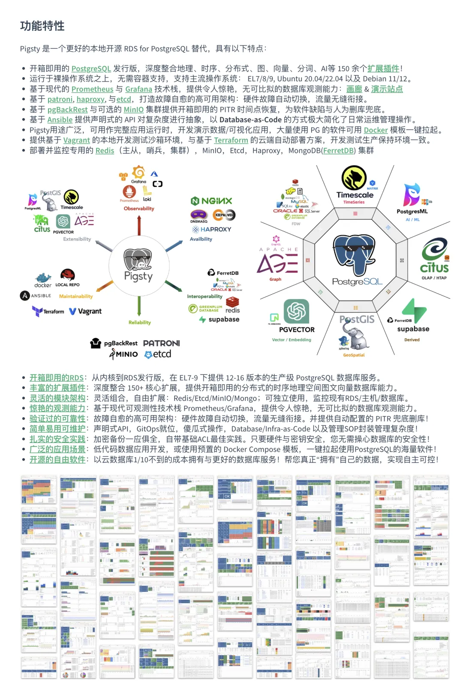

------

## Ubuntu/Debian支持

在《[临水照花看Ubuntu与Debian：Pigsty v2.5](http://mp.weixin.qq.com/s?__biz=MzU5ODAyNTM5Ng==&mid=2247486263&idx=1&sn=4288450c04a6fdbaf5e4fae385d42bd9&chksm=fe4b3eecc93cb7faf32a8c30ab78870f8ca607ad572e9d6725ac9f64c1549071c3d33a802019&scene=21#wechat_redirect)》中，我们已经预告了对 Ubuntu / Debian 系操作系统的支持（以下简称 Deb 支持）。从两年前 0.x 版本的时代，就有用户提出想要 Ubuntu 和 Debian 操作系统支持了，所以我觉得这是一件非常正确且重要的事情。

作为一个选择构建于 **裸操作系统上** 的数据库发行版，支持一种新操作系统并不像容器化数据库打个镜像那么简单。有许多的适配工作需要去做。首当其冲的就是包不齐的问题，好比 Prometheus 就没有官方提供的 DEB 源，不得不自己维护打包并提供一个软件仓库。

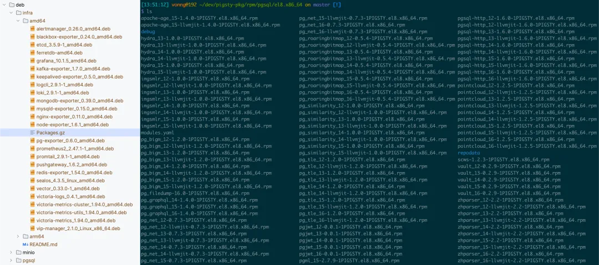

> Pigsty 维护的 APT/YUM 源

包管理的巨大差别，要求你针对DEB系重写整个 bootstrap / 构建本地软件源的逻辑。发行版的 FHS ，习惯规约差异需要你一个一个去适配处理。你要解决的不仅是 PostgreSQL 内核和一百多个扩展的完整性兼容性问题，还有 etcd / minio / redis / grafana / prometheus / haproxy 等各种组件的问题。好在 Pigsty 克服了这些问题，让 Ubuntu / Debian 也有了和 EL 7-9 一样完整的丝滑体验。

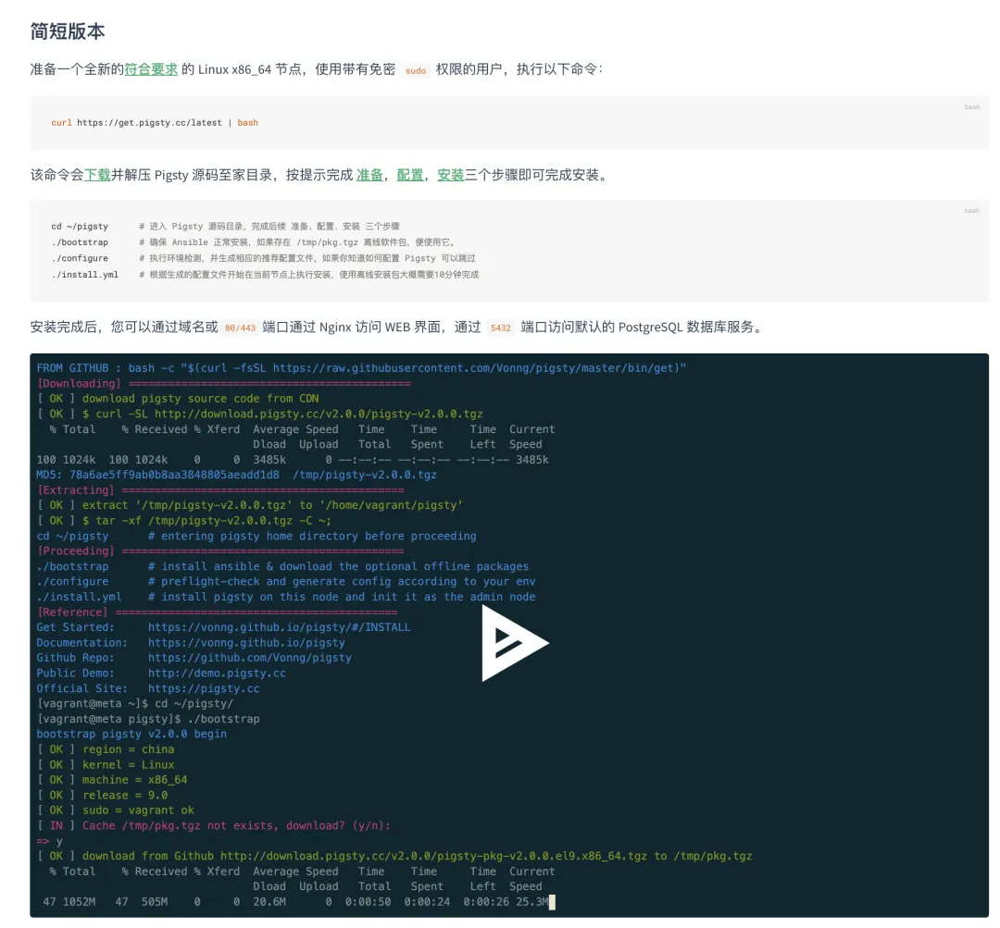

> 一键安装 Pigsty

在使用体验上，Deb系 支持的功能集与EL系几乎完全相同，唯一的例外是 supabase 及其使用的几个专用扩展还没有完成移植。除此之外， Deb 系还有一些独有的扩展插件，例如化学分子式扩展 `RDKit`，激光雷达点云数据扩展 `pointcloud` / 扩展距离函数包 `pg_similarity` （这两个给力扩展反向移植到 EL 了）。想要完整发挥 PostgresML + CUDA 的实力，更是非 Ubuntu 不可。

Pigsty 在自动配置过程中添加了 Debian / Ubuntu 系统的识别，单机安装时会自动使用对应的配置模板。Deb系的模板相比 EL系只有 8 个参数的默认值有区别 —— 因为两种发行版的包名是不一样的，所以像 `xx_packages` 的参数肯定是需要调整的。除此之外需要就只有 上游源 `repo_upstream` ，本地源 `node_repo_local_urls` ，以及默认的 `pg_dbsu_uid` 了（DEB包没有分配固定UID）。

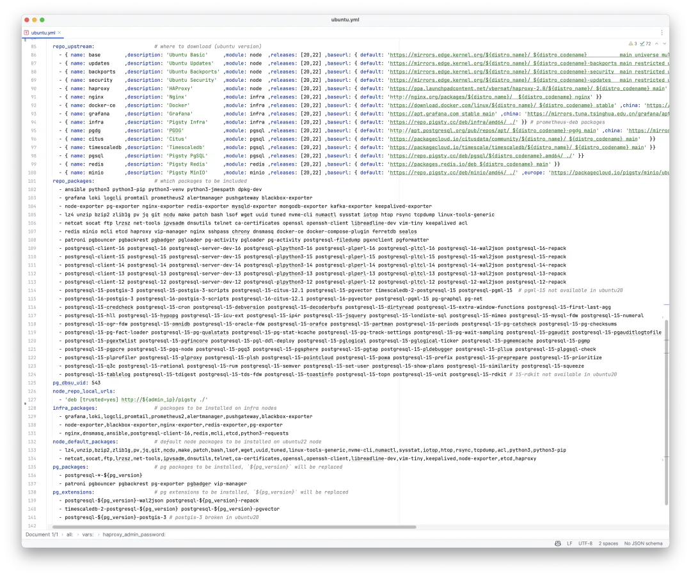

> Ubuntu 系统的声明式配置文件

这些参数通常都不需要用户来调整，所以在 Pigsty 使用流程上，Deb系可以说几乎没有任何区别了：实际上 Pigsty 的离线软件包构建模版就是这么工作的：一次性在七种不同的操作系统上完成完整的 Pigsty 安装，无需任何特殊处理。

------

## 新的扩展插件

Pigsty v2.5 收纳了几款用户呼声比较高的扩展插件。首当其冲的便是 **PostgresML**。尽管在上一个版本中，Pigsty 已经提供了在 EL8 / EL9 上使用 PostgresML 的能力，但搞 AI 的操作系统基本上都是清一色的 Ubuntu，最起码 CUDA 驱动装起来方便啊。

所以 Pigsty v2.5 中，您可以在 Ubuntu 上运行原生的 PostgresML 集群了。你不需要折腾什么 **NVIDIA Docker** 之类的东西，pip 安装好 python 依赖，直接起飞就可以。使用 SQL 训练模型，调用模型，让你的整个 AI 工作流都在数据库中完成！

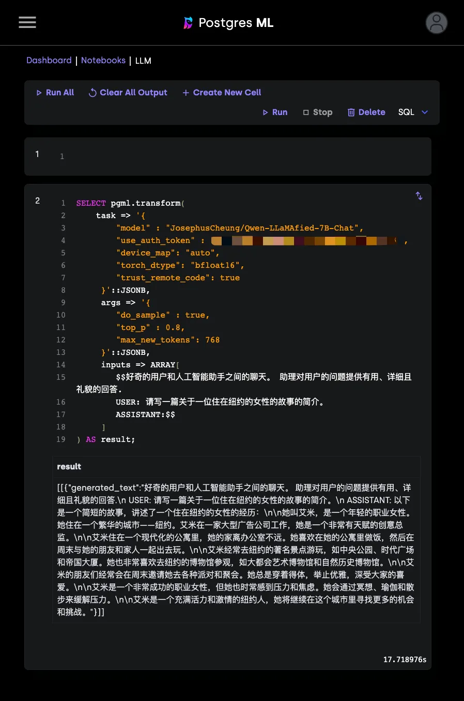

第二个值得一提的扩展插件是 `pointcloud`[1]。因为地理空间扩展 PostGIS 的存在，PostgreSQL 一直是自动驾驶/电车公司的心头好。而 PointCloud 则将 PostgreSQL 与 PostGIS 的力量推广到一个新的边界。激光雷达会不断扫描周围并生成所谓 “点云” 数据。`pointcloud` 插件提供了 PcPoint & PcPatch 两种数据类型与四十个功能函数，允许您对超高维度的点集进行高效存储、检索与运算。这个插件在 PGDG APT 源中原生提供，而 Pigsty 将其移植到了 EL 系统上，让所有系统的用户都可以用上。


`imgsmlr`[2] 则是一个以图搜图的插件。尽管现在已经有许多 AI 模型可以将图片编码成高维向量，使用 `pgvector` 进行语义搜索以图搜图。但 `imgsmlr` 最有趣的地方在于，它不需要任何外部依赖，可以直接在数据库内完成所有功能。用作者的说法是：我做这个插件的目的不是提供最先进的图像搜索方法，而是告诉你们如何编写一个 PostgreSQL 扩展，来干甚至是图像处理这种非典型的数据库任务。

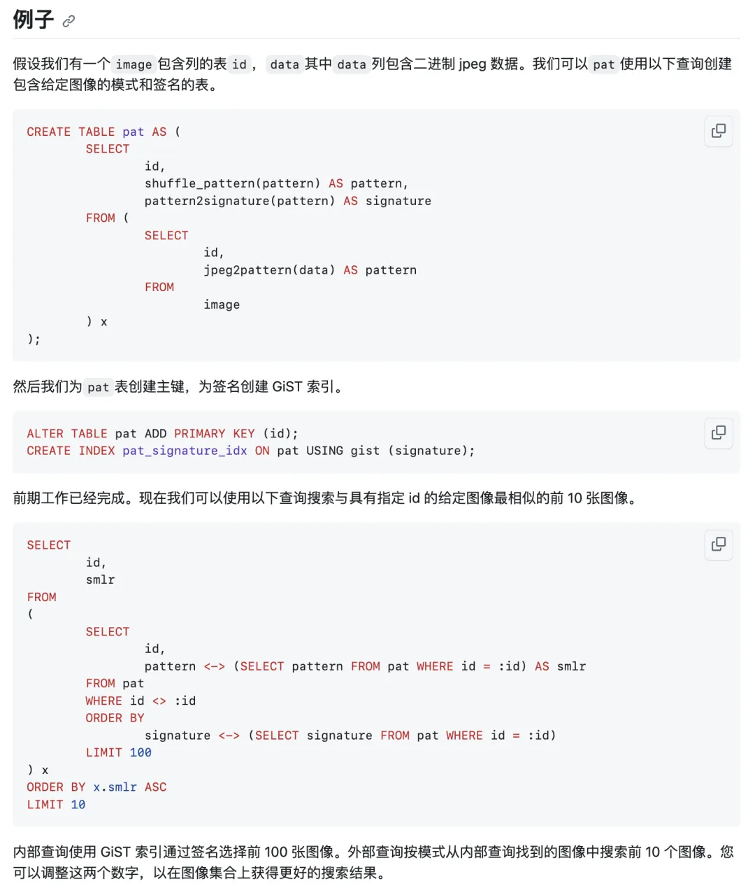

首先将 PNG/JPG 图片使用 Haar小波变换的方式处理为 16K 大小的模式与64字节的摘要签名，然后利用 GiST 索引检索摘要的方式来高效实现以图搜图。使用 `imgsmlr` 从4亿随机图片中召回最相似的10张大约耗时 600ms 。”

另一个有趣的扩展 `pg_similarity`[3] 默认在 Ubuntu/Debian 的 APT 源中提供，Pigsty 将其移植到了 EL 上。它提供了 17 种文本距离度量函数的高效 C 语言实现，极大丰富了检索排序的能力。另一个相关的插件是 `pg_bigm`，它类似 PG 自带的 `pg_trgm`，唯一的区别是用二字组替代三字组实现模糊检索，对中日韩语言的全文检索支持效果更好。

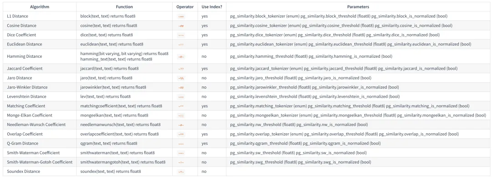

除此之外，我们还将 Supabase 的支持更新到最新版本：`20231013070755`。您可以在 EL8/EL9 系统上使用 Pigsty 提供的 PostgreSQL 数据库来自托管 Supabase。

算上 PostgreSQL 自带的扩展，Pigsty 2.5 支持的扩展插件已经达到了 150+。尽管有这么多的插件，但请注意，它们全都是 **选装项**。Pigsty 为所有 PostgreSQL 大版本都提供了 `pg_repack`，`wal2json`，`passwordcheck_cracklib` （EL）这几个重要的扩展，默认安装的三方扩展只有在线治理膨胀的 `pg_repack`。其他的扩展如果不安装，对现有系统不会产生任何额外的影响和负担。

------

## 监控系统调整

Pigsty v2.5 在监控系统上也进行了调整，将两年没升级的 `pg_exporter` 更新至了 `v0.6.0`，新增了TLS支持，修复了两个依赖组件的安全问题，打好了 ARM64 软件包并使用最新的指标定义文件。同时，在 `pg_query` 指标收集器中添加了与共享缓冲区 I/O 有关的四个指标，进一步丰富了 PGSQL Query 中提供的信息。

首先是新增的监控面板：PGSQL Patroni  ，提供了一个集群高可用状态的完整视图。对于分析历史服务健康状态，主从切换原因都大有帮助。

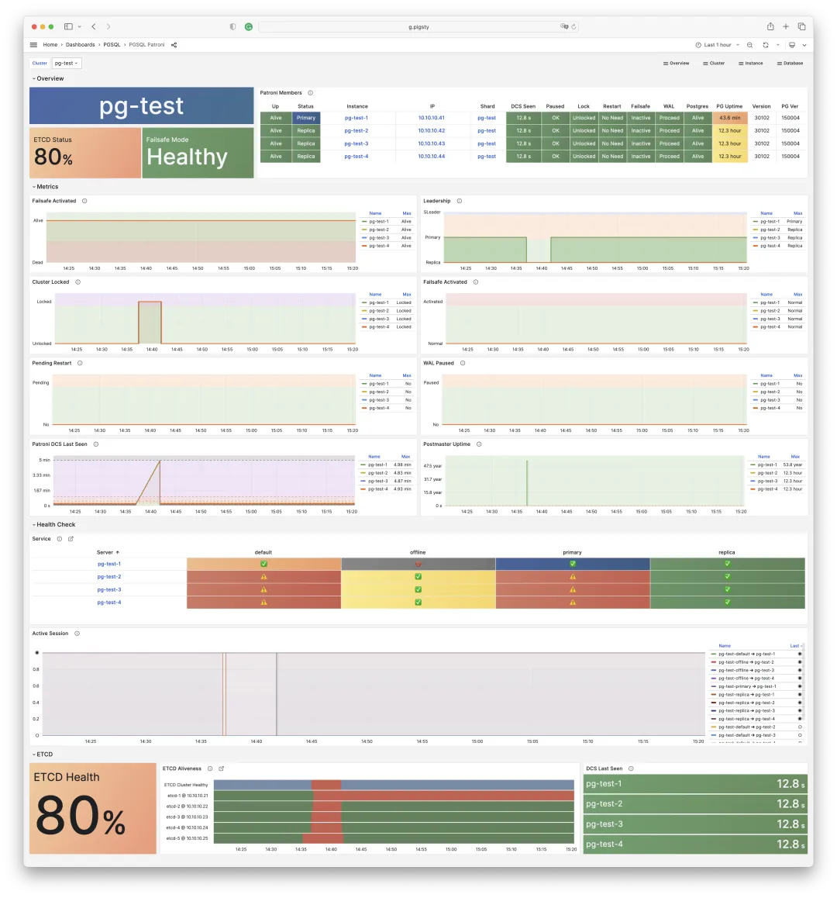

然后是 PGSQL Exporter，提供了 PG Exporter 和 Pgbouncer Exporter 自我监控的详细指标与日志。可以用于优化调整监控系统本身的性能。

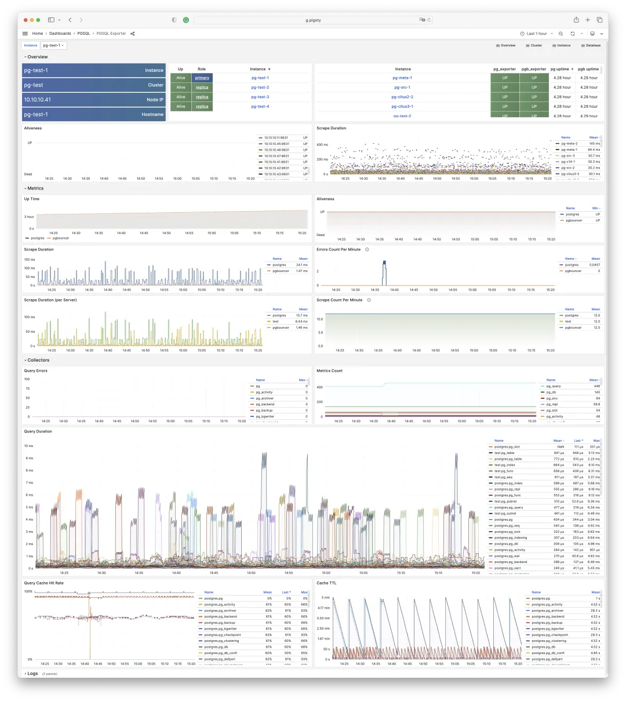

在各种监控大盘的组件导航面板中，都可以点击 Patroni Exporter 的指示块直接跳转到这些组件的详情页中：

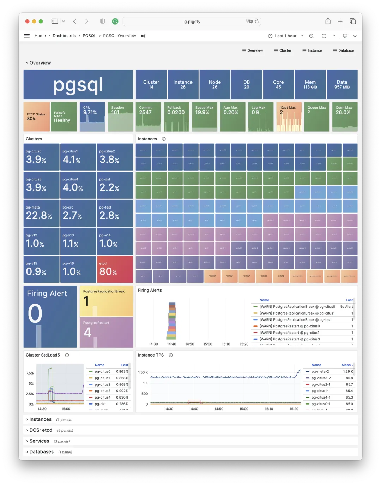

PGSQL Query 监控面板现在分为五栏：Overview 概览， 核心指标 QPS/RT，对时间微分指标，对调用次数的微分指标，百分比指标。遵循了宏观查询优化的方法论进行优化。

**减少资源消耗**：降低资源饱和的风险，优化CPU/内存/IO，通常以查询总耗时/总IO作为优化目标。使用 `dM/dt` ：指标 `M` 基于时间的微分，即每秒的增量。

**改善用户体验**：最常见的优化目标，在OLTP系统中，通常以降低查询平均响应时间作为优化目标。使用 `dM/dc`：指标 `M` 基于调用次数的微分，即每次调用的增量。

**平衡工作负载**：确保不同查询组之间的资源使用/性能表现的比例关系得当。使用 `M%`，即某一类查询指标占总数的比例。

PGSQL 首屏是最核心的查询性能指标：QPS 与 RT —— 以及它们的 1分钟，5分钟，15分钟均值，抖动情况与分布范围。

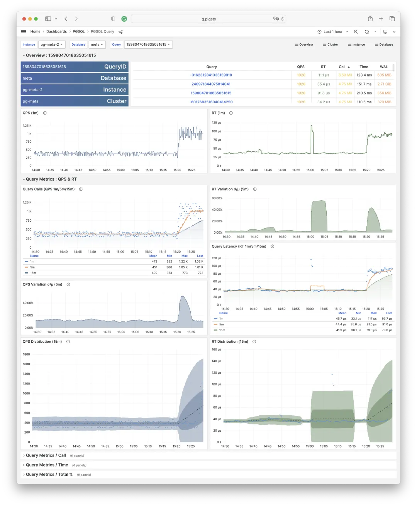

接下来，便是用于优化用户体验的 `dM/dc` 类指标，这里的M指标包括：

- 每次查询平均返回的行数
- 每次查询的平均执行时长
- 每次查询平均产生的WAL大小
- 每次查询平均耗费的 I/O 时间
- 每次查询平均读写的缓冲区块大小
- 每次平均访问/写脏的缓冲区块大小

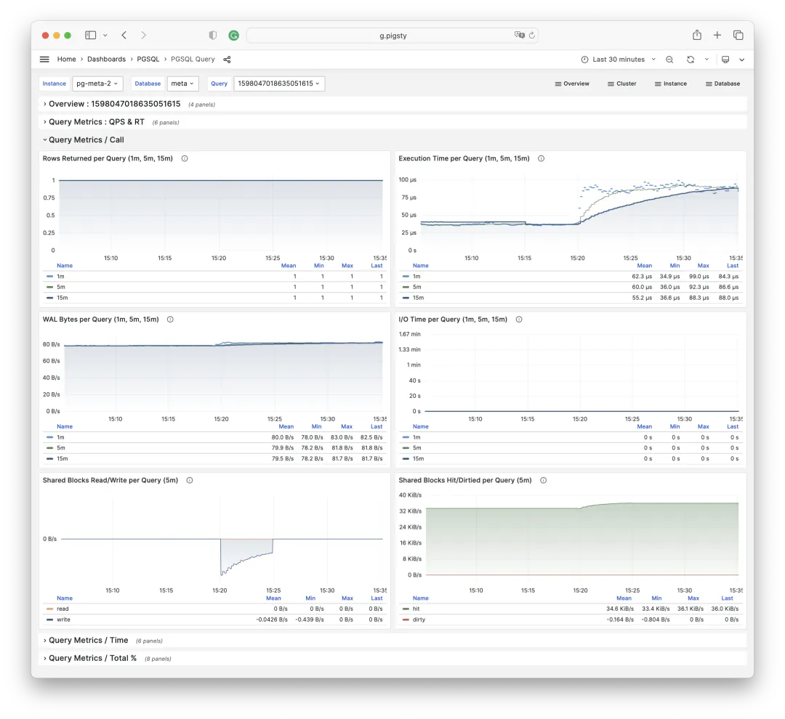

随后是用于 **减少资源消耗** 的 `dM/dt` 类指标，这里的M指标基本同上，不同之处在于它是针对时间的微分而不是针对调用次数的微分：

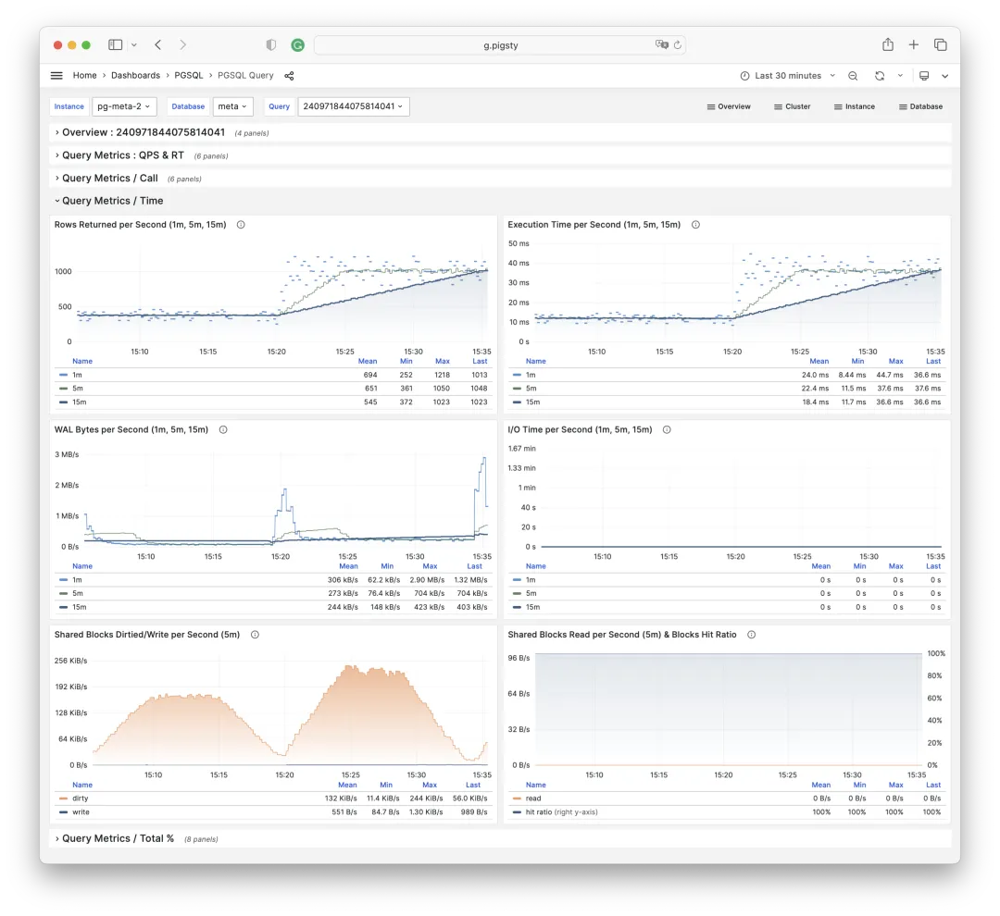

最后一栏中，我们展示了用于平衡工作负载的 %M 类指标。用于揭示这个特定查询组在整个工作负载中的比例与相对位置，标黑加粗显示，点击特定查询可以原地跳转查看另一组查询的性能表现，非常方便。

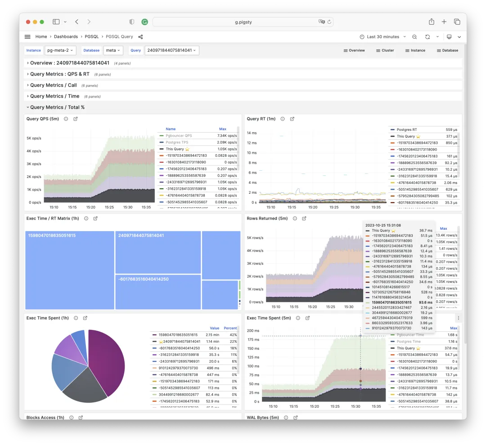

除了上面三个 Dashboard 之外，Pigsty 也对许多其他面板进行了优化改进与问题修复。许多面板的信息栏现在会提供更详细的信息：这个面板展现了什么指标，用于解决什么问题，等等等。我们也引入了三个新的 Grafana 插件用于支持 CSV/JSON 数据源，以及变量面板。

------

## 下个版本做点啥？

Pigsty 的下一个版本是 v2.6.0 ，除了进一步巩固 Ubuntu/Debian 的支持成熟度，这个版本的关注焦点将会关注两件事：MySQL 支持与命令行工具。

Pigsty 将提供基本的（主从，但没有HA） MySQL 安装部署支持，并提供基于 Grafana / Prometheus / MysqldExporter 的监控。因为 MySQL 5.7 将于本月 EOL，相信这样的能力会让更多的 MySQL 用户接触 PostgreSQL 并方便地迁移上来。

此外，我们还会进一步探索 Infra 组件容器化，调研使用 VictoriaMetrics 默认替换 Prometheus，或者使用 Vector 与 VictoriaLogs 替代 Loki与Promtail 的可行性。并设计一个更加好用的管控命令行工具 pigsty-cli，对 Greenplum 7.0 的部署提供正式支持，当这些任务都完成后，Pigsty 就将迎来第三个大版本 v3 了。

------

## 发布注记

[PGSQL x Pigsty: 数据库全能王来了](http://mp.weixin.qq.com/s?__biz=MzU5ODAyNTM5Ng==&mid=2247486215&idx=1&sn=52ce37a537336a6d07448f35c7bc4cfd&chksm=fe4b3edcc93cb7ca2dc87602430c2beb09ae5e7dcb568158541a1bd026e305d69d94cea81da4&scene=21#wechat_redirect)

[如何用Pigsty监控现有PostgreSQL (RDS/PolarDB/自建)？](http://mp.weixin.qq.com/s?__biz=MzU5ODAyNTM5Ng==&mid=2247486169&idx=1&sn=697ab3c172fe6cc28e12cff7297bb343&chksm=fe4b3f02c93cb614bbd1d5075120e074cebb5214d3a1a516363582bcee294e02bf5fd0e051ee&scene=21#wechat_redirect)

[Pigsty 特性与快速上手](http://mp.weixin.qq.com/s?__biz=MzU5ODAyNTM5Ng==&mid=2247486135&idx=1&sn=7d9c4920e94efba5d0e0b6af467f596c&chksm=fe4b3f6cc93cb67ac570d5280b37328aed392598b13df88545ff0a06f99630801fc999db8de5&scene=21#wechat_redirect)

[EL系操作系统发行版哪家强？](http://mp.weixin.qq.com/s?__biz=MzU5ODAyNTM5Ng==&mid=2247486256&idx=1&sn=15dd3001e9890e11144b42a84636d2e9&chksm=fe4b3eebc93cb7fd6f7710e84e8dc0daf7d0c05baf151aa1d24c6939915061ee1c58b0f54375&scene=21#wechat_redirect)

[临水照花看Ubuntu与Debian：Pigsty v2.5](http://mp.weixin.qq.com/s?__biz=MzU5ODAyNTM5Ng==&mid=2247486263&idx=1&sn=4288450c04a6fdbaf5e4fae385d42bd9&chksm=fe4b3eecc93cb7faf32a8c30ab78870f8ca607ad572e9d6725ac9f64c1549071c3d33a802019&scene=21#wechat_redirect)

[PostgreSQL：世界上最成功的数据库](http://mp.weixin.qq.com/s?__biz=MzU5ODAyNTM5Ng==&mid=2247485933&idx=3&sn=ea360aa7a59a4cd23ad5f9a9f415a0a0&chksm=fe4b3c36c93cb520bda4596136e927d7cf92c597a76c04077c256588b2428202bdb7f004c08b&scene=21#wechat_redirect)

[Pigsty 2.4：PG16支持，RDS监控与新扩展！](http://mp.weixin.qq.com/s?__biz=MzU5ODAyNTM5Ng==&mid=2247486118&idx=1&sn=5b67544e104fc4fbda1a18198252377b&chksm=fe4b3f7dc93cb66b1e075585e0c40da03813222f24c6877bedde334647aabdbe28918014360f&scene=21#wechat_redirect)

[Pigsty v2.3.1：HNSW版PGVECTOR来了！](http://mp.weixin.qq.com/s?__biz=MzU5ODAyNTM5Ng==&mid=2247486079&idx=1&sn=61e3010f6d717f042e91e06f3c8eeb4d&chksm=fe4b3fa4c93cb6b2732e5caf3524d8c7ff8d53e34e9400800a06b1d655e39ec40f69fe82ea70&scene=21#wechat_redirect)

[Pigsty v2.3 发布：应用生态丰富](http://mp.weixin.qq.com/s?__biz=MzU5ODAyNTM5Ng==&mid=2247486053&idx=1&sn=854966c3c4e2c96298173baaa2915535&chksm=fe4b3fbec93cb6a88669c698f7299bd4d38e9a691122831e72b9204fd35f94f4d0ac304812a6&scene=21#wechat_redirect)

[Pigsty v2.2 发布 —— 监控系统大升级](http://mp.weixin.qq.com/s?__biz=MzU5ODAyNTM5Ng==&mid=2247485827&idx=1&sn=9b13273b559fa63e96d4ac77268bd00a&chksm=fe4b3c58c93cb54e87b062c6db4b3a712037e25dbfbe69aa50ad9b79abf2c97967b625fe1a7f&scene=21#wechat_redirect)

[Pigsty v2.1 发布：向量扩展 / PG12-16 支持](http://mp.weixin.qq.com/s?__biz=MzU5ODAyNTM5Ng==&mid=2247485612&idx=1&sn=ce76d9439ed4f2ed10ee28c7aceb19cd&chksm=fe4b3d77c93cb46196eb97f7e04cbab1b2f2dee51324050ffc17583c22415f41a3656834fdcb&scene=21#wechat_redirect)

[Pigsty v2.0.2 更好的开源RDS替代：Pigsty](http://mp.weixin.qq.com/s?__biz=MzU5ODAyNTM5Ng==&mid=2247485327&idx=1&sn=0d02f5e504266e5dd436c64d23844735&chksm=fe4b3254c93cbb427598322952d654c3383bfe8858ec7ffaee2b9ca0c84bebe6f763748a356f&scene=21#wechat_redirect)

[Pigsty v2.0 发布，炮打 RDS](http://mp.weixin.qq.com/s?__biz=MzU5ODAyNTM5Ng==&mid=2247485349&idx=1&sn=96fde26dd9efd399ef7ae11e52e05843&chksm=fe4b327ec93cbb688e2708ff4e709a7ba32eee2be9d8637e9b941f47e6600dc7fcd2710a42c4&scene=21#wechat_redirect)

[Pigsty v2 正式发布：更好的RDS PG开源替代](http://mp.weixin.qq.com/s?__biz=MzU5ODAyNTM5Ng==&mid=2247485327&idx=1&sn=0d02f5e504266e5dd436c64d23844735&chksm=fe4b3254c93cbb427598322952d654c3383bfe8858ec7ffaee2b9ca0c84bebe6f763748a356f&scene=21#wechat_redirect)

[Pigsty v1.5.1发布](http://mp.weixin.qq.com/s?__biz=MzU5ODAyNTM5Ng==&mid=2247485155&idx=1&sn=9e8bfff6fab8967923a1603a0b55111f&chksm=fe4b3338c93cba2e9ac96e048e272265aca81fa30ba792fe5ad5a57f59e127e6eb19ea4d1286&scene=21#wechat_redirect)

[Pigsty v1.5 发布与新特性](http://mp.weixin.qq.com/s?__biz=MzU5ODAyNTM5Ng==&mid=2247485125&idx=1&sn=d06a14013aa02ecd1da307b4b3038054&chksm=fe4b331ec93cba08624adb70e626e4b45ede9ea5d8ae01fad779e82687ff0064c56bf9b42187&scene=21#wechat_redirect)

[Pigsty v1.4 正式发布！](http://mp.weixin.qq.com/s?__biz=MzU5ODAyNTM5Ng==&mid=2247484935&idx=1&sn=b904584f2df752e1cb603486f96d173f&chksm=fe4b33dcc93cbacabc130669ae52edf547e0cdf684bdd9910267f6be541fe54488ce90853b83&scene=21#wechat_redirect)

[Pigsty v1.4 前瞻](http://mp.weixin.qq.com/s?__biz=MzU5ODAyNTM5Ng==&mid=2247484904&idx=1&sn=5331785190ce704399295a7212e19989&chksm=fe4b3033c93cb925513b6192312be01d2065493d112b58682dda242e9fd0466d3b9bd473b28c&scene=21#wechat_redirect)

[Pigsty v1.3.1 安装教程](http://mp.weixin.qq.com/s?__biz=MzU5ODAyNTM5Ng==&mid=2247484847&idx=1&sn=c37f3c402cc9133ea616c295aa5482cf&chksm=fe4b3074c93cb9621876b7dc3a7906d2b217bcb1b0f44c09fb69fedc0a581a191465e9681bb1&scene=21#wechat_redirect)

[开箱即用的Redis发行版 —— Pigsty v1.3](http://mp.weixin.qq.com/s?__biz=MzU5ODAyNTM5Ng==&mid=2247484821&idx=1&sn=56e34b33f37b2555336591ad532ac7e7&chksm=fe4b304ec93cb9589c2bca821e5aaa1034c7dd5b9c580dec4b09ebe3b1ed20bb48df9dfd29ce&scene=21#wechat_redirect)

[Pigsty v1.2 发布](http://mp.weixin.qq.com/s?__biz=MzU5ODAyNTM5Ng==&mid=2247484799&idx=1&sn=bb4a87eba481c6851582899ae9955f10&chksm=fe4b30a4c93cb9b2ad9d68d837763bb1dd547c81d6ec04684ef98072ead8271695b9abba78d1&scene=21#wechat_redirect)

[Pigsty v1.1 发布/新功能介绍](http://mp.weixin.qq.com/s?__biz=MzU5ODAyNTM5Ng==&mid=2247484774&idx=1&sn=8b9e8f5bec8fb8492ebce3ebc6b60d88&chksm=fe4b30bdc93cb9ab1dfcaed066a1a90919027f6c72d63003b3b839eb9ba2871ec663db7469f1&scene=21#wechat_redirect)

[Pigsty v1正式发布：开箱即用的PostgreSQL开源发行版](http://mp.weixin.qq.com/s?__biz=MzU5ODAyNTM5Ng==&mid=2247484729&idx=1&sn=179c470fe4a80b22a8c2e96a3e191e6e&chksm=fe4b30e2c93cb9f4db6bb5e379b6fd5a489539e8e5db1e0080a1e7946d6f4eb83ad7647ce11d&scene=21#wechat_redirect)

### References

`[1]` `pointcloud`: *https://github.com/pgpointcloud/pointcloud*
`[2]` `imgsmlr`: *https://github.com/postgrespro/imgsmlr*
`[3]` `pg_similarity`: *https://github.com/eulerto/pg_similarity*
`[4]` Ubuntu: *https://github.com/Vonng/pigsty/blob/master/files/pigsty/ubuntu.yml*
`[5]` Debian: *https://github.com/Vonng/pigsty/blob/master/files/pigsty/debian.yml*
`[6]` `ubuntu.yml`: *https://github.com/Vonng/pigsty/blob/master/files/pigsty/ubuntu.yml*

----------------

## v2.5.0

```bash
curl https://get.pigsty.cc/latest | bash
```

**亮点特性**

- [Ubuntu](https://github.com/Vonng/pigsty/blob/master/files/pigsty/ubuntu.yml) / [Debian](https://github.com/Vonng/pigsty/blob/master/files/pigsty/debian.yml)  支持： bullseye, bookworm, jammy, focal
- 使用CDN `repo.pigsty.cc` 软件源，提供 rpm/deb 软件包下载。
- Anolis 操作系统支持（ 兼容 EL 8.8 ）。
- 使用 PostgreSQL 16 替代 PostgreSQL 14 作为备选主要支持版本
- 新增了 PGSQL Exporter / PGSQL Patroni 监控面板，重做 PGSQL Query 面板
- 扩展更新：
    - PostGIS 版本至 3.4（ EL8/EL9 ），EL7 仍使用 PostGIS 3.3
    - 移除 `pg_embedding`，因为开发者不再对其进行维护，建议使用 `pgvector` 替换。
    - 新扩展（EL）：点云插件 `pointcloud` 支持，Ubuntu原生带有此扩展。
    - 新扩展（EL）： `imgsmlr`， `pg_similarity`，`pg_bigm` 用于搜索。
    - 重新编译 `pg_filedump` 为 PG 大版本无关的软件包。。
    - 新收纳 `hydra` 列存储扩展，不再默认安装 `citus` 扩展。

- 软件更新：
    - Grafana 更新至 v10.1.5
    - Prometheus 更新至 v2.47
    - Promtail/Loki 更新至 v2.9.1
    - Node Exporter 更新至 v1.6.1
    - Bytebase 更新至 v2.10.0
    - patroni 更新至 v3.1.2
    - pgbouncer 更新至 v1.21.0
    - pg_exporter 更新至 v0.6.0
    - pgbackrest 更新至 v2.48.0
    - pgbadger 更新至 v12.2
    - pg_graphql 更新至 v1.4.0
    - pg_net 更新至 v0.7.3
    - ferretdb 更新至 v0.12.1
    - sealos 更新至 4.3.5
    - Supabase 支持更新至 `20231013070755`

**Ubuntu 支持说明**

Pigsty 支持了 Ubuntu 22.04 (jammy) 与 20.04 (focal) 两个 LTS 版本，并提供相应的离线软件安装包。

相比 EL 系操作系统，一些参数的默认值需要显式指定调整，详情请参考 [`ubuntu.yml`](https://github.com/Vonng/pigsty/blob/master/files/pigsty/ubuntu.yml)

- `repo_upstream`：按照 Ubuntu/Debian 的包名进行了调整
- `repo_packages`：按照 Ubuntu/Debian 的包名进行了调整
- `node_repo_local_urls`：默认值为 `['deb [trusted=yes] http://${admin_ip}/pigsty ./']`
- `node_default_packages` ：
    - `zlib` -> `zlib1g`, `readline` -> `libreadline-dev`
    - `vim-minimal` -> `vim-tiny`, `bind-utils` -> `dnsutils`, `perf` -> `linux-tools-generic`,
    - 新增软件包 `acl`，确保 Ansible 权限设置正常工作
- `infra_packages`：所有含 `_` 的包要替换为 `-` 版本，此外 `postgresql-client-16` 用于替换 `postgresql16`
- `pg_packages`：Ubuntu 下惯用 `-` 替代 `_`，不需要手工安装 `patroni-etcd` 包。
- `pg_extensions`：扩展名称与EL系不太一样，Ubuntu下缺少 `passwordcheck_cracklib` 扩展。
- `pg_dbsu_uid`： Ubuntu 下 Deb 包不显式指定uid，需要手动指定，Pigsty 默认分配为 `543`

**API变更**

默认值变化：

- `repo_modules` 现在的默认值为 `infra,node,pgsql,redis,minio`，启用所有上游源
- `repo_upstream` 发生变化，现在添加了 Pigsty Infra/MinIO/Redis/PGSQL 模块化软件源
- `repo_packages` 发生变化，移除未使用的 `karma,mtail,dellhw_exporter`，移除了 PG14 主要扩展，新增了 PG16 主要扩展，添加了 virtualenv 包。
- `node_default_packages` 发生变化，默认安装 `python3-pip` 组件。
- `pg_libs`: `timescaledb` 从 shared_preload_libraries 中移除，现在默认不自动启用。
- `pg_extensions` 发生变化，不再默认安装 Citus 扩展，默认安装 `passwordcheck_cracklib` 扩展，EL8,9 PostGIS 默认版本升级至 3.4

  ```yaml
  - pg_repack_${pg_version}* wal2json_${pg_version}* passwordcheck_cracklib_${pg_version}*
  - postgis34_${pg_version}* timescaledb-2-postgresql-${pg_version}* pgvector_${pg_version}*
  ```

- Patroni 所有模板默认移除 `wal_keep_size` 参数，避免触发 Patroni 3.1.1 的错误，其功能由 `min_wal_size` 覆盖。

```
87e0be2edc35b18709d7722976e305b0  pigsty-pkg-v2.5.0.el7.x86_64.tgz
e71304d6f53ea6c0f8e2231f238e8204  pigsty-pkg-v2.5.0.el8.x86_64.tgz
39728496c134e4352436d69b02226ee8  pigsty-pkg-v2.5.0.el9.x86_64.tgz
e3f548a6c7961af6107ffeee3eabc9a7  pigsty-pkg-v2.5.0.debian11.x86_64.tgz
1e469cc86a19702e48d7c1a37e2f14f9  pigsty-pkg-v2.5.0.debian12.x86_64.tgz
cc3af3b7c12f98969d3c6962f7c4bd8f  pigsty-pkg-v2.5.0.ubuntu20.x86_64.tgz
c5b2b1a4867eee624e57aed58ac65a80  pigsty-pkg-v2.5.0.ubuntu22.x86_64.tgz
```

----------------

## v2.5.1

跟进 PostgreSQL v16.1, v15.5, 14.10, 13.13, 12.17, 11.22 小版本例行更新。

现在 PostgreSQL 16 的所有重要扩展已经就位（新增 `pg_repack` 与 `timescaledb` 支持）

- 软件更新：
  - PostgreSQL to v16.1, v15.5, 14.10, 13.13, 12.17, 11.22
  - Patroni v3.2.0
  - PgBackrest v2.49
  - Citus 12.1
  - TimescaleDB 2.13
  - Grafana v10.2.0
  - FerretDB 1.15
  - SealOS 4.3.7
  - Bytebase 2.11.1

* 移除  PGCAT 监控面板中查询对 `monitor` 模式前缀（允许用户将 `pg_stat_statements` 扩展装到别的地方）
* 新的配置模板 `wool.yml`，为阿里云免费99 ECS 单机针对设计。
* 为 EL9 新增 `python3-jmespath` 软件包，解决 Ansible 依赖更新后 bootstrap 缺少 jmespath 的问题

```
31ee48df1007151009c060e0edbd74de  pigsty-pkg-v2.5.1.el7.x86_64.tgz
a40f1b864ae8a19d9431bcd8e74fa116  pigsty-pkg-v2.5.1.el8.x86_64.tgz
c976cd4431fc70367124fda4e2eac0a7  pigsty-pkg-v2.5.1.el9.x86_64.tgz
7fc1b5bdd3afa267a5fc1d7cb1f3c9a7  pigsty-pkg-v2.5.1.debian11.x86_64.tgz
add0731dc7ed37f134d3cb5b6646624e  pigsty-pkg-v2.5.1.debian12.x86_64.tgz
99048d09fa75ccb8db8e22e2a3b41f28  pigsty-pkg-v2.5.1.ubuntu20.x86_64.tgz
431668425f8ce19388d38e5bfa3a948c  pigsty-pkg-v2.5.1.ubuntu22.x86_64.tgz
```
