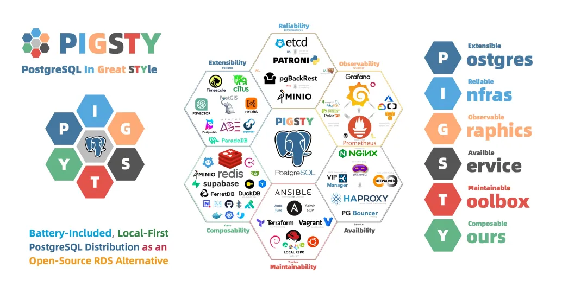
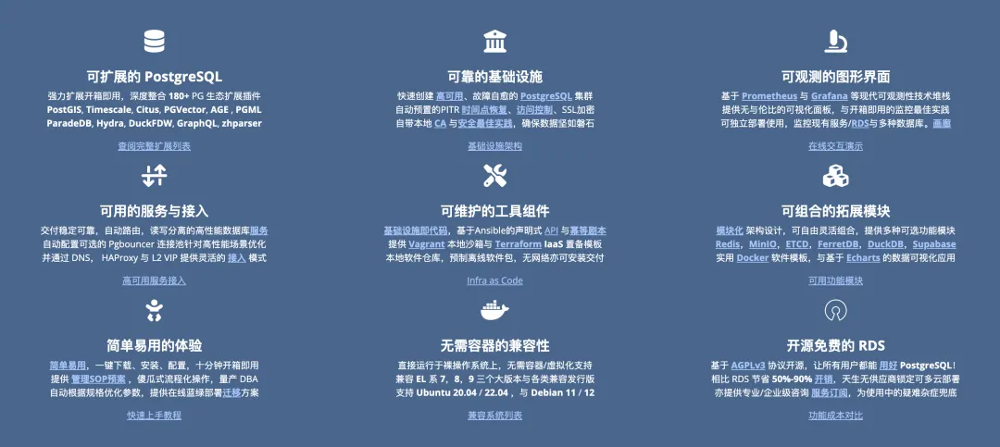
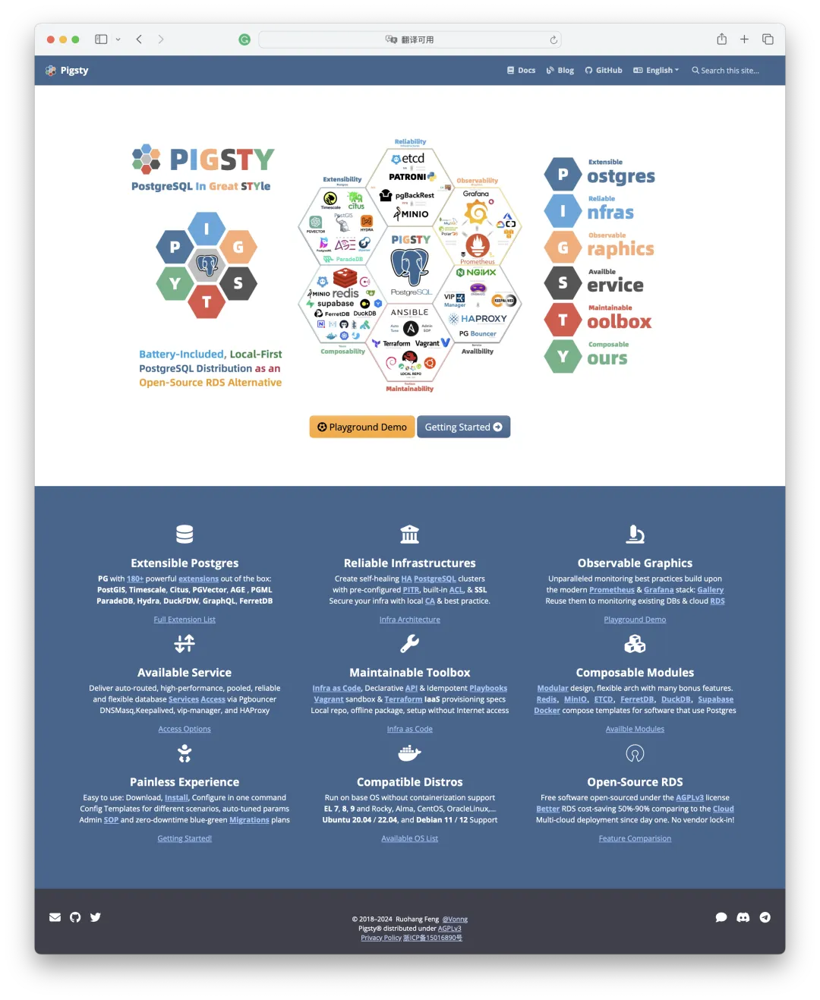
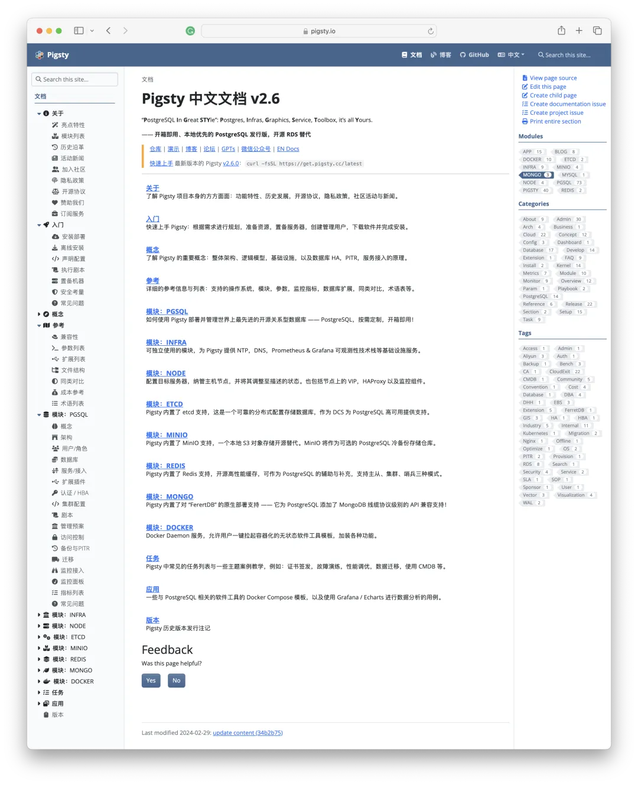
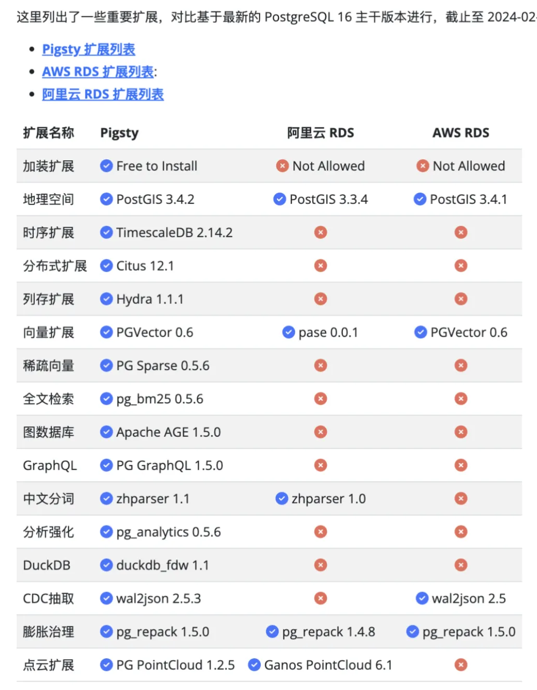
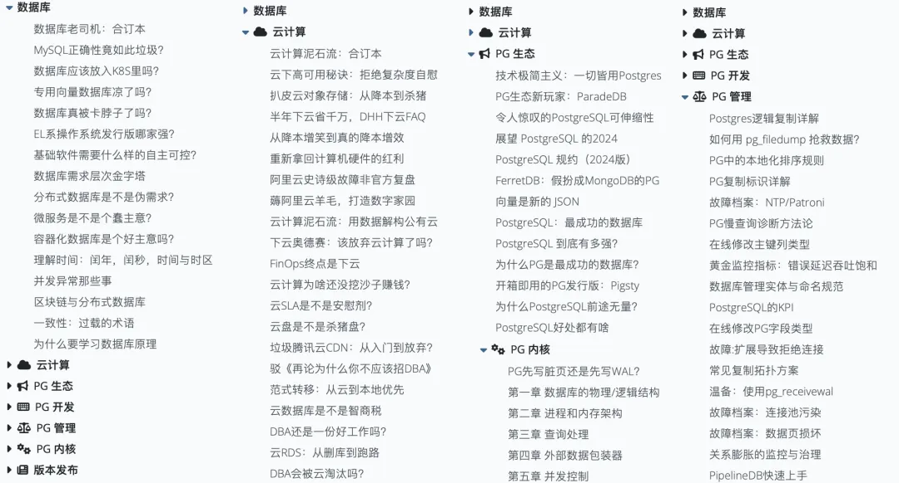
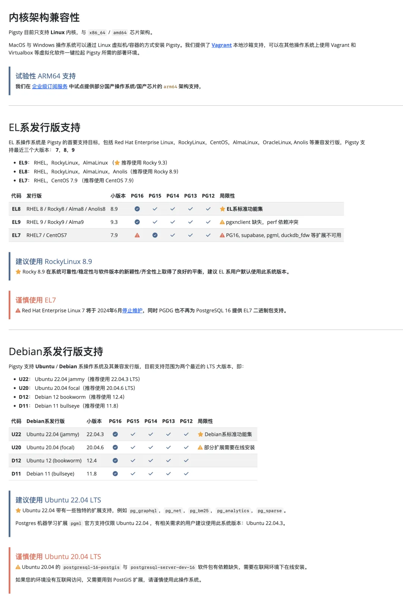
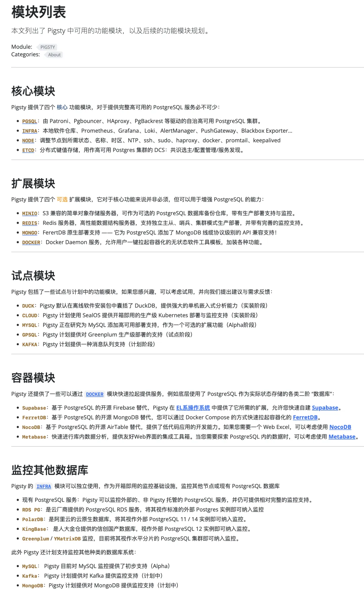
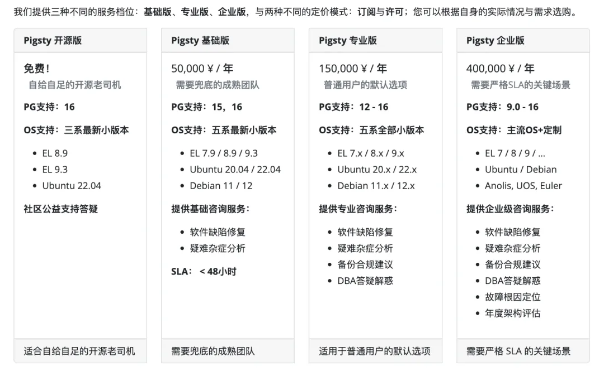
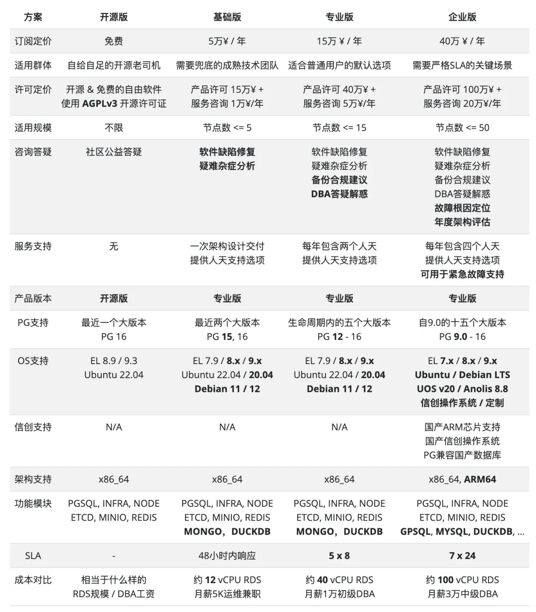

二月的最后一天里，Pigsty v2.6 正式发布了 🎉。这个版本正式使用 PostgreSQL 16  作为默认的大版本，并引入了一系列全新的扩展，包括 [**ParadeDB**](http://mp.weixin.qq.com/s?__biz=MzU5ODAyNTM5Ng==&mid=2247486913&idx=1&sn=3b7d8cf3f0e323932aba52c897f3c7a4&chksm=fe4b381ac93cb10cc6175c4c7978b5903946d369fe0084fbae5edf76ab08d84134260f28dffc&scene=21#wechat_redirect) 与 DuckDB ，让 PostgreSQL 的 OLAP 分析能力提高到一个全新的水准，喊一声 HTAP 标杆，数据库全能王当之无愧。

此外，我们还全面翻新了 Pigsty 官方网站、文档与博客，提出了更为凝练的六条核心价值主张。在全球范围内，我们使用了由 Cloudflare 支持的全新域名 **pigsty.io** 。作为默认的官方站地址与仓库地址。原有的 pigsty.cc 域名、网站、仓库继续在国内作为镜像提供服务。

最后，我们还正式推出了明码标价的 Pigsty 专业版与服务订阅，为那些需要更强支持力度的用户提供进阶功能与兜底选项。


------

## 分析性能史诗级加强

TPC-H 和 Clickbench 是分析领域的权威评测，Clickbench 上有许多 OLAP 数据库性能的横向对比，可以作为量化参考依据。例如在这个最有代表性的例子中，我们可以看到许多知名的数据库组件的相对性能表现（耗时越短越好）：


c6a.4xlarge, 500gb gp2 / 10亿条记录

在这张图表上我们标注出了 PostgreSQL 与生态扩展插件的性能表现。原生未经过调优的 PostgreSQL 耗时（**x1000**），调优后可以达到（**x47**），同时，PG生态还有三个与分析有关系的扩展：列存 **Hydra**（**x42**），时序扩展 **TimescaleDB**（**x103**），以及分布式扩展 **Citus**（**x262**）。但与专注于 OLAP 的第一梯队组件：Umbra，ClickHouse，Databend，SelectDB（**x3~x4**）相比仍然有十几倍的性能差距。然而最近出现的 [**ParadeDB**](http://mp.weixin.qq.com/s?__biz=MzU5ODAyNTM5Ng==&mid=2247486913&idx=1&sn=3b7d8cf3f0e323932aba52c897f3c7a4&chksm=fe4b381ac93cb10cc6175c4c7978b5903946d369fe0084fbae5edf76ab08d84134260f28dffc&scene=21#wechat_redirect) 和 **DuckDB** 的出现改变了这一点！

**ParadeDB** 提供的 PG 原生扩展 **pg_analytics** 实现了第二梯队（**x10**）的性能表现，与第一梯队的 OLAP 数据库只有 3～4 倍的性能差距。比起额外的好处来说：ACID，数据新鲜性，无需 ETL，额外学习成本，维护独立的新服务，（更别提它还提供了 ElasticSearch 质量的全文检索能力），这种性能差距通常是可以接受的。

而 **DuckDB** （**x3.2**）则把 OLAP 拔高到了一个全新高度 —— 抛开 Umbra 这种学术类研究数据库的用例，DuckDB 也许是 OLAP 实战性能最快的分析数据库。虽然说它并不是 PG 的扩展插件，但它是一个嵌入式组件，而 **DuckDB FDW** 以及 **pg_quack** 这样的项目能让 PostgreSQL 充分利用到 DuckDB 带来的完整分析性能红利！


来自 ParadeDB 创始人与 DuckdbFDW 作者的感谢致意


------

## 全新的价值主张

价值主张是数据库发行版的灵魂，在这个版本中，我们提出了**六条核心价值**，如下图所示：



这张图列出了 PostgreSQL 要解决的六个核心问题：Postgres 的可扩展性，基础设施的可靠性，图形化的可观测性，服务的可用性，工具的可维护性，以及扩展模块和三方组件可组合性。



Pigsty 的六条缩写正好构成 PIGSTY 首字母缩写 —— 除了 **P**ostgreSQL **i**n **G**reat **STY**le 之外，这六点价值主张提供了另外一种缩写解释：

> **P**ostgres, **I**nfras, **G**raphics, **S**ervice, **T**oolbox, **Y**ours.
>
> 你的图形化 Postgres 基础设施服务工具箱。

同时我们还重新设计了 Logo，从戴墨镜的装象猪头变成了六边形组合，配色正好是这些关键组件的颜色（PG蓝，ETCD青，Grafana橙，Ansible黑，Redis/MinIO 红，Nginx绿），是上图大六边形的一个浓缩精简版本。原来的墨镜小猪将作为 Pigsty 项目的吉祥物继续存在。


------

## 全新的网站

在这个版本中，我们重新翻修了老网站。使用了最新版本的 Docsy 作为文档框架，并更新调整了大量内容。我们放弃了花哨繁而不实的设计，直接把将 Pigsty 的价值主张与核心特性放在 Landing Page 上。



而真正的内容，都在文档目录里，我们重新梳理设计了文档的目录结构



当然，抛下了纯 Markdown 的执念后，我们也可以在文档内容中使用一些好看的样式与花活。



除了文档外，我们也整理了一下最近的文章纳入 Pigsty 博客。重新划分为六个专栏：云计算泥石流，数据库老司机，以及 PostgreSQL 的生态、开发、管理、内核四个板块。



与此同时， Pigsty 提供的软件源也有了全球的镜像仓库，由 Cloudflare R2 强力驱动。并托管在 Cloudflare 上，为全球用户都带来丝滑的访问体验（当然国内可以继续使用 pigsty.cc ）。


------

## PostgreSQL 16 成为默认版本

最后一个值得一提的特性是，在 Pigsty v2.6 中，PostgreSQL 16 (16.2) 正式取代先前的 PostgreSQL 15，成为默认的数据库大版本。

在三个月前的 《[Pigsty v2.5.1发布：PG16能打了吗？](http://mp.weixin.qq.com/s?__biz=MzU5ODAyNTM5Ng==&mid=2247486540&idx=1&sn=b14725207c993018836c4cf60d936ced&chksm=fe4b3997c93cb08185bb598ab5121238fc7dec371ff3cb0d99c99962f68d478f88a8485bccaa&scene=21#wechat_redirect)》 中，我们已经指出 PostgreSQL 的主要扩展插件已经就位，加上第二个小版本发布，可以上生产环境了。

而 Pigsty v2.6 正值 PostgreSQL 16.2 第三个小版本发布，Hydra，PGML，AGE 这几个重要扩展也跟进了 PG 16，所以我们决定，正式将默认的 PG 大版本升级为 16 ，而且将成为开源版唯一支持的 PG 大版本（EL7除外）。

因此，在这个版本中，我们做出的另一个重要的技术决策是：在开源版中移除了默认囊括的 PG 12 - 15 软件包与扩展。Pigsty 并非不支持 PG 12 - 15，只需要稍微调整配置文件，就可以轻松使用老版本的 PostgreSQL 扩展插件，只是我们不会再针对这些版本启用集成测试了（虽然在老版本的 Pigsty 里已经测试的很充分了）。



同理，我们也将开源版本的支持范围进一步收窄，缩小到 EL 8 / EL 9 与 Ubuntu 22.04 这三个使用范围最广的操作系统发行版上来。因为在 Pigsty 2.5 的时候，我们支持的是 PG 12 - 16 五个大版本乘以七个操作系统发行版，共 34 种排列组合，加上后续的 ARM 适配支持，给测试带来了很大压力。

让开源版聚焦于一个核心PG大版本与三个主流操作系统大版本，可以更好的利用研发带宽，满足最广大开源用户的使用需求。同理，这并不意味着 Pigsty 不能在老系统上用了，你依然可以在 EL7，Ubuntu 20.04，Debian 11/12 上丝滑运行，但我们不会为这些操作系统提供离线软件包，冒烟测试与支持了。

对于小众冷门操作系统系统与过时大版本的支持，并不是占总体绝大多数用户所需要的，却需要耗费许多额外的精力与成本，因此纳入了我们的付费商业支持中。

------

## 开源版与专业版划分

有一些开源用户反馈 —— 我并不需要那些和 PostgreSQL 关系不大的东西来拖慢下载安装速度并增加管理复杂度 —— 什么 Redis, MinIO, Docker, K8S，Supabase 之类的，虽然你觉得这些东西能给 PG 打辅助，但花里胡哨的东西只会拖慢我出刀的速度。

具体的功能切割方式还没有确定与落地，因此 2.6 也许是最后一个全功能的 Pigsty 开源版本。但基本原则是，开源版将保留所有的核心功能模块与PG扩展插件（PGSQL, INFRA, NODE, ETCD），而与 PostgreSQL 关系没有那么紧密的模块，在后续可能会作为专业版的内容提供。



在后面，Pigsty 开源版将专注于做好一件事 —— 提供可靠，高可用，可扩展的本地 PostgreSQL RDS 服务，当然像 Docker 模板这样的实用特性可能还是会留开源版中。

并不是说这些功能在开源版 Pigsty 里就没有了，我相信开源老师傅还是可以很轻松的仅仅通过修改配置文件就把它们重新弄出来，但这些功能不会成为开源版本的默认组成部分了。

------

## 商业订阅服务

开源是用爱发电的情怀事业，但要想让这条路走得更长，还需要商业的利益来浇灌。在这个版本中，我们正式推出了商业版本的 Pigsty，为有需要的用户提供更丰富的支持选项。

除了提供额外功能模块支持，Pigsty 专业订阅 还提供了咨询答疑与兜底服务。并且支持更为宽泛的操作系统与数据库版本，如下表所示：



尽管 Pigsty 本身的宗旨便是让用户拥有开箱即用的数据库服务，甚至还带有硬件故障自愈的 HA 和为软件/人为失误兜底的时间点恢复PITR。也许你拉起了它，一年、两年、三年都没有遇到任何问题 —— 从概率上讲这蛮正常的。

但数据库出了问题，通常都是大问题。用不好数据库，也容易发展成大问题。所以我们也会为付费用户提供专家咨询与服务，作为最终的疑难杂症兜底。（例子：我们[抢救过一个烤糊的，没有备份的 Gitlab 数据库](http://mp.weixin.qq.com/s?__biz=MzU5ODAyNTM5Ng==&mid=2247486234&idx=1&sn=d1273152e624fb31bf7be2c8f3991315&chksm=fe4b3ec1c93cb7d7ffd84c438746f3379fab6dc5b2ed98ae37d40538a4d064d6fefcb4e458a4&scene=21#wechat_redirect)）。与此同时，我们也可以提供[专业 PostgreSQL DBA 的咨询服务](http://mp.weixin.qq.com/s?__biz=MzU5ODAyNTM5Ng==&mid=2247486903&idx=1&sn=01c57499f41e8f51045bb8dd52586595&chksm=fe4b386cc93cb17a2d2fad903e809107162cc1e67e8ad7c8bfdd51de657c97f32f912cabe550&scene=21#wechat_redirect)。提供备份、安全、合规建议，管理开发最佳实践，性能评估与优化，设计建议与答疑解惑。



许多时候，化腐朽为神奇，能带来几个数量级改善的秘密就是专家的一句话。对于以可扩展性作为灵魂，扩展生态极度繁荣的 PostgreSQL 来说更是如此。我们的服务可以确保您的每一分钱都花得物有所值，并花在真正的刀刃上。

------

## 展望未来

Pigsty 的下一个大版本计划升级到 v3 ，将会正式落地开源版与专业版的功能划分。我们会在 Ubuntu / Debian 系操作系统中补完缺失的扩展 Deb 包，并提供一个命令行工具来封装管理操作。也许会将 Pigsty 本身打成一个 RPM / Deb 包提供，我们还计划提供 MYSQL 监控部署的 Beta 支持。

在监控系统上，我们会针对 PG 16 提供的 IO 指标重新调整 PostgreSQL 监控面板的样式。提供对 MySQL 的监控能力，尝试使用 Vector 作为日志收集组件 Promtail 的备选替换。我们已经有了针对[阿里云 RDS PG 与 PolarDB 的监控](http://mp.weixin.qq.com/s?__biz=MzU5ODAyNTM5Ng==&mid=2247486169&idx=1&sn=697ab3c172fe6cc28e12cff7297bb343&chksm=fe4b3f02c93cb614bbd1d5075120e074cebb5214d3a1a516363582bcee294e02bf5fd0e051ee&scene=21#wechat_redirect)，我们也计划在 v3.0 中提供对 AWS RDS 与 Aurora 的监控支持。

在基础设施建设上，我们会选择放弃“便宜”[腾讯云 CDN](http://mp.weixin.qq.com/s?__biz=MzU5ODAyNTM5Ng==&mid=2247485363&idx=1&sn=8622b25fd2309d4fc969d22964a04129&chksm=fe4b3268c93cbb7efb8757e876574bebf5d615bdd3c4ceb76e48b2bd907d78faeb450ca1e825&scene=21#wechat_redirect)，全面拥抱更可靠更快速且更便宜的 Cloudflare，为全球用户提供服务。腾讯云 CDN 也许可以作为国内的镜像站点，提供专业版的加速服务。

Pigsty 的产品与接口在 v2.6 和 v3.0 将会固化收敛，因为在产品与技术上，它已经做的足够好了！甚至在某些方面已经远超 RDS 了（比如扩展支持与监控系统！）所以接下来的工作终点会转移到营销与销售上来。开源项目的持续运营离不开用户与客户的支持，如果 Pigsty 帮助到了您，欢迎考虑赞助我们，或采购我们的服务订阅～。


----------------

## v2.6.0

**亮点特性**

* 现已将 PostgreSQL 16 作为默认主要版本（16.2）
* 新增 [ParadeDB](https://www.paradedb.com/) 扩展插件：`pg_analytics`, `pg_bm25`, and `pg_sparse`
* 新增 [DuckDB](https://duckdb.org/) 与 `duckdb_fdw` 插件支持
* 全球 Cloudflare CDN https://repo.pigsty.io 与中国大陆CDN https://repo.pigsty.cc

**软件配置变更**

- 使用 `node_repo_modules` 替换 `node_repo_method` 参数，并移除 `node_repo_local_urls` 参数。
- 暂时关闭 Grafana 统一告警功能，避免 "Database Locked" 错误。
- 新增 `node_repo_modules` 参数，用于指定在节点上添加的上游仓库源。
- 移除 `node_local_repo_urls`，其功能由 `node_repo_modules` & `repo_upstream` 替代。
- 移除 `node_repo_method` 参数，其功能由 `node_repo_modules` 替代。
- 在 `repo_upstream` 添加新的 `local` 源，并通过 `node_repo_modules` 使用，替代 `node_local_repo_urls` 的功能
- 重排 `node_default_packages`，`infra_packages`，`pg_packages`，`pg_extensions` 参数默认值。
- 在 `repo_upstream` 中替换 `repo_upstream.baseurl` 时，如果 EL8/9 PGDG小版本特定的仓库可用，使用 `major.minor` 而不是 `major` 替换 $releasever，提高小版本兼容性。

**软件版本升级**

- Grafana 10.3
- Prometheus 2.47
- node_exporter 1.7.0
- HAProxy 2.9.5
- Loki / Promtail 2.9.4
- minio-20240216110548 / mcli-20240217011557
- etcd 3.5.11
- Redis 7.2.4
- Bytebase 2.13.2
- DuckDB 0.10.0
- FerretDB 1.19
- Metabase：新Docker应用模板

**PostgreSQL扩展插件**

- PostgreSQL 小版本升级： 16.2, 15.6, 14.11, 13.14, 12.18
- PostgreSQL 16： 现在被提升为默认主版本
- pg_exporter 0.6.1：安全修复
- Patroni 3.2.2
- pgBadger 12.4
- pgBackRest 2.50
- vip-manager 2.3.0
- PostGIS 3.4.2
- TimescaleDB 2.14.1
- 向量扩展 PGVector 0.6.0：新增并行创建 HNSW 索引功能
- 新增扩展插件 [duckdb_fdw](https://github.com/alitrack/duckdb_fdw) v1.1 ，支持读写 DuckDB 数据 v1.1
- 新增扩展插件 [pgsql-gzip](https://github.com/pramsey/pgsql-gzip) ，用于支持 Gzip 压缩解压缩 v1.0.0
- 新增扩展插件 [pg_sparse](https://github.com/paradedb/paradedb/tree/dev/pg_sparse)，高效处理稀疏向量（ParadeDB） v0.5.6
- 新增扩展插件 [pg_bm25](https://github.com/paradedb/paradedb/tree/dev/pg_bm25)，用于支持高质量全文检索 BM25 算法的插件（ParadeDB） v0.5.6
- 新增扩展插件 [pg_analytics](https://github.com/paradedb/paradedb/tree/dev/pg_analytics)，支持 SIMD 与列式存储的PG分析插件（ParadeDB） v0.5.6
- 升级AIML插件 [pgml](https://github.com/postgresml/postgresml) 至 v2.8.1，新增 PG 16 支持。
- 升级列式存储插件 [hydra](https://github.com/hydradatabase/) 版本至 v1.1.1，新增 PG 16 支持。
- 升级图扩展插件 [age](https://github.com/apache/age) 至 v1.5.0，新增 PG 16 支持。
- 升级GraphQL插件 [pg_graphql](https://github.com/supabase/pg_graphql) 版本至 v1.5.0 ，支持 Supabase。


```
330e9bc16a2f65d57264965bf98174ff  pigsty-v2.6.0.tgz
81abcd0ced798e1198740ab13317c29a  pigsty-pkg-v2.6.0.debian11.x86_64.tgz
7304f4458c9abd3a14245eaf72f4eeb4  pigsty-pkg-v2.6.0.debian12.x86_64.tgz
f914fbb12f90dffc4e29f183753736bb  pigsty-pkg-v2.6.0.el7.x86_64.tgz
fc23d122d0743d1c1cb871ca686449c0  pigsty-pkg-v2.6.0.el8.x86_64.tgz
9d258dbcecefd232f3a18bcce512b75e  pigsty-pkg-v2.6.0.el9.x86_64.tgz
901ee668621682f99799de8932fb716c  pigsty-pkg-v2.6.0.ubuntu20.x86_64.tgz
39872cf774c1fe22697c428be2fc2c22  pigsty-pkg-v2.6.0.ubuntu22.x86_64.tgz
```