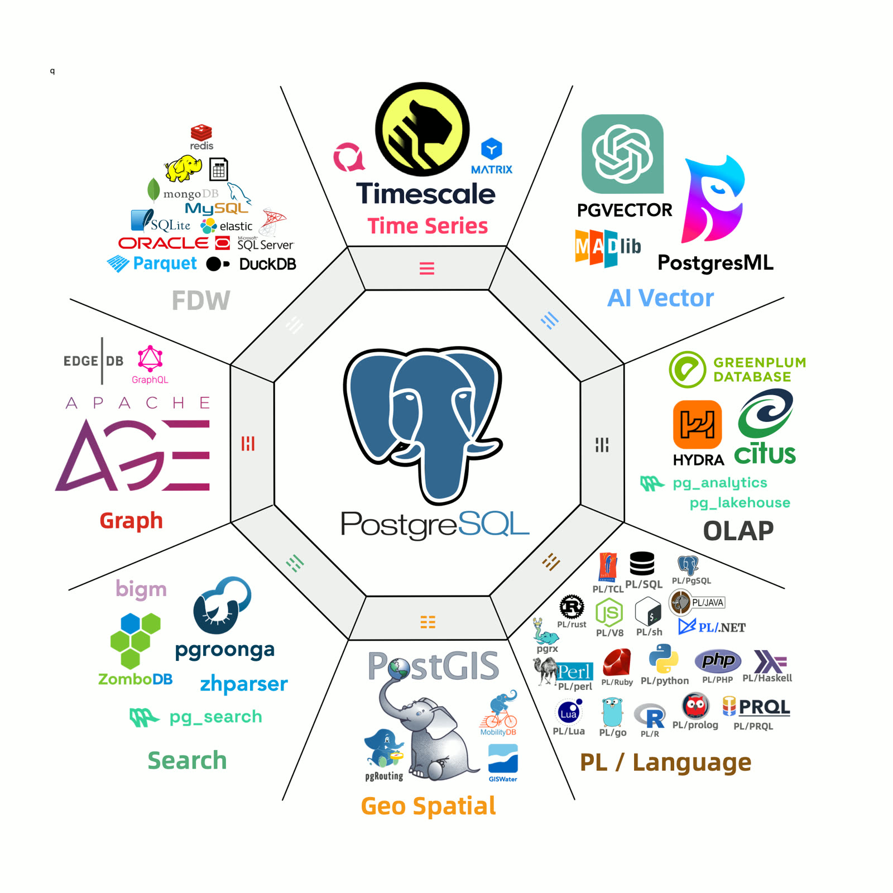
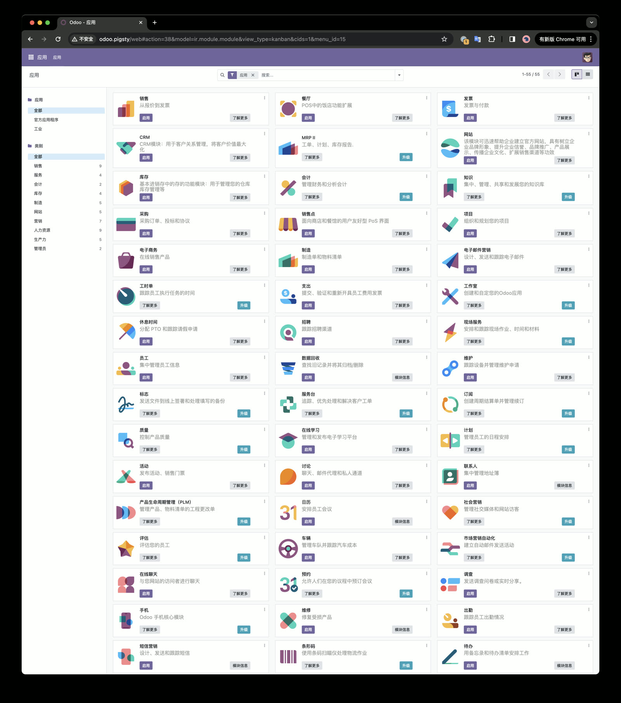
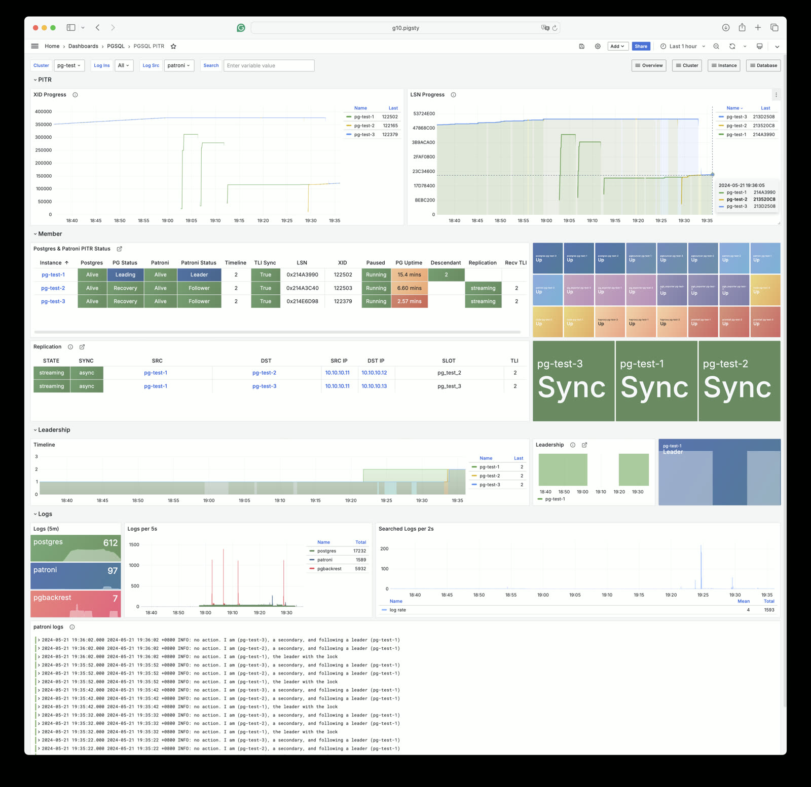

> [**GitHub Release**](https://github.com/pgsty/pigsty/releases/tag/v2.7.0) | [**发布注记**](https://pigsty.cc/docs/releasenote/#v270) | [微信公众号](https://mp.weixin.qq.com/s?__biz=MzU5ODAyNTM5Ng==&mid=2247487601&idx=1&sn=50a000140e8070a7f8c9171c0cf15acb&chksm=fe4b25aac93cacbc43f83bbde04a8f77bea86379acce81bd52b29b903e055d55d5f5c751ae22&scene=21#wechat_redirect)

[](https://github.com/pgsty/pigsty/releases/tag/v2.7.0)

2024-05-20，Pigsty v2.7 发布了。在这个版本中收录的可用扩展插件数量，达到了惊人的 **255** 个，成功让 PostgreSQL 的**全能性**又达到了一个全新高度！

同时，我们提供了一些新的 Docker 应用模板，例如开源的企业 ERP 软件全家桶 —— **Odoo**，**Jupyter** Notebook，并率先提供了 **Supabase** GA 版本的支持。
同时，我们还为后续容器版本的推出扫清了障碍；提供了帮助用户应付国产信创检查的方案 —— PolarDB 支持；并正式进行了专业版与开源版的产品功能区分。

- [扩展尽入吾彀中！](#扩展尽入吾彀中)
- [PG集异璧之大成](#pg集异璧之大成)
- [国产信创数据库？](#国产信创数据库？)
- [开箱即用的ERP](#开箱即用的erp)
- [PITR与监控面板](#pitr与监控面板)
- [专业版与开源版](#专业版与开源版)

------------

## 扩展尽入吾彀中

在《[PostgreSQL正在吞噬数据库世界](/blog/pg/pg-eat-db-world)》一文中，我抛出了一个观点：PostgreSQL 并不是一个简单的关系型数据库，而是一个数据管理的抽象框架，具有囊括一切，吞噬整个数据库世界的力量。

而 PG 之所以能做到这一点，除了**开源**、**先进**这两点外，真正的秘诀在于 **扩展** —— **极致可扩展性，与繁荣的扩展生态** 是 PostgreSQL 独一无二的特点，也是它从无数数据库中脱颖而出的法宝与秘诀。

因此，在 Pigsty v2.7 版本中，我们重新审视了整个 PostgreSQL 生态的所有扩展插件，将其中一些佼佼者收录其中，我们新收录的扩展如下：

| 扩展                                                                         |    版本     | 说明                                       |
|----------------------------------------------------------------------------|:---------:|------------------------------------------|
| [pg_jsonschema](https://github.com/supabase/pg_jsonschema)                 |   0.3.1   | 提供JSON Schema校验能力                        |
| [wrappers](https://github.com/supabase/wrappers)                           |   0.3.1   | Supabase提供的外部数据源包装器捆绑包                   |
| [duckdb_fdw](https://github.com/alitrack/duckdb_fdw)                       |    1.1    | DuckDB 外部数据源包装器 (libduck 0.10.2)         |
| [pg_search](https://github.com/paradedb/paradedb/tree/dev/pg_search)       |   0.7.0   | ParadeDB BM25算法全文检索插件，ES全文检索             |
| [pg_lakehouse](https://github.com/paradedb/paradedb/tree/dev/pg_lakehouse) |   0.7.0   | ParadeDB 湖仓分析引擎                          |
| [pg_analytics](https://github.com/paradedb/pg_analytics)                   |   0.6.1   | 加速 PostgreSQL 内部的分析查询处理                  |
| [pgmq](https://github.com/tembo-io/pgmq)                                   |   1.5.2   | 轻量级消息队列，类似于 AWS SQS 和 RSMQ.              |
| [pg_tier](https://github.com/tembo-io/pg_tier)                             |   0.0.3   | 支将将冷数据分级存储到 AWS S3                       |
| [pg_vectorize](https://github.com/tembo-io/pg_vectorize)                   |  0.15.0   | 在 PG 中实现 RAG 向量检索的封装                     |
| [pg_later](https://github.com/tembo-io/pg_later)                           |   0.1.0   | 现在执行 SQL，并在稍后获取结果                        |
| [pg_idkit](https://github.com/VADOSWARE/pg_idkit)                          |   0.2.3   | 生成各式各样的唯一标识符：UUIDv6, ULID, KSUID         |
| [plprql](https://github.com/kaspermarstal/plprql)                          |   0.1.0   | 在PostgreSQL使用PRQL——管线式关系查询语言             |
| [pgsmcrypto](https://github.com/zhuobie/pgsmcrypto)                        |   0.1.0   | 为PostgreSQL提供商密算法支持：SM2,SM3,SM4          |
| [pg_tiktoken](https://github.com/kelvich/pg_tiktoken)                      |   0.0.1   | 计算 OpenAI 使用的 Token 数量                   |
| [pgdd](https://github.com/rustprooflabs/pgdd)                              |   0.5.2   | 提供通过标准SQL查询数据库目录集簇的能力                    |
| [parquet_s3_fdw](https://github.com/pgspider/parquet_s3_fdw)               |   1.1.0   | 针对S3/MinIO上的Parquet文件的外部数据源包装器           |
| [plv8](https://github.com/plv8/plv8)                                       |   3.2.2   | PL/JavaScript (v8) 可信过程程序语言              |
| [md5hash](https://github.com/tvondra/md5hash)                              |   1.0.1   | 提供128位MD5的原生数据类型                         |
| [pg_tde](https://github.com/Percona-Lab/pg_tde)                            | 1.0-alpha | PostgreSQL 的实验性加密存储引擎。                   |
| [pg_dirtyread](https://github.com/df7cb/pg_dirtyread)                      |    2.6    | 从 PostgreSQL 表中读取未清理的死元组，用于脏读            |

这里面有许多使用 Rust 和 **pgrx** 开发的扩展插件，许多扩展都提供了非常强大的能力 —— 比如说：

------

Supabase 出品的 [**wrappers**](https://github.com/supabase/wrappers) 看上去是一个扩展，但它其实提供了一个用 Rust 编写 FDW 的插件，提供了对**十种**外部数据源的包装访问！

| FDW         | Description                                                                   | Read | Modify |
|-------------|-------------------------------------------------------------------------------|------|--------|
| HelloWorld  | A demo FDW to show how to develop a basic FDW.                                |      |        |
| BigQuery    | A FDW for Google [BigQuery](https://cloud.google.com/bigquery)                | ✅    | ✅      |
| Clickhouse  | A FDW for [ClickHouse](https://clickhouse.com/)                               | ✅    | ✅      |
| Stripe      | A FDW for [Stripe](https://stripe.com/) API                                   | ✅    | ✅      |
| Firebase    | A FDW for Google [Firebase](https://firebase.google.com/)                     | ✅    | ❌      |
| Airtable    | A FDW for [Airtable](https://airtable.com/) API                               | ✅    | ❌      |
| S3          | A FDW for [AWS S3](https://aws.amazon.com/s3/)                                | ✅    | ❌      |
| Logflare    | A FDW for [Logflare](https://logflare.app/)                                   | ✅    | ❌      |
| Auth0       | A FDW for [Auth0](https://auth0.com/)                                         | ✅    | ❌      |
| SQL Server  | A FDW for [Microsoft SQL Server](https://www.microsoft.com/en-au/sql-server/) | ✅    | ❌      |
| Redis       | A FDW for [Redis](https://redis.io/)                                          | ✅    | ❌      |
| AWS Cognito | A FDW for [AWS Cognito](https://aws.amazon.com/cognito/)                      | ✅    | ❌      |


这意味着，你现在可以用 PostgreSQL **读写** BigQuery, ClickHouse, 以及支付服务 Stripe 数据了。Firebase，Airtable，S3，Logflare，Auth0，SQL Server，Redis，Cognito 也提供了通过 PostgreSQL ，使用 SQL 读取的能力。

------

再比如 [**`plprql`**](https://prql-lang.org/) 扩展，提供了一种类似于 SQL 的全新数据库查询语言 PRQL：

```sql
from invoices
filter invoice_date >= @1970-01-16
derive {
  transaction_fees = 0.8,
  income = total - transaction_fees
}
filter income > 1
group customer_id (
  aggregate {
    average total,
    sum_income = sum income,
    ct = count total,
  }
)
sort {-sum_income}
take 10
join c=customers (==customer_id)
derive name = f"{c.last_name}, {c.first_name}"
select {
  c.customer_id, name, sum_income
}
derive db_version = s"version()"
```

同时，新加入 Pigsty 的 **plv8** 扩展，允许你使用 Javascript 在 PostgreSQL 中编写存储过程，PostgreSQL 的存储过程语言支持之丰富，实在是让人惊叹！


------

再比如说 **parquet_s3_fdw** ，看上去只是让你访问 S3 上存储的 Parquet 文件，但它的意义是 —— PG 可以成为真正的湖仓了 —— 等效于新增了一个没有存储容量限制的分析引擎！

构建在它基础上的 [**`pg_tier`**](https://github.com/tembo-io/pg_tier) ，更是提供了便利的分级冷存储功能 —— 你可以将 PG 中很少访问的海量冷存储，用 SQL 轻松归档到 S3 / MinIO 上去！

如果您觉得仅仅是 Parquet 太不过瘾，那么由 ParadeDB 提供的 [**`pg_lakehouse`**](https://github.com/paradedb/paradedb/tree/dev/pg_lakehouse)，则把这件事拔高到了一个新高度 —— 你现在可以直接将PG作为湖仓使用，读取 S3 / MinIO / 本地文件系统上的 Parquet，CSV，JSON，Avro，DeltaLake，以及 后续的 ORC 格式文件，用于湖仓数据分析！

```sql
CREATE EXTENSION pg_lakehouse;
CREATE FOREIGN DATA WRAPPER s3_wrapper HANDLER s3_fdw_handler VALIDATOR s3_fdw_validator;

-- Provide S3 credentials
CREATE SERVER s3_server FOREIGN DATA WRAPPER s3_wrapper
OPTIONS (region 'us-east-1', allow_anonymous 'true');

-- Create foreign table
CREATE FOREIGN TABLE trips (
    "VendorID"              INT,
    "tpep_pickup_datetime"  TIMESTAMP,
    "tpep_dropoff_datetime" TIMESTAMP,
    "passenger_count"       BIGINT,
    "trip_distance"         DOUBLE PRECISION,
    "RatecodeID"            DOUBLE PRECISION,
    "store_and_fwd_flag"    TEXT,
    "PULocationID"          REAL,
    "DOLocationID"          REAL,
    "payment_type"          DOUBLE PRECISION,
    "fare_amount"           DOUBLE PRECISION,
    "extra"                 DOUBLE PRECISION,
    "mta_tax"               DOUBLE PRECISION,
    "tip_amount"            DOUBLE PRECISION,
    "tolls_amount"          DOUBLE PRECISION,
    "improvement_surcharge" DOUBLE PRECISION,
    "total_amount"          DOUBLE PRECISION
)
SERVER s3_server
OPTIONS (path 's3://paradedb-benchmarks/yellow_tripdata_2024-01.parquet', extension 'parquet');

-- Success! Now you can query the remote Parquet file like a regular Postgres table
SELECT COUNT(*) FROM trips;
  count
---------
 2964624
(1 row)
```

当然，同样由 ParadeDB 出品的 **pg_analytics** 与 **pg_search** 扩展也非常值得一提，前者提供了第一梯队的分析性能，而后者提供了 ElasticSearch BM25 全文检索能力的的 PG 替代品。

此外，Tembo 也提供了四个使用 Rust 编写的实用 PG 扩展，例如，他们出品的 **pgmq** 就可以在 PG 上提供一个轻量的消息队列 API，类似于 AWS 的 SQS 与 RSMQ，作为 **pgq** 的替代与补充。

------

在 AI 人工智能方向上，[**pgvector**](https://github.com/pgvector/pgvector) 0.7 引入了重大的升级，现在支持稀疏向量（让 **pg_sparse** 原地退役了！），支持 **half** **float** 量化，向量最大维度翻倍到了 **4000** 维，添加了 **binary** 量化模式（维度可达 64K ），添加了两种新的距离度量与相应的索引。最重要的是，现在还支持用 SIMD 指令了，性能相比一年前有了翻天覆地的改善！

> - Added halfvec type
> - Added sparsevec type
> - Added support for indexing bit type
> - Added support for indexing L1 distance with HNSW
> - Added binary_quantize function
> - Added hamming_distance function
> - Added jaccard_distance function
> - Added l2_normalize function
> - Added subvector function
> - Added concatenate operator for vectors
> - Added CPU dispatching for distance functions on Linux x86-64
> - Updated comparison operators to support vectors with different dimensions

> [v0.7 changelog](https://github.com/pgvector/pgvector/blob/master/CHANGELOG.md)


当然，还有其他一些 AI 相关的扩展插件，例如 **pg_vectorize** 可以帮助你封装实现一个 RAG 服务，新的 **pg_tiktoken** 可以帮助你在 PG 中，计算调用 OpenAI 模型时所需的 Token 数量。此外，**pg_similarity** 可以提供17种额外的距离度量函数，**imgsmlr** 可以提供图片相似度处理函数, **bigm** 可以提供基于二元组的全文检索支持, **zhparser** 可以提供中文分词能力。

------

在新的数据类型支持上，**md5hash** 允许你直接高效存储 128 位的 MD5 摘要，而不是一长串字符文本。 **pg_idkit** 允许你在数据库中直接生成十多种不同类型的 ID 方案（UUIDv6, UUIDv7, nanoid, ksuid, ulid, Timeflake, PushID, xid, cuid, cuid 等），**rrule** 扩展更是允许你在数据库中存储、解析、处理“日历重复事件”这一神奇的数据类型。

------

此外，还有一些扩展，能在数据库管理上提供帮助。**pgdd** 允许你直接使用 SQL ，管理与访问 PG 的数据库目录，**pg_later** 允许你异步执行 SQL 命令并取回结果。**pg_dirtyread** 允许你进行脏读，读取尚未被垃圾回收的数据，进行数据抢救，**pg_show_plans** 可以显示出当前正在运行查询的执行计划！

在加密能力上，**pg_tde** 扩展提供了一个实验性的PG透明加密的存储引擎，用于确保即使你的硬盘被人拔了，数据也不会泄漏。 **pgsmcrypto** 则为 PostgreSQL 提供了 “国产数据库” 的商密算法（SM2,3,4）支持。

------

## PG集异璧之大成

加上 [以前的扩展](https://mp.weixin.qq.com/s/y3qY9eBfOic6tQYOiErIHg)，在 Pigsty v2.7 中，在所有操作系统上可用的 PG 扩展数量达到了 **255** 个之多。
我们可以自豪地说，在整个 PostgreSQL 生态中，没有一个发行版或者服务提供商，能达到我们的收录的这个扩展数量：



在EL系操作系统上，总共有 **230** 个可用的 RPM 扩展插件，其中包括 73 个 PG 自带的扩展和 157 个第三方扩展，其中由 Pigsty 维护的占 34 个。
在 Debian 与 Ubuntu 系操作系统上，总共有 **189** 个可用的 DEB 扩展插件，其中包括 73 个 PG 自带的扩展和 116 个第三方扩展，其中由 Pigsty 维护的占 10 个。

> 完整的扩展列表，请参考 [**扩展列表**](https://pigsty.cc/zh/docs/ref/extension)

所有的扩展，被我们按照功能与用途分为了 **11** 个大类，方便用户根据主题选用：

| 类目     | 扩展                                                                                                                                                                                                                   |
|:-------|:---------------------------------------------------------------------------------------------------------------------------------------------------------------------------------------------------------------------|
| TYPE   | pg_uuidv7, pgmp, semver, timestamp9, uint, roaringbitmap, unit, prefix, md5hash, ip4r, asn1oid, pg_rrule, pg_rational, debversion, numeral, pgfaceting                                                               |
| GIS    | pointcloud, pgrouting, h3, address_standardizer_data_us, postgis_tiger_geocoder, postgis_topology, postgis_raster, postgis_sfcgal, address_standardizer, postgis, h3_postgis, pointcloud_postgis, geoip, mobilitydb  |
| SHARD  | pg_fkpart, pg_partman, plproxy, citus                                                                                                                                                                                |
| TEST   | pgtap, faker, dbt2                                                                                                                                                                                                   |
| SEARCH | pg_bigm, pg_search, zhparser                                                                                                                                                                                         |
| ETL    | pg_bulkload, wal2json, pg_fact_loader, decoderbufs                                                                                                                                                                   |
| REPL   | pglogical_origin, pglogical, repmgr, londiste, mimeo, pglogical_ticker                                                                                                                                               |
| SEC    | pgaudit, pgsodium, anon, passwordcracklib, supabase_vault, pgauditlogtofile, set_user, login_hook, pgcryptokey, pg_jobmon, logerrors, pg_auth_mon, pgsmcrypto, pg_tde, credcheck, table_log, pg_snakeoil             |
| OLAP   | pg_lakehouse, duckdb_fdw, citus_columnar, parquet_s3_fdw, columnar, pg_analytics, timescaledb, pg_tier                                                                                                               |
| FUNC   | count_distinct, pgsql_tweaks, tdigest, topn, pgjwt, pg_net, extra_window_functions, http, gzip, pg_later, pg_idkit, pg_background, pgpcre, first_last_agg, icu_ext, q3c, pg_sphere                                   |
| FDW    | hdfs_fdw, mysql_fdw, pgbouncer_fdw, mongo_fdw, sqlite_fdw, tds_fdw, ogr_fdw, oracle_fdw, multicorn, db2_fdw, wrappers                                                                                                |
| LANG   | plpgsql_check, plsh, pllua, plr, plluau, pldbgapi, plv8, plprql, pg_tle, pljava, hstore_plluau, hstore_pllua, omnidb_plpgsql_debugger                                                                                |
| SIM    | orafce, pg_extra_time, pgmemcache, pg_dbms_job, mysqlcompat, pg_dbms_metadata, pg_dbms_lock                                                                                                                          |
| ADMIN  | pg_readonly, pg_squeeze, pgfincore, pgl_ddl_deploy, prioritize, ddlx, pgagent, pg_repack, pg_cron, pgpool_recovery, pgpool_regclass, pgpool_adm, pg_dirtyread, pgdd, pgautofailover, safeupdate, toastinfo           |
| STAT   | pg_permissions, pg_qualstats, pg_stat_kcache, pg_stat_monitor, pg_track_settings, pg_wait_sampling, plprofiler, powa, pgexporter_ext, system_stats, pg_store_plans, pgmeminfo, pg_profile, pg_show_plans, pg_statviz |
| AI     | pg_tiktoken, imgsmlr, svector, pg_similarity, pgml, vectorize, vector                                                                                                                                                |
| FEAT   | periods, pg_ivm, jsquery, hll, pgtt, rum, pg_hint_plan, age, temporal_tables, table_version, pg_graphql, pgq, pgmq, pg_strom, pg_jsonschema, hypopg, emaj, pgq_node, pre_prepare, rdkit                              |

这些扩展之间，许多都可以相互组合使用，产生协同效应，产生 1+1 >> 2 的神奇效果。

正如 TimescaleDB CEO Ajay 在 《[为什么PostgreSQL是未来数据的基石？](/blog/pg/pg-for-everything)》 一文中所述，**PostgreSQL 正在成为事实上的数据库标准**。

通过极致可扩展性的魔法，PostgreSQL **集异璧之大成**，做到了守正出奇，实现了主干极致稳定性与功能敏捷性的统一**。**扎实的基本盘配上惊人的演进速度，让它成为了数据库世界中的一个异数，彻底改变了数据库世界的游戏规则。

时至当下，PostgreSQL 已是不可挡。而 Pigsty 让 PostgreSQL 如虎添翼，插上一对起飞的翅膀。

-----------------

## 国产信创数据库？

在中国做数据库赛道，绕不开的一个问题就是“**国产化**”与“信创”。关于这个主题，我已经写过很多文章深入探讨过了：

- 《[基础软件需要什么样的自主可控？](https://mp.weixin.qq.com/s/hWbcc9cMM9qTjPJ0m6G0Kg)》
- 《[国产数据库到底能不能打？](https://mp.weixin.qq.com/s/AqcYpOgVj91JnkB1B3s4sA)》
- 《[国产数据库是大炼钢铁吗？](https://mp.weixin.qq.com/s/aLXC7f2iYUfATNWsnyotkA)》
- 《[中国对PostgreSQL的贡献约等于零吗？](https://mp.weixin.qq.com/s/79_PnX-a5iSfDMgz_VUx5A)》
- 《[EL系操作系统发行版哪家强？](https://mp.weixin.qq.com/s/xHG8OURTYlmnQTorFkzioA)》

我的观点是：整个国产信创数据库行业完全基于一个事实上根本不成立的假设 —— 所谓 “数据库卡脖子” 的风险。在开源的 PostgreSQL 面前，所谓卡脖子是个伪命题
—— 如果被欧美严厉制裁的俄国企业们数据库没有崩溃，中国也完全可以同样拿 PG 做同样的事，而不是弄出一堆换皮魔改或土法炼钢的劣质轮子出来。

许多国产数据库都是这样的：企业花点钱买一套“国产xxx”放在那里，上面来检查了，就拿出来糊弄一下，实际上该用啥还是继续用啥（我要给这种务实的态度点个赞！👍）
但是很多时候，即使客户想要用的就是原生 PG，但没有一块 “**国产**” 的牌子，确实是很难走立项采购流程的，我们就有一些客户面临这样让人头大的难题。

不过大部分用户也不愿意当傻狍子和冤大头，许多有国产化要求的企业都是这样的：花点钱买一套“国产xxx”放在那里，上面来检查了，就拿出来糊弄一下，实际上该用啥还是继续用啥（我要给这种务实的态度点个赞！👍） 
但是很多时候，即使客户想要用的就是原生 PG，但没有一块 “**国产**” 的牌子，确实是很难走立项采购流程的，我们就有一些客户面临这样让人头大的难题。

因此，我们想了一个绝妙的折衷办法 —— PolarDB for PostgreSQL。根据 【[安全可靠测评结果公告（2023年第1号）](http://www.itsec.gov.cn/aqkkcp/cpgg/202312/t20231226_162074.html)】，附表三、集中式数据库：
PolarDB 属于自主可控，安全可靠的国产信创数据库。（中国信息安全测评中心-产品测评公告，证书编号：[CNITSEC2022I&OE0047](http://www.itsec.gov.cn/cp/cpcpgg/202205/t20220510_107153.html)）

| 中国信息安全测评中心-产品测评公告 |                       |
|-------------------|-----------------------|
| 证号：               | CNITSEC2022I&OE0047   |
| 发证日期：             | 2022-04-26            |
| 截至时间：             | 2025-04-25            |
| 产品名称：             | 阿里云PolarDB V2.0内核核心模块 |
| 厂商：               | 阿里云计算有限公司             |
| 认证级别：             | 自主原创                  |
| 认证评价：             |                       |

最妙的是，PolarDB PG 是开源的。所以 Pigsty 提供了对 PolarDB PG 的完整监控支持，以及使用 Docker 进行部署的能力，可以帮助客户快速拉起一个“国产数据库”稻草人，无论是应付检查，还是作为立项采购的名头，都非常好用！
而且相对于其他那些过时落后，魔改的亲妈都不认识的杂种 PG 国产库，PolarDB 的含 P 量很高，所以如果想用，真的是可以拿来当成一个 PG 11 用起来的。

最后说点实际的，如果你问我，有什么功能是“国产数据库”有，而 PostgreSQL 没有的，我还真知道一个 —— 所谓的 “商密” 算法。最主要的是三个：
用于替代 RSA 的 SM2 算法，用于替代 MD5/SHA 的 SM3 算法，用于替代 DES/AES 的 SM4 算法。但现在，原生的 PostgreSQL 也可以通过 `smcrypto` 扩展插件也可以提供商密算法支持了！


-----------------

## 开箱即用的ERP

与 “国产数据库” 类似，许多国产 ERP 软件也是处在一个很尴尬的位置上，因为已经有一个足够好的开源 ERP 系统了 —— **Odoo** （原名 OpenERP）。

不少 Pigsty 的用户是拿着 PG 去跑 Odoo 的，这引起了我的好奇，于是我也混入了 Odoo 社区学习，也自己搭了一套试了一把，确实非常牛逼，要是早点试试这么好的东西，就不去折腾什么土法建站了。


> Odoo 插件非常多，功能强大远超我想象，堪称企业应用全家桶大王。

作为开源免费的软件，Odoo靠高级扩展插件收钱，这个订阅价格也不算贵。要是一分都不想花，Odoo社区也提供了这些高级扩展插件的免费开源平替版本… —— 高级付费插件（比如财务模块）也有社区开源版！



Odoo 使用，且仅使用了 PostgreSQL 作为数据存储。整套 ERP 软件，只需要一个 PG 数据库，一个 Docker 镜像就可以搞定了！堪称是 PostgreSQL 杀手级应用的典范。

作为一个 PostgreSQL 发行版，我没理由不去支持 Odoo。因此在 Pigsty v2.7 中提供了一个 Docker Compose 模板，可以一键拉起 Odoo。你还可以复用 Pigsty 提供的基础设施，轻松通过 Nginx 对外暴露 Web 服务，提供 HTTPS 接入。

最后能实现的效果是，在一台裸虚拟机上，你只需要几行命令就可以拉起生产质量的企业级 ERP 系统！关于 Odoo ，后面我会专门出一期教程，介绍如何利用 Pigsty 自建 ERP 系统。


-----------------

## PITR与监控面板

像 Odoo 这样的 ERP 系统，对数据库的要求与传统互联网行业非常不一样。例如：我在 Odoo 社区看到了如下对话：“*我的 Odoo 已经用了好几年了，现在 PostgreSQL 里的数据量已经到 2.5GB 了*”，下面朋友回复 —— “*那真的是非常大了！*”

2.5 GB的数据量，对于互联网规模的应用来说简直是微不足道。但是对于一个 ERP 系统来说，这已经是一个非常大的数据库了。比起性能 & 高可用，像 ERP 这样的系统更关注的是数据完整性与机密性，很多时候，也就是拿一台服务器就跑起来了，不要 HA，只要有备份与 **时间点恢复** （PITR） 就行。

Pigsty 已经提供了开箱即用的 PITR ，允许用户回滚到任意时间点。但是这个过程所需的信息和反馈却散落在监控系统中的不同角落中，因此在 Pigsty v2.7 中，Pigsty 提供了一个专用的监控面板 PGSQL PITR，用于提供 PITR 时间点回复过程的上下文。



后面，我们会专门出一期教程，介绍如何利用 Pigsty 的 [**PITR**](/docs/concept/pitr) 功能，实现企业级的数据备份与恢复。


-----------------

## 开源版与专业版

在 《[Pigsty v2.6：PostgreSQL 踢馆 OLAP](https://mp.weixin.qq.com/s/NlNGwUXZPa058ZDk_tdtew)》 中，我已经提到过我们将区分 Pigsty 开源版与 [专业版](/docs/about/service/)。

在 Pigsty v2.7 中，我们将开源版支持的操作系统发行版收敛到 Redhat, Debian, Ubuntu 这三个主干上来。我们提供 PostgreSQL 16 在 EL8, Debian12, Ubuntu22.04 的第一类支持，并提供可以无需互联网进行安装的开源版离线软件包。
当然，EL7, EL9, Debian11, Ubuntu20.04 这些系统还是可以继续使用 Pigsty 的，但是不会有离线软件包，只能通过联网安装的模式进行首次部署。

| **Pigsty 开源版** | **Pigsty 基础版** | **Pigsty 专业版** | **Pigsty 企业版** |
|:---:|:---:|:---:|:---:|
| **开源免费！** | **50,000 ¥ / 年** | **150,000 ¥ / 年** | **400,000 ¥ / 年** |
| 自给自足的开源老司机 | 或 5,000 ¥/月 | 或 15,000 ¥/月 | 或 40,000 ¥/月 |
| PG支持：16 | PG支持：15，16 | PG支持：12 - 16 | PG支持：9.0 - 16 |
| OS支持：三系主力版本 | OS支持：五系最新小版本 | OS支持：五系全部小版本 | OS支持：按需定制 |
| EL 8.9 / Debian 12 / Ubuntu 22.04 | EL 7.9/8.9/9.3, Ubuntu 20.04/22.04, Debian 11/12 | EL 7.x/8.x/9.x, Ubuntu 20.x/22.x, Debian 11.x/12.x | EL, Debian, Ubuntu, 云上Linux, 国产OS与ARM |
| 功能：核心模块 | 功能：所有模块 | 功能：所有模块 | 功能：所有模块 |
| SLA：无 | SLA：工作日时效内响应 | SLA：5 x 8 (<4h) | SLA：7 x 24 (紧急on-call) |
| 社区公益支持答疑 | 提供基础咨询服务 | 提供专业咨询服务 | 提供企业级咨询服务 |

Pigsty 专业版与开源的区别主要在于兼容性与功能模块，例如 PostgreSQL 大版本支持范围，操作系统大版本支持范围，芯片架构支持范围。 

在原本的功能设计中，开源版将只包括 INFRA, NODE, PGSQL, ETCD 四个与 PostgreSQL 服务紧密关联的核心模块，我纠结了很久是否要将 MinIO, Redis, FerretDB (Mongo), 以及 Docker 四个 **扩展模块** 划到专业版中，但最终还是决定将其保留在开源版里 —— 因为它们已经开源了，没道理再阉割掉。
但是与 PostgreSQL 相关性不大的其他模块以及后续的新功能模块，例如 Greenplum，MySQL，DuckDB，Kafka，Mongo, SealOS (Cloud) 都一定会划归专业版中。

在兼容性上，Pigsty 专业版将提供 PG完整生命周期 12 - 16 五个大版本，在七个主力大版本与其兼容系统上的支持，专业版采用按需定制的方式，交付专业版源码包，以及用户所需操作系统精准小版本的全功能离线软件安装包，包含所有生命周期内 PG 大版本的所有可用扩展插件。
另外，在这个版本中，我们自己维护了完整的 ARM64 Prometheus & Grafana 软件源，也可以在专业版中提供 Arm64 的芯片架构支持了，如果有需要跑在 arm 服务器，或者 “国产芯片” 上，这是一个不错的特性。

总的来说，Pigsty v2.7 的开源/专业版区分，在不影响开源用户使用体验的前提下，又给了企业用户一个充分的付费理由 ；）。


-----------------

## 展望未来

总的来说， Pigsty 已经达到我心目中比较理想的状态了。在功能上，它已经做的足够好了！在某些方面已经远超 RDS 了（比如扩展支持与监控系统）。

但正所谓，酒香也怕巷子深 —— 所以接下来的工作重点会更多地转移到运营、营销、销售上去。开源项目的持续运营离不开用户与客户的支持，如果 Pigsty 帮助到了您，欢迎考虑赞助我们，或采购我们的服务订阅～。

当然，说起运营 —— 就在下周，也就是五月28号，我将去温哥华参加 2024 PostgreSQL 开发者大会，a.k.a 第一届 PGConf.Dev （以前叫 PG Con）。共同探讨 PostgreSQL 的未来，并更进一步地把 Pigsty 推向全球！


----------------

## v2.7.0 发布注记

**亮点特性**

新增了大量强力扩展插件，特别是一些使用 `rust` 与 `pgrx` 进行开发的强力扩展：

- [pg_search](https://github.com/paradedb/paradedb/tree/dev/pg_search) v0.7.0：使用 BM25 算法对 SQL 表进行全文搜索
- [pg_lakehouse](https://github.com/paradedb/paradedb/tree/dev/pg_lakehouse) v0.7.0：在对象存储（如 S3）和表格式（如 DeltaLake）上进行查询的引擎
- [pg_analytics](https://github.com/paradedb/pg_analytics) v0.6.1：加速 PostgreSQL 内部的分析查询处理
- [pg_graphql](https://github.com/supabase/pg_graphql) v1.5.4：为 PostgreSQL 数据库提供 GraphQL 支持
- [pg_jsonschema](https://github.com/supabase/pg_jsonschema) v0.3.1：提供 JSON Schema 校验的 PostgreSQL 扩展
- [wrappers](https://github.com/supabase/wrappers) v0.3.1：由 Supabase 提供的 PostgreSQL 外部数据封装器集合
- [pgmq](https://github.com/tembo-io/pgmq) v1.5.2：轻量级消息队列，类似于 AWS SQS 和 RSMQ
- [pg_tier](https://github.com/tembo-io/pg_tier) v0.0.3：支将将冷数据分级存储到 AWS S3
- [pg_vectorize](https://github.com/tembo-io/pg_vectorize) v0.15.0: 在 PG 中实现 RAG 向量检索的封装
- [pg_later](https://github.com/tembo-io/pg_later) v0.1.0：现在执行 SQL，并在稍后获取结果
- [pg_idkit](https://github.com/VADOSWARE/pg_idkit) v0.2.3：生成多种流行类型的标识符（UUID）
- [plprql](https://github.com/kaspermarstal/plprql) v0.1.0：在 PostgreSQL 中使用 PRQL 查询语言
- [pgsmcrypto](https://github.com/zhuobie/pgsmcrypto) v0.1.0：PostgreSQL 的国密 SM 算法扩展
- [pg_tiktoken](https://github.com/kelvich/pg_tiktoken) v0.0.1：计算 OpenAI 使用的 Token 数量
- [pgdd](https://github.com/rustprooflabs/pgdd) v0.5.2：通过纯 SQL 接口，访问数据目录的元数据

当然，也有一些使用原生 C 和 C++ 开发的强力扩展：

- [parquet_s3_fdw](https://github.com/pgspider/parquet_s3_fdw) 1.1.0：从 S3 存取 Parquet 格式文件，作为湖仓之用
- [plv8](https://github.com/plv8/plv8) 3.2.2：使用 V8 引擎，允许在 PostgreSQL 中使用 Javascript 语言编写存储过程
- [md5hash](https://github.com/tvondra/md5hash) 1.0.1：用于存储原生MD5哈希数据类型，而非文本。
- [pg_tde](https://github.com/Percona-Lab/pg_tde) 1.0 alpha：PostgreSQL 的实验性加密存储引擎。
- [pg_dirtyread](https://github.com/df7cb/pg_dirtyread) 2.6：从 PostgreSQL 表中读取未清理的死元组，用于脏读
- 新的 deb PGDG 扩展：`pg_roaringbitmap`, `pgfaceting`, `mobilitydb`, `pgsql-http`, `pg_hint_plan`, `pg_statviz`, `pg_rrule`
- 新的 rpm PGDG 扩展：`pg_profile`, `pg_show_plans`, 使用 PGDG 的 `pgsql_http`, `pgsql_gzip`, `pg_net`, `pg_bigm` 替代 Pigsty 维护的 RPM。

**新特性**

- 允许 Pigsty 在特定 Docker 虚拟机镜像中运行。
- 针对 Ubuntu 与 EL 系操作系统发行版准备了 INFRA & PGSQL 模块的 arm64 软件包
- 新安装脚本，可从 cloudflare 下载软件，可以指定版本，提供更完善的提示信息。
- 新增的 PGSQL PITR 监控面板，用于在 PITR 过程中提供更好的可观测性
- 针对在 Docker 虚拟机镜像中运行 Pigsty 进行了一系列铺垫与准备。
- 新增了 [防呆设计](https://github.com/Vonng/pigsty/issues/402)，避免在非 Pigsty 纳管的节点上运行 pgsql.yml 剧本 （[AdamYLK](https://github.com/AdamYLK)）
- 针对每个支持的发行版大版本配置了独立的配置文件：el7, el8, el9, debian11, debian12, ubuntu20, ubuntu22

**Docker应用模板**

- [Odoo](https://github.com/Vonng/pigsty/tree/master/app/odoo)：开源 ERP 软件与插件
- [Jupyter](https://github.com/Vonng/pigsty/tree/master/app/jupyter)：使用容器运行 Jupyter Notebook
- [PolarDB](https://github.com/Vonng/pigsty/tree/master/app/polardb)：运行“国产数据库” PolarDB，应付信创检查！
- [supabase](https://github.com/Vonng/pigsty/tree/master/app/supabase)：更新至最近的 GA 版本
- [bytebase](https://github.com/Vonng/pigsty/tree/master/app/bytebase)：使用 `latest` 标签替代特定版本号。
- [pg_exporter](https://github.com/Vonng/pigsty/tree/master/app/pg_exporter)：更新了 Docker 镜像的例子。

**软件版本升级**

- **PostgreSQL 16.3**
- Patroni 3.3.0
- pgBackRest 2.51
- VIP-Manager v2.5.0
- Haproxy 2.9.7
- Grafana 10.4.2
- Prometheus 2.51
- Loki & Promtail: 3.0.0 (警告：大版本非兼容性变更！)
- Alertmanager 0.27.0
- BlackBox Exporter 0.25.0
- Node Exporter 1.8.0
- pgBackrest Exporter 0.17.0
- duckdb 0.10.2
- etcd 3.5.13
- minio-20240510014138 / mcli-20240509170424
- pev2 v1.8.0 -> v1.11.0
- **pgvector** 0.6.1 -> 0.7.0
- pg_tle: v1.3.4 -> v1.4.0
- hydra: v1.1.1 -> v1.1.2
- duckdb_fdw: v1.1.0 重新针对 libduckdb 0.10.2 进行编译
- pg_bm25 0.5.6 -> pg_search 0.7.0
- pg_analytics: 0.5.6 -> 0.6.1
- pg_graphql: 1.5.0 -> 1.5.4
- pg_net 0.8.0 -> 0.9.1
- pg_sparse (deprecated)


**缺陷修复**

- 修复了 pg_exporters 角色中的变量空白问题。
- 修复了 `minio_cluster` 变量没有在全局配置中注释掉的问题
- 修复了 EL7 模板中的 `postgis34` 插件名称问题，应该使用 `postgis33`
- 修复了 EL8 `python3.11-cryptography` 依赖名的问题，上游现在变更为 `python3-cryptography`。
- 修复了 `/pg/bin/pg-role` 无法在非交互式 Shell 模式下获取操作系统用户名的问题
- 修复了 `/pg/bin/pg-pitr` 无法正确提示 `-X` `-P` 选项的问题

**API变更**

- 新参数 `node_write_etc_hosts`，用于控制是否向目标节点的 `/etc/hosts` 文件写入静态 DNS 解析记录
- 新增了 `prometheus_sd_dir` 参数，用于指定 Prometheus 静态服务发现的目标文件目录
- configure 脚本新增了 `-x|--proxy` 参数，用于将当前环境的代理信息写入配置文件 by @waitingsong in https://github.com/Vonng/pigsty/pull/405
- 不再使用 Promtail & Loki 解析 Infra 节点上的 Nginx 日志细节标签，因为这样会导致标签基数爆炸。
- 在 Prometheus 配置中使用 alertmanager API v2 替代 v1
- 在 PGSQL 模块中，使用 `/pg/cert/ca.crt` 代替 `/etc/pki/ca.crt`，降低对节点根证书的依赖。

**新的贡献者**

- @NeroSong made their first contribution in https://github.com/Vonng/pigsty/pull/373
- @waitingsong made their first contribution in https://github.com/Vonng/pigsty/pull/405

**完整的变更日志**: https://github.com/Vonng/pigsty/compar

**离线软件包校验和**

```bash
ec271a1d34b2b1360f78bfa635986c3a  pigsty-pkg-v2.7.0.el8.x86_64.tgz
f3304bfd896b7e3234d81d8ff4b83577  pigsty-pkg-v2.7.0.debian12.x86_64.tgz
5b071c2a651e8d1e68fc02e7e922f2b3  pigsty-pkg-v2.7.0.ubuntu22.x86_64.tgz
```
