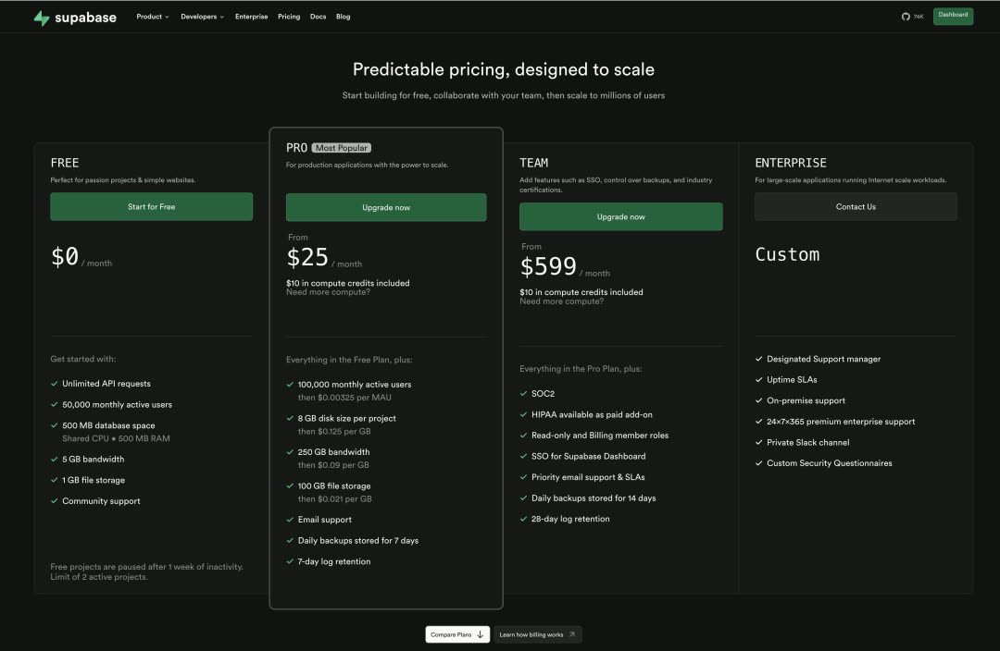
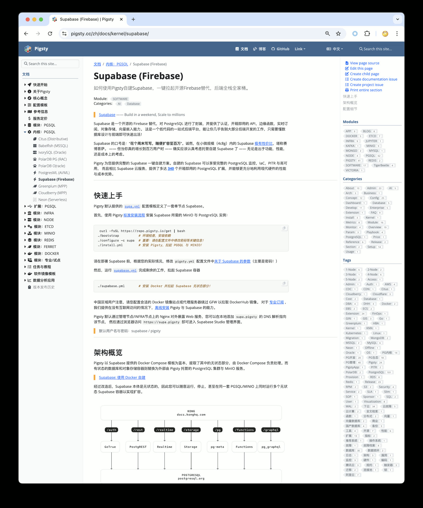
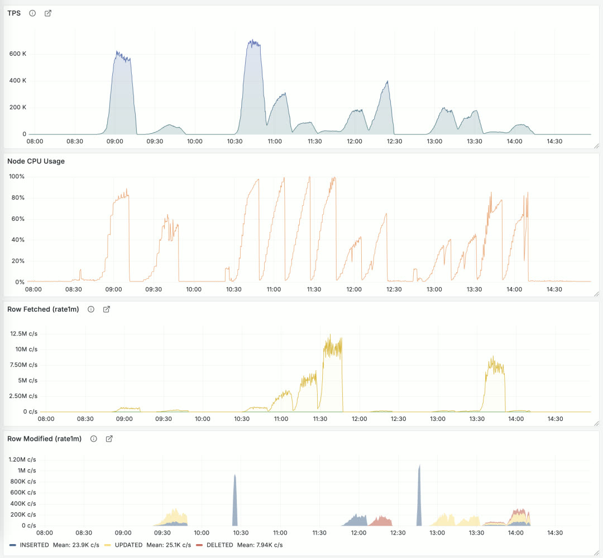
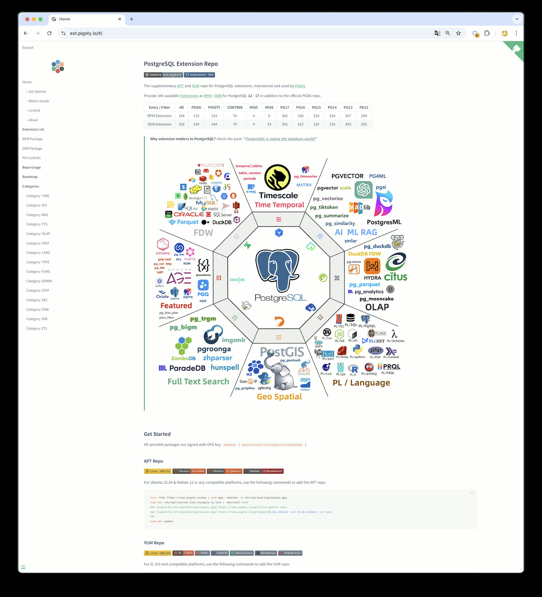
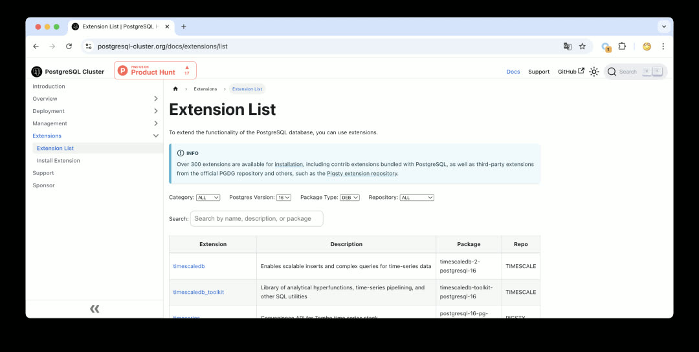
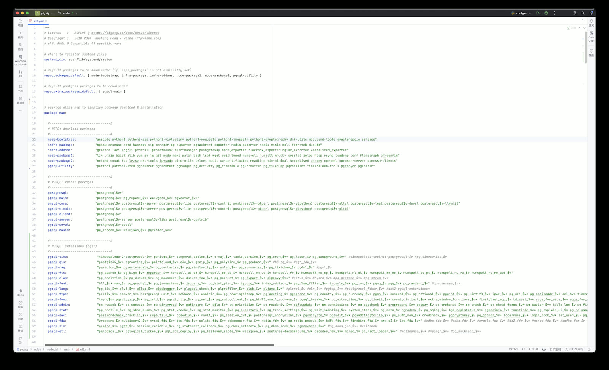
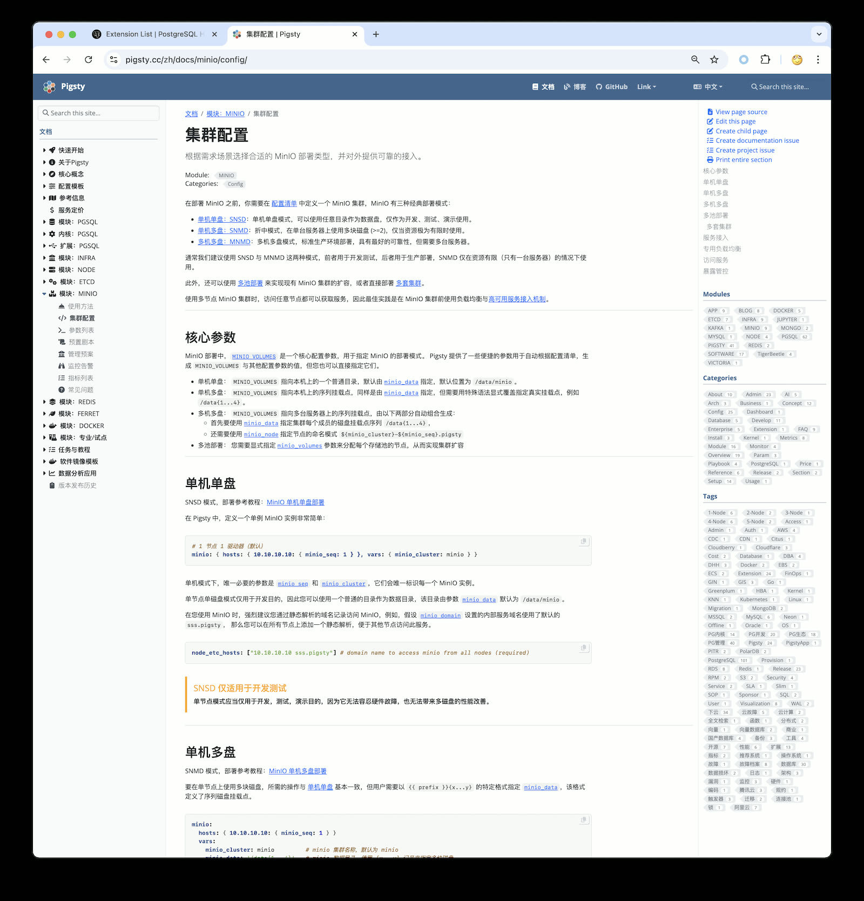
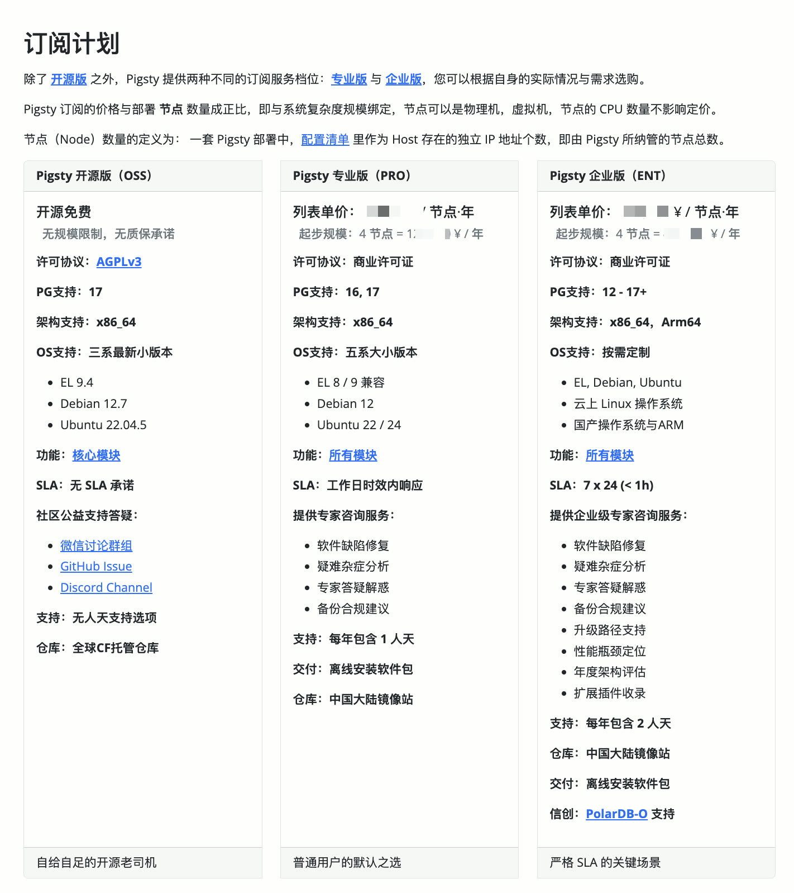

> [**GitHub Release**](https://github.com/pgsty/pigsty/releases/tag/v3.1.0) | [**Release Note**](https://pigsty.io/docs/releasenote/#v310)

[](https://github.com/pgsty/pigsty/releases/tag/v3.1.0)

With PostgreSQL 17.2 released just days ago, Pigsty immediately follows up with v3.1. In this version, PostgreSQL 17 becomes the default major version, with nearly 340 extensions available out of the box.

Additionally, Pigsty 3.1 delivers one-click [self-hosted Supabase](https://pigsty.cc/docs/pgsql/kernel/supabase) capability and improved [MinIO](https://pigsty.cc/docs/minio) object storage best practices.
Meanwhile, Pigsty provides initial ARM64 architecture support and adds support for the newly released Ubuntu 24.04 major OS release.
Finally, this version offers a series of ready-to-use scenario templates, unifying configuration files across different OS distributions and dramatically simplifying configuration management.


--------

## Self-Hosted Supabase

Supabase is an open-source Firebase alternative that wraps PostgreSQL and provides authentication, instant APIs, edge functions, real-time subscriptions, object storage, and vector embeddings.
Supabase's tagline is: "**Build in a weekend, scale to millions**." After trying it out, I'd say that's no exaggeration.
It's a low-code one-stop backend platform that lets you say goodbye to most backend development work — just understand database design and frontend, and you can ship fast!



For small-scale workloads (4c8g), Supabase cloud [pricing is extremely competitive](https://supabase.com/pricing) — practically a bargain. So why self-host when Supabase cloud is so attractive? A few reasons:

The most obvious reason is what we discussed in "[Cloud Computing Mudslide](/cloud)": cloud database services quickly explode in cost once you scale up even a little. Considering the unbeatable price-performance of local NVMe drives, the cost and performance advantages of self-hosting are obvious.

Another important reason is Supabase cloud's feature limitations — [following the same logic as RDS](https://mp.weixin.qq.com/s/EH7RPB6ImfMHXhOMU7P5Qg), many powerful extensions can't be offered in multi-tenant cloud environments for security reasons. Supabase cloud has 64 available extensions, but when self-hosting Supabase with Pigsty, you get all [**340**](https://pgext.cloud/en/list).
Additionally, Supabase officially uses PostgreSQL 15 as the underlying database, while with Pigsty, you can use any version from PG 14-17, running on EL / Debian / Ubuntu mainstream Linux [bare metal](https://pigsty.cc/docs/ref/compare) without virtualization, fully leveraging modern hardware's performance and cost advantages.

I've noticed many startups going overseas are using Supabase, and some have reached a scale where self-hosting makes sense — and people are willing to pay for consulting to make it happen.
So Pigsty has supported self-hosting Supabase (the required PostgreSQL) since v2.4 released last September. But that still involved some manual steps like configuring the PG cluster and spinning up Docker.
In this version, we've optimized the experience to this state — on a fresh OS install, run a few commands and a fresh Supabase instance is ready!



I'll be preparing some tutorials on [Supabase self-hosting best practices](https://pigsty.cc/docs/pgsql/kernel/supabase) in the coming days, stay tuned.


--------

## PostgreSQL 17

In "[PG12 EOL, PG17 Rises](/pg/pg12-eol-pg17-up/)", we already detailed PostgreSQL 17's new features and improvements.

The most gratifying is the free performance improvement: PostgreSQL 17 reportedly has significant write performance gains. I tested it on a physical machine, and it's impressive.
Compared to the tests against PostgreSQL 14 three years ago in "[How Powerful is PostgreSQL Really](/pg/pg-performence)", write performance has noticeably improved.

For example, PG 14 with standard config had WAL write throughput around 110 MB/s — that was a software bottleneck, not hardware.
Under PG 17, that number reaches 180 MB/s. Of course, turning off all safety switches can multiply performance further, but fair benchmarks don't play those games.



Performance regression testing for Pigsty 3.1 + PostgreSQL 17. Detailed performance benchmark reports will be published in the coming days, stay tuned.


----------------

## 340 Extensions

Another highlight of Pigsty 3.1: this version provides **340** PostgreSQL extensions.
That's a staggering number, and this is after carefully curating and removing a dozen "extensions" — otherwise this release would have hit 360.

To achieve this, I built a YUM / APT repository covering EL 8/9, Ubuntu 22.04/24.04, and Debian 12 as major OS distributions,
plus PG 12-17 (six major versions) with ready-to-use extension RPM/DEB packages. Currently providing x86_64 packages; ARM64 and other architectures are in progress, currently available on-demand for professional users.
Beyond the repository, more importantly, I maintain an [Extension Catalog](https://pgext.cloud/en) with detailed metadata for each extension, OS/DB version availability, and usage notes to help users find what they need.



Pigsty's extension repository is based on native OS package managers, publicly shared — you don't have to use Pigsty to install these extensions.
You can add this repo to existing systems or Dockerfiles and install extensions via yum/apt install.
I'm pleased that a popular open-source cluster deployment project, postgresql-cluster, already uses this repository by default as part of its installation process to distribute extensions.



For more details, see "[PostgreSQL Achieves Mastery: The Most Complete Extension Repository](/pg/pg-ext-repo/)".
Currently, there are quite a few new projects developing extensions with Rust + pgrx, and Pigsty includes **23** Rust extensions.
If you have good extension recommendations, let me know — I'll evaluate and test them and add them to the repository ASAP.
If you're a PostgreSQL extension author, we welcome you to submit your extension to the Pigsty repository — we can help you package and distribute it, solving the last-mile delivery problem.


----------------

## Ubuntu 24.04 Support

Ubuntu 24.04 noble has been out for half a year, and some users are now running it in production.
Therefore, Pigsty v3.1 provides official Ubuntu 24.04 support.

That said, as a newer system, Ubuntu 24.04 still has some gaps compared to 22.04 — for example, `citus` and `topn` extensions are missing across the system, and `timescaledb_toolkit` doesn't yet provide u24 x86_64 support.
But overall, aside from these exceptions, the vast majority of extensions already support Ubuntu 24.04. Including it in Pigsty's primary support scope makes sense.

Correspondingly, we're removing Ubuntu 20.04 focal from Pigsty's primary supported OS list, even though Ubuntu 20.04 doesn't officially EOL until May next year.
However, due to its significant software gaps and dependency version issues (PostGIS), I'm happy to deprecate it early and exclude it from open-source version support.
Of course, you can technically still install and use it on Ubuntu 20.04, and we continue to provide Ubuntu 20.04 support in our subscription service.

Currently, Pigsty's supported mainstream OS distributions are: EL 8/9, Ubuntu 22.04 / Ubuntu 24.04, and Debian 12 — five total.
We provide the latest software packages and complete extension sets for these five OS distributions.

|  Code   | OS Distro                         |   `x86_64`   |   PG17    |    PG16    |    PG15    |    PG14    |    PG13    |   PG12    |   `Arm64`   |   PG17    |    PG16    |    PG15    |    PG14    |    PG13    |   PG12    |
|:-------:|-----------------------------------|:------------:|:---------:|:----------:|:----------:|:----------:|:----------:|:---------:|:-----------:|:---------:|:----------:|:----------:|:----------:|:----------:|:---------:|
| **EL9** | RHEL 9 / Rocky9 / Alma9           | `el9.x86_64` |  Primary  | Supported  | Supported  | Supported  | Supported  |  Legacy   | `el9.arm64` |  Primary  | Supported  | Supported  | Supported  | Supported  |  Legacy   |
| **EL8** | RHEL 8 / Rocky8 / Alma8 / Anolis8 | `el8.x86_64` |  Primary  | Supported  | Supported  | Supported  | Supported  |  Legacy   | `el8.arm64` |  Primary  | Supported  | Supported  | Supported  | Supported  |  Legacy   |
| **U24** | Ubuntu 24.04 (`noble`)            | `u24.x86_64` |  Primary  | Supported  | Supported  | Supported  | Supported  |  Legacy   | `u24.arm64` |  Primary  | Supported  | Supported  | Supported  | Supported  |  Legacy   |
| **U22** | Ubuntu 22.04 (`jammy`)            | `u22.x86_64` |  Primary  | Supported  | Supported  | Supported  | Supported  |  Legacy   | `u22.arm64` |  Primary  | Supported  | Supported  | Supported  | Supported  |  Legacy   |
| **D12** | Debian 12 (`bookworm`)            | `d12.x86_64` |  Primary  | Supported  | Supported  | Supported  | Supported  |  Legacy   | `d12.arm64` |  Primary  | Supported  | Supported  | Supported  | Supported  |  Legacy   |
| **D11** | Debian 11 (`bullseye`)            | `d12.x86_64` |  Legacy   |   Legacy   |   Legacy   |   Legacy   |   Legacy   |  Legacy   | `d11.arm64` |           |            |            |            |            |           |
| **U20** | Ubuntu 20.04 (`focal`)            | `d12.x86_64` |  Legacy   |   Legacy   |   Legacy   |   Legacy   |   Legacy   |  Legacy   | `u20.arm64` |           |            |            |            |            |           |
| **EL7** | RHEL7 / CentOS7 / UOS ...         | `d12.x86_64` |           |            |   Legacy   |   Legacy   |   Legacy   |  Legacy   | `el7.arm64` |           |            |            |            |            |           |

> Primary = Primary version support; Supported = Configurable support; Legacy = Legacy version commercial support


----------------

## ARM Support

ARM architecture has been gaining ground, especially in cloud computing where ARM server market share is steadily growing. As early as two years ago, users were requesting ARM architecture support.
Actually, Pigsty already had ARM support from earlier "localization system" adaptation work. But providing ARM64 support in the open-source version — v3.1 is the first time.

Of course, in the current version, ARM is still in Beta: functionality exists and works, but we need to run it for a while with feedback to know how well it performs.

Currently, Pigsty's main features are all adapted — things like Grafana / Prometheus have ARM packages ready.
The part not yet supported is mainly PG extensions — specifically the 140 extensions maintained by Pigsty — which don't have ARM support yet, but it's in progress.
However, if the extensions you use are already provided by PGDG (like postgis, pgvector), you're good to go.

Currently, the ARM version runs well on EL9, Debian 12, and Ubuntu 22.04.
EL8 has some missing official PGDG packages, and Ubuntu 24 has some individual missing extensions, so we don't recommend using the ARM version on these two systems yet.

I plan to pilot ARM for one or two minor versions, and once extensions are complete, I'll mark it as GA. Welcome to try the ARM version and provide feedback.


----------------

## Configuration Simplification

Another significant improvement in Pigsty v3.1 is configuration simplification. Managing package differences across OS distributions and versions has always been a headache.

For example, because package names and available software vary across OS distributions, previous Pigsty versions generated a separate config file for each OS distribution.
But this quickly leads to combinatorial explosion — if Pigsty provides a dozen scenario templates and each needs versions for 5-7 OS versions, the total count explodes.

But any problem in computer science can be solved by adding another layer of indirection, and this is no exception. In v3.1, Pigsty introduces a new `package_map` config file defining package aliases.
Then for each OS distribution, we generate a `node_id/vars` config file that translates fixed package aliases to concrete package lists for that OS.



For example, the Supabase self-hosting template enables dozens of extensions — users just need to provide extension names, and details like chip architecture, OS version, PG version, and package names are all handled internally.

```bash
pg_extensions: # extensions to be installed on this cluster
- supabase   # essential extensions for supabase
- timescaledb postgis pg_graphql pg_jsonschema wrappers pg_search pg_analytics pg_parquet plv8 duckdb_fdw pg_cron pg_timetable pgqr
- supautils pg_plan_filter passwordcheck plpgsql_check pgaudit pgsodium pg_vault pgjwt pg_ecdsa pg_session_jwt index_advisor
- pgvector pgvectorscale pg_summarize pg_tiktoken pg_tle pg_stat_monitor hypopg pg_hint_plan pg_http pg_net pg_smtp_client pg_idkit
```

For example, if you want to download and install PG 16 kernel and extensions, previously you'd need to change all packages in the download and install lists to version 16 — now you just modify one `pg_version` parameter.
The end result is excellent: basically all OS distributions can use the same config file for installation, hiding system differences and management complexity internally.


----------------

## Infrastructure Improvements

Beyond functional improvements, we continue improving infrastructure. For example, installing the MSSQL-compatible Babelfish kernel, Oracle-compatible IvorySQL kernel, and PolarDB kernel introduced in v3.0 required users to use an external repo for online installation.

Now, the official Pigsty repository directly provides mirrors for Babelfish, IvorySQL, PolarDB, and other kernels — installing these "exotic flavor" PG replacement kernels is much simpler. The effect now is that no extra configuration is needed; just use the preset template for one-click installation.

Additionally, we maintain Prometheus and Grafana YUM/APT x AMD/ARM repositories, tracking these observability component versions in real-time. In this upgrade, Prometheus upgrades to v3, and VictoriaLogs officially releases v1.
In summary, if you need these monitoring tools, Pigsty's repository can help.


----------------

## MinIO Improvements

Finally, let's discuss open-source object storage self-hosting: MinIO.
Pigsty uses MinIO as PostgreSQL backup storage and Supabase's underlying storage service,
aiming to lower MinIO's deployment barrier to "if you have hands, you can do it" — Deploy in minutes, Scale to millions.

When we first used MinIO internally, it was still version 0.x, and MinIO has made great progress since then.
Back then we stored 25 PB with MinIO, and since MinIO didn't support online expansion, we had to split it into seven or eight independent clusters used sequentially.
Now, while MinIO still can't modify disk/node counts online, you can achieve smooth expansion by adding storage pools, migrating, and retiring old storage pools.



In Pigsty v3.1, I re-read MinIO's documentation and adjusted best practice config templates and SOPs based on new version features.
Beyond the previous MinIO single-node single-disk, single-node multi-disk, and multi-node multi-disk modes, we now support multi-pool deployment mode and provide MinIO management playbooks in Pigsty —
including disk failure handling, node failure handling, cluster lifecycle, storage scaling, and using VIP + HAProxy for HA access — all documented and solvable with a few commands.

Object storage is foundational infrastructure in the cloud. MinIO, as the representative of open-source object storage, excels in both performance and functionality — more importantly, it's cloud-neutral open-source software.

You can also use MinIO to replace cloud object storage services. As DHH described in "[Leaving the Cloud Exceeded Expectations, Saving $100M](https://mp.weixin.qq.com/s/mknFXO5DSfxw7st8hhxjBQ)",
they had 10PB of cloud object storage (list price $3M/year), discounted to $1.3M/year via SavingsPlans — about ¥930K RMB / PB·year.
A 1.2 PB dedicated storage server costs around ¥100K RMB, with 3-way replication redundancy, slap MinIO on a few of those and you have object storage.
Add in network, power, and ops, and the entire 5-year TCO doesn't exceed one year's discounted cloud spend — that's massive cost-saving potential.
If your business heavily uses object storage, local MinIO self-hosting + Cloudflare might be a much better solution worth considering.


----------------

## Service System

Pigsty v3.1 has reached a state I'm fairly satisfied with. Going forward, my focus will shift to building the service system.

Pigsty is free open-source software that already solves the vast majority of PG operations problems. If you're an open-source veteran, you can handle edge cases yourself.
But for some enterprise users, especially those without dedicated DBAs, someone needs to "backstop" — after all, the core of open-source software is NO WARRANTY.

As discussed in "[PolarDB ¥20 Brothers: What Should Databases Really Cost](https://mp.weixin.qq.com/s/E0MtNxPVMQ4PAkIFmispTw)", proper database services have a fair market price, typically around **¥10-20K RMB / vCPU·year**.
Whether you buy Oracle support, EDB, Fujitsu's open-source PG services, or AWS RDS/Aurora — it's all in this price range.

My previous service pricing was too low, drawing comments from domestic and international peers — "Aren't you destroying the market with dumping? You as a top domestic PG expert setting and publishing this price, what are we supposed to do?"



So this time I've re-adjusted the pricing system, basically anchoring to industry average pricing levels. After all, it's a mutual choice — welcome interested friends to purchase professional services and support! New customers get new pricing, existing customers keep old pricing.


----------------

## v3.1.0 Release Notes

**Highlights**

- PostgreSQL 17 is now the default major version (17.2)
- Ubuntu 24.04 system support
- ARM architecture support: EL9, Debian12, Ubuntu 22.04
- One-click Supabase self-hosting, new `supabase.yml` playbook
- MinIO best practice improvements, config templates and Vagrant templates
- Series of ready-to-use config templates with documentation
- Allow specifying PG major version with `-v|--version` during `configure`
- Adjusted default extension policy: `pg_repack`, `wal2json`, and `pgvector` installed by default
- Greatly simplified `repo_packages` local repo build logic, allowing package group aliases in `repo_packages`
- Provided WiltonDB, IvorySQL, PolarDB repo mirrors, simplifying installation
- Database checksums enabled by default
- Fixed ETCD and MINIO log panels

**Software Upgrades**

- PostgreSQL 17.2, 16.6, 15.10, 14.15, 13.18, 12.22
- PostgreSQL extension versions: see https://pgext.cloud/en
- Patroni 4.0.4
- MinIO 20241107 / MCLI 20241117
- Rclone 1.68.2
- Prometheus: 2.54.0 -> 3.0.0
- VictoriaMetrics 1.102.1 -> 1.106.1
- VictoriaLogs v0.28.0 -> 1.0.0
- vslogcli 1.0.0
- MySQL Exporter 0.15.1 -> 0.16.0
- Redis Exporter 1.62.0 -> 1.66.0
- MongoDB Exporter 0.41.2 -> 0.42.0
- Keepalived Exporter 1.3.3 -> 1.4.0
- DuckDB 1.1.2 -> 1.1.3
- etcd 3.5.16 -> 3.5.17
- tigerbeetle 16.8 -> 0.16.13

**API Changes**

- `repo_upstream`: Generates defaults for each specific OS distribution: [`roles/node_id/vars`](https://github.com/Vonng/pigsty/tree/main/roles/node_id/vars)
- `repo_packages`: Allows aliases defined in `package_map`
- `repo_extra_packages`: New default when unspecified, allows aliases defined in `package_map`
- `pg_checksum`: Default changed to `true`, enabled by default
- `pg_packages`: Default changed to: `postgresql, wal2json pg_repack pgvector, patroni pgbouncer pgbackrest pg_exporter pgbadger vip-manager`
- `pg_extensions`: Default changed to empty array `[]`
- `infra_portal`: Allows specifying `path` for `home` server, replacing default local repo path `nginx_home` (`/www`)
