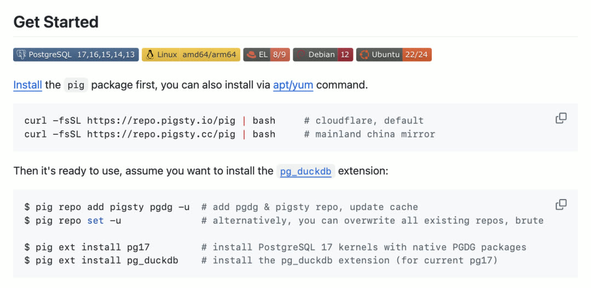
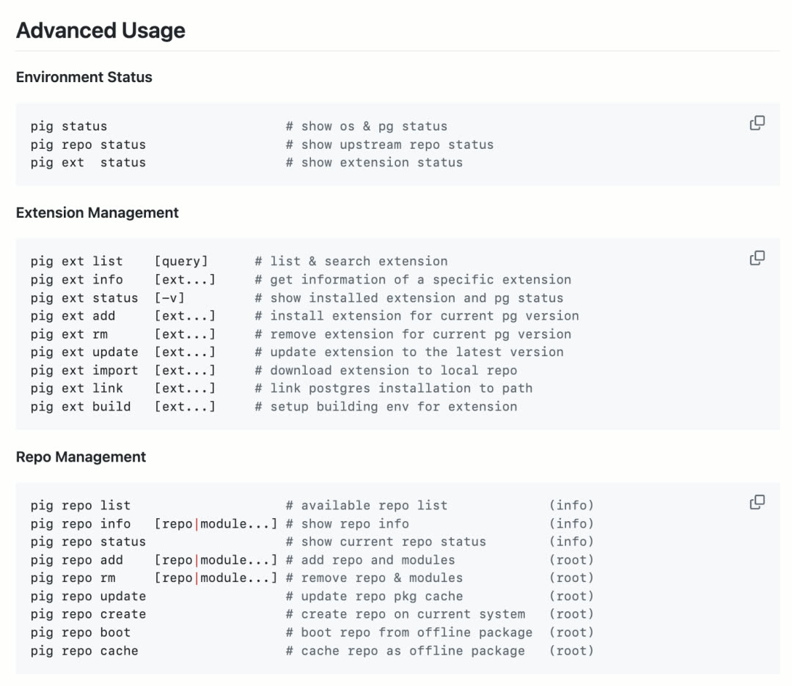
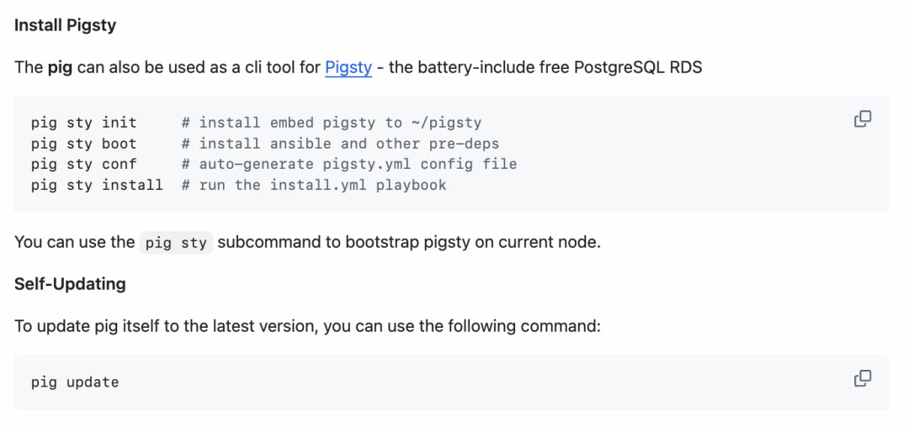
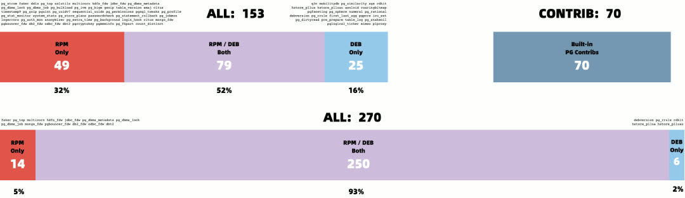
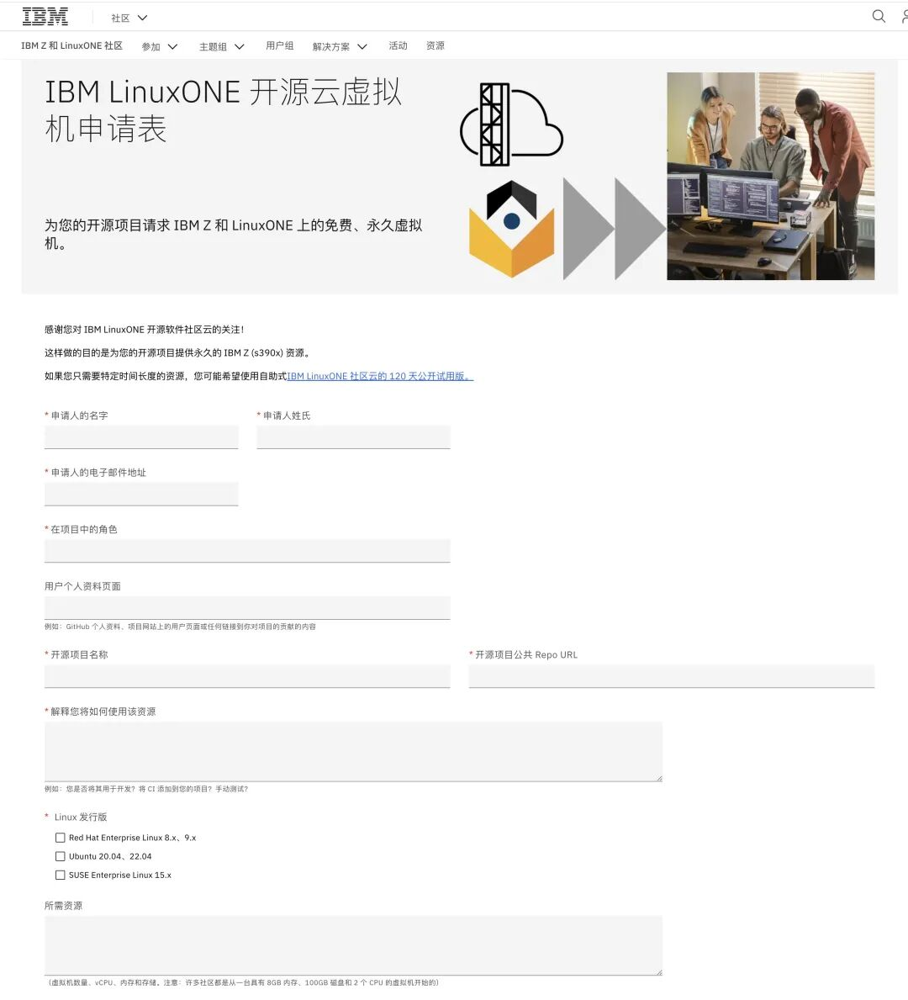
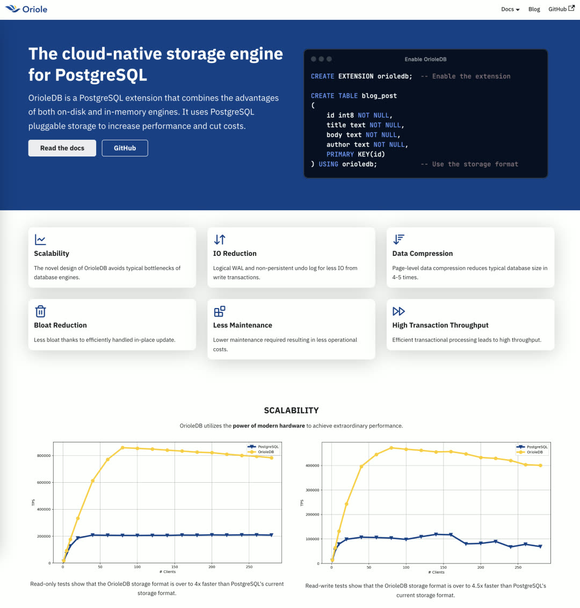
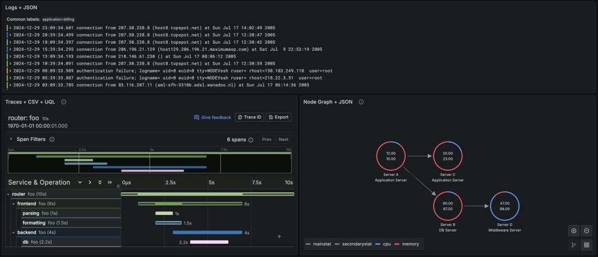

> [**GitHub Release**](https://github.com/pgsty/pigsty/releases/tag/v3.2.0) | [**Release Note**](https://pigsty.io/docs/releasenote/#v320)

[](https://github.com/pgsty/pigsty/releases/tag/v3.2.0)

Pigsty wraps up 2024 with its final release: v3.2. This release brings the `pig` command-line tool and complete ARM extension support. Together, they deliver silky-smooth PostgreSQL delivery across 10 major Linux distributions.

This release includes routine fixes, tracks Supabase's intense release week changes, and provides RPM/DEB packages for Grafana plugins and data sources.


--------

## The pig CLI Tool

Pigsty v3.2 ships with the [**pig**](/blog/pg/pig) command-line tool by default, further simplifying Pigsty's installation, deployment, and configuration process. But `pig` isn't just a Pigsty CLI — it's a full-featured standalone PostgreSQL package manager.

When installing PostgreSQL extensions, dealing with various distributions and chip architectures is always painful: endless time wasted digging through outdated READMEs, obscure config scripts, and random GitHub branches; or struggling with China's network environment — missing repos, blocked mirrors, frustrating download speeds.



**pig** has arrived to solve all these problems. It's a brand-new Go-based package manager that handles PostgreSQL and its ever-growing extension ecosystem uniformly, without getting stuck in debugging hell.


Pig is a lightweight binary written in Go — dependency-free and easy to install with a single command. It respects each OS's package management traditions without reinventing the wheel, implementing package management on top of yum/dnf/apt.

Pig focuses on cross-distro harmony — whether on Debian, Ubuntu, or Red Hat derivatives, you get a single, smooth method to install and update PostgreSQL and any extension, without compiling from source or dealing with half-baked repos.



If [**PostgreSQL's future is unstoppable extensibility**](/blog/pg/pg-eat-db-world), Pig is the tool that helps unlock that potential. After all, nobody complains about a PostgreSQL instance having too many extensions — unused ones have zero impact, and needed ones are right at your fingertips.




--------

## ARM Extension Repository

Behind Pig is a [**supplementary extension repository**](/blog/pg/pg-ext-repo) packed with rare and newly released extensions, so quality extensions are always easy to obtain — tested, curated, and ready to go.

Over the past month, Pigsty has completed full ARM64 architecture support. The five major Linux distributions (EL8, EL9, Debian12, Ubuntu 22/24) now have **complete** ARM support. By complete, we mean config files used on AMD64 work identically on ARM64 systems. Of course, there are scattered exceptions — a few extensions currently lack ARM support and will be addressed individually.



The Pigsty Extension Repo aggregates 340+ curated PostgreSQL extensions, compiled into convenient `.rpm` and `.deb` packages, supporting multiple versions and architectures:

| Extension Category | Support Status |
|---------|---------|
| TimescaleDB time-series suite | Full support |
| Supabase-related extensions | Complete |
| DuckDB analytics extensions | Ready |
| Community new extensions | Continuously added |

Pigsty built a cross-distro pipeline that integrates community-developed new extensions, time-tested classic modules, and official PGDG packages, enabling one-click seamless installation across Debian, Ubuntu, Red Hat families, and more.

**Key design principle**: Don't reinvent the wheel — build directly on each distro's native package manager (YUM, APT, DNF, etc.) while maintaining version alignment with official PGDG repos.

Under the hood, this repo is part of the larger Pigsty PostgreSQL distribution, but it can also be used independently in your own environment without fully adopting Pigsty. Everything is free and open-source, easy to integrate. Several PostgreSQL vendors already use it as an additional upstream for extension installation.

Complete ARM64 support builds confidence for more chip architecture support. For example, IBM LinuxOne Cloud provides s390x mainframe support for open-source projects, and Pigsty is evaluating this direction.




--------

## Supabase Tracking

Pigsty's previously released **Supabase self-hosting tutorial** lets users quickly spin up self-hosted Supabase on a single machine. This has generated interest among startup teams heavily using Supabase, so we continue tracking the latest Supabase versions.

Supabase released a series of important updates in December 2024, and Pigsty v3.2 tracks these changes, providing users with the latest Supabase version.

A recent major Supabase move was acquiring OrioleDB — a kernel fork focused on improving PostgreSQL OLTP performance. This feature is currently marked as Beta in Supabase, available as a user option. Pigsty is preparing OrioleDB RPM/DEB packages to ensure support even if Supabase adopts it as the mainline in the future.



With this opportunity, Pigsty is also preparing to extend extension capabilities to more PostgreSQL forks:

| Kernel | Compatibility |
|-----|--------|
| IvorySQL 3/4 | Oracle compatible |
| WiltonDB | SQL Server compatible |
| PolarDB PG | Alibaba Cloud open-source |
| OrioleDB | OLTP optimized |


--------

## Grafana Extensibility

Grafana is an extremely popular open-source monitoring and visualization tool with many plugins: various data visualization panels and data sources. But installing and managing these plugins has always been problematic — Grafana's own CLI tool can install plugins, but users in China must use VPN to access it, causing significant inconvenience.

In v3.2, commonly used Grafana panel and data source plugins are packaged as RPM/DEB for out-of-the-box use:

**Architecture-independent plugins (grafana-plugins)**:

| Category | Plugins |
|-----|------|
| Panels | volkovlabs-echarts, image, form, table, variable |
| Panels | knightss27-weathermap, marcusolsson-dynamictext |
| Panels | marcusolsson-treemap, calendar, hourly-heatmap |
| Data Sources | marcusolsson-static, json, volkovlabs-rss, grapi |

**Architecture-dependent plugins**:

Additionally, independent RPM/DEB packages were created for architecture-dependent data source plugins (containing x86, ARM binaries). For example, Grafana's new **Infinity data source plugin**: use any REST/GraphQL API, use CSV/TSV/XML/HTML as data sources — this greatly expands Grafana's data ingestion capabilities.



Meanwhile, RPM/DEB packages were also created for VictoriaMetrics and VictoriaLogs Grafana data source plugins, making it convenient for users to use these two open-source time-series and log databases in Grafana.


--------

## Future Development Plans

Pigsty itself has reached a fairly mature state. The focus for the coming period will be on the `pig` tool and extension repository maintenance.

Currently, there's a rare opportunity window: users and developers are realizing the importance of PostgreSQL extensions, but the PostgreSQL ecosystem doesn't yet have a de facto standard for extension distribution. Pigsty is committed to making `pig` an influential PostgreSQL extension distribution standard.

Of course, Pigsty itself has always lacked a good enough CLI tool. Going forward, we'll integrate functionality scattered across various Ansible playbooks into `pig`, making it more convenient for users to manage Pigsty and PostgreSQL.


--------

## v3.2.0 Release Notes

### Highlights

- Pigsty CLI tool: [`pig`](https://github.com/pgsty/pig) 0.2.0, for managing extensions
- ARM64 extension support for [340 extensions](https://pgext.cloud/) across five major distros
- Supabase release week latest version updates, self-hosting available on all distros
- Grafana updated to 11.4, new Infinity data source

### Package Changes

**New Extensions**
- Added timescaledb, timescaledb-loader, timescaledb-toolkit, timescaledb-tool to PIGSTY repo
- Added [pg_timescaledb](https://github.com/timescale/timescaledb), recompiled for EL
- Added [pgroonga](https://pgext.cloud/e/pgroonga), recompiled for all EL versions
- Added [vchord](https://github.com/tensorchord/VectorChord) 0.1.0
- Added [pg_bestmatch.rs](https://github.com/tensorchord/pg_bestmatch.rs) 0.0.1
- Added [pglite_fusion](https://github.com/frectonz/pglite-fusion) 0.0.3
- Added [pgpdf](https://github.com/Florents-Tselai/pgpdf) 0.1.0

**Updated Extensions**
- pgvectorscale 0.4.0 -> 0.5.1
- pg_parquet 0.1.0 -> 0.1.1
- pg_polyline 0.0.1
- pg_cardano 1.0.2 -> 1.0.3
- pg_vectorize 0.20.0
- pg_duckdb 0.1.0 -> 0.2.0
- pg_search 0.13.0 -> 0.13.1
- aggs_for_vecs 1.3.1 -> 1.3.2
- `pgoutput` marked as new PostgreSQL Contrib extension

**Infrastructure**
- Added promscale 0.17.0
- Added grafana-plugins 11.4
- Added grafana-infinity-plugins
- Added grafana-victoriametrics-ds
- Added grafana-victorialogs-ds
- vip-manager 2.8.0 -> 3.0.0
- vector 0.42.0 -> 0.43.0
- grafana 11.3 -> 11.4
- prometheus 3.0.0 -> 3.0.1 (package name changed from `prometheus2` to `prometheus`)
- nginx_exporter 1.3.0 -> 1.4.0
- mongodb_exporter 0.41.2 -> 0.43.0
- VictoriaMetrics 1.106.1 -> 1.107.0
- VictoriaLogs 1.0.0 -> 1.3.2
- pg_timetable 5.9.0 -> 5.10.0
- tigerbeetle 0.16.13 -> 0.16.17
- pg_export 0.7.0 -> 0.7.1

**Bug Fixes**
- el8.aarch64: Added python3-cdiff to fix patroni dependency issue
- el9.aarch64: Added timescaledb-tools to fix missing official repo issue
- el9.aarch64: Added pg_filedump to fix missing official repo issue

**Removed Extensions**
- **pg_mooncake**: Removed due to conflict with `pg_duckdb`
- **pg_top**: Removed due to too many missing versions, quality issues
- **hunspell_pt_pt**: Removed due to conflict with PG official dictionary files
- **pg_timeit**: Removed due to incompatibility with AARCH64 architecture
- **pgdd**: Marked as deprecated due to lack of maintenance, outdated PG 17 and pgrx version
- **old_snapshot** and **adminpack**: Marked as unavailable on PG 17
- **pgml**: Set to not download/install by default

### API Changes

- [`repo_url_packages`](https://pigsty.cc/docs/ref/param/#repo_url_packages): Default now empty array, as all packages install via OS package manager
- `grafana_plugin_cache`: Deprecated, Grafana plugins now install via OS package manager
- `grafana_plugin_list`: Deprecated, Grafana plugins now install via OS package manager
- The 36-node simulation template originally named `prod` is now renamed to `simu`
- Config generation in `node_id/vars` for each distro code now also generates for `aarch64`
- `infra_packages`: Default now includes CLI management tool `pig`
- `configure` command also modifies version numbers in auto-generated config `pgsql-xxx` aliases
- `adminpack`: Removed from PG 17, therefore removed from Pigsty default extensions

### Bug Fixes

- Fixed `pgbouncer` dashboard selector issue [#474](https://github.com/Vonng/pigsty/issues/474)
- `pg-pitr`: Added `--arg value` parameter parsing support by [@waitingsong](https://github.com/Vonng/pigsty/pulls?q=is%3Apr+author%3Awaitingsong)
- Fixed Redis log info typo by [@waitingsong](https://github.com/Vonng/pigsty/pull/476)

### Checksums

```
8fdc6a60820909b0a2464b0e2b90a3a6  pigsty-v3.2.0.tgz
d2b85676235c9b9f2f8a0ad96c5b15fd  pigsty-pkg-v3.2.0.el9.aarch64.tgz
649f79e1d94ec1845931c73f663ae545  pigsty-pkg-v3.2.0.el9.x86_64.tgz
c42da231067f25104b71a065b4a50e68  pigsty-pkg-v3.2.0.d12.aarch64.tgz
ebb818f98f058f932b57d093d310f5c2  pigsty-pkg-v3.2.0.d12.x86_64.tgz
24c0be1d8436f3c64627c12f82665a17  pigsty-pkg-v3.2.0.u22.aarch64.tgz
0b9be0e137661e440cd4f171226d321d  pigsty-pkg-v3.2.0.u22.x86_64.tgz
```
