经过两个月的精心打磨，Pigsty v3.3 正式发布。作为开源的"开箱即用" PostgreSQL 发行版，Pigsty 旨在凝聚 PG 生态的合力，为本地自建提供与云上 RDS 媲美的免运维便捷体验。

本版本聚焦三个关键领域：**扩展插件**、**建站体验**和**应用模板**，大幅增强了开发、运维、部署等多方面的能力。


--------

## 可用扩展突破 400+

PostgreSQL 以其丰富的扩展机制著称，孕育了庞大的数据库生态。Pigsty 将 PostgreSQL 的插件扩展能力发挥到极致。

一年前《PostgreSQL正在吞噬数据库世界》一文发布时，Pigsty 可用扩展约 150 个，主要来自 PG 自带（70）和 PGDG 官方仓库。

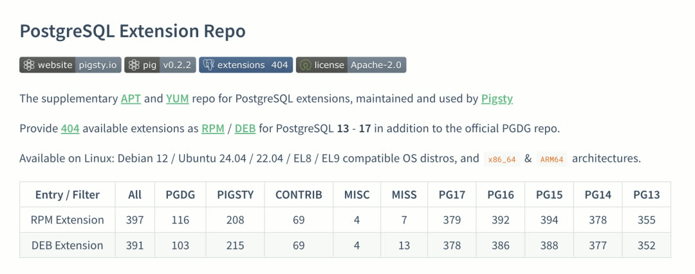

如今 Pigsty v3.3 将可用扩展数量推至 **404 个**！用户几乎可以即插即用任何想要的 PostgreSQL 插件，更重要的是能像[搭积木一样组合这些扩展](https://mp.weixin.qq.com/s?__biz=MzU5ODAyNTM5Ng==&mid=2247489151&idx=1&sn=8098166e6231965283d8d65315ccbab9&scene=21#wechat_redirect)。

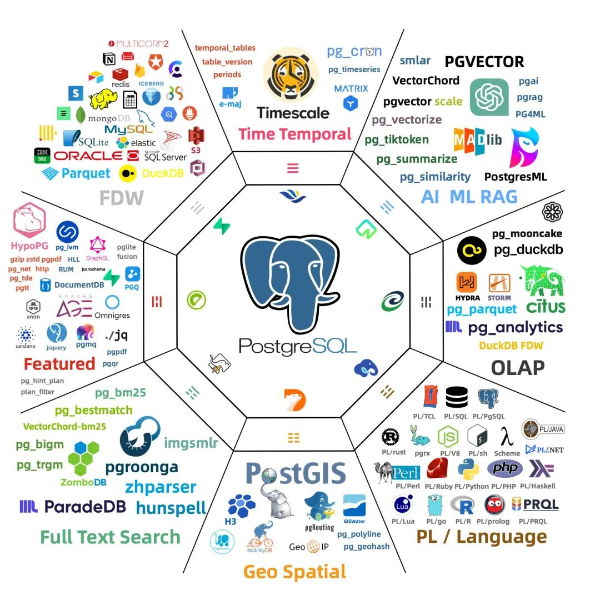

**值得关注的新扩展**：

| 扩展 | 说明 |
|-----|------|
| PGDocumentDB | 微软开源，赋予 PostgreSQL 文档数据库能力 |
| PGCollection | AWS 出品，高性能内存优化集合数据类型 |
| pg_tracing | DataDog 开源，分布式调用链追踪 |
| pg_curl | 支持数十种网络协议发起请求 |
| pgpdf | 直接读取存储 PDF，SQL 全文检索 PDF 内容 |
| Omni 系列 | Omnigres 开发的 30+ 扩展，用于 PG 中进行 Web 应用开发 |

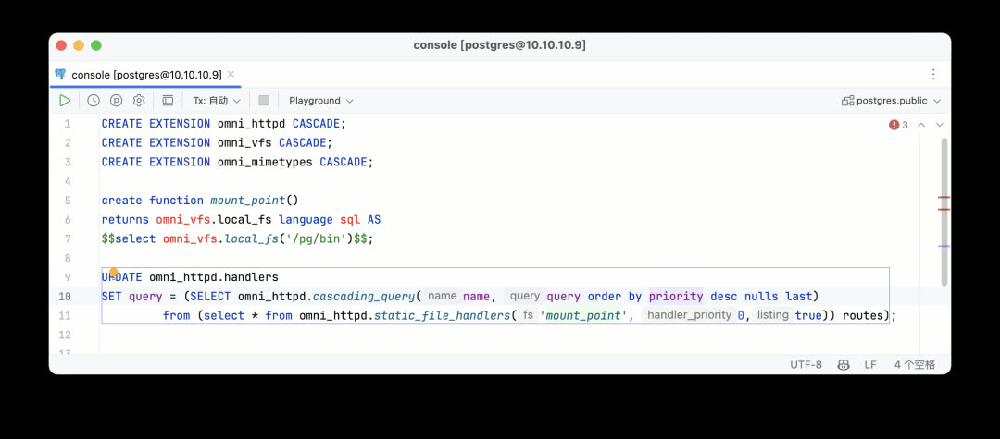

Pigsty 与 Omnigres 达成深度合作伙伴关系：Pigsty 整合分发 Omnigres 扩展，Omnigres 作为下游将 Pigsty 扩展仓库中的扩展交付给其用户，实现互惠共赢。


--------

## FerretDB 2.0：PostgreSQL 变身 MongoDB

与 FerretDB 团队合作，交付基于 PostgreSQL 的 MongoDB 方案。FerretDB 2.0 使用微软开源的 DocumentDB 作为后端实现，提供更好的性能与更完善的功能。

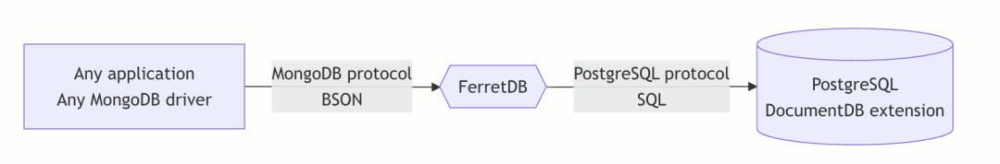

可将 PG 变为核心功能完备的 MongoDB 5.0，使用 MongoDB 客户端与线缆协议访问 PostgreSQL 中的数据。


--------

## DuckDB 缝合大赛持续进行

Pigsty v3.3 第一时间跟进了 pg_duckdb 0.3.1、pg_mooncake 0.1.2、pg_analytics 0.5.4 最新版本，从不同维度为 PostgreSQL 添加比肩 ClickHouse 的分析能力。

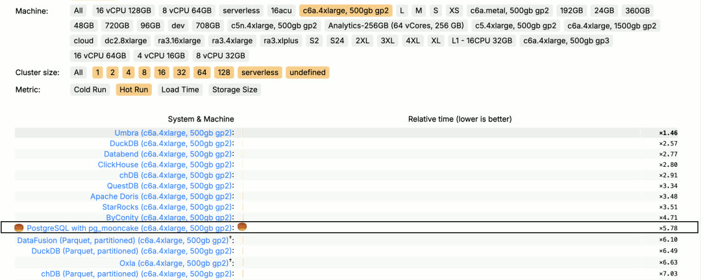

在 ClickHouse 自家榜单 ClickBench 上，PG 扩展 mooncake 已成功挤进 Top 10 T1 梯队。在激烈的竞争角逐下，PostgreSQL 生态很快会出现比肩向量数据库生态中 `pgvector` 的 OLAP 玩家。


--------

## pig 与扩展仓库

如此多扩展插件的安装管理成为难题，Pigsty 的解决方案是 `pig` 命令行工具与扩展仓库。一行命令即可在 PostgreSQL 上拥有 400 个扩展合体的超能力 —— 即使不用 Pigsty 也没问题。

虽然独一无二的扩展库可作为 Pigsty 的核心竞争优势，但更希望为 PostgreSQL 生态做出更多贡献。因此 `pig` 包管理器与 PostgreSQL 扩展仓库基于 **Apache 2.0** 宽松协议开源，对公众与同行开放。

已有多家 PostgreSQL 厂商基于 Pigsty 扩展仓库安装扩展，成为 Pigsty 的下游。这是一种扎实参与全球软件供应链的方式。


--------

## 建站体验：Nginx IaC 与免费 HTTPS 证书

Pigsty 不仅是 PostgreSQL 发行版，还是完整的监控基础设施、Etcd、MinIO、Redis、Docker 部署管理方案，甚至可作为 Web 建站工具。

Pigsty 提供全功能的 Nginx 配置方案和证书申请 SOP，其网站和软件仓库就是使用 Pigsty 本身搭建的。

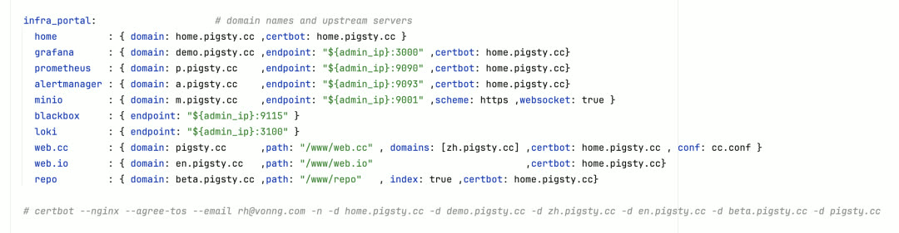

只需在配置文件中定义 Nginx Server，Pigsty 即可自动创建所需配置并申请 HTTPS 证书。

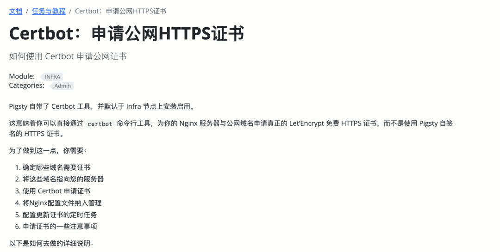

Pigsty v3.2 已将 certbot 整合并默认安装，可一行命令完成 HTTPS 证书申请与续签。可用 Nginx 代理各种服务，使用不同域名区分，统一收口到 80/443 端口对外服务 —— 只需打开入站 80/443 TCP 端口即可。


--------

## 应用模板：Docker 软件一键交付

许多软件都会用到 PostgreSQL，此前 Pigsty 提供 Docker Compose 模板，但用户仍需手动拷贝目录、修改 `.env` 配置、手工拉起。

Pigsty v3.3 提供全新剧本 `app.yml`，将基于 PostgreSQL 的 Docker 软件交付压缩为临门一脚的一行命令。

**Odoo ERP 系统**：

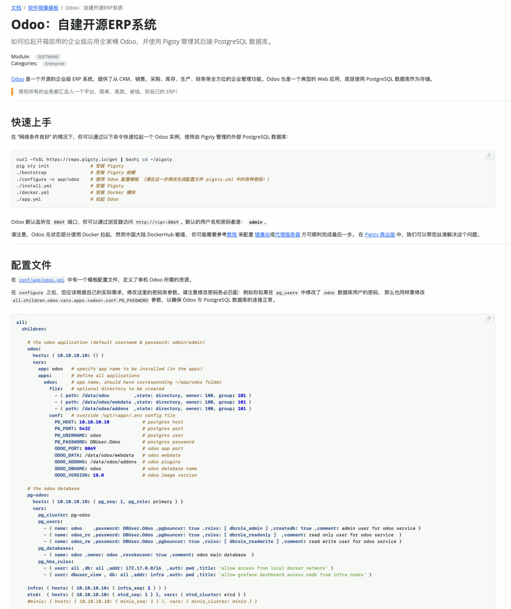

**Dify AI 工作流编排**：

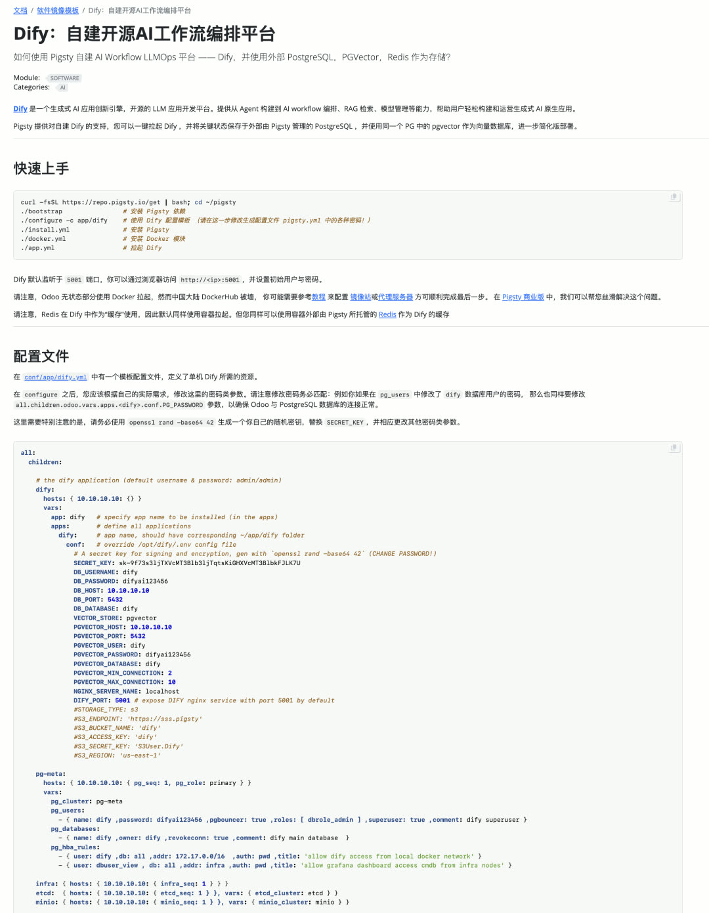

**Supabase 自建**：

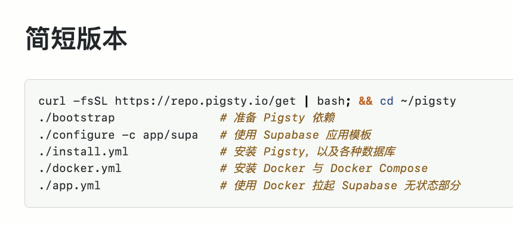

从裸机到完整的生产应用服务，只需几条命令、几分钟等待。


--------

## pig 命令行能力增强

`pig` v0.3 新增 `pig build` 子命令，允许快速搭建 PG 扩展构建环境。

```bash
curl https://repo.pigsty.cc/pig | bash # 安装 pig
pig build repo        # 添加上游仓库
pig build tool        # 安装构建工具
pig build rust        # 配置 rust/pgrx 工具链（可选）
pig build spec        # 下载构建规范
pig build get citus   # 下载某个扩展源码包
pig build ext citus   # 构建某个扩展
```

Pigsty 维护的 200+ 扩展均通过此方式构建。即使操作系统不在 Pigsty 支持的十大发行版中，也可轻松 DIY 扩展 RPM/DEB 包。


--------

## 全新网站设计

从 v3.3 开始，Pigsty 国际站 (pigsty.io) 与中文站 (pigsty.cc) 正式分离，使用独立域名、文档、Demo、仓库。

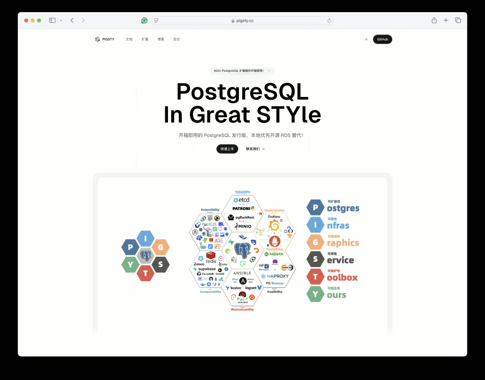

基于 Next.js 模板打造全新首页。借助 GPT o1-pro 和 Cursor 的帮助，快速完成现代 Landing Page 开发。

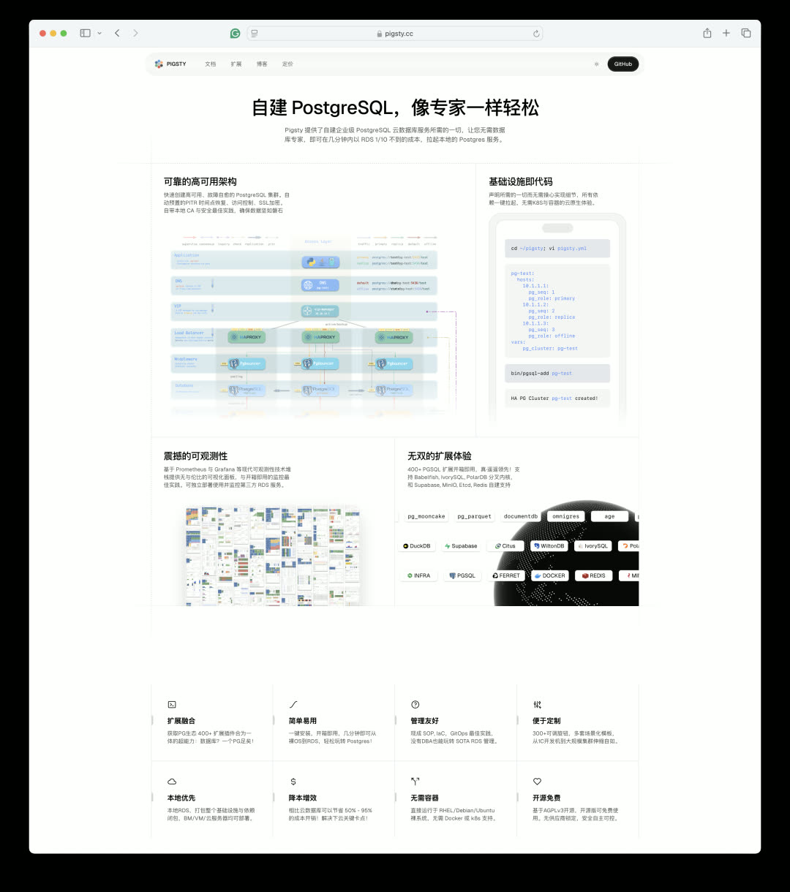

在托管方式上尝试了多种方案：Vercel、Cloudflare Pages、阿里云、腾讯云 EdgeOne 等。最终结论：海外全放 Cloudflare，国内用云服务器。

建站流程已高度自动化，十分钟内可在任意区域拉起 Pigsty 文档+仓库基础设施站点。

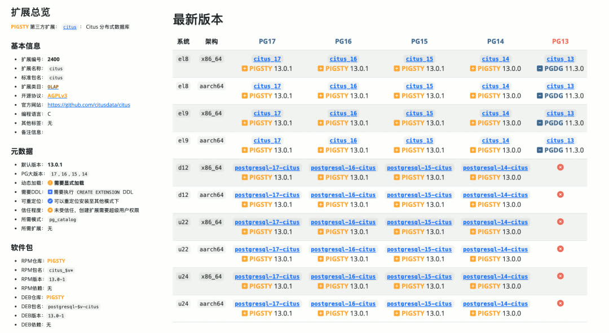

PG 扩展目录已整合到文档站 pigsty.cc/ext 中，并提供中文版本。小工具可自动扫描 Pigsty 与 PGDG 仓库扩展包版本并生成数据库记录、信息页，用户可直接从网页浏览并下载扩展 RPM/DEB 包。


--------

## 多内核支持更新

v3.3 跟进了 IvorySQL 4.2（PG 17 兼容版本），解决了 pgbackrest 备份无法用于 IvorySQL 的问题。IvorySQL 运行体验现与标准 PG 内核一致。

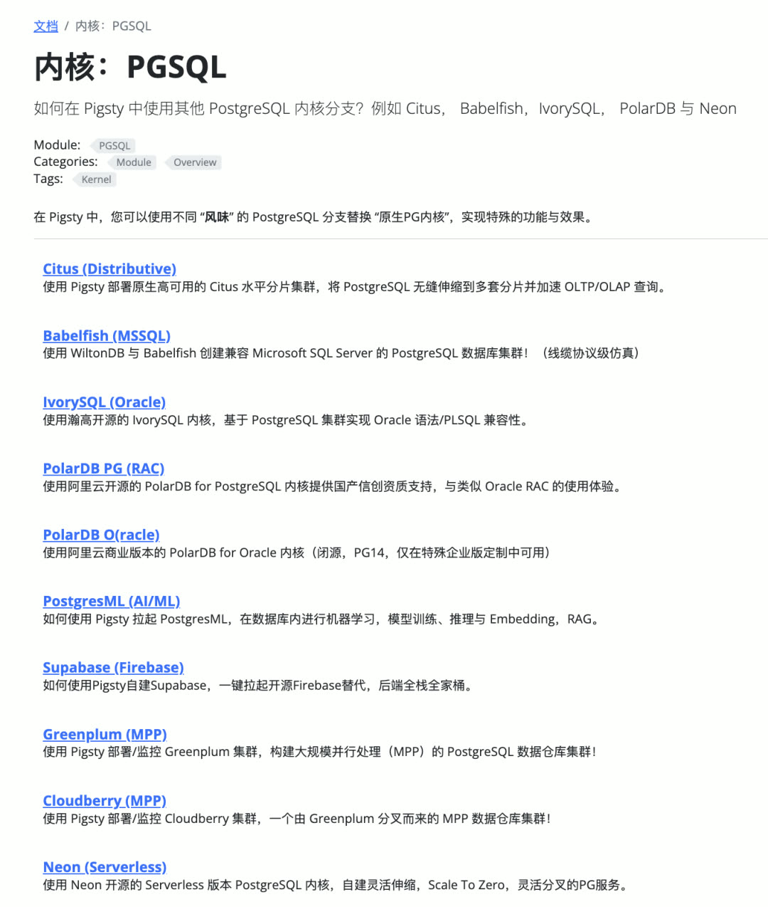

同时推动 PolarDB 团队提供了 Debian 及 ARM64 平台的 DEB 包。PolarDB 现可在 Pigsty 支持的 10 大操作系统发行版上丝滑运行。

使用 PolarDB 内核的场景：若有"国产化"要求，PolarDB 是最简单直接、物美价廉的方案，Pigsty 能将 PolarDB 内核 RPM/DEB 封装成强大的 RDS 服务。


--------
--------

## v3.3.0

Pigsty v3.3.0 版本发布，可用扩展总数增加到 **404** 个！

```bash
curl https://repo.pigsty.cc/get | bash -s v3.3.0
```

--------

### 亮点特性

- 可用扩展总数增加到 [**404**](/docs/pgsql/ext/) 个！
- PostgreSQL 二月小版本更新：17.4、16.8、15.12、14.17、13.20
- 新功能：`app.yml` 脚本，用于自动安装 Odoo、Supabase、Dify 等应用。
- 新功能：在 `infra_portal` 中进一步自定义 Nginx 配置。
- 新功能：增加 Certbot 支持，快速申请免费 HTTPS 证书。
- 新功能：`pg_default_extensions` 现在支持纯文本扩展列表。
- 新功能：默认仓库现在包含 mongo、redis、groonga、haproxy 等。
- 新参数：`node_aliases`，为节点添加命令别名。
- 修复：解决 Bootstrap 脚本中的默认 EPEL 仓库地址问题。
- 改进：为 Debian Security 仓库添加阿里云镜像。
- 改进：IvorySQL 内核的 pgBackRest 备份支持。
- 改进：PolarDB 的 ARM64 和 Debian/Ubuntu 支持。

--------

### 工具改进

- pg_exporter 0.8.0 现在支持 pgbouncer 1.24 中的新指标。
- 新功能：`git`、`docker`、`systemctl` 等常用命令的自动补全 [#506](https://github.com/pgsty/pigsty/pull/506) [#507](https://github.com/pgsty/pigsty/pull/507) 由 [@waitingsong](https://github.com/waitingsong) 提供。
- 改进：优化 `pgbouncer` 配置模板中的 `ignore_startup_parameters` [#488](https://github.com/pgsty/pigsty/pull/488) 由 [@waitingsong](https://github.com/waitingsong) 提供。

--------

### 网站与文档

- 新主页设计：Pigsty 的网站现在拥有全新的外观。
- 扩展目录：RPM/DEB 二进制包的详细信息和下载链接。
- 扩展构建：`pig` CLI 现在自动设置 PostgreSQL 扩展构建环境。

--------

更多版本信息请参考 [GitHub 发布页面](https://github.com/pgsty/pigsty/releases/tag/v3.3.0)。
