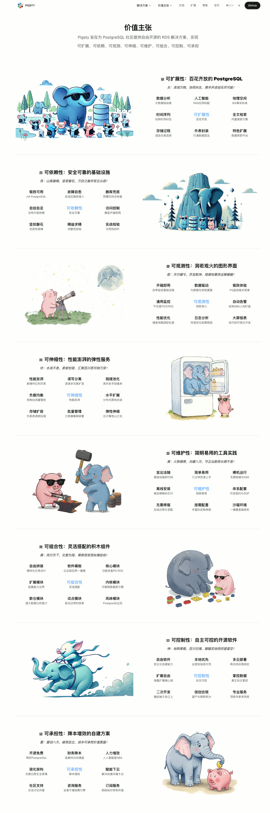
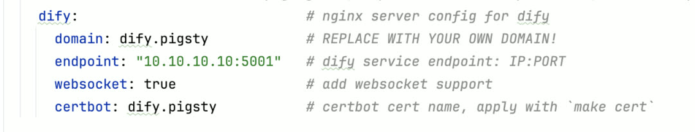
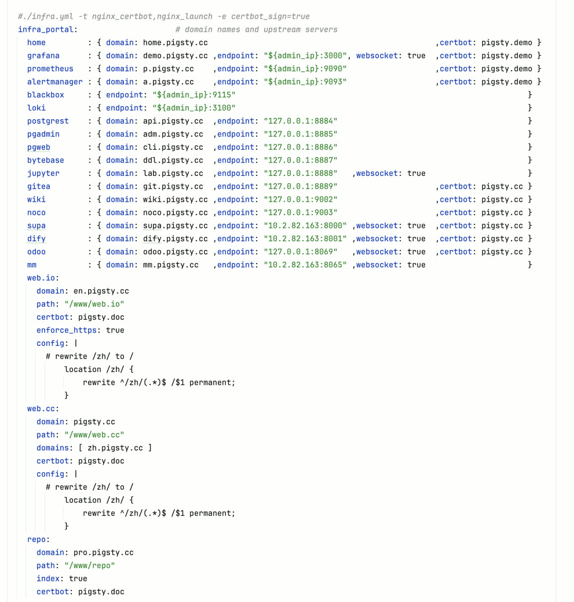
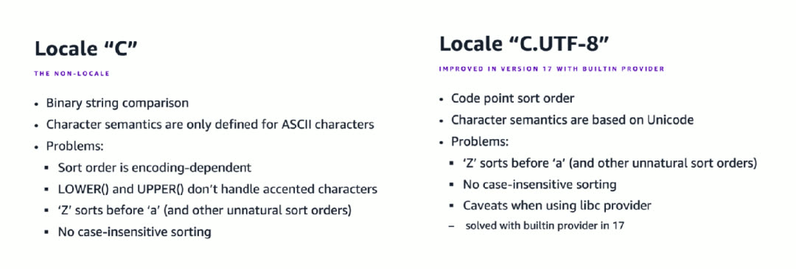
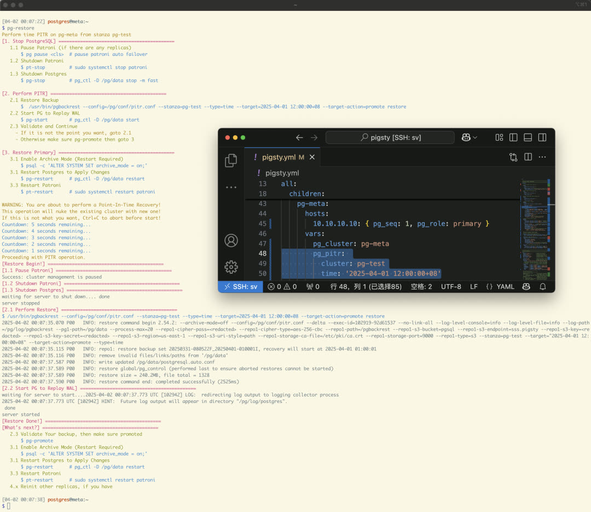
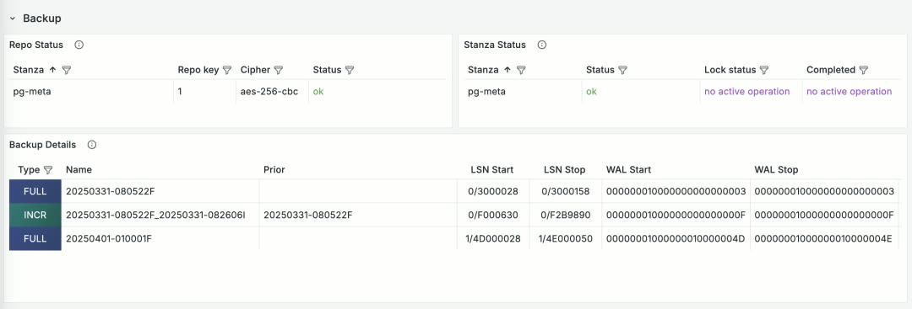
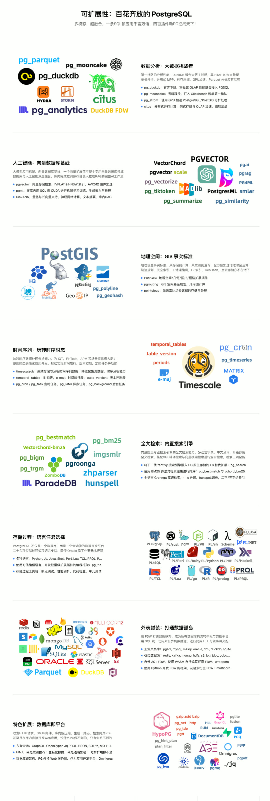
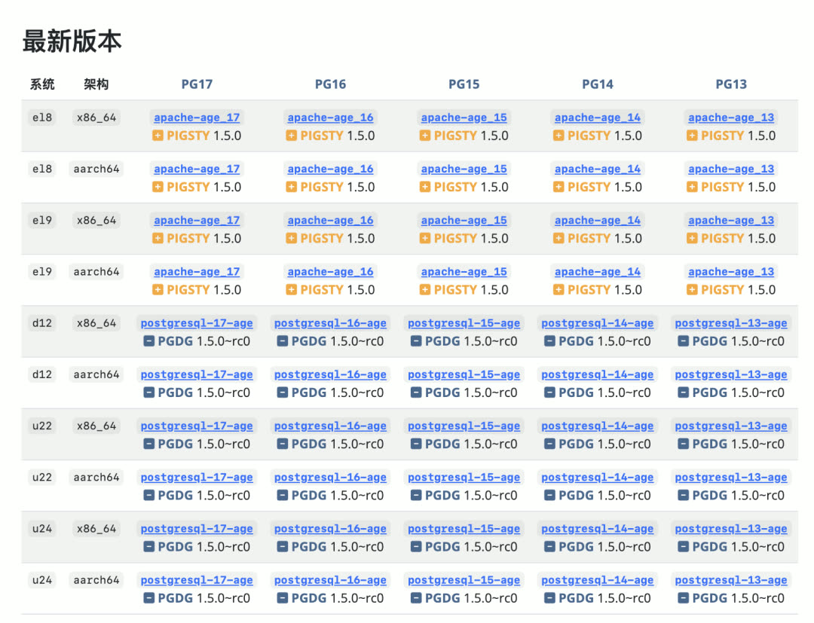
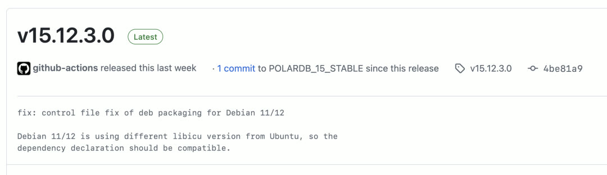

> [**GitHub Release**](https://github.com/pgsty/pigsty/releases/tag/v3.4.0) | [**发布注记**](https://pigsty.cc/docs/releasenote/#v340) | [微信公众号](https://mp.weixin.qq.com/s/nhvw2BmpTufMeEyyTb9fbw)

[](https://github.com/pgsty/pigsty/releases/tag/v3.4.0)

经过一个月的密集开发，Pigsty v3.4 正式发布。本版本进行了显著的架构优化，解决了用户和客户高度关注的几个核心问题：

- 将一套集群的物理备份 PITR 恢复到另一套集群
- pgBackRest 备份组件的监控指标与面板
- 自建应用时自动申请 HTTPS 证书
- 本地化排序规则与字符集的最佳实践
- Oracle 兼容的 IvorySQL 现已全平台可用
- 图数据库扩展 Apache AGE 现已全平台可用

此外，基于 Cursor Vibe Coding 打造了全新的价值主张/特性介绍页面：https://pigsty.cc/about/values/




--------

## 自动申请证书

不少用户因自建 Dify、Odoo、Supabase 而使用 Pigsty。用户反馈证书申请步骤有些繁琐，需要手动调用 `certbot`，希望将其自动化。



本版本对 Nginx 配置进行了增强：当用户在某个 Nginx Server 上定义 `certbot` 字段时，可使用 `make cert` 命令一键完成证书申请与应用，无需其他配置与命令。

Dify、Odoo、Supabase 等应用自建模板均已采用此功能。安装完成后，`make cert` 即可自动更新或新申请所需证书。若配置 `certbot_sign` = `true`，则在安装过程中自动申请证书。



v3.4 中 Nginx 的可配置项更加丰富：可使用 `config` 向 nginx 注入配置，使用 `enforce` 强制重定向 HTTPS。自建网站在绝大多数场景下可做到完全不碰传统 Nginx 配置文件。


--------

## 本地化排序最佳实践

许多程序员对 Locale/Collation 规则不太了解，但这确实是一个相当重要的配置。使用不当的 Collation 不仅可能带来数倍性能损失，还可能导致数据不一致甚至数据丢失 —— 索引与排序规则紧密相关，Collation 绝非无关紧要的配置。

推荐阅读：
- [PG中的本地化排序规则](https://pigsty.cc/blog/pg/collation/)
- PGCon.Dev 2024: [Collations from A to Z](https://www.pgcon.org/events/pgcondev2024/schedule/session/630/)



**最佳实践**：始终使用 `C` 或 `C.UTF-8` 作为 Locale 排序规则。

- **`C`**：兼容性最好，所有系统都支持，但缺少 Unicode 字符集知识，除 ASCII 外的字符大小写功能失灵
- **`C.UTF-8`**：在 `C` 基础上实现 Unicode 语义，更符合用户直觉，但并非所有系统默认支持
- **PostgreSQL 17 新特性**：内置对这两种 Collation 的支持，不再依赖操作系统的 libc

Pigsty v3.4 反映了这种最佳实践：

- 所有 Locale 相关参数默认值统一使用 `C`（主要是 `pg_lc_ctypes` 从 `en_US.UTF-8` 变为 `C`），确保在任何系统上都能运行
- 自动配置时，若检测到 PG >= 17 或系统明确支持 `C.utf8`，将 Locale 配置为 `C.UTF-8` 以获得更好的 Unicode 语义

除非数据库密集工作在特定语言排序场景，否则此默认值即为最佳实践。可使用 PostgreSQL COLLATION 语法在查询/索引/列上指定其他排序规则，PG + ICU 共支持 841 种排序规则。


--------

## 时间点恢复增强

时间点恢复是关系型数据库的核心功能。此前 Pigsty 通过 `pg-pitr` 辅助用户执行半自动 PITR。v3.4 对 PITR 支持进行了显著改进，现可方便地从集中式备份仓库中选择任意备份进行恢复。

在 PG 集群上定义 `pg_pitr` 参数时，Pigsty 会自动生成 `/pg/bin/pg-restore` 命令及 `/pg/conf/pitr.conf` 配置文件。



执行 `pg-restore` 命令时，Pigsty 会自动暂停 Patroni 集群、关闭 PG、开始原地增量 PITR、恢复到指定位点后拉起 PG。重要改进：使用集中式备份仓库时，可用其他集群的备份覆盖当前集群。



备份监控方面，v3.4 引入了 `pgbackrest_exporter` 用于收集备份监控指标，PGSQL PITR 监控面板也会显示当前备份状态。此前用户只能通过 PGCAT Instance 查询当前状态，而无历史记录，本次改进对分析备份状态大有帮助。


--------

## 扩展插件更新

经过持续一年的扩展生态扩张，Pigsty 已收录 PG 生态中几乎所有主流扩展，数量达到 **405 个**。扩展突飞猛进的阶段已基本结束，近期版本将重心放回架构与基础设施，扩展以巩固为主。



v3.4 新增扩展 `pgspider_ext`，利用各种 FDW 实现多数据源查询。同时有 28 个扩展更新至最新版本，并修复了若干扩展的版本与 Bug。

**Apache AGE 图数据库扩展**：该项目的开发者似乎被裁员，基本进入无维护状态。作为发行版，Pigsty 尽力为其提供支持 —— 根据 Debian 上的 Patch 重新编译了 AGE 1.5.0 的 PG 13-17 扩展，补上了缺少 EL RPM 的遗憾。




--------

## 多内核支持更新

Pigsty v3.4 更新了 PolarDB、IvorySQL、Babelfish 最新版本支持。

继 PolarDB 之后，**IvorySQL** 成为第二个在 Pigsty 支持的十大 Linux 发行版上全平台可用的 PostgreSQL 内核。除扩展插件外，IvorySQL 4.4 的体验基本与 PostgreSQL 17.4 一致。

使用 IvorySQL（Oracle 兼容模式）只需修改四个参数：

```yaml
pg_mode: ivory                                                 # 使用 IvorySQL 兼容模式
pg_packages: [ ivorysql, pgsql-common ]                        # 安装 IvorySQL 软件包
pg_libs: 'liboracle_parser, pg_stat_statements, auto_explain'  # 加载 Oracle 兼容扩展
repo_extra_packages: [ ivorysql ]                              # 下载 IvorySQL 软件包
```




同时更新了 Supabase 模板至最新版本，将 Citus 更新至 13.0.2。下一步将关注专注 OLTP 性能的 OrioleDB 以及提供 MySQL 协议兼容性的 OpenHalo 内核。


--------

## 基础设施强化

v3.4 更新了许多 Infra 软件包版本，新增组件：

| 组件 | 说明 |
|-----|------|
| JuiceFS | 将 S3/MinIO 挂载为本地文件系统 |
| Restic | 类似 pgBackRest 但用于文件备份 |
| TimescaleDB EventStreamer | 抽取 TimescaleDB 超表数据变更流 |


这些组件现已默认下载，可直接安装使用。

另一变化：以下软件包新增到默认下载列表：

```
docker-ce docker-compose-plugin ferretdb2 duckdb restic juicefs vray grafana-infinity-ds
```

Docker 使用量确实很大，主要用于运行 pgAdmin 等软件，因此将其纳入默认下载。


--------

## v3.5 特性展望

v3.5 计划功能：

| 领域 | 规划 |
|-----|------|
| CLI | `pig` 命令行完整封装 Pigsty Playbook |
| 配置 | Vibe Config Wizard 配置向导与 MCP Server |
| Docker | Debian 12 x86/ARM Pigsty Docker 镜像 |
| 内核 | OrioleDB 与 OpenHalo 支持 |


--------
--------

## v3.4.0

Pigsty v3.4.0 版本发布，MySQL 兼容性与全面增强！

```bash
curl https://repo.pigsty.cc/get | bash -s v3.4.0
```

### 新功能

- 增加了新的 pgBackRest 备份监控指标和仪表板
- 增强了 Nginx 服务器配置选项，支持自动 Certbot 签发
- 现在优先使用 PostgreSQL 内置的 `C`/`C.UTF-8` 区域设置
- IvorySQL 4.4 现在在所有平台上完全支持（RPM/DEB 在 x86/ARM 上）
- 增加了新的软件包：Juicefs、Restic、TimescaleDB EventStreamer
- Apache AGE 图数据库扩展现在在 EL 上完全支持 PostgreSQL 13–17
- 改进了 `app.yml` playbook：无需额外配置即可启动标准 Docker 应用
- 升级 Supabase、Dify 和 Odoo 应用模板到最新版本
- 增加 electric 应用模板，本地优先的 PostgreSQL 同步引擎

--------

### 基础设施包

- **+restic** 0.17.3
- **+juicefs** 1.2.3
- **+timescaledb-event-streamer** 0.12.0
- **Prometheus** 3.2.1
- **AlertManager** 0.28.1
- **blackbox_exporter** 0.26.0
- **node_exporter** 1.9.0
- **mysqld_exporter** 0.17.2
- **kafka_exporter** 1.9.0
- **redis_exporter** 1.69.0
- **pgbackrest_exporter** 0.19.0-2
- **DuckDB** 1.2.1
- **etcd** 3.5.20
- **FerretDB** 2.0.0
- **tigerbeetle** 0.16.31
- **vector** 0.45.0
- **VictoriaMetrics** 1.113.0
- **VictoriaLogs** 1.17.0
- **rclone** 1.69.1
- **pev2** 1.14.0
- **grafana-victorialogs-ds** 0.16.0
- **grafana-victoriametrics-ds** 0.14.0
- **grafana-infinity-ds** 3.0.0

--------

### PostgreSQL 相关

- **Patroni** 4.0.5
- **PolarDB** 15.12.3.0-e1e6d85b
- **IvorySQL** 4.4
- **pgbackrest** 2.54.2
- **pev2** 1.14
- **WiltonDB** 13.17

--------

### PostgreSQL 扩展

- **pgspider_ext** 1.3.0（新扩展）
- **apache age** 13–17 el rpm (1.5.0)
- **timescaledb** 2.18.2 → 2.19.0
- **citus** 13.0.1 → 13.0.2
- **documentdb** 1.101-0 → 1.102-0
- **pg_analytics** 0.3.4 → 0.3.7
- **pg_search** 0.15.2 → 0.15.8
- **pg_ivm** 1.9 → 1.10
- **emaj** 4.4.0 → 4.6.0
- **pgsql_tweaks** 0.10.0 → 0.11.0
- **pgvectorscale** 0.4.0 → 0.6.0 (pgrx 0.12.5)
- **pg_session_jwt** 0.1.2 → 0.2.0 (pgrx 0.12.6)
- **wrappers** 0.4.4 → 0.4.5 (pgrx 0.12.9)
- **pg_parquet** 0.2.0 → 0.3.1 (pgrx 0.13.1)
- **vchord** 0.2.1 → 0.2.2 (pgrx 0.13.1)
- **pg_tle** 1.2.0 → 1.5.0
- **supautils** 2.5.0 → 2.6.0
- **sslutils** 1.3 → 1.4
- **pg_profile** 4.7 → 4.8
- **pg_snakeoil** 1.3 → 1.4
- **pg_jsonschema** 0.3.2 → 0.3.3
- **pg_incremental** 1.1.1 → 1.2.0
- **pg_stat_monitor** 2.1.0 → 2.1.1

--------

### 接口变更

- 增加了新的 Docker 参数：`docker_data` 和 `docker_storage_driver`（[#521](https://github.com/pgsty/pigsty/pull/521) 由 [@waitingsong](https://github.com/waitingsong) 提供）
- 增加了新的基础设施参数：`alertmanager_port`，让您指定 AlertManager 端口
- 增加了新的基础设施参数：`certbot_sign`，在 nginx 初始化期间申请证书？（默认为 false）
- 增加了新的基础设施参数：`certbot_email`，指定通过 Certbot 请求证书时使用的邮箱
- 增加了新的基础设施参数：`certbot_options`，指定 Certbot 的额外参数
- 更新 IvorySQL，从 IvorySQL 4.4 开始将其默认二进制文件放在 `/usr/ivory-4` 下
- 将 `pg_lc_ctype` 和其他区域相关参数的默认值从 `en_US.UTF-8` 更改为 `C`
- 对于 PostgreSQL 17，如果使用 `UTF8` 编码与 `C` 或 `C.UTF-8` 区域，PostgreSQL 的内置本地化规则现在优先
- `configure` 自动检测 PG 版本和环境是否都支持 `C.utf8`，并相应调整区域相关选项
- 将默认 IvorySQL 二进制路径设置为 `/usr/ivory-4`
- 更新 `pg_packages` 的默认值为 `pgsql-main patroni pgbouncer pgbackrest pg_exporter pgbadger vip-manager`
- 更新 `repo_packages` 的默认值为 `[node-bootstrap, infra-package, infra-addons, node-package1, node-package2, pgsql-utility, extra-modules]`
- 从 `/etc/profile.d/node.sh` 中删除 `LANG` 和 `LC_ALL` 环境变量设置
- 现在使用 `bento/rockylinux-8` 和 `bento/rockylinux-9` 作为 EL 的 Vagrant box 镜像
- 增加了新别名 `extra_modules`，包含额外的可选模块
- 更新 PostgreSQL 别名：`postgresql`、`pgsql-main`、`pgsql-core`、`pgsql-full`
- GitLab 仓库现在包含在可用模块中
- Docker 模块已合并到基础设施模块中
- `node.yml` playbook 现在包含 `node_pip` 任务，在每个节点上配置 pip 镜像
- `pgsql.yml` playbook 现在包含 `pgbackrest_exporter` 任务，用于收集备份指标
- `Makefile` 现在允许使用 `META`/`PKG` 环境变量
- 增加 `/pg/spool` 目录作为 pgBackRest 的临时存储
- 默认禁用 pgBackRest 的 `link-all` 选项
- 默认为 MinIO 仓库启用块级增量备份

--------

### 错误修复

- 修复 `pg-backup` 中的退出状态码（[#532](https://github.com/pgsty/pigsty/pull/532) 由 [@waitingsong](https://github.com/waitingsong) 提供）
- 在 `pg-tune-hugepage` 中，限制 PostgreSQL 仅使用大页面（[#527](https://github.com/pgsty/pigsty/pull/527) 由 [@waitingsong](https://github.com/waitingsong) 提供）
- 修复 `pg-role` 任务中的逻辑错误
- 纠正大页面配置参数的类型转换
- 修复 `slim` 模板中 `node_repo_modules` 的默认值问题

--------

### 校验和

```bash
768bea3bfc5d492f4c033cb019a81d3a  pigsty-v3.4.0.tgz
7c3d47ef488a9c7961ca6579dc9543d6  pigsty-pkg-v3.4.0.d12.aarch64.tgz
b5d76aefb1e1caa7890b3a37f6a14ea5  pigsty-pkg-v3.4.0.d12.x86_64.tgz
42dacf2f544ca9a02148aeea91f3153a  pigsty-pkg-v3.4.0.el8.aarch64.tgz
d0a694f6cd6a7f2111b0971a60c49ad0  pigsty-pkg-v3.4.0.el8.x86_64.tgz
7caa82254c1b0750e89f78a54bf065f8  pigsty-pkg-v3.4.0.el9.aarch64.tgz
8f817e5fad708b20ee217eb2e12b99cb  pigsty-pkg-v3.4.0.el9.x86_64.tgz
8b2fcaa6ef6fd8d2726f6eafbb488aaf  pigsty-pkg-v3.4.0.u22.aarch64.tgz
83291db7871557566ab6524beb792636  pigsty-pkg-v3.4.0.u22.x86_64.tgz
c927238f0343cde82a4a9ab230ecd2ac  pigsty-pkg-v3.4.0.u24.aarch64.tgz
14cbcb90693ed5de8116648a1f2c3e34  pigsty-pkg-v3.4.0.u24.x86_64.tgz
```

--------

更多版本信息请参考 [GitHub 发布页面](https://github.com/pgsty/pigsty/releases/tag/v3.4.0)。


--------

## v3.4.1

Pigsty v3.4.1 版本发布，新增 openHalo 与 OrioleDB 内核支持！

```bash
curl https://repo.pigsty.cc/get | bash -s v3.4.1
```

--------

### 亮点特性

- 在 EL 系统上增加了对 MySQL 协议兼容 PostgreSQL 内核的支持：[openHalo](https://pigsty.cc/docs/pgsql/kernel/openhalo)
- 在 EL 系统上增加了对 OLTP 增强 PostgreSQL 内核的支持：[orioledb](https://pigsty.cc/docs/pgsql/kernel/orioledb)
- 优化了 pgAdmin 9.2 应用模板，具有自动服务器列表更新和 pgpass 密码填充功能
- 将 PG 默认最大连接数增加到 250、500、1000
- 从 EL8 中删除了有依赖错误的 `mysql_fdw` 扩展

--------

### 基础设施更新

- pig 0.3.4
- etcd 3.5.21
- restic 0.18.0
- ferretdb 2.1.0
- tigerbeetle 0.16.34
- pg_exporter 0.8.1
- node_exporter 1.9.1
- grafana 11.6.0
- zfs_exporter 3.8.1
- mongodb_exporter 0.44.0
- victoriametrics 1.114.0
- minio 20250403145628
- mcli 20250403170756

--------

### 扩展更新

- 将 pg_search 升级到 0.15.13
- 将 citus 升级到 13.0.3
- 将 timescaledb 升级到 2.19.1
- 将 pgcollection RPM 升级到 1.0.0
- 将 pg_vectorize RPM 升级到 0.22.1
- 将 pglite_fusion RPM 升级到 0.0.4
- 将 aggs_for_vecs RPM 升级到 1.4.0
- 将 pg_tracing RPM 升级到 0.1.3
- 将 pgmq RPM 升级到 1.5.1

--------

### 校验和

```bash
471c82e5f050510bd3cc04d61f098560  pigsty-v3.4.1.tgz
4ce17cc1b549cf8bd22686646b1c33d2  pigsty-pkg-v3.4.1.d12.aarch64.tgz
c80391c6f93c9f4cad8079698e910972  pigsty-pkg-v3.4.1.d12.x86_64.tgz
811bf89d1087512a4f8801242ca8bed5  pigsty-pkg-v3.4.1.el9.x86_64.tgz
9fe2e6482b14a3e60863eeae64a78945  pigsty-pkg-v3.4.1.u22.x86_64.tgz
```

--------

更多版本信息请参考 [GitHub 发布页面](https://github.com/pgsty/pigsty/releases/tag/v3.4.1)。
