> [**GitHub Release**](https://github.com/pgsty/pigsty/releases/tag/v3.5.0) | [**发布注记**](https://pigsty.cc/docs/releasenote/#v350) | [微信公众号](https://mp.weixin.qq.com/s/ErUAs8BFQ6Twk8wRNVDrHg)

[](https://github.com/pgsty/pigsty/releases/tag/v3.5.0)

Pigsty v3.5 正式发布。项目在 GitHub 上达成 **4000+ Star** 里程碑，对于一个数据库基础设施项目而言，这是一个难得的成就。

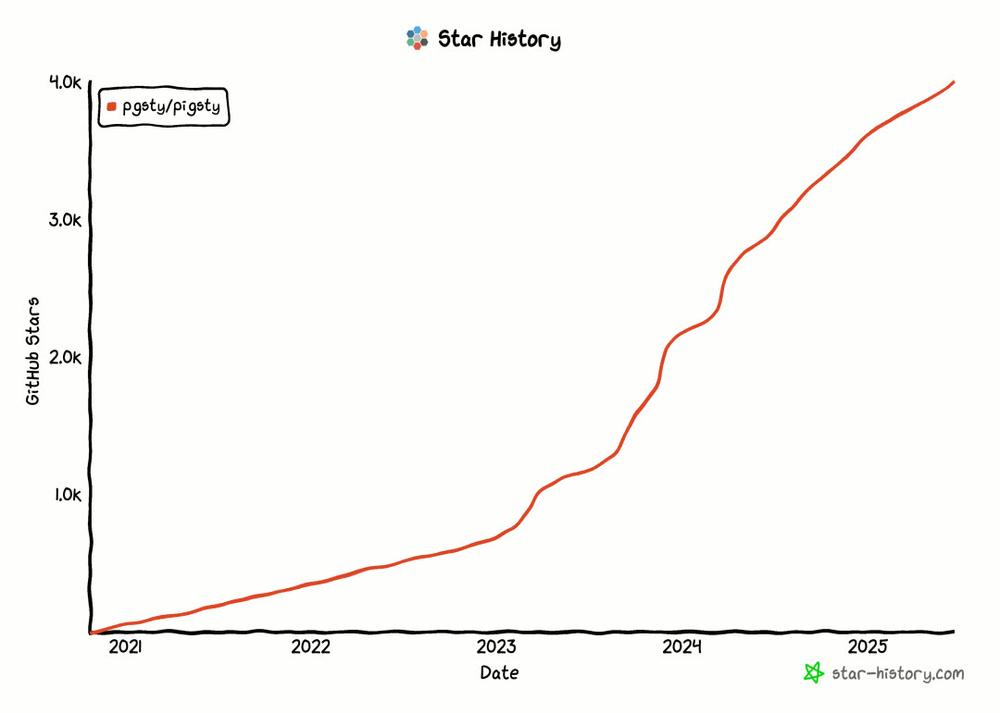

本版本带来全新文档网站、OrioleDB 和 OpenHalo 内核全平台支持、Supabase 自建优化、监控系统与架构优化、PostgreSQL 18 Beta 支持、例行 PG 小版本更新，以及 Apple ARM Vagrant 支持。


--------

## Pigsty 是什么？

Pigsty 是一个开箱即用的 PostgreSQL 数据库发行版，可视为数据库的"自动驾驶软件"。它能让用户以云 RDS 十分之一不到的成本，在无需专业 DBA 的情况下，快速拉起企业级 PostgreSQL 数据库服务 —— 具备高可用、PITR、监控系统、IaC 能力，以及 421 个 PG 生态扩展插件，直接运行在 10 个主流 Linux 发行版上，无需容器或 Kubernetes。

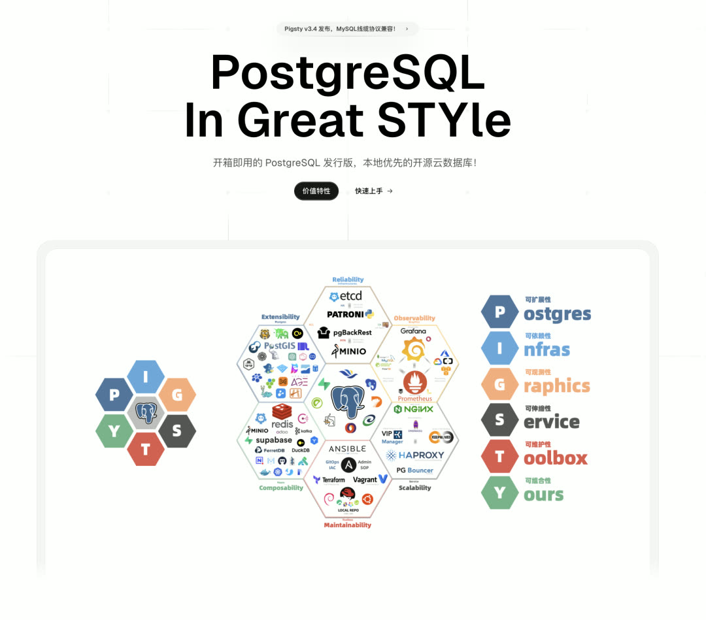

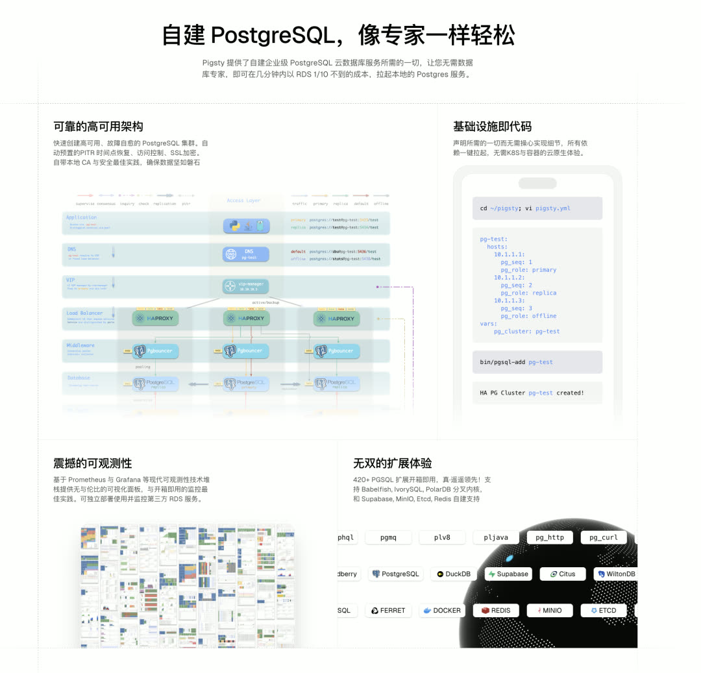


--------

## PostgreSQL 18 支持

PostgreSQL 18 Beta1 已发布，正式版本将于今年 9 月推出。PG 18 带来了 AIO、OAuth 等诸多强力新特性，现已可在 Pigsty 中尝鲜（但切勿用于生产环境）。同时提供 17.5、16.9、15.13、14.18、13.21 例行小版本更新支持。


Pigsty 提供了全新的 `pg18` 配置模板，可直接用于拉起基于 PostgreSQL 18 Beta1 内核的高可用 RDS。[pg_exporter](https://github.com/pgsty/pg_exporter) 也刚发布 1.0 版本，完整收录了 PG 18 的新监控指标。用户还可使用 `pig` 包管理器一键安装 PG 18 与 PGDG 中的相应扩展。


--------

## Supabase 自建优化

Pigsty 提供的"企业级" Supabase 自建能力广受欢迎 —— Supabase 自建教程的页面流量甚至超过了 Landing Page。本版本进一步优化了 Supabase 自建流程。

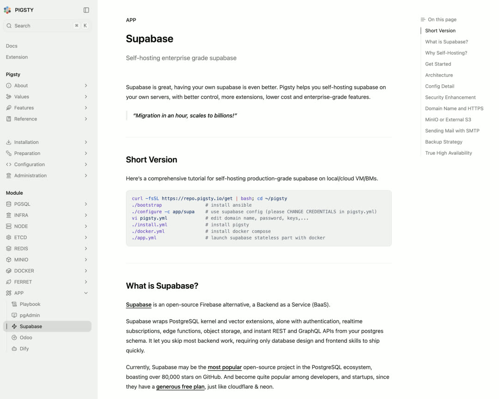

**pgsodium 密钥管理集成**：现可指定根密钥或提供密钥获取脚本，供 Supabase 依赖的 pgsodium 扩展使用，提供数据加密能力，并可从根密钥派生出一系列子密钥。

**logflare 复制槽问题修复**：Supabase Analytics logflare 组件存在一个缺陷 —— 当系统表没有更新写入时，它不会更新 WAL 消费进度，导致复制槽持续保留数据。Pigsty 通过预置的定时任务 `supa-kick` 每分钟执行"假更新"来触发进度推进，避免磁盘被撑爆。

同时跟进了 Supabase 相关扩展版本与 Docker 镜像版本。


--------

## OpenHalo 与 OrioleDB 全平台可用

[OpenHalo](https://github.com/HaloTech-Co-Ltd/openHalo) 内核在 PG 14 基础上提供 MySQL 兼容性，而 [OrioleDB](https://github.com/orioledb/orioledb) 内核则提供云原生的无膨胀版本 PG。在 v3.4 中仅提供了 RPM 包，现已在全部十个受支持的 Linux 系统上完整可用。

OrioleDB 已被 Supabase 收购，近日发布了第 11 个 Beta 版本。虽然尚未成为 Supabase 默认使用的 PG 内核分支，但 Pigsty 已提前做好准备 —— 确保 Supabase 一旦决定从原生 PG 切换到 OrioleDB，可以无缝跟进。


--------

## 421 个扩展插件

可用扩展数量达到 **421 个**，并对大量扩展进行了版本更新。值得关注的新扩展：

**pgsentinel**：可观测性扩展，提供类似 Oracle Active Session History 的功能，可记录每个会话的统计信息及等待事件。详见：https://pgsty.com/ext/pgsentinel

**spat**：一个有趣的实验性扩展，在 PG 中提供类似 Redis 的接口，使用共享内存实现类似 Redis 的性能表现。目前处于 Alpha 阶段，切勿用于生产。

全新的扩展百科网站已上线，比原版本更美观、更全面：

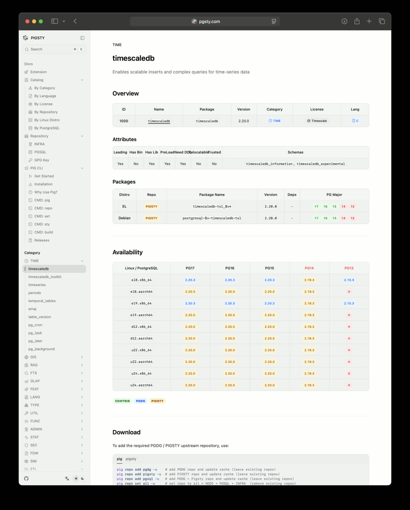


--------

## 全新文档站点

Pigsty 文档站基于 Next.js 进行了重制，从静态页面渲染迈入现代前端时代。新站点地址：[https://pgsty.com](https://pgsty.com)

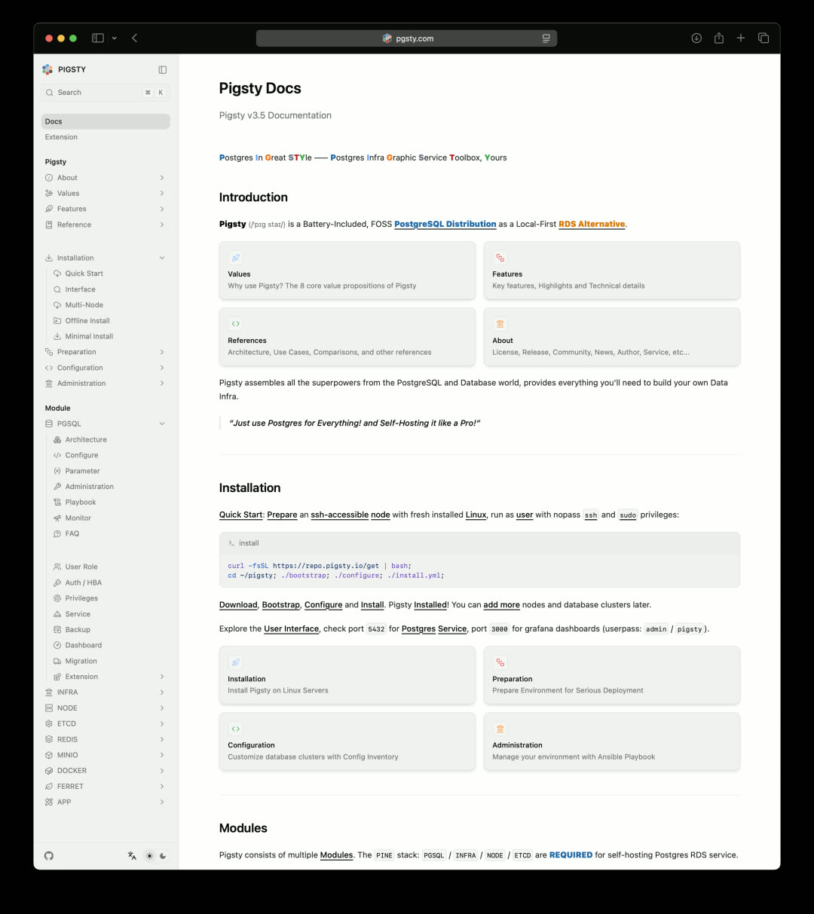

不仅形式上全面翻新，内容上也针对 3.5 版本进行了完整重写与梳理，清理修复了大量过时信息。目前仅提供英文版本，简体中文支持即将推出。


--------

## 架构优化

Pigsty v3.5 对 PGSQL 实现进行了深度优化：

- 合并减少任务数量
- 微调可用任务标签
- 统一模板文件命名
- 优化现代 NVMe 环境下的系统与数据库参数默认值
- 调整 roles 分工

**重要变更**：彻底移除了 `pgsql.yml` 剧本的删库功能。从 v3.5 起，删库操作仅能通过 `pgsql-rm.yml` 专用剧本执行，不再需要各种"安全阀"和"保险栓"。

重构后的 PGSQL 剧本任务：

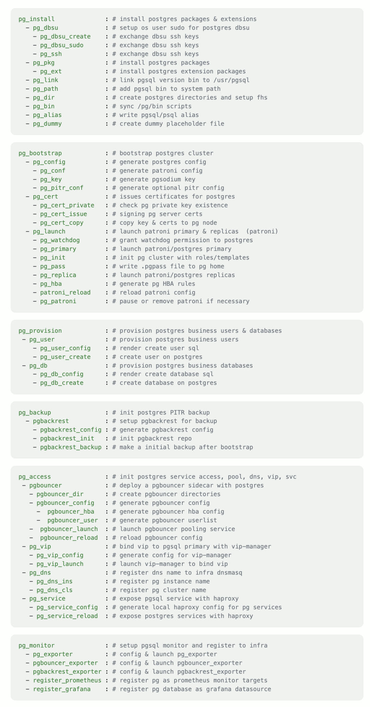

重构后的 pgsql-rm.yml 剧本任务：

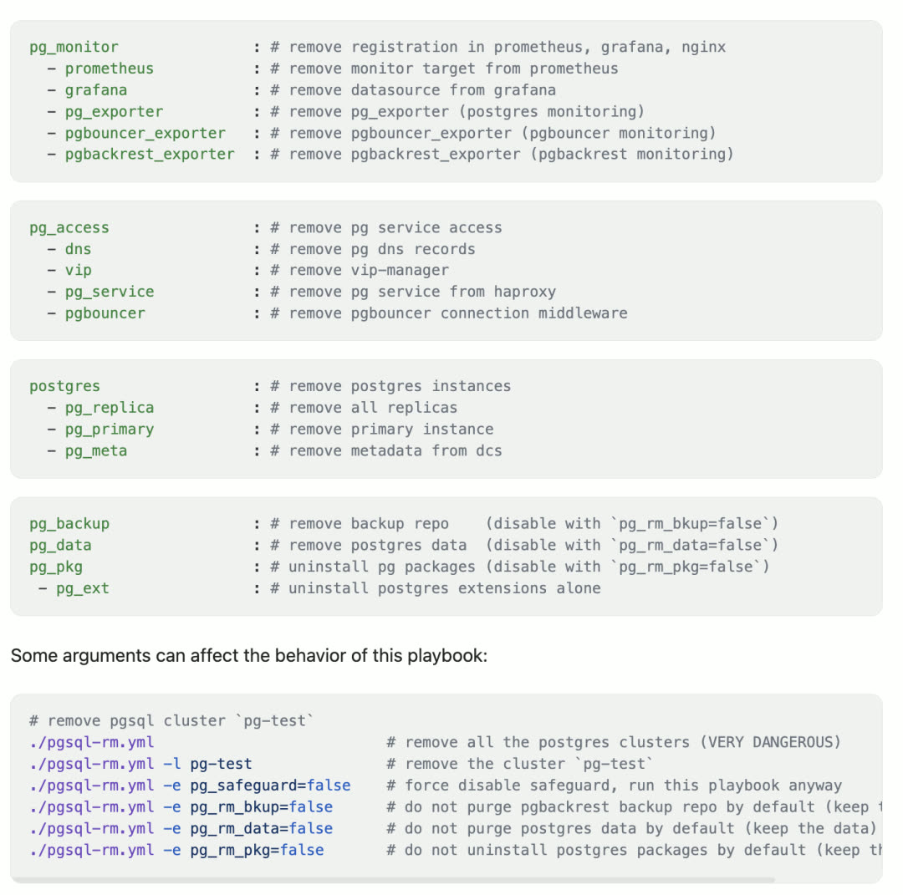


--------

## 命令行优化

`pig` 命令行工具新增 `do` 子命令，可替代原来 `pigsty/bin` 目录下的包装脚本，以统一、标准化的方式执行各类任务。

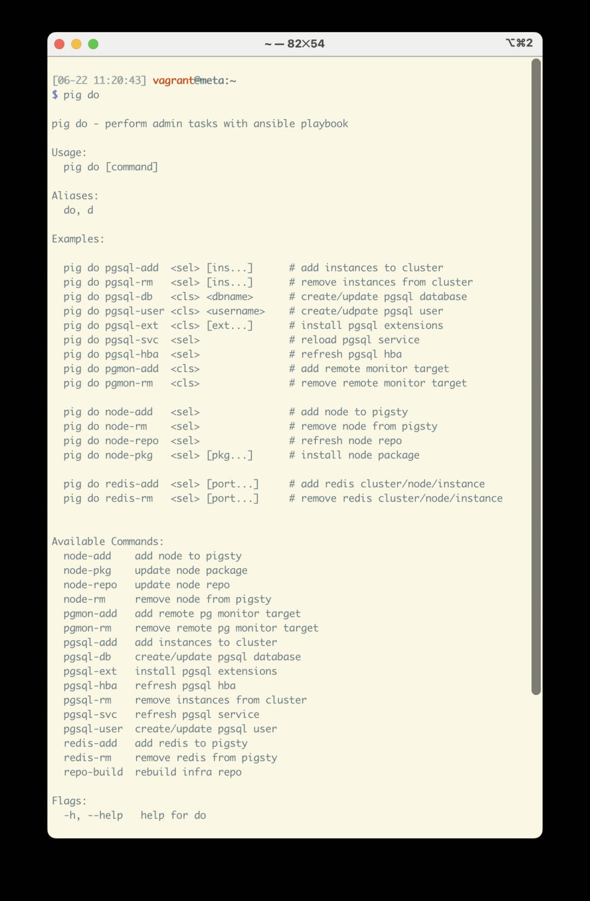

目前处于试点阶段，API 尚未最终固定，计划经过一段时间打磨后正式发布文档。


--------

## 监控优化

Grafana 12.0 发布，带来了不少 Breaking Changes，监控系统也相应进行了改进。

针对来自 Oracle DBA 用户提出的 AWR 需求进行了分析：其中大部分指标 PG 和 Pigsty 已经提供，唯一的例外是**等待事件**。

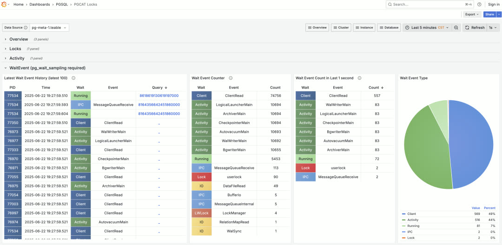

PG 内核本身只提供当前活动的等待状态，但没有历史等待事件记录。这只能通过插件实现 —— `pg_wait_sampling` 和 `pgsentinel` 都提供了此功能，监控面板也已支持等待事件分析。


--------

## Apple Vagrant 支持

Pigsty 提供 Vagrant / Terraform 沙箱模板，允许用户在本地/云端轻松拉起所需的虚拟机资源。此前 Vagrant / VirtualBox 对 Apple ARM 架构支持存在各种问题，经过重新测试，Vagrant + VirtualBox 组合现已在 Apple Silicon 上丝滑运行。

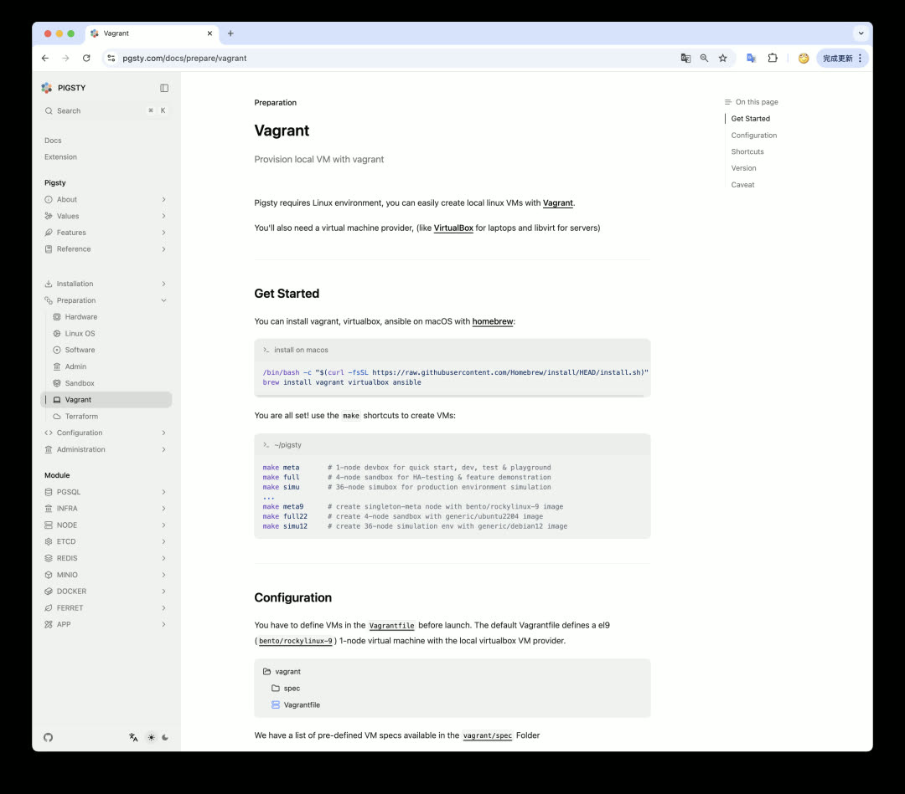

虽然并非所有 Vagrant Box 都提供了 ARM64 on VirtualBox 支持，但主要的 EL9 和 Ubuntu 24.04 已支持。这意味着用户可以在 Apple MacBook（无论是 Intel 还是 M 系列 ARM 架构）上顺畅拉起虚拟机并运行 Pigsty。


--------

## 下一步规划

下一个版本可能是 v3.6 或 v4.0。Pigsty v4.0 预计随 PostgreSQL 18 正式版一同发布（9 月）。

**计划中的改进**：

| 领域 | 规划 |
|-----|------|
| 操作系统 | 新增 EL 10 支持，编译打包所有扩展 |
| 日志收集 | promtail 替换为 vector |
| 安装流程 | 简化为三步走（Install / Configure / Deploy） |
| 许可证 | 考虑推出 Apache 许可的轻量化版本 |


--------
--------

## v3.5.0

Pigsty v3.5.0 版本发布，支持 PostgreSQL 18 Beta！

```bash
curl https://repo.pigsty.cc/get | bash -s v3.5.0
```

--------

### 亮点特性

- 支持 PG 18 (Beta)，扩展更新，总数达到 421 个
- OrioleDB 与 OpenHalo 内核在全平台上可用
- 可使用 `pig do` 子命令代替 `bin` 脚本
- Supabase 自建加强，解决若干遗留问题，例如复制延迟与密钥分发
- 代码重构与架构优化，优化了 Postgres 与 Pgbouncer 默认参数
- 更新了 Grafana 12, pg_exporter 1.0 与相关插件，翻修面板

--------

### PostgreSQL 18 支持

- 支持 PostgreSQL 18
- 通过 pg_exporter 1.0.0 支持 PG18 监控指标
- 通过 pig 0.4.1 支持 PG18 安装 Alias
- 提供 `pg18` 配置模板

--------

### 代码重构

- PGSQL 重构，将 PG 监控抽离为单独的 `pg_monitor` 角色，移除 `clean` 逻辑
- 去除冗余重复的任务，合并同类项，精简配置。移除 `dir/utils` 任务块
- 所有扩展默认安装至 `extensions` 模式中（与 supabase 安全实践保持一致）
- 重命名模板文件，移除所有 `.j2` 后缀
- 为所有模板中的 `monitor` 函数添加 `SET` 命令清空 `search_path`，遵循 Supabase 安全最佳实践
- 调整 pgbouncer 默认参数，增大默认链接池大小，设置链接池清理查询
- 新增参数 `pgbouncer_ignore_param`，允许配置 pgbouncer 忽略的参数列表
- 新增任务 `pg_key` 用于生成 `pgsodium` 所需的服务端密钥
- 针对 PG 17 默认启用 `sync_replication_slots`
- 重新调整了子任务标签，使其更符合配置小节的拆分逻辑

--------

### 模块重构

- 重构 `pg_remove` 模块
  - 重命名参数：`pg_rm_data`, `pg_rm_bkup`, `pg_rm_pkg` 用于控制删除的内容
  - 重新调整角色代码结构，使用更清楚的标签进行划分
- 新增 `pg_monitor` 模块
  - `pgbouncer_exporter` 现在不再和 `pg_exporter` 共享配置文件
  - 新增了 TimescaleDB，Citus，pg_wait_event 的监控指标
  - 使用 `pg_exporter` 1.0.0，更新了 PG16/17/18 相关监控指标
  - 使用更为紧凑，全新设计的指标收集器配置文件

--------

### Supabase 加强

感谢来自 [@lawso017](https://github.com/lawso017) 的贡献！

- 将 Supabase 容器镜像与数据库模式更新至最新版本
- 现在默认支持 `pgsodium` 服务端密钥加载
- 通过 supa-kick 定时任务解决 logflare 无法及时更新复制进度的问题
- 为 monitor 模式中的函数添加 `set search_path` 子句以遵循安全最佳实践

--------

### CLI 与监控更新

- CLI 新增 `pig do` 命令，允许通过命令行工具替代 `bin/` 中的 Shell 脚本
- 更新 Grafana 大版本至 12.0.0，更新相关插件/数据源软件包
- 更新 Postgres 数据源 uid 命名方式（以适应新的 `uid` 长度限制与字符限制）
- 新增了 Static Datasource
- 更新了现有 Dashboard，修复若干遗留问题

--------

### 基础设施软件包更新

- pig 0.4.2
- duckdb 1.3.0
- etcd 3.6.0
- vector 0.47.0
- minio 20250422221226
- mcli 20250416181326
- pev 1.5.0
- rclone 1.69.3
- mtail 3.0.8 (new)

--------

### 可观测性软件包更新

- grafana 12.0.0
- grafana-victorialogs-ds 0.16.3
- grafana-victoriametrics-ds 0.15.1
- grafana-infinity-ds 3.2.1
- grafana_plugins 12.0.0
- prometheus 3.4.0
- pushgateway 1.11.1
- nginx_exporter 1.4.2
- pg_exporter [1.0.0](https://github.com/pgsty/pg_exporter/releases/tag/v1.0.0)
- pgbackrest_exporter 0.20.0
- redis_exporter 1.72.1
- keepalived_exporter 1.6.2
- victoriametrics 1.117.1
- victoria_logs 1.22.2

--------

### 数据库软件包更新

- PostgreSQL 17.5, 16.9, 15.13, 14.18, 13.21
- PostgreSQL 18beta1 支持
- pgbouncer 1.24.1
- pgbackrest 2.55
- pgbadger 13.1

--------

### PG 扩展包更新

- spat [0.1.0a4](https://github.com/Florents-Tselai/spat) 新扩展
- pgsentinel [1.1.0](https://github.com/pgsentinel/pgsentinel/releases/tag/v1.1.0) 新扩展
- pgdd [0.6.0](https://github.com/rustprooflabs/pgdd) (pgrx 0.14.1) 新扩展
- convert [0.0.4](https://github.com/rustprooflabs/convert) (pgrx 0.14.1) 新扩展
- pg_tokenizer.rs [0.1.0](https://github.com/tensorchord/pg_tokenizer.rs) (pgrx 0.13.1)
- pg_render [0.1.2](https://github.com/mkaski/pg_render) (pgrx 0.12.8)
- pgx_ulid [0.2.0](https://github.com/pksunkara/pgx_ulid) (pgrx 0.12.7)
- pg_idkit [0.3.0](https://github.com/VADOSWARE/pg_idkit) (pgrx 0.14.1)
- pg_ivm [1.11.0](https://github.com/sraoss/pg_ivm)
- orioledb [1.4.0 beta11](https://github.com/orioledb/orioledb) 新增 debian/ubuntu 支持
- openhalo [14.10](https://github.com/HaloTech-Co-Ltd/openHalo) 新增 debian/ubuntu 支持
- omnigres 20250507 (在 d12/u22 编译最新版本失败)
- citus [12.0.3](https://github.com/citusdata/citus/releases/tag/v13.0.3)
- timescaledb [2.20.0](https://github.com/timescale/timescaledb/releases/tag/2.20.0) (移除 PG14 支持)
- supautils [2.9.2](https://github.com/supabase/supautils/releases/tag/v2.9.2)
- pg_envvar [1.0.1](https://github.com/theory/pg-envvar/releases/tag/v1.0.1)
- pgcollection [1.0.0](https://github.com/aws/pgcollection/releases/tag/v1.0.0)
- aggs_for_vecs [1.4.0](https://github.com/pjungwir/aggs_for_vecs/releases/tag/1.4.0)
- pg_tracing [0.1.3](https://github.com/DataDog/pg_tracing/releases/tag/v0.1.3)
- pgmq [1.5.1](https://github.com/pgmq/pgmq/releases/tag/v1.5.1)
- tzf-pg [0.2.0](https://github.com/ringsaturn/tzf-pg/releases/tag/v0.2.0) (pgrx 0.14.1)
- pg_search [0.15.18](https://github.com/paradedb/paradedb/releases/tag/v0.15.18) (pgrx 0.14.1)
- anon [2.1.1](https://gitlab.com/dalibo/postgresql_anonymizer/-/tree/latest/debian?ref_type=heads) (pgrx 0.14.1)
- pg_parquet [0.4.0](https://github.com/CrunchyData/pg_parquet/releases/tag/v0.3.2) (0.14.1)
- pg_cardano [1.0.5](https://github.com/Fell-x27/pg_cardano/commits/master/) (pgrx 0.12) -> 0.14.1
- pglite_fusion [0.0.5](https://github.com/frectonz/pglite-fusion/releases/tag/v0.0.5) (pgrx 0.12.8) -> 14.1
- vchord_bm25 [0.2.1](https://github.com/tensorchord/VectorChord-bm25/releases/tag/0.2.1) (pgrx 0.13.1)
- vchord [0.3.0](https://github.com/tensorchord/VectorChord/releases/tag/0.3.0) (pgrx 0.13.1)
- pg_vectorize [0.22.1](https://github.com/ChuckHend/pg_vectorize/releases/tag/v0.22.1) (pgrx 0.13.1)
- wrappers [0.4.6](https://github.com/supabase/wrappers/releases/tag/v0.4.6) (pgrx 0.12.9)
- timescaledb-toolkit [1.21.0](https://github.com/timescale/timescaledb-toolkit/releases/tag/1.21.0) (pgrx 0.12.9)
- pgvectorscale [0.7.1](https://github.com/timescale/pgvectorscale/releases/tag/0.7.1) (pgrx 0.12.9)
- pg_session_jwt [0.3.1](https://github.com/neondatabase/pg_session_jwt/releases/tag/v0.3.1) (pgrx 0.12.6) -> 0.12.9
- pg_timetable 5.13.0
- ferretdb 2.2.0
- documentdb [0.103.0](https://github.com/FerretDB/documentdb/releases/tag/v0.103.0-ferretdb-2.2.0) (新增 aarch64 支持)
- pgml [2.10.0](https://github.com/postgresml/postgresml/releases/tag/v2.10.0) (pgrx 0.12.9)
- sqlite_fdw [2.5.0](https://github.com/pgspider/sqlite_fdw/releases/tag/v2.5.0) (fix pg17 deb)
- tzf [0.2.2](https://github.com/ringsaturn/pg-tzf/releases/tag/v0.2.2) 0.14.1 (rename src)
- pg_vectorize [0.22.2](https://github.com/ChuckHend/pg_vectorize/releases/tag/v0.22.2) (pgrx 0.13.1)
- wrappers [0.5.0](https://github.com/supabase/wrappers/releases/tag/v0.5.0) (pgrx 0.12.9)

--------

### 校验和

```bash
ab91bc05c54b88c455bf66533c1d8d43  pigsty-v3.5.0.tgz
4c9fabc2d1f0ed733145af2b6aff2f48  pigsty-pkg-v3.5.0.d12.x86_64.tgz
796d47de12673b2eb9882e527c3b6ba0  pigsty-pkg-v3.5.0.el8.x86_64.tgz
a53ef2cede1363f11e9faaaa43718fdc  pigsty-pkg-v3.5.0.el9.x86_64.tgz
36da28f97a845fdc0b7bbde2d3812a67  pigsty-pkg-v3.5.0.u22.x86_64.tgz
8551b3e04b38af382163e6857778437d  pigsty-pkg-v3.5.0.u24.x86_64.tgz
```

--------

更多版本信息请参考 [GitHub 发布页面](https://github.com/pgsty/pigsty/releases/tag/v3.5.0)。
