> [**GitHub Release**](https://github.com/pgsty/pigsty/releases/tag/v3.6.0) | [**发布注记**](https://pigsty.cc/docs/releasenote/#v360) | [微信公众号](https://mp.weixin.qq.com/s/TdJ5lOWxU_CzxsgjslPxwg)

[](https://github.com/pgsty/pigsty/releases/tag/v3.6.0)

Pigsty v3.6 正式发布。历经两个月的精心打磨，这将是 v4.0 之前的最后一个主要版本，进行了大量重构与改进，为打造终极全能 PostgreSQL 发行版奠定了坚实基础。

本版本对 PostgreSQL、MinIO、Etcd 的部署任务进行了深度优化与重构，新增了 **Percona PG TDE** 内核支持，提供开箱即用的透明加密功能。此外，Supabase 自建体验得到全面优化，彻底移除了幂等剧本中的"删库"功能，并新增全自动 `pgsql-pitr` 剧本用于一键时间点恢复。

安装流程也进一步简化：从四步走变为三步走（下载、配置、安装），且默认采用在线安装模式，可跳过本地软件仓库的构建过程。


--------

## 全新内核支持：Percona PG TDE

Percona 的 `pg_tde` 扩展经过数年长跑，终于正式发布 1.0 GA 版本。许多"企业级" PostgreSQL 发行版以"透明加解密"作为核心卖点，而 `pg_tde` 可能是第一个足够成熟的开源透明加密扩展，为开源 PostgreSQL 提供了真正意义上的企业级透明加密解决方案。

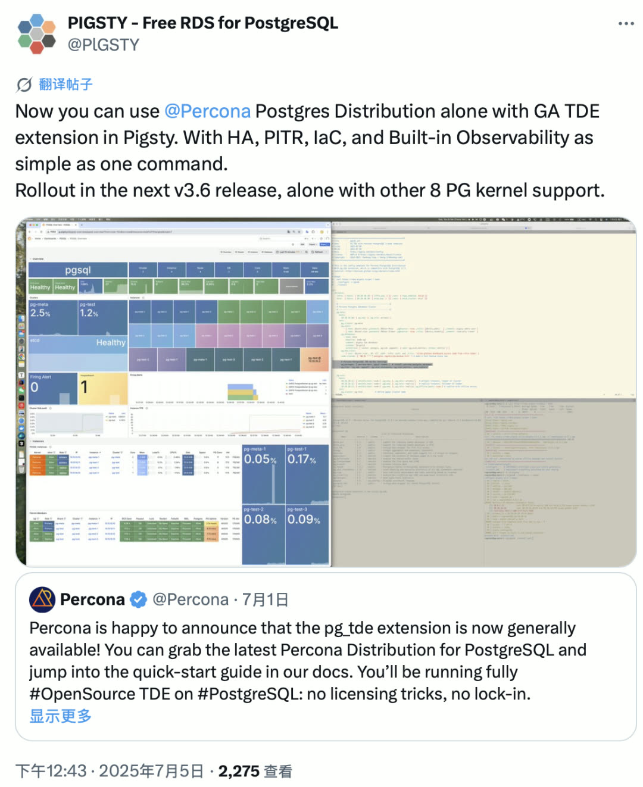

目前该扩展需要运行在打过补丁的 PostgreSQL 内核上 —— 即 Percona 的 Postgres 发行版。Pigsty 在官宣后即刻完成了支持，只需两行命令即可启用并安装，同时享受 Pigsty 提供的完整 RDS 能力：监控、高可用、PITR、IaC 等，与原生 PG 内核别无二致。

至此，Pigsty 支持的 PostgreSQL 内核数量已达到 **10 个**。

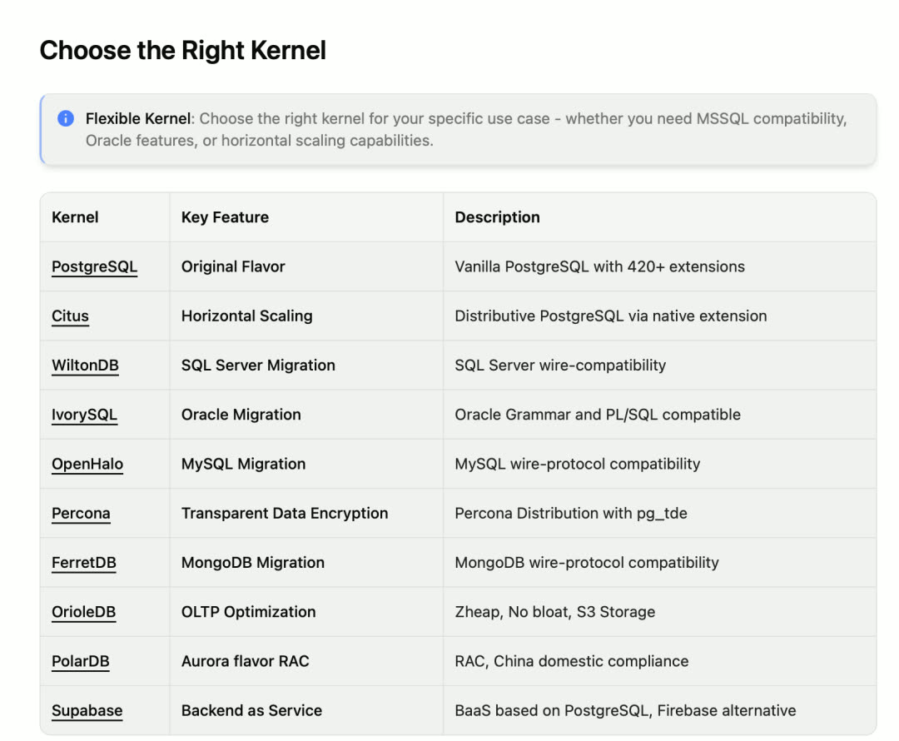

Pigsty 已成为 PostgreSQL 发行版的发行版 —— 一个"**元发行版**"。各家 PostgreSQL 分支内核均可在 Pigsty 的加持下，转化为具备高可用、监控、IaC、PITR 能力的"企业级数据库服务"。


--------

## 扩展生态持续强化

除 Percona 透明加密内核外，OrioleDB 也发布了 1.5 beta12 版本，Supabase CEO 透露其即将正式 GA。Pigsty 已第一时间编译了 OrioleDB 补丁版本的 PG 及其扩展。

另一个值得关注的扩展是 `pgactive` —— 由 AWS 开发并开源的 **PG 多活扩展**，声称解决了亚秒级高可用切换问题。该扩展依赖缺失的 `pgfeutils`，编译有一定门槛，Pigsty 已提供开箱即用的二进制包。

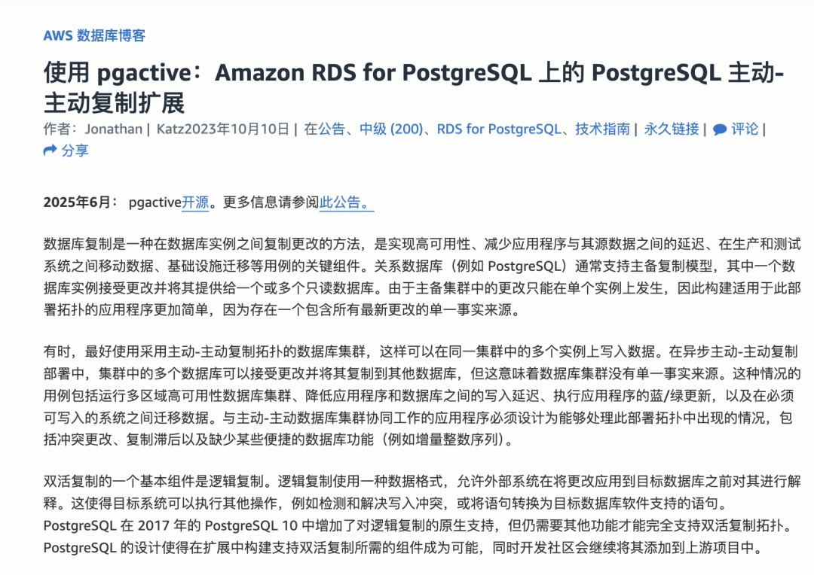

可用扩展数量达到 **423 个**。PG18 beta2、OrioleDB、TimescaleDB、Citus、FerretDB & DocumentDB、DuckDB、Etcd 等均完成例行版本更新。

扩展目录站点也已全面翻新，采用 Next.js 重构，观感大幅提升，新地址：[https://ext.pgsty.com](https://ext.pgsty.com)

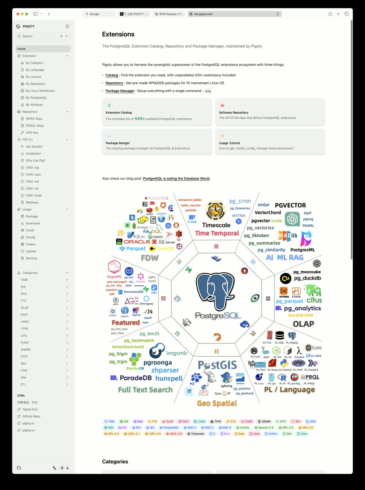


--------

## Supabase 自建体验优化

Pigsty v3.6 提供了更流畅的 Supabase 自建体验，并修复了 Supabase 官方模板中的若干问题：

- logflare 复制槽不推进
- 大量打印错误日志
- Studio 无法查看两项 Analytics 日志

生产级 Supabase 自建只需几行命令即可完成：

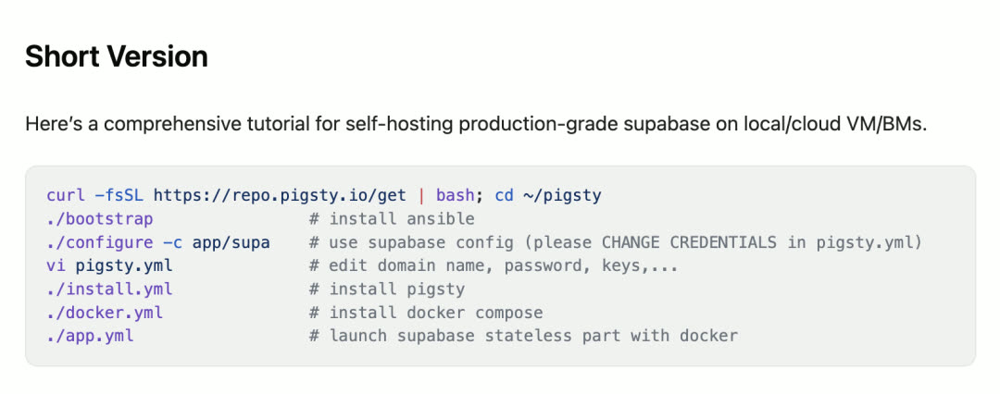

此外，Pigsty 现默认使用由 1Panel 提供的 Docker 镜像站点，国内下载速度显著提升。

目前 Pigsty 和 StackGres 是仅有的两个自建 Supabase 方案的开源供应商：Pigsty 基于裸 Linux 系统交付，StackGres 基于 Kubernetes 交付。


--------

## PITR 恢复增强

此前版本中，Pigsty 提供 `pg-pitr` 脚本用于"半自动"辅助 PITR 恢复。本版本新增了全自动的 `pgsql-pitr` 剧本，实现一键时间点恢复。

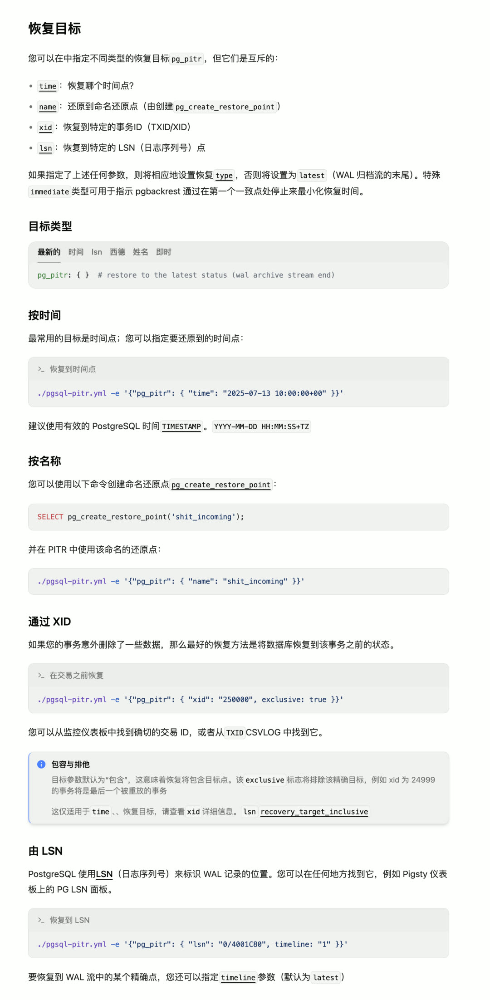

该剧本会自动执行以下操作：

- 暂停高可用切换
- 关闭 PostgreSQL
- 生成并执行 pgbackrest PITR 恢复命令至指定目标位点
- 校验后重新拉起 PostgreSQL
- 重新启用高可用切换

支持快速重试（原地增量），便于精确定位恢复位点。同时新增了一种新用例：在新启动的实例（或摘下的从库）上执行 PITR 恢复，避免影响现有业务，然后从新实例抽取数据手工导入。


--------

## ETCD 管理简化

本版本对 Etcd 模块进行了重构，新增独立的 `etcd-rm.yml` 剧本与扩缩容 SOP 脚本。

此前扩缩容 etcd 涉及一系列复杂的命令操作，现在只需简单几条命令：

```bash
bin/etcd-add              # 创建 etcd 集群，或刷新现有集群状态
bin/etcd-add 10.10.10.11  # 扩容 etcd 集群，新增一个成员
bin/etcd-rm               # 移除整个 etcd 集群
bin/etcd-rm 10.10.10.11   # 将指定成员从集群中移除
```

`etcd.yml` 剧本现**不再清理现有 ETCD 集群**，清理工作由专门的 roles 与剧本实现，维护变得更加简单明了。


--------

## MinIO 模块改进

MinIO 模块进行了重构，新增 Plain HTTP 模式，并调整了默认桶与用户配置。

此前版本默认为 MinIO 启用 HTTPS（通过本地 CA 签发自签名证书），可避免内网流量窃听，但也带来一些烦恼：Pigsty 管理节点之外的客户端（如容器）需要信任该 CA 才能访问 MinIO。

本版本新增开关，允许 MinIO 运行在纯 HTTP 模式下。需注意：pgbackrest 不接受 HTTP 模式的 MinIO，若使用本地 MinIO 存储 PG 备份仍需 HTTPS 模式。HTTP 模式仅适用于纯粹给外部服务使用的场景。

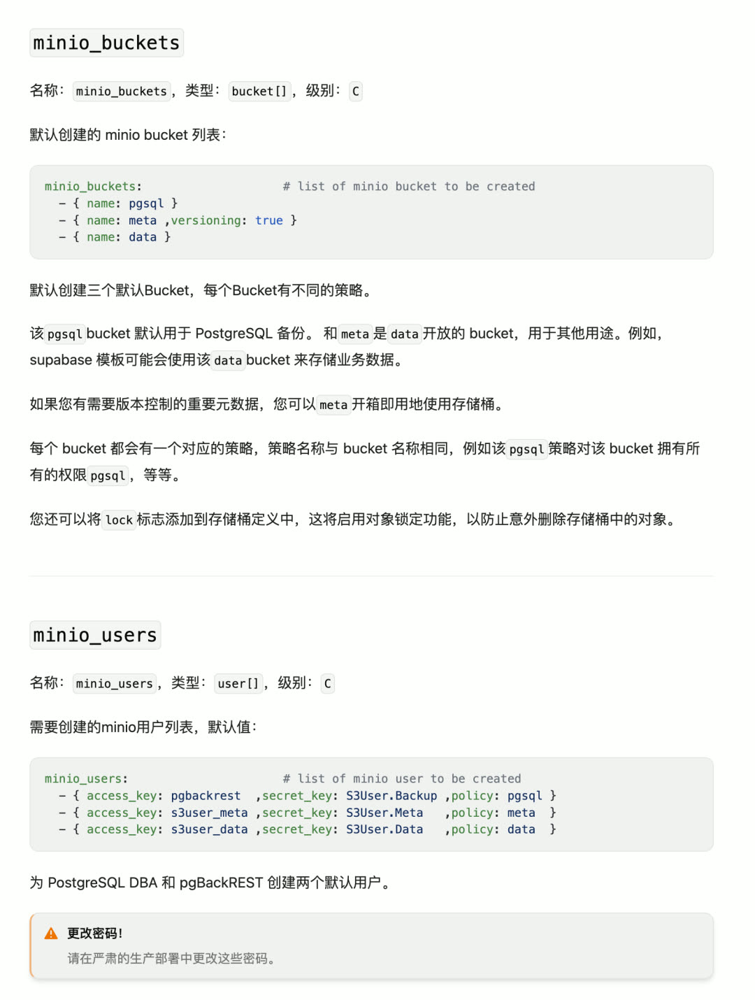

默认桶配置也进行了调整：

| 原配置 | 新配置 |
|-------|-------|
| pgsql, infra, redis | pgsql, meta, data |

同时为 `meta` 和 `data` 桶创建了专用用户 `s3user_meta` 与 `s3user_data`，并为每个桶创建同名策略。如此设计下，Supabase、Dify 等应用可直接使用这两个桶，无需手动创建。


--------

## 安装流程简化

安装步骤从四步简化为三步：

| 原流程 | 新流程 |
|-------|-------|
| 下载 → 引导 → 配置 → 安装 | 下载 → 配置 → 安装 |

"引导"步骤（解压离线软件包或配置上游软件仓库以安装 Ansible）已合并到下载脚本中，执行安装脚本时会自动执行 `./bootstrap`。

```bash
curl -fsSL https://repo.pigsty.io/get | bash; cd ~/pigsty; ./configure; ./install.yml
```

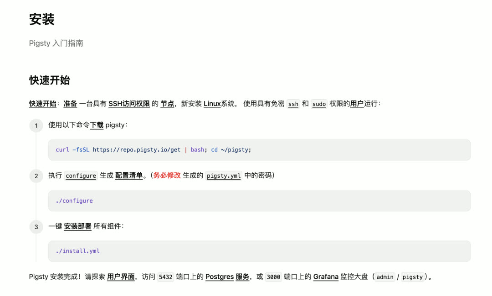


--------

## 默认在线安装

默认安装策略发生变化：不再先下载到本地再安装，而是直接从互联网上游安装。

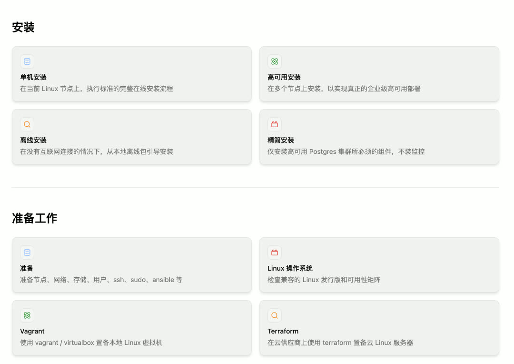

这一改变带来显著好处：

- **减少出错点**：许多用户反馈的安装报错都发生在本地 Repo 下载和 Nginx 服务拉起阶段（如 el9.aarch64 上 PGDG 配置错误导致的 patroni-etcd 安装失败）
- **提升速度**：只下载真正需要安装的包，而非一次性下载所有包
- **简化配置**：无需处理 Nginx 的安全策略和防火墙配置问题

大比例用户在单节点 Linux 上安装 Pigsty，"不需要"本地软件仓库提供的多节点一致性。需要本地仓库的用户可通过简单配置（`repo_enabled`、`node_repo_modules`）重新启用，或直接使用默认启用本地仓库的 `rich` / `full` 模板。


--------

## 全新文档站

全新文档站点已上线：[https://doc.pgsty.com](https://doc.pgsty.com)

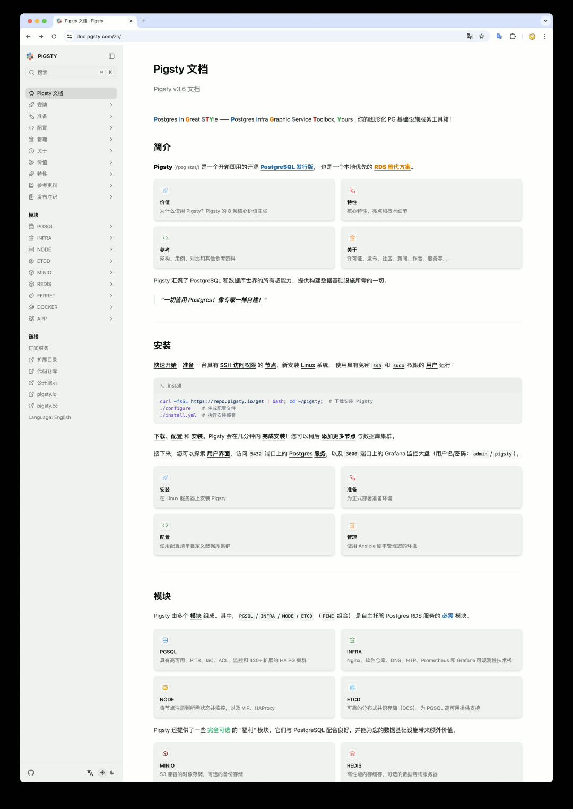

该站点采用 Next.js 与 Fumadocs 现代前端技术栈打造，感谢兰天游与 Claude Code 的强力助攻。英文版已基本完工，中文版正在翻译建设中。欢迎通过 GitHub PR 或 Issue 参与贡献。


--------

## 其他改进

- **tuned 模块优化**：针对现代硬件与 NVMe 磁盘进行优化，移除过时配置参数，新增 NVMe / 虚拟化 SSD 的调度/预读参数优化
- **MCP Toolbox 集成**：集成了 Google 新发布的 MCP Toolbox（数据库 MCP 工具箱），预置模板 SQL 解决部分数据库安全性问题
- **配置模板调整**：所有配置模板调整为**单节点**模式，便于快速上手


--------

## 下一步：v4.0 与 DBA Agent

PostgreSQL 18 将于今年 9 月发布，Pigsty 计划在 PG 18 发布后正式发布 v4.0 版本，主要改进方向：

| 领域 | 计划 |
|-----|------|
| CLI 工具 | pig 完整封装 Ansible 剧本功能，接口初步定型 |
| 监控系统 | VictoriaMetrics / VictoriaLogs 替代 Prometheus / Loki |
| 日志收集 | vector 替代过时的 promtail |
| 门户组件 | 考虑使用 Caddy 替代 Nginx（待定） |

v4.x 的主旋律将是 **DBA Agent**。Pigsty 已具备 DBA Agent 所需的完整上下文，核心正是这套 PG 最强监控系统。待文档中沉淀的领域知识足够丰富，为 Pig 命令行工具套上 MCP，一个能打的全自动驾驶数据库 DBA Agent 便将诞生。

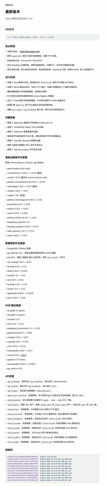


--------
--------

## v3.6.0

Pigsty v3.6.0 版本发布，全新文档站与 PITR 增强！

```bash
curl https://repo.pigsty.cc/get | bash -s v3.6.0
```

### 亮点特性

- 全新文档站：https://doc.pgsty.com
- 新增 `pgsql-pitr` 剧本与备份/恢复教程，改善 PITR 体验
- 新增内核支持：Percona PG TDE (PG17)
- 优化 Supabase 自建体验，更新至最新版本，并解决了一系列官方模板的问题
- 简化安装步骤，默认使用在线安装，更加高效简单，bootstrap 过程（安装ansible）嵌入安装脚本中

### 设计改进

- 改善了 Etcd 模块的实现，新增独立的 `etcd-rm.yml` 剧本与扩缩容 SOP 脚本
- 改善了 MinIO 模块的实现，支持 HTTP 模式，创建不同属性的三个桶供开箱即用
- 重新调整梳理了所有配置模板，使用更为便利
- 针对中国大陆使用速度更快的 Docker Registry 镜像站
- 优化了 tuned 操作系统参数模板，针对现代硬件与 NVMe 磁盘优化
- 新增扩展 `pgactive` 用于多主复制与亚秒级故障切换
- 调整 `pg_fs_main` / `pg_fs_backup` 默认值，简化文件目录结构设计

### 问题修复

- 修复了 pgbouncer 配置文件的错误 by @housei-zzy
- 修复了 OrioleDB 在 Debian 平台上的问题
- 修复了 tuned shm 配置参数的问题
- 离线软件包直接使用 PGDG 源，避免使用断开同步的镜像站点
- 修复了 IvorySQL libxcrypt 依赖的问题
- 替换了破损与缓慢的 EPEL 软件仓库站点
- 修复了 `haproxy_enabled` 标记位的功能

### 基础设施软件包更新

新增 Victoria Metrics / Victoria Logs 相关包：

- genai-toolbox 0.9.0 (new)
- victoriametrics 1.120.0 -> 1.121.0 (重构)
- vmutils 1.121.0 (重命名 victoria-metrics-utils)
- grafana-victoriametrics-ds 0.15.1 -> 0.17.0
- victorialogs 1.24.0 -> 1.25.1 (重构)
- vslogcli 1.24.0 -> 1.25.1
- vlagent 1.25.1 (新增)
- grafana-victorialogs-ds 0.16.3 -> 0.18.1
- prometheus 3.4.1 -> 3.5.0
- grafana 12.0.0 -> 12.0.2
- vector 0.47.0 -> 0.48.0
- grafana-infinity-ds 3.2.1 -> 3.3.0
- keepalived_exporter 1.7.0
- blackbox_exporter 0.26.0 -> 0.27.0
- redis_exporter 1.72.1 -> 1.77.0
- rclone 1.69.3 -> 1.70.3

### 数据库软件包更新

- PostgreSQL 18 Beta2 更新
- pg_exporter 1.0.1，更新至最新依赖并提供 Docker 镜像
- pig 0.6.0，更新了最新扩展与仓库列表，带有 `pig install` 子命令
- vip-manager 3.0.0 -> 4.0.0
- ferretdb 2.2.0 -> 2.3.1
- dblab 0.32.0 -> 0.33.0
- duckdb 1.3.1 -> 1.3.2
- etcd 3.6.1 -> 3.6.3
- ferretdb 2.2.0 -> 2.4.0
- juicefs 1.2.3 -> 1.3.0
- tigerbeetle 0.16.41 -> 0.16.50
- pev2 1.15.0 -> 1.16.0

### PG 扩展包更新

- OrioleDB 1.5 beta12
- OriolePG 17.11
- plv8 3.2.3 -> 3.2.4
- postgresql_anonymizer 2.1.1 -> 2.3.0
- pgvectorscale 0.7.1 -> 0.8.0
- wrappers 0.5.0 -> 0.5.3
- supautils 2.9.1 -> 2.10.0
- citus 13.0.3 -> 13.1.0
- timescaledb 2.20.0 -> 2.21.1
- vchord 0.3.0 -> [0.4.3](https://github.com/tensorchord/VectorChord/releases/tag/0.4.3)
- pgactive 2.1.5 (new)
- documentdb 0.103.0 -> 0.105.0
- pg_search 0.17.0


### API 变更

* `pg_fs_backup`：重命名为 `pg_fs_backup`，默认值为 `/data/backups`。
* `pg_rm_bkup`：重命名为 `pg_rm_backup`，默认值为 `true`。
* `pg_fs_main`：现在默认值调整为 `/data/postgres`。
* `nginx_cert_validity`：新增参数，用于控制 Nginx 自签名证书的有效期，默认为 `397d`。
* `minio_buckets`：默认值调整为创建名为 `pgsql`、`meta`、`data` 的三个桶。
* `minio_users`：移除 `dba` 用户，新增 `s3user_meta` 和 `s3user_data` 用户，分别对应 `meta` 和 `data` 桶。
* `minio_https`：新增参数，允许配置 MinIO 使用 HTTP 模式。
* `minio_provision`：新增参数，允许跳过 MinIO 置备阶段（跳过桶和用户的创建）。
* `minio_safeguard`：新增参数，启用后会在执行 `minio-rm.yml` 时中止操作。
* `minio_rm_data`：新增参数，控制在执行 `minio-rm.yml` 时是否删除 minio 数据目录。
* `minio_rm_pkg`：新增参数，控制在执行 `minio-rm.yml` 时是否卸载 minio 软件包。
* `etcd_learner`：新增参数，允许 etcd 以学习者身份初始化。
* `etcd_rm_data`：新增参数，控制在执行 `etcd-rm.yml` 时是否删除 etcd 数据目录。
* `etcd_rm_pkg`：新增参数，控制在执行 `etcd-rm.yml` 时是否卸载 etcd 软件包。

### 校验和

```bash
df64ac0c2b5aab39dd29698a640daf2e  pigsty-v3.6.0.tgz
cea861e2b4ec7ff5318e1b3c30b470cb  pigsty-pkg-v3.6.0.d12.aarch64.tgz
2f253af87e19550057c0e7fca876d37c  pigsty-pkg-v3.6.0.d12.x86_64.tgz
0158145b9bbf0e4a120b8bfa8b44f857  pigsty-pkg-v3.6.0.el8.aarch64.tgz
07330d687d04d26e7d569c8755426c5a  pigsty-pkg-v3.6.0.el8.x86_64.tgz
311df5a342b39e3288ebb8d14d81e0d1  pigsty-pkg-v3.6.0.el9.aarch64.tgz
92aad54cc1822b06d3e04a870ae14e29  pigsty-pkg-v3.6.0.el9.x86_64.tgz
c4fadf1645c8bbe3e83d5a01497fa9ca  pigsty-pkg-v3.6.0.u22.aarch64.tgz
5477ed6be96f156a43acd740df8a9b9b  pigsty-pkg-v3.6.0.u22.x86_64.tgz
196169afc1be02f93fcc599d42d005ca  pigsty-pkg-v3.6.0.u24.aarch64.tgz
dbe5c1e8a242a62fe6f6e1f6e6b6c281  pigsty-pkg-v3.6.0.u24.x86_64.tgz
```


更多版本信息请参考 [GitHub 发布页面](https://github.com/pgsty/pigsty/releases/tag/v3.6.0)。


--------

## v3.6.1

Pigsty v3.6.1 版本发布，PostgreSQL 小版本更新！

```bash
curl https://repo.pigsty.cc/get | bash -s v3.6.1
```


### 亮点特性

- PostgreSQL 17.6, 16.10, 15.14, 14.19, 13.22, 以及 18 Beta 3 支持
- 在中国大陆地区使用 Pigsty 提供的 PGDG APT/YUM 镜像解决更新断供问题
- 新的网站首页：https://pgsty.com
- 增加了 el10, debian 13 的实现存根，以及 el10 的 Terraform 镜像


### 基础设施软件包更新

- Grafana 12.1.0
- pg_exporter 1.0.2
- pig 0.6.1
- vector 0.49.0
- redis_exporter 1.75.0
- mongo_exporter 0.47.0
- victoriametrics 1.123.0
- victorialogs: 1.28.0
- grafana-victoriametrics-ds 0.18.3
- grafana-victorialogs-ds 0.19.3
- grafana-infinity-ds 3.4.1
- etcd 3.6.4
- ferretdb 2.5.0
- tigerbeetle 0.16.54
- genai-toolbox 0.12.0


### 数据库软件包更新

- pg_search 0.17.3

### API 变更

- 从 `node_kernel_modules` 默认值中移除 `br_filter` 内核模块。
- 在添加 PGDG YUM 源时使用操作大版本号，不再使用小版本号。


### 校验和

```bash
045977aff647acbfa77f0df32d863739  pigsty-pkg-v3.6.1.d12.aarch64.tgz
636b15c2d87830f2353680732e1af9d2  pigsty-pkg-v3.6.1.d12.x86_64.tgz
700a9f6d0db9c686d371bf1c05b54221  pigsty-pkg-v3.6.1.el8.aarch64.tgz
2aff03f911dd7be363ba38a392b71a16  pigsty-pkg-v3.6.1.el8.x86_64.tgz
ce07261b02b02b36a307dab83e460437  pigsty-pkg-v3.6.1.el9.aarch64.tgz
d598d62a47bbba2e811059a53fe3b2b5  pigsty-pkg-v3.6.1.el9.x86_64.tgz
13fd68752e59f5fd2a9217e5bcad0acd  pigsty-pkg-v3.6.1.u22.aarch64.tgz
c25ccfb98840c01eb7a6e18803de55bb  pigsty-pkg-v3.6.1.u22.x86_64.tgz
0d71e58feebe5299df75610607bf448c  pigsty-pkg-v3.6.1.u24.aarch64.tgz
4fbbab1f8465166f494110c5ec448937  pigsty-pkg-v3.6.1.u24.x86_64.tgz
083d8680fa48e9fec3c3fcf481d25d2f  pigsty-v3.6.1.tgz
```


更多版本信息请参考 [GitHub 发布页面](https://github.com/pgsty/pigsty/releases/tag/v3.6.1)。

--------
