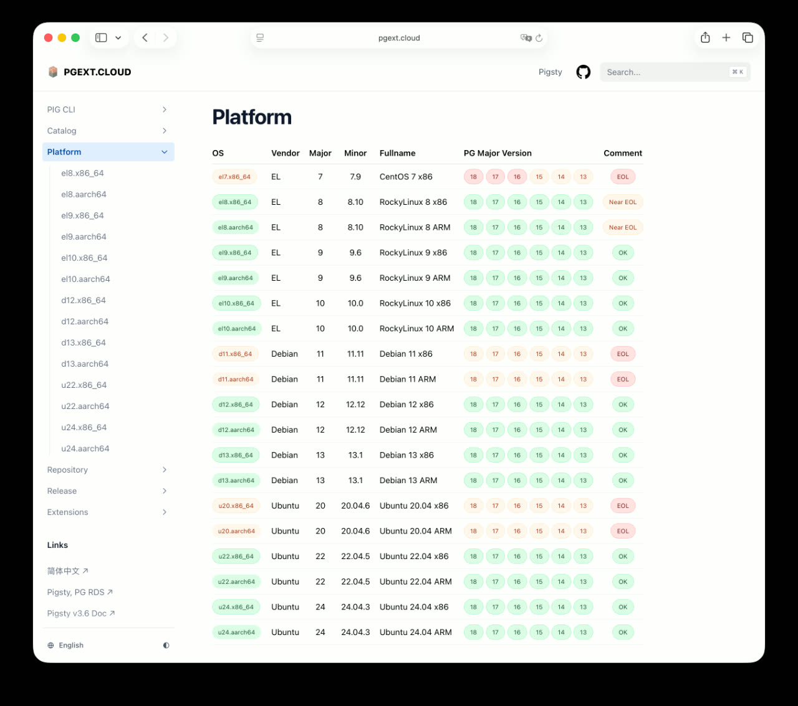

> [**GitHub Release**](https://github.com/pgsty/pigsty/releases/tag/v3.7.0) | [**发布注记**](https://pigsty.cc/docs/releasenote/#v370) | [微信公众号](https://mp.weixin.qq.com/s/Sui0kzOD9M_XYlNR-BZ1Ng)

[](https://github.com/pgsty/pigsty/releases/tag/v3.7.0)

Pigsty v3.7.0 正式发布，带来完整的 PostgreSQL 18 生产级支持，以及四个新操作系统的支持：Debian 13 与 EL 10 在 x86_64/ARM64 架构上的全部组合。扩展插件数量从 423 个增至 437 个，大量扩展同步更新至最新版本。

此外，Supabase、IvorySQL、PolarDB、Percona TDE 等内核均升级至最新版本，Prometheus、Grafana、DuckDB、Etcd 等基础组件也完成了一轮集中更新。

凭借在 PostgreSQL 扩展生态的突出贡献，Pigsty 在第八届 PostgreSQL 数据库生态大会上荣获 **"PostgreSQL 万磁王"** 奖。


--------

## PostgreSQL 18 成为默认版本

随着 PostgreSQL 18.1 的发布，PG 18 已具备生产就绪状态。Pigsty v3.7 正式将其设为默认版本。

PG 18 引入了多项重要特性：时态主键（Temporal Primary Key）、内置 UUIDv7、索引跳跃扫描（Index Skip Scan）、异步 I/O（AIO）、虚拟生成列、EXPLAIN 增强、OAuth 2.0 支持等。如果这些特性符合你的业务需求，现在是升级的好时机。

与此同时，11 月发布的 PG 13.23 将是 PG 13 的最后一个版本，该大版本正式进入 EOL 状态。Pigsty v3.7 是最后一个包含 PG 13 完整扩展支持的版本 —— 所有扩展均已重新编译，但后续将不再更新。


--------

## 史诗级扩展更新

支持 PG 18 远不止内核部署那么简单。从 beta 阶段开始，Pigsty 就提供了 PG 18 的部署能力，但要将其作为生产默认版本，扩展生态的跟进至关重要。目前除 Citus 外，主流扩展均已支持 PG 18。为此，我们修复了数十个扩展的兼容性问题，并统一了 40 余个 Rust 扩展的 pgrx 版本。

这是一次史诗级的更新。PG 18 上的可用扩展数量达到 390-405 个（因发行版略有差异）。完整的扩展可用性信息可在 [PGEXT.CLOUD](https://pgext.cloud) 查阅。近三个月的扩展更新情况如下：


多个扩展迎来里程碑式更新：

- **pg_duckdb 1.1**：代码质量显著改善，EL8 兼容性问题已修复
- **pg_mooncake 0.2**：使用 Rust 重写，现为 pg_duckdb 的子扩展，两者可并存
- **VectorChord 1.0**：正式发布稳定版
- **pg_search 0.20**：ParadeDB 全文检索扩展重大更新

支持 PG 18、Debian 13、EL 10 意味着编译测试矩阵从 50 个（5 PG × 10 OS）扩展到 84 个（6 PG × 14 OS），增幅达 68%。仓库中的 RPM/DEB 包数量从四万余个增至六万余个。

为提升效率，我们将整个扩展构建流程完全自动化。现在只需启动容器，执行 `pig build pkg <ext>` 即可完成构建。这套扩展仓库与构建基础设施完全独立可用 —— 即使不使用 Pigsty，也可通过 YUM/APT 直接安装扩展，所有代码采用 Apache-2.0 许可证开源。

**凭借这一贡献，Pigsty 在第八届 PostgreSQL 数据库生态大会上荣获"PostgreSQL 万磁王"奖。**


--------

## 新增操作系统支持：EL 10 与 Debian 13

本版本新增四个操作系统支持，主线支持总数达到 14 个。



**适配过程中的主要挑战：**

- **EL 10 Ansible 缺失**：官方仓库缺少 `ansible-collection-community-crypto`，我们将 EL9 版本移植并打包
- **Ansible 2.19 破坏性变更**：大量语法不兼容，进行了全面适配确保新老版本均可正常工作
- **LLVM 版本升级**：EL9/EL10 上 PGDG 仓库从 LLVM 19 升级至 LLVM 20，引入兼容性问题
- **ARM64 仓库调整**：el10.aarch64 的 PGDG 仓库经历多轮调整
- **依赖变动频繁**：上游包依赖关系持续变化

这也是我们不建议用户自行折腾 PostgreSQL 部署的原因之一：很多时候问题并非操作失误，而是[上游变更](https://mp.weixin.qq.com/s?__biz=MzU5ODAyNTM5Ng==&mid=2247490601&idx=1&sn=6c5ae3fcfeb2714cf27ce6566f7b54bd&scene=21#wechat_redirect)导致的依赖断裂。使用 Pigsty 离线安装包可以锁定特定时刻的完整依赖，确保部署的稳定性。

**维护策略调整**：Pigsty 将仅维护各系列最近两个大版本。随着 EL 10 与 Debian 13 的加入，EL 8、Debian 11、Ubuntu 20.04 将不再主动更新（支持不移除），新扩展包与测试流程不再覆盖这些老系统。


--------

## 多内核同步更新

除原生 PostgreSQL 内核外，本版本同步更新了多个衍生内核：


| 内核 | 更新内容 |
|------|----------|
| **Supabase** | 全部 Docker 镜像更新至最新，底层升级至 PG 18 |
| **IvorySQL** | 从 4.5 升级至 5.0，兼容 PG 18.0 |
| **Percona TDE** | 透明加密内核从 PG 17.5 兼容升级至 PG 18.1 兼容 |
| **PolarDB** | 发布 15.15.5.0，新增 Debian 13/EL 10 的 RPM/DEB 包 |
| **FerretDB** | 更新至 2.7，底层 DocumentDB 升级至 0.107 |
| **OpenHalo / OrioleDB** | 新增 Debian 13 与 EL 10 支持 |

这些内核均可在新操作系统上平滑使用（Babelfish 除外），进一步巩固了 Pigsty 作为"元发行版"（Meta-Distribution）的定位 —— 一个可以开箱即用体验各种 PostgreSQL 风味的统一平台。


--------

## 参数模板优化

针对 PG 18 与新场景优化了默认参数模板：


- 优化 CPU、进程、线程与并行查询相关参数配置
- 确保各类扩展拥有充足的 background worker 资源
- 放宽 OLTP 模板对并行查询的限制
- 新增维护保养、故障排查、误删恢复等 SOP 文档


--------

## 愿景：PostgreSQL 生态的 Ubuntu

Pigsty 已成为 PostgreSQL 生态中国开源项目中 Star 数最高的项目，在国际上也建立了一定的知名度与影响力。

我们的愿景是：将 Pigsty 打造为 PostgreSQL 世界的主流发行版，在数据库领域占据类似 Debian、Ubuntu、RHEL 在操作系统领域的生态位。

实现路径：

- **聚焦核心场景**：原生 Linux 上的大规模生产级 PostgreSQL 管理
- **构建差异化优势**：业界领先的监控系统与最完整的扩展生态
- **整合生态资源**：融合 Supabase、Percona 等发行版的核心能力
- **优化开发者体验**：在保证专业性的同时兼顾易用性


--------
--------

## v3.7.0

Pigsty v3.7.0 版本发布，PostgreSQL 18 深度支持！

```bash
curl https://repo.pigsty.cc/get | bash -s v3.7.0
```

### 亮点特性

- PostgreSQL 18 深度支持，成为默认 PG 大版本，扩展已就位！
- 新增 EL10 / Debian 13 操作系统支持，总数达 14 个！
- 新增 PostgresQL 扩展数量，总数达到 437 个！
- 支持了 Ansible 2.19 破坏性重构以后的版本！
- Supabase，PolarDB, IvorySQL, Percona 内核更新至最新版本！
- 优化了 PG 默认参数的设置逻辑，更充分利用资源。

### 版本更新

- PostgreSQL 18.1, 17.7, 16.11, 15.15, 14.20, 13.23
- Patroni 4.1.0
- Pgbouncer 1.25.0
- pg_exporter 1.0.3
- pgbackrest 2.57.0
- Supabase 2025-11
- PolarDB 15.15.5.0
- FerretDB 2.7.0
- DuckDB 1.4.2
- Etcd 3.6.6
- pig 0.7.4

更多软件版本更新信息，请参考：

- [INFRA 变更日志](https://pgext.cloud/zh/release/infra/)
- [RPM 变更日志](https://pgext.cloud/zh/release/rpm/)
- [DEB 变更日志](https://pgext.cloud/zh/release/deb/)

### API 变化

- 为并行执行的相关参数设置了更合理的优化策略
- 在 `rich` 与 `full` 模板中，不再默认安装 citus 扩展，因为 citus 尚未支持 PG 18
- PG 参数模板中，新增 duckdb 系列扩展存根
- 为 `min_wal_size`, `max_wal_size`, `max_slot_wal_keep_size` 设置 200，2000，3000 GB 的封顶上限值
- 为 `temp_file_limit` 设置 200 GB 的封顶上限，OLAP 设置为 2 TB
- 适当增大连接池默认链接数量
- 新增 `prometheus_port` 参数，且默认值为 `9058`，避开与 EL10 RHEL Web Console 端口的冲突
- 修改 `alertmanager_port` 参数的默认值为 `9059`，避开与 Kafka SSL 端口的潜在冲突
- 新增 `pg_pkg` 的 `pg_pre` 子任务，在安装 PG 包前移除 el9+ 上导致 LLVM 冲突的 `bpftool`, `python3-perf`
- 在 Debian / Ubuntu 的默认仓库定义中新增 llvm 仓库模块
- 修复了 `infra-rm.yml` 移除软件包的逻辑

### 兼容性修复

- 修复了 Ubuntu/Debian 信任 CA 时 Warning 返回码错误的问题
- 修复了 Ansible 2.19 引入的大量兼容性问题，确保在新老版本上正常运行
- 为 seq 类变量添加了 int 类型转换，确保兼容
- 将大量 with_items 修改为 loop 语法，确保兼容
- 为密钥交换变量添加一层列表嵌套，避免在新版本下针对字符串进行字符迭代
- 将 range 用例显式转换为 list 后使用
- 修改了 name，port 等标记保留的变量命名
- 将 `play_hosts` 修改为 `ansible_play_hosts`
- 为部分字符串类型添加了 string 强制类型转换，避免运行时错误

### EL10 逻辑适配

- 修复了 EL10 缺少 ansible-collection-community-crypto 无法生成密钥的问题
- 修复了 EL10 缺少 ansible 逻辑包的问题
- 移除 modulemd_tools flamegraph timescaledb-tool
- 使用 java-21-openjdk 替代 java-17-openjdk
- aarch64 YUM 仓库名称问题

### Debian 13 逻辑适配

- 使用 `bind9-dnsutils` 替代 `dnsutils`

### Ubuntu 24 修复

- 临时移除了上游依赖崩溃的 tcpdump 包

### 校验和

```bash
e00d0c2ac45e9eff1cc77927f9cd09df  pigsty-v3.7.0.tgz
987529769d85a3a01776caefefa93ecb  pigsty-pkg-v3.7.0.d12.aarch64.tgz
2d8272493784ae35abeac84568950623  pigsty-pkg-v3.7.0.d12.x86_64.tgz
090cc2531dcc25db3302f35cb3076dfa  pigsty-pkg-v3.7.0.d13.x86_64.tgz
ddc54a9c4a585da323c60736b8560f55  pigsty-pkg-v3.7.0.el10.aarch64.tgz
d376e75c490e8f326ea0f0fbb4a8fd9b  pigsty-pkg-v3.7.0.el10.x86_64.tgz
8c2deeba1e1d09ef3d46d77a99494e71  pigsty-pkg-v3.7.0.el8.aarch64.tgz
9795e059bd884b9d1b2208011abe43cd  pigsty-pkg-v3.7.0.el8.x86_64.tgz
08b860155d6764ae817ed25f2fcf9e5b  pigsty-pkg-v3.7.0.el9.aarch64.tgz
1ac430768e488a449d350ce245975baa  pigsty-pkg-v3.7.0.el9.x86_64.tgz
e033aaf23690755848db255904ab3bcd  pigsty-pkg-v3.7.0.u22.aarch64.tgz
cc022ea89181d89d271a9aaabca04165  pigsty-pkg-v3.7.0.u22.x86_64.tgz
0e978598796db3ce96caebd76c76e960  pigsty-pkg-v3.7.0.u24.aarch64.tgz
48223898ace8812cc4ea79cf3178476a  pigsty-pkg-v3.7.0.u24.x86_64.tgz
```

更多版本信息请参考 [GitHub 发布页面](https://github.com/pgsty/pigsty/releases/tag/v3.7.0)。
