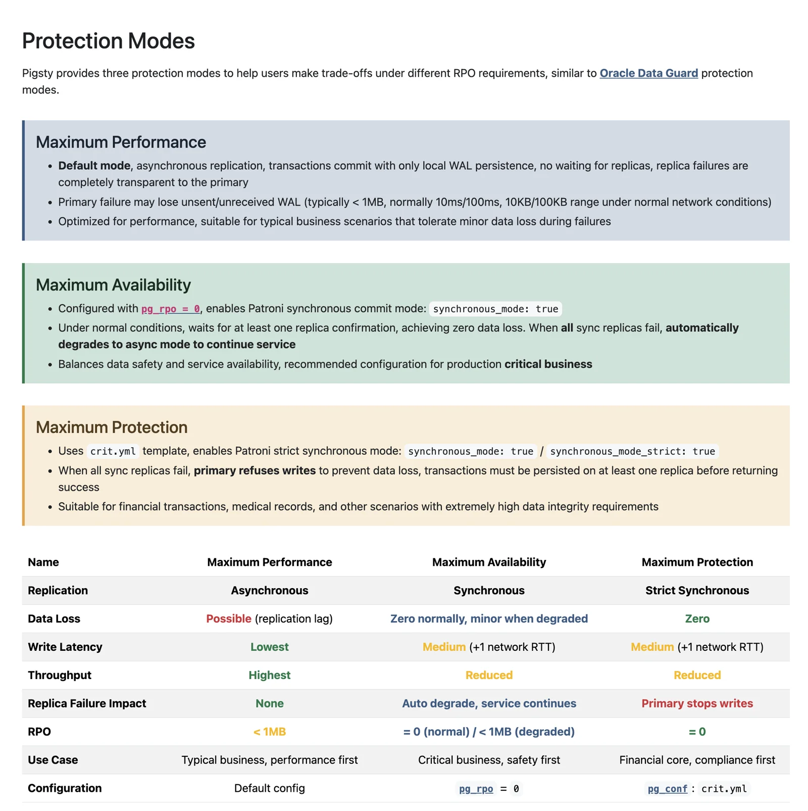
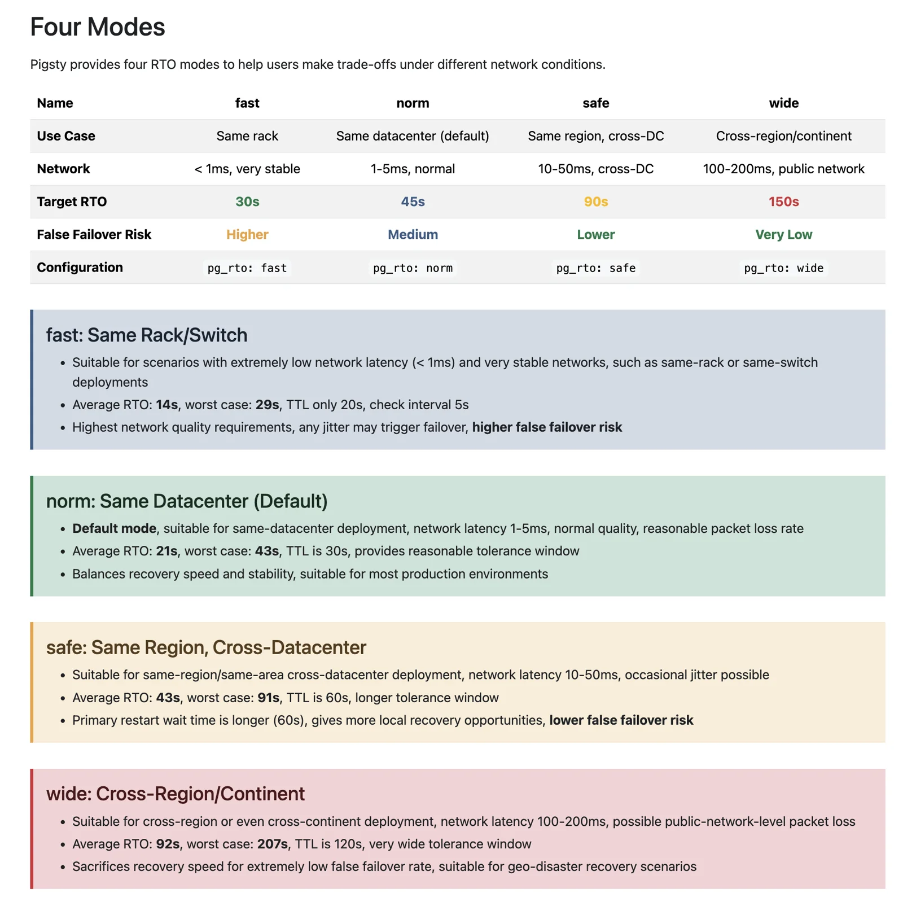
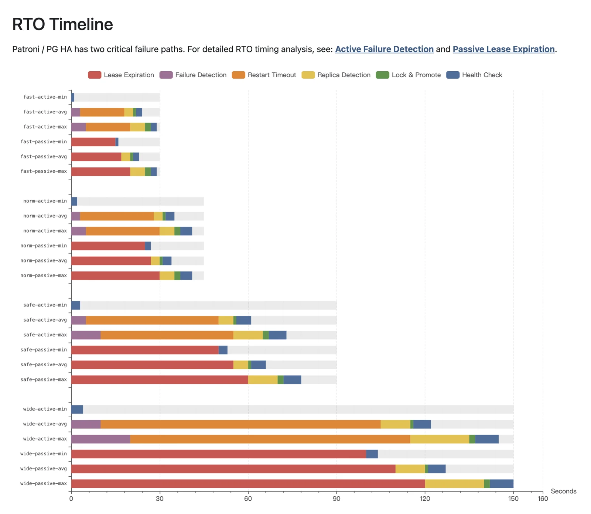

**Pigsty v4.0 is here!** This is a milestone release.

[Pigsty](https://pigsty.io) is a batteries-included, open-source, local-first PostgreSQL distribution.
It lets you spin up enterprise-grade PostgreSQL services without a dedicated DBA —
monitoring, backup, HA, IaC, connection pooling, and 444 extensions out of the box.

v4.0 is a major architectural overhaul: 320 commits, ~400k lines changed
(though 300k+ of that is monitoring dashboards).
I'd call this version "Finished Software" — it's reached a state I'm genuinely satisfied with.

**v4.0 theme: More Open, More Efficient, More Secure, More Intelligent.** Let's dive in.

------

## TL;DR

- [License: Back to Apache 2.0](#license)
- [Infra Overhaul: Victoria Stack FTW](#observability)
- [Container Support: Docker Gang Rejoice](#docker)
- [PG 18 Ready: 444 Extensions Standing By](#pg18)
- [Security Hardening: Passwords, Firewall, SELinux](#security)
- [JUICE Module: Database as Filesystem](#juice)
- [VIBE Module: Claude Code Runtime](#vibe)
- [DBA Agent: Skills & CLI](#dba-agent)
- [HA Optimization: RTO/RPO Deep Dive](#ha)
- [Instant Clone: Fork DBs & Instances in Milliseconds](#pitr)
- [IaC Enhancements: More Fine-Grained Knobs](#iac)
- [Vibe Coding IRL: 90% AI-Written Code](#vibe-coding)
- [Finished Software: Quality I'm Happy With](#finished)
- [Entering the AI Era: Built for Agents](#ai-era)


------

## License Change: Back to Apache 2.0 {#license}

Pigsty v4.0 switches from AGPLv3 back to the permissive Apache 2.0 license.
For enterprise users, no more legal battles. ISVs can integrate freely.
Want to build your own custom PG distro? Fork Pigsty and skip the yak shaving.

For the full rationale, see my separate post:
[From AGPL to Apache: Thoughts on Pigsty's Relicensing](/pg/pigsty-relicense).


------

## Observability Overhaul: Victoria Stack FTW {#observability}

The flagship change in v4: replacing Prometheus and Loki with the
[**Victoria Stack**](/db/victoria-stack), plus adding tracing.

VictoriaMetrics is the chad replacement for Prometheus.
We ran it at scale at Tantan years ago —
stunning results, fraction of the resources, multiple times the performance.

The trigger this time was Loki's lackluster performance,
and Promtail (its log collector) getting deprecated this year.
I went with the current SOTA: VictoriaLogs + Vector,
and threw in VMetrics + VTrace for good measure.

Results speak for themselves: querying a day's worth of logs used to show a loading spinner;
now VictoriaLogs returns instantly.
We migrated all log collection to VictoriaLogs,
designed a Prometheus-consistent label schema,
and added log monitoring for every component.
Each component now has Logs & Panels,
plus brand new dashboards for Node Vector, Node Juice, and Claude Code.


Architecture got simpler too: previously different components needed different Nginx endpoints.
Now everything mounts on a single Nginx server.
No more juggling domains and ports —
one domain (or just IP) gives you Grafana, logs, metrics, and Alertmanager.
Enterprise edition even auto-localizes to Chinese
with translated metric titles, descriptions, and usage notes.


Big picture: the current [INFRA module](https://pigsty.io/docs/infra) is basically a Victoria distro —
Metrics + Logs + Trace + Alert + unified UI.
Add the OOTB Grafana and you've got an enterprise-grade observability platform.


------

## Container Support: Docker Gang Rejoice {#docker}

Docker support was the most requested feature — running Pigsty itself in containers.
Previously doable but required manual param tweaking and systemd kung-fu.
Now we ship official base images.
Got Docker? One command and you're up! (Assuming your Docker Hub access is... sorted.)

```bash
cd ~/pigsty/docker; make launch  # One-click single-node containerized Pigsty
```


I wrestled with the image design:
ship everything pre-installed, or a minimal deployable image?
Went with the latter — based on Debian 13 official image,
added systemd, ssh, sudo, and pigsty itself.
Everything else happens during deploy phase.
Base image is ~200 MB (vs 3 GB for the kitchen sink).

Post-deploy, you're good to go: port 8080 for web, 2222 for ssh, 5432 for postgres.
Works on Windows, macOS, Linux — quick and easy test drive.


------

## PG 18 Ready: 444 Extensions Standing By {#pg18}

A core v4 goal: make PostgreSQL 18 production-ready as the default version.
This release cycle, we added PG 18 support for major extensions:
TimescaleDB, ParadeDB, Citus, DocumentDB, AGE.

To make this happen, we compiled [~226+ extension packages](https://pgext.cloud/list/)
for 6 PG major versions across 14 Linux distros,
bringing total available extensions to 444.
Also fixed numerous missing extension combos in PGDG.
Plus 10 brand new extensions:

| Extension           | Version | Description                                    |
|---------------------|---------|------------------------------------------------|
| [pg_textsearch]     | 0.4.0   | Full-text search with BM25 ranking             |
| [pg_clickhouse]     | 0.1.3   | Query ClickHouse from PostgreSQL               |
| [pg_ai_query]       | 0.1.1   | AI-powered SQL query generation                |
| [etcd_fdw]          | 0.0.0   | etcd foreign data wrapper                      |
| [pg_ttl_index]      | 0.1.0   | Auto-expire data with TTL indexes              |
| [pljs]              | 1.0.4   | PL/JS trusted procedural language              |
| [pg_retry]          | 1.0.0   | Transient error retry with exponential backoff |
| [weighted_stats]    | 1.0.0   | High-perf weighted stats for sparse data       |
| [pg_enigma]         | 0.5.0   | Encrypted Postgres data types                  |
| [pglinter]          | 1.0.1   | PostgreSQL SQL Linter                          |

[pg_textsearch]: https://pgext.cloud/e/pg_textsearch/
[pg_clickhouse]: https://pgext.cloud/e/pg_clickhouse/
[pg_ai_query]: https://pgext.cloud/e/pg_ai_query/
[etcd_fdw]: https://pgext.cloud/e/etcd_fdw/
[pg_ttl_index]: https://pgext.cloud/e/pg_ttl_index/
[pljs]: https://pgext.cloud/e/pljs/
[pg_retry]: https://pgext.cloud/e/pg_retry/
[weighted_stats]: https://pgext.cloud/e/weighted_statistics/
[pg_enigma]: https://pgext.cloud/e/pg_enigma/
[pglinter]: https://pgext.cloud/e/pglinter/

We also overhauled default PG param configs.
Users can now configure the new `io_method` to leverage async I/O,
and `file_copy_method` = `clone` is enabled for
"[instant database cloning](/pg/pg-clone)" support.
Every PG 17/18 param (and legacy ones) got a thorough review with updated best-practice defaults.

Oracle-compatible IvorySQL kernel and TDE-encrypted
[Percona](https://pigsty.io/docs/pgsql/kernel/percona/) kernel both ship with PG 18 support.
MongoDB-compatible [FerretDB](https://pigsty.io/docs/ferret)
(after switching to Microsoft's DocumentDB version) also supports PG 18.

Bottom line: PG 18's major extensions are locked and loaded,
params fully optimized, metrics fully collected.
PG 18 in Pigsty is battle-ready for the harshest production environments.


------

## Security Hardening: Passwords, Firewall, SELinux {#security}

v4 went hard on security, checking boxes against compliance standards
like China's MLPS and SOC2. Highlights:

**Random strong default passwords**:
Users kept deploying with default creds.
Now `configure -g` auto-replaces all default passwords with random strong ones.

**ETCD RBAC enabled**:
Previously global cert auth.
Now each PG cluster gets its own etcd user/password.
Admin nodes manage all clusters; regular DB nodes only manage their own cluster.
No more cross-cluster interference.

**SELinux rules optimized**:
Previously disabled by default.
Now EL systems have proper security contexts configured,
default permissive mode, enforce when ready.

**Firewall support by default**:
Define public-facing ports and internal subnets.
Even without cloud security groups, you can minimize exposure yourself
(default: ssh 22, http 80, https 443, optionally pgsql 5432).

We also audited all user/file permission models,
consolidated data under a unified directory (`/data`) for easy Docker mounts,
split permissions by user groups, strict least-privilege principle.

These security policies are progressive:
with random strong passwords generated, default config is already secure enough.
Advanced options are there for enterprises to evaluate tradeoffs.


------

## JUICE Module: Database as Filesystem {#juice}

v4's new JUICE module integrates JuiceFS,
mounting object storage and PostgreSQL as a local filesystem.
The killer feature: store both data and metadata in the same PG instance
for **consistent PITR of filesystem and database**.
Details in [PGFS: Database as Filesystem](/pg/pgfs).

This solves a real pain point:
apps with both filesystem (knowledge base files) and database.
DB PITR is easy; filesystem PITR is hard; keeping both consistent is a nightmare.
Now you can store files in the database
and get synchronized point-in-time rollback for the entire system.

This capability is clutch for Agents.
Vibe Code on a mounted directory, all changes stored in the database in real-time.
Unlike Git's manual snapshots, you can instantly rollback to any historical point.
Previously only high-end commercial CDP appliances had this —
now Pigsty provides it free. PIGLET AI sandbox has this configured by default.


------

## VIBE Module: Claude Code Runtime {#vibe}

The VIBE module is for Vibe Coding — completely optional.
Ships with Node.js, Claude Code, VS Code and Jupyter accessible from browser.
Also uv python package manager, npm, golang, hugo, and other essential tools.
China deployments auto-configure Python/Node mirror sources —
fast installs, no GFW wrestling.

Best part: turnkey Claude Code environment,
one command downloads and configures the latest version.
[One line of config to use CC + domestic GLM 4.7](/db/claude-code-intro),
various convenience shortcuts, Claude Code can YOLO in Sandbox mode.
Includes a Grafana Dashboard for monitoring Claude Code —
real-time visibility into what your Agent is doing and thinking.
Even ships happy + tmux so you can voice-command CC from your phone.


VIBE module pairs with JUICE module —
that's exactly how PIGLET.RUN sandbox works:
mount your code directory to the database via JuiceFS,
leverage DB's PITR capability to one-click rollback
both filesystem and database to any point in time.

This module powers [PIGLET.RUN](https://piglet.run)
and is the cloud dev environment I personally use.
Post-install, you've got a complete cloud development environment —
secure and fully equipped.


------

## DBA Agent: Skills & CLI {#dba-agent}

VIBE isn't just for coding.
Its real purpose: foundation for the DBA Agent I'm building —
install Claude Code with this module,
and it can already do valuable work in a Pigsty environment.
Database health checks, reports, query optimization — no sweat.

I previously wrote a PostgreSQL quick-start tutorial:
install Pigsty, run Open Code calling GLM-4 model, let it play teacher.
User feedback was wild.
Some DBAs tried it and said "this thing is scary" —
throw a health check task at it, zero extra config, performs remarkably well.

Of course, letting Agents go full YOLO in prod is too aggressive.
Hard rules still need careful config:
absolute no-go operations, mandatory human confirmation, permission boundaries.
We've got a basic [**CLAUDE.md**](https://github.com/pgsty/pigsty/blob/main/CLAUDE.md)
in the pigsty home directory telling CC what's allowed and what's not.
Launch from that directory to enable it.

Pigsty has a unique advantage for DBA Agents:
highly deterministic context and environment, clearly described and managed in code.
From day one, Pigsty committed to **IaC (Infrastructure as Code)** + **CLI** —
GUI only for monitoring, never for control.

Because we believe the endgame for programmatic, intelligent management is IaC + CLI.
CC just needs to read pigsty.yml to understand
what modules and components exist in your environment, how to access and use them.

A simple, AgentNative CLI is a force multiplier for both DBAs and DBA Agents.
The [pig v1.0][pig-v10] shipping with Pigsty v4 provides exactly this —
wrapping complex commands and operation sequences
into idiot-proof / Agent-friendly commands.
More posts coming on this.

[pig-v10]: https://www.postgresql.org/about/news/pig-v10-released-with-pgextcloud-444-pg-extensions-on-14-linux-3214/


------

## HA Optimization: RTO/RPO Deep Dive {#ha}

Beyond AI4PG and PG4AI, v4 also levels up on core database service fundamentals.
Detailed breakdown in [PostgreSQL HA: The State of the Art](/pg/pg-ha-sota).

Pigsty users have diverse scenarios:
same-rack deployment, cross-DC disaster recovery,
cross-continent architectures (200ms+ latency, high packet loss).
These scenarios have completely different HA param requirements.

Previously we shared one tuned Patroni param set.
Now we provide four pre-baked param templates for different scenarios.



Similarly, following Oracle's data protection modes,
we offer three typical RPO templates for users
to trade off data consistency against performance/availability.



Interestingly, when we deep-dived this topic,
we found most Patroni-based HA solutions in the wild use default params —
no one had systematically analyzed RTO composition.
So I did quantitative analysis of RTO breakdown across failure paths,
ensuring these param sets keep worst-case RTO under specified bounds.
Theoretical analysis so users can run Patroni HA with peace of mind.



> Theoretical decomposition keeps RTO upper bounds at
> 30/45/90/150s for the four param sets


------

## Instant Clone: Fork DBs & Instances in Milliseconds {#pitr}

HA isn't the only improvement — PITR got significant upgrades too.
See [Git for Data: Instant Clone PG Databases](/pg/pg-clone).
PostgreSQL 18 brings instant cloning — exactly what AI apps need: fast, cheap clones.

Prod databases can be hundreds of GB or even TB — you can't test directly on them.
Fork uses COW (Copy-on-Write), even massive databases clone in ~200ms.
Coolest part: storage stays flat — two 100GB databases still only use 100GB total.

```yaml
pg-meta:
  hosts:
    10.10.10.10: { pg_seq: 1, pg_role: primary }
  vars:
    pg_cluster: pg-meta
    pg_version: 18
    pg_databases:
      - { name: meta }                                           # source database
      - { name: meta_dev ,template: meta , strategy: FILE_COPY}  # bin/pgsql-db meta_dev
```

With XFS filesystem (mainstream Linux default),
you get instance-level instant cloning too:
fork a large instance instantly, zero extra storage, zero prod impact.
Combined with classic cluster PITR, you can rapidly clone PostgreSQL
at **instance, database, and cluster** levels,
and rollback to any point within retention period.

To further lower the PITR barrier, we baked PITR into the `pig` CLI:
run `pig pitr`, it handles everything automagically.
Restore your database cluster in-place/incrementally/efficiently to your target point.
Newbies and AI Agents alike can leverage this easily — that's the bar we're aiming for.


------

## IaC Enhancements: More Fine-Grained Knobs {#iac}

Previously Pigsty didn't support deleting users or databases —
delete ops are dangerous, involving complex SOPs for cleaning up dependent objects and permissions.
But users genuinely needed this: complex resource configs got messy, wanted to nuke and restart.
We implemented drop database and drop user.
Don't underestimate this — seemingly simple, actually very hard to do right:
almost all cloud RDS services only support dropping "naked users",
any dependencies and the system just errors out.

v4 also revamped the IaC API design, adding and aligning params through PG 18.
For example, user-level customization for the three role inheritance options: `ADMIN`, `INHERIT`, `SET`.
You can specify extra Locale params for databases, use `state` for deleting or rebuilding databases/users,
and manage Schemas and Extensions within databases.

HBA rule definitions now support an `order` field —
explicitly specify priority order for each rule.
Internal subnet definitions are also customizable now,
consistent with default firewall policies.
PG gets its own dedicated crontab list, separate from system-wide scheduled tasks.

Countless other refinements:
injection protection on virtually all param slots,
special handling for PG's list params, etc. — won't belabor the details.
End result: IaC your way to customizing every PostgreSQL cluster detail.
Databases, users, inheritance, permissions, HBA, services, extensions, schemas —
one shot, spin up production-ready database clusters.
This IaC config-as-code approach is natural and friendly for both DBAs and DBA Agents.


------

## Vibe Coding IRL: Taste & Validation Are the Moat {#vibe-coding}

Let's talk engineering practice:
90%+ of Pigsty v4.0 code was written by Claude Code.
I only handled three things: propose ideas, design APIs, validate results.
Methodology in four phases:

**Design**:
Play PM, discuss and generate design docs with AI.
CC's API design taste isn't quite there yet — this part I do myself.

**Implement**:
New session, have AI implement code.
After completion, 10 rounds of self-reflection and revision,
giving review feedback each round until satisfied.

**Review**:
Another session, have AI run automated tests in VM sandbox.

**Validate**:
Final manual testing.

Claude Code is like a brilliant but slightly domain-inexperienced genius intern.
If your instincts are right and direction is correct, it nails the details.
This senior-junior pair programming is highly efficient —
I typically run three User Stories in parallel.
CC codes blazingly fast; the bottleneck is me.

Usually after locking design, CC's first-attempt success rate hits 90%+.
The remaining 10% needs multiple iterations.
Especially for domains like RDS with virtually no public documentation —
requires tons of manual guidance to reach final satisfaction.

Two things Claude Code still struggles with:
first, API design — still needs taste to gatekeep, CC only offers ideas and suggestions;
second, validation efficiency —
current bottleneck is manual validation speed (blocked on me) because smoke test SOPs are slow.

This gave me an insight:
**In the Agent coding era, design taste and validation capability are the real moats.**
Even with code open-sourced, most people lack both secondary development ability
and QA capability — that's the actual barrier.
Code is getting "cheap," but "getting the right thing right" remains expensive.

This reminds me of SQLite's model:
source code is public domain, but the core test suite TH3 is proprietary.
With AI assistants, a super-individual can match a full team;
external contributions actually slow things down.
So Pigsty will take a similar path: **Open Source, but not Open Collaboration** —
accepting Issues, feature requests, and feedback only, no more PRs.


------

## Finished Software: Quality I'm Happy With {#finished}

As mentioned in [From AGPL to Apache: Thoughts on Pigsty's Relicensing](/pg/pigsty-relicense),
I'd give v4.0 a solid 90/100.
SOTA AI's assessment is basically the same:
on PostgreSQL service quality, free Pigsty already beats top-tier cloud RDS,
reaching pinnacle level among open-source solutions.

So I figure it's about there — that's why I called v4.0 "Finished Software" at the top.

But "finished" isn't "archived."
In software lifecycle terms, Finished means it's good enough,
stable enough, trustworthy enough for production.
Like a quality blade — the edge is honed, now comes long-term use, maintenance, passing down.
I'll keep maintaining Pigsty — bug fixes, version tracking, extension packaging.
With AI help, this barely takes time; one PG major version per year is fine.
The remaining 10 points are left for ecosystem, product, and commercial services to grow.

And my energy can finally shift to that seed planted three years ago.


------

## Entering the AI Era: Built for Agents {#ai-era}

Three years ago, I wrote [Database Needs Pyramid](https://vonng.com/db/demand-pyramid/),
listing **Intelligent Autonomous Database** as the ultimate goal.
Back then it was just a vision. Today, it's becoming real.

From day one, Pigsty committed to IaC + CLI,
keeping GUI only for observation, not control.
Many didn't get it: why not build a pretty console?

Now the answer is clear — **because we were waiting for Agents.**

Agents don't need to click buttons.
They need to read configs, call APIs, execute commands.
Pigsty's architecture is native to programmatic management.
While others are still figuring out how to make AI operate GUIs,
Pigsty users can already have Claude Code directly read `pigsty.yml`,
understand the entire infrastructure, and get to work.

**This is what "entering the AI era" really means:
not bolting AI features onto software,
but making software a native habitat for AI.**

For this, I've prepared two wings:

**PIG** — Originally just a package manager,
repositioned in v1.0 as PostgreSQL ecosystem's Agent Native CLI.
Full lifecycle management of databases, connection pools, HA, backup, and access.
It's the Agent's hands for operating PostgreSQL.

**PIGLET.RUN** — A PostgreSQL-centric Agent runtime.
Lightweight Pigsty sub-distro where users just talk
and generate complete, database-backed complex applications.
It's the soil where Agents thrive.

And Pigsty itself aims to be the infrastructure foundation
that keeps you deterministic in the AI era —
**bold enough to let Agents go hands-free,
confident enough to one-click rollback to yesterday when they screw up.**

Describe it with IaC, understand it with observability,
constrain it with permissions, correct it with PITR.
This isn't "yet another PostgreSQL install script" —
it's a complete engineering methodology for keeping complex systems in a cage.

------

Data is the lifeblood of systems.
Databases are the hearts guarding that lifeblood.

Agents are becoming a new form of life.
They think, they act, they err, they learn.

And every life needs a reliable heart.

**Pigsty v4.0, built for this era.**

Welcome to the game.


------

# Pigsty v4.0.0 ReleaseNote

## Quick Start

```bash
curl https://pigsty.io/get | bash -s v4.0.0
```

**318 commits**, 604 files changed, +118,655 / -327,552 lines

**Release Date: 2025-12-25** |
[GitHub](https://github.com/pgsty/pigsty/releases/tag/v4.0.0) |
[Docs EN](https://pigsty.io) |
[Docs CN](https://pigsty.io)

------

## Highlights

- **Observability Revolution**: Prometheus → VictoriaMetrics (10x perf),
  Loki+Promtail → VictoriaLogs+Vector
- **Security Hardening**: Auto-generated passwords, etcd RBAC,
  firewall/SELinux modes, permission tightening, Nginx Basic Auth
- **Docker Support**: Run Pigsty in Docker containers with full systemd support
- **New Module**: JUICE - Mount PostgreSQL as filesystem with PITR recovery
- **New Module**: VIBE - AI coding sandbox with Claude Code, JupyterLab, VS Code Server
- **Database Management**: `pg_databases` state, instant clone with `strategy`
- **PITR & Fork**: `/pg/bin/pg-fork` for instant CoW cloning, enhanced `pg-pitr`
- **HA Enhancement**: `pg_rto_plan` with 4 RTO presets, `pg_crontab` scheduled tasks
- **Multi-Cloud Terraform**: AWS, Azure, GCP, Hetzner, DigitalOcean, Linode, Vultr, TencentCloud
- **License Change**: AGPL-3.0 → Apache-2.0

[](https://github.com/pgsty/pigsty/releases/tag/v4.0.0)


------

## Infrastructure Package Updates

MinIO now uses [**pgsty/minio**](https://github.com/pgsty/minio) fork RPM/DEB.

| Package             | Version | Package             | Version  |
|---------------------|---------|---------------------|----------|
| victoria-metrics    | 1.134.0 | victoria-logs       | 1.43.1   |
| vector              | 0.52.0  | grafana             | 12.3.1   |
| alertmanager        | 0.30.1  | etcd                | 3.6.7    |
| duckdb              | 1.4.4   | pg_exporter         | 1.1.2    |
| pgbackrest_exporter | 0.22.0  | blackbox_exporter   | 0.28.0   |
| node_exporter       | 1.10.2  | minio               | 20251203 |
| pig                 | 1.0.0   | claude              | 2.1.19   |
| opencode            | 1.1.34  | uv                  | 0.9.26   |
| asciinema           | 3.1.0   | prometheus          | 3.9.1    |
| pushgateway         | 1.11.2  | juicefs             | 1.4.0    |
| code-server         | 4.100.2 | caddy               | 2.10.2   |
| hugo                | 0.154.5 | cloudflared         | 2026.1.1 |
| headscale           | 0.27.1  |                     |          |

------

## Docker Support

Pigsty now supports running in **Docker containers** with full systemd support,
working on both macOS (Docker Desktop) and Linux.

**Quick Start**:

```bash
cd ~/pigsty/docker; make launch    # = make up config deploy
```


------

## New Modules

v4.0.0 adds two **optional modules** that don't affect core Pigsty functionality:

**JUICE Module**: JuiceFS Distributed Filesystem

- Uses PostgreSQL as metadata engine, supports PITR recovery for filesystem
- Multiple storage backends: PostgreSQL large objects, MinIO, S3
- Multi-instance deployment with Prometheus metrics per instance
- New `node-juice` dashboard for JuiceFS monitoring
- New `juice.yml` playbook for deployment
- Parameters: `juice_cache`, `juice_instances`

**VIBE Module**: AI Coding Sandbox (Code-Server + JupyterLab + Node.js + Claude Code)

- **Code-Server**: VS Code in browser
  - Deploy Code-Server with Nginx reverse proxy for HTTPS
  - Supports Open VSX and Microsoft extension galleries
  - Set `code_enabled: false` to disable
  - Parameters: `code_enabled`, `code_port`, `code_data`, `code_password`, `code_gallery`

- **JupyterLab**: Interactive computing environment
  - Deploy JupyterLab with Nginx reverse proxy for HTTPS
  - Python venv configuration for data science libraries
  - Set `jupyter_enabled: false` to disable
  - Parameters: `jupyter_enabled`, `jupyter_port`, `jupyter_data`, `jupyter_password`, `jupyter_venv`

- **Node.js**: JavaScript runtime environment
  - Install Node.js with npm package manager
  - Auto-configure China npm mirror when `region=china`
  - Set `nodejs_enabled: false` to disable
  - Parameters: `nodejs_enabled`, `nodejs_registry`

- **Claude Code**: AI coding assistant CLI configuration
  - Configure Claude Code CLI, skip onboarding
  - Built-in OpenTelemetry config sending metrics/logs to Victoria stack
  - New `claude-code` dashboard for usage monitoring
  - Set `claude_enabled: false` to disable
  - Parameters: `claude_enabled`, `claude_env`

- New `vibe.yml` playbook for full VIBE deployment
- Use `conf/vibe.yml` template for quick AI coding sandbox setup
- Common parameter: `vibe_data` (default `/fs`) for workspace directory

------

## PostgreSQL Extension Updates

Major extensions add PG 18 support:
age, citus, documentdb, pg_search, timescaledb, pg_bulkload, rum, etc.

**New Extensions**:

- [pg_textsearch][ext-textsearch] 0.4.0 - TimescaleDB full-text search
- [pg_clickhouse][ext-clickhouse] 0.1.3 - ClickHouse FDW
- [pg_ai_query][ext-ai-query] 0.1.1 - AI query extension
- [etcd_fdw][ext-etcd-fdw] 0.0.0 - etcd FDW
- [pg_ttl_index][ext-ttl-index] 0.1.0 - TTL index
- [pljs][ext-pljs] 1.0.4 - JavaScript procedural language
- [pg_retry][ext-retry] 1.0.0 - Retry extension
- [pg_weighted_statistics][ext-weighted] 1.0.0 - Weighted statistics
- [pg_enigma][ext-enigma] 0.5.0 - Encryption extension
- [pglinter][ext-linter] 1.0.1 - SQL Linter
- [documentdb_extended_rum][ext-docdb-rum] 0.109 - DocumentDB RUM
- [mobilitydb_datagen][ext-mobility] 1.3.0 - MobilityDB data generator

[ext-textsearch]: https://github.com/timescale/pg_textsearch
[ext-clickhouse]: https://github.com/clickhouse/pg_clickhouse/
[ext-ai-query]: https://github.com/benodiwal/pg_ai_query
[ext-etcd-fdw]: https://github.com/pgsty/etcd_fdw
[ext-ttl-index]: https://github.com/pg-ttl-index
[ext-pljs]: https://github.com/plv8/pljs
[ext-retry]: https://github.com/pg-retry/pg_retry
[ext-weighted]: https://github.com/pgsty/pg_weighted_statistics
[ext-enigma]: https://github.com/pgsty/pg_enigma
[ext-linter]: https://github.com/pgsty/pglinter
[ext-docdb-rum]: https://github.com/microsoft/documentdb
[ext-mobility]: https://github.com/MobilityDB

**Major Updates**:

| Extension       | Old     | New    | Notes                  |
|-----------------|---------|--------|------------------------|
| timescaledb     | 2.23.x  | 2.24.0 | +PG18                  |
| pg_search       | 0.19.x  | 0.21.4 | ParadeDB, +PG18        |
| citus           | 13.2.0  | 14.0.0 | Distributed PG, +PG18  |
| documentdb      | 0.106   | 0.109  | MongoDB compat, +PG18  |
| age             | 1.5.0   | 1.7.0  | Graph DB, +PG18        |
| pg_duckdb       | 1.1.0   | 1.1.1  | DuckDB integration     |
| vchord          | 0.5.3   | 1.0.0  | VectorChord            |
| vchord_bm25     | 0.2.2   | 0.3.0  | BM25 full-text search  |
| pg_biscuit      | 1.0     | 2.2.2  | Biscuit auth           |
| pg_anon         | 2.4.1   | 2.5.1  | Data anonymization     |
| wrappers        | 0.5.6   | 0.5.7  | Supabase FDW           |
| pg_vectorize    | 0.25.0  | 0.26.0 | Vectorization          |
| pg_session_jwt  | 0.3.3   | 0.4.0  | JWT session            |
| pg_partman      | 5.3.x   | 5.4.0  | Partition mgmt, PGDG   |
| pgmq            | 1.8.0   | 1.9.0  | Message queue          |
| pg_bulkload     | 3.1.22  | 3.1.23 | Bulk load, +PG18       |
| pg_timeseries   | 0.1.7   | 0.2.0  | Time series            |
| pg_convert      | 0.0.4   | 0.1.0  | Type conversion        |
| pg_clickhouse   | 0.1.2   | 0.1.3  | ClickHouse FDW         |

pgBackRest updated to 2.58 with HTTP support.

------

## Observability

- VictoriaMetrics replaces Prometheus — several times the performance
- VictoriaLogs + Vector replaces Promtail + Loki for log collection
- Unified log format for all components, PG logs use UTC timestamp
- PostgreSQL log rotation changed to weekly truncated rotation mode
- Recording temp file allocations over 1MB in PG logs
- Added Vector parsing configs for Nginx/Syslog/PG CSV/Pgbackrest/Grafana/Redis/etcd/MinIO
- Datasource registration runs on all Infra nodes, auto-registered in Grafana
- New `grafana_pgurl` parameter for using PG as Grafana backend storage
- New `grafana_view_password` parameter for Grafana Meta datasource password
- `pgbackrest_exporter` default cache interval reduced from 600s to 120s
- `grafana_clean` default changed from `true` to `false`
- New `pg_timeline` collector for real-time timeline metrics
- New `pg:ixact_ratio` metric for idle transaction ratio monitoring
- `pg_exporter` updated to 1.1.2 with `pg_timeline` collector
- Added slot name coalesce for `pg_recv` metrics collector
- Blackbox ping monitoring support enabled
- New `node-vector` dashboard for Vector monitoring
- New `node-juice` dashboard for JuiceFS monitoring
- New `claude-code` dashboard for Claude Code usage monitoring
- PGSQL Cluster/Instance dashboards add version banner
- All dashboards use compact JSON format, reducing file size

------

## Interface Improvements

**Playbook Rename**:
- `install.yml` → `deploy.yml` for better semantics
- New `vibe.yml` playbook for VIBE AI coding sandbox

**pg_databases Improvements**:
- Database removal: use `state` field (`create`, `absent`, `recreate`)
- Database cloning: use `strategy` parameter for clone method
- Support newer locale params: `locale_provider`, `icu_locale`, `icu_rules`
- Support `is_template` to mark template databases
- Added type checks to prevent character parameter injection
- Allow `state: absent` in extension to remove extensions

**pg_users Improvements**:
- New `admin` parameter with `ADMIN OPTION` for re-granting
- New `set` and `inherit` options for user role attributes

**pg_hba Improvements**:
- Support `order` field for HBA rule priority
- Support IPv6 localhost access
- Allow specifying trusted intranet via `node_firewall_intranet`

**Other Improvements**:
- Default privileges for Supabase roles
- `node_crontab` auto-restores original crontab on `node-rm`
- New `infra_extra_services` for homepage service entries


------

## Parameter Optimization

**I/O Parameters**
- `pg_io_method`: auto, sync, worker, io_uring options, default worker
- `maintenance_io_concurrency` set to 100 for SSD
- `effective_io_concurrency` reduced from 1000 to 200
- `file_copy_method` set to `clone` for PG18 instant database cloning

**Replication & Logging**
- `idle_replication_slot_timeout`: default 7d, crit template 3d
- `log_lock_failures`: enabled for oltp, crit templates
- `track_cost_delay_timing`: enabled for olap, crit templates
- `log_connections`: auth logs for oltp/olap, full logs for crit

**HA Parameters**
- New `pg_rto_plan` integrating Patroni & HAProxy RTO config
  - `fast`: Fastest failover (~15s), for high availability requirements
  - `norm`: Standard mode (~30s), balanced (default)
  - `safe`: Safe mode (~60s), reduced false positives
  - `wide`: Relaxed mode (~120s), for geo-distributed deployments
- `pg_crontab`: scheduled tasks for postgres dbsu
- For PG17+, explicitly disable checksums if `pg_checksums` is off
- Crit template enables Patroni strict sync mode

**Backup & Recovery**
- PITR default `archive_mode` changed to `preserve`
- `pg-pitr` supports pre-recovery backup

**Other**
- Fixed `duckdb.allow_community_extensions` always active issue
- pg_hba and pgbouncer_hba now support IPv6 localhost

------

## Architecture Improvements

**Directories & Portal**:
- Fixed `/infra` symlink pointing to `/data/infra` on Infra nodes
- Infra data defaults to `/data/infra` for container convenience
- Local repo at `/data/nginx/pigsty`, `/www` symlinks to `/data/nginx`
- DNS records moved to `/infra/hosts`, solving Ansible SELinux race
- Default homepage domain renamed from `h.pigsty` to `i.pigsty`

**Scripts**:
- New `/pg/bin/pg-fork` for instant CoW replica creation
- Enhanced `/pg/bin/pg-pitr` for instance-level PITR with pre-backup
- New `/pg/bin/pg-drop-role` for safe user deletion
- New `bin/pgsql-ext` for extension installation
- Restored `pg-vacuum` and `pg-repack` scripts

**New Playbooks**:
- `juice.yml`: Deploy JuiceFS instances
- `vibe.yml`: Deploy VIBE AI sandbox

**Module Improvements**:
- Explicit cron/cronie package installation for minimal system
- UV Python manager moved from `infra` to `node` module
- `pg_remove`/`pg_pitr` etcd metadata removal runs on etcd cluster
- Simu template simplified from 36 to 20 nodes
- Removed PGDG sysupdate repo and llvmjit packages on EL systems
- Using full OS version for EPEL 10 / PGDG 9/10 repos
- Allow `meta` parameter in repo definitions
- Vagrant libvirt templates default to 128GB disk with xfs
- Ensure pgbouncer doesn't modify `0.0.0.0` to `*`
- New 10-node and Citus Vagrant templates
- Restored EL7 compatibility

**System Tuning**:
- Tuned systemd service NOFILE limits based on workload
- Fixed tuned profile activation by restarting tuned service
- Added runtime directory for PostgreSQL systemd service
- Fixed `ip_local_port_range` start/end value parity alignment

**Multi-Cloud**:
- Terraform: AWS, Azure, GCP, Hetzner, DigitalOcean, Linode, Vultr, TencentCloud

------

## Security Improvements

**Password Management**:
- `configure -g` for auto-generating strong random passwords
- Changed MinIO default password to avoid well-known defaults

**Firewall & SELinux**:
- Replaced `node_disable_firewall` with `node_firewall_mode`
- Replaced `node_disable_selinux` with `node_selinux_mode`
- Configured correct SELinux contexts for HAProxy, Nginx, DNSMasq, Redis

**Access Control**:
- Enabled etcd RBAC, each cluster can only manage its own PG cluster
- etcd root password stored in `/etc/etcd/etcd.pass`, admin-readable only
- Added `admin_ip` to Patroni API whitelist
- Always create admin system group, patronictl restricted to admin group
- New `node_admin_sudo` parameter for admin sudo mode
- Revoked script ownership from non-root users

**Certificates & Auth**:
- Nginx Basic Auth support for optional HTTP authentication
- Fixed ownca certificate validity for Chrome recognition
- New `vip_auth_pass` parameter for VRRP authentication

**Other**:
- Fixed `ansible copy content` empty field errors
- Fixed `pg_pitr` race conditions during Patroni cluster recovery
- Protected `files/pki/ca` directory with mode 0700

------

## Bug Fixes

| Issue                                  | Resolution                            |
|----------------------------------------|---------------------------------------|
| ownca certificate Chrome compatibility | Set ownca_not_after correctly         |
| Vector 0.52 syslog_raw parsing         | Adapted to new Vector format          |
| pg_pitr multi-replica clonefrom timing | Fixed Patroni recovery race condition |
| Ansible SELinux dnsmasq race condition | Moved DNS records to /infra/hosts     |
| EL9 aarch64 patroni & llvmjit          | Hotfix for ARM64 compatibility        |
| Debian groupadd path                   | Fixed user group add path             |
| Empty sudoers file generation          | Prevented empty sudoers config        |
| pgbouncer pid path                     | Use `/run/postgresql`                 |
| duckdb.allow_community_extensions      | Fixed DuckDB extension config         |
| pg_partman EL8 upstream break          | Hidden pg_partman on EL8              |
| HAProxy service template variable path | Fixed variable reference              |
| Redis remove task variable name        | Fixed redis_seq to redis_node         |
| MinIO reload handler ineffective       | Removed ineffective handler           |
| vmetrics_port default value            | Corrected to 8428                     |
| pg-failover-callback script            | Handle all Patroni callback events    |
| pg-vacuum transaction block            | Fixed transaction handling            |
| pg_sub_16 parallel logical worker      | Added PG16+ parallel replication      |
| FerretDB cert SAN and restart policy   | Fixed cert config and restart         |
| Polar Exporter metric types            | Corrected metric type definitions     |
| proxy_env package install missing      | Fixed proxy env propagation           |
| patroni_method=remove service issue    | Fixed postgres service in remove mode |
| Docker default data directory          | Updated to correct path               |
| EL10 cache compatibility               | Fixed EL10 cache issues               |
| etcd/MinIO removal cleanup incomplete  | Fixed systemd service and DNS cleanup |
| IvorySql 18 file_copy_method           | Fixed incompatibility with clone      |
| tuned profile activation               | Fixed by restarting tuned service     |


------

## Parameter Changes

**New Parameters**

| Parameter                | Type   | Default       | Description                           |
|--------------------------|--------|---------------|---------------------------------------|
| `node_firewall_mode`     | enum   | none          | Firewall mode: off/none/zone          |
| `node_selinux_mode`      | enum   | permissive    | SELinux mode                          |
| `node_firewall_intranet` | string | -             | HBA trusted intranet                  |
| `node_admin_sudo`        | enum   | nopass        | Admin sudo privilege level            |
| `pg_io_method`           | enum   | worker        | I/O method: auto/sync/worker/io_uring |
| `pg_rto_plan`            | dict   | -             | RTO presets: fast/norm/safe/wide      |
| `pg_crontab`             | list   | []            | postgres dbsu scheduled tasks         |
| `vip_auth_pass`          | string | -             | VRRP auth password                    |
| `grafana_pgurl`          | string | -             | Grafana PG backend URL                |
| `grafana_view_password`  | string | DBUser.Viewer | Grafana Meta datasource password      |
| `infra_extra_services`   | list   | []            | Homepage extra service entries        |
| `juice_cache`            | path   | /data/juice   | JuiceFS cache directory               |
| `juice_instances`        | dict   | {}            | JuiceFS instance definitions          |
| `vibe_data`              | path   | /fs           | VIBE workspace directory              |
| `code_enabled`           | bool   | true          | Enable Code-Server                    |
| `code_port`              | port   | 8443          | Code-Server listen port               |
| `code_data`              | path   | /data/code    | Code-Server data directory            |
| `code_password`          | string | Vibe.Coding   | Code-Server password                  |
| `code_gallery`           | enum   | openvsx       | Extension gallery: openvsx/microsoft  |
| `jupyter_enabled`        | bool   | true          | Enable JupyterLab                     |
| `jupyter_port`           | port   | 8888          | JupyterLab listen port                |
| `jupyter_data`           | path   | /data/jupyter | JupyterLab data directory             |
| `jupyter_password`       | string | Vibe.Coding   | JupyterLab access token               |
| `jupyter_venv`           | path   | /data/venv    | Python venv path                      |
| `claude_enabled`         | bool   | true          | Enable Claude Code configuration      |
| `claude_env`             | dict   | {}            | Claude Code extra env vars            |
| `nodejs_enabled`         | bool   | true          | Enable Node.js installation           |
| `nodejs_registry`        | string | ''            | npm registry, auto china mirror       |
| `node_uv_env`            | path   | /data/venv    | Node UV venv path, empty to skip      |
| `node_pip_packages`      | string | ''            | pip packages for UV venv              |

**Removed Parameters**

| Parameter               | Replacement                       |
|-------------------------|-----------------------------------|
| `node_disable_firewall` | `node_firewall_mode`              |
| `node_disable_selinux`  | `node_selinux_mode`               |
| `infra_pip_packages`    | `node_pip_packages`               |
| `pgbackrest_clean`      | Unused, removed                   |
| `pg_pwd_enc`            | Removed, always scram-sha-256     |
| `code_home`             | `vibe_data`                       |
| `jupyter_home`          | `vibe_data`                       |

**Default Value Changes**

| Parameter                  | Change                    | Notes                    |
|----------------------------|---------------------------|--------------------------|
| `grafana_clean`            | true → false              | Don't clean by default   |
| `effective_io_concurrency` | 1000 → 200                | More reasonable default  |
| `node_firewall_mode`       | zone → none               | Disable firewall rules   |
| `install.yml`              | Renamed to `deploy.yml`   | Better semantics         |

------

## Compatibility

| OS                 | x86_64 | aarch64 |
|--------------------|:------:|:-------:|
| EL 8/9/10          |   ✅    |    ✅    |
| Debian 11/12/13    |   ✅    |    ✅    |
| Ubuntu 22.04/24.04 |   ✅    |    ✅    |

**PostgreSQL**: 13, 14, 15, 16, 17, 18


------

## Checksums

```bash
9f42b8c64180491b59bd03016c26e8ca  pigsty-v4.0.0.tgz
db9797c3c8ae21320b76a442c1135c7b  pigsty-pkg-v4.0.0.d12.aarch64.tgz
1eed26eee42066ca71b9aecbf2ca1237  pigsty-pkg-v4.0.0.d12.x86_64.tgz
03540e41f575d6c3a7c63d1d30276d49  pigsty-pkg-v4.0.0.d13.aarch64.tgz
36a6ee284c0dd6d9f7d823c44280b88f  pigsty-pkg-v4.0.0.d13.x86_64.tgz
f2b6ec49d02916944b74014505d05258  pigsty-pkg-v4.0.0.el10.aarch64.tgz
73f64c349366fe23c022f81fe305d6da  pigsty-pkg-v4.0.0.el10.x86_64.tgz
287f767fbb66a9aaca9f0f22e4f20491  pigsty-pkg-v4.0.0.el8.aarch64.tgz
c0886aab454bd86245f3869ef2ab4451  pigsty-pkg-v4.0.0.el8.x86_64.tgz
094ab31bcf4a3cedbd8091bc0f3ba44c  pigsty-pkg-v4.0.0.el9.aarch64.tgz
235ccba44891b6474a76a81750712544  pigsty-pkg-v4.0.0.el9.x86_64.tgz
f2791c96db4cc17a8a4008fc8d9ad310  pigsty-pkg-v4.0.0.u22.aarch64.tgz
3099c4453eef03b766d68e04b8d5e483  pigsty-pkg-v4.0.0.u22.x86_64.tgz
49a93c2158434f1adf0d9f5bcbbb1ca5  pigsty-pkg-v4.0.0.u24.aarch64.tgz
4acaa5aeb39c6e4e23d781d37318d49b  pigsty-pkg-v4.0.0.u24.x86_64.tgz
```
