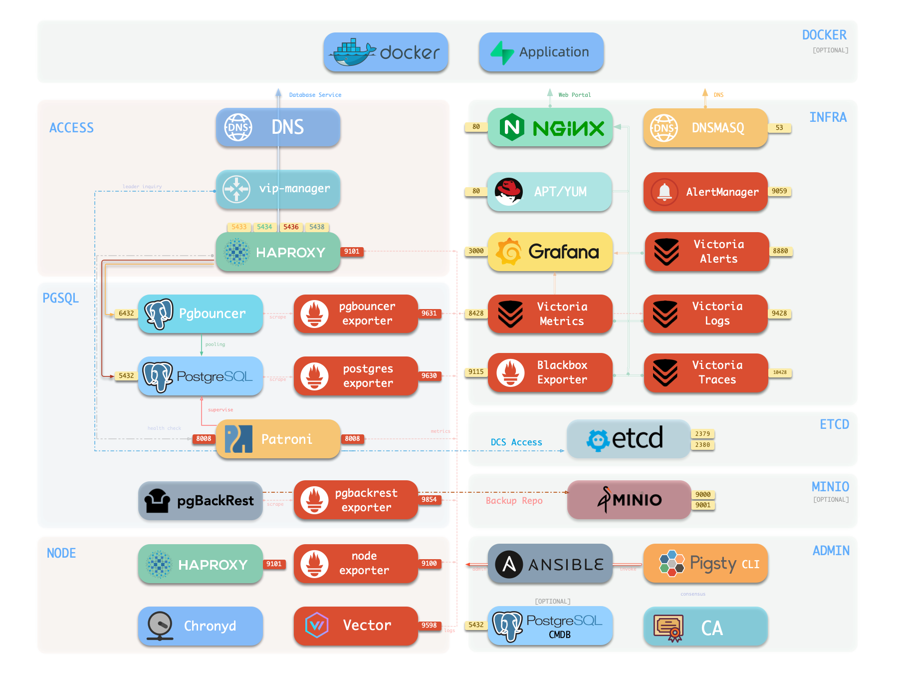
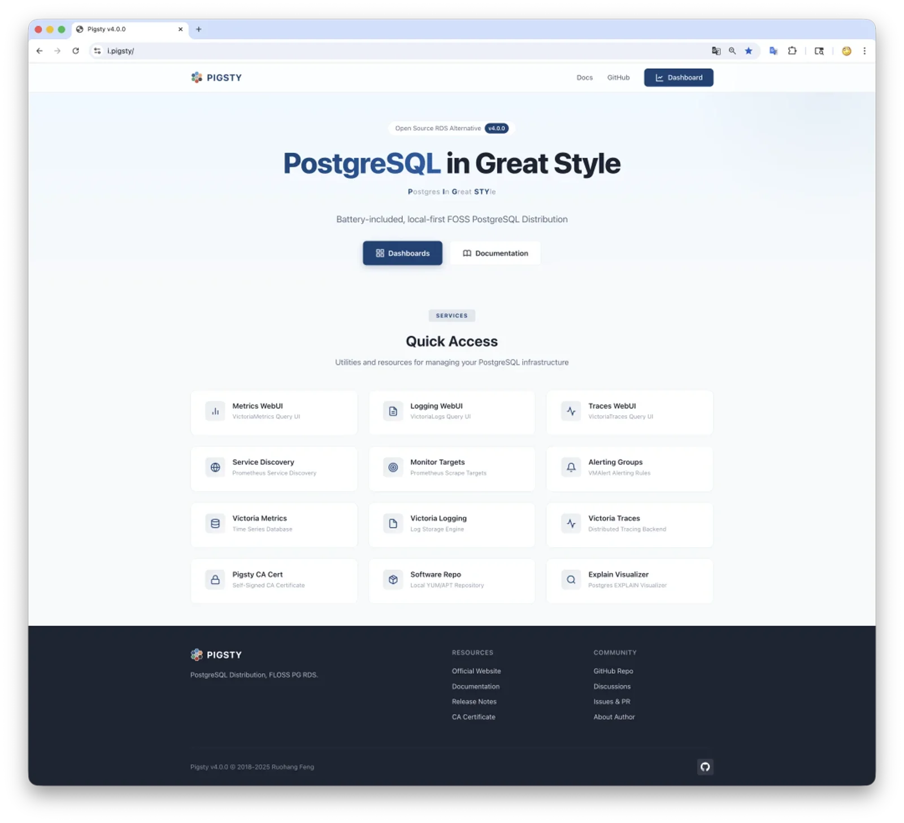
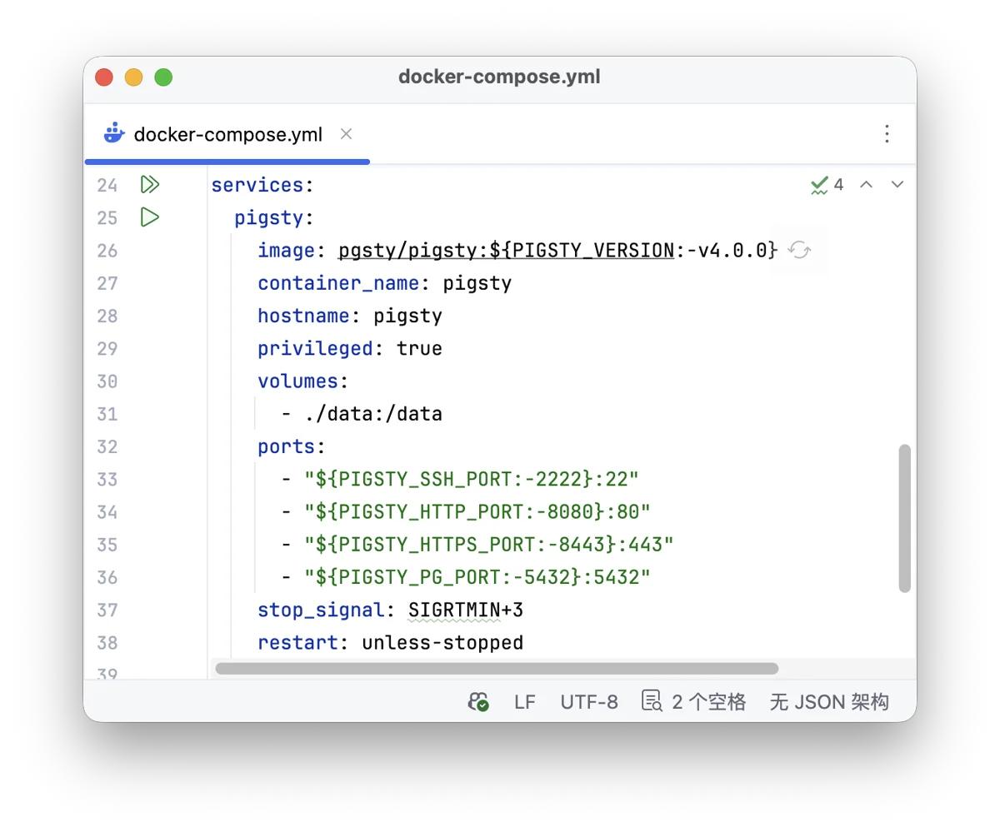
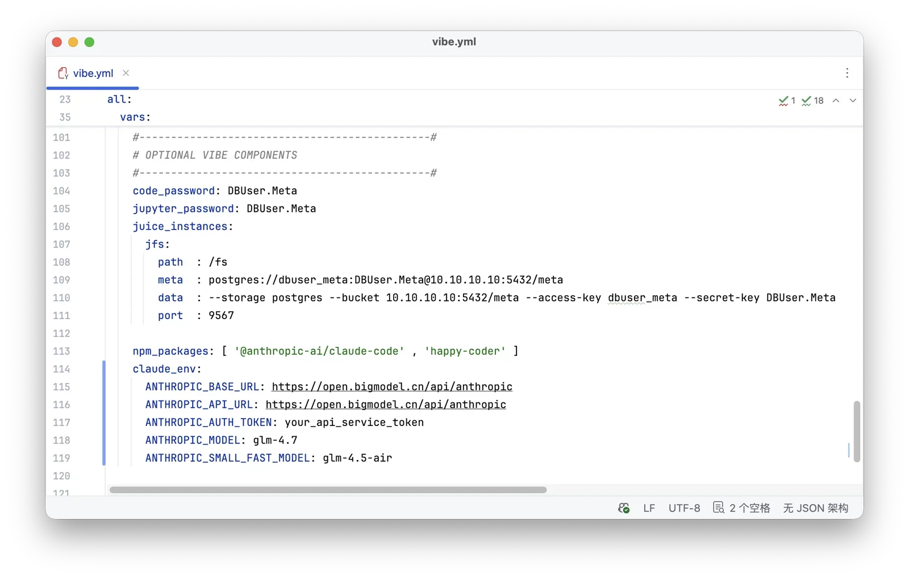
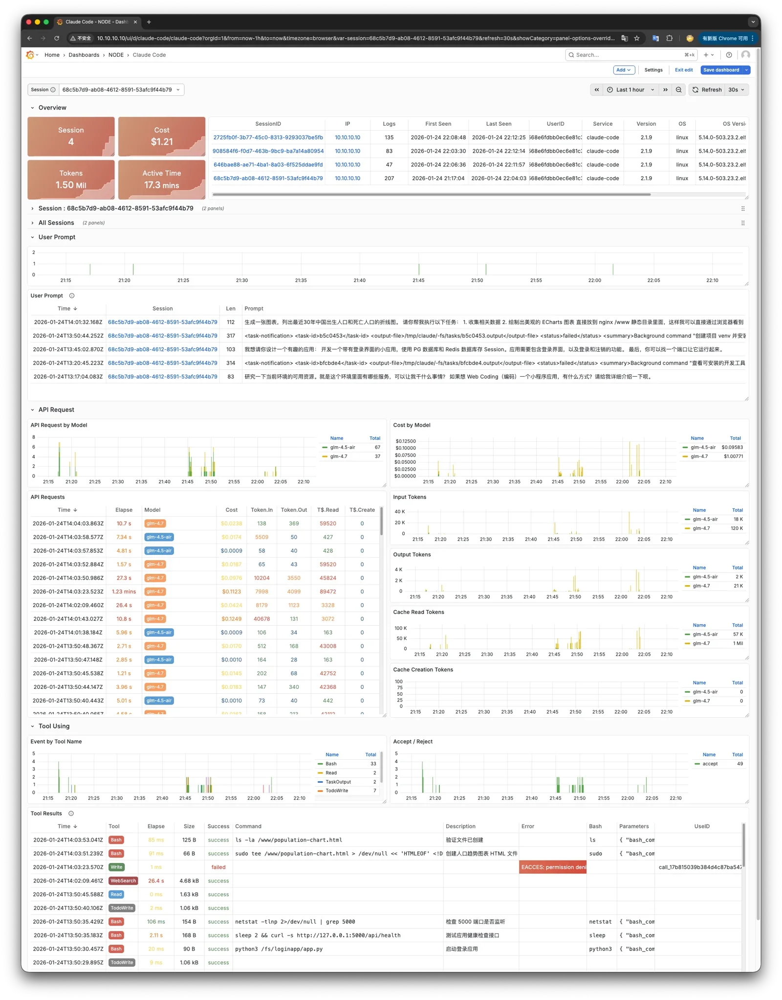

**Pigsty v4.0 发布了！** 这是一个具有里程碑意义的大版本。

[Pigsty](https://pigsty.cc) 是一个开箱即用、开源且本地优先的 PostgreSQL 数据库发行版。它能让你在没有数据库专家的情况下，
在本地快速搭建企业级的 PostgreSQL 数据库服务，自带监控、备份、高可用、IaC、连接池与 444 个扩展插件。

v4.0 是一次重大的架构升级，由 320 个 Commit 组成，有着将近 40 万行代码的变动（虽然其中三十多万行是监控面板）。
我认为这个版本可以称之为 "Finished Software" —— 它已经达到了一个让我自己满意的完工状态。

**v4.0 的主题是：更开放、更高效、更安全、更智能。** 下面我们会介绍一下 v4.0 的新特性，以及未来发展的展望。


------

## 太长；不看

* [协议变更：回归 Apache 2.0](#license)
* [监控焕新：Victoria 全家桶上位](#observability)
* [容器支持：Docker 党的福音](#docker)
* [PG 18 就绪：444 个可用扩展](#pg18)
* [安全加固：密码，防火墙，SELinux](#security)
* [JUICE 模块：把数据库当文件系统](#juice)
* [VIBE 模块：Claude Code 运行时](#vibe)
* [DBA Agent：Skills 与命令行](#dba-agent)
* [高可用优化：RTO/RPO 拆解与权衡](#ha)
* [瞬间克隆：瞬间复刻数据库与实例](#pitr)
* [IaC 增强：更多精细的定制旋钮](#iac)
* [Vibe 实战：九成代码由AI编写](#vibe-coding)
* [完工软件：质量达到满意状态](#finished)
* [进入 AI 时代：为 Agent 而生](#ai-era)


------

## 协议变更：回归 Apache 2.0 {#license}

Pigsty v4.0 重新从 AGPLv3 许可证改回了 Apache 2.0 宽松许可证。
对于用户来说，当你在公司使用时，就不需要再和法务去 Battle 了，ISV 也可以用它放心地集成，作为各类软件与项目的底座。
如果你想做一个自己的定制 PG 发行版，也完全可以在 Pigsty 的基础上进行，避免重复造轮子。

关于变更的细节，这里就不展开讨论了，老冯专门写了一篇文章讨论这个事。《[从AGPL到Apache：Pigsty 协议变更的思考](/pg/pigsty-relicense)》。


----

## 监控焕新：Victoria 全家桶上位 {#observability}

v4 最标志性的改动是用 [**Victoria 全家桶**](/db/victoria-stack) 替换掉了 Prometheus 和 Loki，并添加了 Tracing 能力。

VictoriaMetrics 是 Prometheus 的上位替代品，我们几年前在探探就大规模用过，效果惊人，用几分之一的资源实现了几倍的效果。

这次切换的契机是 Loki 表现不佳，而它配套的日志收集 Agent Promtail 今年也将被弃用。
我选择了目前最好的方案：VictoriaLogs + Vector，顺便也把 VMetrics + VTrace 带上了。

效果立竿见影：以前拉取一天的日志需要转圈等待，现在 VictoriaLogs 基本秒出。
我们将所有日志收集迁移到 VictoriaLogs，设计了与 Prometheus 一致的标签体系，给各组件补齐了日志监控。
各个组件都添加了 Logs 与 Panels，还新增了 Node Vector、Node Juice、Claude Code 等全新仪表盘。



架构上也做了简化：原本需要通过 Nginx 给不同组件挂载不同端点，现在所有组件统一挂载在一个 Nginx Server 上。
你不再需要区分域名和端口，一个域名甚至直接用 IP 就能访问 Grafana、日志系统、监控指标和 Alertmanager。
企业版还提供了自动汉化功能，将每个指标的标题、描述都翻译成中文，并补充了使用和解读说明。



从整体上来看，当下的 [INFRA 模块](https://pigsty.cc/docs/infra)，就像是一个 Victoria 发行版，Metrics + Logs + Trace + Alert + 统一 UI 入口。
配上开箱即用的 Grafana，就能让你轻松拥有一个企业级的可观测性平台。


------

## 容器支持：Docker 党的福音 {#docker}

Docker 容器支持，应该是社区呼声最高的功能 —— 让 Pigsty 本身跑在容器里。
以前虽然能实现，但需要手动修改参数，对基础镜像和 Systemd 配置有技术门槛。
现在，我们直接提供了官方基础镜像，只要你有 Docker，一键就可以拉起！（前提是你的 Docker Hub 已经翻好了）

```bash
cd ~/pigsty/docker; make launch	# 一键启动单机容器版 Pigsty
```



在镜像设计上，我纠结了很久，是交付一个装好了所有东西的镜像，还是一个可以部署的精简镜像。
最后我选择了后者，基于 Debian 13 官方镜像，添加了 systemd、ssh、sudo 以及 pigsty 本体，其他东西都交由 deploy 部署阶段在线完成。
这样基础镜像的大小就只有 200 MB 左右（否则是 3 GB）。

部署完成后，你就可以正常使用了，默认使用本地的 8080 端口提供 web 服务；2222 端口提供 ssh 访问；5432 端口提供数据库访问。
无论是 Windows，MacOS 还是 Linux，都可以轻松拉起，快速尝鲜。


------

## PG 18 就绪：444 个扩展严阵以待 {#pg18}

Pigsty v4 的一个核心目标，就是确保 PostgreSQL 18 成为生产可用的默认版本。
在这一轮发布周期中，我们为 TimescaleDB、ParadeDB、Citus、DocumentDB、AGE 这样的主要扩展添加了 PG 18 支持。

为了实现这一点，我们为 14 个 Linux 上的 6 个 PG 大版本编译了[约 226+ 扩展包](https://pgext.cloud/list/)，让可用扩展的总数达到了 444 个，同时还修复了不少 PGDG 中缺失的扩展组合。
还额外包括了 10 个全新的扩展：

| 扩展                                                                | 版本    | 说明                             |
|-------------------------------------------------------------------|-------|--------------------------------|
| [pg_textsearch](https://pgext.cloud/e/pg_textsearch/)             | 0.4.0 | 使用 BM25 排名的全文搜索                |
| [pg_clickhouse](https://pgext.cloud/e/pg_clickhouse/)             | 0.1.3 | 从 PostgreSQL 查询 ClickHouse 数据库 |
| [pg_ai_query](https://pgext.cloud/e/pg_ai_query/)                 | 0.1.1 | AI 驱动的 SQL 查询生成                |
| [etcd_fdw](https://pgext.cloud/e/etcd_fdw/)                       | 0.0.0 | etcd 外部数据包装器                   |
| [pg_ttl_index](https://pgext.cloud/e/pg_ttl_index/)               | 0.1.0 | 使用 TTL 索引自动过期数据                |
| [pljs](https://pgext.cloud/e/pljs/)                               | 1.0.4 | PL/JS 可信存储过程语言                 |
| [pg_retry](https://pgext.cloud/e/pg_retry/)                       | 1.0.0 | 支持指数退避的瞬态错误重试                  |
| [weighted_statistics](https://pgext.cloud/e/weighted_statistics/) | 1.0.0 | 稀疏数据的高性能加权统计函数                 |
| [pg_enigma](https://pgext.cloud/e/pg_enigma/)                     | 0.5.0 | 加密的 Postgres 数据类型              |
| [pglinter](https://pgext.cloud/e/pglinter/)                       | 1.0.1 | PostgreSQL SQL Linter          |

与此同时，我们还进一步优化了 PG 的默认参数配置策略。
例如，允许用户配置新增的 `io_method` 以充分利用异步 IO 能力，并且启用了 `file_copy_method` = `clone`，以实现对 “[瞬间克隆数据库](/pg/pg-clone)” 的支持。
PG 17/18 的新增参数和之前的老参数，我们都认真仔细地重新梳理了一遍，并根据更新过的业界最佳实践提供了表现良好的默认值。

同时，提供 Oracle 兼容性的 IvorySQL 内核与 TDE 透明加密的 [Percona](https://pigsty.cc/docs/pgsql/kernel/percona/) 内核都提供了 PG 18 的版本支持。
提供 MongoDB 兼容性的 [FerretDB](https://pigsty.cc/docs/ferret) 在我切换至微软的 DocumentDB 版本后，也提供了 PG 18 的支持。

总而言之，PG 18 的主要扩展都已经正式就位，参数也已经充分利用并优化完毕，监控指标也完整收集处理。
Pigsty 中的 PG 18 已经可以以全盛状态，进入严苛的生产环境使用！


------

## 安全加固：密码，防火墙，SELinux {#security}

Pigsty v4 也在安全方面做了大量工作，对照等保，SOC2 等合规标准，基本实现了所有能做的安全合规点。
几个值得一提的改进：

**随机默认强密码**：经常有用户部署直接用默认密码，这次我们新增了 `configure -g` 选项，自动把所有默认密码替换成随机强密码。

**ETCD 启用 RBAC**：以前全局用证书认证，现在每个 PG 集群一个自己的 etcd 用户密码。
管理节点可以管理所有集群，普通数据库节点仅能管理自身所在的集群，避免串台干扰。

**SELinux 规则优化**：以前默认关闭，现在 EL 系统中基本的安全上下文都已配置妥当，默认为 permissive 模式，可以直接按需 enforce。

**防火墙默认支持**：现在支持定义公网开放端口，内网网段。
即使云服务器没有提供安全组，你也可以自己用简单的方式将暴露面缩小到最小状态（默认开 ssh 22，http 80，https 443，按需 pgsql 5432）

此外，我们还梳理了所有用户和文件的权限属主模型，把所有数据聚拢在统一目录（`/data`）下（方便 Docker 挂载）。
根据不同用户组拆分权限，完全遵循最小权限原则。

最后，这些安全策略都是渐进式的：默认配置下只要随机生成了强密码，就已经足够安全了。
而更多高级安全选项，则供企业用户根据自己的实际情况进行利弊权衡与选用。


--------

## JUICE 模块：把数据库当文件系统 {#juice}

v4 新增的 JUICE 模块集成了 JuiceFS，可以把对象存储和 PostgreSQL 挂载成本地文件系统。
最厉害的玩法是把数据和元数据都放到同一个 PG 里，实现**文件系统和数据库的一致性 PITR**，
详见《[PGFS：将数据库作为文件系统](/pg/pgfs)》。

这解决了一个实际痛点：一个应用既有文件系统（存放知识库文件），又用了数据库。
回滚时数据库 PITR 容易，文件系统难，两者保持一致更难。
现在你可以把文件全部存到数据库里，实现整个系统的同步时间点回滚。

这种能力对 Agent 特别有用。
你可以在挂载目录上进行 Vibe Coding，所有修改实时存储在数据库中，相比 Git 手动快照的方式，可以瞬间回滚到任意历史时间点。
以前只有高端商用 CDP 设备才有这种能力，现在 Pigsty 免费提供。
在 PIGLET AI 沙箱里面，就默认配置了这个功能。



----

## VIBE 模块：Claude Code 运行时 {#vibe}

VIBE 模块为 Vibe Coding 准备，是完全可选的。
它配置好了 Node.js、Claude Code，还有 VS Code 和 Jupyter，都可以直接从浏览器访问。
此外，还有 uv python 包管理器，npm，golang，hugo 等常用工具。
中国区域的部署，还会自动配置 Python/Node 的镜像源，安装速度快，不需要翻墙。

最妙的是，我们还准备好了完整的 Claude Code 环境，可以一键帮你下载并配置好最新版本。
只需[一行配置就能使用 CC + 国产 GLM 4.7](/db/claude-code-intro) 等，提供了各种便利的快捷方式，可以让 Claude Code 以 Sandbox 模式 YOLO 运行。
还提供了一个监控 Claude Code 的 Grafana Dashboard，能让你实时了解你的 Agent 正在干什么、想什么。
甚至还带了个 happy + tmux，让你能很方便的用手机语音指挥 CC 干活。



VIBE 模块还可以和 Juice 模块配合使用，例如在 PIGLET.RUN 沙箱环境中就是这样做的：
把你的代码目录整个通过 JuiceFS 模块挂载到数据库里，就能利用数据库的时间点恢复能力，一键将文件系统和数据库同时回滚到任意时间点。

这个模块是给 [PIGLET.RUN](https://piglet.run) 准备的，也是老冯自己在云端写代码开发时使用的环境。
装好之后，你等于有了一个完整的云上开发环境，足够安全，而且工具齐备。


------

## DBA Agent：Skills 与命令行 {#dba-agent}

VIBE 这个模块，并非只是拿来搞开发用的。
它的真正用途是为老冯在做的 DBA Agent 打基础 —— 其实你现在用这个模块装好 Claude Code 之后，它已经能够在 Pigsty 环境里面做一些很有价值的事情了。
帮你巡检数据库，出个报告，优化查询之类的问题，都不在话下。

我之前写过一篇 PostgreSQL 快速上手教程：安装 Pigsty，运行 Open Code 调用 GLM-4 模型，让它扮演老师指导学习。
用户反馈效果惊人，一些 DBA 试用后说"这玩意儿怪吓人的"——给它丢个巡检任务，没做额外配置就能干得相当出色。

当然，让 Agent 在生产环境放手大干还是过于激进，所以硬性规则还是需要仔细配置的：哪些操作绝对不能做，哪些必须人工确认，权限如何划分。
我们在 pigsty 家目录里面已经有了一个基础的 [**CLAUDE.md**](https://github.com/pgsty/pigsty/blob/main/CLAUDE.md) 告诉 CC 什么能做，什么不能做，你在这个目录里面启动，就可以启用它。

Pigsty 做 DBA Agent 有一个得天独厚的优势，就是它的上下文与环境是高度确定，而且是用代码清晰描述管理的。
Pigsty 从第一天就坚持 **IaC（基础设施即代码）** + **CLI（命令行工具）** 的理念，只将图形界面用于监控系统，而非管控。

因为我们相信程序化，智能化管理的终局就是 IAC + CLI。
因此 CC 只需简单读取 pigsty.yml 配置文件，就能知道你的环境中有什么模块组件，如何访问与使用。

而一个简单易用的 AgentNative CLI，更是会让 DBA 和 DBA Agent 如虎添翼。
这次跟着 Pigsty v4 一起发布的 [pig v1.0](https://www.postgresql.org/about/news/pig-v10-released-with-pgextcloud-444-pg-extensions-on-14-linux-3214/)，就提供了许多这样的能力封装，将原本复杂的命令与操作序列，组织为傻瓜 / Agent 都会用的命令，后面将专门写文章介绍。


------

## 高可用优化：RTO/RPO 拆解与权衡 {#ha}

除了 AI4PG 和 PG4AI，Pigsty v4 也在数据库服务的核心基本功上做了很多优化。
之前也在 《[PostgreSQL 高可用到底怎么做？](/pg/pg-ha-sota)》这篇文章中详细介绍过。

Pigsty 用户的场景很广泛：同机柜部署、跨机房容灾、跨大洲架构（延迟 200ms+、高丢包）。
这些场景对高可用参数的要求完全不同。

以前我们只是共用一套调整了的 Patroni 参数集，而这次我们针对几种不同的情况，提供了四种预制的参数模板。


同理，我们也照着 Oracle 的数据保护模式，提出了三种典型的 RPO 模板，供用户在数据一致性与性能/可用性之间进行利弊权衡。


有意思的是，当我们深入研究这个主题的时候，我们发现市面上绝大多数基于 Patroni 的高可用方案使用的都是默认参数，也没有人详细分析过 RTO 的组成。
所以这里我定量分析了几种故障路径下 RTO 的详细组成，并确保这几组参数的最劣情况 RTO 不超过指定上界。
用理论分析，确保用户在用 Patroni 高可用的时候，做到心里有数、安心放心。


> 用理论拆解的方式，将四组参数的 RTO 上限控制在 30/45/90/150s 内


------

## 瞬间克隆：瞬间复刻数据库与实例 {#pitr}

不仅仅是高可用有改进，在 PITR 上也有了显著的优化 《[Git for Data: 瞬间克隆PG数据库](/pg/pg-clone)》。
PostgreSQL 18 带来了瞬间克隆能力，这是 AI 应用特别需要的：快速、低成本地 Clone 一个副本。

生产库可能几百 GB 甚至几个 TB，不可能直接在上面做测试。
Fork 采用 COW（写时拷贝）技术，即使超大型数据库也能在 200 毫秒左右完成克隆。
最酷的是克隆后存储空间不变：两个 100GB 的数据库，总占用依然是 100GB。

```yaml
pg-meta:
  hosts:
    10.10.10.10: { pg_seq: 1, pg_role: primary }
  vars:
    pg_cluster: pg-meta
    pg_version: 18
    pg_databases:
      - { name: meta }  # <----- 待克隆的数据库
      - { name: meta_dev ,template: meta , strategy: FILE_COPY}  # bin/pgsql-db meta_dev
```

如果使用 XFS 文件系统（Linux 主流默认），还能获得实例级别的瞬间克隆能力：瞬间克隆出一个大实例，不占用额外存储，不影响线上业务。
再加上经典的集群 PITR 能力，总结起来，你可以在**实例、数据库、集群**三个层面快速克隆 PostgreSQL，并回滚到保留期内的任意时间点。

为了进一步降低 PITR 的门槛，我们还把 PITR 能力做到了 `pig` 命令行工具里：运行 `pig pitr`，它自动帮你傻瓜式地处理一切。
将数据库集群以原地/增量/快速高效的方式，恢复到你指定的目标点。
这样，无论是新手还是 AI Agent 都能轻松利用起来，门槛就得做到这种程度才够劲。


------

## IaC 增强：更多精细的定制旋钮 {#iac}

以前 Pigsty 不提供删除用户和删除数据库的能力，因为删除操作很危险，涉及清理依赖对象和权限的复杂 SOP。
但用户确实有这个需求：配置复杂资源搞糊了，想删掉重来。
这次我们实现了删库和删用户功能。
不要小看删除用户这样的功能 —— 看似简单，实际上要做好非常难：几乎所有的云数据库服务，都只支持很简单的删除 "裸用户"，一旦用户身上挂着依赖，系统直接报错。

v4 也调整了 IAC API 设计，新增并对齐了直到 PG 18 的新增可用参数。
例如，在用户层对角色继承的三个选项 `ADMIN`, `INHERIT`, `SET` 提供了定制支持。
你也可以为数据库指定额外的 Locale 参数，并指定 state 用于删除或者重建数据库与用户，以及数据库内的 Schema 和 Extension。

现在 HBA 规则定义支持了额外的 `order` 字段，这意味着你可以明确指定每条规则的优先级顺序。
同时内网网段的定义，也可以进行定制与修改了，并与默认防火墙策略保持一致。
PG 有了自己专门的 Crontab 列表，与系统的全局定时任务区别开来。

此外，我们还改善了许多细节，对几乎所有的参数位点都做了防注入处理，并单独处理了一些 PG 特殊的列表参数，细节就不过多展开了。
最终的效果是，你可以用 IaC 的方式定制 PostgreSQL 集群里面的各种细节。
从数据库，用户，继承关系，权限，HBA，服务，到扩展，模式，一步到位，拉起可以直接供业务生产就绪的数据库集群。
而且这种 IaC 配置文件定义的方式，对于 DBA 与 DBA Agent 来说，都非常自然友好。


------

## Vibe 实战：品味与验收是护城河 {#vibe-coding}

最后来聊一下 Pigsty v4 的工程实践吧，Pigsty v4.0 中 九成以上的代码都是 Claude Code 编写的。
我只负责三件事：提出思路，设计 API，验收结果。方法论分四个阶段：

**设计**：扮演产品经理，与 AI 探讨生成设计文档。API 设计的品位 CC 还不够好，这部分必须亲自操刀。

**实现**：新 Session 让 AI 实现代码，完成后让它进行 10 轮自我反思与修正，每轮给出评审意见直至满意。

**Review**：开启另一个 Session，让 AI 在虚拟机沙箱中进行自动化测试。

**验收**：最后手工测试验证。

Claude Code 像一个聪明但略缺领域经验的天才实习生。
只要你的直觉正确、方向对了，它就能把细节做得很到位。
这种老带新结对编码效率很高，我通常并行推进三个 User Story —— CC 写代码极快，瓶颈卡在我身上。

通常确定设计方案之后，CC 的一次出活率能到 90%+，剩下 10% 就要多次迭代优化拉扯了。
特别是对于 RDS 这种几乎没有公开资料的领域，需要各种人工指导才能达到最终的满意效果。


Claude Code 有两件事情做得还不太理想：
一是 API 设计，这个还是需要品位来把关，CC 只能提供一些思路与建议；
二是验证效率，目前瓶颈在于人工验证的速度（卡在我身上），因为执行冒烟测试 SOP 太慢。

这给我一个启示：**在 Agent 编码时代，设计的品味与验证的能力才是真正的护城河。**
硬核项目即便开源了代码，绝大多数人既没有二次开发能力，更缺乏 QA 能力——这才是壁垒所在。
代码会越来越 "便宜"，但 "把正确的东西做对" 依然昂贵。

这让我想到 SQLite 的模式：源代码公开在 public domain，但核心测试套件 TH3 是专有的。
在 AI 助手加持下，一个超级个体就能顶一个满编团队，引入外部贡献反而会拖慢节奏。
所以，Pigsty 也将采用类似路线：**Open Source, but not Open Collaboration** —— 只接受 Issue、特性请求与反馈，不再接受 PR。


-----

## 完工软件：质量达到满意状态 {#finished}

正如《[从AGPL到Apache：Pigsty 协议变更的思考](/pg/pigsty-relicense)》里说过的，我能给 v4.0 这个版本打一个 90 分的水准。
SOTA AI 给出的结论也基本差不多：在 PostgreSQL 服务质量上，免费的 Pigsty 已经优于头部云 RDS ，在开源方案中也达到了顶尖水准。

所以老冯觉得也差不多了，在文章开头说，Pigsty v4.0 可以称之为 “Finished Software”。

但 "完成" 不是 "归档"。软件的生命周期里，Finished 意味着它已经足够好、足够稳定、足够让人放心地用于生产。
就像一把好刀，开刃完成了，接下来是长期的使用、保养、传承。Pigsty 我会持续维护——Bug 修复、版本跟进、扩展打包，有 AI 帮助这些工作不费多少时间，每年跟进一个 PG 大版本就好。
剩下的 10 分，留给生态、产品、商业服务去生长。

而我的精力，终于可以腾出手来，正式转向那个三年前就埋下的伏笔。


------

## 进入 AI 时代：为 Agent 而生 {#ai-era}

三年前，老冯写下 《[数据库需求金字塔](https://vonng.com/db/demand-pyramid/)》 ，就已经将 **智能自治数据库** 列为终极目标。
彼时这只是愿景，而今天，它真正成为可能。

Pigsty 从第一天起就坚持 IaC + CLI，把 GUI 只用于观测而非管控。很多人不理解：为什么不做个漂亮的控制台？

现在答案清晰了——**因为我们在等 Agent。**

Agent 不需要点按钮，它需要读配置、调 API、执行命令。Pigsty 的架构天然为程序化管理而生。
当别人还在琢磨如何让 AI 操作图形界面时，Pigsty 用户已经可以让 Claude Code 直接读取 `pigsty.yml`，理解整个基础设施，然后动手干活了。

**这就是"进入 AI 时代"的真正含义：不是给软件加个 AI 功能，而是让软件本身成为 AI 的原生栖息地。**

为此，我准备了两翼：

**PIG** —— 原本只是个包管理器，在 v1.0 中重新定位为 PostgreSQL 生态的 Agent Native CLI，
完整接管数据库、连接池、高可用、备份、接入的全生命周期。它是 Agent 操作 PostgreSQL 的双手。

**PIGLET.RUN** —— 一个以 PostgreSQL 为中心的 Agent 运行时。
轻量化的 Pigsty 子发行版，用户动动嘴，就能生成完整的、带有数据库的复杂应用。它是 Agent 栖息的土壤。

而 Pigsty 本身，要成为那个让你在 AI 时代依然保持确定性的基础设施底座 ——
**敢让 Agent 放手干活，也敢在它干错的时候一键回到昨天。**

用 IaC 描述它，用观测理解它，用权限约束它，用 PITR 纠正它。
这不是 “又一个 PostgreSQL 装机脚本”，而是一整套把复杂系统关进笼子里的工程方法。

------

数据是系统的命脉，数据库是守护命脉的心脏。

Agent 正在成为新的生命形式。它们会思考、会行动、会犯错、会学习。

而每一个生命，都需要一颗可靠的心脏。

**Pigsty v4.0，为这个时代而生。**

欢迎入局。


---------

# v4.0.0 发行注记

## 快速上手

```bash
curl https://pigsty.cc/get | bash -s v4.0.0
```

**320 个提交**，604 文件变更，+118,655 / -327,552 行

**发布日期: 2026-01-28** | [GitHub](https://github.com/pgsty/pigsty/releases/tag/v4.0.0) | [英文文档](https://pigsty.io) | [中文文档](https://pigsty.cc)

---

## 亮点特性

- **可观测性革命**: Prometheus → VictoriaMetrics（10x 性能提升），Loki + Promtail → VictoriaLogs + Vector
- **安全加固**: 自动生成强密码、etcd RBAC、防火墙/SELinux 模式、权限收紧、Nginx Basic Auth
- **Docker 支持**：支持在 Docker 容器中运行 Pigsty
- **新增模块**：Juice，提供将 PG 挂载为文件系统并进行 PITR 的能力
- **新增模块**：VIBE，提供 Claude Code、Jupyter、VS Code Server、Node.js 的配置与可观测性
- **数据库管理**: `pg_databases` state（create/absent/recreate）、`strategy` 瞬间克隆数据库
- **PITR 与分叉**: `/pg/bin/pg-fork` CoW 瞬间克隆、`pg-pitr` 增强支持 PITR 前备份
- **高可用增强**: `pg_rto` 提供四档 RTO 预置参数（fast/norm/safe/wide），`pg_crontab` 定时任务
- **多云 Terraform**: AWS、Azure、GCP、Hetzner、DigitalOcean、Linode、Vultr、腾讯云模板
- **许可证变更**: AGPL-3.0 → Apache-2.0


[](https://github.com/pgsty/pigsty/releases/tag/v4.0.0)


---

## 基础设施软件包更新

MinIO 开始使用 [**pgsty/minio**](https://github.com/pgsty/minio) fork RPM/DEB.

| 软件包                 | 版本      | 软件包               | 版本       |
|---------------------|---------|-------------------|----------|
| victoria-metrics    | 1.134.0 | victoria-logs     | 1.43.1   |
| vector              | 0.52.0  | grafana           | 12.3.1   |
| alertmanager        | 0.30.1  | etcd              | 3.6.7    |
| duckdb              | 1.4.4   | pg_exporter       | 1.1.2    |
| pgbackrest_exporter | 0.22.0  | blackbox_exporter | 0.28.0   |
| node_exporter       | 1.10.2  | minio             | 20251203 |
| pig                 | 1.0.0   | claude            | 2.1.19   |
| opencode            | 1.1.34  | uv                | 0.9.26   |
| asciinema           | 3.1.0   | prometheus        | 3.9.1    |
| pushgateway         | 1.11.2  | juicefs           | 1.4.0    |
| code-server         | 4.100.2 | caddy             | 2.10.2   |
| hugo                | 0.154.5 | cloudflared       | 2026.1.1 |
| headscale           | 0.27.1  |                   |          |

---

## Docker 支持

Pigsty 现在支持在 **Docker 容器**中运行，完整支持 systemd，兼容 macOS (Docker Desktop) 与 Linux。

**快速开始**：
```bash
cd ~/pigsty/docker; make launch    # = make up config deploy
```


---

## 新增模块

v4.0.0 新增两个**可选模块**，不影响 Pigsty 核心功能，按需安装即可：

**JUICE 模块**：JuiceFS 分布式文件系统

- 使用 PostgreSQL 作为元数据引擎，支持利用 PITR 恢复文件系统
- 支持多种存储后端：PostgreSQL 大对象、MinIO、S3
- 支持多实例部署，每个实例暴露 Prometheus 指标端口
- 新增 `node-juice` 仪表盘监控 JuiceFS 状态
- 新增剧本 `juice.yml` 用于部署和管理 JuiceFS 实例
- 参数：`juice_cache`、`juice_instances`

**VIBE 模块**：AI 辅助编程沙箱环境（整合了 Code-Server、JupyterLab、Node.js 与 Claude Code）

- **Code-Server**：浏览器中的 VS Code
  - 在节点上部署 Code-Server，通过 Nginx 反向代理提供 HTTPS 访问
  - 支持 Open VSX 和 Microsoft 两种扩展市场
  - 设置 `code_enabled: false` 可禁用
  - 参数：`code_enabled`、`code_port`、`code_data`、`code_password`、`code_gallery`

- **JupyterLab**：交互式计算环境
  - 在节点上部署 JupyterLab，通过 Nginx 反向代理提供 HTTPS 访问
  - 支持 Python 虚拟环境配置，便于安装数据科学库
  - 设置 `jupyter_enabled: false` 可禁用
  - 参数：`jupyter_enabled`、`jupyter_port`、`jupyter_data`、`jupyter_password`、`jupyter_venv`

- **Node.js**：JavaScript 运行时环境
  - 安装 Node.js 和 npm 包管理器
  - 当 `region=china` 时自动配置中国 npm 镜像
  - 设置 `nodejs_enabled: false` 可禁用
  - 参数：`nodejs_enabled`、`nodejs_registry`

- **Claude Code**：AI 编程助手 CLI 配置
  - 配置 Claude Code CLI，跳过 onboarding 流程
  - 内置 OpenTelemetry 可观测性配置，将指标和日志发送到 VictoriaMetrics/VictoriaLogs
  - 新增 `claude-code` 仪表盘监控 Claude Code 的使用情况
  - 设置 `claude_enabled: false` 可禁用
  - 参数：`claude_enabled`、`claude_env`

- 新增剧本 `vibe.yml` 用于部署完整的 VIBE 模块
- 配合 `conf/vibe.yml` 配置模板，可快速搭建完整的 AI 辅助编程沙箱环境
- 公共参数：`vibe_data`（默认 `/fs`）指定 VIBE 工作空间目录

---

## PG 扩展更新

主要扩展添加 PG 18 支持：age, citus, documentdb, pg_search, timescaledb, pg_bulkload, rum 等

**新增扩展**：
- [pg_textsearch](https://github.com/timescale/pg_textsearch) 0.4.0 - TimescaleDB 全文搜索
- [pg_clickhouse](https://github.com/clickhouse/pg_clickhouse/) 0.1.3 - ClickHouse FDW
- [pg_ai_query](https://github.com/benodiwal/pg_ai_query) 0.1.1 - AI 查询扩展
- [etcd_fdw](https://github.com/pgsty/etcd_fdw) 0.0.0 - etcd 外部数据包装器
- [pg_ttl_index](https://github.com/pg-ttl-index) 0.1.0 - TTL 索引
- [pljs](https://github.com/plv8/pljs) 1.0.4 - JavaScript 存储过程语言
- [pg_retry](https://github.com/pg-retry/pg_retry) 1.0.0 - 重试扩展
- [pg_weighted_statistics](https://github.com/pgsty/pg_weighted_statistics) 1.0.0 - 加权统计
- [pg_enigma](https://github.com/pgsty/pg_enigma) 0.5.0 - 加密扩展
- [pglinter](https://github.com/pgsty/pglinter) 1.0.1 - SQL Linter
- [documentdb_extended_rum](https://github.com/microsoft/documentdb) 0.109 - DocumentDB RUM 扩展
- [mobilitydb_datagen](https://github.com/MobilityDB) 1.3.0 - MobilityDB 数据生成器

**重要更新**：

| 扩展             | 旧版本    | 新版本    | 备注                |
|----------------|--------|--------|-------------------|
| timescaledb    | 2.23.x | 2.24.0 | +PG18             |
| pg_search      | 0.19.x | 0.21.4 | ParadeDB, +PG18   |
| citus          | 13.2.0 | 14.0.0 | 分布式 PG, +PG18 预发布 |
| documentdb     | 0.106  | 0.109  | MongoDB 兼容, +PG18 |
| age            | 1.5.0  | 1.7.0  | 图数据库, +PG18       |
| pg_duckdb      | 1.1.0  | 1.1.1  | DuckDB 集成         |
| vchord         | 0.5.3  | 1.0.0  | VectorChord       |
| vchord_bm25    | 0.2.2  | 0.3.0  | BM25 全文搜索         |
| pg_biscuit     | 1.0    | 2.2.2  | Biscuit 认证        |
| pg_anon        | 2.4.1  | 2.5.1  | 数据脱敏              |
| wrappers       | 0.5.6  | 0.5.7  | Supabase FDW      |
| pg_vectorize   | 0.25.0 | 0.26.0 | 向量化               |
| pg_session_jwt | 0.3.3  | 0.4.0  | JWT 会话            |
| pg_partman     | 5.3.x  | 5.4.0  | 分区管理, PGDG        |
| pgmq           | 1.8.0  | 1.9.0  | 消息队列              |
| pg_bulkload    | 3.1.22 | 3.1.23 | 批量加载, +PG18       |
| pg_timeseries  | 0.1.7  | 0.2.0  | 时序扩展              |
| pg_convert     | 0.0.4  | 0.1.0  | 类型转换              |
| pg_clickhouse  | 0.1.2  | 0.1.3  | ClickHouse FDW    |

pgBackRest 更新至 2.58，支持 HTTP。


---

## 可观测性

- 使用全新的 VictoriaMetrics 替代 Prometheus，用几分之一的资源实现数倍的性能
- 使用全新的日志收集方案：VictoriaLogs + Vector，取代 Promtail + Loki
- 统一调整了所有组件的日志格式，PG 日志使用 UTC 时间戳（log_timezone）
- 调整了 PostgreSQL 日志的轮换方式，使用按周循环截断日志轮转模式
- 在 PG 日志中记录超过 1MB 的临时文件分配，在特定模版中启用 PG 17/18 日志新参数
- 新增了 Nginx / Syslog / PG CSV / Pgbackrest / Grafana / Redis / etcd / MinIO 等日志的 Vector 解析配置
- 注册数据源现在会在所有 Infra 节点上进行，Victoria 数据源将自动注册入 Grafana
- 新增 `grafana_pgurl` 参数，允许指定 Grafana 使用 PG 作为后端存储元数据库
- 新增 `grafana_view_password` 参数，指定 Grafana Meta 数据源使用的密码
- `pgbackrest_exporter` 的默认选项现在设置 120 秒的内部缓存间隔（原本为 600s）
- `grafana_clean` 参数的默认值现在由 `true` 改为 `false`，即默认不清除
- 新增指标收集器 `pg_timeline`，收集更实时的时间线指标 `pg_timeline_id`
- 新增 `pg:ixact_ratio` 指标，监控空闲事务占比
- `pg_exporter` 更新至 1.1.2，新增 `pg_timeline` 采集器，修复大量历史遗留问题
- 修复 `pg_recv` 指标采集器的 slot name coalesce 问题
- 启用 Blackbox ping 监控支持
- 新增 `node-vector` 仪表盘，监控 Vector 日志收集器状态
- 新增 `node-juice` 仪表盘，监控 JuiceFS 分布式文件系统状态
- 新增 `claude-code` 仪表盘，监控 Claude Code AI 编程助手使用情况
- PGSQL Cluster/Instance 仪表盘新增版本横幅显示
- 所有仪表盘使用 compact JSON 格式，大幅减少文件体积

---

## 接口改进

**剧本重命名**
- `install.yml` 剧本现在重命名为 `deploy.yml` 以更符合语义
- 新增 `vibe.yml` 剧本，用于部署 VIBE AI 编程沙箱环境

**pg_databases 数据库制备功能改进**
- 添加删库能力：可以使用 `state` 字段指定 `create`, `absent`, `recreate` 三种状态
- 添加克隆能力：数据库定义中使用 `strategy` 参数指定克隆方法
- 支持较新版本引入的 locale 配置参数：`locale_provider`，`icu_locale`，`icu_rules`，`builtin_locale`
- 支持 `is_template` 参数，将数据库标记为模板数据库
- 添加了更多类型检查，避免了字符类参数的注入
- 允许在 extension 中指定 `state: absent` 以删除扩展

**pg_users 用户制备功能改进**
- 新增参数 `admin`，类似 `roles`，但是带有 `ADMIN OPTION` 权限可以转授
- 新增 `set` 和 `inherit` 选项定制用户角色属性

**pg_hba 访问控制改进**
- 支持 `order` 字段，允许指定 HBA 规则的排序优先级
- 支持 IPv6 的 localhost 访问
- 允许通过 `node_firewall_intranet` 指定 HBA 信任的 "内网网段"

**其他改进**
- 新增 Supabase 角色的默认权限配置
- `node_crontab` 在 `node-rm` 时会自动恢复原始 crontab
- 新增 `infra_extra_services` 参数用于首页额外服务入口导航

---

## 参数优化

**I/O 参数**
- `pg_io_method` 参数：auto, sync, worker, io_uring 四种方式可选，默认 worker
- `maintenance_io_concurrency` 设置为 100（如果使用 SSD）
- `effective_io_concurrency` 从 1000 减小为 200
- `file_copy_method` 参数为 PG18 默认设置为 `clone`，提供瞬间克隆数据库的能力

**复制槽与日志参数**
- `idle_replication_slot_timeout` 默认 7d，crit 模板 3d
- `log_lock_failures`：oltp, crit 模版开启
- `track_cost_delay_timing`：olap, crit 模版开启
- `log_connections`：oltp/olap 开启认证日志，crit 开启全部日志

**高可用参数**
- 新增 `pg_rto_plan` 参数，整合 Patroni 与 HAProxy 的 RTO 相关配置
  - `fast`: 最快故障转移（~15s），适合对可用性要求极高的场景
  - `norm`: 标准模式（~30s），平衡可用性与稳定性（默认）
  - `safe`: 安全模式（~60s），减少误判概率
  - `wide`: 宽松模式（~120s），适合跨地域部署
- `pg_crontab` 参数：为 postgres dbsu 配置定时任务
- 对于 PG17+，如果 `pg_checksums` 开关关闭，在 Patroni 初始化集群时显式禁用校验和
- Crit 模板启用 Patroni 严格同步模式

**备份恢复参数**
- PITR 默认 `archive_mode` 改为 `preserve`，确保恢复后保留归档能力
- `pg-pitr` 支持恢复前自动备份数据

**其他改进**
- 修复了 `duckdb.allow_community_extensions` 总是生效的问题
- 现在 pg_hba 与 pgbouncer_hba 支持 IPv6 的 localhost 访问

---

## 架构改进

**目录与门户**
- 在 Infra 节点上，设置固定的 `/infra` 软连接指向 Infra 数据目录 `/data/infra`
- 现在 Infra 的数据默认放置于 `/data/infra` 目录下，这使得在容器中使用更为便利
- 本地软件仓库现在放置于 `/data/nginx/pigsty`，`/www` 现在作为软链接指向 `/data/nginx` 确保兼容
- DNS 解析记录现在放置于 `/infra/hosts` 目录下，解决了 Ansible SELinux 竞态问题
- 默认首页域名从 `h.pigsty` 更名为 `i.pigsty`，新增中文首页支持

**运维脚本**
- 新增了 `/pg/bin/pg-fork` 脚本，用于快速创建 CoW 副本数据库实例
- 调整 `/pg/bin/pg-pitr` 脚本，现在可以用于实例级别的 PITR 恢复，支持恢复前自动备份
- 新增 `/pg/bin/pg-drop-role` 脚本，用于安全删除用户角色
- 新增 `bin/pgsql-ext` 脚本，用于安装 PostgreSQL 扩展
- 恢复 `pg-vacuum` 和 `pg-repack` 脚本

**新增剧本**
- `juice.yml`：部署 JuiceFS 分布式文件系统实例
- `vibe.yml`：部署 VIBE AI 编程沙箱环境（含 Code-Server、JupyterLab、Node.js、Claude Code）

**模块改进**
- 显式安装 cron/cronie 包，确保定时任务功能在最小化安装的系统上可用
- UV Python 包管理器从 `infra` 模块迁移至 `node` 模块，新增 `node_uv_env` 参数指定虚拟环境路径
- `pg_remove`/`pg_pitr` 移除 etcd 元数据的任务，现在不再依赖 admin_ip 管理节点，而在 etcd 集群上执行
- 36 节点仿真模板 simu 简化为 20 节点的版本
- 适配上游变化，移除 PGDG sysupdate 仓库，移除 EL 系统上所有 llvmjit 的相关包
- 为 EPEL 10 / PGDG 9/10 仓库使用操作系统完整版本号（`major.minor`）
- 允许在仓库定义中指定 `meta` 参数，覆盖 yum 仓库的定义元数据
- 确保 Vagrant libvirt 模板默认带有 128GB 磁盘，以 xfs 挂载于 `/data`
- 确保 pgbouncer 不再将 `0.0.0.0` 监听地址修改为 `*`
- 新增 10 节点、Citus 等 Vagrant 配置模板
- 恢复 EL7 系统兼容性支持

**系统调优**
- 基于实际工作负载调整 systemd 服务的 NOFILE 限制
- 修复 tuned profile 激活问题（通过重启 tuned 服务）
- 添加 PostgreSQL systemd 服务运行时目录
- 修复 `ip_local_port_range` 起止值奇偶对齐问题

**多云支持**
- 多云 Terraform 模板：AWS、Azure、GCP、Hetzner、DigitalOcean、Linode、Vultr、腾讯云

---

## 安全改进

**密码管理**

- `configure` 现在支持 `-g` 参数自动生成随机强密码，避免使用默认密码带来的安全隐患
- 更改了 MinIO 模块的默认密码，避免与众所周知的默认密码冲突

**防火墙与 SELinux**
- 移除 `node_disable_firewall`，新增 `node_firewall_mode`，支持 off, none, zone 三种模式
- 移除 `node_disable_selinux`，新增 `node_selinux_mode`，支持 disabled, permissive, enforcing 三种模式
- 为 HAProxy、Nginx、DNSMasq、Redis 等组件配置了正确的 SELinux 上下文

**访问控制**
- 启用了针对 etcd 的 RBAC，每个集群现在只能管理自己的 PostgreSQL 数据库集群
- etcd root 密码现在放置于 `/etc/etcd/etcd.pass` 文件中，仅对管理员可读
- 将 `admin_ip` 添加到 Patroni API 允许访问的 IP 列表白名单中
- 总是创建 admin 系统用户组，patronictl 配置收紧为仅限 admin 组用户访问
- 新增 `node_admin_sudo` 参数，允许指定/调整数据库管理员的 sudo 权限模式（all/nopass）
- 收回了所有非 root 用户对可执行脚本的拥有权限

**证书与认证**
- 新增 Nginx Basic Auth 支持，可以为 Nginx Server 设置可选的 HTTP Basic Auth
- 修复 ownca 证书有效期问题，确保了 Chrome 可以识别自签名证书
- 新增 `vip_auth_pass` 参数用于 VRRP 认证

**其他**
- 修复了若干 `ansible copy content` 字段为空时报错的问题
- 修复了 `pg_pitr` 中遗留的一些问题，确保 Patroni 集群恢复时没有竞态条件
- 使用 `mode 0700` 保护 `files/pki/ca` 目录


---

## 问题修复

| 问题                                       | 说明                            |
|------------------------------------------|-------------------------------|
| ownca 证书有效期 Chrome 兼容性问题                 | 正确设置 ownca_not_after 参数       |
| Vector 0.52 syslog_raw 解析问题              | 适配新版本 Vector 的解析格式变化          |
| pg_pitr 多副本 clonefrom 时序问题               | 修复 Patroni 集群恢复的竞态条件          |
| Ansible SELinux dnsmasq 竞态条件             | 将 DNS 记录移至 /infra/hosts 目录    |
| EL9 aarch64 patroni & llvmjit 问题         | 热修复 ARM64 架构兼容性问题             |
| Debian groupadd 路径问题                     | 修复 Debian 系统用户组添加路径           |
| 空 sudoers 文件生成问题                         | 防止生成空的 sudoers 配置文件           |
| pgbouncer pid 路径                         | 使用 `/run/postgresql` 替代旧路径    |
| `duckdb.allow_community_extensions` 始终生效 | 修复 DuckDB 扩展配置问题              |
| pg_partman EL8 上游问题                      | 因上游问题隐藏 EL8 上的 pg_partman 扩展  |
| HAProxy 服务模板变量路径                         | 修复变量引用路径错误                    |
| Redis remove 任务变量名                       | 修复 redis_seq 到 redis_node 变量名 |
| MinIO reload handler 无效                  | 移除无效的 reload 处理器              |
| vmetrics_port 默认值                        | 修正为正确的 8428 端口                |
| pg-failover-callback 脚本                  | 处理所有 Patroni 回调事件             |
| pg-vacuum 事务块问题                          | 修复事务块处理逻辑                     |
| pg_sub_16 并行逻辑复制 worker                  | 添加 PG16+ 并行逻辑复制支持             |
| FerretDB 证书 SAN 和重启策略                    | 修复证书配置和服务重启策略                 |
| Polar Exporter 指标类型                      | 修正监控指标类型定义                    |
| proxy_env 包安装缺失                          | 修复代理环境变量未传递问题                 |
| patroni_method=remove 服务问题               | 修复移除模式下 postgres 服务配置         |
| Docker 默认数据目录                            | 更新为正确的默认数据目录路径                |
| EL10 缓存兼容性                               | 修复 EL10 系统上的缓存问题              |
| etcd/MinIO 移除时清理不完整                      | 修复 systemd 服务和 DNS 条目清理       |
| IvorySql 18 file_copy_method             | 修复 IvorySql 18 不支持 clone 方法问题 |
| tuned profile 激活                         | 通过重启 tuned 服务修复激活问题           |


---

## 参数变化

**新增参数**

| 参数                       | 类型     | 默认值           | 说明                               |
|--------------------------|--------|---------------|----------------------------------|
| `node_firewall_mode`     | enum   | none          | 防火墙模式：off/none/zone              |
| `node_selinux_mode`      | enum   | permissive    | SELinux 模式                       |
| `node_firewall_intranet` | string | -             | HBA 信任的内网网段                      |
| `node_admin_sudo`        | enum   | nopass        | 管理员 sudo 权限级别                    |
| `pg_io_method`           | enum   | worker        | I/O 方法：auto/sync/worker/io_uring |
| `pg_rto_plan`            | dict   | -             | RTO 预设：fast/norm/safe/wide       |
| `pg_crontab`             | list   | []            | postgres dbsu 定时任务               |
| `vip_auth_pass`          | string | -             | VRRP 认证密码                        |
| `grafana_pgurl`          | string | -             | Grafana PG 后端连接字符串               |
| `grafana_view_password`  | string | DBUser.Viewer | Grafana Meta 数据源密码               |
| `infra_extra_services`   | list   | []            | 首页额外服务入口                         |
| `juice_cache`            | path   | /data/juice   | JuiceFS 共享缓存目录                   |
| `juice_instances`        | dict   | {}            | JuiceFS 实例定义                     |
| `vibe_data`              | path   | /fs           | VIBE 工作空间目录                      |
| `code_enabled`           | bool   | true          | 是否启用 Code-Server                 |
| `code_port`              | port   | 8443          | Code-Server 监听端口                 |
| `code_data`              | path   | /data/code    | Code-Server 数据目录                 |
| `code_password`          | string | Vibe.Coding   | Code-Server 登录密码                 |
| `code_gallery`           | enum   | openvsx       | 扩展市场：openvsx/microsoft           |
| `jupyter_enabled`        | bool   | true          | 是否启用 JupyterLab                  |
| `jupyter_port`           | port   | 8888          | JupyterLab 监听端口                  |
| `jupyter_data`           | path   | /data/jupyter | JupyterLab 数据目录                  |
| `jupyter_password`       | string | Vibe.Coding   | JupyterLab 登录 Token              |
| `jupyter_venv`           | path   | /data/venv    | Python 虚拟环境路径                    |
| `claude_enabled`         | bool   | true          | 是否启用 Claude Code 配置              |
| `claude_env`             | dict   | {}            | Claude Code 额外环境变量               |
| `nodejs_enabled`         | bool   | true          | 是否启用 Node.js 安装                  |
| `nodejs_registry`        | string | ''            | npm registry，自动配置中国镜像            |
| `node_uv_env`            | path   | /data/venv    | 节点 UV 虚拟环境路径，空则跳过                |
| `node_pip_packages`      | string | ''            | UV 虚拟环境中安装的 pip 包                |

**移除参数**

| 参数                      | 说明                        |
|-------------------------|---------------------------|
| `node_disable_firewall` | 由 `node_firewall_mode` 替代 |
| `node_disable_selinux`  | 由 `node_selinux_mode` 替代  |
| `infra_pip_packages`    | 由 `node_pip_packages` 替代  |
| `pgbackrest_clean`      | 未使用参数，已移除                 |
| `pg_pwd_enc`            | 已移除，统一使用 scram-sha-256    |
| `code_home`             | 由 `vibe_data` 替代          |
| `jupyter_home`          | 由 `vibe_data` 替代          |

**默认值变更**

| 参数                         | 变化                       | 说明         |
|----------------------------|--------------------------|------------|
| `grafana_clean`            | true → false             | 默认不清除      |
| `effective_io_concurrency` | 1000 → 200               | 更合理的默认值    |
| `node_firewall_mode`       | zone → none              | 默认不启用防火墙规则 |
| `install.yml`              | 重命名为 `deploy.yml`        | 更符合语义      |


---

## 兼容性

| 操作系统               | x86_64 | aarch64 |
|--------------------|:------:|:-------:|
| EL 8/9/10          |   ✅    |    ✅    |
| Debian 11/12/13    |   ✅    |    ✅    |
| Ubuntu 22.04/24.04 |   ✅    |    ✅    |

**PostgreSQL**: 13, 14, 15, 16, 17, 18

---

## 校验和

```bash
9f42b8c64180491b59bd03016c26e8ca  pigsty-v4.0.0.tgz
db9797c3c8ae21320b76a442c1135c7b  pigsty-pkg-v4.0.0.d12.aarch64.tgz
1eed26eee42066ca71b9aecbf2ca1237  pigsty-pkg-v4.0.0.d12.x86_64.tgz
03540e41f575d6c3a7c63d1d30276d49  pigsty-pkg-v4.0.0.d13.aarch64.tgz
36a6ee284c0dd6d9f7d823c44280b88f  pigsty-pkg-v4.0.0.d13.x86_64.tgz
f2b6ec49d02916944b74014505d05258  pigsty-pkg-v4.0.0.el10.aarch64.tgz
73f64c349366fe23c022f81fe305d6da  pigsty-pkg-v4.0.0.el10.x86_64.tgz
287f767fbb66a9aaca9f0f22e4f20491  pigsty-pkg-v4.0.0.el8.aarch64.tgz
c0886aab454bd86245f3869ef2ab4451  pigsty-pkg-v4.0.0.el8.x86_64.tgz
094ab31bcf4a3cedbd8091bc0f3ba44c  pigsty-pkg-v4.0.0.el9.aarch64.tgz
235ccba44891b6474a76a81750712544  pigsty-pkg-v4.0.0.el9.x86_64.tgz
f2791c96db4cc17a8a4008fc8d9ad310  pigsty-pkg-v4.0.0.u22.aarch64.tgz
3099c4453eef03b766d68e04b8d5e483  pigsty-pkg-v4.0.0.u22.x86_64.tgz
49a93c2158434f1adf0d9f5bcbbb1ca5  pigsty-pkg-v4.0.0.u24.aarch64.tgz
4acaa5aeb39c6e4e23d781d37318d49b  pigsty-pkg-v4.0.0.u24.x86_64.tgz
```