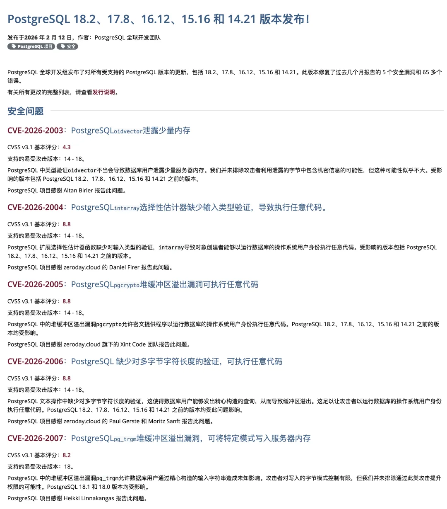

> [**GitHub Release**](https://github.com/pgsty/pigsty/releases/tag/v4.1.0) | [**发布注记**](https://pigsty.cc/docs/about/release/#v410)

[](https://github.com/pgsty/pigsty/releases/tag/v4.1.0)

先说结论：**天下武功，唯快不破**。2026年2月12日，PostgreSQL 社区例行发布了 [18.2 / 17.8 / 16.12 / 15.16 / 14.21](https://www.postgresql.org/about/news/postgresql-182-178-1612-1516-and-1421-released-3235/) 五个小版本。
同一天，据我所见全球范围内给出生产级支持的只有三家：**AWS RDS**，**EDB**，**Pigsty**。



一个开源独立项目，在交付速度上站到了和全球最大云厂商以及 PG 老大哥站在同档速度线上。这件事本身就是我想用 v4.1 讲的故事。

------

## 为什么"快"是最重要的能力

做数据库发行版这几年，我越来越清楚一个道理：**用户不缺功能，缺的是信任**。

信任从哪来？不是 PPT 上写了多少特性，而是在关键时刻你能不能兑现。PostgreSQL 每次小版本更新，
往往带着 bugfix、稳定性修正、安全修补 —— 这些不是锦上添花，而是亡羊补牢。你跟进慢一天，用户就多暴露一天。


很多发行版的节奏是这样的：上游发布后做做内部测试，打包构建，最后两个月过去，发个博客说 “我们现在支持 PG 新版本了”。
等到那个时候，真正着急的用户早就自己手动升级了 —— “支持” 变成了事后追认，而不是事前保障。

| PG 版本     | 社区发布日期     | AWS RDS  | Cloud SQL | 阿里云 RDS | 腾讯云      | 华为云 RDS  |
|:----------|:-----------|:---------|:----------|:--------|:---------|:---------|
| **PG 12** | 2019-10-03 | **180天** | **90天**   | **88天** | **365天** | **150天** |
| **PG 13** | 2020-09-24 | **153天** | **165天**  | **97天** | **270天** | **210天** |
| **PG 14** | 2021-09-30 | **119天** | **76天**   | **91天** | **270天** | **300天** |
| **PG 15** | 2022-10-13 | **138天** | **230天**  | **64天** | **180天** | **335天** |
| **PG 16** | 2023-09-14 | **67天**  | **90天**   | **84天** | **55天**  | **210天** |
| **PG 17** | 2024-09-26 | **49天**  | **28天**   | **21天** | **63天**  | **160天** |
| **PG 18** | 2025-09-25 | **50天**  | **56天**   | **78天** | **1天**   | 尚未支持     |

我想做的恰恰相反：**让"跟进"这件事，快到用户根本不需要自己操心**。你看到 PostgreSQL 发了新版本，打开 Pigsty，发现已经准备好了 —— 这才是一个发行版应该给用户的体感。

所以 v4.1 的主线不是堆新特性，而是把"快速跟进 + 稳定交付"变成一种可持续的常规能力。这个能力才是护城河，因为它考验的不是某一次的冲刺，而是日复一日的工程纪律。


------

## 不止 PostgreSQL：OS 小版本也一起走

做 “快” 容易，又好又快可不容易，这次不仅是 PostgreSQL 的小版本升级，还同步推进了几个 Linux 操作系统发行版的小版本升级：

- **EL**：`9.6/10.0 → 9.7/10.1`
- **Debian**：`12.12/13.1 → 12.13/13.3`

十四个主流 Linux 发行版的最新小版本，都制作好了对应的离线软件包。

这里有个必须再次讲清楚的事情：

> **EL 9.7 / 10.1 的离线包与 EL 9.6 / 10.0 不通用。**

我知道很多用户的部署环境是内网甚至完全离线的。遇到这种包版本不匹配的情况，走在线安装就可以了。


------

## Pig Agent-Native CLI：让工具学会"自我介绍"

举个例子：你让 Claude Code 帮你在三台机器上装 PostgreSQL 18 与一堆扩展，
它调用 [**pig**](https://) 的时候不需要你手写任何 prompt 来解释 pig 怎么用 —— 因为 pig 会自己告诉它。这就是 Agent-Native 的意思。

传统 CLI 工具的设计假设是 “有个人在看屏幕”，所以它输出彩色文字、画表格、显示进度条 —— 这些对人很友好，但对 Agent 来说全是噪音。Agent 需要的是三件事：

我 Agent-Native 这个概念，很多人觉得这只是个 buzzword。但 `pig 1.1.0` 里我做的事情非常具体 —— 核心就一个词：**内自省**。

什么意思？传统 CLI 工具的设计假设是"有个人在看屏幕"。所以它输出彩色文字、画表格、显示进度条 —— 这些对人很友好，但对 Agent 来说全是噪音。Agent 需要的是：

- **能干什么** —— 工具主动暴露自己的能力列表，而不是让 Agent 去猜或者去读文档。
- **干了什么** —— 执行结果是结构化的 JSON/YAML，而不是一坨需要正则解析的文本。
- **暴露上下文** —— 环境信息可以被程序化地获取和传递。

这三件事听起来简单，但要做好需要重新审视 CLI 的每一个子命令。`pig 1.1.0` 把 JSON/YAML 从"附属输出格式"提升为 “一等公民”，让每个操作都能被机器可靠地调用和解析。

坦白说，这个需求我只是提出了理念并参与了设计讨论，剩下的实现工作都是由 Codex 和 Claude Code 完成的，我负责最后验收。所以这也算是 Pigsty 里第一个真正意义上的 AI 原生项目。


------

## AI Coding：不是写代码，是扫盲区

v4.1 开发周期里，我在 `pig` CLI 和 `pg_exporter` 上投入了大量精力。同时密集使用了 AI coding 工具做复查 —— 主要是 Claude Code 和 Codex 5.3 Extra High。

但我想说的不是"AI 多厉害"，而是 AI 在工程实践中真正好用的那个点在哪里。

答案是**扫盲区**。

一个成熟项目里，最危险的 bug 往往不是逻辑错误 —— 那种你写完就知道不对。最危险的是那些"看起来没问题、跑起来没问题、但在特定边界条件下会出问题"的细节。
比如一个指标的单位在 PG17 和 PG18 里不一样，比如一个 `io_method` 参数的版本条件写成了 `>= 17` 但实际上应该是 `>= 18`。

这类问题，人工 review 非常容易漏 —— 因为你的眼睛会自动跳过"看起来对"的代码。
但 AI 不会。它会老老实实地把每一行都过一遍，尤其在你明确告诉它"帮我检查版本守卫条件"的时候。

这轮扫下来，我额外修掉了大约十几到二十个小问题。单独看每个都不大，但累积起来就是用户体验的差距。

这里要特别感谢社区贡献者 [@l2dy](https://github.com/l2dy)，他提了很多高质量 issue，
帮我把 Grafana 仪表盘还有配置细节里一批细节问题集中收敛掉了。
开源项目能不能越做越扎实，靠的就是这种愿意认真抠细节的人。

------

## 防火墙默认策略：宁可多敲一条命令

最后讲一个看起来很小、但我认为很重要的改动。
在 v4.0 里，我把防火墙默认模式设成了 `none` —— 意思是 “完全不碰你的防火墙配置”。
初衷是好的：尊重用户现有环境，不做多余的事。但实际反馈告诉我，这个决定有问题。

问题出在哪？EL9 系列默认是开着 firewalld 的，但很多用户对自己的防火墙状态并不清楚。
当 Pigsty 选择"不碰"的时候，用户以为一切正常，结果发现内网流量不通，排查半天才发现是防火墙规则没配对。这比 Pigsty 主动配置防火墙带来的 “干预感” 要糟糕得多。

所以 v4.1 我把默认模式改回了 `zone`，规则非常简单：

- 内网网段默认信任
- 公网默认只开放三个端口：`22`（SSH）、`80`（HTTP）、`443`（HTTPS）
- 数据库端口 `5432` **不再默认暴露在公网**

如果你需要对外开放数据库端口，需要自己显式添加。我知道这会让某些场景多敲一条命令，但我的判断是：**对于安全相关的默认值，保守永远好过激进**。
把“开放”变成一个有意识的动作，而不是一个容易遗忘的默认值。

------

## 七个新扩展，总数来到 451

每个版本照例更新扩展生态，这次新增 7 个，总数到 **451**。几个值得关注的：

- **pg_track_optimizer** `0.9.1`：自动追踪和推荐索引优化，这个方向一直有人问。
- **nominatim_fdw** `1.1.0`：OpenStreetMap 地理编码的外部数据包装器，GIS 用户会喜欢。
- **pg_utl_smtp** `1.0.0`：从数据库里直接发邮件，Oracle 迁移用户的老朋友了。
- **pg_strict** `1.0.2`：严格模式扩展，避免不带条件的 UPDATE/DELETE

同时 TimescaleDB 升到 2.25.0，citus 14.0.0 正式发布，还有一个非常强大的数据匿名化扩展 Postgres Anonymizer 发布了 3.0 —— 都是每个领域的重要更新。


------

## 其他值得一提的改动

简单列几个我觉得有价值但不值得单独成章的改动：

**autovacuum 阈值调优**：把 `oltp/crit/tiny` 模板的 `autovacuum_vacuum_threshold` 从 50 提到 500，`analyze_threshold` 从 50 提到 250。原因是小表在默认阈值下会被高频 vacuum/analyze，造成不必要的 IO 开销。这个改动对有大量小表的场景（比如多租户系统）会有明显改善。

**文件描述符上限统一**：修复了 `fs.nr_open` 和 `LimitNOFILE` 的层级关系，统一设为 8M。之前有用户在高并发场景下遇到 FD 耗尽，排查发现是内核参数和 systemd 配置不一致导致的。

**`checkpoint_completion_target`**：从 0.90 提到 0.95。这个参数控制 checkpoint 写入的平滑程度，0.95 能更好地分散 IO 压力，减少 checkpoint 期间的性能抖动。

**Vibe 调整**：Jupyter 默认关闭（大多数人不用），Claude Code 改为通过 npm 包统一管理（之前的安装方式不够干净）。

**infra-rm 重构**：卸载逻辑新增 `deregister` 分段清理，不再是一把梭全删。你可以更精细地控制卸载的范围和顺序。

**新增 Mattermost 应用模板**：一键部署 Mattermost，包含数据库、文件存储、反向代理的完整配置。适合需要自建团队通讯工具的场景。如果你觉得 QQ/微信接入 ClawdBot 太麻烦，为什么不自己搭建一个 IM 呢？

------

## 写在最后

v4.1 不是一个大版本。没有架构重写，没有新模块登场。但它证明了一件事：上游发布当天即可交付生产级支持，这个速度不是偶然的冲刺，而是一种可以持续兑现的工程能力。
开头说用户缺的是信任。信任不是一次建立的，而是每一次小版本发布时你都在那里，每一次安全修补你都没有缺席。v4.1 想做的，就是把这件事再证明一次。
以上是 v4.1 的核心思路和重点改动。下面附完整的版本提交注记和技术细节，方便按需查阅。


--------

## v4.1.0 提交注记

Pigsty v4.1.0 版本发布，主旨是“天下武功，唯快不破”。

```bash
curl https://pigsty.cc/get | bash -s v4.1.0
```

**72 个提交**，252 文件变更，+5,744 / -5,015 行（`v4.0.0..v4.1.0`，2026-02-02 ~ 2026-02-13）

### 亮点特性

- 新增 7 个扩展，总计 **451** 个扩展支持。
- `pig` 升级为 **Agent-Native CLI**（`1.0.0 -> 1.1.0`），支持主动暴露上下文并输出 JSON/YAML。
- `pig` 新增 PostgreSQL / OS **大小版本更新**统一能力。
- `pg_exporter` 升级到 **v1.2.0**（`1.1.2 -> 1.2.0`），修复 PG17/18 指标链路与单位问题。
- 防火墙默认安全策略收紧：`node_firewall_mode=zone`，`node_firewall_public_port` 收敛为 `[22,80,443]`。
- PostgreSQL 小版本更新：18.2、17.8、16.12、15.16、14.21。
- EL 默认小版本更新到 `9.7 / 10.1`，Debian 默认小版本更新到 `12.13 / 13.3`。
- 新增 Mattermost 一键应用模板，支持数据库、目录、门户与可选 PGFS/JuiceFS。
- 重构 `infra-rm` 卸载逻辑，新增 `deregister` 分段清理能力。
- 优化 autovacuum 默认阈值，减少小表高频 vacuum/analyze。
- 修复 FD 上限链路，统一 `fs.nr_open` 与 `LimitNOFILE=8M`。
- Vibe 默认体验调整：Jupyter 默认关闭，Claude Code 改为 npm 包统一管理。

### 版本更新

- Pigsty：`v4.0.0 -> v4.1.0`
- `pig` CLI：`1.0.0 -> 1.1.0`
- `pg_exporter`：`1.1.2 -> 1.2.0`
- 默认 EL 小版本：`9.6/10.0 -> 9.7/10.1`
- 默认 Debian 小版本：`12.12/13.1 -> 12.13/13.3`

### 扩展更新

- [RPM Changelog 2026-02-12](https://pigsty.cc/docs/repo/pgsql/rpm/#2026-02-12)
- [DEB Changelog 2026-02-12](https://pigsty.cc/docs/repo/pgsql/deb/#2026-02-12)
- timescaledb `2.24.0 -> 2.25.0`
- pg_search `0.21.4 -> 0.21.7`
- pgmq `1.9.0 -> 1.10.0`
- pg_textsearch `0.4.0 -> 0.5.0`
- pljs `1.0.4 -> 1.0.5`
- pg_track_optimizer `0.9.1`（新增）
- nominatim_fdw `1.1.0`（新增）
- pg_utl_smtp `1.0.0`（新增）
- pg_strict `1.0.2`（新增）
- pgmb `1.0.0`（新增）
- pg_pwhash（新增支持）
- informix_fdw（新增支持）

### API 变化

- `io_method` / `io_workers` 模板条件从 `pg_version >= 17` 更正为 `pg_version >= 18`。
- `idle_replication_slot_timeout` / `initdb --no-data-checksums` 的 PG18 守卫条件修正。
- `maintenance_io_concurrency` 生效范围放宽至 `PG13+`。
- `autovacuum_vacuum_threshold`：`oltp/crit/tiny` 从 50 提升到 500，`olap` 提升到 1000。
- `autovacuum_analyze_threshold`：`oltp/crit/tiny` 从 50 提升到 250，`olap` 提升到 500。
- `checkpoint_completion_target` 默认从 `0.90` 提升到 `0.95`。
- 默认加入 `fs.nr_open: 8388608`，并统一 `fs.file-max / fs.nr_open / LimitNOFILE` 层级关系。
- `node_firewall_mode` 默认从 `none` 调整为 `zone`。
- `node_firewall_public_port` 默认从 `[22,80,443,5432]` 调整为 `[22,80,443]`。
- `bin/validate` 新增 `pg_databases[*].parameters` 与 `pg_hba_rules[*].order` 校验支持。
- `infra-rm.yml` 新增 `deregister`、`config`、`env` 等分段标签。
- Vibe 默认 `jupyter_enabled=false`，并默认安装 `@anthropic-ai/claude-code`、`happy-coder`。
- PgBouncer 参数别名收敛：`pool_size_reserve -> pool_reserve`，`pool_max_db_conn -> pool_connlimit`。

### 兼容性修复（归并）

- Redis `replicaof` 判空逻辑与 systemd 停止行为修复。
- `pg_migration` 的全限定、标识符 quoting 与日志格式安全修复。
- pgsql role handler 重启对象与变量使用错误修复。
- blackbox 配置文件名清理项与 pgAdmin pgpass 文件格式修复。
- `pg_exporter` 启动改为非阻断，避免拖慢主流程。
- VIP 地址解析逻辑简化，未显式 CIDR 时默认掩码 `24`。
- MinIO 健康检查重试从 `3` 提升到 `5`。
- 节点主机名设置改用 hostname 模块。
- `app/electric` 与 `app/pg_exporter` 的 `.env` 修复为标准 `KEY=VALUE`。
- 修复 `pigsty.yml` 的 `pg_crontab` 语法错误。
- ETCD 文档更新，明确默认 TLS 与可选 mTLS 的语义差异。
- 修复 `repo-add` 参数传递、Debian 中国镜像兼容性与 `bin/psql.py` Python3 兼容性。
- redis exporter 凭据文件权限加固。
- `pgsql-user.yml` 对敏感步骤启用 `no_log`。
- `pg_monitor` 注册 Victoria target 的 gate 条件修复。
- `pg_remove` 备份清理改为集群级目录，避免误删其他集群备份。

### 关键提交（节选）

```text
7410de401 v4.1.0 release
fa31213ce conf(node): default firewall to zone with single-node 5432 override
bb8382c58 update default extension list to 451
770d01959 hide user credential in pgsql-user playbook
7219a896c pg_monitor: fix victoria registration gate conditions
7005617f1 pgsql: drop legacy pgbouncer pool parameter aliases
74c59aabe grafana: fix dashboard links, descriptions, and overrides
36c95c749 fix(cli): restore repo-add execution and HBA validation failure propagation
6f2576fd0 fix(node): set default fs.nr_open via node_sysctl_params
26e108788 fix(monitor): correct unit for time metrics scaled by pg_exporter
d439464b2 pgsql: fix pg_version guards for PG18-only settings
cb52375ac bump checkpoint_completion_target from 0.90 to 0.95
c402f0e6d fix: correct io_method/io_workers version guard from PG17 to PG18
3bf676546 vibe: disable jupyter by default and install claude-code via npm_packages
613c4efa9 fix: set fs.nr_open in tuned profiles and reduce LimitNOFILE to 8M
4cc68ed61 refine infra removal playbook
318d85e6e simplify VIP parsing and make pg_exporter non-blocking
4bff01100 fix redis replicaof guard and systemd stop
38445b68d minio: increase health check retries
a237e6c99 tune autovacuum threshold to reduce small table vacuum frequency
```

完整 72 条提交请参考 GitHub Release 页面。

### 致谢

- 感谢 [@l2dy](https://github.com/l2dy) 为本项目提出诸多改进意见与 Issue。

### 校验和

```bash
8bc75e8df0e3830931f2ddab71b89630  pigsty-v4.1.0.tgz
da10de99d819421630f430d01bc9de62  pigsty-pkg-v4.1.0.d12.aarch64.tgz
e1f2ed2da0d6b8c360f9fa2faaa7e175  pigsty-pkg-v4.1.0.d12.x86_64.tgz
382bb38a81c138b1b3e7c194211c2138  pigsty-pkg-v4.1.0.d13.aarch64.tgz
13ceaa728901cc4202687f03d25f1479  pigsty-pkg-v4.1.0.d13.x86_64.tgz
92d061de4d495d05d42f91e4283e7502  pigsty-pkg-v4.1.0.el10.aarch64.tgz
be629ea91adf86bbd7e1c59b659d0069  pigsty-pkg-v4.1.0.el10.x86_64.tgz
c14be706119ba33dd06c71dda6c02298  pigsty-pkg-v4.1.0.el8.aarch64.tgz
0c8b6952ffc00e3b169896129ea39184  pigsty-pkg-v4.1.0.el8.x86_64.tgz
cfcc63b9ecc525165674f58f9365aa19  pigsty-pkg-v4.1.0.el9.aarch64.tgz
34f733080bfa9c8515d1573c35f3e870  pigsty-pkg-v4.1.0.el9.x86_64.tgz
ad52ce9bf25e4d834e55873b3f9ada51  pigsty-pkg-v4.1.0.u22.aarch64.tgz
300b2185c61a03ea7733248e526f3342  pigsty-pkg-v4.1.0.u22.x86_64.tgz
2e561e6ae9abb14796872059d2f694a8  pigsty-pkg-v4.1.0.u24.aarch64.tgz
c462bb4cb2359e771ffcad006888fbd4  pigsty-pkg-v4.1.0.u24.x86_64.tgz
```
