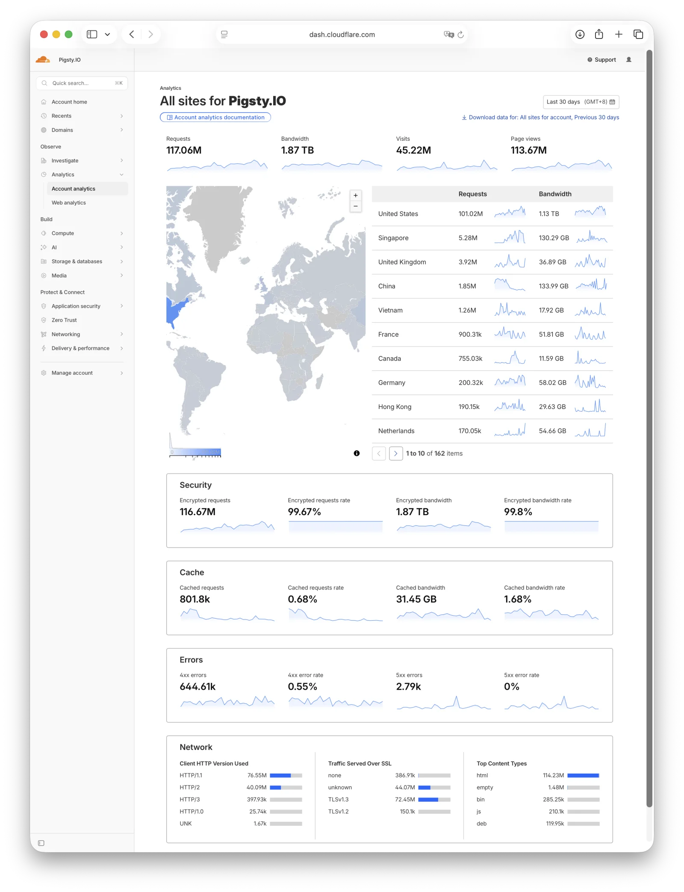

Pigsty v4.3 is out. If v4.2 was about "twelve kernels", v4.3 is about extension density.

This release takes the supported PostgreSQL extension count from 460 to 510, a new high-water mark for Pigsty.
Ubuntu 26.04 enters the support matrix, while Ubuntu 20.04 formally retires.
Core components such as Supabase, pgEdge, PolarDB, Grafana, and MinIO also get a broad refresh.

> [**GitHub Release**](https://github.com/pgsty/pigsty/releases/tag/v4.3.0) | [**Release Note**](https://pigsty.io/docs/about/release/#v430)


------

## Pigsty v4.3 Goes Mainstream

On GitHub, 5,000 stars is a useful line in the sand. It is where an open-source project starts to look "mainstream" rather than merely interesting.
The most practical perk is surprisingly mundane: you become eligible for free ChatGPT / Claude subscriptions.

Pigsty [recently crossed that line](/pg/extension-504/): it now has 5,066 stars. There are 11,621 GitHub repositories with more stars than that, which puts Pigsty roughly around the top 10,000 repos, or the top 0.005% of GitHub projects.
For a database distribution, that number carries more weight than it would in many trendier categories. By GitHub stars, Pigsty is now the No.3 PostgreSQL distribution overall, and the No.1 Linux-native PostgreSQL distribution.

What surprised me more was the traffic to Pigsty.io. In March, monthly unique visitors were still below 20 million. By the end of April, they had crossed 100 million.
More than 99% of that traffic comes from AI systems and agents. That means Pigsty's documentation has become part of the working corpus for mainstream AI systems, and a piece of infrastructure used by AI agents.
For what is still, at its core, a personal project, that is a fairly rare place to be.




------

## 510 Extensions

PostgreSQL's strongest feature is extensibility. The engineering reality behind that ecosystem is less glamorous. Pigsty v4.3 adds about 50 PostgreSQL extensions and brings the total available count to [**510**](https://pigsty.io/ext/list). The new additions cover a wide range:

- `block_copy_command`, `external_file`, `logical_ddl`, and `pg_query_rewrite`: lower-level tools around DDL and execution behavior.
- `datasketches`, `onesparse`, `rdkit`, `pghydro`, and `provsql`: data science, sparse computation, cheminformatics, hydrology, and probabilistic database extensions.
- `pg_text_semver`, `pg_variables`, `pg_when`, `pgcalendar`, and `pglock`: everyday development and administration tools.
- `postgresbson`, `pgproto`, `re2`, `pgmq`, and `pgmqtt`: protocol, queueing, regex, and messaging components.
- `storage_engine`, `pg_pathcheck`, `pg_savior`, and `pg_textsearch`: more advanced extensions that deserve closer attention to loading mode and risk boundaries.

Many of these extensions have already gone through the pgrx transition, from `0.16.1` to `0.17.0`. Some, such as `pg_search` and `pg_trickle`, are already on the pgrx `0.18.0` line.
The Rust extension ecosystem is getting more active, which is a good thing. For a distribution maintainer, it also means every build cycle has to deal with the Rust toolchain, cargo dependencies, PostgreSQL version compatibility, and platform differences.

Users see one line of SQL: `CREATE EXTENSION`.
The maintainer sees a matrix and one or two hundred packages. The good news is that my extension maintenance workflow is now wired into an Agent-based pipeline.
Whether it is adding a new extension or updating an existing one, the process is automated enough that the extension count can keep going up while the maintenance burden stays within what one person can handle.


------

## Ubuntu 26.04 Joins the Matrix

Pigsty v4.3 adds **Ubuntu 26.04 x86_64 / arm64** support, and formally deprecates Ubuntu 20.04.

Pigsty now supports 8 major OS versions across both x86_64 and arm64, for a total of 16 platform combinations:

| Family | Version | x86_64  | arm64   | Notes                                 |
|:-------|:--------|:--------|:--------|:--------------------------------------|
| EL     | 8       | Yes     | Yes     | Maintained, near EOL                  |
| EL     | 9       | Yes     | Yes     | Maintained                            |
| EL     | 10      | Yes     | Yes     | Maintained                            |
| Debian | 12      | Yes     | Yes     | Maintained                            |
| Debian | 13      | Yes     | Yes     | Maintained                            |
| Ubuntu | 22.04   | Yes     | Yes     | Maintained, near EOL                  |
| Ubuntu | 24.04   | Yes     | Yes     | noble, currently the most widely used |
| Ubuntu | 26.04   | **New** | **New** | Supported since v4.3                  |

Ubuntu 24.04, noble, is still the most widely used baseline today. Ubuntu 26.04 will likely replace it gradually over the next few years.

We added preliminary Ubuntu 26.04 support on the day it was released, but Pigsty ships many third-party extensions, and those need time to build and verify.
For Ubuntu 26.04, the regular extensions and offline bundles are now ready. Rust extensions are not provided yet, but they will be filled in later.

Ubuntu 24.04 has also been refreshed from 24.04.3 to 24.04.4, and Debian 13 from 13.3 to 13.4.

Pigsty's Vagrant and Terraform templates have been updated accordingly.
Alibaba Cloud does not yet provide Ubuntu 26.04 images, so that part will have to wait.


------

## Kernel Updates: Supabase, pgEdge, PolarDB

**Supabase** self-hosting templates are updated to the latest version. Pigsty is one of the few open-source PostgreSQL distributions that provides an enterprise-grade self-hosted Supabase option. This release refreshes the Supabase template, and also adds self-hosting support for Insforge, a lighter "Supabase-like" stack.

**pgEdge** moves to PG 18. The core value of pgEdge is multi-master replication on PostgreSQL, built on Spock and two other extensions. Spock's newest supported PostgreSQL major version has moved from 17 to 18, so Pigsty rebuilt the stack accordingly.

**PolarDB** moves to PG 17, with the package version now at `17.9.1.0`. PolarDB is a shared-storage PostgreSQL kernel fork. Its previous baseline was PG 15; this release jumps it to PG 17.

**OrioleDB** keeps moving as well, with OriolePG 17.18 and OrioleDB beta15 / 1.7. OrioleDB is still evolving quickly. I would not rush it into production, but as a frontier project in PostgreSQL storage engines, it is worth trying.

**Cloudberry** is updated to 2.1.0, and Pigsty now adds `cloudberry-backup` and `cloudberry-pxf` packages. v4.2 brought Cloudberry back into the distribution matrix; v4.3 fills in the surrounding tools.


------

## Grafana 13 and Victoria Refresh

Observability is part of Pigsty's foundation, and this release updates a good chunk of that stack.
The biggest visible change is Grafana 13. The jump from 12 to 13 brings a number of new features, including Dashboard Tabs, which opens up some interesting layout options.

Pigsty v4.3 updates Grafana to **13.0.1** and refreshes the related plugin packages:

- `grafana`: 12.4.1 -> 13.0.1
- `grafana-plugins`: 12.3.0 -> 13.0.0
- `grafana-infinity-ds`: 3.7.4 -> 3.8.0
- `grafana-victoriametrics-ds`: 0.23.1 -> 0.24.0

The Victoria stack also gets a batch update:

- `victoria-metrics`: 1.138.0 -> 1.142.0
- `victoria-metrics-cluster`: 1.138.0 -> 1.142.0
- `vmutils`: 1.138.0 -> 1.142.0
- `victoria-logs`: 1.48.0 -> 1.50.0
- `vlagent` / `vlogscli`: 1.48.0 -> 1.50.0
- `victoria-traces`: 0.8.0 -> 0.8.2

There is also a small user-reported fix: the VictoriaTraces Grafana datasource path is now corrected to `/select/jaeger`.


------

## etcd CVE Fix

etcd 3.6.8 recently had a CVE. 3.6.9 fixed it, but also introduced a new problem: it added auth to the member list API, which broke Patroni, the PostgreSQL HA component, before Patroni 4.1.1. Patroni 4.1.1 fixed that compatibility issue.

The important thing for users is version pairing: Patroni <= 4.1.0 should be used with etcd <= 3.6.8, while Patroni >= 4.1.1 should be used with etcd >= 3.6.9. Old with old, new with new. Mixing the two sides causes trouble.

In v4.2.2, the EL side had already moved to etcd 3.6.10 and Patroni 4.1.1. The DEB side lagged behind because the APT repo updated more slowly, so it still used etcd 3.6.8 and Patroni 4.1.0. In v4.3, the DEB side is now updated too, so users can upgrade without worrying about that mismatch.


------

## MinIO CVE Fix

I forked MinIO earlier, fixed several CVEs in April, and wrote about the background in [Keeping MinIO Alive, Promise Kept](/en/db/minio-promise-kept). Read that post if you want the details.
Pigsty v4.3 ships the fixed build: `20260417000000`.

The fixes cover OIDC/JWT, LDAP STS login, replication headers, S3 Select, unsigned-trailer signature verification, and a few adjacent paths. For Pigsty users, the important part is not the exploit mechanics. The important part is that the object storage package has moved to a fixed version, and the offline bundles have been refreshed too.

The fork, Silo, is now used in real production deployments, including Grafana Loki. The Silo docs site sees tens of millions of requests per month, and Docker Hub downloads have passed 100k.
It is probably the most widely used MinIO fork at this point. I am happy about that, but to be clear, this is not my main job. I just want Pigsty users to have a usable open-source object storage option.

Recently I also talked to RustFS team. After talking with the team, I learned that they plan to make RustFS a drop-in replacement for MinIO. If they can really pull that off, I will seriously consider replacing MinIO with RustFS in Pigsty.
This release packages RustFS's first Beta after it left Alpha. A GA release is planned around July.


------

## Vagrant Templates Move to cloud-image

For many people, Vagrant is just a local testing tool. For Pigsty, which needs to verify multiple operating systems, architectures, and topologies, it is an important development and acceptance-test entry point.

Pigsty v4.3 moves all [Vagrant](https://pigsty.io/docs/deploy/vagrant) templates to the cloud-image series.
The reason is simple: this is the only image family that covers every Pigsty-supported OS across all four combinations of VirtualBox/Libvirt and amd64/arm64.

The change reduces uncertainty from OS image differences. Traditional Vagrant boxes vary a lot in quality. Network behavior, disk layout, cloud-init, and guest tools can all differ in subtle ways.
cloud-image is the more standard, distribution-maintained path. Once everything is on that track, adaptation and debugging become much easier.

One caveat: the default network interface name is no longer `eth1`. If you need to test VIP-related features, remember to adjust the interface name in your config.


------

## Small Fixes Worth Calling Out

v4.3 also includes a few smaller fixes that came from real user pain.

**Relaxed PostgreSQL username validation**: Pigsty now allows `@.-` in usernames. In real enterprise identity systems, email-style usernames and domain-tagged usernames are common. A database distribution should not block valid use cases with an overly narrow regex.

**IPv6 nameserver parsing fix**: The old logic only extracted IPv4 DNS servers, which missed IPv6 nameservers. That is fixed now. IPv6 support is often not the main path, but when an environment has it, it is not optional.

------

## Other Additions

Pigsty v4.3 also adds experimental self-hosting templates for Hindsight, a memory framework based on PostgreSQL and pgvector, and Hermes Agent. They are still pilot features, so I will not spend much time on them here.

--------

## Closing Notes

Pigsty v4.3 is not a huge release in the sense of sweeping framework or interface changes. It is also not small: shipping 50 new extensions in one go is real work.

There is no single headline feature here. Instead, the release moves many things users actually care about: more extensions, newer operating systems, updated kernel forks, a fresher monitoring stack, more stable Vagrant templates, fixed CVEs in the object storage package, and a few paper-cut fixes people actually hit.

That is often where the value of a database distribution lives: the unsexy parts. You do not have to track the build status of 50 extensions yourself. You do not have to audit the Ubuntu 26.04 package matrix yourself. You do not have to maintain a MinIO CVE fork yourself. You do not have to sort out Grafana 13 plugins, Victoria component versions, or which Vagrant images to trust.

Pigsty rolls all of that into a release. You just use it. The complete v4.3.0 release notes and package change summary follow.


--------

## v4.3.0

**Highlights**

- Added about 50 PostgreSQL extensions, bringing the total available extension count to 510.
- Added Ubuntu 26.04 x86_64/arm64 support, deprecated Ubuntu 20.04 support, and refreshed minor OS variants to Debian 13.4 / Ubuntu 24.04.4.
- Kernel updates: Supabase is updated to the latest version, pgEdge to PG 18, and PolarDB to PG 17.
- Grafana is updated to 13.0.1, and MinIO now uses the pgsty/Silo branch with CVE fixes.
- Vagrant templates now consistently use cloud-image series images.

**Bug Fixes**

- Relaxed PostgreSQL username validation to allow `@.-` in usernames.
- Fixed IPv6 nameserver parsing so DNS configuration is not limited to legacy IPv4 DNS server extraction.
- Changed the VictoriaTraces Grafana datasource path to `/select/jaeger`.
- Made Vagrant disk probing more robust and added `bin/el-fix`, a guest-network fix script for EL Vagrant images.

**PostgreSQL and Extension Package Changes**

| Package              | Old Version  | New Version | Notes                                                                   |
|:---------------------|:-------------|:------------|:------------------------------------------------------------------------|
| `block_copy_command` | -            | 0.1.5       | New; PG 14-18; Rust/pgrx 0.17.0                                         |
| `cloudberry`         | 2.0.0        | 2.1.0       | Kernel package group; RPM release 2 fixes initdb errno issue            |
| `cloudberry-backup`  | -            | 2.1.0       | New Cloudberry backup tool package                                      |
| `cloudberry-pxf`     | -            | 2.1.0       | New Cloudberry PXF package                                              |
| `credcheck`          | 4.6          | 4.7         | Upgrade; PG 14-18; PGDG                                                 |
| `datasketches`       | -            | 1.7.0       | New; PG 14-18                                                           |
| `ddl_historization`  | 0.0.7        | 0.2         | Upgrade                                                                 |
| `documentdb`         | 0.109        | 0.110       | Upgraded to upstream version; PG 15-18                                  |
| `external_file`      | -            | 1.2         | New; PG 14-18                                                           |
| `logical_ddl`        | -            | 0.1.0       | New; PG 14-18                                                           |
| `nominatim_fdw`      | 1.1.0        | 1.2         | Upgrade                                                                 |
| `onesparse`          | -            | 1.0.0       | New; PG 18 only                                                         |
| `orioledb`           | beta15 / 1.7 | beta15 /1.7 | Paired with OriolePG 17.18                                              |
| `oriolepg`           | 17.16        | 17.18       | Kernel patch set update                                                 |
| `parray_gin`         | -            | 1.5.0       | Added, then upgraded; PG 14-18                                          |
| `pg_accumulator`     | -            | 1.1.3       | New; PG 14-18                                                           |
| `pg_anon`            | 3.0.1        | 3.0.13      | Upgrade; Rust/pgrx 0.16.1 -> 0.17.0                                     |
| `pg_background`      | 1.8          | 1.9.2       | DEB only                                                                |
| `pg_bikram_sambat`   | -            | 0.1.0       | New; Bikram Sambat date type and AD/BS conversion functions             |
| `pg_byteamagic`      | -            | 0.2.4       | New; PG 14-18                                                           |
| `pg_cardano`         | 1.1.1        | 1.2.0       | Upgrade; Rust/pgrx 0.17.0                                               |
| `pg_clickhouse`      | 0.1.5        | 0.2.0       | Upgrade                                                                 |
| `pg_datasentinel`    | -            | 1.0         | New; PG 15-18                                                           |
| `pg_dbms_job`        | 1.5          | 2.0         | Upgrade; PG 14-18; PGDG                                                 |
| `pg_dispatch`        | -            | 0.1.5       | New; PG 14-18                                                           |
| `pg_failover_slots`  | 1.2.0        | 1.2.1       | Upgrade                                                                 |
| `pg_fsql`            | -            | 1.1.0       | New; PG 14-18                                                           |
| `pg_incremental`     | 1.4.1        | 1.5.0       | Upgrade                                                                 |
| `pg_isok`            | -            | 1.4.1       | New; PG 14-18                                                           |
| `pg_ivm`             | 1.13         | 1.14        | Upgrade; PG 14-18                                                       |
| `pg_kazsearch`       | -            | 2.0.0       | New; PG 16-18; Rust/pgrx 0.17.0                                         |
| `pg_liquid`          | -            | 0.1.7       | New; PG 14-18                                                           |
| `pg_pathcheck`       | -            | 0.9.1       | New; PG 17-18; requires shared_preload_libraries                        |
| `pg_query_rewrite`   | -            | 0.0.5       | New; PG 14-18                                                           |
| `pg_regresql`        | -            | 2.0.0       | New; PG 14-18                                                           |
| `pg_rrf`             | -            | 0.0.3       | New; PG 14-17; Rust/pgrx 0.16.1 -> 0.17.0                               |
| `pg_savior`          | 0.0.1        | 0.1.0       | Upgrade; high-risk DDL/DML guard hook; requires preload or LOAD         |
| `pg_search`          | 0.22.2       | 0.23.1      | Upgrade; PG 15-18; pgrx 0.18.0                                          |
| `pg_slug_gen`        | -            | 1.0.0       | New; PG 15-18                                                           |
| `pg_stat_ch`         | -            | 0.3.6       | Added, then upgraded; PG 16-18; EL8 break                               |
| `pg_store_plans`     | 1.9          | 1.10        | Upgrade                                                                 |
| `pg_strict`          | 1.0.3        | 1.0.5       | Upgrade; Rust/pgrx 0.16.1 -> 0.17.0                                     |
| `pg_text_semver`     | -            | 1.2.1       | New; PG 14-18                                                           |
| `pg_textsearch`      | 0.5.0        | 1.1.0       | Upgrade; PG 17-18; requires shared_preload_libraries                    |
| `pg_trickle`         | 0.16.0       | 0.40.0      | Upgrade; PG 18 only; pgrx 0.18.0                                        |
| `pg_tzf`             | 0.2.3        | 0.2.4       | Upgrade; Rust/pgrx 0.17.0                                               |
| `pg_vectorize`       | 0.26.0       | 0.26.1      | Upgrade; Rust/pgrx 0.16.1 -> 0.17.0                                     |
| `pg_variables`       | -            | 1.2.5       | New; PG 14-18                                                           |
| `pg_when`            | -            | 0.1.9       | New; PG 14-18; Rust/pgrx 0.17.0                                         |
| `pgxicor`            | 0.1.0        | 0.1.1       | Upgrade                                                                 |
| `pgcalendar`         | -            | 1.1.0       | New; PG 14-18                                                           |
| `pgclone`            | -            | 4.0.0       | Added, then upgraded; PG 14-18                                          |
| `pgelog`             | -            | 1.0.2       | New; PG 14-18                                                           |
| `pglinter`           | 1.1.1        | 1.1.2       | Upgrade; Rust/pgrx 0.16.1 -> 0.17.0                                     |
| `pglock`             | -            | 1.0.0       | New; PG 14-18                                                           |
| `pgmq`               | 1.11.0       | 1.11.1      | Upgrade; PG 14-18                                                       |
| `pgmqtt`             | -            | 0.1.0       | New; PG 14-18; Rust/pgrx 0.16.1 -> 0.17.0                               |
| `pgproto`            | -            | 0.5.0       | Added, then upgraded; native Protobuf support                           |
| `pghydro`            | -            | 6.6         | New; PG 14-18                                                           |
| `pgx_ulid`           | 0.2.2        | 0.2.3       | Upgrade; Rust/pgrx 0.17.0                                               |
| `plv8`               | 3.2.4        | 3.2.4-2     | RPM only; EL10 build fix                                                |
| `PolarDB`            | 15.15        | 17.9.1.0    | PG 15 -> 17                                                             |
| `postgresbson`       | -            | 2.0.2       | New; PG 14-18                                                           |
| `postgis`            | 3.6.2        | 3.6.3       | DEB only                                                                |
| `prefix`             | 1.2.10       | 1.2.11      | Upgrade; PG 14-18; PGDG                                                 |
| `provsql`            | -            | 1.2.3       | New; PG 14-18                                                           |
| `rdf_fdw`            | -            | 2.5.0       | Added, then upgraded; PG 14-18                                          |
| `rdkit`              | -            | 202503.6    | New; PG 14-18                                                           |
| `re2`                | -            | 0.1.1       | New; PG 16-18                                                           |
| `storage_engine`     | -            | 1.3.4       | Added, then upgraded; columnar and row-compression table access methods |
| `supautils`          | 3.1.0        | 3.2.1       | Upgrade                                                                 |
| `system_stats`       | 3.2          | 4.0         | Upgrade                                                                 |
| `timescaledb`        | 2.25.2       | 2.26.4      | Upgrade; TSL minor update                                               |
| `ulak`               | -            | 0.0.2       | New; PG 14-18                                                           |
| `wrappers`           | 0.5.7        | 0.6.0       | Upgrade; Rust/pgrx 0.16.1 -> 0.17.0                                     |
{.stretch-last}


**Infrastructure Package Updates**

| Package                      | Old Version    | New Version    | Notes                                                        |
|:-----------------------------|:---------------|:---------------|:-------------------------------------------------------------|
| `alertmanager`               | 0.31.1         | 0.32.1         |                                                              |
| `agentsview`                 | 0.15.0         | 0.26.0         |                                                              |
| `claude`                     | 2.1.81         | 2.1.123        | Downloaded through the 8118 proxy and verified               |
| `code`                       | 1.112.0        | 1.118.1        | Direct-link metadata update                                  |
| `code-server`                | 4.112.0        | 4.117.0        | Direct-link metadata update                                  |
| `codex`                      | 0.116.0        | 0.125.0        | Moved from prerelease track to stable, then upgraded further |
| `crush`                      | 0.51.2         | 0.64.0         | Direct-link metadata update                                  |
| `dblab`                      | 0.34.3         | 0.38.0         |                                                              |
| `duckdb`                     | 1.5.0          | 1.5.2          |                                                              |
| `etcd`                       | 3.6.9          | 3.6.10         | Unified package version                                      |
| `garage`                     | 2.2.0          | 2.3.0          |                                                              |
| `genai-toolbox`              | 0.27.0         | 1.1.0          | Upstream renamed to mcp-toolbox                              |
| `golang`                     | 1.26.1         | 1.26.2         |                                                              |
| `grafana`                    | 12.4.1         | 13.0.1         | Metadata refreshed after major upgrade                       |
| `grafana-infinity-ds`        | 3.7.4          | 3.8.0          |                                                              |
| `grafana-plugins`            | 12.3.0         | 13.0.0         | Noarch plugin bundle, manually collected                     |
| `grafana-victoriametrics-ds` | 0.23.1         | 0.24.0         |                                                              |
| `hugo`                       | 0.158.0        | 0.161.1        |                                                              |
| `maddy`                      | 0.8.2          | 0.9.3          |                                                              |
| `mcli`                       | 20260321000000 | 20260417000000 | pgsty branch, CVE fixed                                      |
| `minio`                      | 20260325000000 | 20260417000000 | pgsty branch, CVE fixed                                      |
| `mongodb_exporter`           | 0.49.0         | 0.50.0         |                                                              |
| `node_exporter`              | 1.10.2         | 1.11.1         |                                                              |
| `nodejs`                     | 24.14.0        | 24.15.0        | Stays on the 24.x policy line                                |
| `npgsqlrest`                 | 3.11.1         | 3.12.0         |                                                              |
| `opencode`                   | 1.2.27         | 1.14.30        | Switched to versioned cache and rebuilt                      |
| `pg_exporter`                | 1.2.1          | 1.2.2          | Direct-link metadata update                                  |
| `pgflo`                      | 0.0.15         | -              | Removed                                                      |
| `pgschema`                   | 1.7.4          | 1.9.0          |                                                              |
| `pig`                        | 1.3.2          | 1.4.1          | Metadata only                                                |
| `postgrest`                  | 14.7           | 14.10          |                                                              |
| `prometheus`                 | 3.10.0         | 3.11.3         |                                                              |
| `rainfrog`                   | 0.3.17         | 0.3.18         |                                                              |
| `rclone`                     | 1.73.2         | 1.73.5         | Direct-link metadata update                                  |
| `rustfs`                     | 1.0.0-alpha.89 | 1.0.0-b1       | Prerelease line                                              |
| `sabiql`                     | 1.8.2          | 1.11.1         |                                                              |
| `seaweedfs`                  | 4.17           | 4.22           |                                                              |
| `sqlcmd`                     | 1.9.0          | 1.10.0         |                                                              |
| `stalwart`                   | 0.15.5         | 0.16.2         |                                                              |
| `tigerbeetle`                | 0.16.77        | 0.17.2         |                                                              |
| `tigerfs`                    | 0.5.0          | 0.6.0          |                                                              |
| `timescaledb-tools`          | 0.18.2         | 0.19.0         | Rebuilt timescaledb-tune                                     |
| `uv`                         | 0.10.12        | 0.11.8         |                                                              |
| `victoria-logs`              | 1.48.0         | 1.50.0         | Main package                                                 |
| `victoria-metrics`           | 1.138.0        | 1.142.0        |                                                              |
| `victoria-metrics-cluster`   | 1.138.0        | 1.142.0        | VictoriaMetrics companion component                          |
| `victoria-traces`            | 0.8.0          | 0.8.2          |                                                              |
| `vip-manager`                | 4.0.0          | 4.2.0          | Direct-link metadata update                                  |
| `vlagent`                    | 1.48.0         | 1.50.0         | VictoriaLogs companion component                             |
| `vlogscli`                   | 1.48.0         | 1.50.0         | VictoriaLogs companion component                             |
| `vmutils`                    | 1.138.0        | 1.142.0        | VictoriaMetrics companion component                          |
| `vector`                     | 0.54.0         | 0.55.0         | Direct-link metadata update                                  |
| `v2ray`                      | 5.47.0         | 5.48.0         |                                                              |
| `xray`                       | 26.2.6         | 26.3.27        |                                                              |

**Checksums**

```bash
58a914fce7bc521b65e167f66e7961a3  pigsty-v4.3.0.tgz
9ce070efb0420057a83c632b2856d1b3  pigsty-pkg-v4.3.0.d12.aarch64.tgz
bf21c36d3aff94a1a6353130597ffa85  pigsty-pkg-v4.3.0.d12.x86_64.tgz
81b4790c4e5567cee9d1beadd06e48e6  pigsty-pkg-v4.3.0.d13.aarch64.tgz
06baab9341ab683eaeea2e066b28a0f4  pigsty-pkg-v4.3.0.d13.x86_64.tgz
fb4bf751df5e09f547c49b8ab7cac9a0  pigsty-pkg-v4.3.0.el10.aarch64.tgz
a3e752c8148122d1eaea74a6d8d8df0d  pigsty-pkg-v4.3.0.el10.x86_64.tgz
cb2a9af36615513e66fd5ac3e9f4d797  pigsty-pkg-v4.3.0.el9.aarch64.tgz
e24641a879dec7a8eea74dab42f85920  pigsty-pkg-v4.3.0.el9.x86_64.tgz
6b675fd8d9e039193481f0838aa4b92c  pigsty-pkg-v4.3.0.u22.aarch64.tgz
c0e344ccb9d190a619591e5d46116424  pigsty-pkg-v4.3.0.u22.x86_64.tgz
3e0ec9534cf595201ec79eb1fc6549d8  pigsty-pkg-v4.3.0.u24.aarch64.tgz
0a3d19513eca9615bdd66a4b2bf66f1d  pigsty-pkg-v4.3.0.u24.x86_64.tgz
683a10ff8fd993358d6befa9f4e02913  pigsty-pkg-v4.3.0.u26.aarch64.tgz
fd1ea5cd5554bfe91fadd51ad80860e3  pigsty-pkg-v4.3.0.u26.x86_64.tgz
```
