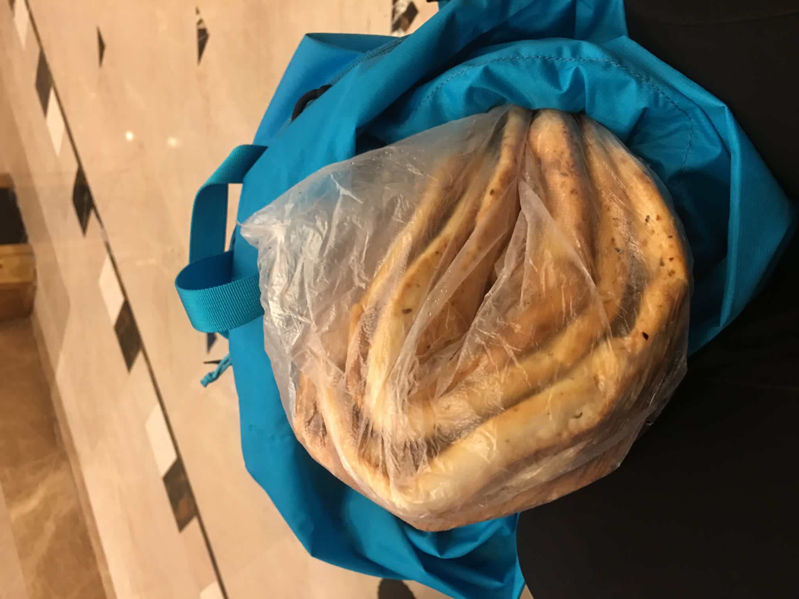
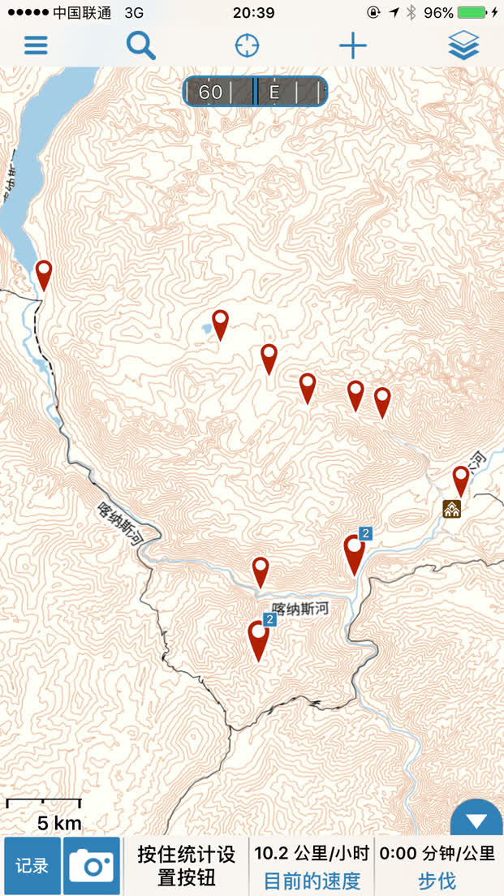
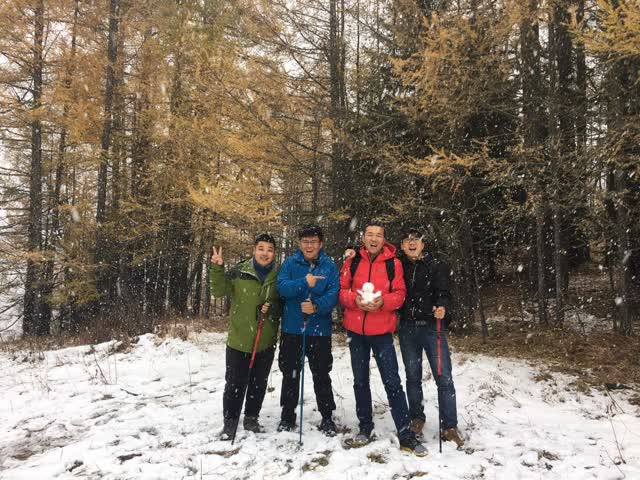
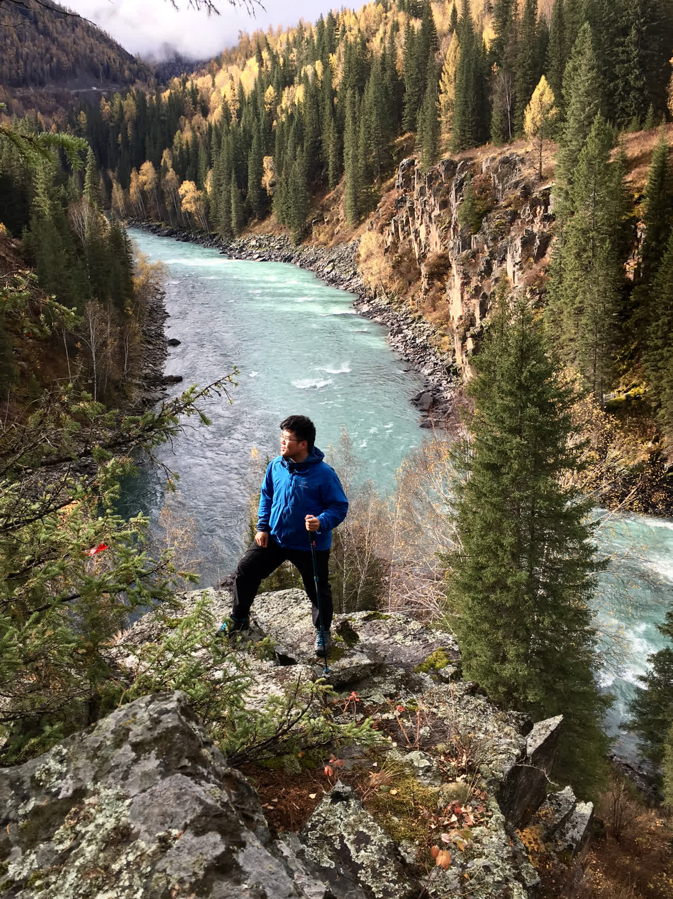
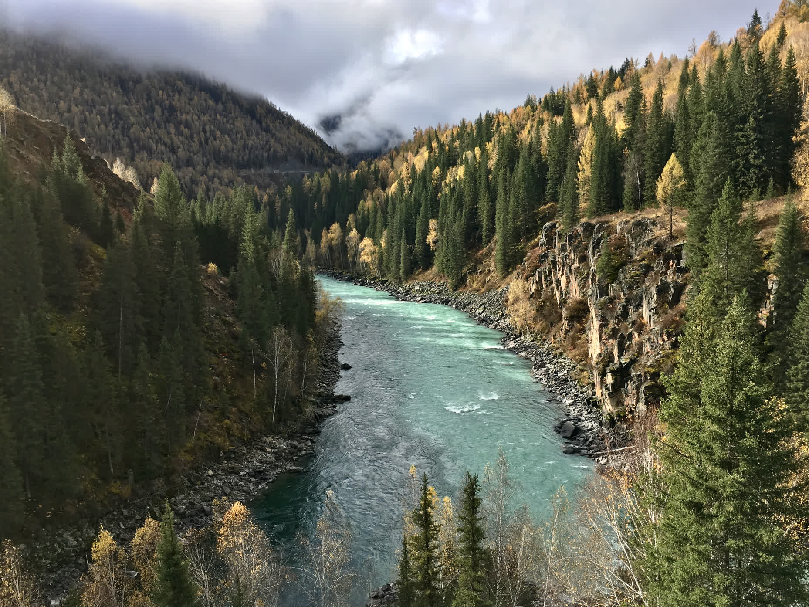
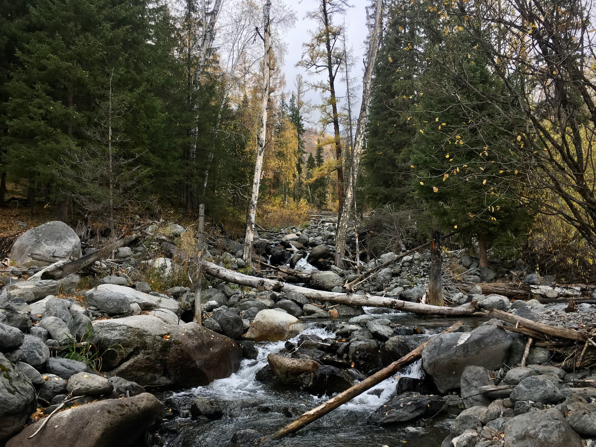

I never expected my first outdoor trekking experience would be in Kanas.

<!--more-->

# Kanas Route

Jiadengyu - Hemu - Black Lake - Kanas - Baihaba

Starting from Jiadengyu, head east along the cement road - that's the route that doesn't go through the scenic area. Both sides of the road are lined with newly built guesthouses and horse team camps. At the end of the road begins the horse trail, marking the start of the trekking route. Head north over the small hill, where the Burqin River flows below. Reach the Bulalehan Pine Wood Bridge. After buying tickets and crossing the bridge, turn right and head east along the left bank of the Kanas River. Follow the horse trail for about 3 kilometers until the river bends east, and the trail ascends following the river's curve eastward. Continue trekking 3 kilometers downstream along the eastern side of the river. After reaching the great bend of the Kanas River, walk east for about 10 kilometers. The entire journey takes roughly 3 hours to reach the delta where the Burqin River meets the Hemu River, arriving at the halfway lodge.

On this day, make sure to fill up with water at the spring first. After reaching the flat delta, the path turns north, beginning the upstream journey along the Hemu River. You can see a short section of road on the opposite bank - that's the road to Hemu. Walk north along the left bank of the river. After 15 kilometers, from a small hillside, you can catch a distant view of Hemu Village. As you approach Hemu, wooden houses come into view, guiding your direction. Near Hemu, the path becomes somewhat scattered, but as long as you maintain the general direction, you'll reach your destination. Approaching the mountain pass near Hemu, there's a simple bridge without railings. Turn right, and you'll soon reach the riverside with a grove of white birches. Beyond the grove is the Hemu Bridge - cross it to arrive. This section takes about 4 hours.

You'll need to prepare one bottle of water, with two or three water collection points along the way. From Hemu to Little Black Lake, head northwest into the valley - remember, northwest is the direction. Ascend continuously along the right side of the valley. After crossing a ridge dense with pine forests, the path rises higher and trees become sparser. After 15 kilometers, you'll reach the highest point - the 2,350-meter pass. There are no alternative routes along the way. At about 2/3 of the journey, there's a wooden hut, and you'll pass several sheep pens along the route. Near the pass, there's a confluence of two rivers that requires attention. Here you must first cross the river to reach the delta, then follow the horse trail on the delta upstream along the left river. Continue for about half an hour to reach a flat grassland below the pass, then another hour and a half to cross the pass and reach Little Black Lake.

From Black Lake, head west where the valley opens up and the terrain gradually descends, with pine forests reappearing. After 8 kilometers, you'll reach a ridge. Cross the ridge and proceed 2 kilometers to reach the Kaqingge'er herders' settlement. Continue 3 more kilometers to reach Kanas Village, which has about 20 herding households all living in wooden houses where villagers can provide meals. Leave the village and proceed along the river valley. After passing through about 2 kilometers of extremely dense pine forest, the view suddenly opens up, revealing the Fish Watching Platform on the peak by Kanas Lake below the slope.

Important GPS points along the route (format: DD'SS.sss):

Jiadengyu N48'29.408 E087'08.424

Bulalehan Bridge N48'31.692 E087'12.475

High slope at Kanas River bend N48'30.745 E087'14.372

Kanas River-Hemu River confluence N48'30.824 E087'19.273

Campsite, downhill to riverside N48'31.543 E087'20.122

Hemu N48'34.168 E087'25.745

Water collection point (red bucket) N48'37.121 E087'21.287

Water collection point N48'37.379 E087'19.770

Small wooden hut N48'37.653 E087'17.038

Campsite below the pass N48'38.241 E087'15.227

Little Black Lake N48'38.750 E087'14.875

Black Lake N48'40.029 E087'12.090

Kanas Lake head N48'41.888 E087'02.071

I personally think the best way to explore the Kanas region is on foot. Take a bus from Burqin to Hemu and trek from there.

## Kanas

No time to write a proper travel journal, just sharing some photos.

> Trail rations: five naan breads

> Waypoints recorded along the journey

> Climbed up to Fish Watching Platform from the wild mountains, caught in a snowfall

> Standing at the confluence of Hemu River, Kanas River, and Irtysh River.

> The confluence shows two different colored waters

> Mountain streams in the forest