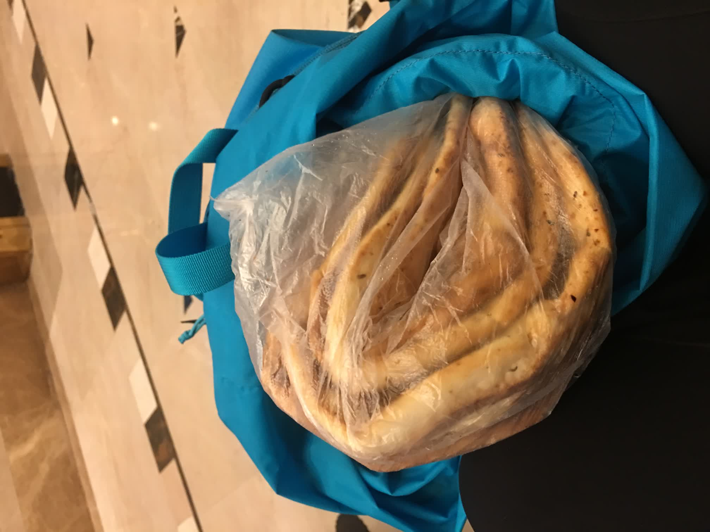
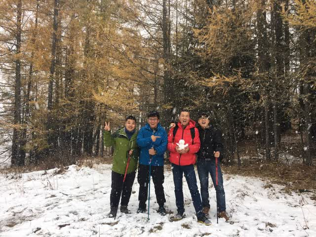
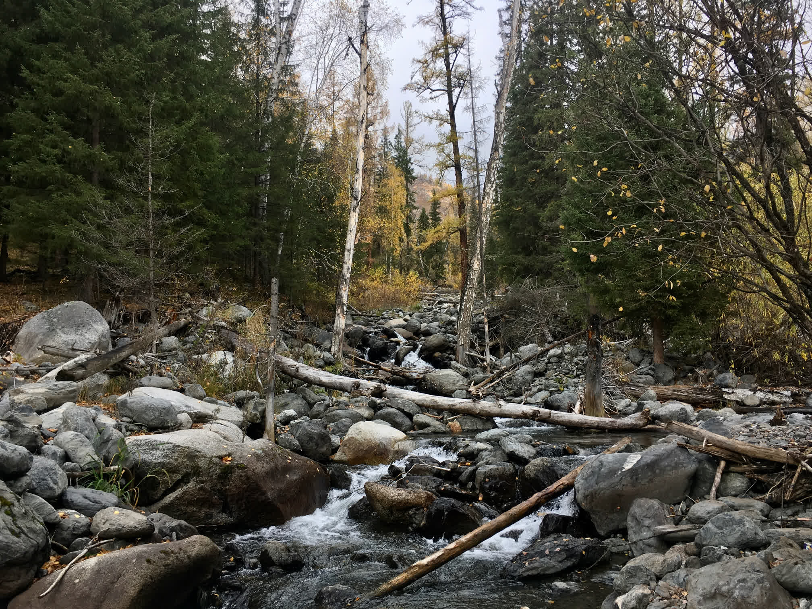

没有想到，第一次户外徒步的体验竟然是在喀纳斯。

<!--more-->

# 喀纳斯路线

贾登峪-禾木-黑湖-喀纳斯-白哈巴

　　从贾登峪出发，顺水泥路往东走，就是不进景区的那条路，路两边都是新修的旅馆和马队营地，路尽头就是马道了，算是进入徒步路线。向北翻过小山，布尔津河就在山下流过，到达布拉勒汉松木桥。买完票过桥后右拐，朝东EN向沿喀纳斯河左岸而行，马道前进约3公里，河向东拐弯，马道也顺河上坡，向东延伸。沿着河东侧顺河而下继续徒步3公里，到达喀纳斯河大拐弯后向东走约10公里，共3个小时左右可到布尔津河与禾木河的两河交汇处三角洲，也就到了半路旅店。

　　这天要先在泉边灌好水，道路到平坦的三角洲后折向北方，开始逆禾木河而上，可看到河对岸一小段公路，那就是到禾木的。沿河左岸向北行走，走15公里后在一个小山坡上可远眺禾木村。接近禾木时可看见木屋，木屋指引着方向。快到禾木的时候路有点散乱，不过只要大方向不错，就能到达。接近禾木的山口，有一个古朴的无栏杆的小桥，再向右拐，很快就到了河边，有一片白桦林，出了林子，就是禾木桥，过桥就到了　　走4小时左右

　　需要准备1瓶水，路上有两三个取水点。从禾木到小黑湖，向西北的山谷前进，记住西北是方向。顺着山谷的右侧一直上升，翻过一道松林密布的山梁后，路径升高，树木渐疏，15公里后可到达最高点－2350米的达坂。一路没有岔路，在路程2/3的地方有个木屋，沿途还有几个羊圈。在接近达坂的地方，有一个两河交汇口需要注意，在这里要先过河，到达三角洲，然后沿着三角洲上的马道，顺着左侧的河流向上行。继续前进约半小时，就到了达板下一片平坦的草地，再有一个半小时就可以翻过达坂，到达小黑湖了。

　　从黑湖向西行进，山谷开阔，地势渐渐下降，松林又现。行出8公里，是一个山梁，翻过山梁后行进2公里，到达卡仃格尔牧民点，再前行3公里就到达喀纳斯村，村里有20户左右牧民，皆住木屋，村民可提供饮食。出村子沿河谷前行，穿过一段约2公里异常浓密的松林后，前面豁然开朗，坡下喀纳斯湖畔山峰上的观鱼亭映入眼帘。

　　沿途重要GPS点(格式：DD’SS.sss)

　　贾登峪 N48’29.408 E087’08.424

　　布拉勒汉桥 N48’31.692 E087’12.475

　　喀那斯河流拐点的高坡 N48’30.745 E087’14.372

　　喀那斯河－禾木河交汇口 N48’30.824 E087’19.273

　　宿营地,下坡到河边 N48’31.543 E087’20.122

　　禾木 N48’34.168 E087’25.745

　　沿途取水点(红色水桶) N48’37.121 E087’21.287

　　取水点 N48’37.379 E087’19.770

　　小木屋 N48’37.653 E087’17.038

　　达板下的宿营地 N48’38.241 E087’15.227

　　小黑湖 N48’38.750 E087’14.875

　　黑湖 N48’40.029 E087’12.090

　　喀那斯湖头 N48’41.888 E087’02.071

13119063279

40-90+12.5+130+12+20+

喀纳斯区域个人觉得最佳游览方式是徒步，从布尔津坐车到禾木，徒步

## 喀纳斯

没空写游记，随便放几张照片

>路上的干粮，五个馕

>途中记录的航点

>从野山爬上观鱼台，赶上了下雪

>站在禾木河、喀纳斯河、额尔齐斯河的三岔口。

>河口的颜色有两种

>山林间的小溪