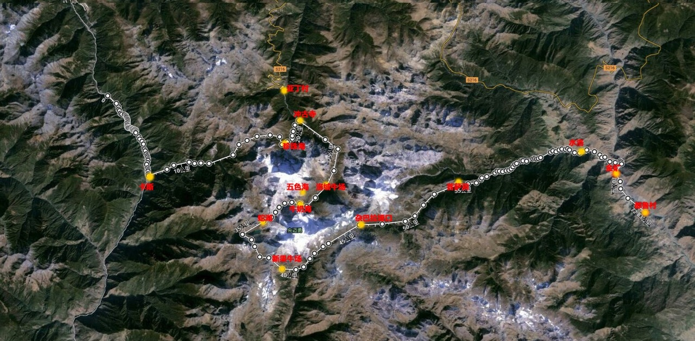
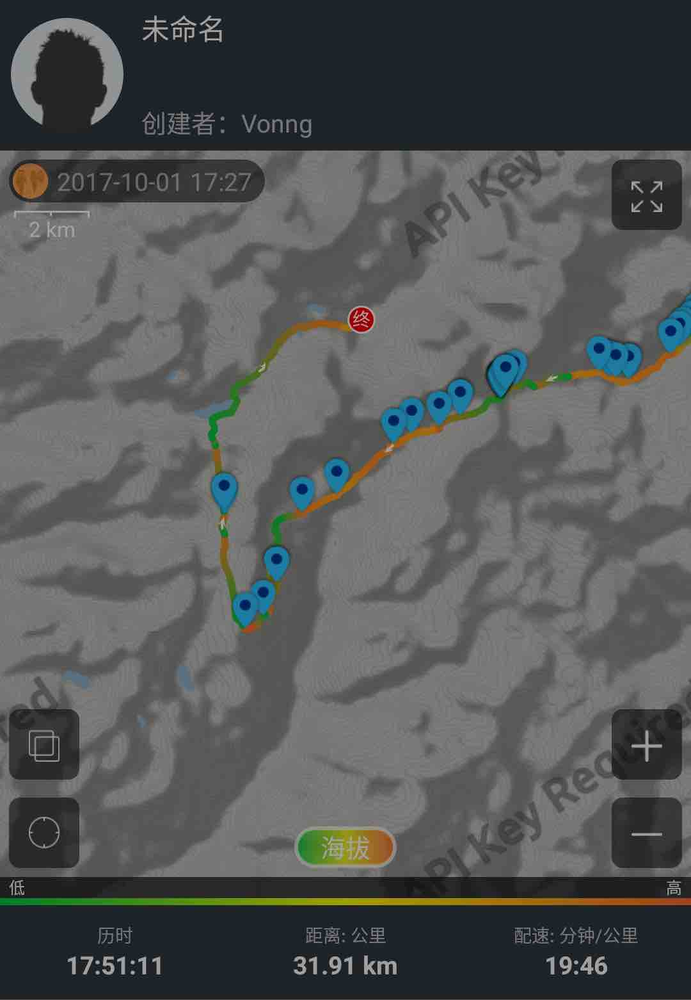
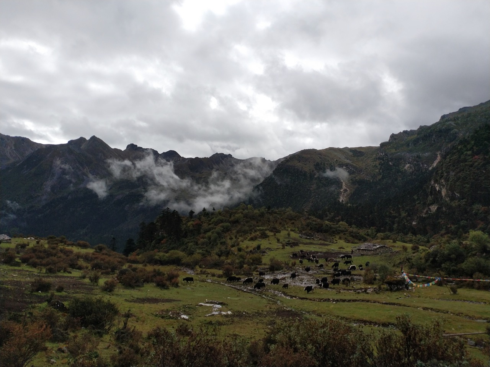
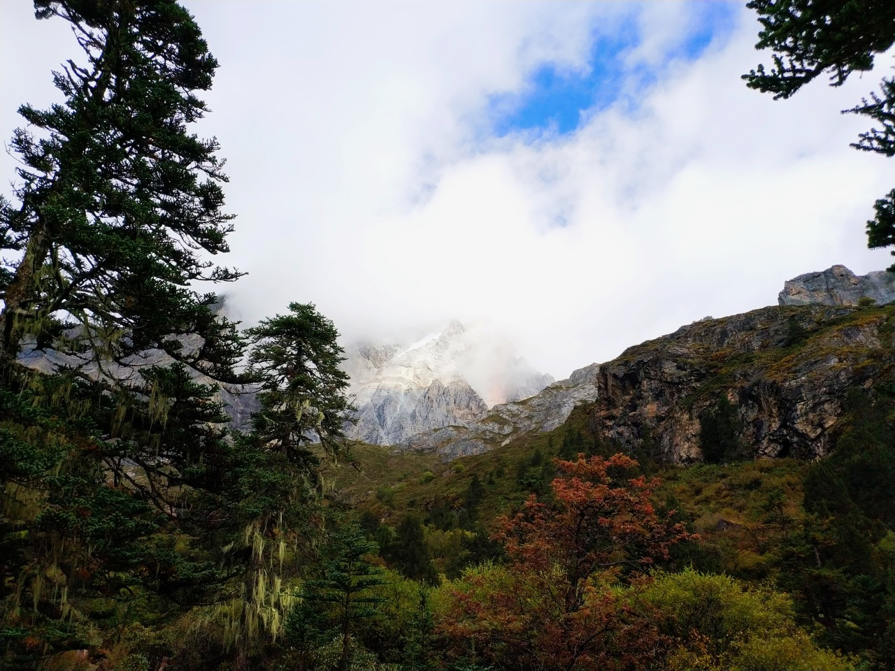
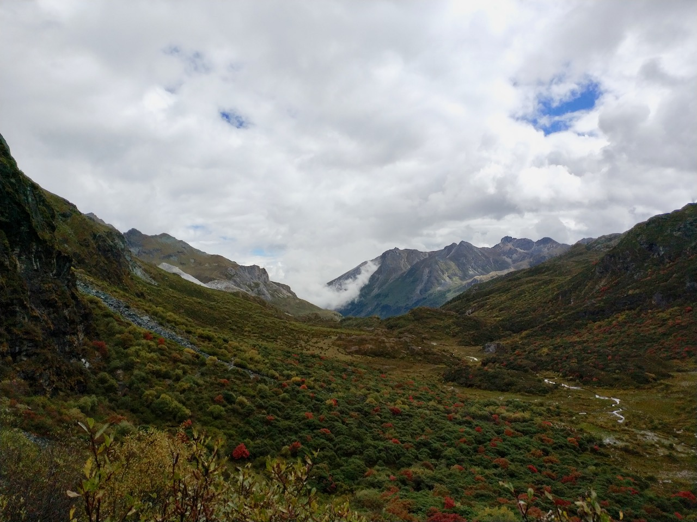
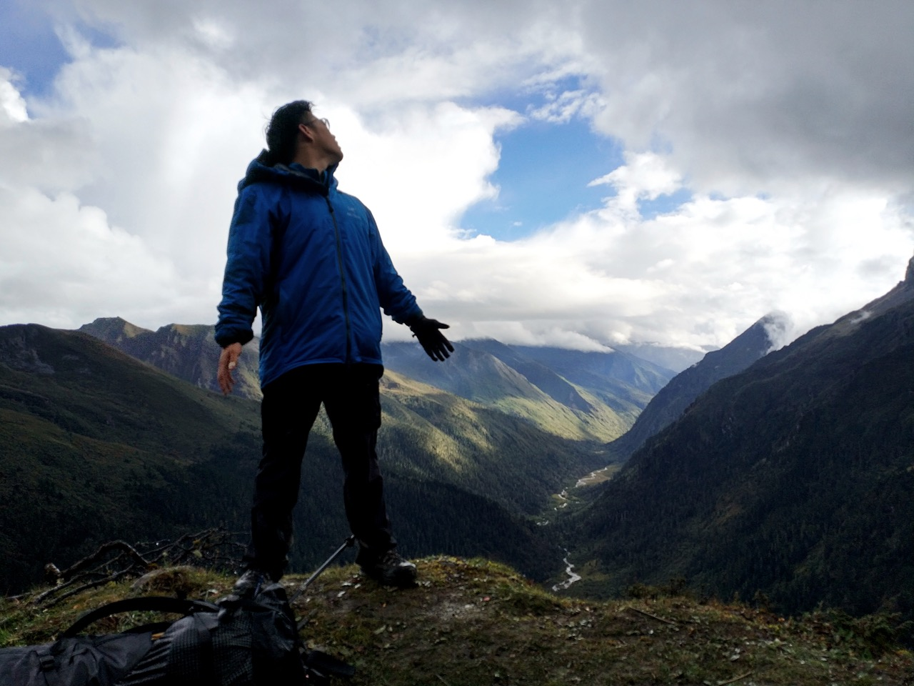
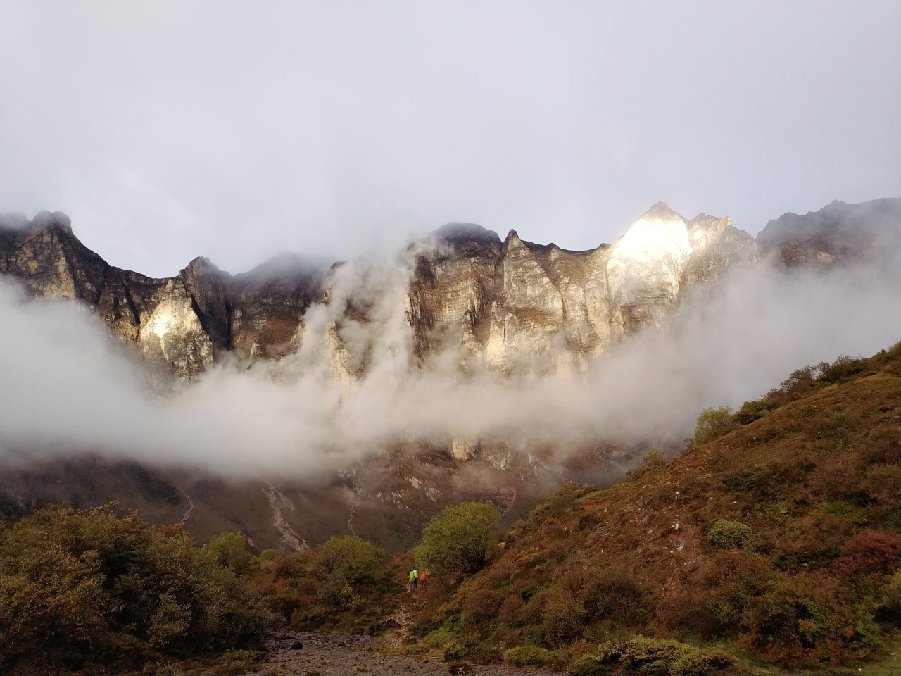
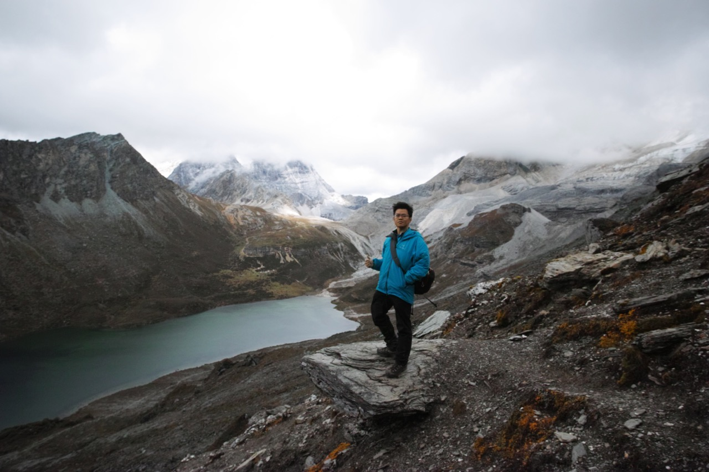
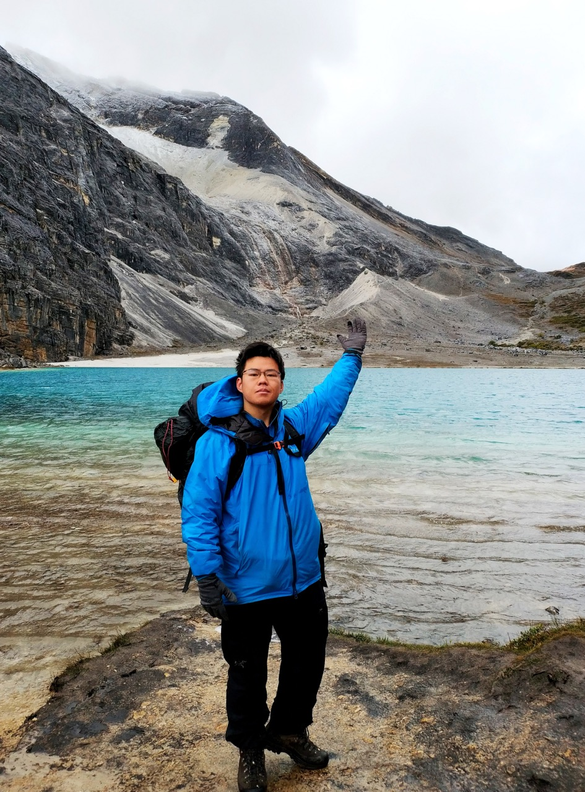
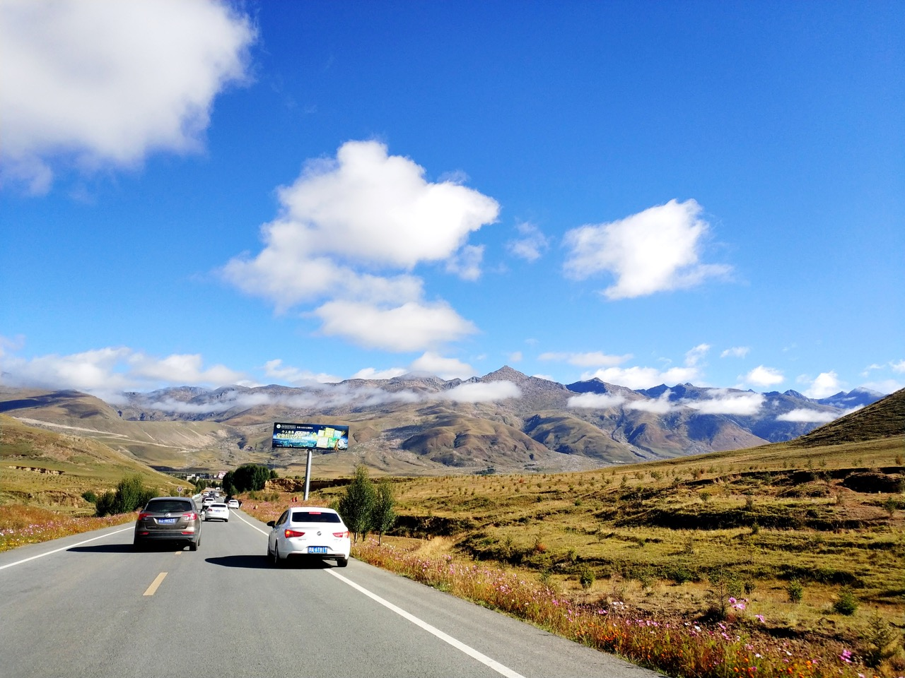

> Solo heavy trekking on the Luoke Line, completing a 6-day route in three and a half days - nearly died on the mountain.

<!--more-->

After anticipating this for half a year, the Luoke Line trek is finally complete. Still feeling a bit surreal. On the last day in the mountains, I ran out of cold medicine, and two consecutive days of heavy rain soaked my clothes and tent. Nearly perished on the mountain, but fortunately made it through in the end. **Three and a half days**, **solo**, **heavy pack** - completing the Luoke Line. This accomplishment I can brag about for a lifetime.

## Itinerary Overview

Originally planned to complete the Luoke Line in 5 days, ended up finishing in three and a half days, exiting the Yading scenic area gate at noon on October 4th. Exhausted to death, went straight home. Stayed an extra day each in Daocheng County and Kangding on the way back.

| Time                        | From     | To        | Notes                          |
| --------------------------- | -------- | --------- | ------------------------------ |
| 09-28 07:40~10:40          | Beijing Capital T1 | Chengdu Shuangliu T2 | HU7147                      |
| 09-28 afternoon            | Chengdu  | Wuhou Temple | Chengdu Museum                       |
| 09-28 17:55 ~ 09-29 04:50 | Chengdu  | Xichang   | T8869 Car 15, berth 13, 11h          |
| 09-29 09:00 ~ 09-29       | Xichang Bus Station | Muli County | Near Xichang Torch Square                   |
| 09-29 14:00               | Arrive Muli County |        | Local guesthouse in Muli                      |
| 09-29 evening             | Muli County |        | Wandering around                        |
| 09-30 10:00 ~ 20:00       | Muli     | Shuilo Gold Mine | After Dulu Village, stayed with herders                   |
| 09-30 evening             | Shuilo Gold Mine |        | 18781530565 18280600763     |
| 10-01 all day             | Shuilo Gold Mine | Zangbie Pasture | Mancuo Pasture `100.477621,28.388512` |
| 10-02 all day             | Zangbie Pasture | Xinguo Pasture | Xinguo Pasture `100.375770,28.348061`  |
| 10-03 all day             | Xinguo Pasture | Snake Lake Camp | Jiadu Pasture `100.316327,28.333322`  |
| 10-04 9:00 ~ 11:00        | Snake Lake Camp | Milk Lake |                             |
| 10-04 18:00               | Yading Scenic Area | Daocheng County | Hired car 60 yuan                       |
| 10-05                     | Daocheng | Kangding | Routes 216, 217, 318, stunning scenery            |
| 10-06                     | Kangding | Chengdu | Route 318 classic route, major traffic jam               |
| 10-07                     | Chengdu | Guiyang |                             |
| 10-07                     | Guiyang | Beijing |                             |

## Route

The actual route ended up exiting through the Yading scenic area. Below is the GPS track recorded by Six Feet - I only started recording from 5-6 PM on the first day, and forgot to record a section along the way, so the actual route was considerably longer than shown.

## Equipment Carried

This trip achieved ultralight (UL) standards, keeping total equipment weight under 10kg.

Most satisfying equipment was the Dyneema backpack - incredibly spacious, super durable, and under one kilogram. The tent, though very light at under a kilogram, was much more troublesome to clear morning dew compared to something like a Coldshan tent. The sleeping bag performed well too. For the big three items, you definitely get what you pay for - very satisfied.

The mirrorless camera was my biggest regret - a Sigma DP0Q. With three batteries totaling about 800g, walking such a grueling route made me want to throw it away. Many photos turned out blurry, not even as good as phone shots. Plus accessing the camera while heavy trekking was too cumbersome - didn't even use the last battery. Fortunately I took some photos with my phone, so it wasn't a total loss.

Equipment preparation was quite thorough, the only oversight was medicine - brought too little cold medicine, couldn't buy any in Muli County, ended up with just one pack of Tylenol Cold. With a cold for several days, taking three pills daily, ran out on the last day and symptoms exploded. Hard lesson learned. Also brought too little glucose and electrolyte drinks. Luckily got some from other trekkers at camp on the last day. Other medicines like ibuprofen, aspirin, and ginseng saponins were just the right amounts and helped tremendously.

| Equipment                          | Weight       |
| ---------------------------------- | ------------ |
| Backpack HMG Southwest 3400M       | 950          |
| Stuff sacks: HMG Pod, socks x3, underwear x2, shirt x1 | 410          |
| Tent: Hilleberg Enan              | 1065         |
| Sleeping bag + stuff sack: STS SparkIII | 750          |
| Sleeping pad XTherm                | 447          |
| Stove Rocket                       | 113          |
| Titanium pot Snowpeak              | 101          |
| Gas canister FMS-G5                | 680          |
| Mirrorless camera Sigma DP0Q       | 600          |
| Camera batteries x3                | 54 * 3 = 162 |
| Power banks (12Ah+4.2Ah)          | 326 + 199    |
| Cables                             | 100          |
| Flashlight + headlamp              | 180          |
| Sandals + shoe bag                 | 300          |
| Medicine, first aid supplies       | 164          |
| Sanitary pads/toilet paper/wet wipes/bandages | 220          |
| Water reservoir                    | 128          |
| Trekking poles (carried in hand)   | 511          |

## Food

Food preparation was adequate, water sources in the mountains were extremely abundant. Water could be drunk directly without filtering, saving considerable weight along the way. Brought too much food - had just the right amount originally, bought several packs of instant noodles in the county town that I never ate, carried them up and left them with the herders. The jerky was really... really too tough, hurt my teeth, especially torturous when dealing with altitude sickness - took several minutes to chew through one piece. Next time definitely bringing something more palatable...

| Food                              | Weight   |
| --------------------------------- | -------- |
| Dehydrated vegetables             | 500      |
| Oatmeal/glucose                   | 400      |
| Ultra-dry beef jerky              | 500      |
| Shan Zhi Chu dehydrated meals x4  | 500      |
| Other food, four instant noodle packs, small bag of noodles | 500      |
| Water                             | 500~1500 |

## Before Departure

On the way, I shared a hired car with a married couple and another couple from Muli County to Dulu Village. The scenery along the road was quite beautiful. This shot I thought looked particularly like a Mac desktop wallpaper.

## Day One

First day morning, departing from Shuilo Gold Mine, red sky at dawn brings no delight - the crimson dawn predicted heavy rain throughout the trek...

Started from the Shuilo Gold Mine farmhouse, departing at 7:45 AM, with the farmhouse still 4km from the actual starting point by road.

The first day's route was mainly through forest with significant elevation gain, from 2200m to 4000m - a direct 1800m ascent. I walked very fast in the first half, even overtaking pack horses that had departed earlier - energy levels were simply too high on the first day. But soon ran into trouble - after passing a campsite, GPS drift led me onto the wrong path. I thought following the compass bearing would get me back to the main trail, but a river separated me farther and farther from the correct route. Just like the terrible terrain below, eventually spent over half an hour bushwhacking along the river until finding a large fallen log spanning the water to finally reach the proper trail. Slipped crossing this makeshift bridge - it was 2-3 meters above the riverbed, fortunately stabbed my trekking pole into a rock crevice below to steady myself, though the left pole tip broke off in the process.

Reached the planned campsite at Mancuo Pasture by 3 PM on the first day, figured I might as well continue, so walked past Zangbie Pasture to camp on an open plain. Youth brings endless energy!

I walked quite fast the first day, most of the time encountering no one else on the trail. This open camping area had only me.

Too lazy to write more below, will fill in details later. Day two passed through Caotang Pasture and Wanhua Pool Pasture.

Day two still had considerable forest, could see snow mountains here - very beautiful scenery. This was taken in a grove behind Wanhua Pool Pasture.

Day two required crossing Zabala Pass at 4500m elevation with a very steep ascent. Standing on the pass hillside looking back toward the valley we came from.

Already gasping for breath reaching the pass, one minute clear skies then suddenly hit by a torrential downpour. Trail rocks became impossibly slippery. Slipped again on the trail - trekking poles saved my life once more, though this time the left pole broke completely. At the pass summit, before I could put on rain gear, got thoroughly soaked. In the pouring rain at 4500m, having just climbed such a steep pass, I had absolutely no strength left. Crawled to shelter under a rock face, could only sit on the ground covered by rain gear, gasping. Nearly thought I'd die right there. Fortunately after several dozen minutes the rain lessened and sun came out again, quickly changed into dry clothes and pants, continued onward.

The following route became incredibly painful. Knees and thighs started aching, probably from walking too aggressively yesterday. Intermittent torrential downpours continued along the way. High altitude + soaking wet + trekking was simply torturous - practically take one step, gasp twice. Maintaining this rhythm, reached the second day's camp.

Day two canyon:

Day two's camp was at Xinguo Pasture, below some cliff walls. With wet clothes and pants, hung them on trekking poles hoping they'd dry. The tent carried morning moisture, very damp inside.

Felt dizzy and headaches in the evening, seemed like coming down with a cold. Had one black and two white pills left of the Tylenol Cold. Took one black pill plus ibuprofen and aspirin, felt somewhat better. Cooked a bag of Shan Zhi Chu for dinner, soaked some jerky, but had no appetite whatsoever - simply couldn't eat.

Day two camp:

Day three morning:

Woke up feeling dizzy, drank the last glucose and salt beverage, felt a bit better. Today would be the most grueling trek.

Day three, Snake Lake - camp on the opposite side of the lake where there are no trees.

Day three's route required traversing two major slopes and crossing a very high pass. Before climbing the pass, got some glucose from fellow trekkers on the trail. Must say, glucose is the most effective remedy for altitude sickness in the highlands. Two tubes down, powered through the 4700m pass in one breath.

After crossing the pass, hardly any green remained - all exposed rock faces and cliffs.

Camped at Snake Lake in the evening, rained all day with only two brief hours of sunshine in the afternoon. Mountain weather changes too rapidly.

Severe altitude sickness that night - vomiting and diarrhea, couldn't keep anything down.

Day four, Milk Lake - looked pale and gaunt, incredibly weak. But fortunately the last day's route wasn't long - just one major uphill section to reach Milk Lake.

Just didn't expect there'd be such a long trail inside the scenic area... stumbled down in a daze all the way, finally made it to the scenic area entrance, spent half an hour breathing oxygen at the medical station.

The return route was China's most famous scenic highway 318, packed with self-driving tourists and cyclists everywhere... traffic jams beyond belief... and no cell signal.

Will write the rest when I have time.