> 单人重装洛克线，用三天半的时间走完了6天的路，真是差点死在山上啊。

<!--more-->

惦记了半年的洛克线，这次终于走完了。还是有点恍惚的。在山上的最后一天，感冒药吃完了，连着两天大雨把衣服和帐篷都淋湿了。差点交代在山上，还好最后还是挺下来了，**三天半**、**单人**、**重装**、走完洛克线，这牛逼我能吹一辈子哈。

## 行程概览

本来计划洛克线5天走完，最后三天半走完，10月4日中午点从亚丁景区大门出来。累的半死，直接回家了。中途在稻城县、康定又各待了一天。

| 时间                        | 起点     | 终点     | 说明                          |
| ------------------------- | ------ | ------ | --------------------------- |
| 09-28 07:40~10:40         | 北京首都T1 | 成都双流T2 | HU7147                      |
| 09-28 下午                  | 成都     | 武侯祠    | 成都博物馆                       |
| 09-28 17:55 ~ 09-29 04:50 | 成都     | 西昌     | T8869 15车13号上铺，11h          |
| 09-29 09:00 ~ 09-29       | 西昌客运中心 | 木里县城   | 西昌火把广场附近。                   |
| 09-29 14:00               | 到达木里县城 |        | 木里当地旅馆                      |
| 09-29 晚                   | 木里县城   |        | 闲逛一圈                        |
| 09-30 10:00 ~ 20:00       | 木里     | 水洛金矿   | 嘟噜村后，住牧民家                   |
| 09-30 晚                   | 水洛金矿   |        | 18781530565 18280600763     |
| 10-01 全天                  | 水洛金矿   | 藏别牛场   | 满错牛场`100.477621,28.388512 ` |
| 10-02 全天                  | 藏别牛场   | 新果牛场   | 新果牛场`100.375770,28.348061`  |
| 10-03 全天                  | 新果牛场   | 蛇湖营地   | 甲独牛场`100.316327,28.333322`  |
| 10-04 9:00 ~ 11:00        | 蛇湖营地   | 牛奶海    |                             |
| 10-04 18:00               | 亚丁景区   | 稻城县    | 包车60元                       |
| 10-05                     | 稻城     | 康定     | 216，217，318，风景绝美            |
| 10-06                     | 康定     | 成都     | 318 经典路线，大堵车。               |
| 10-07                     | 成都     | 贵阳     |                             |
| 10-07                     | 贵阳     | 北京     |                             |

## 路线

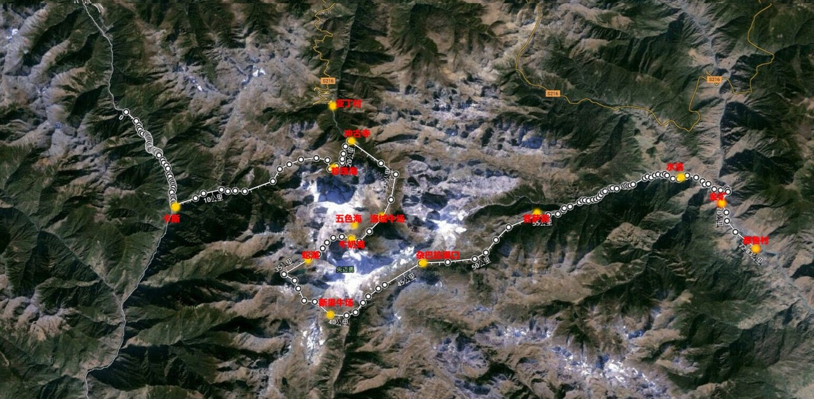

最后实际的路线是从亚丁景区出来，下面是六只脚记录，我从第一天下午的五六点才开始行程，路上还有一段忘记记录了，所以实际路要比这个长不少。

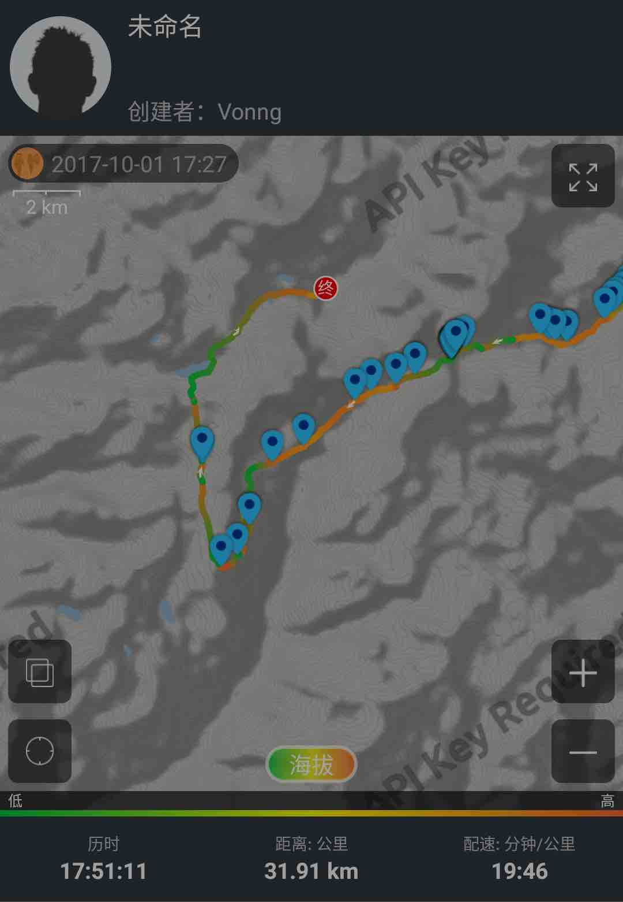

## 携带装备

这次出门装备做到了UL，装备总重控制在10kg内。

最满意的装备是大力马的包，巨能装，超耐磨还不到一公斤。帐篷虽然很轻，也是一公斤不到，但早上的露水清理比冷山这种确实麻烦了很多，睡袋也还算给力。三大件一分钱一分货，很满意。

微单是最后悔的，适马的DP0Q。带三块电池总重约800g，但走的这么累路上真想把它扔掉，拍出来的照片很多都是糊的，甚至还没手机拍的效果好。而且路上重装掏相机实在是太麻烦了，最后一块电池都没用掉。还好我用手机拍了一些照片，不至于全军覆没。

装备上的准备相当充分，唯一漏算的是药品，感冒药带少了，在木里县城没有买到，最后只带了一板白加黑，连着几天感冒，每天三片药，最后一天药吃完了，症状一下爆发了。深刻的教训啊。另外葡萄糖和电解质饮料也带少了。还好最后一天在营地问别的驴友要了一些。其他的布洛芬、阿司匹林，人参皂苷全程量都刚刚好，帮了不少忙。

| 装备                         | 重量           |
| -------------------------- | ------------ |
| 背包 HMG Southwest 3400M     | 950          |
| 收纳袋：HMG Pod，袜子x3，内裤x2，内衣x1 | 410          |
| 帐篷: Hilleberg Enan         | 1065         |
| 睡袋+收纳袋: STS SparkIII       | 750          |
| 防潮垫  XTherm                | 447          |
| 炉头 Rocket                  | 113          |
| 钛锅 Snowpeak                | 101          |
| 气罐 FMS-G5                  | 680          |
| 微单 Sigma DP0Q              | 600          |
| 微单电池x3                     | 54 * 3 = 162 |
| 充电宝(12Ah+4.2Ah)            | 326 + 199    |
| 线材                         | 100          |
| 手电+头灯                      | 180          |
| 拖鞋+鞋袋                      | 300          |
| 药品，急救用品                    | 164          |
| 卫生巾/卫生纸/湿巾/绷带              | 220          |
| 水袋                         | 128          |
| 登山杖 （手持）                   | 511          |

## 饮食

饮食上的准备还算充分，山上的水源非常充足。水不需要过滤也可以直接喝，所以一路上倒是省了不少重量。吃的带多了，本来带的刚好，在县城买了几带方便面，最后都没吃上，背上去都留给牧民了。风干牛肉干实在是……实在是太硬了，吃的牙痛，高反的时候吃这个简直要命了，几分钟才能吃下去一根，下次一定带点好吃的……。

| 饮食               | 重量       |
| ---------------- | -------- |
| 脱水蔬菜             | 500      |
| 燕麦片/葡萄糖          | 400      |
| 超干牛肉干            | 500      |
| 山之厨脱水饭x4         | 500      |
| 其他食物，四包方便面，一小袋挂面 | 500      |
| 水                | 500~1500 |

## 出发前

路上我和一对夫妻，一对情侣一起拼着包了一辆车，从木里县城到嘟噜村，路上的景色也挺漂亮的。这张我觉得特别像Mac的桌面壁纸。
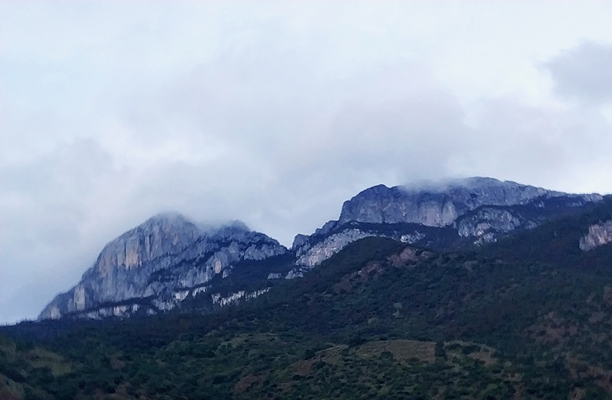

## 第一天

第一天早上，从水洛金矿出发，朝霞不出门，漫天朝霞预示着全程大雨……
第一天从水洛金矿农家出发，我早上7点45出发，农家离起点还有四公里的公路。

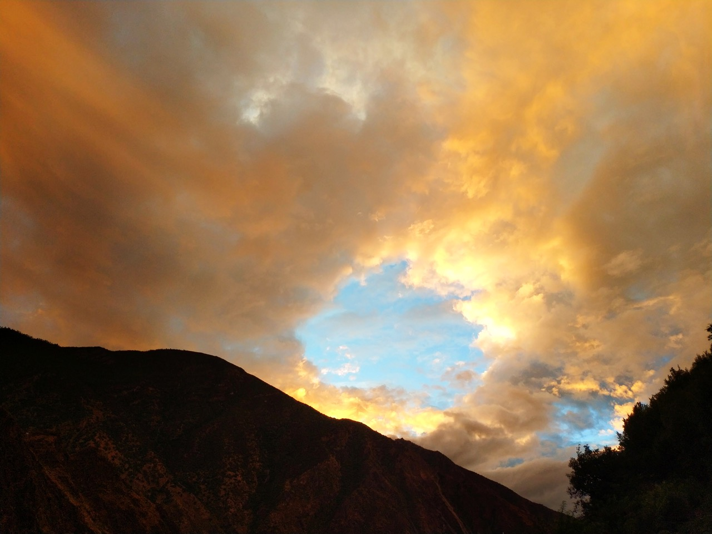

第一天的路程主要是森林，爬升比较大，从2200到4000。直接爬升1800米。前面半段我走的很快，甚至超过了先前出发的马帮，第一天精力实在是太旺盛了。不过马上就倒霉了，在过一个营地后，GPS偏移把我带到歪路上去了。我本想着按着方位走总能回到路上，没想到一条河将我河正路分隔的越来越远。 就是下面这种烂路，最后沿着河披荆斩棘走了半个多小时，总算找到一根大原木搭在河上，总算到了正路上。过独木桥的时候滑了一跤，离下面的河床有两三米高，幸亏我用登山杖插到了下面的石头缝里稳住了，左登山杖的头就这么断了。

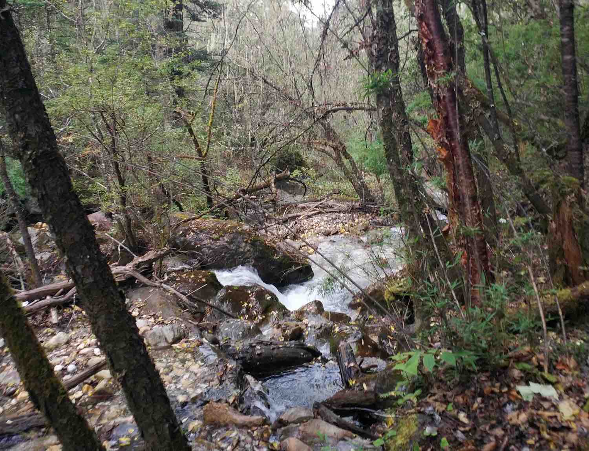

第一天到计划的营地满错牛场时才下午三点，我一想，干脆再走走好了，就往前走过了藏别牛场，到了一片开阔的平原扎营。年轻人就是火力旺

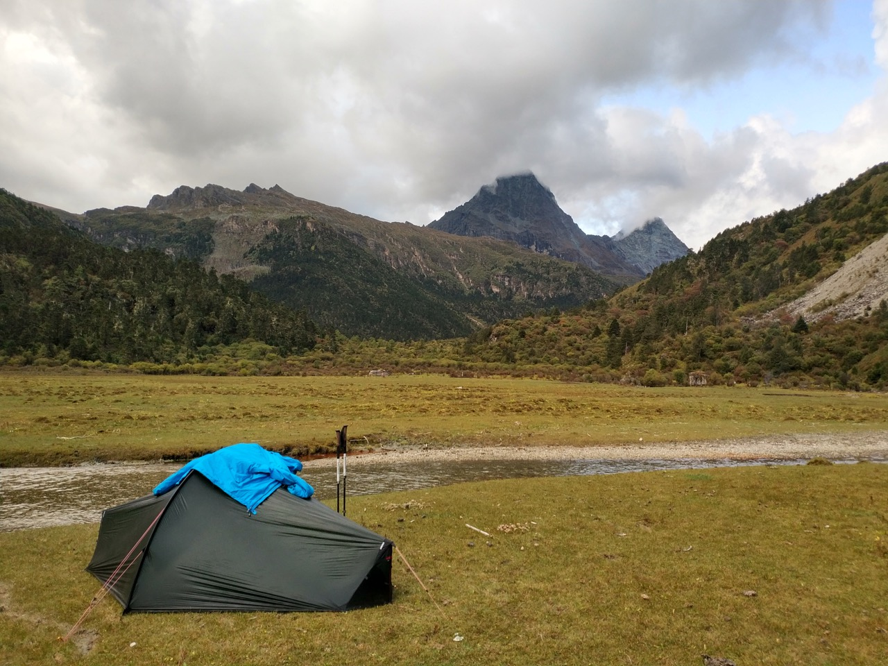

第一天我走的比较快，大多数时候，路上一个人都没有，这一片开阔的营地只有我一个人。

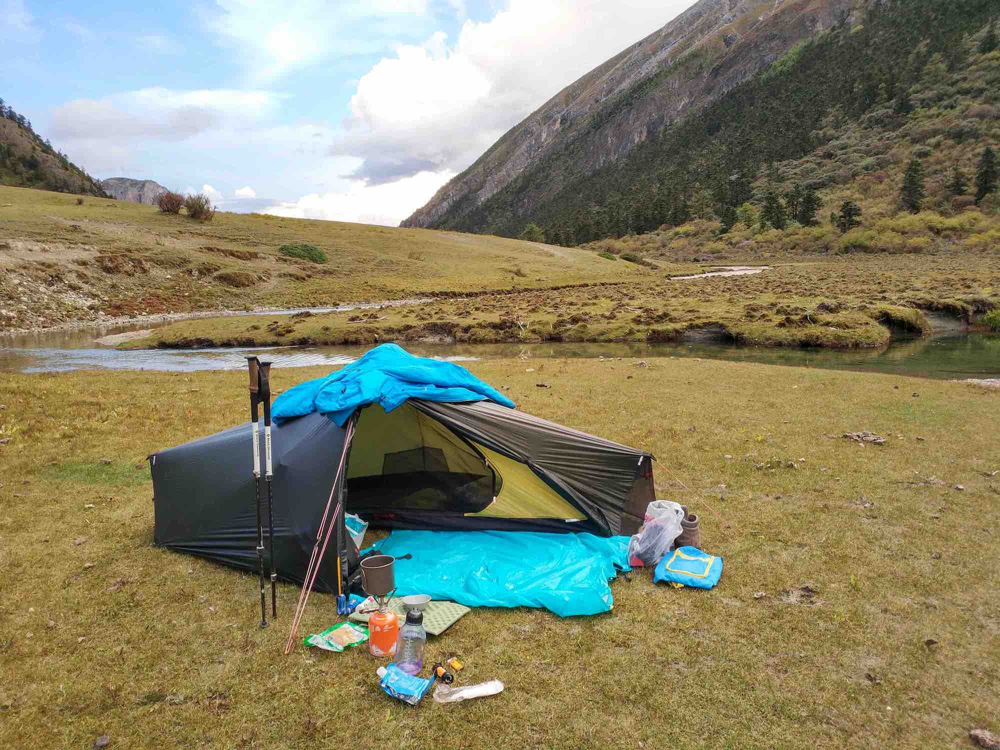

下面懒得写了，以后再慢慢补充吧，第二天经过草塘牛场和万花池牛场。

第二天仍然有不少森林，这里能看见雪山，风景很美。这是在万华池牛场后面的一片树林里拍的。

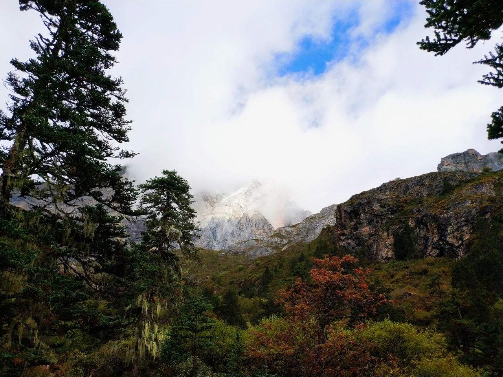

第二天要翻越杂巴拉垭口，海拔4500，有一段很陡的爬升。站在垭口半山腰望向来时的山谷。

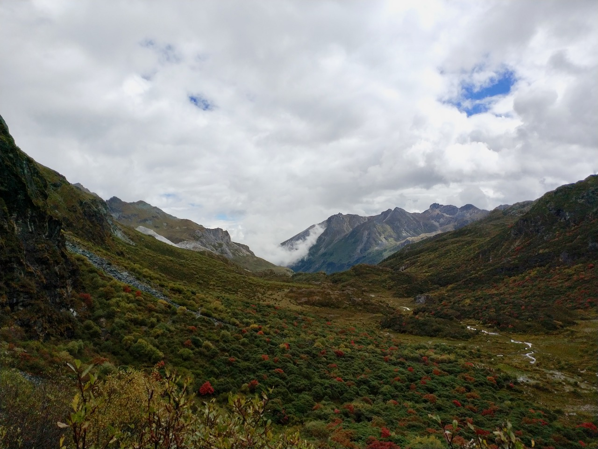

本来爬上垭口已经气喘吁吁，前一分钟还是晴空，马上就来了一场大暴雨。路上的石头变的湿滑无比。路上我又滑了一跤，又是登山杖救了我一命，不过这次左杖是彻底折了。在垭口顶上。还没来得及换上雨披，就被淋了个透心凉，在4500米的瓢泼大雨中，在刚爬上这么陡的垭口后，我已经一分力气都没有了。挪到一个岩壁下面，只能坐在地上盖着雨披，气喘吁吁。差点觉得自己就交代在这里了。好在几十分钟后雨小了，太阳又出来了，我赶忙换上干衣服裤子，继续赶路了。
接下来的路就无比痛苦了。膝盖和大腿已经开始有点隐隐作痛，可能是昨天走的太猛的缘故了。一路上断断续续的会来一阵瓢泼大雨。高原+湿身+登山，实在是太折磨了，几乎就是挪一步，喘两口气。保持着这样的节奏，我走到了第二天的营地。

第二天的峡谷
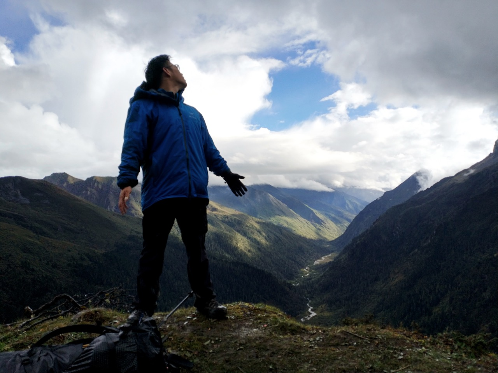

第二天的营地是新果牛场，在一片山壁下面。衣服和裤子都湿了，我就把它挂在登山杖上，希望能晾一下。帐篷带着早上的水汽，里面特别潮湿。
晚上有点头晕头痛，感觉应该是感冒了，白加黑还剩下最后一黑两白。吃了一颗黑片，布洛芬和阿司匹林，感觉好了一些。晚上煮了一袋山之厨，泡了几根牛肉干，但一点胃口都没有，实在是吃不下了。

第二天的营地
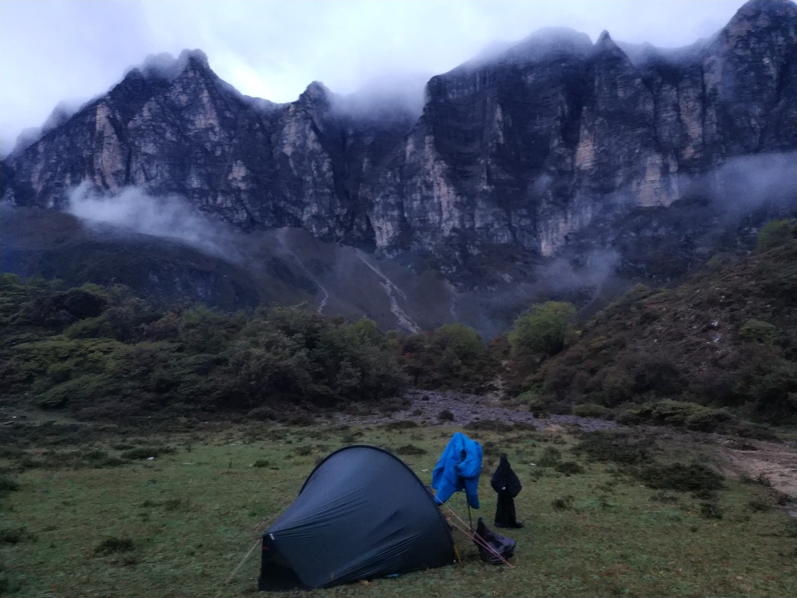

第三天的早上
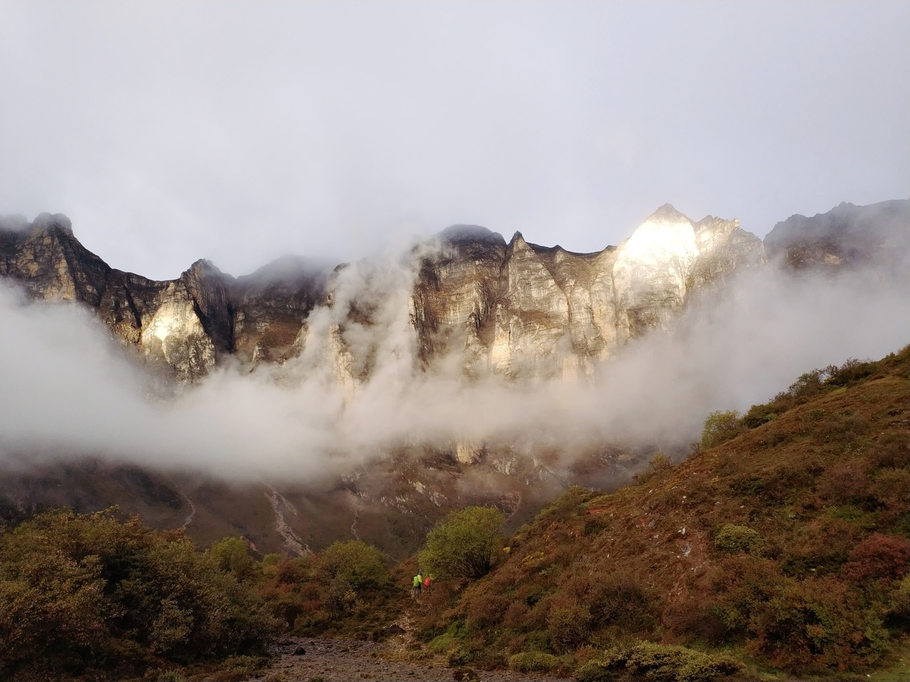

早上起来，头有点晕晕的，我把最后一袋葡萄糖和盐饮料喝了，感觉好了一些。今天是最辛苦的跋涉了。

第三天，蛇湖，营地在湖对面没有树林的地方。
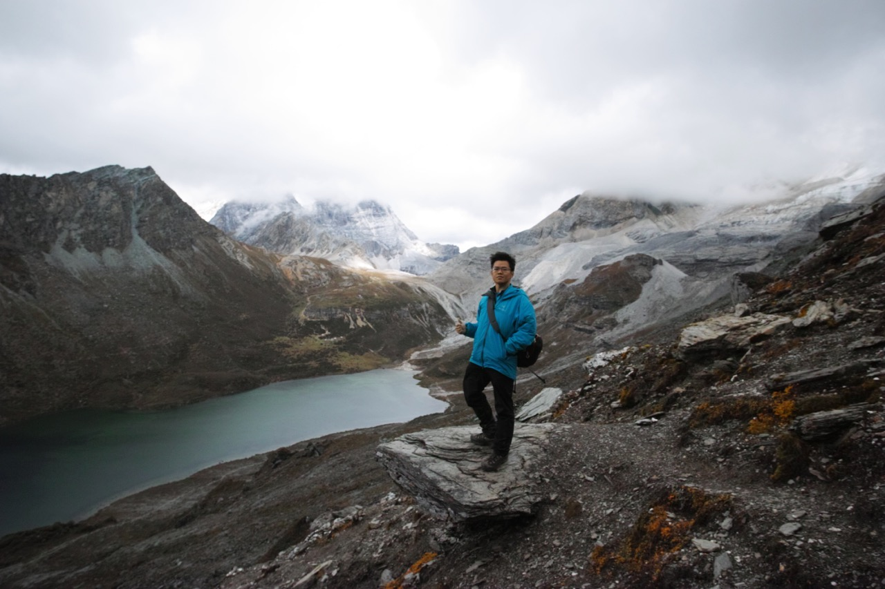

第三天的路线里要横切两个大斜坡，翻过一个很高的垭口。在翻垭口之前，向路边的驴友要了几支葡萄糖。还别说，高原上治高反最管用的就是葡萄糖了。两管下去，一口气就翻过4700垭口了。

翻过垭口之后，就没有多少绿色了。都是裸露的岩壁，悬崖之类的。

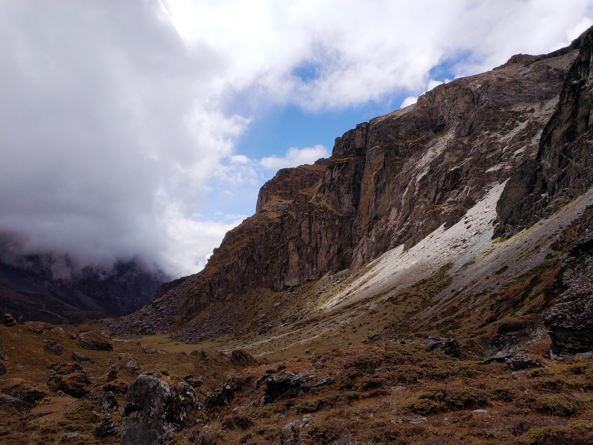

晚上在蛇湖露营，全天都在下雨，只有下午短短的两个小时是晴天，山上的天气变化太快了。

晚上严重高反了，上吐下泻，什么东西都吃不进。

第四天，牛奶海，面漏菜色，虚的不行了。但好在最后一天的路不长，翻过一个大上坡，就到牛奶了。

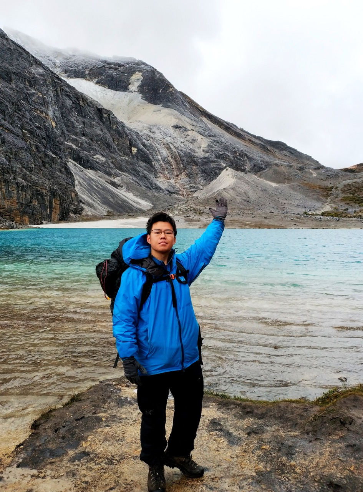

只不过没想到景区里还有这么长的路……，一路昏昏沉沉摇摆着下来，终于撑到了景区门口，在医疗救护站吸了半个小时的氧。

回来的路是中国最著名的景观公路318，路上遍地都是自驾的和骑行种……，堵车堵到飞起……还没信号。

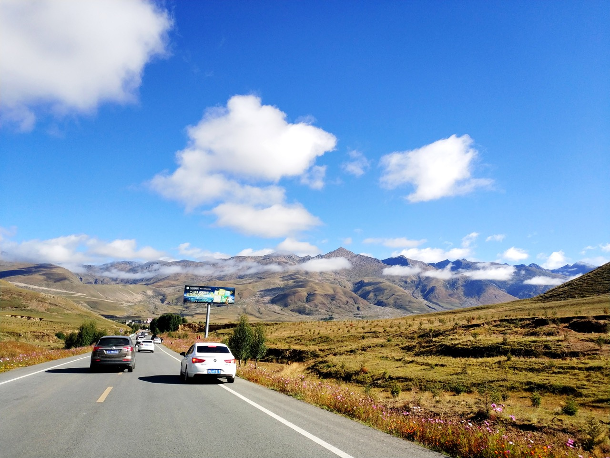

剩下的有空再写吧。