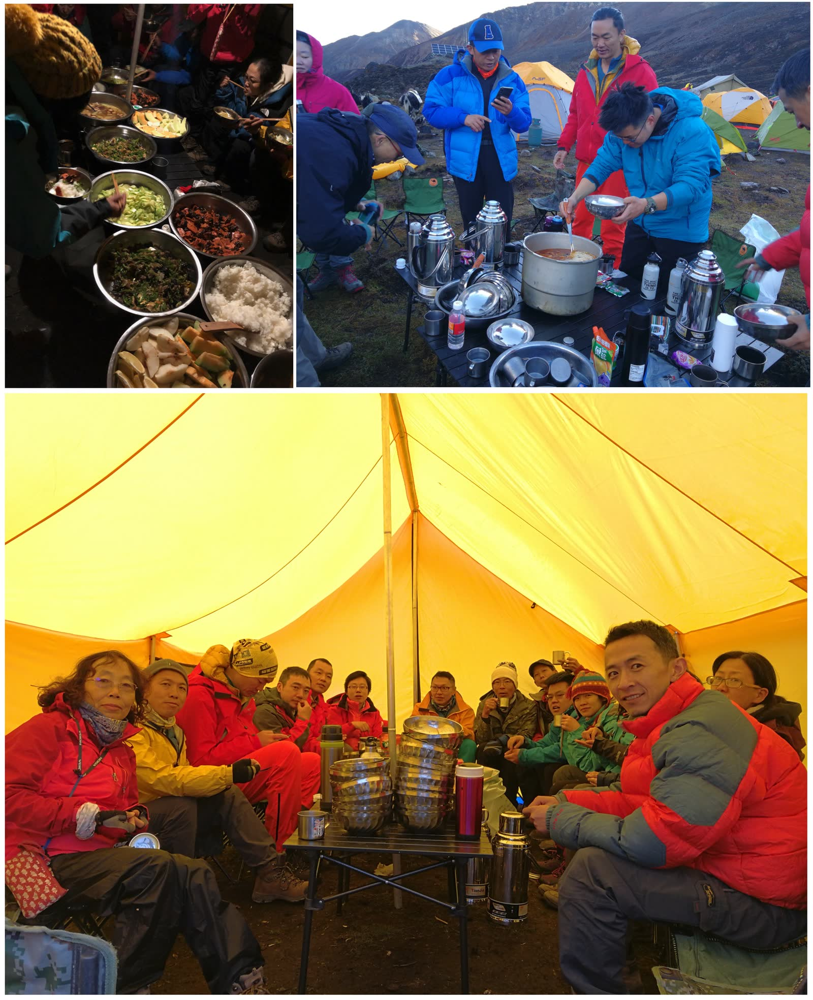
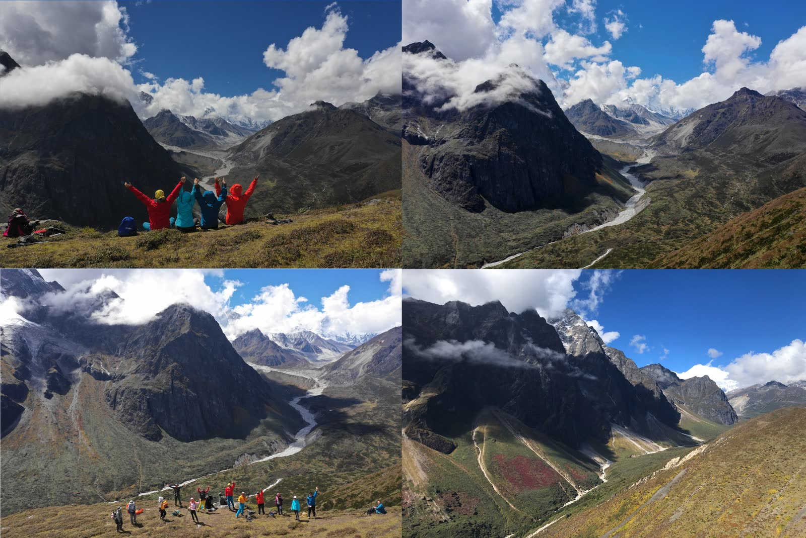
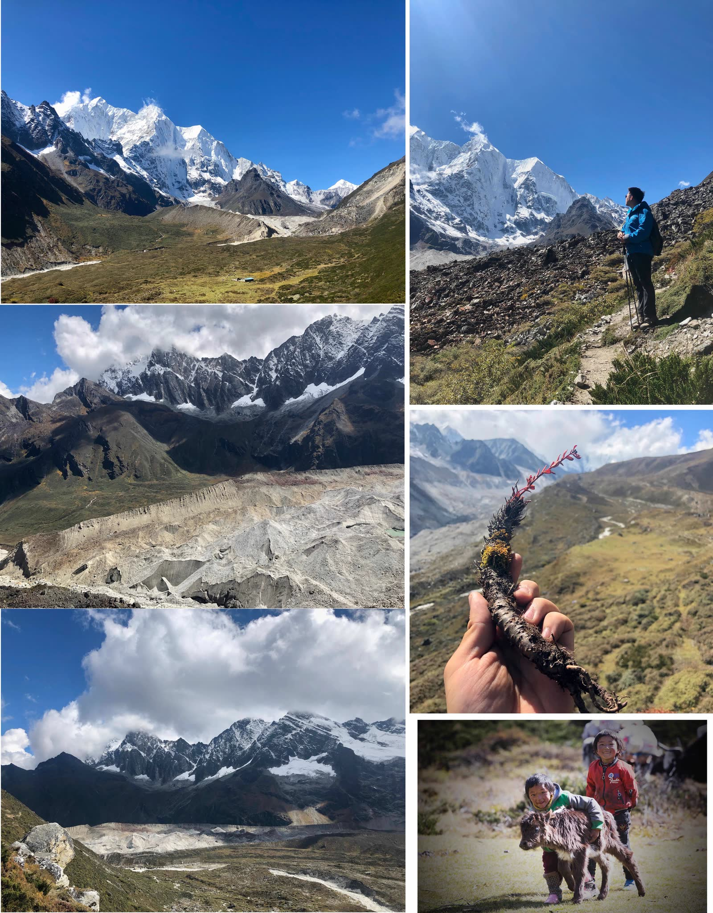
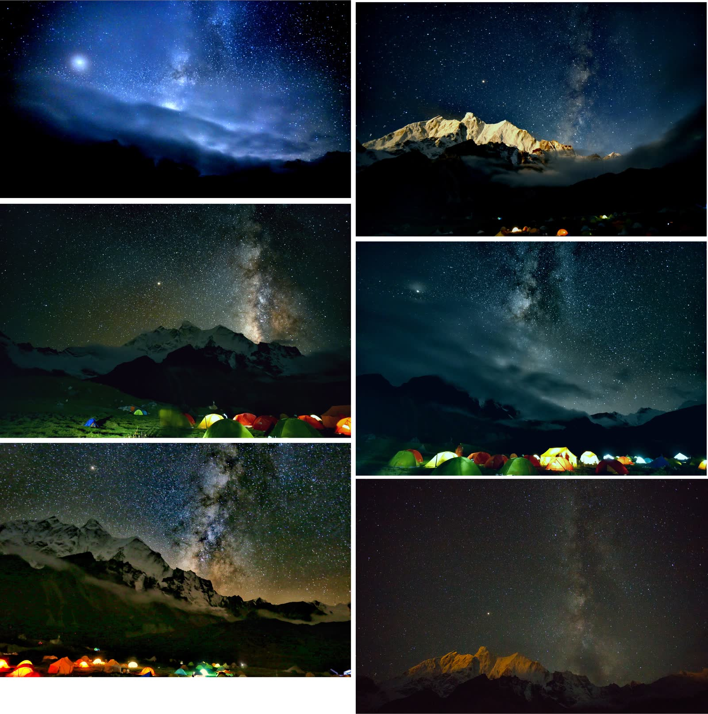
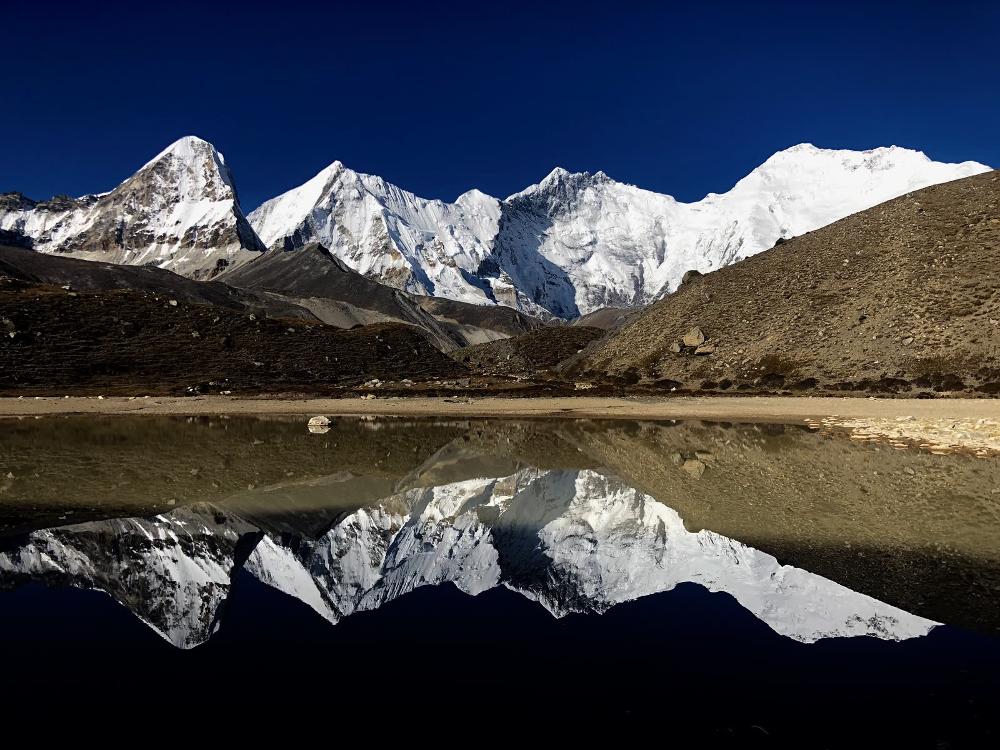
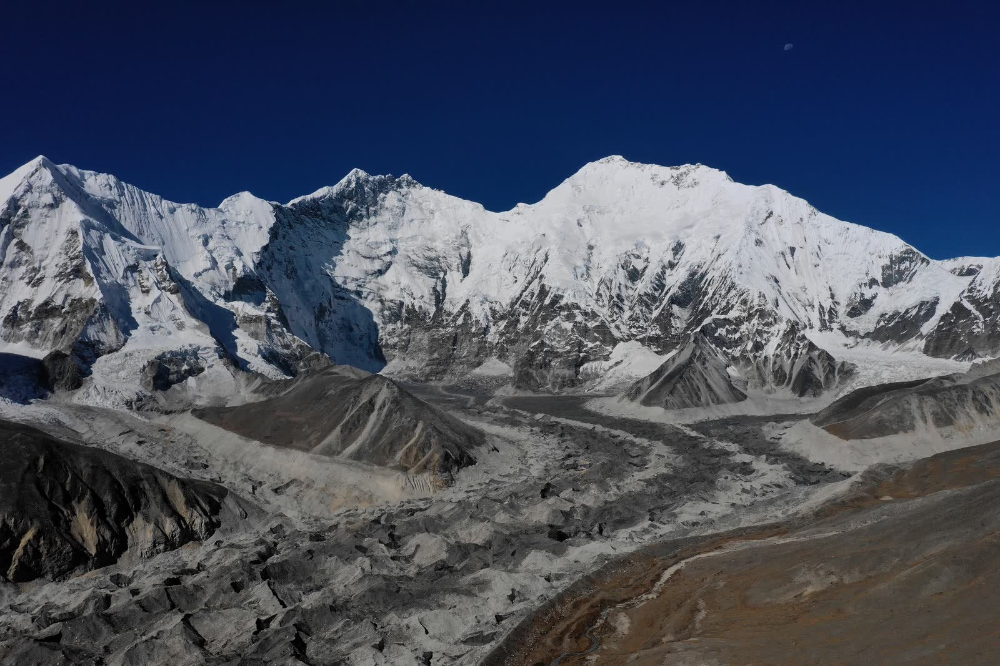
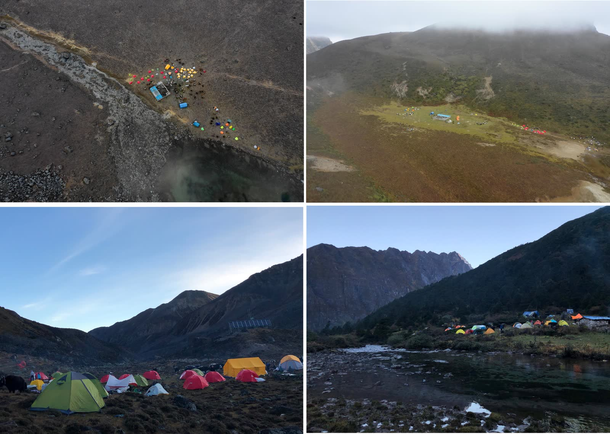

This year's National Day holiday was perfect - taking six days off could connect Mid-Autumn Festival with National Day for a 16-day consecutive break. I've visited most of China's provinces, but Tibet remained unexplored. Seeing a Gamma Gou/Everest East Face trekking activity on 8264.com, I thought "this looks good" and signed up.

Gamma Gou was called "the world's most beautiful valley" by British and American explorers in the 1920s, ranked as one of the "world's ten classic trekking routes" and second among China's ten classic trekking routes. Along the way you can see Mount Everest (1st, 8844m), Lhotse (4th, 8516m), Makalu (5th, 8463m), and Chomolonzo (24th, 7804m).

This trekking route poses considerable challenges - about 90km total distance, mostly traversing at 4000-5000m elevation. The highest point is Langma La Pass at 5350m. Due to low vegetation coverage, oxygen levels are significantly lower than at equivalent altitudes elsewhere. The route involves constant mountain crossings, reaching Everest base then returning, with substantial ascents and descents, plus no resupply along the way. There's a saying about Gamma Gou: "You either become ashes, or become a master-level player." This National Day, someone unfortunately died in Gamma Gou, just two days' journey from our position.

For me, there was some trepidation before going. Last year's solo heavy trekking on the Luoke Line - caught in storms, soaked, sick with altitude sickness, nearly died on the mountain - left psychological scars. I hadn't done much outdoor activity this year. Fortunately this time was light trekking, with yaks carrying the heavy packs; I only needed to carry daily food supplies, reducing difficulty by one star. But I'd gained over ten kilograms this year, so even light trekking became heavy for me...

But trekking is about constantly challenging oneself. Determined, I began preparations. Booked September 21st flights - coinciding with my 25th birthday, very ceremonial. Had complete ultralight gear already from last year's Daocheng Yading Luoke Line trek, sitting unused since. The high plateau is cold; sleeping bag temperature rating insufficient. Bought a new -14°C rated, 1000g down-filled sleeping bag. Team provided tent and sleeping pad, freeing space for equipment. Figuring someone in the group would bring a DSLR, I brought a DJI Mavic Pro2. In hindsight, absolutely brilliant - almost daily morning/evening rain, but the drone fears no obscuring clouds, soaring above the cloud layer. A DSLR would've been useless. My proudest achievement from this journey was drone photography.

**Photo 1: "Golden Mountain Sunrise - Mount Everest"**

Back to business - specific itinerary can be referenced on Mafengwo: <http://www.mafengwo.cn/sales/2153864.html>. Total 12 days, with 8 days trekking in the mountains, two days entering, two days exiting. Too many people go to Tibet for "spiritual cleansing" - I'll briefly cover the urban portions: spent a few days in Lhasa adapting to altitude, traveled southwest along Route 318, spent a foreign Mid-Autumn Festival in Shigatse, then entered the mountains.

First day was brutal - pure uphill testing physical endurance. From Youpa Village (3620m) had to walk all the way to Xiawu Co (4670m), starting with 16-17 kilometers and 1000m elevation gain. Climbing 1000m on the plains isn't difficult, but the high plateau is different... Heart rate at 90 just sitting with eyes closed, easily reaching 120 with slight movement, blood oxygen still only around 80%.

But youth brings endless energy - gasping at every step, still had to competitively lead the pack. Reached camp at 3:30 PM, then shivered waiting two hours for yaks carrying tents... Light trekking's advantage: luxurious meals - three dishes and soup, unlimited rice, plus coffee, milk tea, sunflower seeds. Compared to gnawing pickled vegetables, steamed bread, and compressed biscuits during heavy trekking, this was incomparably decadent. All carried by yaks anyway.

Can't sleep too early in the mountains, phones have no signal, so besides chatting, there's nothing else to do. After dinner, everyone gathered for introductions. Surprisingly I was the youngest in the group... People from all over China doing various jobs: professors, overseas students, bosses, photographers, doctors, real estate, investment banking, civil servants, etc. Three doctors alone: dentist, emergency physician, forensic doctor - if anything went wrong, we had full-service coverage 🤣. Pity the photography group behind us lacked such resources - if we could've contacted them, an adrenaline shot might've saved a life...

Rain started approaching nightfall; many couldn't sleep well the first night. Yak bells with their mystical melody kept teasing my attention, making me toss and turn...

Second day everyone photographed distant snow mountains, ate breakfast, then set off. After a day of adaptation, the second day felt much easier. Today departing Xiawu Co, 9km total, crossing one mountain (4900m) then descending to Zhuoxiamu Pasture (4030m). As the saying goes: uphill is like eating shit, downhill is like diarrhea. If uphill tests physical strength, downhill tests your knees.

Reaching the mountain revealed the world's fifth-highest peak, Makalu. Unfortunately morning water vapor had been heated by sun, clouds and rain quickly obscured the snow mountains. Fast walkers like me could still snap photos; those behind saw nothing but rain.

Descending the mountain entered true Gamma Gou. This valley we walked today is Gamma Gou proper. Gamma Gou is incredibly beautiful - deeply regretted packing the drone in the yak-carried bag instead of keeping it accessible for 360° spherical panoramas. This valley scenery resembled the section from Xinguo Pasture to Snake Lake Camp on the Yading Luoke Line.

"The world's magnificent, strange, and extraordinary sights are often in dangerous, remote places where people rarely go; hence only the determined can reach them." Though the scenery was breathtakingly beautiful, trail conditions were quite touching. Streams and paths frequently intersected; the entire route involved hopping stones like stepping stones - one careless step could twist an ankle.

Approaching camp, water vapor caught up and rain began. Felt sorry for trailing companions who saw neither mountains nor valleys today... Seems walking fast has advantages... but walking too fast caused mild altitude sickness. Camp at Zhuoxiamu, on a slope where we'd roll downhill sleeping. Exhaled water vapor condensed on the inner tent, flowing to my side, wetting the sleeping bag... Fortunately knocked out by cold medicine, slept like a dead pig.

Power lines were visible throughout the mountains, connecting a series of mobile base stations. Mountains had mobile 2G signal for calls, but internet was incredibly slow. Veteran team members said overall network speed was about 200kbps... Shared among so many people, completely unusable. Could only send a WeChat Moments post early morning when everyone was sleeping - nine photos took half an hour to upload.

Third day's target camp was Tangxiang Observation Platform (4500m), excellent visibility for Makalu and Chomolonzo. Though today's distance was under 10km, several ups and downs meant constant switching between "eating shit" and "diarrhea" modes. All yesterday's descent had to be climbed back today - quite torturous... Learning from yesterday, I carried the drone myself, adding 2kg burden, but truly a wise choice. At Tangxiang, used one battery pack with the drone; by the time I finished shooting, a massive dark cloud chased over obscuring the mountains - those behind probably saw nothing again.

Third night's camp was nice - two hills on either side blocking wind. With sun still shining, I hung clothes, pants, sleeping bag to dry; high plateau sun is fierce, drying everything in minutes. But sun was quickly blocked by approaching water vapor.

Same story the next day - originally an excellent viewing location, but morning clouds and fog made camera photography impossible. Fortunately I had the drone, flew up for aerial shots, captured some panoramas. Used 40% of one battery; hadn't even reached Everest base with only one and a half batteries remaining.

Above photo shows scenery below cloud layer - faintly visible distant Makalu and glacial river below. Below photo shows flying above clouds - from left to right: Makalu, Chomolonzo, Lhotse, Everest. The shortest Chomolonzo appeared most spectacular due to proximity, like a soaring eagle.

Fourth day's route was quite brutal - a massive descent, valley crossing, then climbing back up a very steep slope. But scenery was magnificent - standing in the open valley gazing at distant snow mountains, spirits soaring.

* Photo 1: Gazing at Makalu and Chomolonzo from Tangxiang Observation Platform
* Photo 2: Glacier terminus formed a natural wall  
* Photo 3: Glacial wall standing like the Great Wall at world's end
* Photo 4: Gazing at Chomolonzo Divine Eagle
* Photo 5: High-altitude medicinal plant Rhodiola
* Photo 6: Newborn yak calf on the trekking route

After a day's journey, reached the fourth day's camp, Nga. This was our only two-night camp; tomorrow's route goes toward Everest base - walk as far as possible, turn back at a point, return to camp for another night. Our team split three ways: regular troops departing 9:30 AM, advance team leaving 6:30 AM for golden sunrise, and an early bird team of two photography masters departing 5:30 AM, planning to reach White Lake at 5200m elevation. Going further would be time-insufficient.

Nga's position was excellent for simultaneously photographing four snow mountains. But these days' weather was morning/evening rain - every day around reaching camp, sun-heated water vapor would punctually arrive. Weather forecast showed tomorrow would be clear; around 11 PM the sky cleared - finally, a clear night. Photography masters excitedly brought out telephoto lenses preparing to shoot starscapes.

The naked-eye view of snowy mountains and starry sky was incredibly magnificent, but cameras can see an even more splendid world than human eyes. Here I envied the DSLR carriers. Below are masterpieces by our team's photography masters:

Soon clouds obscured the starry sky again; masters prepared to sleep.

**Photo 2: "Moonlit Golden Mountains" by Ruan Xiaoqi**

Everest has a 2.5-hour time difference with Beijing, sunrise around 8 AM. At 6:30 it was still dark when we departed with Tibetan guide Gesang-ge. Gesang ran very fast; I was second, desperately trying to keep up, walked until puking... During a rest/shit break, the team vanished. Morning fog was thick with only meters of visibility. Walked and walked until 7:30 AM when dawn broke but fog hadn't cleared - everyone quite disappointed, probably wouldn't see Everest golden sunrise. Fortunately I had the drone - flew up and saw the golden sunrise.

Moreover, climbing just 70m would break through the cloud layer. So everyone continued climbing upward, hoping to pierce clouds before sunrise. Eventually we did see sunrise. But only I captured the golden sunrise, haha.

Reaching 5200m elevation arrived at famous White Lake. Here you can photograph Everest and Lhotse reflections. I was in the first group to arrive; lake water still mirror-flat. Around 10 AM wind picks up, rippling water prevents reflection shots. Luck was still good.

Further ahead was Everest base. I somewhat wanted to go but felt tired, so at White Lake used the last drone battery. Flew to 5700m elevation, took several photos. This location is still 15km straight-line distance from Everest summit. Team members Fengliu-ge and Qijian-ge were quite fierce, reaching true Everest base at Rongbuk Glacier tongue, about 5700m elevation - same altitude as this photo's shooting position. Of course they returned to camp at 11 PM...

Back at camp, had tea, soaked feet - tomorrow begins the return journey. For the return, I'm too lazy to write detailed accounts - brief overview:

Days five and six, began return journey. Day five reached Rega below Tangxiang Observation Platform, day six reached Cuoxue Renma. Cuoxue Renma is another famous snow mountain reflection photography location. But luck wasn't as good this time - mountains obscured by fog. Photo 1 shows photography masters collectively "casting spells" lakeside.

Cuoxue Renma camp has ten lakes. Lakes are beautiful, but weather poor - quite regrettable. Last day, when we crossed the 5350m pass, weather finally cleared.

After Cuoxue Renma, the last day's route was quite painful - about 18km massive descent dropping 1400m. Walked to death.

Clockwise: Day 7, Day 3, Day 2, Day 1 camps.

As a semi-honest couch potato, completing this route left me quite satisfied. Next National Day maybe attempt Langta CV - after completing trekking, can graduate to mountaineering.

Actually I just came to show off photos - lots of photos ahead, viewer beware.

(Perfunctory...)

(The end...)