# 2018-10 珠峰东坡游记

​	今年的国庆假期不错，请六天假就能把中秋国庆串起来，连休十六天。中国的省份差不多都跑了一遍，但西藏还没有去过。在8264上看到了去嘎玛沟/珠峰东坡徒步的活动，心想这个这个倒是不错~，于是就定了下来。

 	嘎玛沟在上世纪20年代就被英美探险家称为“世界上最美丽的山谷”、“世界十大经典徒步线路”；在中国十大经典徒步线路中排第二名。一路上能看到珠穆朗玛峰（1st, 8844m）、洛子峰（4th, 8516m）、马卡鲁峰（5th, 8463m），以及珠穆朗卓（24th，7804m）。

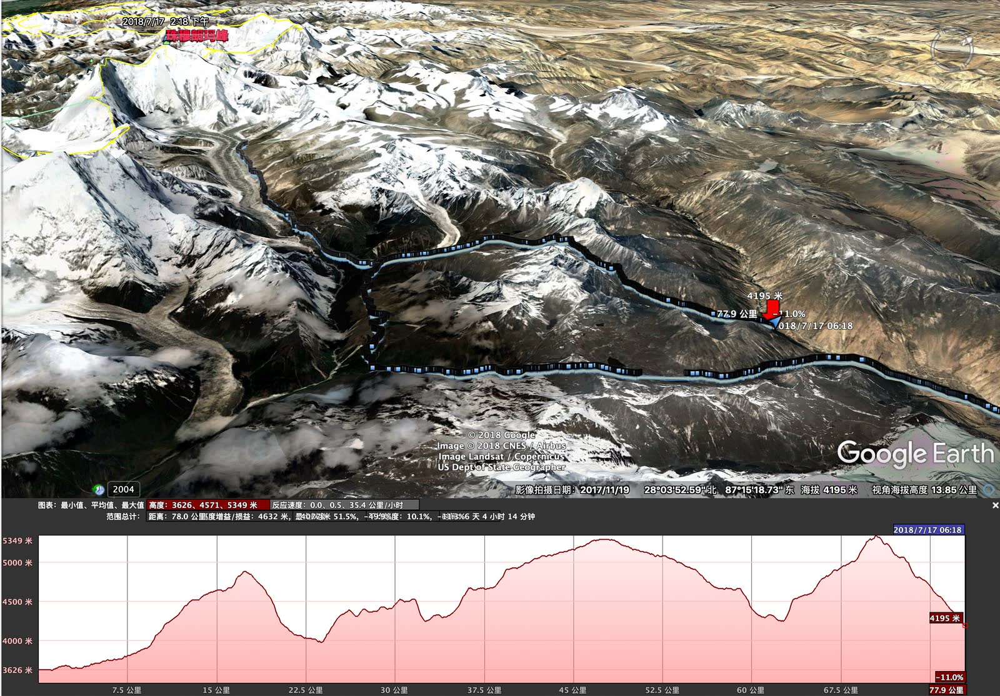

​	这条徒步路线挑战不小，全程约90公里，基本都在海拔4000~5000m的地方行进。海拔最高处朗玛拉垭口5350米，因为植被覆盖率低，在同海拔下的含氧量要低不少。一路翻山越岭，走到珠峰脚下再返回，爬升下降很多，而且沿途没有补给。关于嘎玛沟的一个说法是，走这条路线，要么成为骨灰，要么成为骨灰级玩家。今年国庆就有一个人不幸死在了嘎玛沟里，和我只有两天路程的距离。 

​	对于我而言，去之前心里还有一些忐忑。去年单人重装走洛克线，碰上暴雨湿身感冒高反差点死在山上，留了点心理阴影，这一年都没怎么去户外走动。好在这次走轻装，大包有牦牛背，自己每天只要背负当天的饮食就可以了，难度下降一颗星。但对我而言，这一年胖了十几公斤，轻装也变成重装了……。可徒步嘛，就是要不断挑战自我，下定决心，开始准备。定了9月21号的机票，正好是25岁生日那天，很有仪式感。装备都有现成的全套超轻量装备，去年走稻城亚丁洛克线用完就一直在吃灰。高原很冷，睡袋温标不够。重新买了个-14度温标，1000g充绒的羽绒睡袋。帐篷和防潮垫团队提供也不用带了，可以腾出地方来放件器材。想想单反肯定团里有人带，我就带上了DJI Mavic Pro2。事后想想真是太机智了，几乎每天早晚都在下雨，无人机不畏浮云遮望眼，一飞冲天破云层。要是带了单反就只能傻眼了。本次旅途的最得意之作，就是用无人机拍的。

**图1 《日照金山——珠穆朗玛》**

​	言归正传，这次的具体行程可以参考蚂蜂窝：<http://www.mafengwo.cn/sales/2153864.html> 。总共12天，其中有8天是在山里徒步的，两天进山，两天出山。去西藏洗涤心灵的人太多了，城里的部分一笔带过：在拉萨待了几天适应高原反应，沿着318一路向西南，在日喀则过了一个异乡的中秋节，就进山了。

​	第一天比较苦逼，纯上坡，考验体能。从优帕村（3620）要一路走到晓乌错（4670），刚开始走就要走十六七公里，爬升一千米。要说在平原地区爬升个一千米也不是啥难事，但高原就不一样了…。坐着闭目养神心率就有90，稍微走一走轻松就到120，就这样血氧还只能在80%左右。

​	不过年轻人就是火力旺，一步一喘也要争强好胜走前头。下午三点半就赶到营地了，然后瑟瑟发抖等背帐篷的牦牛等了两个小时…。轻装团的好处就是，可以吃的很豪华，三菜一汤，饭管饱，还有咖啡奶茶瓜子，比起啃榨菜馍馍压缩饼干的重装生活腐败了不知道多少倍，反正都是牦牛来背。

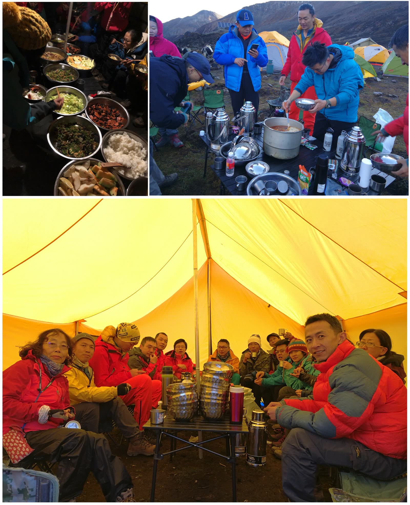

​	山里不能太早睡，手机又没有网络信号，因此除了聊天，大家也干不了啥别的事情。晚上吃完饭，大家聚在一起，开始自我介绍。没想到我还是团里最年轻的，呵呵…。大家来自五湖四海，干什么的都有：教授，留学生，老板，摄影师，医生，房地产，投行，公务员等等等等。光医生就有三个：牙医，急救医生，还有法医，真要出个什么幺蛾子都能一条龙服务了🤣。可惜我们后面那个摄影团没这种条件，要是能联系上我们对的话，一针肾上腺素起码能保个命…

​	临近夜晚开始下雨，第一晚很多人没睡好；牦牛的铃铛声带着奇妙的旋律，不断勾引挑动着我的注意力，让我辗转反侧…。

​	第二天起来，大家都在拍远处的雪山，拍完吃了早饭就上路了。经过了一天的适应，第二天显得轻松很多。今天是从晓乌错出发，全长九公里，翻过一座山（4900）再下降到卓夏木牧场（4030m）。俗话说得好，上坡如吃屎，下坡如拉稀。如果说上坡考验的是人的体能，那么下坡考验的就是人的膝盖了。

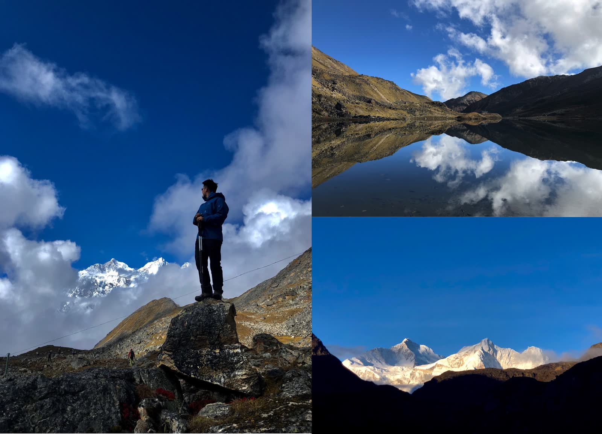

​	爬到山上可以看见世界第五高峰，玛卡鲁峰。不幸的是上午的水汽已经被太阳晒了起来，云雾和雨很快就把雪山遮住了。像我这样跑得快的还能拍张照，走后面的就啥都看不到，只能淋雨了。

​	下了山就进入了嘎玛沟。严格意义上的嘎玛沟就是今天走的这个山谷。嘎玛沟非常美，特别后悔把无人机放在大包里给牦牛驮了，不然可以拍个360球面全景照。这个山谷风景很像亚丁洛克线上新果牛场到蛇湖营地那一段的景色。

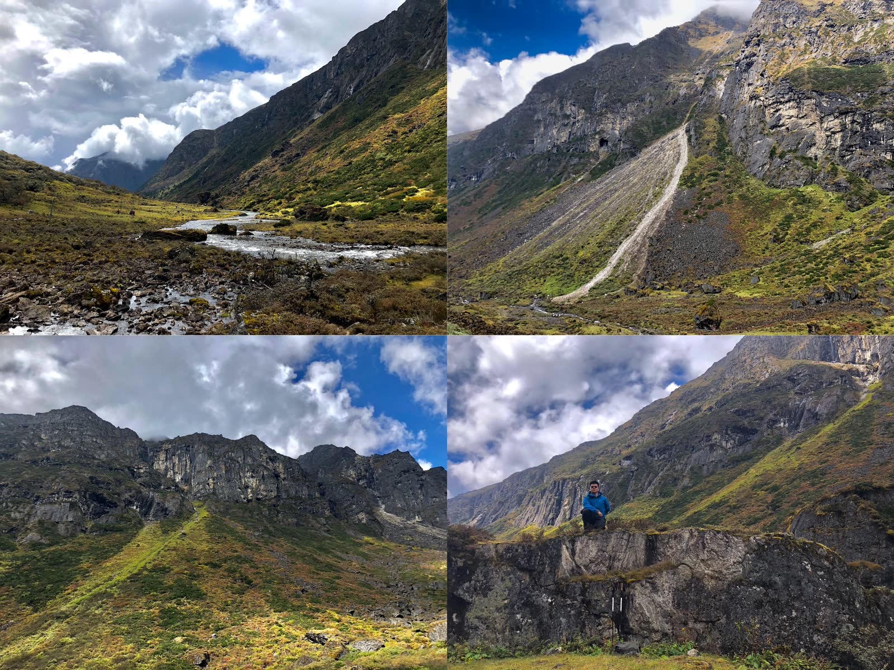

​	世之奇伟、瑰怪、非常之观，常在于险远，而人之所罕至焉，故非有志者不能至也。风景虽美不胜收，路况却相当感人。溪流与道路频繁交错，一路上都在小石头上走梅花桩，稍有不慎就会崴脚。

​	快到营地的时候，水汽追了过来，开始下雨了。心疼走在后面的伙伴，今天山与谷都没有看到……，看来走得快还是有好处的…，但走的太快，有点轻微高反。营地在卓夏木，一个斜坡，晚上睡觉总是会往下滚。呼出的水汽凝结在内帐上，顺着流到我这一侧，把睡袋弄湿了…，好在磕了白加黑黑片，睡得跟死猪一样。

​	山里一路上能看见电线杆，连通着一系列移动的基站。山里有移动的2G信号，可以打电话，但上起网来奇慢无比。队里的老司机说全局上网速度应该在200kBps……，被这么多人分着根本没法用。只好趁大清早人都还在睡觉发了个朋友圈，九张图片一共发了半个小时才发出去。

​	第三天的目标营地是汤湘观景台（4500），视野非常好，能看见马卡鲁峰和珠穆朗卓。今天的路虽然距离只有十公里不到，但有好几个上下坡，不断在吃屎和拉稀模式切换。昨天下了多少，今天全都得爬回来，甚是折磨…。吸取了昨天的教训，我把无人机拿出来自己背了，又多了两公斤负担，不过这真是个明智的选择。在汤湘用无人机拍了一块电池，等我拍完，一大块乌云就追过来把山遮住了，后面的筒子们可能又是啥都没看到。

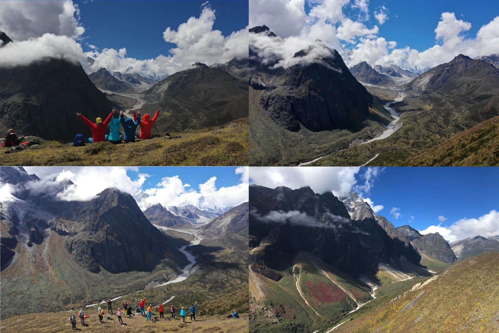

第三天晚上的营地不错，两边有两个山丘能挡风。趁着太阳还在，我把衣服裤子睡袋都拿出来晾晾干，高原的太阳峰相当生猛，十几分钟就能干透了。不过太阳很快就被追赶而来的水汽挡住了。

第二天也是，本来这个营地是一个极好的观景之处，但早上云雾缭绕，用相机是拍不到什么了。好在我有无人机，飞到天上提溜了一圈，拍了几张全景。用掉了一块电池40%的电，还没到珠峰脚下就只剩一块半了。

上图是云层下方的景色，依稀能看见远方的马卡鲁峰，以及下面的冰川河。下图是飞到云上面看到的景色，从左往右，依次是马卡鲁峰，珠穆朗卓，洛子峰，珠穆朗玛。其中最矮的珠穆朗卓因为离得近，反而看起来最为壮观，犹如一只雄鹰。

第四天的路程相当操蛋，有一个吭哧吭哧的大下坡，然后从山谷中穿过去，再爬上去，经过一个很陡的坡。但风景相当的好，站在开阔的山谷里，遥望远方的雪山，心情无比悠扬。

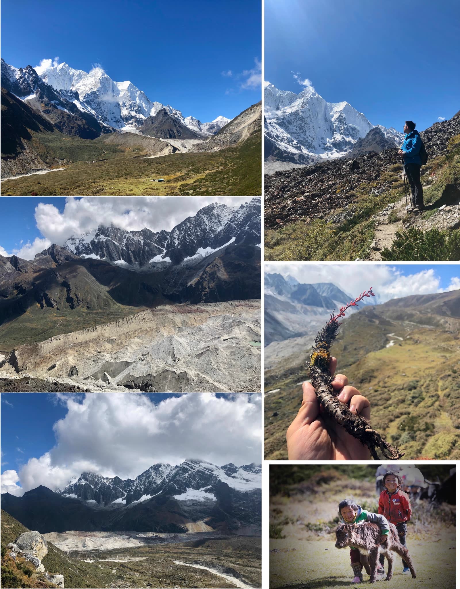

* 图1：从汤湘观景台遥望马卡鲁峰与珠穆朗卓
* 图2：冰川前沿形成了一堵天然的墙
* 图3：冰川形成的墙宛若绝境长城一般伫立
* 图4：遥望珠穆朗卓神鹰
* 图5：高原药材红景天
* 图6：在徒步路上刚出生的小牦牛。

经过一天的跋涉，到了第四天的营地，俄嘎。这也是我们唯一驻扎两天的营地，明天的路线就是前往珠峰脚下，能走多远走多远，到了一点就回头，回营地再住一晚。我们的队伍分了三波，明早九点半出发的常规部队，六点半出发看日照金山的先遣队，还有由两位大法师组成的5点半出发的赶早队，计划是到海拔5200的白湖。再往上走时间就不太够了。

俄嘎的位置非常好，能够同时拍摄到四座雪山。不过这几天的天气都是早晚阴雨，每天都是差不多到营地的时候，太阳晒起的水汽也差不多踩着点跟过来。但天气预报上说明天是晴天，晚上十一点左右，天晴了，终于，碰上了一个晴朗的夜晚。老法师们兴高采烈地拿出长枪短炮，准备拍星空。

​	肉眼所见的雪山星空已经无比壮阔，不过比起人眼，相机能看到一个更瑰丽的世界。这时候，就轮到我羡慕带单反的同志了。下面的照片是队里老法师们的大作：

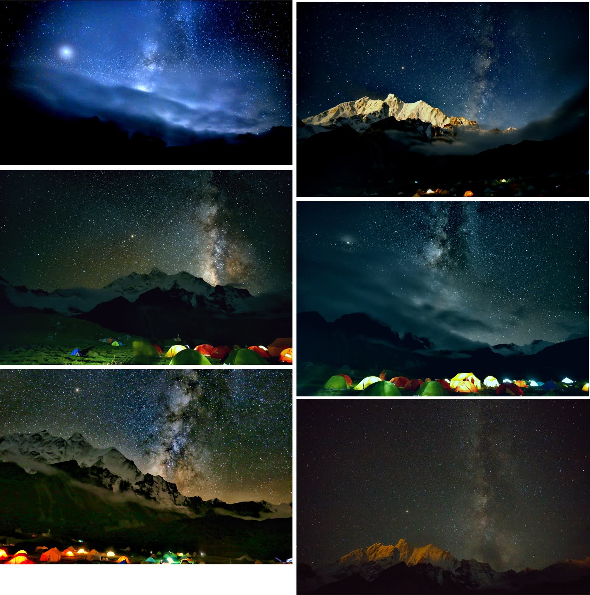

很快，云雾又遮住了星空，大法师们也准备睡了。

**图2 《月照金山》 by 阮小七**

​	珠峰这里与北京有两个半小时的时差，大约八点钟日出。六点半天还是黑的，我们跟着藏族协作格桑哥出发了。格桑跑的很快，我是第二个，拼了命想跟上他，走吐了…。休息拉个屎的功夫，队伍就跑没了。早晨的雾很浓，能见度只有几米。一直走一直走，到了早上七点半，天已经蒙蒙亮，雾还没有散，大家都挺失望，估计看不到珠峰日照金山了。还好我带了无人机，飞上去一看。正好看到了日照金山。

而且，只要爬升个70m，就穿破云层了。于是乎大家都接着网上爬，希望能在日出之前穿破云层。最后还是看到了日出。不过日照金山只有我拍到了，哈哈。

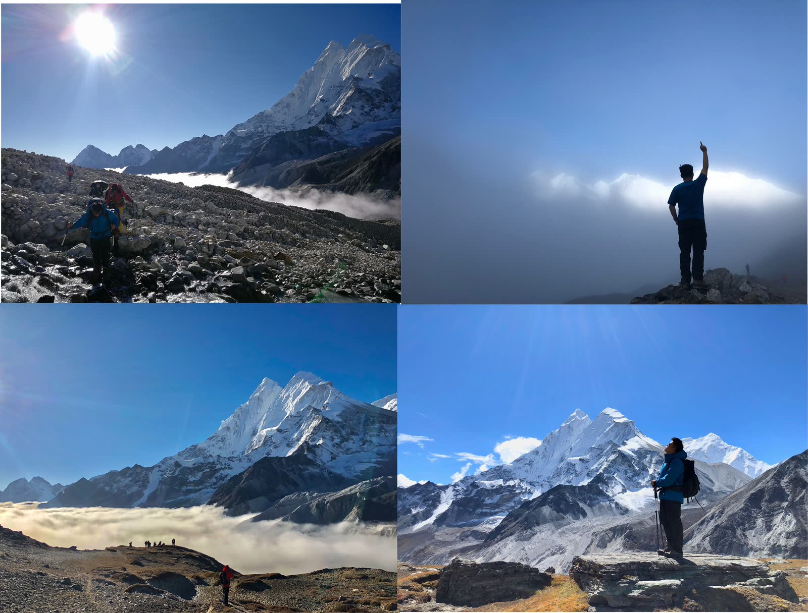

走到海拔5200的时候，就到了著名的白湖。这里能拍到珠峰与洛子峰的倒影。我是第一批到的，湖水还是如镜面一般平整。到了早上十点左右就会起风，湖水皱了就拍不出倒影了。运气还是不错的。

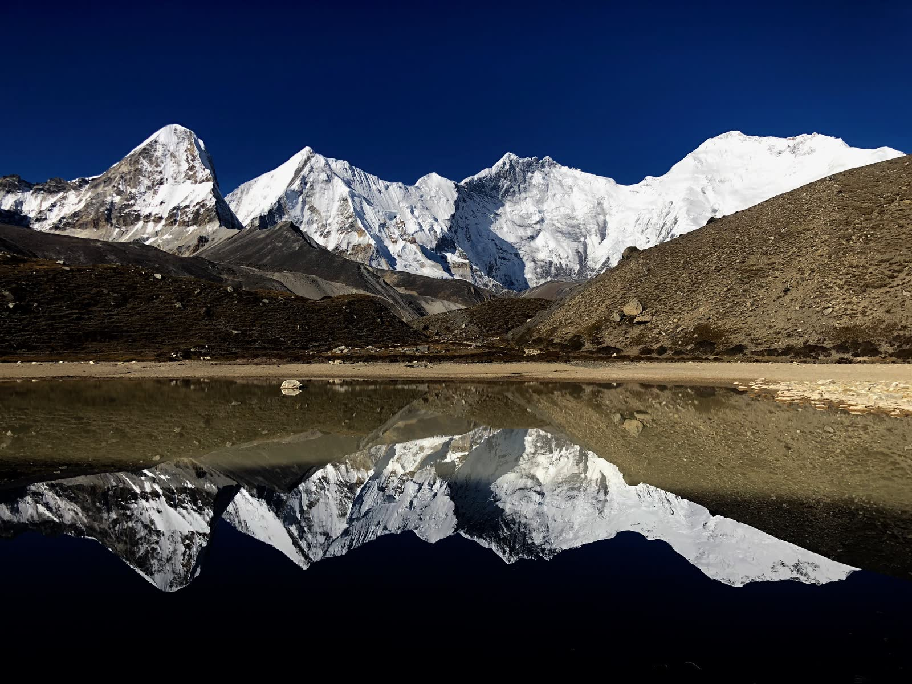

再往后，就是珠峰脚下了。我有点想去，但感觉有点累了，就在白湖用掉了最后一块无人机电池。飞到了海拔5700的地方，拍了几张照。这里距离珠峰峰顶直线距离还有15公里。队里的风流哥和旗舰哥倒是相当生猛，走到了真正意义上的珠峰脚下，穹布冰川的冰舌那里，大概是海拔5700的地方，跟这张照片拍摄的位置处于同一海拔。当然他们回到营地，已经是晚上11点了……。

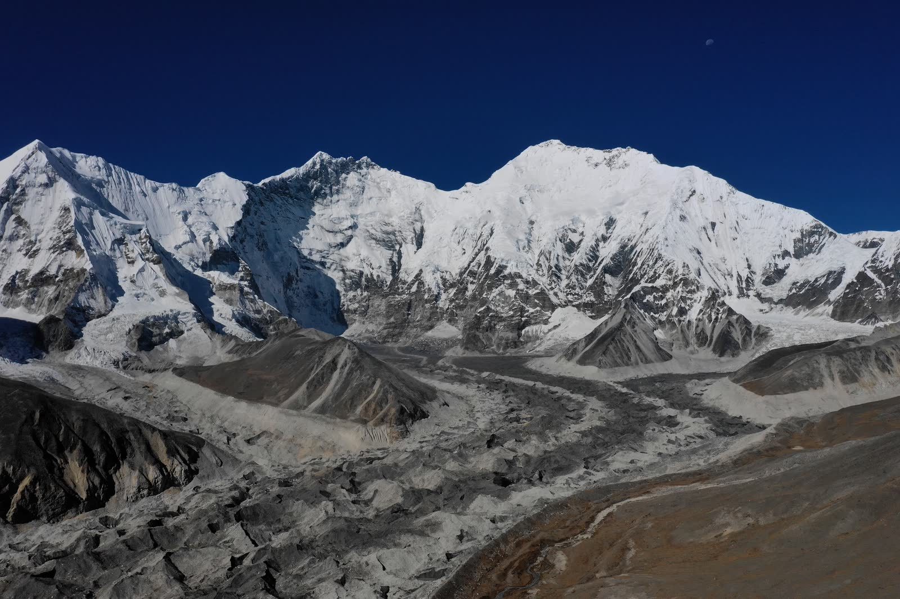

回到营地，喝个茶，泡个脚，明天就该返程了。返程的话，我连流水账都懒得写了，一笔带过吧：

第五天，第六天，开始返程。第五天到了热嘎，汤湘观景台的下面，第六天到了措学仁玛。措学仁玛是另一个著名的雪山倒影拍摄之地。不过这一次运气没有这么好，雪山都被雾挡住了。图1为老法师在湖边集体做法。

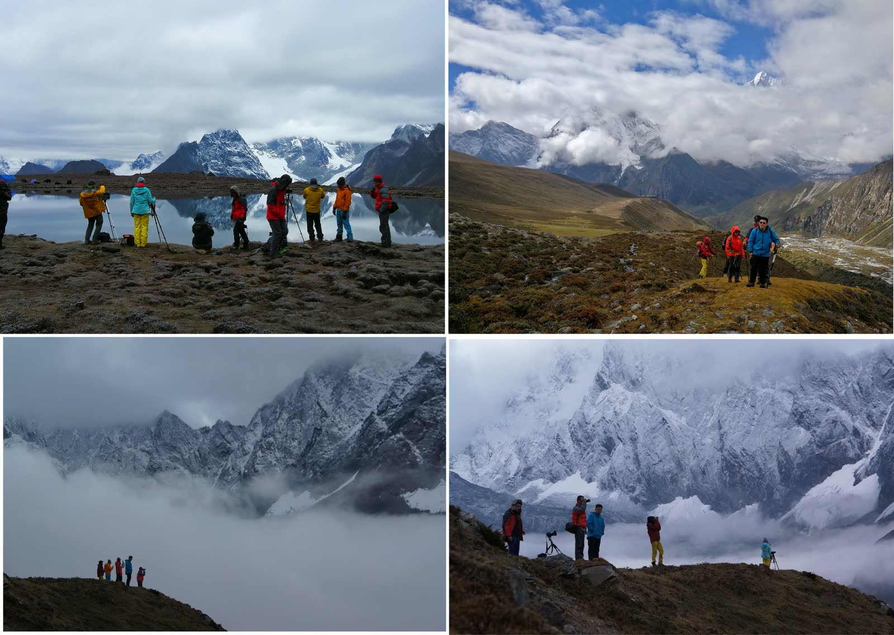

措学仁玛营地有十个湖。湖很漂亮，但天气不好，甚是可惜。最后一天，当我们翻到5350的垭口时，天倒是晴了。

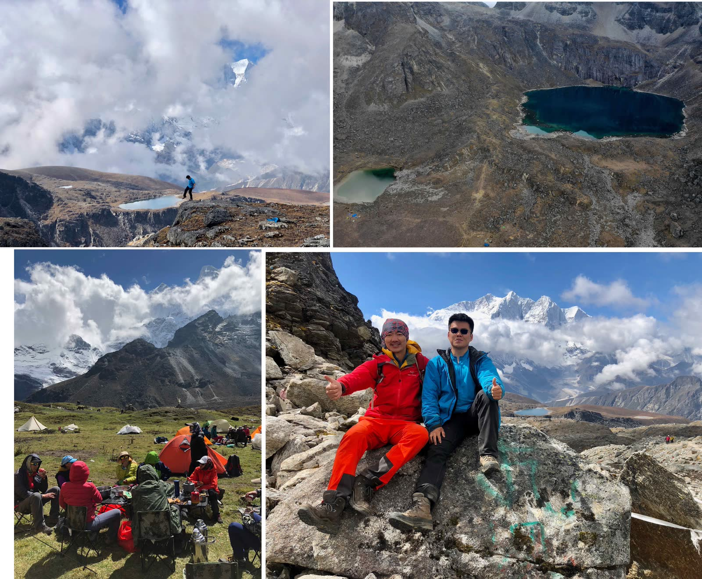

过了措学仁玛，最后一天的路相当蛋疼，约18公里的大下坡，下降有1400米。走死个人。

时针顺序，第7天，第3天，第2天，第一天的营地。

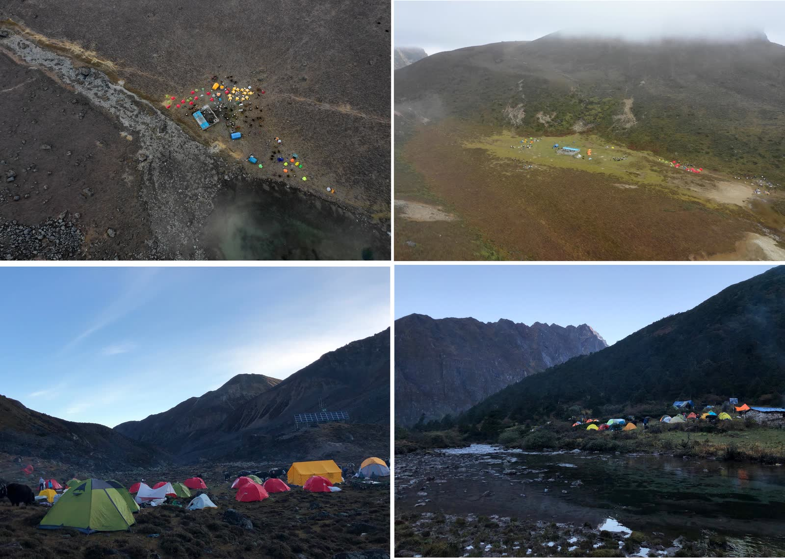

作为半个诚信肥宅，能走完这种路线，我还是相当满意的。明年国庆的话，也许再约个狼塔CV吧，徒步就可以毕业，开始登山了。

其实我就是来晒照片的，多图杀猫。

（敷衍…）

（完……）

