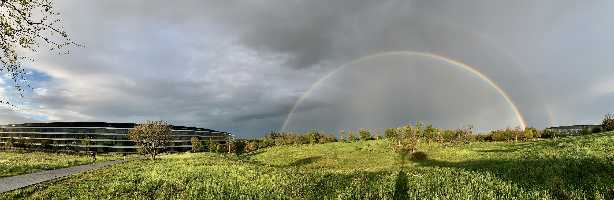

Went on a business trip to America, worked one week and played one week. Road trip along Highway 1, Bay Area, Los Angeles, San Francisco, Yosemite.

<!--more-->

Thanks to my company, I went on a business trip to America for two weeks - one week working, one week playing. Apart from last year's company annual meeting trip to Japan, I'd never been abroad, especially traveling solo, which was a bit intimidating. Plus the itinerary was decided just before departure, with almost everything planned dynamically along the way. But the results turned out quite good, thanks to help from local classmates and former colleagues.

## Preparation

The working week was fully booked, so I only formally started planning the trip two days before hitting the road, because a fundamental question remained undecided: should I rent a car for self-driving, or join a tour group? After all, being in a foreign country for the first time with unfamiliar territory, plus being quite rusty at driving these past years, I was somewhat apprehensive about self-driving. But being timid isn't my style - just do it.

So I contacted a local car rental company - Hertz, and booked an SUV. The process was incredibly simple, didn't even need to register an account, just needed a Chinese driver's license with an international driving permit translation. Made an online reservation the day before, went to the store the next day to pick up the car. Definitely bought full insurance coverage - proved to be so wise afterward. Rented for 8 days with insurance for under $600 total.

As for route planning, I only confirmed Highway 1, Los Angeles, and Yosemite as must-visit places, leaving the rest to improvisation.

While planning the itinerary, I looked at some Western US tour group routes. Basically confirmed LA and Yosemite as two must-visit destinations.

So the rough itinerary was: March 31st depart from Cupertino in the Bay Area, Highway 1, Los Angeles, Yosemite National Park, San Francisco.

## Observations

Material abundance

Advanced technology

Infrastructure

Rural airports

Marina harbors

Pristine national parks

Good customs

Homeless on streets

Social security

Accident handling

Rich neighborhoods and slums

GTA5

## Photos

Don't have time to write for now, just posting some random photos.

> Jobs Theater under a rainbow

> Apple's spaceship headquarters

> Roadside fountain at Stanford University

> Student club advertisements at Stanford University

> Big Sur's azure waters - the Pacific is too beautiful!

> Universal Studios live movie performance, so realistic - because it's real!

> Los Angeles at night viewed from Griffith Observatory

> Half Dome in Yosemite

> Random shot on the way back to Cupertino

> San Francisco streets - the steep slopes are quite challenging for parking...