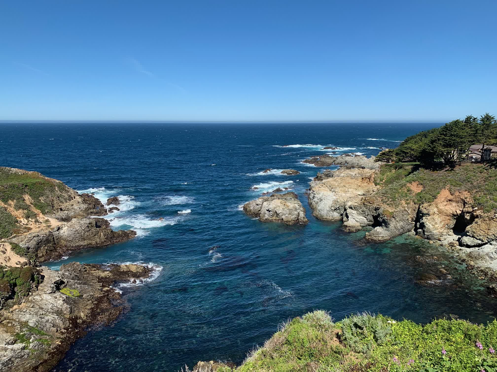
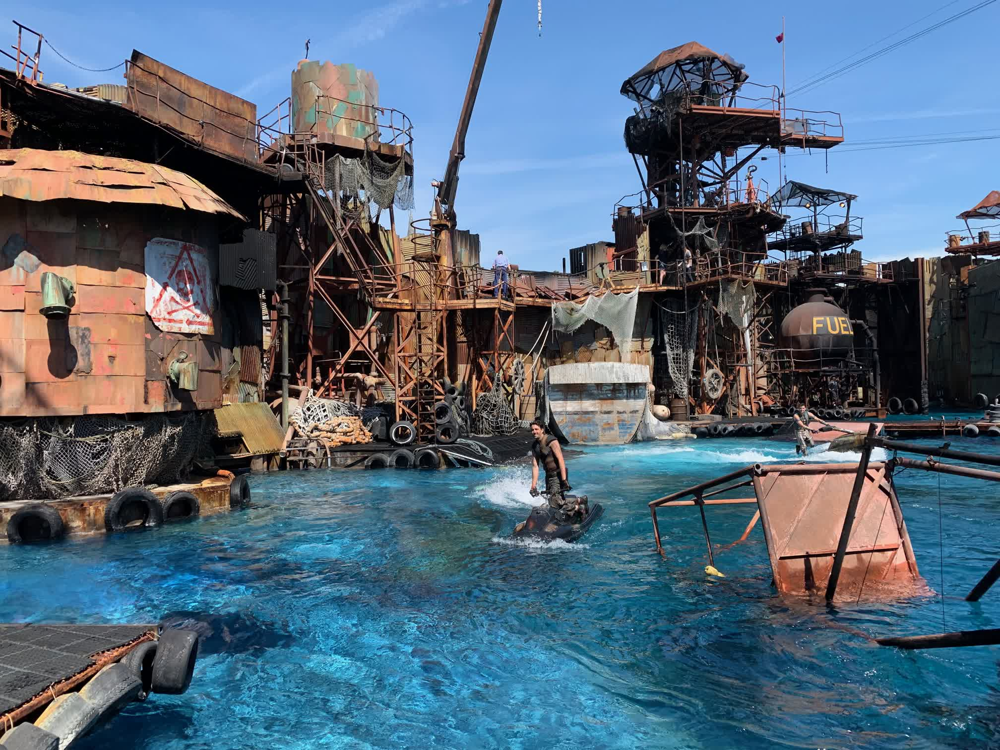
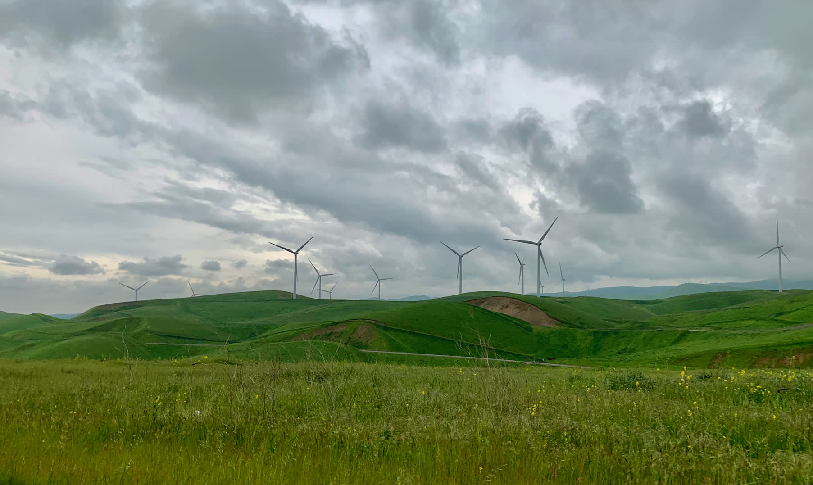

去米帝出了趟差，工作一周玩一周。自驾一号公路、湾区、洛杉矶、旧金山、优胜美地

<!--more-->

托公司的福去美帝出了趟差，待了两个星期，工作一周玩一周。说起来除了去年公司年会去了趟日本，我还从来没出过国，特别是一个人去，还是有点发怵的。加上玩的行程是出发前临时决定的，一路上几乎都是动态规划模式。不过最后的效果倒是相当不错，多亏了当地老同学和老同事的帮助。

## 准备

工作的一周安排很满，直到上路开玩前两天，我才正式开始规划行程，因为一个最基本的问题还没有确定，到底是租车自驾，还是报个旅行社呢？毕竟第一次到异国他乡人生地不熟，加上这几年开车相当生疏了，所以对自驾还是有点虚。不过畏手畏脚不是我的风格，干就是了。

于是我找了当地的租车公司——Hertz定了辆SUV，过程异常简单，连账号都不需要注册，只要带上中国驾照配上国际驾照翻译件就可以了。提前一天网上预约，第二天直接去门店提车就行。保险果断买了顶配，事后证明真是太明智了，含保险租了8天一共也就花了600刀不到。

至于路线规划，我只是确定了1号公路，洛杉矶与优胜美地三个是必去的地方，剩下的就随机应变了。

在规划行程的时候，我看了一些美西旅游团设计的路线。基本确定了LA和优胜美地两个必去地点。

于是大致的行程是：3.31 湾区Cupertino出发，1号公路，洛杉矶，优胜美地国家公园，旧金山

## 见闻

物资丰饶

科技发达

基础设施

农村的机场

游艇码头

国家公园一尘不染的

良风美俗

街头流浪汉

社会治安

车祸处理

富人区与贫民窟

GTA5

## 照片

暂时没有时间写，随便贴几张照片吧。

> 彩虹下的乔布斯剧院

> 苹果的飞船总部

> 斯坦福大学路边的喷泉

> 斯坦福大学的社团广告

>

>Big Sur 大苏尔湛蓝的海水，太平洋太美了！

>环球影院的现场电影表演，太逼真了，因为就是真的嘛！

> 从格里菲斯天文台遥望夜色中的洛杉矶

> 优胜美地的Half Dome

> 返回库比蒂诺路上随手拍下来的

> 旧金山街头，路的坡度很大，对停车来说是个挑战……