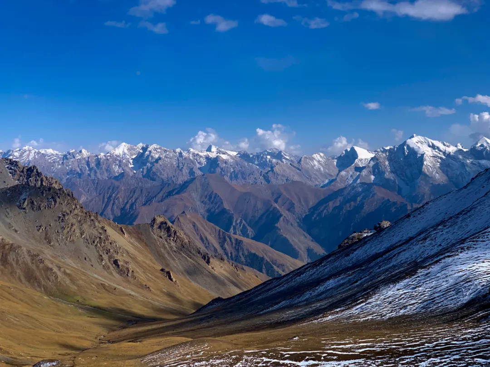

This National Day I trekked the Wusun Ancient Trail, crossing over the Tianshan Mountains to reach that Ili. Though over a week has passed, the memories linger - writing to commemorate this journey.

<!--more-->

## TL;DR Too Long; Didn't Read

For videos, please refer to the [original WeChat article](https://mp.weixin.qq.com/s/GPe2BOcmE5kUt0LV_X3qLw), spare my small bandwidth.

## Overview

Wusun, Xiate, and Langta are the three most famous trekking routes in Xinjiang's Tianshan Mountains. The Wusun Ancient Trail spans across the Tianshan, connecting northern and southern Xinjiang, reportedly the most beautiful of the three trekking routes.

During last year's self-driving tour, I spent over a month playing in Xinjiang, with the Duku Highway's scenery leaving the deepest impression. As another route crossing the Tianshan Mountains, the Wusun Ancient Trail could be called the ancient Duku Highway, located not far from the current Duku Highway. So its scenery definitely wouldn't disappoint me - the only concern was whether I could complete it.

The Wusun Ancient Trail starts north from Qiongkushitai Village in Tekes County, Ili, Xinjiang, and exits south at Heiying Pass in Baicheng County, Aksu region. The full route is over 130 kilometers, requiring crossing two passes (mountain passes), zip-lining across one major river, and fording 20-30 smaller rivers - quite challenging. The key is the quite compact itinerary: apart from the first day's 10km warm-up, every day requires walking 20-30km of mountain roads, still very challenging. Difficulty rating 8.5 stars - completing this route means all trekking routes nationwide become accessible.

> Borrowing teammate Shaji-ge's route guide, nearly 300 li (150km) total. Major ups and downs, quite exhilarating.

This route has both light-pack and heavy-pack groups. Light trekking allows tents, sleeping bags, cameras, food and water to be carried by yaks, making it somewhat easier. Though I've done solo heavy-pack Luoke Line and light-pack Everest East Face Gamma Gou, I'd gained over ten kilograms since then, so light-pack became like heavy-pack for me... Honestly, walking such routes still caused some trepidation, especially when the guide mentioned very likely encountering blizzards during National Day. Fortunately the guide was enthusiastic and professional, confident I'd have no problem, so it was happily decided. (Friendly plug: Starry Sky Outdoor, boss lady guide Huakai 13760226846, various western trekking routes)

Looking back after completion, difficulty was actually manageable, and the journey was relatively fortunate overall, especially the weather along the way being just right: caught a snowy night at Heavenly Lake, seeing two different landscapes; weather was decent when crossing snow mountain passes; strong winds and heavy snow concentrated in the last three days. One day earlier or later and the entire trip experience would've been greatly diminished. Alright, enough chatter, here's the journal~

## D0 Preparation

To accomplish great things, one must first prepare proper tools. For trekking, physical fitness and endurance are crucial, but equipment is also indispensable. This route has many rivers to cross, so a waterproof dry bag is essential - if clothes and sleeping bag get soaked, it's game over. Some medicines, trail food energy bars, daily supplies and handheld gimbal were carried personally. Thanks to UL equipment, these two big packs together were only 15-16 kilograms - not even more than the fat I carry around. I SF Express shipped the big red pack directly to the starting point hotel, no need to lug it on the way. Note that drones cannot be mailed to Xinjiang - must be hand-carried.

> Light trekking still requires plenty of equipment

October 1st formal assembly and departure. I took the morning flight on the 30th, Beijing to Korla, then via Aksu to Yining - quite a journey. Looking down at the Tianshan Mountains we'd cross from the airplane, it seemed quite spectacular.

> Who commands this vast earth in its ups and downs?

## D1 Departure

October 1st, clear. Today is National Day, Mid-Autumn Festival, and the first day of trekking. The plan was departing from Yining, going to Tekes County to purchase pots, pans, rice, oil, salt for the journey, then sitting several hours by car to the trekking starting point Qiongkushitai Village, walking 10km to stay overnight at Kazakh guide Shalang's house.

Tekes is a great place with a very unique Bagua layout, reportedly a city without traffic lights - though actually a gimmick, just replacing traffic lights with traffic police. During last year's self-driving tour, I passed through here and regretted missing the famous hot air balloon aerial viewing project. The Bagua City is only interesting viewed from above, so I specially prepared a drone to make up for this regret.

> Bagua City Tekes. Many cities and counties in Xinjiang prohibit flying, but Tekes County allows it.

The county town isn't large; we didn't stay long. Lunch was mutton pilaf and red willow kebabs, followed by shopping: naan bread, rice and flour, vegetables and fruits, pots and pans, seasonings and cooking utensils. Of course, the outdoor miracle tool - sanitary pads. Also, Ili's famous local specialty - "hanged ghost" dried apricots were quite memorable.

After preparations, officially headed to Qiongkushitai Village. Along the way we could see the "three-dimensional human grassland - Kalajun," but by October it was already yellowing, not very attractive. Unfortunately encountered road construction crews, causing long delays. Arrived at starting point Qiongkushitai Village around 5 PM.

> Qiongkushitai sits among high mountain pastures, surrounded by trees, pleasant environment. Asphalt roads under construction - reportedly this will be the next Hemu Village & Kanas.

From Qiongkushitai to guide Shamu's home still required walking over ten kilometers of mountain roads - this was the first day's warm-up.

The scenery along the way was quite pleasant, but as darkness fell, it was already evening when we reached Shamu's home. Shamu slaughtered a sheep to entertain us - the freshly grilled mutton skewers were truly fragrant, just a bit too much salt. From today on there'd be no cell signal, and this was also the last electrical supply point - afterward we'd rely only on power banks. But Shamu's home also used solar panels and batteries; three charging ports were simply insufficient supply.

> Scenery along the way

In the evening everyone sat on the big communal bed, around a table eating Mid-Autumn dinner and doing self-introductions. Though we were still strangers meeting by chance, all travelers in foreign lands, somewhat reserved. But from experience, after coming out of the mountains, we'd definitely all become good friends.

Speaking of which, I discovered the guy sleeping next to me (Hai-ge) brought almost identical equipment: clothes, pants, pillow, sleeping pad, earplugs, and various miscellaneous items. I'm also a gear enthusiast with some equipment knowledge - touching his clothes I could tell the model by feel, all very tasteful choices. Most notable was Hai-ge's SeaToSummit SparkIII 400g down-filled sleeping bag - I have an identical one but didn't bring it fearing it'd be too cold. So Hai-ge warmly invited me to share his tent for mutual warmth over the coming days. I never imagined - the world is so wonderful, meeting a kindred spirit through such circumstance... But that's another story.

> Gear enthusiast and mechanic (self-proclaimed) group photo

## D2 Mountain Crossing

October 2nd, clear. Morning packing and preparation, beginning the second day's journey. Today was rather brutal - if yesterday's 10km walk was just warm-up, today difficulty jumped directly to walking 28km, crossing 3720m elevation pass. Getting red-faced and sweaty. I'd walked much more brutal routes before, but past glory doesn't count - times have changed, and this day's route still brutalized me.

> The first pass on the route - Baozhudun Pass

Morning ate mutton soup over rice, fully fueled for departure. The beginning was unremarkable - strolling through mountains, gradual ascent. But gradually became strenuous; I rested longer by the river, and the lead group vanished. By the time I puffed my way to the pass base, perfectly missed the midday water boiling and tea. Just caught sight of the lead group when a shit break made them disappear again. So I ended up alone, neither front nor back...

Not liking to wear hats, the fierce wind made my head ache, making mountain crossing torturous. The long ascent was also a huge drain on physical strength. Each time I'd just crossed one summit, another big slope would appear - truly maddening. Fortunately there were always hikers slower than me - tiring as it was, no pressure.

> Heaven high and earth vast, feeling the universe's infinity. Gazing at Tianshan, ascending Baozhudun Pass.

After tremendous hardship crossing the pass came another torturous big descent. As the saying goes: uphill is like eating shit, downhill is like diarrhea. All that was just consumed must now be expelled in one breath. But compared to ascending, descending is always pleasant, plus this scenery of snow mountains, meadows, and valleys lifts the spirits. Walking long, shoes and socks were nearly soaked through with sweat. Found a big rock along the way, took off shoes to sun-dry - quite pleasant.

> After crossing the pass

On the descent met Dahai from the lead group returning to collect people - finally not trekking alone. Walking alone always tempts sitting for rest; together we moved much faster, finally reaching camp at dusk. The camp had a small wooden cabin, 50 yuan per person for dormitory-style sleeping. Though dirty with only one room, still much warmer than outside.

> Small wooden cabin camp on the hillside - pitching tents on such steep slopes isn't easy.

Midnight, another group's guide came in saying they'd lost someone, wanting to borrow a horse from us to search. When he mentioned it, I realized I'd actually seen and chatted with her on the trail. Fortunately heard the next day that person was fine - unable to continue walking, had camped along the route.

Today crossed the first pass. When crossing the second pass on day five, though the slope was bigger and route longer, it was much easier. Later I analyzed several reasons: crossing mountains without wearing a hat caused wind-induced headaches; shoes without sanitary pad liners caused foot pain; carried a bunch of unused items too heavy; trail food was just two energy bars, finished before crossing the mountain; being alone was just too boring.

Evening ate hand-grabbed rice; Dahai's cooking skills were quite excellent - though possibly because hunger is the best seasoning... That night by the fire burned a big hole in the camp cotton pants, quite depressing...

## D3 River Crossing

October 3rd, clear. Today departing the small cabin, following the Koksu River, taking a zip line across the big river then crossing eight smaller rivers. Today's unexpected surprise: reportedly there'd be a small store along the route (by the zip line)! We all eagerly anticipated drinking a bottle of happy cola in the mountains.

> Golden poplars by the Koksu River

Yesterday's ordeal left me quite tired; originally planned riding horses today to relax and save energy for the coming days. Unexpectedly after a night's sleep, physical strength fully recovered, so decided to continue trekking.

> Your bodies and names will perish together, but rivers flow eternal through the ages

Koksu River scenery was quite good, very reminiscent of Kanas and Hemu Rivers - the same turquoise water plus golden, red, green coniferous forests on both banks, giving a Swiss-like landscape feeling.

> Koksu riverbank
> 
> Reportedly this will be developed into a scenic spot next year, requiring entrance tickets

By noon reached the zip line point with its small store. Surprisingly, even in these deep mountains there were dirt roads accessible by vehicle. The small store was quite shabby, without our longed-for happy cola. Only a few items: Wusu beer, instant noodles, watermelon, and mutton. Instant noodles and Wusu both 10 yuan - truly conscience pricing. Actually with just this one supply point, the boss could charge 100 yuan and I'd still buy. First time finding beer and instant noodles so delicious - I downed two big green bottles and bought two more to pour into water bladders. Wusu is indeed quite strong; two bottles made me dizzy - good thing I didn't drink and ride...

> One bottle of big green per person, deadly Wusu. WUSU spelled backwards is "NSNM (kill you all)," hence deadly big Wusu.

After eating and drinking well, time to cross the zip line. This cable system wasn't an electric ski-mountain type but rather two zip cables - fortunately not the hand-grabbing type but with a basket. People slide by gravity to the river center, then the opposite side pulls the basket across with rope.

> One cable spanning north and south, natural barriers become thoroughfares

After the zip line, the route mainly involved forest passage and river crossing. Today required crossing eight rivers; our light trekking team hired horse pack crews, allowing horseback river crossing. But heavy trekking required removing shoes, changing to river-crossing footwear, and manually fording. River crossing is quite risky - the water temperature here is very low, about 4-5°C. Hands and feet become numb within seconds of touching the water; longer exposure risks cramping. If accidentally getting soaked, the following days would be torturous. Especially heavy pack - if someone falls in the river unable to quickly remove the pack, it's easy to be swept away with pack and person together. Someone died this way two years ago, causing Wusun Ancient Trail to be temporarily closed. Even now, walking requires advance application and registration with Tekes County Cultural and Sports Bureau.

> Hai-ge beaming while riding horse across river

Of course, saying all this, autumn-winter river water isn't large - manageable. The specially prepared river-crossing shoes weren't much used.

Horseback river crossing was quite fun. Ili horses here are strong and sturdy, each carrying four packs (nearly 200 pounds), no problem riding two strong men. I can barely be considered able to ride horses; after a couple attempts could mount flying and even carry people across rivers, hehe...

Today's camp had a forest station yurt, probably the last accommodation point on the route - afterward all camping. Tomorrow is Heavenly Lake, somewhat anticipated.

> Cooking tent / My garbage bag black tent / Three fools moving rocks

Evening passed happily with taking turns singing and truth-or-dare games. Sanitary pads became our hard currency gambling stakes as scarce strategic resources for absorbing foot sweat and preventing shoe moisture, while guessing Little Fairy's weight became our joyful source.

## D4 Heavenly Lake

October 4th frost/snow, clear. Today walking 8km, crossing one pass to Heavenly Lake. Could reach camp by afternoon - relatively easy.

Morning ground was frosted, still somewhat cold, but couldn't stop our enthusiasm for reaching Heavenly Lake. Everyone stepped on hard frozen earth excitedly embarking on the final journey to Heavenly Lake.

> (Fortunately not the final journey to heaven)

After completing the first three days, I'd adapted to trekking rhythm, able to keep up with the first tier. But again, stopping for a shit, the lead group vanished without trace. This time I carefully studied the contour map, discovering from the other side's wild route over looked like it could save several kilometers - planned taking a shortcut to arrive first.

> Distance deceives the eye - looks like a small hill, actually a several-hundred-meter-high wall

But after taking this route I somewhat regretted it. Distance deceives the eye - photos can't convey the effect of mountains standing before you. Only when people personally stand there do they realize how treacherous this "route" is. Climbing along steep mountain walls with sun unfortunately hanging right at the peak, unable to look directly ahead. I was like Icarus following Daedalus's ladder to heaven toward the sun - one careless step would truly become eternal regret.

After tremendous effort climbing the ridge, before I could celebrate, discovered the mountaintop full of jagged giant rocks with no passable route. Fortunately heaven leaves no one hopeless - using various dodging, jumping, rolling, climbing skills, finally descended from the mountain's other side, returning to the proper path. So the lesson learned: if horse teams don't take this seemingly much shorter "wild route," there's definitely a reason.

Fortunately after the difficult shortcut detour, caught up with the first tier again. Teammate River was just galloping on horseback, quite dashing.

> Let us be companions in this mortal world, living freely and easily.
>
> Galloping horses, sharing worldly splendor. (Photographed by Dahai)

After crossing the last small hill, Heavenly Lake suddenly appeared before us. Heavenly Lake is this journey's essence - originally named Ak Kul Lake, 3100m elevation, a high plateau lake.

> Lakeside camp - if only we had inflatable rafts

After crossing the last hill, Heavenly Lake suddenly appeared before us, finally bringing these days of arduous trekking to a conclusion. Afternoon we pitched camp then had free activities. I took advantage of decent weather to fly the drone, then sat lakeside with several teammates cracking sunflower seeds, enjoying beautiful scenery, chatting freely - quite joyful, spirits soaring.

> Our "lakeview room" right by the lakeside boulder

> Like eagles soaring, overlooking Heavenly Lake's other side

On the other side, various masters began "casting spells," shooting masterpieces.

> Teammate Little Fairy braving the cold, wearing a dress for photos

> Praying, circling mountains, prostrating? No, also taking photos...

> Snow mountains on the opposite shore standing proudly

Dinner was sumptuous - cooked three pots of hotpot. Everyone said they wanted to celebrate my birthday, though my birthday wasn't exactly this day, having an excuse to eat and drink together was very happy. Guide Hua-jie specially brought a bottle of whiskey; after several drinks, people got dizzy. No cake or candles, so blew on the stove burner to make a wish. Just hoping next year could have another such trekking journey, even better if could reunite with teammates.

> Our camp among the mountains

That night was the first camping in tents during this journey. Hai-ge and I shared his classic double MSR Hubba Hubba tent. As night deepened, we two talked by candlelight in the tent, sharing openly, regretting meeting so late. We were simply like long-lost brothers - from equipment choices to music preferences, to worldviews, ideals, goals and strategies almost identical, our Beijing locations only hundreds of meters apart. As summarizing conclusion, we unanimously agreed: if I were female would marry him, if he were female would take him.

That night, unforgettable. Together in the tent we jointly performed our mutual favorites - musicals "Les Misérables" and "The Phantom of the Opera," one song after another, couldn't stop, until 11-12 PM. I sang Javert, you sang Jean Valjean; you sang Marius, I sang Cosette; you sang Christine, I sang Phantom; you played housekeeper, I played the proprietress. Previously, these songs and plays were just my solo performances; never imagined duets could be so joyful. Life is short, kindred spirits hard to find.

> Saw myself in some passerby's travel journal - the "uncle" singing Les Misérables cried himself sick in the toilet.

That night suddenly began snowing, but two people's tent was very warm; we both slept soundly.

Waking at night, poking head out from tent, snow had accumulated. Under bright moonlight, Heavenly Lake and snow mountains emanated gentle radiance. Unfortunately iPhone couldn't capture this momentary feeling.

> Vast icy sea stretches endlessly, sorrowful clouds gather dimly for thousands of miles.

At such times only cameras work; fortunately teammate Dahai left behind a night scene photo:

> Bright moon emerges from Tianshan, amid vast sea of clouds

Tomorrow's journey even more anticipated.

## D5 Snow Mountain Valley

October 5th heavy snow. Today was the most scenic day, also the most brutal. We'd circle Heavenly Lake to the opposite shore, passing the famous Tiger's Mouth. Then climb 800m to cross 3950m Akbulak Pass, descending over 1000m into Bozokelik River valley.

Overnight the scenery completely changed. Suddenly like spring wind overnight, thousands of trees bloomed with pear blossoms. Last night's heavy snow clothed Heavenly Lake in silver. Heavenly Lake displayed its solemn sacred side - golden sunrise reflected in lake water, thin mist drifting like gauze across the surface, atmosphere suddenly Tibetan, making me feel as if back at Everest East Face.

> Ak Kul, golden sunrise on mountains

> Dreams veiled in light gauze

Such beautiful scenery was prime time for drone action. Camp to famous Tiger's Mouth checkpoint still several kilometers by foot, but flying over took just two minutes. Planned to arrive first, flying over to capture Tiger's Mouth's first golden light. Unfortunately extreme joy brought sorrow - Tiger's Mouth truly too treacherous. One moment the aircraft was maneuvering smoothly, next moment the image spun wildly. Perhaps low-temperature battery power suddenly failed, perhaps obstacle avoidance malfunctioned hitting cliff walls - unknowingly crashed. A moment of confusion, feeling of loss. Ah, my video hadn't been copied yet~

With melancholy and hope, began the lake circuit journey. Heavenly Lake shoreline scenery indeed very beautiful, quickly made me forget the drone crash sadness... At lakeside was a beach of scattered pebbles; gazing toward the lake surface from here, rippling waves, quite beautiful.

> Heavenly Lake shore

Past the pebble beach reached Tiger's Mouth - that famous National Geographic cover photo was shot here. I checked terrain, confirmed drone had zero survival possibility, could only sigh and give up. Consider it my gift to Heavenly Lake, hope she doesn't mind... No time for mourning before such beautiful scenery; our group also fell into cliché tourist behavior, picking up phones for clickety-clicks. At such places, whether phone, camera, or drone, every random shot is a masterpiece.

> Tiger's Mouth

Near Tiger's Mouth was a tunnel section carved into rock walls. Passing through gave feelings of time-space travel, sudden brightness after darkness, like Yosemite's Tunnel View - also an excellent photography location.

> Wonder if Princess Jieyou from 2000 years ago also passed through this tunnel?

Soon after exiting the tunnel, circled to Heavenly Lake's other side. Time to begin the journey's most brutal section - crossing Akbulak Pass. Akbulak Pass elevation about 3900m, rising 800m from 3100m Heavenly Lake. Mainly permanent snow, requiring crampons to cross snow mountains, routes not easy. Heard a horse team ahead lost a horse - fell to death on this very pass.

> Route for crossing Akbulak Pass

Fortunately, despite last night's snowfall, this morning's weather was quite cooperative. Heaven blessed us with clear skies, significantly reducing mountain-crossing difficulty.

> Weather quite good

Crossing snow mountains requires crampons. Unfortunately, I lost one of my two crampons on the second day crossing the pass. Having only one crampon made me deeply appreciate their effectiveness: on half-ice half-snow mountain roads, the crampon foot stayed steady while the non-crampon foot often slipped half-steps.

Both Hai-ge's and my feet got twisted yesterday, but no major problem. I, Hai-ge, Germany, and Ahui formed a Beijing squad as middle group. Ahui was a warrior daring to sign up for Wusun on his first trekking attempt. The first few days weren't well-adapted, often walking last. But persisted without riding horses, today showing tremendous willpower keeping up with the middle group - impressive.

The pass-crossing route was long - crossing one peak revealed another mountain. But halfway there was an intermountain basin with an ice lake. Here all sounds ceased, possessing unique atmosphere. Between heaven and earth seemed only black and white remained - simply a natural ink painting.

> Teammate Yezi galloping across horizons, became an ink dot among mountains.

Puffing upward all the way, looking back down, Heavenly Lake grew smaller and smaller. Heavenly Lake and the halfway ice lake formed an exclamation mark, as if telling us: "Haha, your good days are ending!"

> Beijing Squad (Photographed by Dahai)

The final summit push was indeed quite brutal - steep slopes, strong mountain winds. Fortunately weather was clear; extra effort could push through.

> The long road, nearly at its end

After crossing the pass, everything remaining was downhill. From shaded side crossing to sunny side, sun's warmth melted ice and snow; mountain roads mixed ice, snow, mud, and sand - a complete mess. Walking along, sky gradually clouded over, starting with scattered ice pellets, soon wind picked up with snowflakes. We couldn't help but privately celebrate - if even slightly later, such weather would make the mountain difficult to cross.

After a long section of muddy rubble descent, entered Bozokelik River valley. This river would accompany us out of the Tianshan Mountains; the remaining route almost entirely following the river downstream from its source. But it was also the biggest trouble for coming days: road and river constantly intersecting, requiring us to cross it 20-30 times.

River crossing is quite dangerous - one careless step getting shoes wet makes the remaining journey very difficult. If worse, falling into the river, might as well directly choose retreat. Today river crossing had no horse teams..., so we had to step on stones crossing ourselves. Many river stones looked normal but were covered with incredibly slippery algae, very easy to overturn. Fortunately I have some agility talent - such things couldn't stump me. But quite worried about Weifeng at the group's rear... when he reached here it might already be dark, making river crossing very difficult.

> Teammates Dahai, Xiaomin, Hui-ge walking on riverside cliff walls
>
> Why am I on the opposite bank? Because I jumped stones across~

Strangely, when crossing the pass I was exhausted with ankle and knee pain. But in the latter half of the valley section, my stamina was abnormally abundant - the more I walked the more energized, running ahead to scout routes, easily leaving the team far behind. Perhaps finding routes in snowy wilderness is quite interesting, giving feelings of exploration excitement.

The valley had many animal remains - several dead horses, ibex heads, looking very much like scenes from "The Revenant."

> Dead Horse Point Park, pretending to be a shaman

Along the way we encountered the Trekking China team. They were a mega-group of 50 people, a massive crowd camped with us at Heavenly Lake. They departed two hours earlier yet we still caught up - nothing to do with large numbers. I saw them looking quite anxious throughout, heard they either lost two people or someone fell in the river. Later learned their horse teams couldn't cross the pass due to heavy snow, lost seven horses, dropped over twenty packs, and the horse teams still hadn't arrived. In such weather without overnight equipment, serious trouble could easily arise - couldn't help but worry for them.

Evening camp was pitched on valley flatland. By arrival snow was falling heavier; whether afternoon, dusk, or evening was completely indistinguishable. Pitching camp in heavy snow was quite hand-numbing... Weifeng finally reached camp before complete darkness, putting minds at ease. He said he directly waded through rivers - under such conditions, compared to falling risk, getting shoes wet was indeed a wise choice.

> Numerous evening snow falls at military gates, wind-whipped red flags never freeze

Hai-ge and I continued sharing his Hubba double tent, while my single tent went to Ahui. That night we gathered in the drafty cooking tent around the rice pot for warmth. Though we'd lost the pressure cooker valve making rice somewhat undercooked, in heavy snow we couldn't care about such details - steaming hot hand-grabbed rice seemed especially tempting...

> Rice bowls in position, staring hungrily

Around midnight, Trekking China's horse teams passed our camp - at least they wouldn't freeze to death in the mountains. But thinking of a group of people waiting hungry and cold in wind and snow for 6-7 hours, squeezing into remaining tents shivering until 3-4 AM was indeed quite miserable...

## D6 Wind and Snow

October 6th snow. Today still over 40km from exit, continuing 25km downstream along valley.

Morning woke up, snow still falling. After quickly dealing with breakfast, we departed. Bidding farewell to the journey's most beautiful section, plus yesterday's full day trekking in wind and snow, we all wanted to exit the mountains early for a good hot shower. If we could find somewhere for foot massage and full spa treatment, even better.

Soon we saw Trekking China team's camp. Yesterday they lacked equipment for camping, but standing around would be cold, so they had to continue walking down, finally camping here.

> Tents seemed considerably fewer than at Heavenly Lake...

Passing their camp at noon, the guide instructed us: "Enter village quietly, don't shoot guns." If they slept at 3-4 AM, definitely needed to catch up on sleep. Lost seven horses, dropped over twenty packs, but fortunately everyone was safe, no major incidents - definitely an unforgettable experience for them.

Walking down, elevation gradually decreased, surroundings changed from bare mountains to gradually appearing coniferous forests, shrubs, green vegetation. The route became easier too - big descents saved energy, could walk and sing simultaneously; I sang all the way.

> Our guide/chef/horse team/landlord - Shalang

Weifeng walked with us today because river crossings required group coordination, so no front/middle/rear groups today. Several days of training transformed the refined Shanghai photographer into a herder...

> Eighteen transformations

Today's camp was very windy, probably force 6-7. Rarely had trees around camp, originally wanted to gather firewood for warming, but in such demonic winds might ignite the entire mountain, so gave up.

First time camping in such strong winds - this hellish weather probably made cooking difficult. Hai-ge and I discussed opening a small kitchen. I fetched water, cooked three packs of "Demae Iccho" ramen in the tent plus two tuna cans - absolutely delicious. Outside the tent winds howled; let winds blow and rain beat, I remained unmoved, peacefully eating noodles in this small world - such happiness.

After private meal came the main meal. Going outside, discovered the cooking tent twisting and swaying in strong winds, tottering. We used many stones pressing guy-lines, still insufficient, also needing a group of strong men supporting inside the tent.

> Shaji-ge on-site sewing technique instruction

Alas, under fierce winds the cooking tent ultimately couldn't support - a gust blew open the tent, which collapsed amid wailing sounds..., pots and pans scattered in the wind. Resentfully, fortunately we'd opened the small kitchen...

Strong winds weren't entirely useless - though no campfire for drying shoes, at least wind without rain. Before sleeping, placed wet shoes mouth-toward-wind; overnight they blew completely dry.

Got up at night, saw the Milky Way, brilliant stars - but such beautiful scenery obviously exceeded phone capabilities. All the night scenes reminded me to hurry and replace my iPhone.

## D7 Exodus

October 7th strong winds. Today we'd exit the mountains following the valley, cross rivers over ten times, exit Heiying Pass.

> Outside lies southern Xinjiang, the endless Taklamakan Desert

Morning winds still very strong. Overnight winds swept away all dust; the sky seemed exceptionally clear. Reminded me of Beijing's APEC Blue, Dream Blue. Clouds in the sky were also interesting - like feathered wings soaring on winds.

> The great roc rises with wind in one day, soaring straight up ninety thousand li

With such strong winds plus wrecked cooking tent, no breakfast today - depressing. But guide Hua-jie told us today's exit convoy had already bought cola, grilled buns, and big green bottles waiting for us. Morale greatly boosted; we rekindled hope. Everyone anticipated quickly exiting mountains, finding a hotel for showers then a big feast. Though scenery was still decent, no time for photography.

> Seven swords descending Tianshan

> Red yellow blue green

After several days crossing many rivers, everyone was experienced and familiar.

After much trekking, we finally reached the mountain exit. Through this pass lies southern Xinjiang.

From northern Xinjiang's Ili Tekes County to southern Xinjiang's Aksu Baicheng County, walked nearly 300 li total, crossing the Tianshan Mountains - truly not easy. Actually saying tired, not particularly so, but reaching here was again time for separation, inevitable reluctance in hearts.

Thus concludes the Wusun Ancient Trail trekking journey, but the stories from the road are just beginning. Thanks to my teammates: Huakai, Shalang, Hai-ge, Yezi, Dahai & Xiaomin, Shaji, Heshang, Xiao Moxian, Germany, Ahui, Weifeng, Shu-jie. Travel joy lies not only in seeing beautiful scenery, but in the companions along the way. This was an unforgettable wonderful experience - looking forward to traveling together again next time~

## Epilogue

- Video BGM: "Silus Mountain," translated as "Heavenly Wolf Mountain Range," quite fitting
- Teammate Dahai's journal: http://www.8264.com/youji/5621771.html Professional photographer, trustworthy!
- Some passerby's journal: https://zhuanlan.zhihu.com/p/264891400 Surprisingly saw us in there.
- Interested in Wusun Ancient Trail? Contact Starry Sky Outdoor, responsible boss lady guide: Huakai 13760226846.
- Actually there's an all-horseback riding option too - with complete equipment, interested friends can still give it a try.

**Fin**