今年十一走了乌孙古道，翻过了天山，越过那伊犁。虽一周有余，仍回味不已，撰文以记之。

<!--more-->

## TL;DR 太长不看

视频请参考[微信公众号原文](https://mp.weixin.qq.com/s/GPe2BOcmE5kUt0LV_X3qLw)，就别折腾我这小水管了。

## 概览

乌孙，夏特，狼塔，是新疆天山里最知名的三条徒步线路。乌孙古道横跨天山，沟通南北疆，据说是是三条徒步线路中最美的一条。

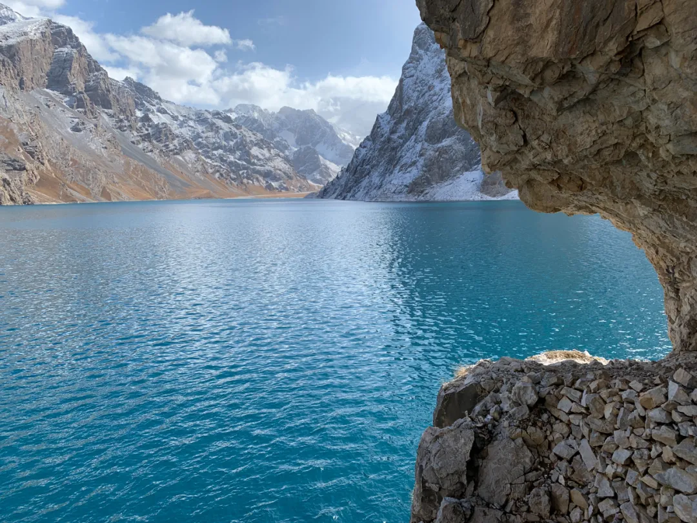

去年自驾游时，我曾花了一个多月在新疆玩，印象最深刻的莫过于独库公路的美景。同为翻越天山的路，乌孙古道可以说是古时候的独库公路，离现在的独库公路也相去不远，所以它的景色肯定不会令我失望，唯一需要担心的就是能不能走下来了。

乌孙古道北起新疆伊犁特克斯县琼库什台村，南出阿克苏地区拜城县黑英山口，全场一百三十余公里，路上需要翻过两座达坂（雪山口），溜索过一条大河，并过河二三十次，难度不小。关键是行程相当紧凑，除了第一天热身十公里，每天都要走二三十公里山路，还是很有挑战的。难度8.5星，能走下这条路，全国所有徒步路线都可以去得。

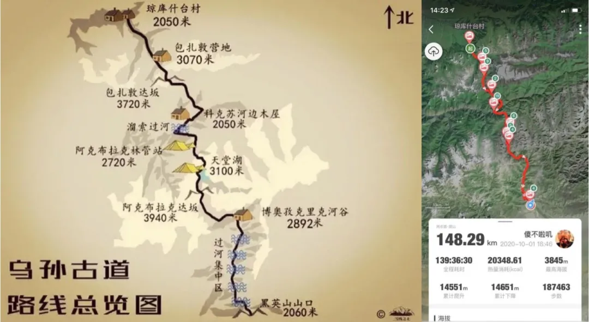

> 借队友傻叽哥的路书，全程近300里路。大起大落，相当酸爽。

这条路线有轻装与重装团，轻装徒步可以把帐篷睡袋相机食水都交由马背，会轻松一些。虽然我走过单人重装洛克线和轻装珠峰东坡嘎玛沟，不过自那时起又胖了十几公斤，轻装也跟重装差不多了。实话说走这种路心里还是略有发恘的，特别是领队还说国庆期间极有可能遇到暴雪。好在领队热情专业，觉得我肯定没问题，于是就这样愉快的决定了。（友情植入：星空户外，老板娘领队 花开 13760226846 各种西部徒步路线）

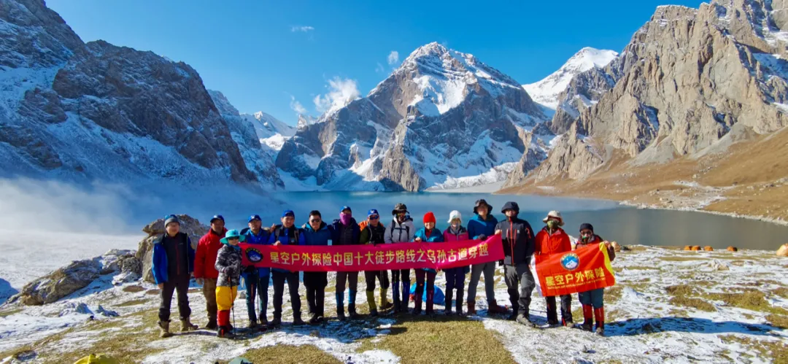

走完回头看其实难度也还行，而且旅程总体说还是比较幸运的，特别一路上的天气恰是到了好处：正好在天堂湖赶上了雪夜，看到了两种不同的景色；翻越雪山达坂时天气都还算不错；大风大雪都集中在最后三天；只要早一天或晚一天，整个行程的体验估计就会大打折扣。好啦，废话不多说，流水账来啦~。

 

## D0 准备

工欲善其事，必先利其器。对于徒步来说体能内力至关重要，但装备也是不可或缺滴。这条路线上有很多河要过，因此一个防水的驮包是必须的，衣服睡袋泡水打湿了那就直接GG了。一些药品，路餐能量棒，日用杂物和手持云台则随身携带。托UL装备的福这俩大包搁一块儿也才十五六公斤，还没我随身携带的脂肪多呐。大红驮包我直接顺丰快递儿到到起点酒店，也不用在路上扛。不过注意无人机是不能邮寄到新疆的，必须人肉抗过去。

> 轻装徒步的装备也不少

10月1号正式集合出发，我是30号早上的飞机，从北京转库尔勒，再经由阿克苏飞抵伊宁，可谓一波三折。在飞机上鸟瞰这次要翻越的天山，感觉还是比较壮观的。

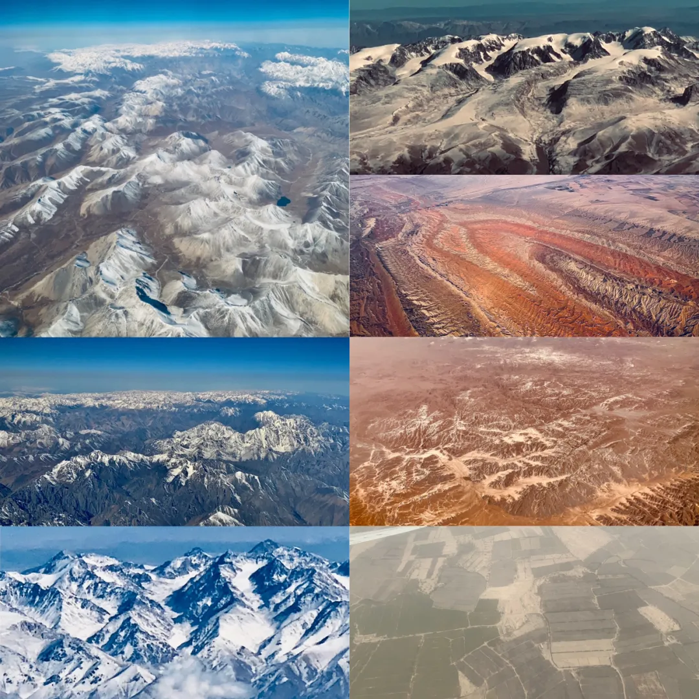

> 问苍茫大地，谁主沉浮？

## D1 启程

10月1日，晴。今天是国庆节，也是中秋节，也是徒步的第一天。按计划是从伊宁出发，去特克斯县采购路上用的锅碗瓢盆柴米油盐，然后坐几个小时的车到徒步起点琼库什台村，走十公里到哈萨克领队沙狼家里过夜住宿。

特克斯是个好地方，有着非常独特的八卦布局，据说是一座没有红绿灯的城市，不过实际上是个噱头，就是把红绿灯用交警替代了。去年自驾时我曾路过此地，并因错过著名的热气球鸟瞰项目扼腕不已。八卦城必须在天上看才有意思，所以这次我特意准备了无人机来弥补遗憾。

> 八卦城 特克斯 新疆很多市县区域内禁飞，不过特克斯县是可以的。

县城不大，所待不长。午饭吃了羊肉抓饭和红柳大串儿，之后就是采购环节：馕饼米面、蔬菜水果、锅碗瓢盆，调料炊具。当然还有户外神器 —— 姨妈巾。另外伊犁当地的著名特产——吊死鬼杏干也让人相当怀念。

整备齐活后正式前往琼库什台村啦，路上能看见“立体人体草原 —— 喀拉峻“，不过十月份都已经一片青黄，不好看了。路上比较悲催的遇上铺路施工队，延误了很长时间，结果到达起点琼库什台村时已经是17点多了。

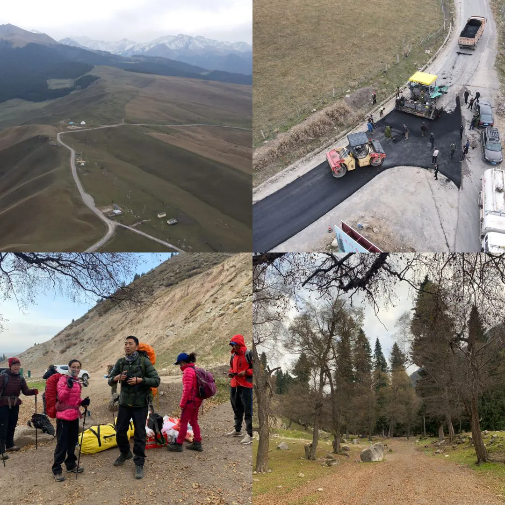

> 琼库什台坐落在高山草场之间，周围树木环绕，环境怡人。柏油路正在修建，据说这里就是下一个禾木村 & 喀纳斯。

从琼库什台到领队莎木家还有十几公里山路要走，这算是第一天的热身吧。

路上风景还算怡人，只是天色渐黑，到莎木家中时已是晚上。莎木宰了一头羊招待我们，现烤的羊肉串真的是香啊，就是盐放的有点多。从今天开始就没有手机信号了，这里也是最后的电力补给点，后面就只能靠充电宝了。不过莎木家自己也是用的太阳能电板和蓄电池，三个充电口实在是供不应求啦。

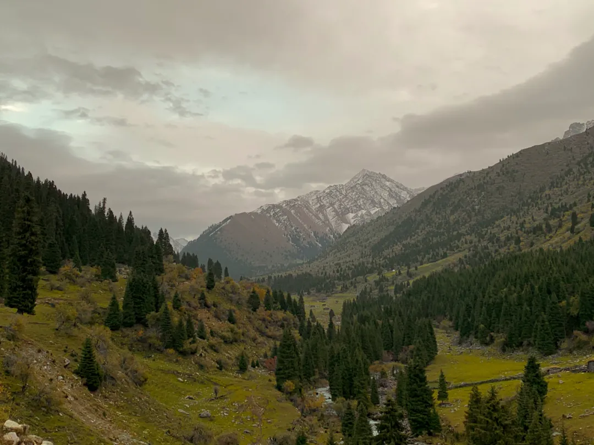

> 沿途风光

晚上大家坐在大通铺床上，围着桌子吃中秋晚餐，做自我介绍。尽管此刻我们依然萍水相逢，尽是他乡之客，略显拘束。但根据经验，从山里出来后，我们一定都会成为很好的朋友。

说起来，我发现睡在我旁边的哥们（海哥）带的装备几乎和我一模一样：衣服裤子枕头睡垫耳塞还有各种乱七八糟的杂件。正好我也是剑宗，对装备略知一二，衣服我一摸手感就知道是啥型号了，都是很有品位的选择哈。瞩目的就是海哥带的睡袋是SeaToSummit SparkIII 400克充绒的羽绒睡袋，我有一条一模一样的，但怕太冷就没带这一条。于是海哥诚邀我在接下来几天共享帐篷抱团取暖，我也木有想到，世界就是这么奇妙，就因为这样的契机遇到了知己…那就是后话啦

> 剑宗加械师（自封）合影

## D2 翻山

10月2日，晴。早上收拾整备，开始了第二天的行程。今天是比较虐的，如果说昨天走十公里只是热热身，那今天难度就直接拔升到走28公里，翻海拔3720达坂，红红脸，出出汗。当初我走过比这虐的多的，但好汉不提当年勇，今非昔比，这一天的路还是虐了我一把。

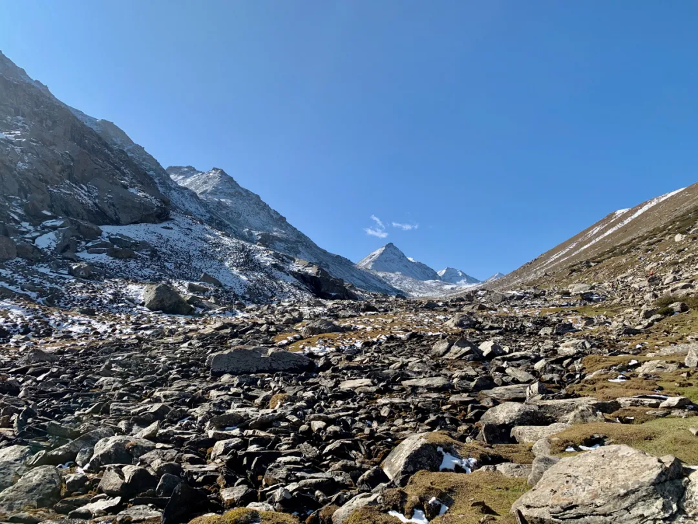

> 路上的第一座达坂——包扎墩达坂

早上吃了羊肉汤泡饭，油满出发。开始的路平淡无奇，漫步山间，缓慢爬升。但慢慢地就有点吃力了，我在河边多歇了一会，前队就跑没影儿了。等我吭哧吭哧赶到达坂脚下，又完美错过了中午烧水喝茶。好不容易看到前队的影子，一泡屎的功夫又无影无踪了。于是乎我就不前不后的落单了…

因为不喜欢戴帽子，凌冽的风吹的我脑壳疼，翻山就变得煎熬起来。漫长的爬升对体能也是巨大的消耗。每次刚翻过了一座山头，结果又出现了一个大坡，实在是让人抓狂。好在总有比我走的慢的路人，累归累，倒是没什么压力。

> 天高地迥，觉宇宙之无穷。遥望天山，登包扎墩达坂，

费劲千辛万难翻越达坂后，就是另一个折磨人的大下坡了。常言道，上坡如吃屎，下坡如拉稀。刚才吃了多少，现在全都要一口气再拉出来。不过比起爬升，下坡总是令人愉悦的，而且这种雪山草甸溪谷的景色也令人心情舒爽。走的长了，鞋袜也几乎被汗水浸泡湿透。路上找了个大石头，脱了鞋子晒会太阳，实在是惬意。

> 翻过达坂后

下山路上碰上了前队回来接人的大海，总算不是一个人在徒步了。一个人走的时候总是想坐下歇歇，一起走就快多啦，终于在黄昏时分赶到了营地。营地有一个小木屋，50块一位可以睡大通铺。虽然脏兮兮的而且只有一间房，但还是比外面暖和多了。

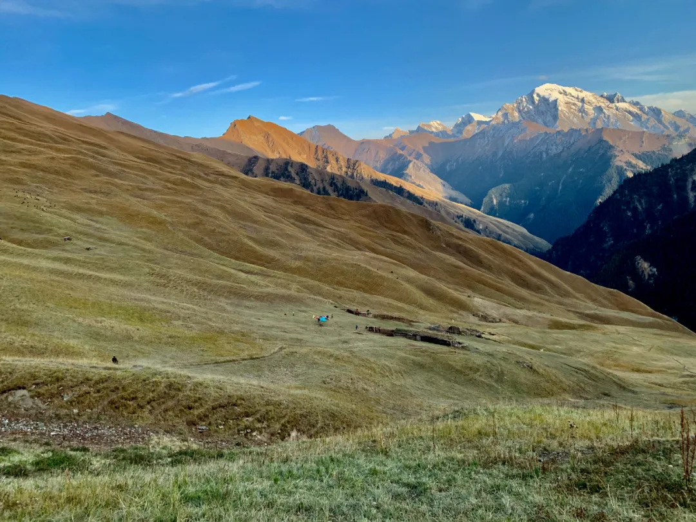

> 半山腰上的小木屋营地，大斜坡上扎帐篷可不容易。

半夜里，另一个队伍的领队进来说他们队丢了一个人，想向我们队借一匹马去找。他一说，我发现自己竟然还在路上见过她，唠过几句。好在第二天得知那个人没啥大碍，自己走不动路上扎营了。

今天翻过的是第一个达坂，第五天翻第二个达坂时，虽然坡更大路更长但却轻松的多。后来我总结了一下，主要是这么几点原因：翻山不戴帽子风吹脑壳疼；鞋子没垫姨妈巾脚疼；带了一堆没用上的东西太重；路餐就带了俩能量棒，还没翻山就吃完了；落单了一个人走实在是太无聊。

晚上吃手抓饭，大海的手艺相当给力，当然也可能是因为饥饿是最好的调味料…。晚上烤火把营地穿的棉裤烧了一个大洞，让我好生郁闷…

## D3 过河

10月3日，晴。今天从小木屋出发，要沿着阔克苏河行进，坐索道过大河后再过八次小河。今天的意外惊喜是，听说路上（索道边）竟然会有一个小卖部！我们都无比期待能在山里喝上一瓶肥仔快乐水。

> 阔克苏河畔的金胡杨

昨天折腾的不轻，本来还准备今天骑马放松一下，给后面几天省点力气。没想到睡了一觉体能全恢复了，于是决定继续徒步前行。

> 尔曹身与名俱灭，不废江河万古流

阔克苏河的景色相当不错，很有喀纳斯河禾木河的神韵，都是这种碧色的河水，加上两岸金色红色绿色的针叶林，给人一种瑞式风光的感受。

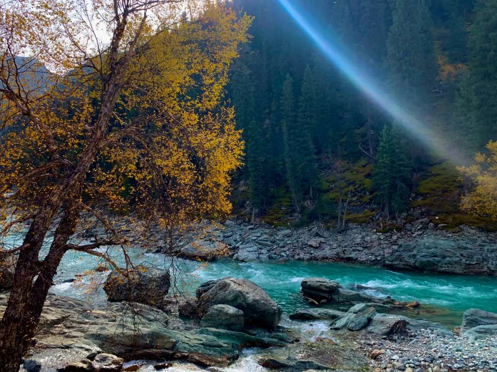

> 阔克苏河岸
>
> 这里据说明年会被开发成景点，要收门票了

走到中午，就到溜索点了，有个小卖部。这种深山老林里竟然还有土路能通车，让人意想不到。小卖部那是相当磕碜，也没有我们心心念念的肥仔快乐水。只有几种商品：乌苏啤酒，泡面，西瓜和羊肉。泡面和乌苏都是10块，可谓良心价中的良心价。其实就这一个补给点，老板真要卖一百块我也会买的。第一次感觉啤酒和泡面是这么的美味，我吹了两瓶大绿棒子，又买了两瓶灌到水袋里。乌苏确实挺猛的，两瓶下肚感觉晕乎乎的，还好我没有酒后驾马…

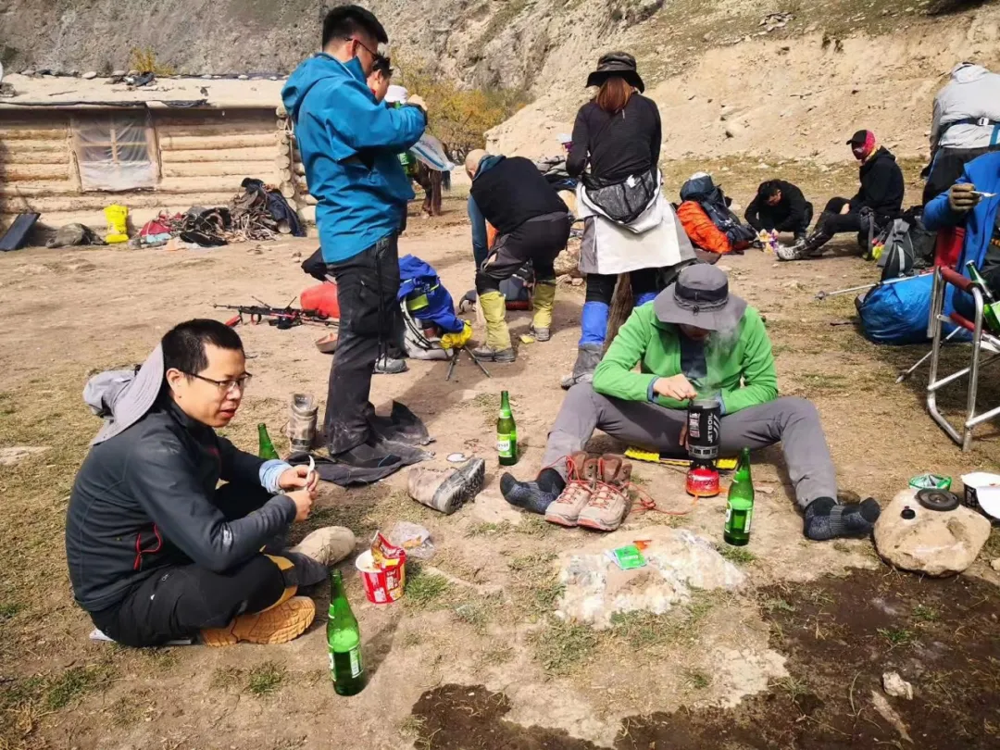

> 一人一瓶大绿棒子，夺命大乌苏。WUSU倒过来就是“NSNM（弄死你们）”，故名夺命大乌苏。

酒足饭饱后，就要过溜索过河了。这个索道当然不是滑雪登山那种电动索道了，而是两根溜索，好在不是那种手抓着溜过去而是有个篮子。人靠重力滑到河中央后，对面用绳子把篮子拉过去。

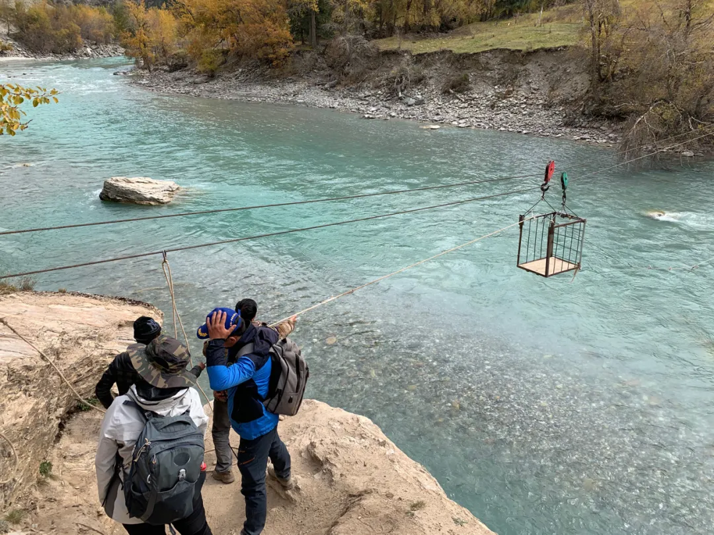

> 一索飞架南北，天堑变通途

过完索道之后的路，主要是穿林子与过河。今天要过八次河，我们轻装徒步的队伍雇有马帮，可以骑马过河。但重装徒步就得脱鞋换溯溪便鞋人工过河了。过河是一件挺有风险的事情，这里的河水温度很低，大约四五度的样子。手脚伸入河水中几秒就能冻麻了，多泡一会很可能就该抽筋了。若是不慎湿了身，那后面几天必定很煎熬。特别是重装如果在河里不慎跌倒，如果来不及解开大包，很容易就被水流连包带人一路冲走，前两年这里就这样死过人，导致乌孙古道一度被封锁，就连现在走也都必须事先向特克斯县文体局申请与报备。

> 乘马过河的海哥笑开了花

当然说归这么说，实际上秋冬季的河水不大也还好，特意准备的溯溪鞋也没怎么用上。

骑马过河还是挺有趣的，伊犁这里的马身强体壮，都是一马驮四包（近两百斤），骑俩壮汉问题也不大。我也勉强算会骑马，来两次就可以飞身上马甚至带人过河了，嘿嘿…

今天的营地有一个林管站蒙古包，应该是路上最后一个住宿点了，后面就全都得扎帐篷了。明天就是天堂湖了，有点儿期待。

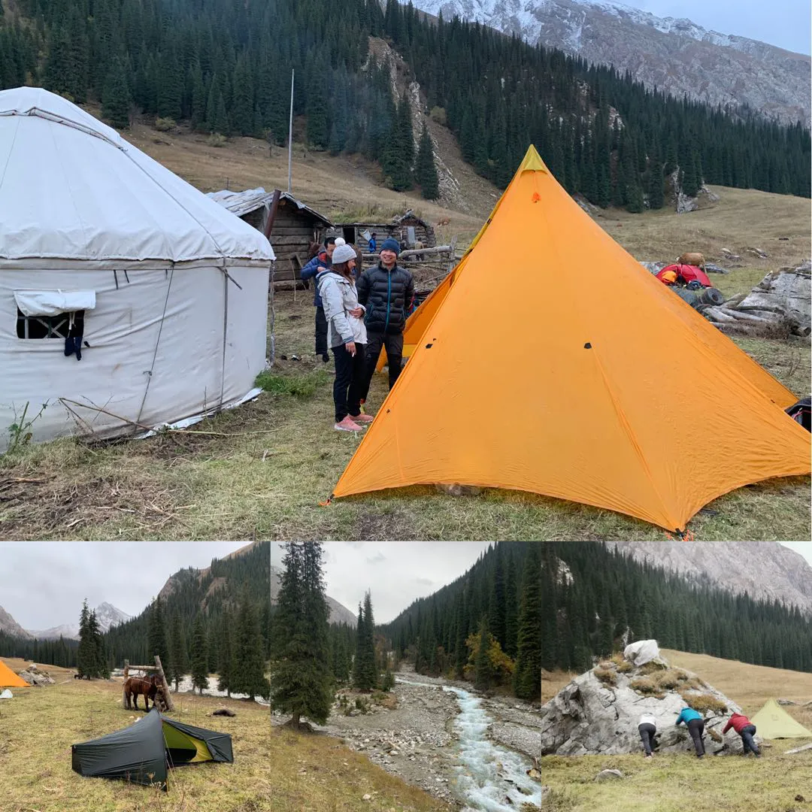

> 炊事帐篷 / 我的垃圾袋黑帐篷 / 三个傻瓜推石头

晚上在轮流唱歌和真心话大冒险中愉快地度过了，姨妈巾作为吸脚汗防鞋湿的紧俏战略资源，成为了我们的硬通货赌注，而猜小魔仙的体重则成了我们快乐的源泉。

## D4 天堂湖

10月4日 霜雪/晴。今天要走8公里，翻越一个达坂到天堂湖。下午就可以到营地，比较轻松。

早上地面结霜了，还是有点冷，但这阻挡不了我们奔向天堂湖的热情。大伙踩着硬邦邦的冻土兴冲冲地踏上了前往天堂湖的最后一程路。

> （还好不是前往天堂的最后一程路）

前三天走完，我已经适应了徒步的节奏，能跟上第一梯队了。但又是停下来一泡屎的功夫，前队又跑的无影无踪了。这一次我仔细研究了等高线地图，发现从另一侧的野路子翻过去看上去好像可以节省好几公里的路，准备抄个近道捷足先登。

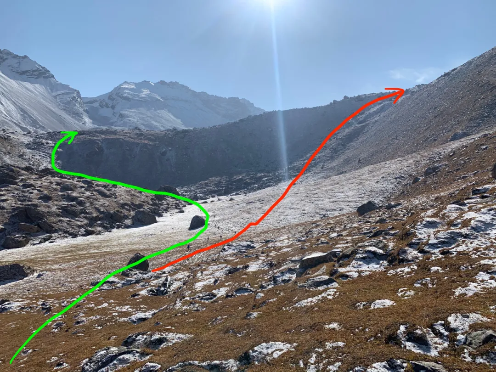

> 望山跑死马，看着像个小山坡，实际上是一堵几百米高的山墙

不过走上这条路之后我就有点后悔了。望山跑死马，照片是体会不到山伫在面前的那种效果的。只有人亲自站在上面时才会发觉这条"路"有多么卧槽。沿着陡峭的山壁往上爬，太阳又不巧正挂在山尖，让人无法直视前方。我就像伊卡洛斯一样，沿代达罗斯通天梯走向太阳，不小心失足可就真成千古恨了。

费了九牛二虎之力爬上山脊，还没来得及高兴，结果发现山顶上全是嶙峋的巨型乱石，根本无路可走。好在天无绝人之路，使出各种腾挪跳跃翻滚攀援的功夫，总算是从山的另一边下来，回归正途了。所以经验教训就是：如果马队不走这条看上去近的多的”野路“，那肯定是有原因的。

好在绕了个艰难的近道后，总算是又追上了第一梯队。队友河上正好在策马奔腾，甚是潇洒。

> 让我们红尘作伴，活的潇潇洒洒。
>
> 策马奔腾，共享人世繁华。（大海摄）

翻过最后一个小山包后，天堂湖蓦然出现在我们面前。天堂湖是此行的精髓所在，原名阿克库勒湖，海拔3100，是一个高原湖泊。

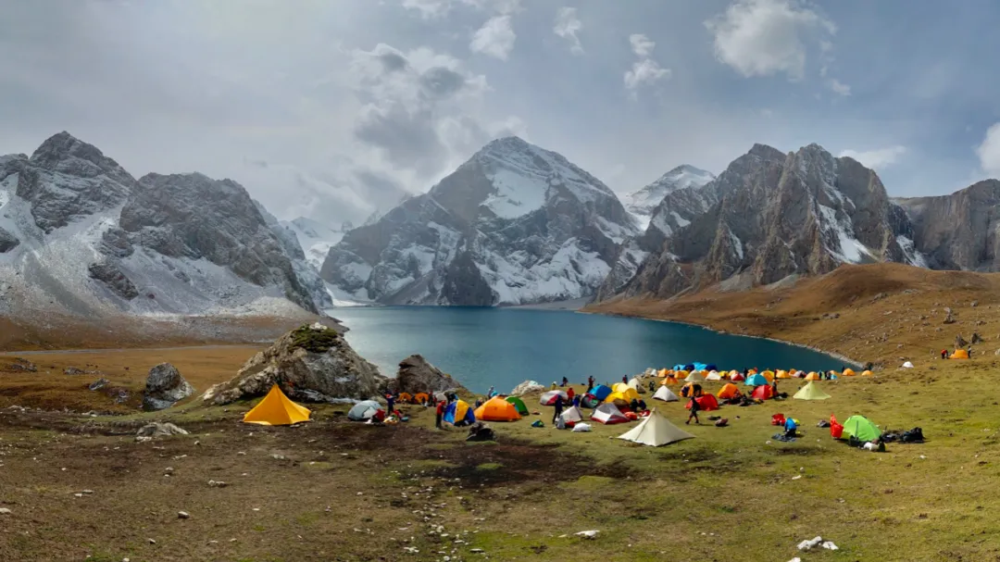

> 湖畔营地，如果有带充气皮筏艇该多好呀

翻过最后一个小山包后，天堂湖蓦然出现在我们面前，至此这几天辛苦的跋涉总算告一段落。下午，我们安营扎寨然后自由活动。我趁着天气还行飞了趟无人机，然后就坐在湖边，和几位小伙伴一起嗑瓜子，赏美景，聊大天，好不欢快，心情极为悠扬。

> 我们的“湖景房”就在湖畔巨石旁

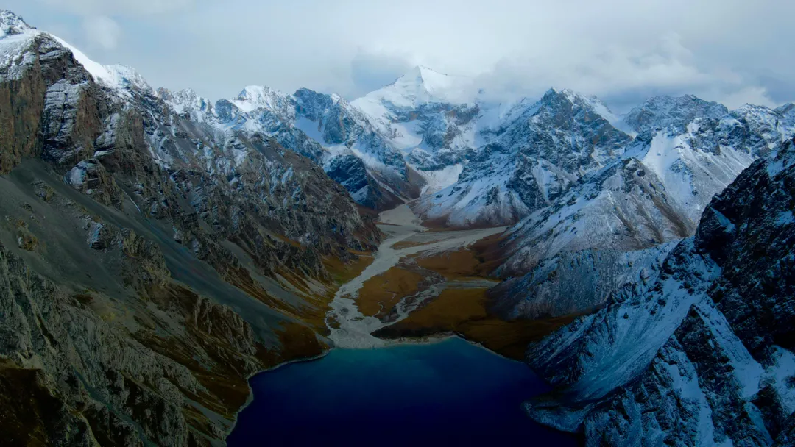

> 时维鹰扬，俯瞰天堂湖的另一侧

另一边，各路神仙也开始做法，拍起了大片。

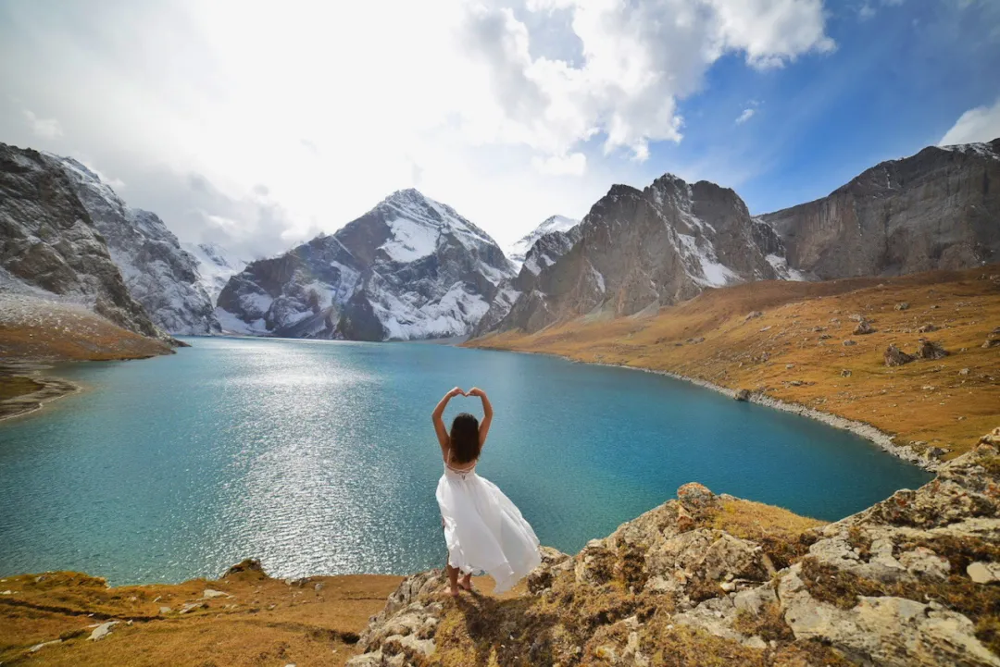

> 队友小魔仙不惧严寒，穿上了裙子拍皂片

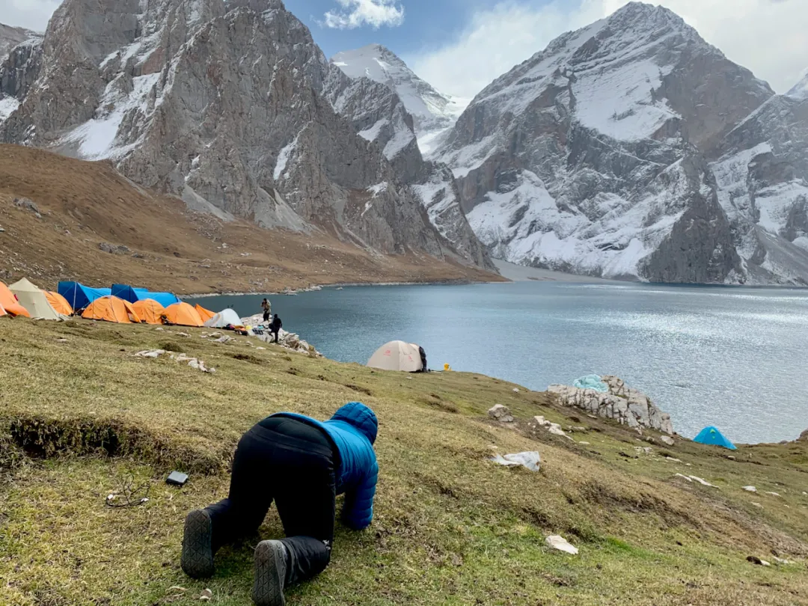

> 祈祷转山磕长头？没有，也是在拍皂片…

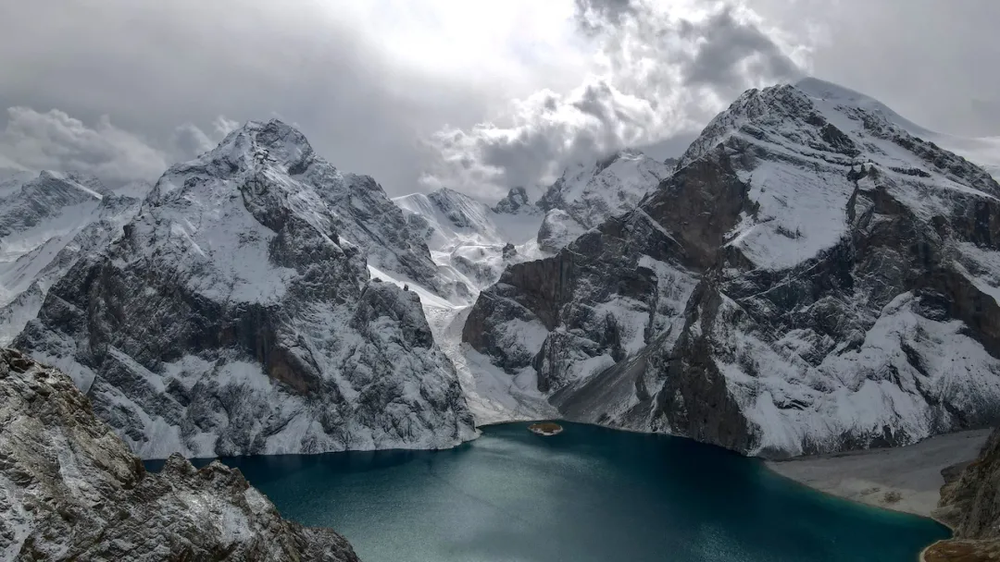

> 对岸的雪山傲然伫立

晚餐很丰盛，煮了三锅火锅。大家说要为我庆祝生日，虽然我生日并不是精确的这一天，但能有个由头一起吃饭喝酒也是很开心的。领队花姐特意带了一瓶威士忌，几杯酒下肚，人就晕乎乎了。没有蛋糕和蜡烛，那就吹炉头许个愿哈。就盼望明年也能再来一场这样的徒步吧，要是能和队友再聚就更好啦。

> 我们的营地在群山之间

晚上，是这次行程中第一次住帐篷。我和海哥一起住他的双人经典款MSR Hubba Hubba帐。夜色渐浓，二人在帐中秉烛夜话，开怀畅谈，相见恨晚。我们俩简直就像失散多年的兄弟，从装备选择到音乐爱好，再到世界观、理想、目标与策略几乎都一模一样，在北京的位置也才相距几百米。作为概括性总结，我们一致认为：如果自己是女的就嫁了，如果对方是女的就收了。

是夜，难以忘怀。我们一起在帐篷中共同演唱了共同的最爱 —— 音乐剧《悲惨世界》与《歌剧魅影》，一首接一首，根本停不下来，到十一二点方休。我唱Javert你唱Jean Valjean，你唱Marius我唱Cosette，你唱Christine我唱Phantom，你当House Keep我演老板娘。在以前，这种歌与剧都是我自己一个自唱自嗨，从未想过一起对唱有这么开心。人生苦短，知音难求呀。

> 在某位路人的游记中看到了我，唱悲惨世界的“叔叔”哭晕在厕所。

夜里突然开始下雪，但两个人的帐篷是很温暖的，我们都睡得很香。

夜里醒来从帐篷探出头去，雪已经积了起来，在皎洁的月光下，天堂湖与雪山散发出柔和的光芒。可惜iPhone没法捕捉这一刹那的感受

> 瀚海阑干百丈冰，愁云惨淡万里凝。

这种时候也只能看相机的了，好在队友大海还留下了一张夜景照片：

> 明月出天山，苍茫云海间

明天的旅途更让人期待了

 

## D5 雪山河谷

10月5日 大雪，今天是风景最美的一天，也是最虐的一天。我们要环天堂湖到对岸，途径著名的老虎嘴。然后爬升800米翻越海拔3950的阿克布拉克达坂，再下降一千多米进入博奥孜克里克河谷。

一晚过去，景色大变。忽如一夜春风来，千树万树梨花开。昨晚的大雪为天堂湖披上了银装。天堂湖展现出庄严神圣的一面，日照金山倒映在湖水中，薄雾像轻纱一般拂动在水面上，气氛突然西藏起来，让我感觉仿佛回到了珠峰东坡一般。

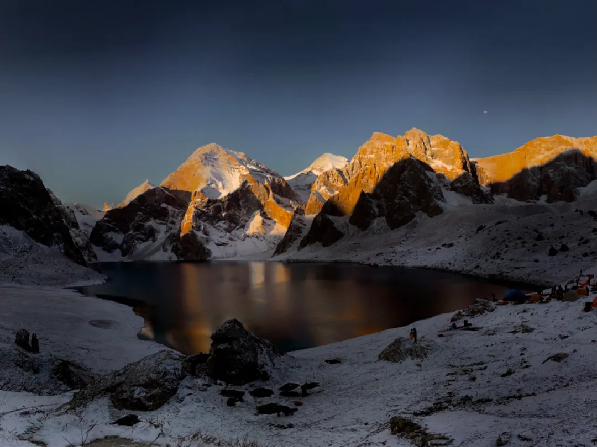

> 阿克库勒，日照金山

> 笼着轻纱的梦

如此良辰美景，正是无人机大显身手的时刻。营地离著名打卡点老虎嘴还有几公里的路程，但飞过去只要两分钟。我准备捷足先登，飞过去拍到老虎嘴的第一抹日光。不料乐极生悲，老虎嘴实在过于凶险，前一刻飞机还平稳机动，刹那间画面便天旋地转。也许是电池低温动力突失，也许是避障失灵撞上山崖，不知不觉就炸机了。一刹那恍惚，若有所失的感觉。啊，我的视频还没拷出来呢~。

怀着惆怅和希望，我开始了环湖之行。天堂湖岸边的景色确实很美，很快就让我忘记了炸机的悲伤…。在湖畔，有一片铺面鹅卵石组成的沙滩，从这里望向湖面，波光粼粼，甚是美丽。

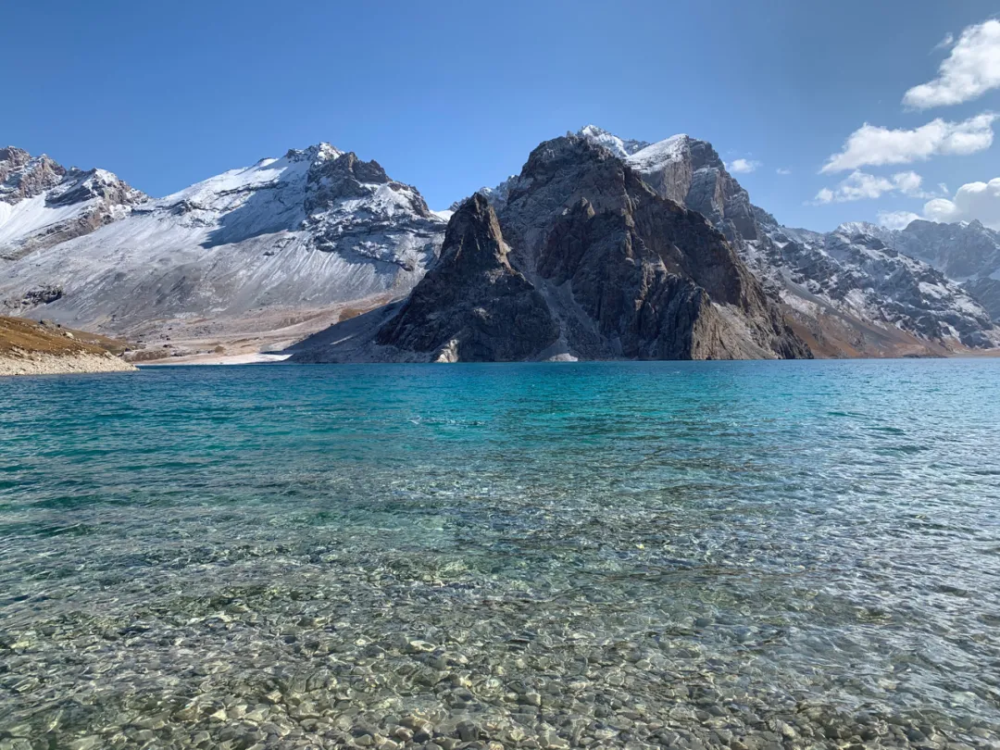

> 天堂湖畔

过了鹅卵石滩，就到了老虎嘴，那张著名的国家地理封面照片就是在这里拍摄的。我检查了一下地形，确认无人机毫无生还可能之后只得长叹作罢。就当我献给天堂湖的礼物吧，希望她不要嫌弃…。这么美丽的景色前可没时间哀悼，我们一行也难以免俗，化身阿姨旅行团，拿起手机咔咔咔。在这种地方不管手机相机无人机，张张随手是大片。

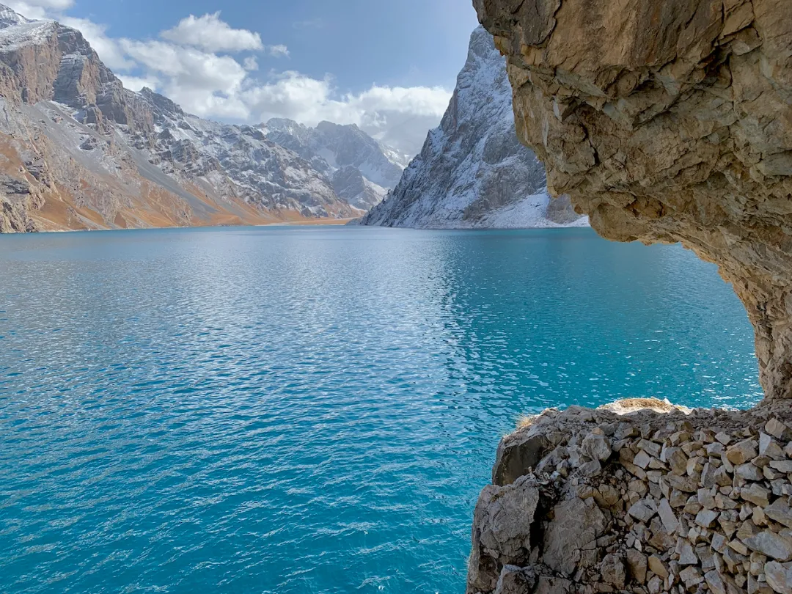

> 老虎嘴

老虎嘴附近，有一段穿凿于岩壁里的隧洞，从中穿过，恍有时空穿梭，柳暗花明之感，恰如优胜美地之Tunnel Vision，亦是绝佳拍照之地。

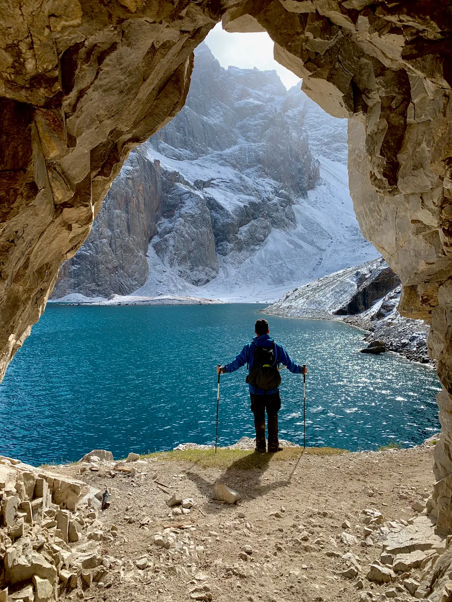

> 不知道两千年前的解忧公主，是不是也从这个隧洞中走过呢？

出隧洞后没多远，就绕到了天堂湖的另一侧。要开始了旅途最虐的一段路了—— 翻越阿克布拉克达坂。阿克布拉克达坂海拔约3900，从3100的天堂湖起有800米爬升。主要是终年积雪，需要穿冰爪，翻雪山，路不太好走。听说前面有马队在摔死了一匹马，就是在这个达坂上。

> 翻越阿克布拉克达坂的路线

幸运的是，尽管昨天晚上下了一夜雪，今天上午的天气却相当给力。天公作美，一片晴朗，翻山的难度降低不少。

> 天气还不错

翻雪山需要冰爪，不幸的是，我的两只冰爪在第二天翻达坂时走丢了一只。只有了一只冰爪让我更深刻地体会了冰爪的效果：在半冰半雪的山路上，带冰爪的脚一直很稳，而没带冰爪的那只脚经常是走一步滑小半步。

我和海哥的脚昨天都扭了一下，不过问题不大。我、海哥，德国，阿辉一行四人组成了北京小分队，作为中队前进。阿辉是第一次徒步就敢报乌孙的猛士，前几天不太适应，经常走在最后。但却坚持了下来没有骑马，今天毅力十足地跟上了中队，让人刮目相看。

翻越达坂的路漫漫，翻过一个山头又会出来另一座山。但在半路上，有一个山间的盆地，盆地间有一个冰湖。这里万籁俱寂，别有意境。天地间仿佛只剩下黑白二色，简直是一副天然的水墨画。

> 队友叶子一骑天涯，化为了群山间的一个墨点。

 

一路吭哧吭哧向上爬，回身俯瞰，天堂湖越来越小。天堂湖和半山腰的和冰湖组成了一个感叹号，仿佛告诉我们：“哈哈，你们的好日子要到头啦”。

> 京城小分队 （大海摄）

最后冲顶的一段路确实比较虐，坡度很陡，山风也很大。好在天气晴朗，多费点力气也就吭哧过去啦。

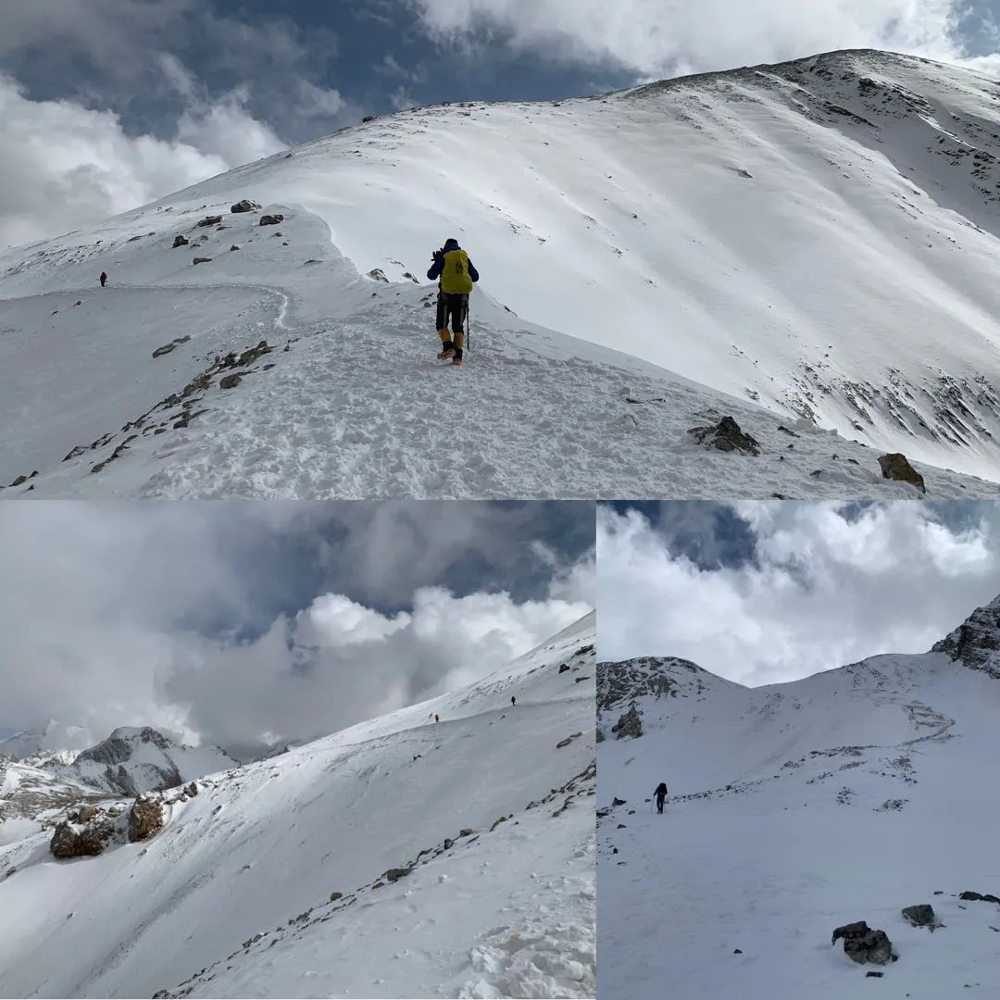

> 长长的路啊，就要到尽头

翻过达坂后，剩下的就都是下坡路了。从阴面翻越到阳面，太阳的热情将冰雪融化，山路冰雪泥沙夹杂，一片稀烂。走着走着，天色慢慢地就阴了起来，最开始是零星的冰粒，很快就刮起了风，飘起了雪花。我们不禁暗自庆幸，要是稍微晚一点点，这种天气山可就不好过喽。

走过一段漫长的稀泥碎石大下坡后，就进入了博奥孜克里克河谷。这条河将一直伴随我们走出天山，接下来的路几乎都是从源头沿着河水下天山啦。但是它也是接下来几天最大的麻烦：路与河来回穿插，我们要来回穿越它二三十次。

过河是挺危险的一件事，稍有不慎湿了鞋，那接下来的路程都会很艰难。如果更惨一点摔到河里了，那基本上可以直接选择下撤了。今天过河是没有马帮…，所以我们得自己踩着石头过河。河里的石头很多看着正常，但上面长满了奇滑无比的藻类，很容易就会翻车。好在我有点敏捷天赋，这种事情可难不倒我。但我挺担心走在队伍最后的伟锋…，他走到这里时天可能已经黑了，那样子过河就很艰难了。

> 队友大海、小敏、辉哥走在河畔岩壁上
>
> 我为什么在对岸？因为我跳石头过来啦~

说来也奇怪，本来翻达坂的时候我还累的不行，脚踝和膝盖都隐隐作痛。但在河谷里的后半程我的体力却异常充沛，越走越来劲，跑在最前面探路，走着走着就很容易把队伍甩开一大截儿。也许雪天在野地里找路是一件很有趣的事情，让人找到了探险的感觉，也许就兴奋起来了。

河谷里有不少动物的尸骸 ——  好几匹死马，北山羊头，特别像《荒野猎人》里的样子。

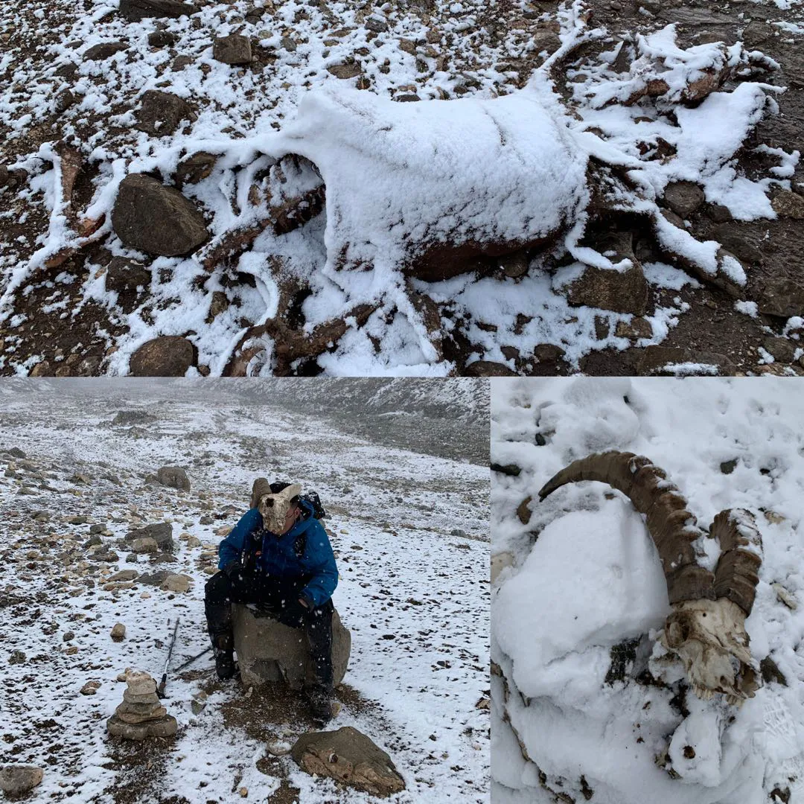

> 死马点公园，假装是萨满

路上，我们遇到了徒步中国的队伍。他们是一个50个人特大团，乌央乌央的一群人，在天堂湖和我们一起扎营。他们比我们早出发两个小时，竟然还被我们追上啦，人多也没办法。我看他们好像一路上都比较焦灼的样子，听说好像是弄丢了俩人还是有人掉河里了。后来才知道他们的马帮因为大雪没有翻过垭口，摔了七匹马，丢了二十多个驮包，而且马帮现在还没有过来。在这种天气要是没有装备过夜，那弄不好真要出大事的，不禁为他们捏一把汗。

晚上的营地扎在河谷里的一处平底上，到营地时雪下的更大了，到底是下午、黄昏、傍晚也是压根分辨不出来了。在大雪中扎营还是挺冻手的…。伟锋最终还是在天彻底黑之前赶到了营地，让人放下心来。他说自己直接硬淌水过的河，在这种环境下比起掉河里的风险，湿个鞋确实是个明智的选择。

> 纷纷暮雪下辕门，风掣红旗冻不翻

我和海哥依旧住他的Hubba双人帐，而我自己的单人帐就给阿辉住了。晚上，我们围在漏风的炊事帐里围着饭锅取暖。尽管因为丢了高压锅气阀，米饭还有点夹生，但大雪之中也顾不上这许多，热气腾腾的手抓饭显得格外诱人…

> 饭盆就位，虎视眈眈

晚上十二点多，徒步中国的马队从我们的营地经过了，起码他们不至于在山里冻死了。但想想他们一群人在风雪中饥寒交迫的傻等了六七个小时，到凌晨三四点才能挤在仅剩的帐篷中瑟瑟发抖，也确实是蛮惨的……

 

## D6 风雪

10月6日 雪，今天离出口还有四十多公里，继续沿河谷下行25公里。

早上起来，雪依然不停。随便糊弄了一下早饭，我们就出发了。告别了旅途中最美的一段路，加上昨天一整天在风雪中长途跋涉，我们都想着早早出山，好好洗个热水澡舒服一把。要是能找个地方按按脚，来个大保健，那就更好啦。

没过多久，我们就看到了徒步中国队伍的营地。昨天他们缺少装备没法扎营，但是傻站着又会冷，所以他们只得继续往下走，最后选在了这里扎营。

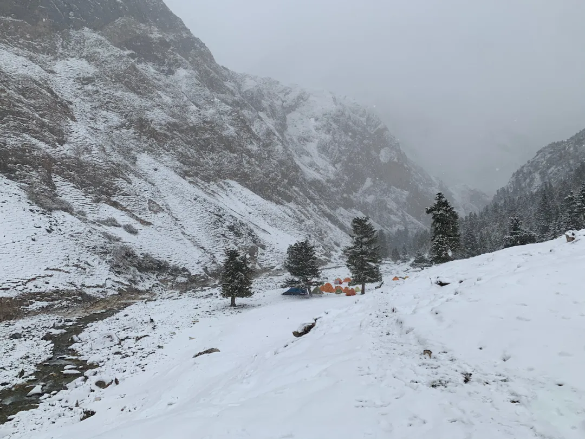

> 帐篷看上去比天堂湖少了不少…

经过他们营地时已经是十二点了，领队嘱咐我们：偷偷地进村，打枪的不要。昨晚三四点睡的话，那是得多补补觉。摔了七匹马，丢了二十多个驮包，还好人都没事，没有搞出大新闻，想来对他们也绝对是难忘的体验了。

往下走，海拔逐渐降低，周围从光秃秃的山，渐渐开始出现针叶林，灌木丛，绿色植被。路程也开始轻松起来，大下坡很省力，可以边走边唱歌，我就走一路唱一路。

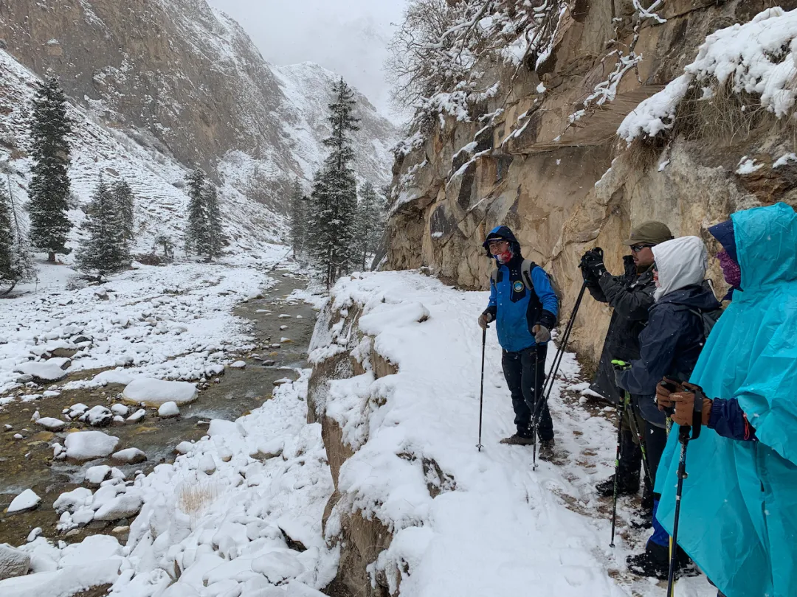

> 我们的领队兼厨师兼马帮兼地主 —— 沙狼

伟锋今天和我们走在了一起，因为过河需要集中一起过，所以今天就不分前队中队后队了。几天的磨练把精致的上海大摄影师变成了牧民…

> 十八变

今天的营地风很大，估计能有六七级。难得营地周围有不少树，本想弄点柴禾烤烤，但这种妖风里估计能把整个山给点咯，遂作罢。

在这么大风里扎营我也是第一回，这种鬼天气做饭估计都困难。我和海哥一商量，准备开小灶了。我去打了水，在帐篷里烧了三包”出前一丁“拉面，再加上俩金枪鱼罐头，实在是美极了。帐篷外狂风呼啸，任尔风吹雨打，我自岿然不动，在这一方小天地中安然吃面，实在是太幸福啦。

吃完小灶吃大灶，出去一看，发现炊事帐篷在大风中扭曲摇摆，已经摇摇欲坠。我们用了很多石头压着风绳都不够，还需要一群壮汉在帐篷里撑着。

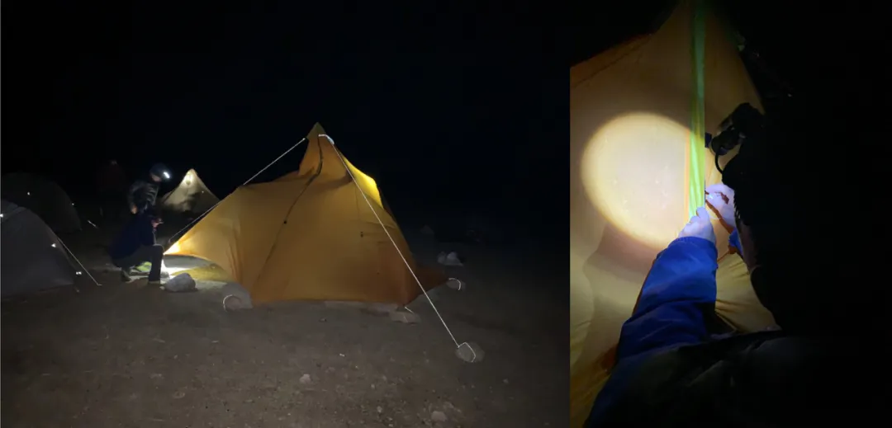

> 傻叽哥现场缝纫技术教学

奈何狂风之下，做饭的帐篷最终还是难以支撑，一阵狂风吹开了帐篷，帐篷在哀鸣声中散架了…，锅碗瓢盆在风中凌乱。悻悻然，还好我俩开了小灶……

狂风也不是一无是处，虽然没有篝火烤鞋子，但好在刮风不下雨。晚上睡觉前把湿漉漉的鞋子鞋口迎风，一晚上就吹的干干的。

晚上起夜，看见了银河，星汉灿烂，不过这种美景显然超出了手机的能力范畴，一路的夜景都提醒我该赶紧换个新iPhone了。

 

## D7 Exdous

10月7日 大风，今天将沿河谷出山，过河十余次，出黑英山口

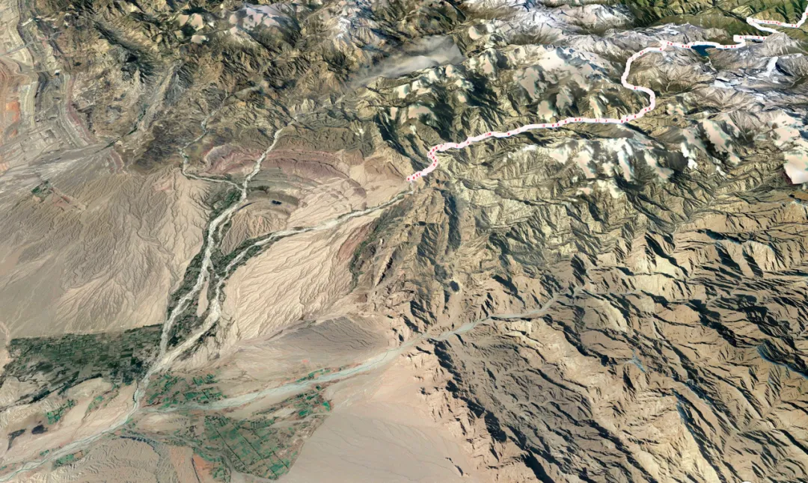

> 出去就是南疆了，一望无际的塔克拉玛干沙漠

早晨的风依然很大。一夜的大风吹去了所有尘埃，天空显得异常地澄澈。让我想起北京的APEC蓝，梦之蓝。天上的云也很有意思，就像一只羽毛翅膀，乘风翱翔。

> 大鹏一日同风起，扶摇而上九万里

这么大的风，加上狼藉的炊事帐，今天就不做早饭了，让人沮丧。但领队花姐告诉我们，今天出山的车队已经买好可乐、烤包子和大绿棒子等着我们啦。士气遂大振，我们又燃起了希望。大家都盼着赶紧出山，找个酒店洗个澡然后大吃一顿。尽管风景也还凑合，但都顾不上拍照啦

> 七剑下天山

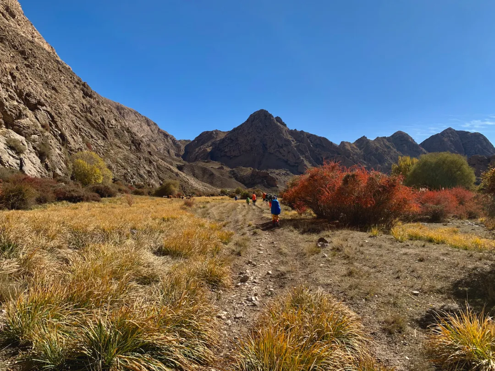

> 红黄蓝绿

前几天过了很多河，大家早已轻车熟路。

一番跋涉后，我们终于走到了出山口。穿过这个山口，就是南疆了。

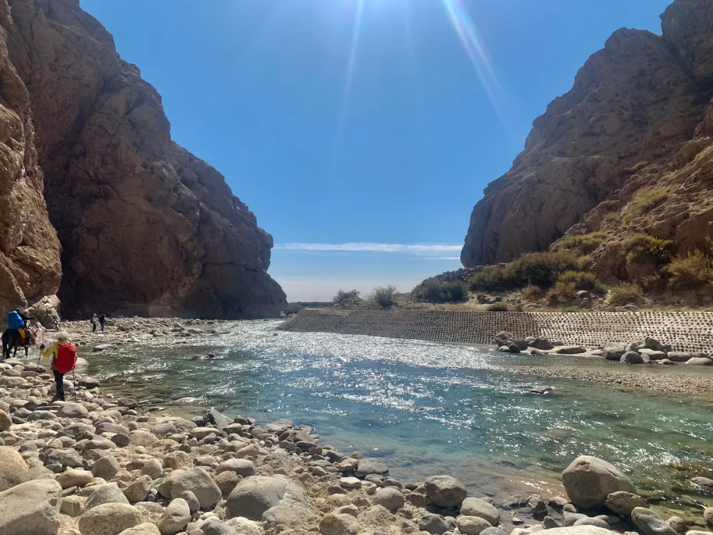

从北疆伊犁特克斯县走到南疆阿克苏拜城县，全程走了有接近三百里路，翻过天山，也还真是不容易。其实说累倒也并不怎么累，只是走到这里，就又到了快分别的时刻了，心里难免有些不舍。

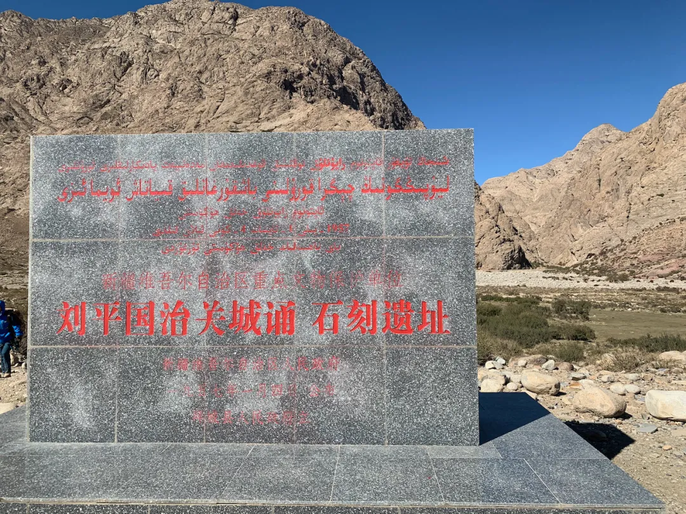

至此，乌孙古道的徒步旅程就此告一段落，但是，路上的故事才刚刚开始。感谢我的队友们：花开、沙狼、海哥，叶子、大海 & 小敏、傻叽、和尚、小魔仙、德国、阿辉、伟峰、舒姐，旅行的快乐不止在于看到怎样美丽的风景，更在于同行的人。这是一段难以忘怀的美好体验，期待下次与你们一起同行~

## 后记

- 视频BGM：《Silus Mountain》，译为《天狼山脉》，甚是应景
- 队友大海的游记：http://www.8264.com/youji/5621771.html 专业摄影师，值得信赖！
- 某路人的游记：https://zhuanlan.zhihu.com/p/264891400  竟然在里面看到了我们。
- 对乌孙古道感兴趣？请联系星空户外，认真负责的老板娘领队：花开 13760226846。
- 其实有全程骑马的选项的哟，只要装备齐全，感兴趣的朋友还是可以尝试一下。

**Fin**